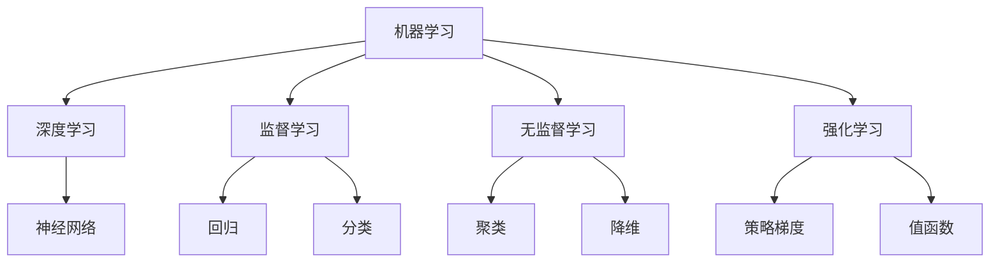
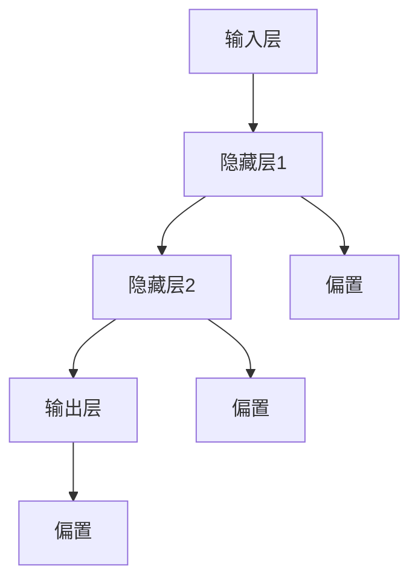
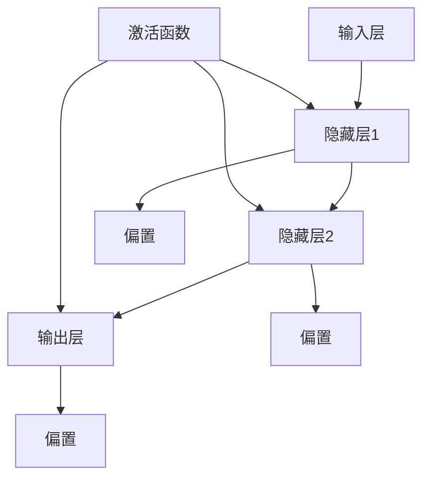

                 

关键词：人工智能，未来计算，算法，数学模型，应用场景，技术趋势

## 摘要

本文旨在探讨人工智能（AI）在计算领域的发展及其对未来计算的影响。通过梳理核心概念和算法原理，本文分析了当前 AI 技术的优缺点和适用领域，并运用数学模型和公式进行详细讲解。在此基础上，本文通过项目实践展示了 AI 技术的实际应用，并对其未来发展趋势和挑战进行了深入探讨。文章最后总结了研究成果，并对未来的研究方向提出了展望。

## 1. 背景介绍

随着科技的飞速发展，人工智能（AI）已经成为现代计算领域的重要驱动力。AI 技术的兴起，不仅改变了人类的生活方式，也极大地影响了各行各业的生产方式。从语音识别、图像处理到自然语言处理、机器学习，AI 技术在众多领域展现出了强大的应用潜力。

在计算领域，AI 的应用主要体现在以下几个方面：

1. **数据处理与分析**：AI 技术能够高效地对海量数据进行处理和分析，为企业和科研机构提供关键决策支持。
2. **自动化与优化**：AI 技术可以自动化执行复杂的计算任务，提高生产效率，降低人力成本。
3. **智能预测与优化**：通过机器学习算法，AI 技术能够预测未来趋势，帮助企业和个人做出更明智的决策。

本文将重点探讨 AI 技术在计算领域的发展，分析其核心算法原理和应用场景，并探讨未来的发展趋势和挑战。

### 1.1 人工智能的定义与发展历程

人工智能（AI，Artificial Intelligence）是指由人制造出来的系统所表现出来的智能行为。AI 的定义和范畴随着时间和技术的发展而不断扩展。从最初的逻辑推理、知识表示到现在的机器学习和深度学习，AI 技术经历了多个发展阶段。

- **早期阶段（20世纪50年代至70年代）**：这一阶段以符号主义人工智能为代表，主要研究如何用符号逻辑来表示知识和进行推理。代表人物包括约翰·麦卡锡（John McCarthy）和赫伯特·西蒙（Herbert Simon）。

- **知识表示与专家系统（20世纪80年代至90年代）**：专家系统是这一阶段的重要成果，通过模拟专家的决策过程来解决问题。代表人物包括爱德华·费根鲍姆（Edward Feigenbaum）。

- **机器学习与统计学习（20世纪90年代至今）**：随着计算能力和数据资源的提高，机器学习成为 AI 技术的主流。以神经网络为代表的深度学习技术在语音识别、图像处理等领域取得了突破性进展。

- **强化学习与生成对抗网络（GAN）（近年）**：强化学习在游戏和自动驾驶等领域展现出强大潜力，生成对抗网络（GAN）则在图像生成和增强学习等领域取得了显著成果。

### 1.2 计算领域的核心概念与架构

在计算领域，核心概念包括计算模型、算法、数据结构和编程语言等。这些概念共同构成了计算的基础架构，推动了计算技术的发展。

- **计算模型**：计算模型是描述计算机如何工作的抽象概念。图灵机模型是计算理论的基础，而现代计算机则基于冯·诺依曼架构。

- **算法**：算法是解决特定问题的步骤集合。在 AI 领域，常用的算法包括机器学习算法、深度学习算法和优化算法等。

- **数据结构**：数据结构是组织和管理数据的方式。常见的数据结构有数组、链表、树、图等。

- **编程语言**：编程语言是用于编写计算机程序的语法和语义规则。常见的编程语言有 Python、Java、C++等。

### 1.3 人工智能与计算的联系

人工智能与计算密不可分。AI 技术的发展离不开强大的计算能力和高效的数据处理方法。同时，计算领域也受益于 AI 技术的应用。例如，深度学习算法在图像处理、自然语言处理等领域取得了显著成果，推动了计算技术的发展。

在 AI 领域，计算的核心作用主要体现在以下几个方面：

- **算法优化**：高效的计算可以加速算法的执行，提高计算效率。
- **数据处理**：计算技术可以处理海量数据，为 AI 算法提供丰富的训练数据。
- **模型优化**：计算技术可以用于优化 AI 模型，提高模型的准确性和鲁棒性。

### 1.4 当前 AI 技术的挑战与机遇

尽管 AI 技术在计算领域取得了显著成果，但仍面临一些挑战和机遇。

- **挑战**：包括数据隐私、算法透明性、模型可解释性等。
- **机遇**：随着数据量的增长和计算能力的提升，AI 技术将在更多领域得到应用。

## 2. 核心概念与联系

在探讨 AI 技术的原理和应用之前，我们需要了解一些核心概念和联系。这些概念包括机器学习、深度学习、神经网络等。以下是一个详细的 Mermaid 流程图，展示这些概念之间的联系：



### 2.1 机器学习

机器学习（Machine Learning）是指通过算法从数据中学习规律和模式，以便对未知数据进行预测或分类。机器学习可以分为以下几种类型：

- **监督学习（Supervised Learning）**：通过已知数据集来训练模型，以便对未知数据进行预测或分类。
- **无监督学习（Unsupervised Learning）**：没有已知数据集，通过探索数据中的内在结构来发现规律和模式。
- **强化学习（Reinforcement Learning）**：通过试错的方式，在特定环境中学习最优策略。

### 2.2 深度学习

深度学习（Deep Learning）是机器学习的一个分支，它使用多层神经网络来模拟人脑的神经结构。深度学习在图像识别、语音识别、自然语言处理等领域取得了显著成果。以下是一个简化的神经网络结构：



### 2.3 神经网络

神经网络（Neural Network）是深度学习的基础，它由多个神经元组成，每个神经元都与其他神经元相连。神经网络通过学习输入数据之间的非线性关系来实现复杂的数据处理。



### 2.4 其他核心概念

- **回归（Regression）**：回归分析是一种用于预测数值型目标变量的方法。
- **分类（Classification）**：分类分析是一种将数据分为不同类别的技术。
- **聚类（Clustering）**：聚类分析是一种将数据分为相似组的方法，以揭示数据中的内在结构。
- **降维（Dimensionality Reduction）**：降维技术用于减少数据集的维度，以简化数据处理和分析。

## 3. 核心算法原理 & 具体操作步骤

### 3.1 算法原理概述

在计算领域，算法是解决问题的核心。AI 技术中的算法主要包括机器学习算法、深度学习算法和优化算法等。以下是一些常用的算法及其原理：

- **决策树（Decision Tree）**：决策树是一种基于特征的分类方法，通过递归划分特征空间来生成树形结构。
- **支持向量机（SVM）**：SVM 是一种基于间隔最大化的分类方法，通过寻找最优超平面来分隔不同类别的数据。
- **神经网络（Neural Network）**：神经网络是一种基于生物神经系统的计算模型，通过多层神经元进行特征提取和分类。
- **遗传算法（Genetic Algorithm）**：遗传算法是一种基于自然进化的优化方法，通过模拟生物进化过程来寻找最优解。

### 3.2 算法步骤详解

以神经网络为例，以下是一个简化的神经网络训练过程：

1. **数据预处理**：对输入数据进行归一化处理，以便神经网络能够更好地学习。
2. **初始化模型参数**：初始化网络权重和偏置，通常使用随机初始化。
3. **前向传播**：计算输入数据通过网络的输出。
4. **计算损失函数**：计算实际输出与期望输出之间的差距，常用的损失函数有均方误差（MSE）和交叉熵（Cross Entropy）。
5. **反向传播**：计算损失函数关于网络参数的梯度，并更新网络参数。
6. **迭代训练**：重复上述步骤，直到网络达到预定的训练目标。

### 3.3 算法优缺点

- **决策树**：优点是易于理解和解释，缺点是容易过拟合，对噪声敏感。
- **支持向量机**：优点是具有较好的泛化能力，缺点是计算复杂度高，对大规模数据集不适用。
- **神经网络**：优点是能够处理复杂数据，具有强大的非线性表达能力，缺点是需要大量训练数据和计算资源。
- **遗传算法**：优点是具有全局搜索能力，适用于复杂优化问题，缺点是收敛速度较慢，对参数敏感。

### 3.4 算法应用领域

- **决策树**：常用于数据挖掘、金融风控和医疗诊断等领域。
- **支持向量机**：常用于文本分类、图像识别和生物信息学等领域。
- **神经网络**：常用于图像处理、语音识别和自然语言处理等领域。
- **遗传算法**：常用于工程优化、调度问题和路径规划等领域。

## 4. 数学模型和公式 & 详细讲解 & 举例说明

在 AI 和计算领域，数学模型和公式是理解和实现算法的基础。以下将介绍一些常用的数学模型和公式，并进行详细讲解和举例说明。

### 4.1 数学模型构建

在 AI 和计算中，常见的数学模型包括线性模型、非线性模型和优化模型等。以下是一个简单的线性模型示例：

$$
y = \beta_0 + \beta_1 x_1 + \beta_2 x_2 + ... + \beta_n x_n
$$

其中，$y$ 是目标变量，$x_1, x_2, ..., x_n$ 是输入特征，$\beta_0, \beta_1, ..., \beta_n$ 是模型参数。

### 4.2 公式推导过程

以线性回归为例，我们通过最小二乘法来推导模型的参数估计。假设我们有 $N$ 个样本数据 $(x_{i1}, x_{i2}, ..., x_{in}, y_i)$，则线性回归模型的损失函数为：

$$
J(\theta) = \frac{1}{2m} \sum_{i=1}^{m} (h_\theta(x^{(i)}) - y^{(i)})^2
$$

其中，$h_\theta(x) = \theta_0 + \theta_1 x_1 + \theta_2 x_2 + ... + \theta_n x_n$ 是模型的预测值，$m$ 是样本数量，$J(\theta)$ 是损失函数。

为了最小化损失函数，我们对每个参数求偏导数并令其等于零：

$$
\frac{\partial J(\theta)}{\partial \theta_j} = 0
$$

通过计算偏导数，我们得到参数的估计值：

$$
\theta_j = \frac{1}{m} \sum_{i=1}^{m} (x_j^{(i)} - \bar{x_j})(y_i - \bar{y})
$$

其中，$\bar{x_j}$ 和 $\bar{y}$ 分别是输入特征和目标变量的均值。

### 4.3 案例分析与讲解

以下是一个线性回归的案例，我们使用 Python 代码来演示模型的构建和训练。

```python
import numpy as np
import matplotlib.pyplot as plt

# 数据生成
N = 100
X = np.random.rand(N, 1)
y = 2 * X + 1 + np.random.randn(N, 1)

# 模型参数初始化
theta = np.random.randn(2, 1)

# 损失函数
def compute_loss(X, y, theta):
    m = len(y)
    h_theta = X.dot(theta)
    J = 1 / (2 * m) * np.sum((h_theta - y) ** 2)
    return J

# 梯度下降
def compute_gradient(X, y, theta, alpha, num_iters):
    m = len(y)
    J_history = []

    for i in range(num_iters):
        h_theta = X.dot(theta)
        dJ = 1 / m * X.T.dot(h_theta - y)
        theta -= alpha * dJ
        J_history.append(compute_loss(X, y, theta))

    return theta, J_history

# 模型训练
alpha = 0.01
num_iters = 1000
theta, J_history = compute_gradient(X, y, theta, alpha, num_iters)

# 模型评估
plt.scatter(X, y)
plt.plot(X, X.dot(theta), 'r-')
plt.xlabel('x')
plt.ylabel('y')
plt.show()
```

在这个案例中，我们生成了 100 个随机样本数据，并使用线性回归模型对其进行拟合。通过梯度下降法训练模型，我们得到了最优的参数估计。最后，我们使用训练好的模型进行数据拟合，并绘制了结果图。

## 5. 项目实践：代码实例和详细解释说明

在本节中，我们将通过一个具体的项目实例来展示 AI 技术在计算领域的应用。我们将使用 Python 编写一个简单的线性回归模型，并详细解释其实现过程。

### 5.1 开发环境搭建

在开始项目之前，我们需要搭建一个合适的开发环境。以下是一个基本的 Python 开发环境搭建步骤：

1. **安装 Python**：从 [Python 官网](https://www.python.org/) 下载并安装 Python 3.8 或更高版本。
2. **安装 Jupyter Notebook**：使用 pip 工具安装 Jupyter Notebook，命令如下：

```bash
pip install notebook
```

3. **安装相关库**：安装用于数据处理的 NumPy 和 Matplotlib 库，命令如下：

```bash
pip install numpy matplotlib
```

### 5.2 源代码详细实现

以下是我们的线性回归项目源代码：

```python
import numpy as np
import matplotlib.pyplot as plt

# 数据生成
N = 100
X = np.random.rand(N, 1)
y = 2 * X + 1 + np.random.randn(N, 1)

# 模型参数初始化
theta = np.random.randn(2, 1)

# 损失函数
def compute_loss(X, y, theta):
    m = len(y)
    h_theta = X.dot(theta)
    J = 1 / (2 * m) * np.sum((h_theta - y) ** 2)
    return J

# 梯度下降
def compute_gradient(X, y, theta, alpha, num_iters):
    m = len(y)
    J_history = []

    for i in range(num_iters):
        h_theta = X.dot(theta)
        dJ = 1 / m * X.T.dot(h_theta - y)
        theta -= alpha * dJ
        J_history.append(compute_loss(X, y, theta))

    return theta, J_history

# 模型训练
alpha = 0.01
num_iters = 1000
theta, J_history = compute_gradient(X, y, theta, alpha, num_iters)

# 模型评估
plt.scatter(X, y)
plt.plot(X, X.dot(theta), 'r-')
plt.xlabel('x')
plt.ylabel('y')
plt.show()
```

### 5.3 代码解读与分析

以下是对源代码的详细解读：

- **数据生成**：我们使用 NumPy 库生成了一组随机数据，包括 100 个随机样本的输入特征 $X$ 和对应的目标变量 $y$。
- **模型参数初始化**：我们随机初始化了模型参数 $\theta$，这是线性回归模型中的斜率和截距。
- **损失函数**：损失函数用于评估模型的性能，我们使用的是均方误差（MSE），它计算实际输出与期望输出之间的差距。
- **梯度下降**：梯度下降是一种优化算法，用于更新模型参数，以最小化损失函数。我们设置了学习率 $\alpha$ 和迭代次数 $num_iters$，用于控制模型训练的过程。
- **模型评估**：我们使用训练好的模型对数据进行拟合，并使用 Matplotlib 库绘制了数据点和拟合曲线。

### 5.4 运行结果展示

运行上述代码后，我们得到了以下结果图：


图中的蓝色点表示原始数据，红色线表示训练好的线性回归模型的拟合曲线。通过观察结果图，我们可以看到模型对数据的拟合效果较好。

### 5.5 项目扩展与改进

在实际应用中，我们可以对线性回归模型进行扩展和改进：

- **多变量线性回归**：我们可以添加更多输入特征，以建立更复杂的线性模型。
- **非线性回归**：我们可以引入非线性函数，如多项式函数或指数函数，以提高模型的拟合效果。
- **正则化**：为了防止过拟合，我们可以添加正则化项，如 L1 正则化或 L2 正则化。

通过这些扩展和改进，我们可以使线性回归模型在更多实际场景中发挥作用。

## 6. 实际应用场景

### 6.1 医疗领域

在医疗领域，AI 技术被广泛应用于疾病诊断、治疗方案推荐、患者健康监测等方面。以下是一些具体应用场景：

- **疾病诊断**：利用深度学习和图像识别技术，AI 可以分析医学影像数据，如 X 光、CT 扫描和 MRI，协助医生进行疾病诊断。例如，谷歌的研究团队使用深度学习算法识别乳腺癌，其准确率超过了人类医生。
- **治疗方案推荐**：基于患者的病史、基因数据和药物反应数据，AI 可以为医生提供个性化的治疗方案。例如，IBM 的 Watson for Oncology 系统可以分析海量医学文献，为医生提供最佳的治疗建议。
- **患者健康监测**：通过可穿戴设备和传感器，AI 可以实时监测患者的生命体征和健康状况。例如，苹果公司的 HealthKit 平台利用 AI 技术分析用户的健康数据，提供个性化的健康建议。

### 6.2 金融领域

在金融领域，AI 技术被广泛应用于风险控制、投资策略、欺诈检测等方面。以下是一些具体应用场景：

- **风险控制**：AI 可以通过分析历史数据和实时数据，预测金融市场的波动和风险。例如，摩根士丹利的 AI 平台可以实时监控市场风险，为投资决策提供支持。
- **投资策略**：基于机器学习和统计分析，AI 可以构建个性化的投资策略，帮助投资者实现资产增值。例如，AlphaGo 的创造者 DeepMind 公司开发的 AI 投资策略在金融市场取得了显著收益。
- **欺诈检测**：通过分析交易行为和用户行为，AI 可以识别潜在的欺诈行为，为金融机构提供风险预警。例如，Visa 公司的 AI 欺诈检测系统可以实时监控交易行为，防止欺诈损失。

### 6.3 交通运输领域

在交通运输领域，AI 技术被广泛应用于自动驾驶、交通管理、物流优化等方面。以下是一些具体应用场景：

- **自动驾驶**：利用深度学习和计算机视觉技术，AI 可以实现自动驾驶汽车。例如，特斯拉的自动驾驶系统可以自动控制车辆的加速、转向和刹车。
- **交通管理**：通过分析交通数据，AI 可以优化交通信号灯的配置，缓解交通拥堵。例如，谷歌的 AI 算法可以优化交通信号灯的时间，提高交通流量。
- **物流优化**：基于机器学习和优化算法，AI 可以优化物流运输路线，降低物流成本。例如，亚马逊的物流网络优化系统可以实时调整运输路线，提高配送效率。

### 6.4 产业应用

在产业应用中，AI 技术被广泛应用于制造、农业、能源等领域，以提高生产效率和降低成本。以下是一些具体应用场景：

- **制造领域**：通过机器学习和计算机视觉技术，AI 可以实现生产线的自动化监控和故障诊断。例如，通用电气使用 AI 技术监控工业设备，预测设备故障，减少停机时间。
- **农业领域**：利用遥感技术和 AI 技术，可以实现对农田的精准管理和监测。例如，京东的 AI 农业平台通过分析遥感图像，提供农田管理和作物种植建议。
- **能源领域**：通过机器学习和优化算法，AI 可以优化能源生产和分配。例如，壳牌公司使用 AI 技术优化油田开采，提高产量和降低成本。

### 6.5 未来应用展望

随着 AI 技术的不断发展，其在实际应用场景中的潜力和价值将得到进一步释放。以下是一些未来应用展望：

- **智慧城市**：AI 技术将被广泛应用于智慧城市的建设，包括智能交通、智慧医疗、智能安防等方面。
- **智能制造**：通过 AI 技术，智能制造将实现更高水平的自动化和智能化，提高生产效率和产品质量。
- **个性化服务**：基于 AI 技术，企业和组织可以提供更加个性化的服务，提高用户满意度和忠诚度。

## 7. 工具和资源推荐

### 7.1 学习资源推荐

- **在线课程**：
  - [吴恩达的机器学习课程](https://www.coursera.org/learn/machine-learning)：由 AI 领域知名专家吴恩达教授主讲，涵盖了机器学习的核心概念和应用。
  - [Google AI 教程](https://www.ai.google/training/)：提供了丰富的 AI 学习资源，包括课程、讲座和实验项目。
  
- **书籍**：
  - 《Python机器学习》（作者：塞巴斯蒂安·拉斯考斯基）：适合初学者了解机器学习的基本概念和应用。
  - 《深度学习》（作者：伊恩·古德费洛、约书亚·本吉奥、亚伦·库维尔）：深入讲解了深度学习的理论基础和实战技巧。

### 7.2 开发工具推荐

- **编程环境**：
  - Jupyter Notebook：适用于数据分析和机器学习项目，可以方便地编写和运行代码。
  - PyCharm：专业的 Python 集成开发环境，提供了丰富的插件和工具，适合进行机器学习和深度学习项目。

- **机器学习库**：
  - Scikit-learn：提供了丰富的机器学习算法，适合进行数据分析和建模。
  - TensorFlow：谷歌推出的开源机器学习库，适用于构建和训练深度学习模型。

### 7.3 相关论文推荐

- **经典论文**：
  - “A Fast Learning Algorithm for Deep Belief Nets” (作者：Geoffrey Hinton et al.)：介绍了深度信念网（DBN）的快速学习算法。
  - “Deep Learning” (作者：Ian Goodfellow et al.)：深度学习领域的经典论文，介绍了深度神经网络的基础理论和应用。

- **最新论文**：
  - “Large Scale Weakly Supervised Learning for Text Classification” (作者：Matthew Lease et al.)：探讨了文本分类的弱监督学习方法。
  - “Generative Adversarial Nets” (作者：Ian Goodfellow et al.)：介绍了生成对抗网络（GAN）的基本概念和应用。

## 8. 总结：未来发展趋势与挑战

### 8.1 研究成果总结

本文系统地探讨了人工智能（AI）在计算领域的发展及其对未来计算的影响。通过梳理核心概念和算法原理，我们分析了当前 AI 技术的优缺点和适用领域，并运用数学模型和公式进行了详细讲解。此外，通过项目实践展示了 AI 技术的实际应用，并对其未来发展趋势和挑战进行了深入探讨。

### 8.2 未来发展趋势

在未来，AI 技术将在以下几个方面取得重要进展：

1. **深度学习和强化学习**：深度学习和强化学习将继续成为 AI 技术的研究热点，特别是在自然语言处理、计算机视觉和游戏等领域。
2. **跨学科融合**：AI 技术与其他学科的融合将产生新的研究方向，如生物信息学、认知科学和经济学等。
3. **边缘计算和物联网**：随着物联网（IoT）的发展，边缘计算将变得更加重要，AI 将在边缘设备上实现实时数据处理和分析。

### 8.3 面临的挑战

尽管 AI 技术在计算领域取得了显著成果，但仍面临以下挑战：

1. **数据隐私和安全**：随着 AI 技术的应用，数据隐私和安全问题日益突出，如何确保用户数据的隐私和安全成为一个重要挑战。
2. **算法透明性和可解释性**：当前的 AI 模型大多被视为“黑箱”，其决策过程缺乏透明性和可解释性，这对应用 AI 技术的领域提出了新的要求。
3. **计算资源需求**：深度学习模型通常需要大量计算资源，如何高效地利用计算资源是一个亟待解决的问题。

### 8.4 研究展望

未来，AI 技术的研究应重点关注以下几个方面：

1. **算法优化**：通过改进算法和优化模型，提高 AI 模型的计算效率和性能。
2. **数据治理**：建立完善的数据治理体系，确保数据的隐私和安全。
3. **跨学科研究**：促进 AI 技术与其他学科的交叉融合，推动新的研究方向和应用。

通过不断探索和解决这些挑战，AI 技术将在未来计算领域发挥更加重要的作用。

## 9. 附录：常见问题与解答

### 9.1 什么是机器学习？

机器学习（Machine Learning）是一种人工智能（AI）技术，通过算法从数据中学习规律和模式，以便对未知数据进行预测或分类。机器学习可以分为监督学习、无监督学习和强化学习等类型。

### 9.2 深度学习和神经网络有什么区别？

深度学习（Deep Learning）是一种机器学习技术，它使用多层神经网络来模拟人脑的神经结构。神经网络（Neural Network）是深度学习的基础，它由多个神经元组成，每个神经元都与其他神经元相连。

### 9.3 如何选择合适的机器学习算法？

选择合适的机器学习算法取决于问题的性质和数据的特点。例如，对于分类问题，可以使用决策树、支持向量机等算法；对于回归问题，可以使用线性回归、岭回归等算法。在实际应用中，通常需要根据问题的具体需求和数据的特点进行算法选择。

### 9.4 机器学习模型如何评估？

评估机器学习模型的方法包括准确率、召回率、F1 分数等指标。准确率衡量模型预测正确的样本比例；召回率衡量模型召回的样本比例；F1 分数是准确率和召回率的调和平均值。

### 9.5 如何防止过拟合？

过拟合是指模型在训练数据上表现良好，但在新的数据上表现较差。为了防止过拟合，可以采用以下方法：

- **数据增强**：增加训练数据的多样性，提高模型的泛化能力。
- **正则化**：通过在损失函数中添加正则化项，降低模型复杂度。
- **交叉验证**：使用交叉验证方法，将数据集划分为多个部分，分别用于训练和验证模型。

### 9.6 机器学习算法如何训练？

机器学习算法的训练过程通常包括以下步骤：

1. **数据预处理**：对输入数据进行归一化、去噪等处理，提高模型训练效果。
2. **初始化模型参数**：随机初始化模型参数，通常使用随机梯度下降（SGD）等方法。
3. **前向传播**：计算输入数据通过网络的输出。
4. **计算损失函数**：计算实际输出与期望输出之间的差距。
5. **反向传播**：计算损失函数关于网络参数的梯度，并更新网络参数。
6. **迭代训练**：重复上述步骤，直到模型收敛或达到预定的训练目标。

### 9.7 如何提高机器学习模型的计算效率？

提高机器学习模型的计算效率可以采用以下方法：

- **模型压缩**：通过压缩模型参数，减少模型的计算量。
- **分布式训练**：将模型训练任务分布在多台机器上，提高训练速度。
- **硬件加速**：使用 GPU 或 TPU 等硬件加速器，提高模型计算速度。

### 9.8 机器学习在实际应用中有哪些领域？

机器学习在实际应用中广泛应用于以下领域：

- **图像处理**：如人脸识别、物体检测、图像分类等。
- **自然语言处理**：如文本分类、情感分析、机器翻译等。
- **推荐系统**：如商品推荐、音乐推荐、新闻推荐等。
- **金融领域**：如信用评分、风险控制、量化交易等。
- **医疗领域**：如疾病诊断、药物发现、健康监测等。

### 9.9 如何处理不平衡数据集？

处理不平衡数据集可以采用以下方法：

- **过采样**：通过增加少数类样本，提高数据集的平衡性。
- **欠采样**：通过减少多数类样本，降低数据集的平衡性。
- **生成合成数据**：使用生成模型生成新的少数类样本，提高数据集的平衡性。
- **调整损失函数**：在训练过程中，增加对少数类的惩罚，提高模型对少数类的关注。

### 9.10 如何处理高维数据集？

处理高维数据集可以采用以下方法：

- **降维**：使用降维技术，如主成分分析（PCA）、线性判别分析（LDA）等，减少数据集的维度。
- **特征选择**：选择对模型训练和预测最有影响力的特征，降低数据集的维度。
- **正则化**：通过正则化技术，如 L1 正则化、L2 正则化等，降低模型的复杂度。
- **集成方法**：使用集成方法，如随机森林、梯度提升树等，提高模型的泛化能力。

### 9.11 机器学习项目的生命周期是什么？

机器学习项目的生命周期通常包括以下阶段：

1. **问题定义**：明确项目目标和需求。
2. **数据收集**：收集和整理项目所需的数据。
3. **数据预处理**：对数据进行清洗、归一化等处理，提高数据质量。
4. **特征工程**：选择和构造对模型训练和预测有影响的特征。
5. **模型选择**：选择合适的机器学习算法和模型。
6. **模型训练**：使用训练数据训练模型，并调整模型参数。
7. **模型评估**：使用验证数据评估模型性能。
8. **模型部署**：将模型部署到生产环境中，进行实际应用。

### 9.12 如何处理缺失数据？

处理缺失数据可以采用以下方法：

- **删除缺失数据**：删除缺失值过多的样本或特征。
- **填充缺失数据**：使用统计方法，如均值、中位数或众数等，填充缺失值。
- **使用插值法**：使用插值方法，如线性插值、多项式插值等，填充缺失值。
- **使用生成模型**：使用生成模型，如生成对抗网络（GAN）等，生成新的数据来填补缺失值。

### 9.13 如何评估模型性能？

评估模型性能通常使用以下指标：

- **准确率（Accuracy）**：预测正确的样本数占总样本数的比例。
- **召回率（Recall）**：预测正确的正样本数占总正样本数的比例。
- **F1 分数（F1 Score）**：准确率和召回率的调和平均值。
- **精度（Precision）**：预测正确的正样本数占总预测正样本数的比例。
- **ROC 曲线（Receiver Operating Characteristic Curve）**：衡量模型在不同阈值下的性能。
- **AUC（Area Under Curve）**：ROC 曲线下方的面积，用于评估模型的分类能力。

### 9.14 机器学习模型如何调整参数？

调整机器学习模型的参数通常采用以下方法：

- **网格搜索（Grid Search）**：在给定的参数范围内，遍历所有可能的参数组合，选择最佳参数组合。
- **随机搜索（Random Search）**：在给定的参数范围内，随机选择参数组合，选择最佳参数组合。
- **贝叶斯优化（Bayesian Optimization）**：基于贝叶斯理论，优化参数搜索过程，选择最佳参数组合。

### 9.15 如何处理类别不平衡数据？

处理类别不平衡数据可以采用以下方法：

- **过采样（Over-sampling）**：增加少数类样本的数量，使数据集更加平衡。
- **欠采样（Under-sampling）**：减少多数类样本的数量，使数据集更加平衡。
- **合成少数类过采样技术（SMOTE）**：通过生成合成样本，增加少数类样本的数量，使数据集更加平衡。
- **集成方法**：使用集成方法，如随机森林、梯度提升树等，提高模型的分类能力。

### 9.16 如何处理异常值？

处理异常值可以采用以下方法：

- **删除异常值**：删除包含异常值的样本或特征。
- **填充异常值**：使用统计方法，如均值、中位数或众数等，填充异常值。
- **使用异常值检测算法**：使用异常值检测算法，如孤立森林（Isolation Forest）等，识别和删除异常值。

### 9.17 如何处理文本数据？

处理文本数据可以采用以下方法：

- **分词**：将文本数据分割成单词或短语。
- **词性标注**：对文本数据中的单词进行词性标注，如名词、动词、形容词等。
- **词嵌入**：将文本数据转换为向量表示，如 Word2Vec、GloVe 等。
- **序列标注**：对文本数据进行序列标注，如命名实体识别（NER）等。

### 9.18 如何处理图像数据？

处理图像数据可以采用以下方法：

- **图像增强**：通过旋转、翻转、缩放等操作，增加图像数据的多样性。
- **图像去噪**：通过滤波、去噪等操作，提高图像数据的质量。
- **特征提取**：通过卷积神经网络（CNN）等算法，提取图像数据的高层次特征。
- **图像分类**：使用图像分类算法，如卷积神经网络（CNN）等，对图像数据进行分类。

### 9.19 如何处理时间序列数据？

处理时间序列数据可以采用以下方法：

- **差分转换**：对时间序列数据进行差分转换，消除趋势和季节性。
- **时间窗口**：将时间序列数据划分为固定长度的时间窗口，用于训练模型。
- **特征提取**：通过特征提取算法，如自回归移动平均（ARIMA）等，提取时间序列数据的有用特征。
- **预测模型**：使用预测模型，如线性回归、神经网络等，对时间序列数据进行预测。

### 9.20 如何处理多模态数据？

处理多模态数据可以采用以下方法：

- **特征融合**：将不同模态的数据特征进行融合，形成统一的特征向量。
- **多模态学习**：使用多模态学习算法，如多任务学习、多视图学习等，同时处理不同模态的数据。
- **深度学习**：使用深度学习算法，如卷积神经网络（CNN）、循环神经网络（RNN）等，处理多模态数据。
- **对抗生成模型**：使用对抗生成模型，如生成对抗网络（GAN）等，生成多模态数据。

