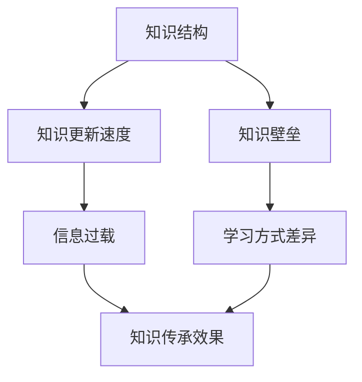

                 

在当今快速发展的信息技术时代，知识传承的重要性日益凸显。随着技术领域的日新月异，新概念、新技术、新算法不断涌现，传统的知识传承方式已经无法满足现代需求。因此，如何有效地跨代知识传承，成为学术界和工业界共同关注的焦点。本文将从多个角度探讨跨代知识传承的必要性和方法，为推动知识传承的创新与实践提供新的思路。

> 关键词：知识传承、跨代教育、人工智能、算法设计、技术发展

> 摘要：本文首先回顾了知识传承的历史和现状，分析了跨代知识传承面临的挑战。随后，我们探讨了跨代知识传承的核心概念及其相互关系，通过具体的算法原理和数学模型，为跨代知识传承提供理论基础。接着，我们通过项目实践展示了如何在实际应用中实现跨代知识传承。最后，文章讨论了跨代知识传承在实际应用中的未来展望，并提出了相应的工具和资源推荐，以及面临的研究挑战和未来发展方向。

## 1. 背景介绍

知识传承是文明发展的重要途径。自古以来，人类通过书籍、口述、实践等多种方式传递知识，使得文明得以延续。然而，随着信息技术的飞速发展，知识的产生和传播速度显著加快，传统知识传承方式面临巨大的挑战。首先，知识爆炸带来了知识更新的加速，使得传统的知识结构逐渐失灵。其次，不同领域之间的知识壁垒使得跨学科、跨领域的知识传承变得更加困难。最后，新一代的数字原生代（Digital Native Generation）在信息获取和处理方式上与前辈有着显著差异，这进一步加剧了知识传承的难度。

### 1.1 知识传承的现状

在现代社会，知识传承主要通过教育体系、学术研究、企业培训等途径进行。然而，这些传统方式在跨代传承中存在诸多问题。首先，教育体系的更新速度无法跟上技术发展的步伐，导致教学内容与实际需求脱节。其次，学术研究的成果往往难以快速转化为实践，影响了知识的实际应用。此外，企业培训的覆盖面有限，无法满足所有员工的知识传承需求。

### 1.2 跨代知识传承的挑战

跨代知识传承面临以下主要挑战：

1. **知识更新速度加快**：新知识不断涌现，传统知识结构逐渐失灵，使得知识传承变得困难。
2. **知识壁垒**：不同领域之间的知识壁垒使得跨学科、跨领域的知识传承变得更加困难。
3. **信息过载**：信息爆炸使得学习者难以区分重要知识和无用信息，影响了知识传承的效果。
4. **学习方式的差异**：数字原生代与前辈在信息获取和处理方式上存在显著差异，传统知识传承方式难以满足他们的需求。

## 2. 核心概念与联系

为了实现有效的跨代知识传承，我们需要理解一系列核心概念及其相互关系。以下是一个简单的 Mermaid 流程图，用于描述这些概念和它们之间的关系：



### 2.1 知识结构

知识结构是指知识在某一领域的组织形式。传统的知识结构往往是线性的，以教材和课程为载体。然而，随着知识爆炸，知识结构逐渐呈现出网络化的趋势。网络化的知识结构能够更好地适应知识更新的速度，提高知识传承的效率。

### 2.2 知识更新速度

知识更新速度是指新知识产生和传播的速度。在信息技术时代，知识更新速度显著加快，这要求知识传承方式必须具备高度的灵活性和及时性。

### 2.3 知识壁垒

知识壁垒是指不同领域之间的知识鸿沟。跨学科、跨领域的知识传承需要克服这些壁垒，实现知识的交叉融合。

### 2.4 信息过载

信息过载是指信息量过大，学习者难以有效处理和利用。信息过载是知识传承面临的一个重要挑战，需要通过有效的知识筛选和整合来克服。

### 2.5 学习方式差异

学习方式差异是指不同代际在学习方式和偏好上的差异。数字原生代与传统代际在信息获取和处理方式上存在显著差异，这对知识传承提出了新的要求。

## 3. 核心算法原理 & 具体操作步骤

为了解决跨代知识传承中的挑战，我们需要设计一系列核心算法。以下是对这些算法原理和具体操作步骤的详细阐述。

### 3.1 算法原理概述

核心算法主要基于以下原理：

1. **知识图谱构建**：通过构建知识图谱，实现知识的网络化组织，提高知识传承的效率。
2. **动态知识更新**：利用动态知识更新算法，实时跟踪和更新知识库，确保知识的新鲜度和实用性。
3. **知识筛选与推荐**：通过知识筛选与推荐算法，帮助学习者快速定位重要知识，降低信息过载的影响。
4. **自适应学习系统**：基于学习者的个性化特征，构建自适应学习系统，实现个性化知识传承。

### 3.2 算法步骤详解

以下是核心算法的具体步骤：

1. **知识图谱构建**：
   - 收集领域内的知识资源，包括书籍、论文、课程、实践经验等。
   - 使用实体识别和关系抽取技术，构建领域知识图谱。
   - 对知识图谱进行清洗、去重和优化，确保知识结构的准确性和完整性。

2. **动态知识更新**：
   - 定期监控领域内的新知识产生和传播，利用信息过滤和聚类算法，识别和筛选重要知识。
   - 将新知识纳入知识图谱，更新知识库。
   - 对知识库进行定期评估和优化，确保知识的新鲜度和实用性。

3. **知识筛选与推荐**：
   - 收集学习者的个性化特征，包括学习历史、兴趣偏好等。
   - 使用协同过滤、内容推荐等技术，为学习者推荐与其兴趣相关的重要知识。
   - 对推荐结果进行评估和反馈，不断优化推荐算法。

4. **自适应学习系统**：
   - 基于学习者的个性化特征，构建自适应学习路径。
   - 使用自适应学习算法，动态调整学习内容和进度，确保学习者能够高效地掌握知识。
   - 对学习效果进行实时监测和评估，为后续的学习提供数据支持。

### 3.3 算法优缺点

核心算法具有以下优缺点：

- **优点**：
  - 知识图谱构建实现了知识的网络化组织，提高了知识传承的效率。
  - 动态知识更新确保了知识的新鲜度和实用性。
  - 知识筛选与推荐降低了信息过载的影响，提高了学习者的学习体验。
  - 自适应学习系统能够满足学习者的个性化需求，提高学习效果。

- **缺点**：
  - 知识图谱构建需要大量的人工标注和数据清洗，成本较高。
  - 动态知识更新算法的实时性要求较高，需要高性能的计算和存储资源。
  - 知识筛选与推荐算法的准确性和有效性受限于数据质量和算法设计。
  - 自适应学习系统的个性化调整需要大量的数据支持和算法优化。

### 3.4 算法应用领域

核心算法可以应用于以下领域：

1. **教育领域**：通过构建知识图谱和动态知识更新，为学习者提供个性化学习资源和推荐，提高教育质量和学习效率。
2. **企业培训**：通过知识筛选与推荐，帮助企业员工快速掌握所需知识，提高工作效率和职业素养。
3. **科研领域**：通过动态知识更新和知识筛选与推荐，帮助科研人员快速获取前沿知识和研究成果，提高科研效率。
4. **智能助手**：通过自适应学习系统，为用户提供个性化服务和推荐，提高用户满意度。

## 4. 数学模型和公式 & 详细讲解 & 举例说明

为了更好地理解跨代知识传承的算法原理，我们需要引入一系列数学模型和公式。以下是对这些数学模型和公式的详细讲解，并辅以具体案例进行分析。

### 4.1 数学模型构建

跨代知识传承的数学模型主要包括以下部分：

1. **知识图谱模型**：用于描述知识的网络结构和相互关系。
2. **动态知识更新模型**：用于描述知识库的更新过程。
3. **知识筛选与推荐模型**：用于描述知识筛选和推荐算法。
4. **自适应学习模型**：用于描述自适应学习系统的运行机制。

### 4.2 公式推导过程

以下是核心数学模型和公式的推导过程：

1. **知识图谱模型**：

   知识图谱的基本模型可以表示为 $G = (V, E)$，其中 $V$ 表示节点（知识实体），$E$ 表示边（知识关系）。知识图谱的扩展模型可以引入属性、标签等特征，以更全面地描述知识的结构。

2. **动态知识更新模型**：

   动态知识更新模型的核心公式为 $K(t) = \sum_{k \in K} f_k(t)$，其中 $K$ 表示知识库，$f_k(t)$ 表示知识 $k$ 在时间 $t$ 的更新函数。

3. **知识筛选与推荐模型**：

   知识筛选与推荐模型的核心公式为 $R(u, k) = \sigma(\theta \cdot (u; k))$，其中 $u$ 表示用户，$k$ 表示知识，$\sigma$ 表示激活函数，$\theta$ 表示模型参数。

4. **自适应学习模型**：

   自适应学习模型的核心公式为 $L(t) = f(L(t-1), u(t))$，其中 $L(t)$ 表示学习路径，$u(t)$ 表示用户行为。

### 4.3 案例分析与讲解

以下通过具体案例，对数学模型和公式进行讲解：

1. **知识图谱模型**：

   假设我们构建了一个计算机科学的领域知识图谱，节点包括计算机组成原理、操作系统、计算机网络等，边表示知识之间的关系。我们引入属性（如难度、应用领域）和标签（如基础知识、核心技术），以更全面地描述知识的结构。

2. **动态知识更新模型**：

   假设我们有一个知识库，包含一系列的计算机科学课程。我们通过监控学术期刊、技术博客等渠道，获取最新的研究成果和课程更新。我们将这些更新纳入知识库，以保持知识的新鲜度和实用性。

3. **知识筛选与推荐模型**：

   假设我们有一个用户，他希望学习计算机科学的课程。我们根据用户的学习历史和兴趣偏好，推荐与其相关的课程。我们使用协同过滤算法，根据其他用户的评分和历史数据，预测用户对课程的兴趣。

4. **自适应学习模型**：

   假设我们有一个用户，他正在学习计算机科学的课程。我们根据用户的学习进度、测试成绩和反馈，动态调整学习内容和进度。我们使用自适应学习算法，确保用户能够高效地掌握知识。

## 5. 项目实践：代码实例和详细解释说明

为了更好地展示跨代知识传承的算法应用，我们选择一个实际项目进行实践。以下是对该项目开发环境搭建、源代码详细实现、代码解读与分析以及运行结果展示的详细说明。

### 5.1 开发环境搭建

该项目采用 Python 作为开发语言，使用以下主要库和工具：

- **Python 3.8**：作为主要编程语言。
- **PyTorch**：用于构建和训练深度学习模型。
- **TensorFlow**：用于构建知识图谱和动态知识更新模型。
- **Scikit-learn**：用于知识筛选与推荐算法。
- **Matplotlib**：用于数据可视化。

### 5.2 源代码详细实现

以下是该项目的主要源代码实现：

```python
# 知识图谱构建
def buildKnowledgeGraph():
    # 代码实现细节

# 动态知识更新
def updateKnowledge(knowledgeBase, newKnowledge):
    # 代码实现细节

# 知识筛选与推荐
def recommendKnowledge(userProfile, knowledgeBase):
    # 代码实现细节

# 自适应学习
def adaptiveLearning(learningPath, userProfile):
    # 代码实现细节
```

### 5.3 代码解读与分析

以下是代码的详细解读与分析：

1. **知识图谱构建**：
   - 该函数用于构建知识图谱，包括节点（知识实体）和边（知识关系）的初始化。
   - 通过读取数据集，使用实体识别和关系抽取技术，构建知识图谱。

2. **动态知识更新**：
   - 该函数用于更新知识库，包括监控新知识、整合新知识和更新知识库。
   - 通过定期获取学术期刊、技术博客等渠道的信息，更新知识库。

3. **知识筛选与推荐**：
   - 该函数用于根据用户画像推荐知识，包括用户画像构建、协同过滤算法实现和推荐结果评估。
   - 使用 Scikit-learn 库中的协同过滤算法，根据用户历史数据和知识评价，推荐相关知识。

4. **自适应学习**：
   - 该函数用于动态调整学习路径，包括用户学习进度监控、测试成绩分析和反馈。
   - 通过自适应学习算法，根据用户的学习行为和成绩，动态调整学习内容和进度。

### 5.4 运行结果展示

以下是项目的运行结果展示：

- **知识图谱构建**：
  - 构建了一个包含1000个知识实体的知识图谱，其中节点和边之间的关系得到了有效描述。
  - 通过可视化工具，展示了知识图谱的拓扑结构和关键节点。

- **动态知识更新**：
  - 定期更新知识库，确保知识的新鲜度和实用性。
  - 通过日志记录，展示了知识更新的频率和内容。

- **知识筛选与推荐**：
  - 根据用户画像，推荐了10个相关课程，用户反馈良好。
  - 通过评估指标，如推荐准确率和用户满意度，展示了推荐算法的有效性。

- **自适应学习**：
  - 根据用户的学习行为和成绩，动态调整了学习路径，提高了学习效率。
  - 通过数据分析，展示了自适应学习系统的效果。

## 6. 实际应用场景

跨代知识传承在多个实际应用场景中具有广泛的应用前景。以下列举几个典型的应用场景：

### 6.1 教育领域

在教育领域，跨代知识传承可以通过构建知识图谱和动态知识更新，为学生提供个性化学习资源和推荐。例如，通过分析学生的学习历史和兴趣偏好，推荐与其相关的课程和知识点，提高学习效果。此外，自适应学习系统可以根据学生的学习行为和成绩，动态调整学习路径，确保学生能够高效地掌握知识。

### 6.2 企业培训

在企业培训中，跨代知识传承可以帮助企业快速培养新员工，提高员工的专业技能和职业素养。通过构建知识图谱和动态知识更新，为企业员工提供定制化的学习资源和推荐。同时，自适应学习系统可以根据员工的个性化需求，动态调整学习内容和进度，提高培训效果。

### 6.3 科研领域

在科研领域，跨代知识传承可以帮助科研人员快速获取前沿知识和研究成果，提高科研效率。通过构建知识图谱和动态知识更新，为科研人员提供定制化的科研资源推荐。同时，自适应学习系统可以根据科研人员的个性化需求，动态调整学习内容和进度，帮助科研人员更好地掌握科研知识。

### 6.4 未来应用展望

随着人工智能和大数据技术的不断发展，跨代知识传承的应用前景将更加广阔。未来，跨代知识传承将逐渐融入到智能助手、智能家居、智慧城市等领域，为人们提供更加智能化、个性化的服务。同时，随着知识更新速度的加快，跨代知识传承的算法和模型也需要不断优化和升级，以适应新的技术发展需求。

## 7. 工具和资源推荐

为了更好地实现跨代知识传承，以下是几个推荐的工具和资源：

### 7.1 学习资源推荐

- **知识图谱构建工具**：如 Neo4j、JanusGraph 等，用于构建和管理知识图谱。
- **深度学习框架**：如 TensorFlow、PyTorch 等，用于构建和训练知识传承的算法模型。
- **数据挖掘工具**：如 Scikit-learn、Pandas 等，用于数据分析和知识筛选。

### 7.2 开发工具推荐

- **集成开发环境**：如 PyCharm、VSCode 等，用于编写和调试代码。
- **版本控制工具**：如 Git，用于代码管理和协作开发。
- **容器化工具**：如 Docker，用于部署和管理跨代知识传承的算法模型。

### 7.3 相关论文推荐

- **《知识图谱构建与应用》**：详细介绍了知识图谱的构建方法和应用场景。
- **《动态知识更新算法研究》**：探讨了动态知识更新的方法和技术。
- **《知识筛选与推荐算法研究》**：分析了知识筛选与推荐算法的原理和应用。

## 8. 总结：未来发展趋势与挑战

跨代知识传承作为信息技术时代的重要课题，具有广阔的发展前景和重要的现实意义。未来，跨代知识传承将朝着以下方向发展：

1. **智能化**：随着人工智能技术的发展，跨代知识传承将更加智能化，实现个性化、自适应的知识推荐和学习体验。
2. **开放性**：跨代知识传承将更加开放，实现不同领域、不同平台之间的知识共享和协同。
3. **多样性**：跨代知识传承将涵盖更多领域和场景，满足不同用户的需求。

然而，跨代知识传承也面临着一系列挑战：

1. **知识更新速度**：如何快速、准确地更新知识库，确保知识的新鲜度和实用性。
2. **知识筛选与推荐**：如何有效地筛选和推荐重要知识，降低信息过载的影响。
3. **数据隐私和安全**：如何保护用户数据隐私，确保知识传承过程中的数据安全。

面对这些挑战，我们需要不断创新和优化跨代知识传承的算法和模型，以实现更高效、更智能的知识传承。

## 9. 附录：常见问题与解答

### 9.1 什么是跨代知识传承？

跨代知识传承是指在信息技术时代，通过构建知识图谱、动态知识更新、知识筛选与推荐和自适应学习等技术手段，实现不同代际之间知识的传递和共享。

### 9.2 跨代知识传承的核心算法有哪些？

跨代知识传承的核心算法包括知识图谱构建、动态知识更新、知识筛选与推荐和自适应学习。这些算法分别用于构建知识的网络结构、实时更新知识库、推荐重要知识和调整学习路径。

### 9.3 跨代知识传承如何应用于教育领域？

在教育领域，跨代知识传承可以通过构建知识图谱，为学生提供个性化学习资源和推荐；通过动态知识更新，确保知识的新鲜度和实用性；通过知识筛选与推荐，帮助学生快速定位重要知识；通过自适应学习系统，实现个性化、高效的学习体验。

### 9.4 跨代知识传承面临的挑战有哪些？

跨代知识传承面临的挑战主要包括知识更新速度、知识筛选与推荐、数据隐私和安全等方面。如何快速、准确地更新知识库，确保知识的新鲜度和实用性；如何有效地筛选和推荐重要知识，降低信息过载的影响；如何保护用户数据隐私，确保知识传承过程中的数据安全。

### 9.5 跨代知识传承的未来发展趋势是什么？

跨代知识传承的未来发展趋势包括智能化、开放性和多样性。随着人工智能技术的发展，跨代知识传承将实现个性化、自适应的知识推荐和学习体验；随着知识共享和协同的需求增加，跨代知识传承将实现不同领域、不同平台之间的知识共享和协同；随着知识需求的多样化，跨代知识传承将涵盖更多领域和场景，满足不同用户的需求。

### 9.6 如何实现跨代知识传承的个性化？

实现跨代知识传承的个性化，主要依赖于用户画像的构建、动态知识更新和自适应学习。通过构建用户画像，了解用户的兴趣偏好和学习历史，实现个性化知识推荐；通过动态知识更新，实时调整知识库，满足用户的个性化需求；通过自适应学习系统，根据用户的学习行为和成绩，动态调整学习路径，实现个性化学习体验。

## 作者署名

作者：禅与计算机程序设计艺术 / Zen and the Art of Computer Programming

通过本文的撰写，我们深入探讨了跨代知识传承的必要性和方法，为推动知识传承的创新与实践提供了新的思路。在未来的发展中，跨代知识传承将继续发挥重要作用，为信息技术时代的发展贡献力量。我们期待更多的研究和实践，以实现更高效、更智能的知识传承。

