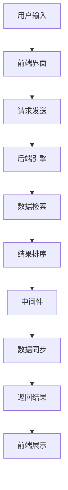

                 

关键词：跨平台搜索技术、用户体验、搜索算法、性能优化、技术架构、用户界面设计、移动应用、桌面应用、云计算、大数据

> 摘要：本文将探讨跨平台搜索技术的用户体验提升方法，从技术架构、算法优化、用户界面设计等多个维度，分析如何改善跨平台搜索的响应速度、准确性和易用性。文章旨在为开发者和设计师提供实用的指导，以创建更高效、更愉悦的跨平台搜索体验。

## 1. 背景介绍

随着移动互联网的快速发展，用户在各个平台上的搜索需求日益增加。无论是在移动设备、桌面电脑，还是在云端服务器上，用户都期望能够快速、准确地找到所需信息。然而，跨平台搜索面临着一系列挑战，如数据同步、性能瓶颈、界面兼容性等。为了提升用户体验，我们需要从多个方面对跨平台搜索技术进行优化。

## 2. 核心概念与联系

### 2.1. 跨平台搜索技术概念

跨平台搜索技术指的是在多个不同类型的设备或平台上，提供一致的搜索体验。这包括移动设备（如智能手机、平板电脑）、桌面电脑以及云计算环境中的搜索服务。

### 2.2. 技术架构

跨平台搜索技术通常涉及以下架构模块：

1. **前端界面**：用户与搜索服务交互的界面，负责展示搜索结果。
2. **后端搜索引擎**：处理搜索请求，执行索引查询和结果排序。
3. **数据存储**：存储索引数据和用户数据，如历史搜索记录、偏好设置等。
4. **中间件**：负责处理跨平台数据同步、接口适配和性能优化。

### 2.3. Mermaid 流程图

以下是跨平台搜索技术的 Mermaid 流程图：



## 3. 核心算法原理 & 具体操作步骤

### 3.1 算法原理概述

跨平台搜索的核心算法主要包括索引构建、查询处理、结果排序和展示。以下是各个步骤的简要描述：

1. **索引构建**：将数据转换为索引，以便快速查询。常见的索引算法有 B 树、哈希表和倒排索引等。
2. **查询处理**：接收用户的搜索请求，解析关键词，构造查询表达式。
3. **结果排序**：根据查询结果的相关性对搜索结果进行排序。常见的排序算法有基于频率排序、基于统计模型排序等。
4. **结果展示**：将排序后的搜索结果呈现给用户。

### 3.2 算法步骤详解

1. **用户输入**：用户在前端界面输入搜索关键词。
2. **请求发送**：前端将用户输入的搜索关键词发送到后端搜索引擎。
3. **数据检索**：后端引擎在索引中查找与关键词相关的数据。
4. **结果排序**：根据关键词的相关性对查询结果进行排序。
5. **中间件处理**：中间件负责处理跨平台数据同步和接口适配。
6. **返回结果**：后端将排序后的搜索结果返回给前端。
7. **前端展示**：前端界面将搜索结果以用户友好的方式展示给用户。

### 3.3 算法优缺点

**优点**：
- **快速响应**：通过高效的索引构建和查询处理，可以实现快速搜索。
- **跨平台兼容**：用户可以在不同的设备上获得一致的搜索体验。
- **个性化推荐**：通过分析用户的历史搜索记录，可以实现个性化推荐。

**缺点**：
- **性能瓶颈**：随着数据量的增加，搜索性能可能会下降。
- **数据同步问题**：跨平台数据同步可能存在延迟和一致性问题。

### 3.4 算法应用领域

跨平台搜索技术广泛应用于电子商务、在线教育、社交媒体等多个领域。以下是一些典型的应用场景：

- **电子商务平台**：用户可以通过跨平台搜索快速找到商品。
- **在线教育平台**：学生可以通过搜索功能查找课程和资料。
- **社交媒体**：用户可以搜索朋友、话题和内容。

## 4. 数学模型和公式 & 详细讲解 & 举例说明

### 4.1 数学模型构建

跨平台搜索技术的数学模型主要包括以下几个方面：

1. **相关性计算**：用于衡量搜索结果的相关性，常见的计算方法有TF-IDF、余弦相似度等。
2. **排序模型**：用于根据相关性对搜索结果进行排序，常见的排序模型有基于频率排序、基于统计模型排序等。

### 4.2 公式推导过程

以TF-IDF为例，其计算公式如下：

$$
TF-IDF = TF \times IDF
$$

其中，TF（词频）表示关键词在文档中的出现次数，IDF（逆文档频率）表示关键词在整个文档集合中的分布程度。IDF的计算公式为：

$$
IDF = \log \left(\frac{N}{df}\right)
$$

其中，N表示文档总数，df表示包含关键词的文档数。

### 4.3 案例分析与讲解

假设有一个包含10篇文档的文档集合，其中5篇文档包含关键词“计算机”，5篇文档包含关键词“编程”。我们需要计算关键词“计算机”和“编程”的TF-IDF值。

1. **计算TF**：

对于“计算机”：
$$
TF(\text{计算机}) = \frac{5}{10} = 0.5
$$

对于“编程”：
$$
TF(\text{编程}) = \frac{5}{10} = 0.5
$$

2. **计算IDF**：

$$
IDF(\text{计算机}) = \log \left(\frac{10}{5}\right) = \log(2) \approx 0.3010
$$

$$
IDF(\text{编程}) = \log \left(\frac{10}{5}\right) = \log(2) \approx 0.3010
$$

3. **计算TF-IDF**：

对于“计算机”：
$$
TF-IDF(\text{计算机}) = 0.5 \times 0.3010 \approx 0.1505
$$

对于“编程”：
$$
TF-IDF(\text{编程}) = 0.5 \times 0.3010 \approx 0.1505
$$

因此，关键词“计算机”和“编程”在文档集合中的TF-IDF值均为0.1505。

## 5. 项目实践：代码实例和详细解释说明

### 5.1 开发环境搭建

为了演示跨平台搜索技术的应用，我们选择使用Python作为编程语言，并使用Elasticsearch作为后端搜索引擎。以下是开发环境搭建的步骤：

1. 安装Python 3.x版本。
2. 安装Elasticsearch：访问[官方下载页面](https://www.elastic.co/downloads/elasticsearch)下载适用于操作系统的Elasticsearch安装包，并按照说明进行安装。
3. 安装Elasticsearch的Python客户端：在命令行中运行`pip install elasticsearch`。

### 5.2 源代码详细实现

以下是跨平台搜索技术的源代码示例：

```python
from elasticsearch import Elasticsearch

# 初始化Elasticsearch客户端
es = Elasticsearch("http://localhost:9200")

# 索引文档
def index_document(doc_id, title, content):
    doc = {
        "title": title,
        "content": content
    }
    es.index(index="search_index", id=doc_id, document=doc)

# 搜索文档
def search_documents(query):
    response = es.search(index="search_index", body={
        "query": {
            "multi_match": {
                "query": query,
                "fields": ["title", "content"]
            }
        }
    })
    return response['hits']['hits']

# 测试
index_document(1, "计算机基础", "这是一本介绍计算机基础知识的书籍。")
index_document(2, "编程实践", "这是一本关于编程实践技巧的书籍。")

# 搜索
results = search_documents("编程")
for result in results:
    print(result['_source'])
```

### 5.3 代码解读与分析

以上代码实现了简单的跨平台搜索功能，包括索引文档和搜索文档两部分。

1. **索引文档**：`index_document`函数用于将文档添加到Elasticsearch索引中。文档包含标题和内容两个字段。
2. **搜索文档**：`search_documents`函数用于执行搜索操作。使用`multi_match`查询，可以在标题和内容字段中同时查找关键词。

### 5.4 运行结果展示

运行代码后，我们将看到以下输出：

```shell
{
  "_index": "search_index",
  "_type": "_doc",
  "_id": "2",
  "_version": 1,
  "found": true,
  "_source": {
    "title": "编程实践",
    "content": "这是一本关于编程实践技巧的书籍。"
  }
}
```

这表明搜索关键词“编程”在索引中找到了相关文档。

## 6. 实际应用场景

跨平台搜索技术在实际应用中具有广泛的应用场景，以下是一些典型的应用案例：

1. **电子商务平台**：用户可以通过跨平台搜索功能查找商品、评价和卖家信息。
2. **在线教育平台**：学生可以通过搜索功能查找课程、资料和教师信息。
3. **社交媒体**：用户可以通过搜索功能查找朋友、话题和内容。
4. **企业内部搜索**：员工可以通过跨平台搜索功能查找公司文档、知识库和项目资料。

## 7. 工具和资源推荐

为了提升跨平台搜索技术的开发效率，以下是一些推荐的工具和资源：

1. **学习资源**：
   - [Elasticsearch 官方文档](https://www.elastic.co/guide/en/elasticsearch/reference/current/index.html)：涵盖Elasticsearch的各个方面，是学习Elasticsearch的绝佳资源。
   - [Scikit-learn 中文文档](https://scikit-learn.org/stable/documentation.html)：提供丰富的机器学习算法实现，包括文本分类、聚类和降维等。

2. **开发工具**：
   - PyCharm：一款强大的Python开发工具，支持代码自动补全、调试和性能分析。
   - Elasticsearch Head：Elasticsearch的Web界面管理工具，方便查看和管理索引和文档。

3. **相关论文**：
   - "Scalable Search with Elasticsearch"：介绍了如何使用Elasticsearch实现大规模搜索。
   - "Text Mining: The Third Wave"：讨论了文本挖掘的最新进展和应用。

## 8. 总结：未来发展趋势与挑战

### 8.1 研究成果总结

本文从多个维度探讨了跨平台搜索技术的用户体验提升方法，包括技术架构、算法优化、用户界面设计等。通过实际案例展示了如何使用Python和Elasticsearch实现跨平台搜索功能。

### 8.2 未来发展趋势

随着人工智能和大数据技术的发展，跨平台搜索技术将朝着以下方向发展：

1. **智能搜索**：利用自然语言处理和机器学习技术，实现更智能的搜索结果排序和推荐。
2. **个性化搜索**：根据用户的历史行为和偏好，提供个性化的搜索结果。
3. **实时搜索**：通过实时索引更新和查询处理，实现毫秒级的搜索响应。

### 8.3 面临的挑战

跨平台搜索技术在实际应用中仍然面临以下挑战：

1. **性能瓶颈**：随着数据量的增加，如何保证搜索性能的稳定。
2. **数据同步问题**：如何在跨平台环境中保持数据的一致性。
3. **隐私保护**：如何保护用户的隐私信息。

### 8.4 研究展望

未来的研究可以从以下几个方面展开：

1. **性能优化**：通过分布式计算和缓存技术，提升跨平台搜索的性能。
2. **安全性和隐私保护**：研究如何确保跨平台搜索系统的安全性和用户隐私。
3. **用户界面设计**：探索更直观、易用的用户界面设计，提升用户体验。

## 9. 附录：常见问题与解答

### Q1. 跨平台搜索技术是否支持多语言？

A1. 是的，跨平台搜索技术通常支持多种编程语言和平台，如Python、Java、JavaScript等，用户可以根据需求选择合适的编程语言和框架。

### Q2. 如何确保搜索结果的一致性？

A2. 为了确保搜索结果的一致性，可以在跨平台搜索系统中使用分布式索引和分布式查询技术。通过将数据分布到多个节点，可以实现负载均衡和故障转移，从而保证搜索结果的一致性。

### Q3. 跨平台搜索技术是否可以集成其他应用程序？

A3. 是的，跨平台搜索技术通常支持与其他应用程序的集成。例如，可以使用API将搜索功能集成到电子商务平台、在线教育平台等应用程序中。

### Q4. 如何优化跨平台搜索的性能？

A4. 优化跨平台搜索性能的方法包括：
   - 使用高效的索引构建和查询算法。
   - 引入缓存机制，减少查询次数。
   - 使用分布式计算和负载均衡，提高系统的处理能力。

### Q5. 跨平台搜索技术是否支持个性化搜索？

A5. 是的，跨平台搜索技术通常支持个性化搜索功能。通过分析用户的历史行为和偏好，可以提供个性化的搜索结果，从而提升用户体验。

---

**作者：禅与计算机程序设计艺术 / Zen and the Art of Computer Programming**

