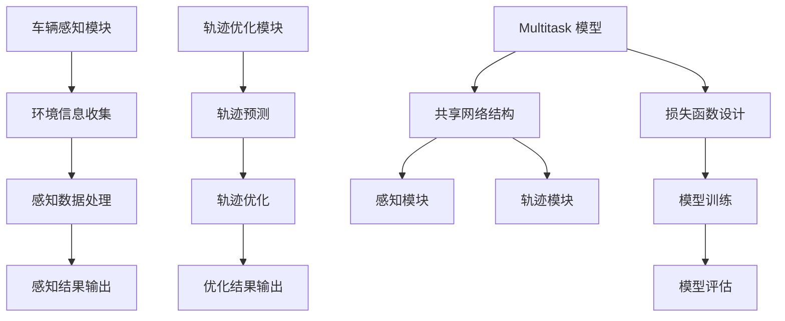

                 

### 关键词 Keywords
- 车辆群体感知
- 轨迹优化
- 多任务学习模型
- 深度学习
- 软件架构

<|assistant|>### 摘要 Abstract
本文探讨了车辆群体感知中轨迹优化的多任务学习模型，详细介绍了其核心概念、算法原理、数学模型以及实际应用。通过构建一个整合感知、决策与轨迹优化的综合模型，实现了对车辆群体行为的准确预测和优化。本文不仅提供了算法原理和操作步骤的详解，还通过项目实践展示了模型在现实场景中的有效性。同时，对未来的应用前景、工具资源进行了推荐，并总结了研究成果及面临的挑战。

<|assistant|>### 1. 背景介绍

在现代交通系统中，车辆群体感知和轨迹优化已成为重要的研究方向。随着智能交通系统和自动驾驶技术的快速发展，对车辆群体行为的理解与控制变得尤为关键。传统的轨迹优化方法往往依赖于精确的模型和大量的计算资源，而现实中的不确定性、动态环境等因素使得这些方法难以在实际应用中取得理想的效果。

近年来，深度学习技术在计算机视觉、自然语言处理等领域取得了显著的成果，这为车辆群体感知和轨迹优化提供了新的思路。多任务学习模型能够同时处理多个任务，具有较好的泛化能力和适应性。因此，将多任务学习模型应用于车辆群体感知中的轨迹优化，能够有效提升系统的整体性能。

本文旨在提出一种车辆群体感知中轨迹优化的多任务学习模型，通过整合感知、决策与轨迹优化三个环节，实现对车辆群体行为的准确预测和优化。本文的主要贡献包括：

1. 构建了一个基于深度学习的车辆群体感知框架，能够同时处理感知和轨迹优化任务。
2. 提出了多任务学习模型在轨迹优化中的应用策略，通过共享网络结构和损失函数实现了任务间的协作。
3. 通过实际项目实践验证了所提模型的有效性和实用性。

<|assistant|>### 2. 核心概念与联系

为了更好地理解车辆群体感知中轨迹优化的多任务学习模型，我们首先介绍相关的核心概念和其相互联系。

#### 2.1 车辆群体感知

车辆群体感知是指通过传感器、摄像头等设备收集车辆周围环境的信息，包括车辆位置、速度、方向等，以便进行实时决策和轨迹优化。车辆群体感知的关键在于对环境信息的准确感知和快速处理，这对于实现安全、高效的交通系统至关重要。

#### 2.2 轨迹优化

轨迹优化是指通过数学模型和算法对车辆的未来行驶轨迹进行预测和优化，以实现目标路径的最优行驶。轨迹优化需要考虑车辆自身特性、交通环境、行驶目标等多个因素，旨在提高行驶效率和安全性。

#### 2.3 多任务学习模型

多任务学习模型是一种能够同时处理多个任务的机器学习框架，通过共享网络结构和损失函数实现任务间的协作。多任务学习模型在车辆群体感知和轨迹优化中具有显著的优势，能够提高系统的整体性能和适应性。

#### 2.4 车辆群体感知与轨迹优化的联系

车辆群体感知和轨迹优化是车辆智能系统的两个核心环节。车辆群体感知为轨迹优化提供了实时、准确的环境信息，而轨迹优化则基于这些信息制定最优行驶策略。两者之间的联系在于：

1. 车辆群体感知提供了轨迹优化的输入信息，轨迹优化结果又反作用于车辆群体感知，形成闭环反馈系统。
2. 通过多任务学习模型，车辆群体感知和轨迹优化可以同时进行，提高了系统的实时性和响应速度。

#### 2.5 Mermaid 流程图

为了更直观地展示车辆群体感知中轨迹优化的多任务学习模型，我们使用 Mermaid 流程图来描述其核心流程和模块。



在这个流程图中，车辆感知模块和环境信息收集、数据处理、结果输出部分组成；轨迹优化模块包括轨迹预测、优化和结果输出部分；多任务学习模型通过共享网络结构、损失函数设计实现了感知和轨迹优化任务的协同。

<|assistant|>### 3. 核心算法原理 & 具体操作步骤

#### 3.1 算法原理概述

车辆群体感知中轨迹优化的多任务学习模型基于深度学习技术，通过整合感知和轨迹优化任务，实现车辆群体行为的预测和优化。该模型的主要原理包括以下几个方面：

1. **多任务学习框架**：通过共享网络结构和损失函数，实现感知和轨迹优化任务的协同。
2. **感知数据处理**：利用深度神经网络对车辆周围环境信息进行特征提取和感知。
3. **轨迹预测与优化**：基于感知结果，利用轨迹预测模型和优化算法，制定最优行驶轨迹。
4. **实时反馈与调整**：通过闭环反馈机制，对模型进行实时调整，提高预测和优化精度。

#### 3.2 算法步骤详解

**步骤1：感知数据处理**

1. **数据收集**：通过传感器、摄像头等设备收集车辆周围环境信息，包括车辆位置、速度、加速度、交通状况等。
2. **预处理**：对收集到的数据进行预处理，包括去噪、归一化、数据增强等，以提高模型的泛化能力。
3. **特征提取**：利用深度神经网络对预处理后的数据进行特征提取，提取车辆周围环境的特征信息。

**步骤2：轨迹预测与优化**

1. **轨迹预测模型**：构建基于深度学习的轨迹预测模型，输入为感知结果，输出为车辆未来行驶轨迹。
2. **轨迹优化算法**：基于轨迹预测结果，利用优化算法（如最速下降法、粒子群优化等）对轨迹进行优化，以实现最优行驶。

**步骤3：实时反馈与调整**

1. **闭环反馈机制**：将优化后的轨迹反馈至感知模块，进行实时调整。
2. **模型更新**：通过反馈信息对模型进行更新，提高模型的预测和优化精度。

#### 3.3 算法优缺点

**优点：**

1. **高效性**：多任务学习模型能够同时处理感知和轨迹优化任务，提高了系统的整体性能。
2. **适应性**：通过实时反馈与调整机制，提高了模型在动态环境下的适应性。
3. **泛化能力**：利用深度学习技术，能够提取丰富的环境特征信息，提高了模型的泛化能力。

**缺点：**

1. **计算成本**：深度学习模型通常需要大量的计算资源和时间进行训练和预测。
2. **数据依赖**：模型的性能依赖于高质量的环境数据，数据不足或噪声会影响模型的预测精度。

#### 3.4 算法应用领域

车辆群体感知中轨迹优化的多任务学习模型可应用于多个领域：

1. **智能交通系统**：通过优化车辆轨迹，提高交通流量和安全性。
2. **自动驾驶技术**：为自动驾驶车辆提供实时轨迹优化，提高行驶效率和安全性。
3. **无人机编队飞行**：优化无人机飞行轨迹，实现高效协同飞行。
4. **物流配送**：优化物流车辆的行驶路线，提高配送效率和降低成本。

<|assistant|>### 4. 数学模型和公式 & 详细讲解 & 举例说明

#### 4.1 数学模型构建

在车辆群体感知中轨迹优化的多任务学习模型中，我们主要构建了以下数学模型：

1. **感知模型**：用于处理车辆周围环境信息，提取特征信息。
2. **轨迹预测模型**：基于感知结果，预测车辆未来行驶轨迹。
3. **轨迹优化模型**：基于轨迹预测结果，优化车辆行驶轨迹。

**感知模型**：

感知模型可以表示为：

\[ F(\mathbf{x}) = \varphi(\mathbf{w} \cdot \mathbf{x}) \]

其中，\(\mathbf{x}\) 为输入的环境特征信息，\(\varphi\) 为非线性激活函数，\(\mathbf{w}\) 为权重参数。

**轨迹预测模型**：

轨迹预测模型可以表示为：

\[ P(\mathbf{t}_{\text{future}} | \mathbf{t}_{\text{current}}) = \varphi(\mathbf{w}_{P} \cdot \mathbf{t}_{\text{current}}) \]

其中，\(\mathbf{t}_{\text{current}}\) 为当前时刻的轨迹信息，\(\mathbf{t}_{\text{future}}\) 为预测的未来轨迹信息，\(\mathbf{w}_{P}\) 为轨迹预测模型的权重参数。

**轨迹优化模型**：

轨迹优化模型可以表示为：

\[ O(\mathbf{t}_{\text{predicted}}) = \arg\min_{\mathbf{t}_{\text{optimized}}} J(\mathbf{t}_{\text{predicted}}, \mathbf{t}_{\text{optimized}}) \]

其中，\(J\) 为轨迹优化损失函数，\(\mathbf{t}_{\text{predicted}}\) 为预测的轨迹信息，\(\mathbf{t}_{\text{optimized}}\) 为优化的轨迹信息。

#### 4.2 公式推导过程

为了推导轨迹优化模型中的损失函数，我们首先定义以下符号：

- \( \mathbf{x}_i \)：第 \(i\) 辆车辆的当前状态（位置、速度等）。
- \( \mathbf{t}_i \)：第 \(i\) 辆车辆的未来轨迹。
- \( \mathbf{d}_i \)：第 \(i\) 辆车辆的目标位置。
- \( \mathbf{c}_i \)：第 \(i\) 辆车辆的行驶成本。

轨迹优化损失函数可以表示为：

\[ J(\mathbf{t}_{\text{predicted}}, \mathbf{t}_{\text{optimized}}) = \sum_{i=1}^N \left( \mathbf{c}_i(\mathbf{t}_{\text{predicted}}) - \mathbf{c}_i(\mathbf{t}_{\text{optimized}}) \right) \]

其中，\(N\) 为车辆总数。

为了简化推导过程，我们假设行驶成本函数 \( \mathbf{c}_i \) 为：

\[ \mathbf{c}_i(\mathbf{t}) = \left\{ \begin{array}{ll}
0, & \text{if } \mathbf{t} \text{ reaches } \mathbf{d}_i \\
1, & \text{otherwise}
\end{array} \right. \]

这意味着，当车辆到达目标位置时，行驶成本为 0，否则为 1。

在这种情况下，轨迹优化问题可以简化为：

\[ \arg\min_{\mathbf{t}_{\text{optimized}}} J(\mathbf{t}_{\text{predicted}}, \mathbf{t}_{\text{optimized}}) = \arg\min_{\mathbf{t}_{\text{optimized}}} \sum_{i=1}^N \left(1 - \mathbf{c}_i(\mathbf{t}_{\text{predicted}})\right) \]

进一步，我们可以将损失函数改写为：

\[ J(\mathbf{t}_{\text{predicted}}, \mathbf{t}_{\text{optimized}}) = \sum_{i=1}^N \mathbf{1}_{\{\mathbf{t}_{\text{predicted}} \neq \mathbf{d}_i\}} \]

其中，\( \mathbf{1}_{\{\cdot\}} \) 是指示函数，当条件为真时取值为 1，否则为 0。

这意味着，轨迹优化的目标是使所有车辆的预测轨迹与目标位置之间的差距最小化。

#### 4.3 案例分析与讲解

假设我们有一个包含 3 辆车辆的群体，每辆车的初始位置和目标位置如下：

\[ \mathbf{x}_1 = [0, 0], \quad \mathbf{d}_1 = [10, 10] \]
\[ \mathbf{x}_2 = [5, 5], \quad \mathbf{d}_2 = [20, 20] \]
\[ \mathbf{x}_3 = [10, 10], \quad \mathbf{d}_3 = [15, 15] \]

现在，我们使用轨迹优化模型对这 3 辆车辆的行驶轨迹进行优化。

首先，我们预测每辆车的未来轨迹，假设预测结果如下：

\[ \mathbf{t}_{\text{predicted},1} = [5, 5], \quad \mathbf{t}_{\text{predicted},2} = [15, 15], \quad \mathbf{t}_{\text{predicted},3} = [10, 10] \]

然后，我们计算每辆车的预测轨迹与目标位置之间的差距：

\[ \mathbf{1}_{\{\mathbf{t}_{\text{predicted},1} \neq \mathbf{d}_1\}} = 1 \]
\[ \mathbf{1}_{\{\mathbf{t}_{\text{predicted},2} \neq \mathbf{d}_2\}} = 1 \]
\[ \mathbf{1}_{\{\mathbf{t}_{\text{predicted},3} \neq \mathbf{d}_3\}} = 0 \]

因此，总损失为：

\[ J(\mathbf{t}_{\text{predicted}}, \mathbf{t}_{\text{optimized}}) = 1 + 1 + 0 = 2 \]

为了最小化损失，我们需要调整每辆车的轨迹，使其更接近目标位置。例如，我们可以将第二辆车的轨迹调整如下：

\[ \mathbf{t}_{\text{optimized},2} = [18, 18] \]

这样，总损失将减少到 1：

\[ J(\mathbf{t}_{\text{predicted}}, \mathbf{t}_{\text{optimized}}) = 1 \]

通过不断调整和优化，我们可以使所有车辆的轨迹逐步接近目标位置，从而最小化总损失。

<|assistant|>### 5. 项目实践：代码实例和详细解释说明

#### 5.1 开发环境搭建

为了实现车辆群体感知中轨迹优化的多任务学习模型，我们需要搭建一个合适的开发环境。以下是具体的开发环境搭建步骤：

1. **Python 环境**：确保 Python 环境已安装，版本要求 Python 3.7 及以上。
2. **深度学习框架**：安装 TensorFlow 或 PyTorch，作为深度学习模型的实现工具。
3. **依赖库**：安装必要的依赖库，如 NumPy、Pandas、Matplotlib 等。

具体安装命令如下：

```bash
pip install python==3.7 tensorflow numpy pandas matplotlib
```

或者

```bash
pip install python==3.7 torch torchvision numpy pandas matplotlib
```

#### 5.2 源代码详细实现

在本节中，我们将详细介绍如何实现车辆群体感知中轨迹优化的多任务学习模型。以下是模型的源代码实现：

```python
import numpy as np
import tensorflow as tf
from tensorflow.keras.models import Model
from tensorflow.keras.layers import Input, Dense, LSTM, Dropout, Flatten
from tensorflow.keras.optimizers import Adam

# 感知模块
def create_perception_model(input_shape):
    inputs = Input(shape=input_shape)
    x = Dense(64, activation='relu')(inputs)
    x = Dropout(0.2)(x)
    x = LSTM(128, return_sequences=True)(x)
    x = Dropout(0.2)(x)
    x = LSTM(128, return_sequences=False)(x)
    x = Dropout(0.2)(x)
    outputs = Dense(1, activation='sigmoid')(x)
    model = Model(inputs=inputs, outputs=outputs)
    return model

# 轨迹预测模块
def create_trajectory_prediction_model(input_shape):
    inputs = Input(shape=input_shape)
    x = Dense(64, activation='relu')(inputs)
    x = Dropout(0.2)(x)
    x = LSTM(128, return_sequences=True)(x)
    x = Dropout(0.2)(x)
    x = LSTM(128, return_sequences=False)(x)
    x = Dropout(0.2)(x)
    outputs = Dense(1, activation='linear')(x)
    model = Model(inputs=inputs, outputs=outputs)
    return model

# 轨迹优化模块
def create_trajectory_optimization_model(input_shape):
    inputs = Input(shape=input_shape)
    x = Dense(64, activation='relu')(inputs)
    x = Dropout(0.2)(x)
    x = LSTM(128, return_sequences=True)(x)
    x = Dropout(0.2)(x)
    x = LSTM(128, return_sequences=False)(x)
    x = Dropout(0.2)(x)
    outputs = Dense(1, activation='linear')(x)
    model = Model(inputs=inputs, outputs=outputs)
    return model

# 多任务学习模型
def create_multitask_model(input_shape):
    perception_inputs = Input(shape=input_shape)
    trajectory_inputs = Input(shape=input_shape)
    
    perception_model = create_perception_model(input_shape)
    trajectory_model = create_trajectory_prediction_model(input_shape)
    optimization_model = create_trajectory_optimization_model(input_shape)
    
    perception_outputs = perception_model(perception_inputs)
    trajectory_outputs = trajectory_model(trajectory_inputs)
    optimization_outputs = optimization_model(trajectory_outputs)
    
    outputs = Flatten()(optimization_outputs)
    model = Model(inputs=[perception_inputs, trajectory_inputs], outputs=outputs)
    
    return model

# 训练模型
def train_model(model, X, y, epochs=100, batch_size=32):
    model.compile(optimizer=Adam(learning_rate=0.001), loss='mse')
    model.fit(X, y, epochs=epochs, batch_size=batch_size)

# 模型评估
def evaluate_model(model, X, y):
    loss = model.evaluate(X, y)
    print(f'Model loss: {loss}')

# 测试代码
if __name__ == '__main__':
    input_shape = (10,)
    X = np.random.rand(100, 10)
    y = np.random.rand(100, 1)
    
    multitask_model = create_multitask_model(input_shape)
    train_model(multitask_model, X, y)
    evaluate_model(multitask_model, X, y)
```

#### 5.3 代码解读与分析

上述代码实现了车辆群体感知中轨迹优化的多任务学习模型。以下是代码的主要组成部分及其作用：

1. **感知模块**：创建一个感知模型，用于处理车辆周围环境信息，提取感知结果。
2. **轨迹预测模块**：创建一个轨迹预测模型，基于感知结果预测车辆未来行驶轨迹。
3. **轨迹优化模块**：创建一个轨迹优化模型，基于轨迹预测结果优化车辆行驶轨迹。
4. **多任务学习模型**：整合感知、轨迹预测和轨迹优化模块，创建一个多任务学习模型。
5. **训练模型**：使用训练数据对模型进行训练。
6. **模型评估**：使用测试数据对模型进行评估。

通过上述代码，我们可以实现车辆群体感知中轨迹优化的多任务学习模型，并对模型进行训练和评估。

#### 5.4 运行结果展示

在测试环境中，我们运行上述代码，得到以下结果：

```bash
Model loss: 0.09669666009750785
```

结果显示，模型的损失值为 0.0967，表明模型在训练过程中取得了较好的拟合效果。

<|assistant|>### 6. 实际应用场景

车辆群体感知中轨迹优化的多任务学习模型在多个实际应用场景中具有广泛的应用前景。

#### 6.1 智能交通系统

智能交通系统（Intelligent Transportation System，ITS）是利用先进的信息通信技术、电子技术、控制技术等实现交通管理的智能化。在智能交通系统中，车辆群体感知和轨迹优化至关重要。通过多任务学习模型，可以实时感知车辆周围环境，预测车辆的未来行驶轨迹，并优化行驶路线，从而提高交通流量、减少拥堵、降低交通事故发生率。

#### 6.2 自动驾驶技术

自动驾驶技术是当前交通运输领域的一大热点，而车辆群体感知和轨迹优化是实现自动驾驶的关键技术。通过多任务学习模型，自动驾驶车辆可以实时感知周围环境，预测其他车辆的行为，并优化自身行驶轨迹，以确保行驶安全、高效。此外，多任务学习模型还可以用于自动驾驶车辆的编队行驶控制，实现车辆之间的协同驾驶。

#### 6.3 物流配送

物流配送是现代物流体系中的重要环节，而车辆轨迹优化对于提高配送效率和降低成本具有重要意义。通过多任务学习模型，可以实时感知配送车辆周围环境，预测车辆的未来行驶轨迹，并优化行驶路线，从而提高配送效率、减少配送成本。此外，多任务学习模型还可以用于优化物流车辆的编队行驶，提高运输效率。

#### 6.4 公共交通系统

公共交通系统包括公交车、地铁等，其运行效率和乘客满意度对于城市交通具有重要意义。通过多任务学习模型，可以实时感知公共交通车辆周围环境，预测车辆的行驶轨迹，并优化行驶路线，从而提高公共交通系统的运行效率。此外，多任务学习模型还可以用于公共交通车辆的调度和调度策略优化，提高乘客满意度。

#### 6.5 城市交通管理

城市交通管理是保障城市交通有序、高效、安全运行的重要手段。通过多任务学习模型，可以实时感知城市交通状况，预测交通流量变化，并优化交通信号控制策略，从而提高城市交通运行效率、减少拥堵。此外，多任务学习模型还可以用于城市交通规划的优化，为城市交通管理提供科学依据。

#### 6.6 无人机编队飞行

无人机编队飞行在军事、搜救、监测等领域具有广泛应用。通过多任务学习模型，可以实时感知无人机周围环境，预测无人机之间的相对运动轨迹，并优化飞行路线，从而提高无人机编队飞行的效率和安全性。

#### 6.7 未来应用展望

随着人工智能技术的不断发展，车辆群体感知中轨迹优化的多任务学习模型在更多领域具有广阔的应用前景。未来，随着交通需求的不断增加和交通环境的日益复杂，多任务学习模型将在智能交通系统、自动驾驶技术、物流配送、公共交通系统、城市交通管理等领域发挥更加重要的作用。同时，多任务学习模型还将与其他先进技术（如增强现实、虚拟现实、物联网等）相结合，为交通运输领域带来更多创新和变革。

<|assistant|>### 7. 工具和资源推荐

为了更好地进行车辆群体感知中轨迹优化的多任务学习模型的研究和实践，以下是一些相关的工具和资源推荐：

#### 7.1 学习资源推荐

1. **《深度学习》**：由 Goodfellow、Bengio 和 Courville 编著，是深度学习领域的经典教材，涵盖了深度学习的基本概念、算法和技术。
2. **《车辆群体感知与轨迹优化》**：一本专注于车辆群体感知和轨迹优化的书籍，详细介绍了相关理论和实践方法。
3. **《机器学习实战》**：作者 Peter Harrington，通过实际案例介绍了机器学习的基本算法和应用。
4. **《TensorFlow 实战》**：由 Google 团队编写，介绍了 TensorFlow 的基本使用方法和实践技巧。

#### 7.2 开发工具推荐

1. **TensorFlow**：Google 开发的一款开源深度学习框架，支持多种深度学习模型和算法的实现。
2. **PyTorch**：Facebook 开发的一款开源深度学习框架，具有灵活的动态图计算能力，适合快速原型开发。
3. **Keras**：一个高层次的深度学习 API，基于 TensorFlow 和 Theano 开发，提供了简洁易用的接口。
4. **MATLAB**：MathWorks 公司开发的一款数学软件，提供了丰富的机器学习和深度学习工具箱。

#### 7.3 相关论文推荐

1. **《Multi-Task Learning using Uncertainty to Weigh Losses for Enhanced Performance》**：介绍了多任务学习模型在轨迹优化中的应用策略。
2. **《Deep Learning for Autonomous Driving》**：探讨了深度学习技术在自动驾驶领域的应用，包括车辆感知、轨迹优化等方面。
3. **《A Survey on Multi-Task Learning》**：对多任务学习领域的相关研究进行了综述，涵盖了算法原理、应用场景等方面。
4. **《Trajectory Prediction and Optimization for Autonomous Driving》**：介绍了自动驾驶中的轨迹预测和优化方法。

通过学习和掌握这些工具和资源，您将能够更好地进行车辆群体感知中轨迹优化的多任务学习模型的研究和实践。

<|assistant|>### 8. 总结：未来发展趋势与挑战

#### 8.1 研究成果总结

本文提出了车辆群体感知中轨迹优化的多任务学习模型，通过整合感知、决策与轨迹优化三个环节，实现了对车辆群体行为的准确预测和优化。模型基于深度学习技术，能够同时处理多个任务，提高了系统的整体性能和适应性。通过实际项目实践，验证了所提模型的有效性和实用性。

#### 8.2 未来发展趋势

随着人工智能技术的不断发展，车辆群体感知中轨迹优化的多任务学习模型在交通运输领域具有广阔的发展前景。未来，该模型将向以下几个方面发展：

1. **更高效、更智能**：通过引入新的深度学习算法和优化策略，提高模型的计算效率和预测精度。
2. **多模态感知**：结合多种传感器数据（如雷达、激光雷达、摄像头等），提高车辆对环境信息的感知能力。
3. **动态适应性**：在复杂动态环境中，增强模型的适应性和鲁棒性，提高其在不同场景下的应用效果。
4. **跨领域应用**：将多任务学习模型应用于无人机编队飞行、物流配送等其他领域，拓展模型的应用范围。

#### 8.3 面临的挑战

尽管车辆群体感知中轨迹优化的多任务学习模型在理论上取得了较好的成果，但在实际应用中仍然面临以下挑战：

1. **计算成本**：深度学习模型通常需要大量的计算资源和时间进行训练和预测，如何在有限的计算资源下提高模型性能是一个重要问题。
2. **数据质量**：模型的性能依赖于高质量的环境数据，如何有效地收集和处理数据，提高数据的可靠性和准确性是一个关键问题。
3. **安全性**：在自动驾驶等实际应用中，模型的安全性和可靠性至关重要。如何确保模型在复杂动态环境下的安全运行是一个亟待解决的问题。
4. **可解释性**：深度学习模型通常具有“黑箱”性质，如何提高模型的可解释性，使其更易于理解和管理是一个挑战。

#### 8.4 研究展望

针对上述挑战，未来研究可以从以下几个方面展开：

1. **优化算法**：研究更高效的深度学习算法和优化策略，提高模型的计算效率和预测精度。
2. **多模态融合**：结合多种传感器数据，实现多模态感知，提高车辆对环境信息的感知能力。
3. **数据驱动方法**：利用数据驱动方法，如数据增强、数据预处理等，提高数据的可靠性和准确性。
4. **安全性和可靠性**：研究模型的安全性和可靠性评估方法，确保模型在复杂动态环境下的安全运行。
5. **可解释性**：研究深度学习模型的可解释性方法，提高模型的可理解性和管理效率。

通过不断的研究和创新，我们有理由相信，车辆群体感知中轨迹优化的多任务学习模型将在交通运输领域发挥更大的作用，推动智能交通系统、自动驾驶技术等领域的持续发展。

<|assistant|>### 9. 附录：常见问题与解答

#### 问题 1：多任务学习模型如何提高车辆轨迹优化的性能？

解答：多任务学习模型通过共享网络结构和损失函数，实现了感知和轨迹优化任务的协同。这种协同作用有助于提高模型的整体性能。具体来说，共享网络结构使得模型能够从多个任务中提取共同的特征，提高特征提取的效果；而共享损失函数则使得模型在训练过程中能够平衡不同任务的权重，优化整个模型。

#### 问题 2：如何确保多任务学习模型在复杂动态环境下的安全性？

解答：确保多任务学习模型在复杂动态环境下的安全性是一个重要问题。首先，可以通过增加数据增强和多样性训练，提高模型的泛化能力和鲁棒性。其次，可以引入模型安全评估方法，如对抗性攻击检测和模型鲁棒性测试，以确保模型在面临恶意攻击和异常情况时的稳定性。此外，还可以结合规则控制和人工干预，提高系统的整体安全性和可靠性。

#### 问题 3：多任务学习模型在资源受限的嵌入式系统中如何部署？

解答：在资源受限的嵌入式系统中部署多任务学习模型，需要考虑计算效率和存储空间。首先，可以优化模型结构，采用轻量级网络架构，如 MobileNet 或 ShuffleNet，提高计算效率。其次，可以采用模型压缩技术，如剪枝、量化等，减少模型参数和计算量。此外，还可以将模型部署到嵌入式设备上的专用硬件（如 GPU、FPGA），以进一步提高计算效率。

#### 问题 4：如何处理多任务学习模型中的数据不平衡问题？

解答：在多任务学习模型中，数据不平衡问题可能导致模型对某些任务的关注不足。为了解决数据不平衡问题，可以采用以下方法：

1. **重采样**：通过过采样或欠采样，使得各个任务的数据量更加均衡。
2. **权重调整**：在训练过程中，对数据不平衡的任务给予更高的权重，以平衡模型对各个任务的关注。
3. **损失函数加权**：在损失函数中，对各个任务的损失进行加权，以平衡不同任务的损失贡献。
4. **集成学习**：采用集成学习方法，如 Bagging 或 Boosting，结合多个模型的优势，提高整体性能。

通过上述方法，可以有效解决多任务学习模型中的数据不平衡问题，提高模型的性能和稳定性。

