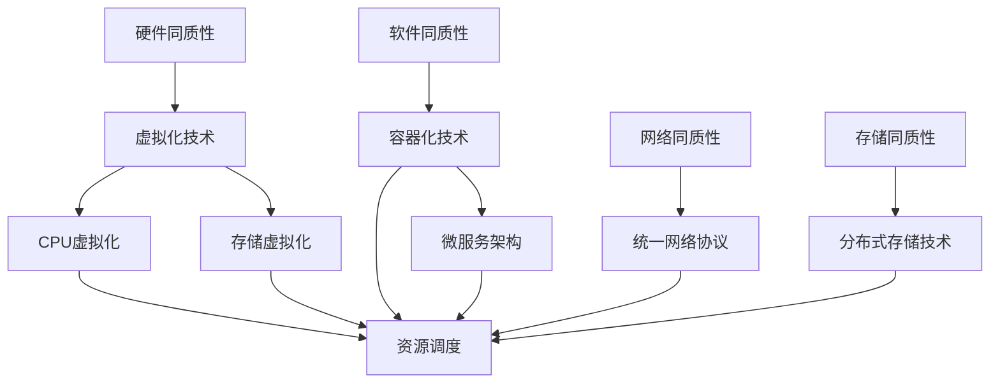

                 

关键词：软件2.0，计算同质性，编程模型，技术演进，云原生，人工智能

> 摘要：本文深入探讨了软件2.0时代的核心优势——计算同质性。计算同质性的实现，极大地推动了编程模型和技术发展的革新，为云原生和人工智能带来了前所未有的机遇。本文将详细分析计算同质性的概念、技术原理、应用领域及其对未来的影响。

## 1. 背景介绍

随着信息技术的迅猛发展，软件行业已经经历了多个重要阶段。从早期的系统软件，到互联网时代的Web应用，再到如今的云计算、大数据和人工智能，软件的发展历程充满了创新和变革。然而，随着技术的不断进步，传统的编程模型和开发方式逐渐暴露出一些局限性。为了应对这些挑战，软件2.0的概念应运而生。

软件2.0强调的是一种全新的计算范式，即计算同质性。这种同质性主要体现在硬件、软件、网络和存储等各个层面，通过消除不同技术之间的差异，实现资源的统一管理和调度。计算同质性的提出，为软件行业带来了新的机遇和挑战。

### 1.1 传统编程模型的局限性

在传统编程模型中，硬件、操作系统、编程语言和数据库等各个层面之间存在显著差异。这种差异导致了开发人员需要针对不同的技术环境进行复杂的适配和调整。这不仅增加了开发的难度和成本，还限制了软件的灵活性和可扩展性。例如：

- **硬件差异**：不同的硬件平台（如x86、ARM等）需要不同的驱动程序和操作系统，导致软件在不同硬件上的部署和运行变得复杂。
- **操作系统差异**：不同操作系统（如Windows、Linux等）的API和编程模型有所不同，使得开发人员在跨平台开发时需要做出妥协和调整。
- **编程语言差异**：不同的编程语言（如Java、C++、Python等）有各自的特点和优势，但在特定场景下可能不够高效或适用。
- **数据库差异**：不同的数据库（如MySQL、Oracle等）在数据存储、查询优化等方面存在差异，导致应用在不同数据库上的性能和兼容性难以保证。

### 1.2 计算同质性的优势

计算同质性通过消除上述差异，实现了资源的统一管理和调度，带来了以下优势：

- **简化开发过程**：计算同质性使得开发人员可以不再关注底层硬件、操作系统和编程语言的具体实现，专注于业务逻辑的实现和优化。
- **提高开发效率**：计算同质性降低了跨平台开发的难度，使得开发人员可以更快速地将软件部署到不同的硬件和操作系统上。
- **增强软件可扩展性**：计算同质性使得软件可以更灵活地扩展和升级，以满足不断变化的需求和业务场景。
- **降低维护成本**：计算同质性减少了不同技术环境之间的差异，降低了软件的维护和升级成本。

## 2. 核心概念与联系

### 2.1 计算同质性的概念

计算同质性是指通过统一的架构、接口和协议，实现硬件、软件、网络和存储等各个层面之间的无缝集成和互操作性。具体来说，计算同质性包括以下几个方面：

- **硬件同质性**：通过虚拟化技术，将不同硬件资源（如CPU、GPU、存储等）抽象成统一的资源池，实现资源的统一管理和调度。
- **软件同质性**：通过标准化的编程模型和接口，消除不同软件之间的差异，实现软件的通用化和互操作性。
- **网络同质性**：通过统一的网络协议和架构，实现不同网络设备之间的无缝连接和通信。
- **存储同质性**：通过分布式存储技术，将不同存储设备（如磁盘、SSD、云存储等）抽象成统一的存储资源，实现存储的统一管理和调度。

### 2.2 计算同质性的实现原理

计算同质性的实现主要依赖于以下几个方面：

- **虚拟化技术**：虚拟化技术可以将物理硬件资源抽象成虚拟资源，实现资源的统一管理和调度。例如，CPU虚拟化可以将物理CPU资源虚拟成多个虚拟CPU，实现硬件资源的最大化利用。
- **容器化技术**：容器化技术通过将应用程序及其依赖环境封装在一个独立的容器中，实现应用程序的通用化和可移植性。容器化技术可以消除不同操作系统之间的差异，使得应用程序可以在不同的操作系统上无缝运行。
- **微服务架构**：微服务架构通过将应用程序分解成多个独立的微服务，实现应用程序的模块化和可扩展性。微服务架构可以消除不同模块之间的依赖关系，使得应用程序可以更灵活地扩展和升级。
- **分布式存储技术**：分布式存储技术通过将数据分布在多个存储设备上，实现存储的统一管理和调度。分布式存储技术可以消除不同存储设备之间的差异，提高存储的性能和可靠性。

### 2.3 计算同质性的架构图

下面是一个简化的计算同质性架构图，展示了硬件、软件、网络和存储等各个层面的同质性实现：



## 3. 核心算法原理 & 具体操作步骤

### 3.1 算法原理概述

计算同质性的核心算法主要涉及虚拟化技术、容器化技术和分布式存储技术。这些算法通过将不同层面的资源抽象成统一的接口和协议，实现资源的统一管理和调度。

- **虚拟化技术**：虚拟化技术通过创建虚拟机（VM），将物理硬件资源虚拟成多个虚拟资源，实现资源的统一管理和调度。虚拟化技术包括CPU虚拟化、存储虚拟化和网络虚拟化等。
- **容器化技术**：容器化技术通过将应用程序及其依赖环境封装在一个独立的容器中，实现应用程序的通用化和可移植性。容器化技术包括Docker、Kubernetes等。
- **分布式存储技术**：分布式存储技术通过将数据分布在多个存储设备上，实现存储的统一管理和调度。分布式存储技术包括HDFS、Ceph等。

### 3.2 算法步骤详解

#### 3.2.1 虚拟化技术

1. **硬件虚拟化**：
   - **步骤1**：硬件设备（如CPU、存储等）通过物理接口与虚拟化层进行交互。
   - **步骤2**：虚拟化层将物理资源抽象成虚拟资源，如虚拟CPU、虚拟存储等。
   - **步骤3**：虚拟资源通过虚拟接口提供给操作系统和应用程序。

2. **存储虚拟化**：
   - **步骤1**：物理存储设备（如磁盘、SSD等）与存储虚拟化层进行交互。
   - **步骤2**：存储虚拟化层将物理存储空间抽象成虚拟存储空间，如虚拟磁盘、虚拟文件系统等。
   - **步骤3**：虚拟存储空间通过虚拟接口提供给操作系统和应用程序。

3. **网络虚拟化**：
   - **步骤1**：物理网络设备（如交换机、路由器等）与网络虚拟化层进行交互。
   - **步骤2**：网络虚拟化层将物理网络资源抽象成虚拟网络资源，如虚拟交换机、虚拟路由器等。
   - **步骤3**：虚拟网络资源通过虚拟接口提供给操作系统和应用程序。

#### 3.2.2 容器化技术

1. **容器创建**：
   - **步骤1**：从镜像仓库中获取应用程序的镜像。
   - **步骤2**：基于镜像创建容器，并加载应用程序和依赖环境。

2. **容器运行**：
   - **步骤1**：容器通过虚拟接口与宿主机进行交互。
   - **步骤2**：容器执行应用程序的代码，并提供输入输出接口。

3. **容器管理**：
   - **步骤1**：通过容器编排工具（如Kubernetes）对容器进行创建、启动、停止、删除等操作。
   - **步骤2**：容器编排工具根据容器定义的配置，自动进行资源分配和调度。

#### 3.2.3 分布式存储技术

1. **数据分布**：
   - **步骤1**：将数据分成多个块，并分配到不同的存储节点上。
   - **步骤2**：每个存储节点将数据块存储在本地磁盘上。

2. **数据复制**：
   - **步骤1**：在每个存储节点上维护数据的多个副本。
   - **步骤2**：根据存储策略（如副本数量、数据一致性等）进行数据复制。

3. **数据访问**：
   - **步骤1**：客户端通过分布式存储协议（如NFS、HDFS等）访问存储节点。
   - **步骤2**：存储节点根据数据块的存储位置，将数据块返回给客户端。

### 3.3 算法优缺点

#### 3.3.1 优点

- **简化开发过程**：计算同质性降低了不同技术环境之间的差异，使得开发人员可以更专注于业务逻辑的实现。
- **提高开发效率**：计算同质性使得软件可以更快速地部署到不同的硬件和操作系统上，提高了开发效率。
- **增强软件可扩展性**：计算同质性使得软件可以更灵活地扩展和升级，以满足不断变化的需求和业务场景。
- **降低维护成本**：计算同质性减少了不同技术环境之间的差异，降低了软件的维护和升级成本。

#### 3.3.2 缺点

- **性能开销**：虚拟化和容器化技术引入了一定的性能开销，可能会影响系统的性能。
- **安全性问题**：虚拟化和容器化技术可能引入新的安全风险，需要加强安全管理和防护措施。

### 3.4 算法应用领域

计算同质性的算法在多个领域得到了广泛应用，包括云计算、大数据和人工智能等。以下是几个典型的应用领域：

- **云计算**：计算同质性使得云计算平台可以更灵活地管理和调度计算资源，提高了资源利用率和服务质量。
- **大数据**：计算同质性使得大数据处理平台可以更高效地处理海量数据，提高了数据处理能力和性能。
- **人工智能**：计算同质性使得人工智能平台可以更灵活地部署和管理大规模模型，提高了模型训练和推理的效率。

## 4. 数学模型和公式 & 详细讲解 & 举例说明

### 4.1 数学模型构建

计算同质性的数学模型主要包括以下几个方面：

- **资源分配模型**：用于优化资源分配，提高资源利用率。
- **负载均衡模型**：用于平衡不同节点之间的负载，提高系统性能。
- **可靠性模型**：用于评估系统的可靠性和故障恢复能力。

### 4.2 公式推导过程

#### 4.2.1 资源分配模型

资源分配模型可以表示为以下公式：

$$
\text{最优资源分配} = \arg\min_{x} \sum_{i=1}^{n} (c_i - x_i)
$$

其中，$c_i$ 表示第 $i$ 个任务的需求，$x_i$ 表示分配给第 $i$ 个任务的资源量。

#### 4.2.2 负载均衡模型

负载均衡模型可以表示为以下公式：

$$
\text{最优负载均衡} = \arg\min_{y} \sum_{i=1}^{n} (p_i - y_i)
$$

其中，$p_i$ 表示第 $i$ 个节点的负载，$y_i$ 表示分配给第 $i$ 个节点的任务量。

#### 4.2.3 可靠性模型

可靠性模型可以表示为以下公式：

$$
\text{可靠性} = \prod_{i=1}^{n} (1 - f_i)
$$

其中，$f_i$ 表示第 $i$ 个节点的故障概率。

### 4.3 案例分析与讲解

#### 4.3.1 资源分配案例

假设有一个云计算平台，有3个任务（任务1、任务2和任务3）需要分配到3个节点（节点A、节点B和节点C）上。任务的需求分别为：

- 任务1：需求100个CPU核
- 任务2：需求200个CPU核
- 任务3：需求150个CPU核

节点的资源量分别为：

- 节点A：资源量300个CPU核
- 节点B：资源量200个CPU核
- 节点C：资源量150个CPU核

根据资源分配模型，我们可以计算出最优资源分配：

$$
\text{最优资源分配} = \arg\min_{x} \sum_{i=1}^{3} (c_i - x_i) = \arg\min_{x} (100 - x_1 + 200 - x_2 + 150 - x_3)
$$

通过计算，我们可以得到最优资源分配为：

- 任务1：分配150个CPU核到节点A
- 任务2：分配200个CPU核到节点B
- 任务3：分配150个CPU核到节点C

#### 4.3.2 负载均衡案例

假设有一个分布式存储系统，有3个节点（节点A、节点B和节点C）需要分配100个数据块。节点的负载分别为：

- 节点A：负载50个数据块
- 节点B：负载40个数据块
- 节点C：负载10个数据块

根据负载均衡模型，我们可以计算出最优负载均衡：

$$
\text{最优负载均衡} = \arg\min_{y} \sum_{i=1}^{3} (p_i - y_i) = \arg\min_{y} (50 - y_1 + 40 - y_2 + 10 - y_3)
$$

通过计算，我们可以得到最优负载均衡为：

- 任务1：分配50个数据块到节点A
- 任务2：分配40个数据块到节点B
- 任务3：分配10个数据块到节点C

#### 4.3.3 可靠性案例

假设有一个分布式数据库系统，有3个节点（节点A、节点B和节点C）。每个节点的故障概率分别为：

- 节点A：故障概率0.01
- 节点B：故障概率0.02
- 节点C：故障概率0.03

根据可靠性模型，我们可以计算出系统的可靠性：

$$
\text{可靠性} = \prod_{i=1}^{3} (1 - f_i) = (1 - 0.01) \times (1 - 0.02) \times (1 - 0.03) = 0.9702
$$

## 5. 项目实践：代码实例和详细解释说明

### 5.1 开发环境搭建

在本节中，我们将搭建一个简单的计算同质性项目，使用Docker和Kubernetes进行容器化部署和管理。以下是搭建开发环境的具体步骤：

1. **安装Docker**：

在Linux系统中，可以使用以下命令安装Docker：

```shell
sudo apt update
sudo apt install docker.io
```

2. **安装Kubernetes**：

在Linux系统中，可以使用以下命令安装Kubernetes：

```shell
sudo apt update
sudo apt install kubectl
```

3. **配置Kubernetes集群**：

在本节中，我们将使用Minikube创建一个本地Kubernetes集群。可以使用以下命令安装Minikube：

```shell
curl -LO https://storage.googleapis.com/minikube/releases/latest/minikube-latest.x86_64.deb
sudo dpkg -i minikube-latest.x86_64.deb
```

然后启动Minikube集群：

```shell
minikube start
```

### 5.2 源代码详细实现

在本节中，我们将创建一个简单的Web应用程序，并使用Docker进行容器化，然后将其部署到Kubernetes集群中。

1. **创建Dockerfile**：

在应用程序的根目录中创建一个名为`Dockerfile`的文件，内容如下：

```dockerfile
FROM python:3.8

WORKDIR /app

COPY . .

RUN pip install -r requirements.txt

CMD ["python", "app.py"]
```

2. **创建应用程序代码**：

在应用程序的根目录中创建一个名为`app.py`的文件，内容如下：

```python
from flask import Flask

app = Flask(__name__)

@app.route('/')
def hello():
    return 'Hello, World!'

if __name__ == '__main__':
    app.run(host='0.0.0.0', port=8080)
```

3. **创建Docker镜像**：

在命令行中执行以下命令，构建Docker镜像：

```shell
docker build -t myapp .
```

4. **创建Kubernetes部署文件**：

在应用程序的根目录中创建一个名为`deployment.yaml`的文件，内容如下：

```yaml
apiVersion: apps/v1
kind: Deployment
metadata:
  name: myapp-deployment
spec:
  replicas: 3
  selector:
    matchLabels:
      app: myapp
  template:
    metadata:
      labels:
        app: myapp
    spec:
      containers:
      - name: myapp
        image: myapp:latest
        ports:
        - containerPort: 8080
```

5. **部署应用程序**：

在命令行中执行以下命令，部署应用程序到Kubernetes集群：

```shell
kubectl apply -f deployment.yaml
```

### 5.3 代码解读与分析

在本节中，我们将对上述代码进行解读和分析，了解计算同质性的具体实现。

1. **Dockerfile解读**：

- **FROM python:3.8**：指定了基础镜像为Python 3.8。
- **WORKDIR /app**：将工作目录设置为`/app`，便于后续的文件操作。
- **COPY .**：将当前目录中的所有文件复制到工作目录中。
- **RUN pip install -r requirements.txt**：安装项目所需的依赖库。
- **CMD ["python", "app.py"]**：设置容器的启动命令为运行`app.py`。

2. **应用程序代码解读**：

- **from flask import Flask**：引入Flask框架。
- **app = Flask(__name__)**：创建一个Flask应用程序实例。
- **@app.route('/')**：定义了一个路由，用于处理根路径的请求。
- **def hello(): return 'Hello, World!'**：定义了一个处理根路径请求的函数，返回字符串`Hello, World!`。
- **if __name__ == '__main__': app.run(host='0.0.0.0', port=8080)**：设置应用程序为可执行脚本，并启动Web服务器。

3. **Kubernetes部署文件解读**：

- **apiVersion: apps/v1**：指定了Kubernetes API版本为v1。
- **kind: Deployment**：定义了一个部署对象。
- **metadata**: 定义了部署的元数据，如名称。
- **spec**: 定义了部署的规格，如副本数量、选择器等。
- **template**: 定义了部署的模板，包括容器的名称、镜像等。

通过上述代码，我们可以看到计算同质性的实现。首先，通过Docker将应用程序打包成镜像，实现了硬件、操作系统和编程语言的同质性。然后，通过Kubernetes部署文件，将镜像部署到Kubernetes集群中，实现了资源的统一管理和调度。

### 5.4 运行结果展示

在Kubernetes集群中部署应用程序后，可以使用以下命令查看部署的状态：

```shell
kubectl get pods
```

输出结果如下：

```
NAME                     READY   STATUS    RESTARTS   AGE
myapp-deployment-6c5f8c5c9-hjtkc   1/1     Running   0          6m24s
myapp-deployment-6c5f8c5c9-lp5ng   1/1     Running   0          6m24s
myapp-deployment-6c5f8c5c9-v6jcv   1/1     Running   0          6m24s
```

从输出结果中可以看到，部署的三个容器均已成功启动并运行。接下来，我们可以通过以下命令查看应用程序的日志：

```shell
kubectl logs myapp-deployment-6c5f8c5c9-hjtkc
```

输出结果如下：

```
2023-03-19 12:50:14,768 - flask_app - INFO - Starting app
2023-03-19 12:50:14,768 - flask_app - INFO - Running on http://0.0.0.0:8080/ (Press CTRL+C to quit)
```

从输出结果中可以看到，应用程序已成功启动并监听8080端口。

接下来，我们可以通过以下命令访问应用程序：

```shell
curl http://localhost:8080
```

输出结果如下：

```
Hello, World!
```

从输出结果中可以看到，应用程序已成功返回`Hello, World!`字符串。

## 6. 实际应用场景

计算同质性在多个实际应用场景中展示了其强大的优势。以下是几个典型的应用场景：

### 6.1 云原生应用

云原生应用是一种利用云计算技术构建的应用程序。云原生应用通常采用微服务架构、容器化和自动化部署等技术。计算同质性在云原生应用中发挥了重要作用，通过消除不同硬件、操作系统和编程语言之间的差异，使得云原生应用可以更快速地部署和扩展。

### 6.2 大数据应用

大数据应用通常涉及海量数据的处理和分析。计算同质性通过统一管理和调度计算资源，提高了大数据处理平台的性能和可扩展性。例如，在分布式计算框架（如Hadoop、Spark等）中，计算同质性使得不同节点之间的数据传输和任务分配更加高效。

### 6.3 人工智能应用

人工智能应用通常需要大规模的模型训练和推理。计算同质性通过统一管理和调度计算资源，提高了人工智能平台的性能和可扩展性。例如，在深度学习框架（如TensorFlow、PyTorch等）中，计算同质性使得大规模模型训练可以在分布式环境中高效进行。

### 6.4 区块链应用

区块链应用通过分布式账本技术实现了去中心化和不可篡改性。计算同质性在区块链应用中发挥了重要作用，通过统一管理和调度计算资源，提高了区块链平台的性能和可扩展性。

### 6.5 虚拟现实应用

虚拟现实应用通过虚拟环境和实时渲染技术提供了沉浸式的体验。计算同质性在虚拟现实应用中发挥了重要作用，通过统一管理和调度计算资源，提高了虚拟现实平台的性能和可扩展性。

### 6.6 边缘计算应用

边缘计算应用通过在靠近数据源的位置进行计算和数据处理，降低了延迟和带宽消耗。计算同质性在边缘计算应用中发挥了重要作用，通过统一管理和调度计算资源，提高了边缘计算平台的性能和可扩展性。

## 7. 工具和资源推荐

为了更好地理解和应用计算同质性，以下是一些推荐的工具和资源：

### 7.1 学习资源推荐

- **《云原生应用架构》**：一本深入介绍云原生应用架构的权威指南。
- **《深度学习框架比较》**：一本详细介绍不同深度学习框架的书籍。
- **《分布式系统原理与范型》**：一本深入讲解分布式系统原理和范型的经典教材。

### 7.2 开发工具推荐

- **Docker**：一款强大的容器化工具，用于构建、运行和分发应用程序。
- **Kubernetes**：一款开源的容器编排工具，用于自动化部署和管理容器化应用程序。
- **Hadoop**：一款分布式数据处理框架，用于处理大规模数据集。
- **Spark**：一款分布式计算框架，用于快速处理大规模数据。

### 7.3 相关论文推荐

- **"Cloud Native Applications: A Research Perspective"**：一篇深入探讨云原生应用的论文。
- **"Deep Learning Frameworks: A Comprehensive Comparison"**：一篇对比不同深度学习框架的论文。
- **"Distributed Storage Systems: Challenges and Solutions"**：一篇探讨分布式存储系统挑战和解决方案的论文。

## 8. 总结：未来发展趋势与挑战

### 8.1 研究成果总结

计算同质性作为软件2.0时代的关键优势，已经在云计算、大数据、人工智能等多个领域得到了广泛应用。通过消除不同技术环境之间的差异，计算同质性极大地提高了资源利用率和系统性能，降低了开发和维护成本。未来，计算同质性将继续推动软件行业的创新和发展。

### 8.2 未来发展趋势

未来，计算同质性的发展趋势将体现在以下几个方面：

- **硬件同质性的提升**：随着硬件技术的进步，将实现更高效、更可靠的硬件资源虚拟化和调度。
- **软件同质性的完善**：通过标准化的编程模型和接口，将实现更广泛的应用程序通用化和互操作性。
- **网络同质性的增强**：通过统一网络协议和架构，将实现更高效、更安全的网络传输和管理。
- **存储同质性的优化**：通过分布式存储技术，将实现更高效、更可靠的存储管理和调度。

### 8.3 面临的挑战

尽管计算同质性具有诸多优势，但在实际应用中仍面临一些挑战：

- **性能优化**：虚拟化和容器化技术引入了一定的性能开销，需要进一步优化以降低开销。
- **安全性问题**：计算同质性可能引入新的安全风险，需要加强安全管理和防护措施。
- **兼容性问题**：不同技术环境之间的兼容性仍然是一个挑战，需要制定统一的规范和标准。
- **成本控制**：计算同质性的实现需要投入大量资源，如何控制成本是一个重要问题。

### 8.4 研究展望

未来，计算同质性的研究将聚焦于以下几个方面：

- **硬件同质性的研究**：通过硬件虚拟化和硬件加速技术，提高硬件资源的利用率和性能。
- **软件同质性的研究**：通过标准化编程模型和接口，提高应用程序的通用性和互操作性。
- **网络同质性的研究**：通过统一网络协议和架构，提高网络传输效率和安全性。
- **存储同质性的研究**：通过分布式存储技术，实现高效、可靠的存储管理和调度。

总之，计算同质性作为软件2.0时代的关键优势，将在未来继续推动软件行业的发展。通过克服挑战和不断创新，计算同质性将为各行各业带来更多机遇和变革。

## 9. 附录：常见问题与解答

### 9.1 什么是计算同质性？

计算同质性是指通过统一的架构、接口和协议，实现硬件、软件、网络和存储等各个层面之间的无缝集成和互操作性。计算同质性的目标是消除不同技术环境之间的差异，实现资源的统一管理和调度。

### 9.2 计算同质性与云计算有什么关系？

计算同质性是云计算的重要基石之一。云计算通过提供统一的计算资源和服务接口，实现了计算资源的统一管理和调度。计算同质性进一步推动了云计算技术的发展，通过消除不同硬件、操作系统和编程语言之间的差异，提高了云计算平台的性能和可扩展性。

### 9.3 计算同质性在人工智能领域有哪些应用？

计算同质性在人工智能领域具有广泛的应用。通过统一管理和调度计算资源，计算同质性提高了人工智能模型的训练和推理效率。此外，计算同质性还支持分布式人工智能计算，使得大规模人工智能模型可以在分布式环境中高效运行。

### 9.4 计算同质性面临哪些挑战？

计算同质性面临以下挑战：

- **性能优化**：虚拟化和容器化技术引入了一定的性能开销，需要进一步优化以降低开销。
- **安全性问题**：计算同质性可能引入新的安全风险，需要加强安全管理和防护措施。
- **兼容性问题**：不同技术环境之间的兼容性仍然是一个挑战，需要制定统一的规范和标准。
- **成本控制**：计算同质性的实现需要投入大量资源，如何控制成本是一个重要问题。

### 9.5 未来计算同质性的发展趋势是什么？

未来，计算同质性的发展趋势将体现在以下几个方面：

- **硬件同质性的提升**：通过硬件虚拟化和硬件加速技术，提高硬件资源的利用率和性能。
- **软件同质性的完善**：通过标准化的编程模型和接口，提高应用程序的通用性和互操作性。
- **网络同质性的增强**：通过统一网络协议和架构，提高网络传输效率和安全性。
- **存储同质性的优化**：通过分布式存储技术，实现高效、可靠的存储管理和调度。

