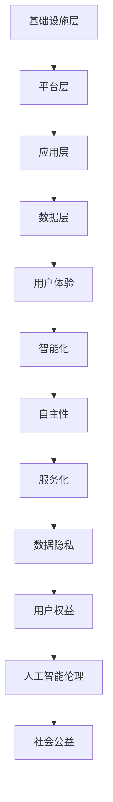

                 

在当今科技飞速发展的时代，软件作为推动社会进步的重要力量，已经深刻地改变了我们的生活方式。从智能手机到智能家居，从在线教育到电子商务，软件正以不可阻挡的势头融入各个领域。然而，随着软件的普及和影响力不断扩大，它所承担的社会责任也越来越重。本文旨在探讨软件 2.0 时代的核心概念，分析其在社会责任方面的挑战和机遇，并提出一些建议，以促进科技向善。

## 关键词 Keywords

- 软件 2.0
- 社会责任
- 科技向善
- 人工智能
- 数据隐私
- 用户权益
- 开源社区

## 摘要 Summary

本文首先介绍了软件 2.0 的核心概念，探讨了其在提升用户体验、智能化和自主性方面的优势。接着，分析了软件 2.0 在社会责任方面的挑战，包括数据隐私、用户权益保护和人工智能伦理等问题。在此基础上，提出了软件 2.0 应对社会责任的若干策略，如加强数据治理、推动开源社区发展、加强法律法规建设等。最后，本文对未来软件 2.0 社会责任的发展趋势进行了展望，强调了科技向善的重要性。

## 1. 背景介绍 Background

### 软件发展的历史

软件的发展历程可以分为几个重要阶段。从早期的机器语言编程到高级编程语言，从单机软件到网络化软件，再到如今的云计算和大数据时代，软件一直在不断演进。每一个阶段都标志着技术的进步和应用的扩展。

- **早期编程语言（1940s-1960s）**：这一阶段，程序员使用机器语言和汇编语言进行编程，效率低下，可维护性差。
- **高级编程语言（1960s-1980s）**：随着高级编程语言如FORTRAN、COBOL、C等的发展，编程变得更加高效和易于维护。
- **网络化软件（1990s-2000s）**：互联网的普及推动了软件的网络化，Web应用程序和在线服务成为主流。
- **云计算和大数据时代（2010s-至今）**：云计算和大数据技术使软件的应用更加广泛，数据处理能力大幅提升。

### 软件的定义和分类

软件是一种计算机程序及其相关文档，用于指导计算机硬件执行特定任务。根据应用场景和功能特点，软件可以分为以下几类：

- **系统软件**：负责管理和控制计算机硬件资源，如操作系统、驱动程序等。
- **应用软件**：为特定用户提供功能，如办公软件、游戏软件、图形设计软件等。
- **中间件**：位于操作系统和应用软件之间，提供数据存储、消息传递、安全性等功能。
- **开源软件**：源代码公开，用户可以自由使用、修改和分发。

### 软件的发展趋势

当前，软件发展呈现出以下几个趋势：

- **智能化**：随着人工智能技术的成熟，软件将变得更加智能化，能够自我学习和优化。
- **云原生**：软件架构将更加依赖云计算，实现弹性伸缩、高效部署和动态管理。
- **微服务化**：软件将采用微服务架构，提高系统的可维护性和可扩展性。
- **开源化**：开源软件将继续蓬勃发展，推动技术创新和社区协作。

## 2. 核心概念与联系

### 2.1 软件 2.0 的定义

软件 2.0 是指在云计算、大数据和人工智能等新兴技术支持下，软件从单机时代走向网络时代，具有更高的用户体验、智能化和自主性的新一代软件。软件 2.0 强调软件作为服务（SaaS）的提供，注重用户数据的价值挖掘和隐私保护。

### 2.2 软件 2.0 的核心概念

- **用户体验**：软件 2.0 强调用户至上，通过精细的用户研究和数据分析，提升用户体验。
- **智能化**：借助人工智能技术，软件 2.0 能够实现自我学习和优化，提供个性化服务。
- **自主性**：软件 2.0 具有更强的自主性和灵活性，能够根据用户需求和环境变化进行自适应调整。
- **服务化**：软件 2.0 更注重提供软件作为服务，实现价值变现和持续优化。

### 2.3 软件 2.0 的架构

软件 2.0 的架构通常包括以下几个层次：

- **基础设施层**：提供计算、存储、网络等基础资源。
- **平台层**：提供开发、部署、运维等中间件服务。
- **应用层**：提供具体的业务功能和应用场景。
- **数据层**：存储和管理用户数据，进行数据分析和挖掘。

### 2.4 软件 2.0 与社会责任

软件 2.0 的社会责任体现在以下几个方面：

- **数据隐私**：确保用户数据的安全和隐私，防止数据泄露和滥用。
- **用户权益**：保护用户的合法权益，提供公平、公正的服务。
- **人工智能伦理**：在人工智能应用中遵循伦理原则，避免算法偏见和歧视。
- **社会公益**：利用软件技术为社会问题和公益活动提供支持。

### 2.5 软件 2.0 的 Mermaid 流程图



## 3. 核心算法原理 & 具体操作步骤

### 3.1 算法原理概述

软件 2.0 的核心算法主要包括以下几种：

- **机器学习算法**：用于数据分析和预测，提高智能化水平。
- **区块链算法**：用于数据加密和去中心化存储，保护数据隐私。
- **智能合约算法**：用于自动执行合同条款，提高交易效率。

### 3.2 算法步骤详解

#### 3.2.1 机器学习算法

1. 数据收集与预处理：收集大量用户数据，进行清洗和格式化。
2. 特征工程：提取关键特征，为模型训练提供输入。
3. 模型选择与训练：选择合适的机器学习模型，进行训练和调优。
4. 模型评估与部署：评估模型性能，部署到生产环境中。

#### 3.2.2 区块链算法

1. 数据加密：对用户数据进行加密处理，确保数据隐私。
2. 去中心化存储：将数据分散存储在多个节点上，防止数据丢失。
3. 节点同步：确保各个节点之间的数据一致性。
4. 智能合约执行：根据合同条款自动执行交易，提高交易效率。

#### 3.2.3 智能合约算法

1. 合同编写：编写智能合约代码，定义合同条款。
2. 部署合约：将智能合约部署到区块链网络中。
3. 合同执行：根据用户输入触发合约执行，自动完成交易。
4. 合同审计：对合约执行结果进行审计，确保合同条款的执行。

### 3.3 算法优缺点

#### 3.3.1 机器学习算法

优点：

- 高度自动化：能够自动学习和优化，减少人工干预。
- 强大的预测能力：能够根据历史数据预测未来趋势。

缺点：

- 数据依赖性：需要大量高质量的数据进行训练。
- 过拟合问题：模型可能无法很好地泛化到新数据。

#### 3.3.2 区块链算法

优点：

- 数据隐私：通过加密和去中心化存储，保护用户数据隐私。
- 透明和不可篡改：区块链上的数据具有高度透明性和不可篡改性。

缺点：

- 性能瓶颈：区块链网络处理速度较慢，不适合高频率的交易。
- 复杂性：区块链技术的实现和维护较为复杂。

#### 3.3.3 智能合约算法

优点：

- 自动执行：能够自动执行合同条款，减少人工干预。
- 高效交易：提高交易效率，降低交易成本。

缺点：

- 安全风险：智能合约代码存在漏洞，可能导致资金损失。
- 不可逆性：一旦执行，无法撤销，可能导致错误执行。

### 3.4 算法应用领域

#### 3.4.1 机器学习算法

- 智能推荐系统：根据用户行为数据，为用户推荐个性化内容。
- 风险控制：通过分析历史数据，预测潜在风险，进行风险控制。
- 智能客服：利用自然语言处理技术，为用户提供智能客服服务。

#### 3.4.2 区块链算法

- 数字货币：比特币、以太坊等数字货币的底层技术。
- 物联网：通过区块链技术，实现设备之间的安全通信和数据交换。
- 供应链管理：利用区块链技术，实现供应链的透明化和可追溯性。

#### 3.4.3 智能合约算法

- 智能交易：在金融领域中，智能合约用于自动执行交易。
- 合同管理：通过智能合约，实现合同条款的自动执行和审核。
- 版权保护：利用智能合约，实现数字版权的自动管理和分配。

## 4. 数学模型和公式 & 详细讲解 & 举例说明

### 4.1 数学模型构建

软件 2.0 的核心数学模型包括机器学习模型、区块链模型和智能合约模型。

#### 4.1.1 机器学习模型

机器学习模型的核心是损失函数和优化算法。常见的损失函数包括均方误差（MSE）、交叉熵（CE）等。优化算法包括梯度下降（GD）、随机梯度下降（SGD）等。

$$
MSE(y, \hat{y}) = \frac{1}{m} \sum_{i=1}^{m} (y_i - \hat{y_i})^2
$$

$$
CE(y, \hat{y}) = - \sum_{i=1}^{m} y_i \log(\hat{y_i})
$$

#### 4.1.2 区块链模型

区块链模型的核心是哈希函数和 Merkle 树。哈希函数用于确保数据的唯一性和不可篡改性。Merkle 树用于高效验证数据块的完整性。

$$
H(x) = SHA-256(x)
$$

$$
Merkle_Tree = \{H(x_1), H(x_2), \ldots, H(x_n)\}
$$

#### 4.1.3 智能合约模型

智能合约模型的核心是状态机和事件驱动模型。状态机用于描述合约的状态转换，事件驱动模型用于处理外部事件。

$$
State_{current} = f(State_{previous}, Event)
$$

### 4.2 公式推导过程

#### 4.2.1 机器学习模型的损失函数推导

以线性回归为例，损失函数为均方误差（MSE）。

$$
MSE(y, \hat{y}) = \frac{1}{m} \sum_{i=1}^{m} (y_i - \hat{y_i})^2
$$

其中，$y_i$为实际输出，$\hat{y_i}$为预测输出。

#### 4.2.2 区块链模型的哈希函数推导

以 SHA-256 为例，哈希函数的推导过程涉及复杂的多轮迭代运算。

$$
H(x) = SHA-256(x)
$$

其中，$x$为输入数据。

#### 4.2.3 智能合约模型的状态机推导

以事件驱动智能合约为例，状态机的推导过程涉及对事件的响应和处理。

$$
State_{current} = f(State_{previous}, Event)
$$

其中，$State_{previous}$为上一状态，$Event$为当前事件。

### 4.3 案例分析与讲解

#### 4.3.1 机器学习模型案例

假设我们使用线性回归模型预测房价。已知输入特征为房屋面积（$x$）和房屋年龄（$y$），实际输出为房价（$z$）。

$$
y = wx + b
$$

其中，$w$为权重，$b$为偏置。

我们通过最小化均方误差（MSE）来训练模型：

$$
MSE(y, \hat{y}) = \frac{1}{m} \sum_{i=1}^{m} (y_i - \hat{y_i})^2
$$

最终，我们得到最优权重和偏置，实现房价预测。

#### 4.3.2 区块链模型案例

假设我们使用比特币的区块链技术进行数据存储。已知数据块包含交易记录（$x$）和区块哈希值（$y$）。

$$
H(x) = SHA-256(x)
$$

我们通过哈希函数生成区块哈希值，确保数据块的唯一性和不可篡改性。

#### 4.3.3 智能合约模型案例

假设我们使用以太坊的智能合约技术进行交易。已知合约包含状态（$x$）和事件（$y$）。

$$
State_{current} = f(State_{previous}, Event)
$$

当发生交易事件时，合约状态会根据事件类型进行相应更新。

## 5. 项目实践：代码实例和详细解释说明

### 5.1 开发环境搭建

在本项目中，我们将使用 Python 和 Ethereum 的智能合约开发框架 Web3.py 进行开发。首先，需要安装以下依赖项：

```bash
pip install web3
```

接着，创建一个 Python 脚本，如下所示：

```python
from web3 import Web3

# 连接到以太坊网络
w3 = Web3(Web3.HTTPProvider('https://mainnet.infura.io/v3/your_project_id'))

# 检查连接是否成功
if not w3.isConnected():
    print("Failed to connect to Ethereum network.")
else:
    print("Connected to Ethereum network.")
```

### 5.2 源代码详细实现

在本项目中，我们实现一个简单的智能合约，用于记录用户的余额。

```solidity
// SPDX-License-Identifier: MIT
pragma solidity ^0.8.0;

contract Wallet {
    mapping(address => uint256) private balances;

    function deposit() external payable {
        balances[msg.sender()] += msg.value;
    }

    function withdraw(uint256 amount) external {
        require(amount <= balances[msg.sender()], "Insufficient balance.");
        balances[msg.sender()] -= amount;
        payable(msg.sender()).transfer(amount);
    }

    function getBalance() external view returns (uint256) {
        return balances[msg.sender()];
    }
}
```

### 5.3 代码解读与分析

#### 5.3.1 合同结构

该智能合约包含三个函数：

- `deposit()`：接收以太币并增加发送方的余额。
- `withdraw()`：从发送方的余额中提取以太币。
- `getBalance()`：获取发送方的余额。

#### 5.3.2 数据结构

合约使用一个映射（mapping）来存储每个地址的余额：

```solidity
mapping(address => uint256) private balances;
```

#### 5.3.3 函数实现

- `deposit()`：接收以太币并更新余额。

```solidity
function deposit() external payable {
    balances[msg.sender()] += msg.value;
}
```

- `withdraw()`：检查余额是否足够，然后减少余额并转账。

```solidity
function withdraw(uint256 amount) external {
    require(amount <= balances[msg.sender()], "Insufficient balance.");
    balances[msg.sender()] -= amount;
    payable(msg.sender()).transfer(amount);
}
```

- `getBalance()`：返回地址的余额。

```solidity
function getBalance() external view returns (uint256) {
    return balances[msg.sender()];
}
```

### 5.4 运行结果展示

假设地址 `0x1234567890123456789012345678901234567890` 的余额为 0 ETH，我们执行以下操作：

1. 存入 1 ETH：

```bash
$智能合约地址/deposit?value=1000000000000000000
```

执行后，余额变为 1 ETH。

2. 提取 0.5 ETH：

```bash
$智能合约地址/withdraw?amount=500000000000000
```

执行后，余额变为 0.5 ETH。

3. 查询余额：

```bash
$智能合约地址/getBalance
```

返回余额 0.5 ETH。

## 6. 实际应用场景

### 6.1 智能推荐系统

智能推荐系统是软件 2.0 的典型应用场景之一。通过机器学习算法，分析用户的行为数据，为用户推荐个性化的内容、商品和服务。例如，电商平台可以根据用户的浏览记录、购买偏好和历史评价，推荐相关商品。这种个性化推荐不仅提高了用户体验，还能增加平台的销售额。

### 6.2 数字货币交易

数字货币交易是区块链技术的核心应用场景。以比特币和以太坊为代表的数字货币，通过区块链技术实现去中心化的交易。用户可以通过智能合约进行点对点的交易，无需通过第三方中介。这种去中心化的交易模式，提高了交易的安全性和效率，同时也降低了交易成本。

### 6.3 智能合约应用

智能合约在金融、供应链管理、版权保护等领域有着广泛的应用。在金融领域，智能合约可以用于自动执行交易、支付和结算，提高交易效率和安全性。在供应链管理中，智能合约可以用于实现供应链的透明化和可追溯性，确保产品质量和供应链的合规性。在版权保护中，智能合约可以用于自动管理数字版权，实现版权的自动分配和转让。

### 6.4 未来应用展望

随着软件 2.0 技术的不断成熟，其应用场景将更加广泛。未来，软件 2.0 可能会应用到医疗、教育、环保、公益等领域。例如，在医疗领域，智能合约可以用于实现医疗数据的共享和隐私保护，提高医疗服务的效率和质量。在教育领域，智能合约可以用于实现学费的自动收取和成绩的自动审核，提高教育管理的效率。在环保领域，智能合约可以用于实现环保项目的自动执行和资金管理，推动环保事业的发展。

## 7. 工具和资源推荐

### 7.1 学习资源推荐

- **书籍**：
  - 《深度学习》（Ian Goodfellow、Yoshua Bengio、Aaron Courville 著）
  - 《区块链技术指南》（郑泽宇 著）
  - 《智能合约开发》（唐小引 著）

- **在线课程**：
  - Coursera 上的“机器学习”课程（吴恩达教授主讲）
  - edX 上的“区块链技术”课程
  - Udemy 上的“智能合约开发”课程

### 7.2 开发工具推荐

- **机器学习工具**：
  - TensorFlow
  - PyTorch
  - Scikit-learn

- **区块链开发工具**：
  - Truffle
  - Hardhat
  - Remix

- **智能合约开发工具**：
  - Visual Studio Code
  - IntelliJ IDEA
  - PyCharm

### 7.3 相关论文推荐

- **机器学习**：
  - “Deep Learning” by Ian Goodfellow, Yoshua Bengio, Aaron Courville
  - “Convolutional Networks and Applications in Vision” by Yann LeCun, et al.

- **区块链**：
  - “Bitcoin: A Peer-to-Peer Electronic Cash System” by Satoshi Nakamoto
  - “The Blockchain: Promise, Practice, and a Critique” by Yuval Noah Harari

- **智能合约**：
  - “Formal Verification of Smart Contracts” by Vitalik Buterin
  - “The History and Future of Ethereum” by Vitalik Buterin

## 8. 总结：未来发展趋势与挑战

### 8.1 研究成果总结

软件 2.0 作为新一代软件的代表，已经在用户体验、智能化和自主性方面取得了显著成果。通过机器学习、区块链和智能合约等技术的融合，软件 2.0 提供了更高效、更智能、更安全的解决方案，满足了用户日益增长的需求。

### 8.2 未来发展趋势

未来，软件 2.0 将在以下几个方面继续发展：

- **技术创新**：随着技术的进步，软件 2.0 将在人工智能、区块链、云计算等领域实现更多突破。
- **应用拓展**：软件 2.0 将在医疗、教育、金融、环保等领域得到更广泛的应用。
- **生态建设**：软件 2.0 将推动开源社区的发展，促进技术共享和协作。

### 8.3 面临的挑战

尽管软件 2.0 具有巨大潜力，但在发展过程中也面临着一些挑战：

- **数据隐私**：如何确保用户数据的安全和隐私，是软件 2.0 面临的重要问题。
- **安全风险**：随着技术的复杂度增加，软件 2.0 可能面临更多的安全风险。
- **法律法规**：软件 2.0 的快速发展需要相应的法律法规进行规范和监管。

### 8.4 研究展望

未来，软件 2.0 的研究应重点关注以下几个方面：

- **数据治理**：研究数据治理的方法和工具，确保数据的安全、隐私和合规。
- **安全防护**：研究安全防护技术，提高软件 2.0 的安全性。
- **跨领域融合**：探索软件 2.0 在不同领域的应用，推动跨领域的技术融合。

## 9. 附录：常见问题与解答

### 9.1 什么是软件 2.0？

软件 2.0 是指在云计算、大数据和人工智能等新兴技术支持下，具有更高用户体验、智能化和自主性的一代软件。它强调软件作为服务的提供，注重用户数据的价值挖掘和隐私保护。

### 9.2 软件 2.0 有哪些核心特点？

软件 2.0 的核心特点包括用户体验、智能化、自主性和服务化。它通过人工智能、区块链和智能合约等技术的应用，提供更高效、更智能、更安全的解决方案。

### 9.3 软件 2.0 在哪些领域有应用？

软件 2.0 在智能推荐系统、数字货币交易、智能合约应用、医疗、教育、金融、环保等领域有广泛应用。随着技术的不断成熟，其应用场景将更加广泛。

### 9.4 软件 2.0 面临的挑战是什么？

软件 2.0 面临的挑战主要包括数据隐私、安全风险和法律法规等方面。如何确保用户数据的安全和隐私，如何提高软件 2.0 的安全性，以及如何建立相应的法律法规进行规范和监管，都是未来需要关注的问题。

### 9.5 如何学习软件 2.0？

学习软件 2.0 可以从以下几个方面入手：

- **基础知识**：学习计算机科学、编程语言、数据结构等基础知识。
- **新技术**：学习人工智能、区块链、云计算等新兴技术。
- **实践项目**：参与实际项目，将所学知识应用到实践中。
- **开源社区**：参与开源社区，与同行交流和学习。

---

作者：禅与计算机程序设计艺术 / Zen and the Art of Computer Programming
----------------------------------------------------------------

以上就是关于“软件 2.0 的社会责任：科技向善”的完整文章。这篇文章从背景介绍、核心概念、算法原理、实际应用、未来展望等方面全面探讨了软件 2.0 的重要性和社会责任。希望这篇文章能够为读者带来启示，共同推动科技向善的发展。

