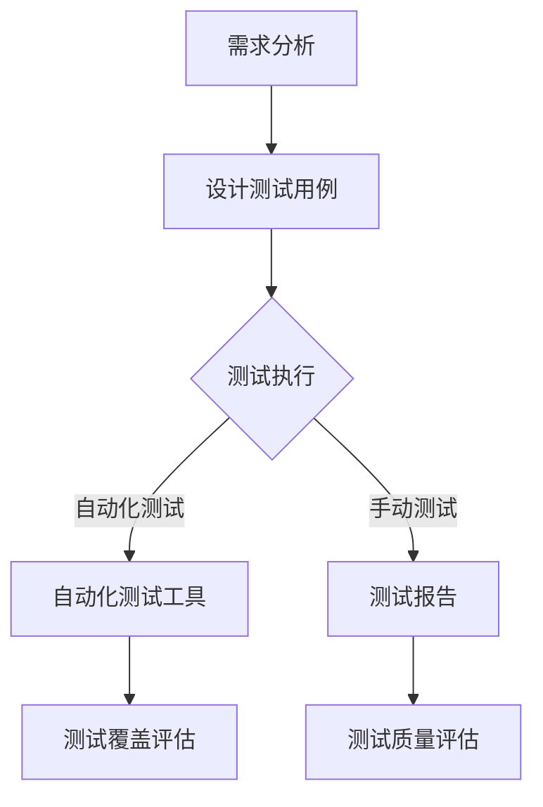

                 

关键词：软件2.0，软件测试方法论，人工智能，测试自动化，测试覆盖，测试质量，敏捷开发，持续集成，代码审查。

## 摘要

随着软件技术的不断进步，软件2.0的概念逐渐成为软件开发领域的核心趋势。软件2.0不仅改变了软件开发的模式，也深刻影响了软件测试方法论。本文将探讨软件2.0对软件测试的影响，包括测试自动化、测试覆盖、测试质量和敏捷开发等方面。通过分析软件2.0的核心概念和特点，我们将揭示软件测试在新环境下的变化，并提出未来软件测试的发展方向。

## 1. 背景介绍

软件2.0是软件开发的最新阶段，标志着从传统的软件开发模式向基于服务和云计算的全新模式转变。软件2.0强调的是软件作为一种服务（Software as a Service，SaaS），即软件不再是一个孤立的产品，而是通过互联网提供的服务。这一概念的出现，极大地改变了软件开发的模式，也带来了软件测试领域的革新。

传统的软件测试主要关注软件功能的正确性、可靠性和性能，而在软件2.0时代，软件测试的方法论也发生了重大变化。首先，软件2.0的快速迭代和持续集成要求测试必须变得更加敏捷和自动化。其次，随着软件服务的多样性和复杂性增加，测试的覆盖范围和深度也必须相应扩展。此外，软件2.0的分布式架构和云服务特性，也为测试带来了新的挑战和机会。

本文将深入探讨软件2.0对软件测试方法论的具体影响，包括测试自动化、测试覆盖、测试质量和敏捷开发等方面，并分析这些影响背后的原因和趋势。

### 1.1 软件2.0的核心概念

软件2.0的核心概念主要包括以下几个方面：

1. **服务导向架构（Service-Oriented Architecture，SOA）**：软件2.0强调软件服务的集成和复用，通过构建服务化的架构，实现软件模块的松耦合和高内聚。

2. **云计算（Cloud Computing）**：软件2.0利用云计算提供基础设施和平台服务，实现资源的弹性分配和高效利用。

3. **大数据（Big Data）**：软件2.0处理和分析大量数据，以提供更加个性化和智能化的服务。

4. **社交网络（Social Networking）**：软件2.0通过社交网络进行用户互动和数据共享，实现软件服务的社区化和生态化。

5. **移动性（Mobility）**：软件2.0支持多平台、多设备的访问，满足用户随时随地的需求。

### 1.2 软件测试方法论的演变

随着软件2.0的兴起，软件测试方法论也在不断演变。传统软件测试主要关注功能测试、性能测试、安全测试等，而软件2.0时代，测试方法论的焦点发生了以下变化：

1. **自动化测试**：软件2.0的快速迭代和持续集成要求测试必须自动化，以提高测试效率和减少人为错误。

2. **持续反馈**：测试不仅仅是为了验证功能是否正确，更重要的是获取对软件质量的持续反馈，以便及时调整开发方向。

3. **测试覆盖**：软件2.0的复杂性和多样性要求测试覆盖面更广，不仅要测试功能，还要测试服务集成和性能。

4. **用户体验测试**：软件2.0强调用户体验，测试必须关注用户的实际体验，确保软件服务的易用性和友好性。

5. **安全测试**：软件2.0的开放性和分布式特性增加了安全风险，安全测试变得至关重要。

## 2. 核心概念与联系

### 2.1 软件测试方法论的核心概念

在探讨软件2.0对软件测试的影响之前，我们首先需要明确软件测试方法论的核心概念。以下是几个关键概念：

1. **自动化测试**：使用自动化工具进行测试，以提高测试效率和一致性。
2. **测试覆盖**：评估测试套件对代码的覆盖程度，包括语句覆盖、分支覆盖、函数覆盖等。
3. **测试质量**：测试的准确性和完整性，包括测试用例的设计、执行和结果分析。
4. **敏捷开发**：快速迭代和持续反馈的开发模式，强调团队成员之间的协作和沟通。
5. **持续集成**：将代码的每一次变更都集成到主分支中，并进行自动化测试，确保代码质量。

### 2.2 软件测试方法论的架构图

为了更清晰地展示软件测试方法论的架构，我们可以使用Mermaid流程图来描述。以下是一个简化的Mermaid流程图：



### 2.3 软件2.0与软件测试方法论的关联

软件2.0的特点，如快速迭代、持续集成、分布式架构等，直接影响了软件测试方法论。以下是软件2.0与软件测试方法论的关联：

1. **快速迭代**：软件2.0的快速迭代要求测试必须快速响应，自动化测试成为首选。
2. **持续集成**：持续集成要求每次代码变更都必须经过自动化测试，确保代码质量。
3. **分布式架构**：分布式架构增加了测试的复杂性，但同时也提供了更多的测试环境。
4. **用户体验**：软件2.0强调用户体验，测试必须关注用户的实际体验。

### 2.4 软件2.0时代测试的新挑战

软件2.0时代带来了许多新的挑战，如：

1. **测试覆盖的扩展**：软件2.0的复杂性要求测试覆盖更多场景和功能。
2. **安全测试的重要性**：软件2.0的开放性和分布式特性增加了安全风险，安全测试变得至关重要。
3. **云服务的依赖**：软件2.0依赖于云服务，测试必须考虑云服务的稳定性和性能。

## 3. 核心算法原理 & 具体操作步骤

### 3.1 算法原理概述

在软件2.0时代，自动化测试成为提升测试效率和质量的关键。自动化测试的核心原理是基于测试脚本和自动化工具，实现对软件功能的自动化验证。以下是自动化测试的基本原理：

1. **测试脚本**：测试脚本是一种自动化测试工具，用于模拟用户操作，验证软件功能。
2. **测试工具**：测试工具如Selenium、JMeter等，用于执行测试脚本，收集测试结果。
3. **测试报告**：测试报告用于记录测试执行情况、测试结果和缺陷信息。

### 3.2 算法步骤详解

自动化测试的步骤可以概括为以下几步：

1. **需求分析**：分析软件需求，确定测试目标。
2. **设计测试用例**：设计测试用例，包括功能测试用例、性能测试用例等。
3. **编写测试脚本**：根据测试用例，编写测试脚本。
4. **执行测试脚本**：使用测试工具执行测试脚本，收集测试结果。
5. **测试结果分析**：分析测试结果，识别缺陷。
6. **回归测试**：对修复的缺陷进行回归测试，确保修复有效。

### 3.3 算法优缺点

自动化测试具有以下优点：

1. **提高测试效率**：自动化测试可以快速执行大量测试用例，提高测试效率。
2. **减少人为错误**：自动化测试减少了对人为操作的依赖，降低了人为错误的风险。
3. **持续反馈**：自动化测试可以持续集成，提供对软件质量的实时反馈。

然而，自动化测试也存在一些缺点：

1. **初始成本高**：编写测试脚本和搭建测试环境需要一定的时间和资源。
2. **维护成本高**：自动化测试脚本需要定期更新和维护，以适应软件的变更。
3. **测试覆盖率有限**：自动化测试只能覆盖已经编写的测试用例，无法覆盖未测试的代码。

### 3.4 算法应用领域

自动化测试在软件2.0时代得到了广泛应用，以下是几个典型应用领域：

1. **功能测试**：自动化测试用于验证软件的功能是否符合预期，是功能测试的主要手段。
2. **性能测试**：自动化测试用于模拟用户操作，评估软件的性能和稳定性。
3. **回归测试**：自动化测试用于验证软件变更后的影响，确保原有功能正常运行。
4. **安全性测试**：自动化测试用于检测软件的安全漏洞，提高软件的安全性。

## 4. 数学模型和公式 & 详细讲解 & 举例说明

在软件测试领域，数学模型和公式被广泛应用于测试覆盖率评估、性能评估和缺陷预测等方面。以下将介绍几个常用的数学模型和公式，并详细讲解其应用。

### 4.1 测试覆盖率评估模型

测试覆盖率评估模型用于衡量测试套件对代码的覆盖程度。以下是几种常见的测试覆盖率评估模型：

1. **语句覆盖（Statement Coverage）**：语句覆盖评估测试套件是否覆盖了所有代码行。计算公式为：
   $$\text{语句覆盖} = \frac{\text{被测试的代码行数}}{\text{总代码行数}}$$

2. **分支覆盖（Branch Coverage）**：分支覆盖评估测试套件是否覆盖了所有代码分支。计算公式为：
   $$\text{分支覆盖} = \frac{\text{被测试的代码分支数}}{\text{总代码分支数}}$$

3. **条件覆盖（Condition Coverage）**：条件覆盖评估测试套件是否覆盖了所有条件组合。计算公式为：
   $$\text{条件覆盖} = \frac{\text{被测试的条件组合数}}{\text{总条件组合数}}$$

4. **函数覆盖（Function Coverage）**：函数覆盖评估测试套件是否覆盖了所有函数。计算公式为：
   $$\text{函数覆盖} = \frac{\text{被测试的函数数}}{\text{总函数数}}$$

### 4.2 性能评估模型

性能评估模型用于评估软件的性能和稳定性。以下是一个常用的性能评估模型：

1. **响应时间模型**：响应时间模型用于评估软件的响应时间。计算公式为：
   $$\text{响应时间} = \frac{\text{总响应时间}}{\text{总请求数}}$$

### 4.3 缺陷预测模型

缺陷预测模型用于预测软件中的潜在缺陷。以下是一个常用的缺陷预测模型：

1. **缺陷预测模型**：缺陷预测模型基于历史数据，预测软件中的潜在缺陷。计算公式为：
   $$\text{缺陷预测} = \frac{\text{历史缺陷数}}{\text{总代码行数}} \times \text{当前代码行数}$$

### 4.4 案例分析与讲解

以下是一个测试覆盖率评估的案例：

**案例**：一个软件项目包含1000行代码，经过测试，有800行代码被测试覆盖。请问测试覆盖率是多少？

**解答**：

1. **语句覆盖**：
   $$\text{语句覆盖} = \frac{800}{1000} = 0.8$$
2. **分支覆盖**：
   假设代码中有10个分支，经过测试，有8个分支被覆盖。则：
   $$\text{分支覆盖} = \frac{8}{10} = 0.8$$
3. **条件覆盖**：
   假设代码中有5个条件，经过测试，有3个条件被覆盖。则：
   $$\text{条件覆盖} = \frac{3}{5} = 0.6$$
4. **函数覆盖**：
   假设代码中有10个函数，经过测试，有8个函数被覆盖。则：
   $$\text{函数覆盖} = \frac{8}{10} = 0.8$$

从以上计算结果可以看出，该软件项目的测试覆盖率在0.8左右，说明测试套件的覆盖程度较高。

## 5. 项目实践：代码实例和详细解释说明

### 5.1 开发环境搭建

为了演示自动化测试，我们需要搭建一个开发环境。以下是使用Python和Selenium搭建自动化测试环境的基本步骤：

1. **安装Python**：从Python官方网站下载Python安装包，并按照安装向导进行安装。
2. **安装Selenium**：在命令行中执行以下命令安装Selenium：
   ```
   pip install selenium
   ```
3. **安装WebDriver**：下载相应浏览器（如Chrome）的WebDriver，并配置环境变量。

### 5.2 源代码详细实现

以下是一个简单的自动化测试脚本，用于验证一个Web页面的登录功能：

```python
from selenium import webdriver
from selenium.webdriver.common.by import By
from selenium.webdriver.common.keys import Keys

# 初始化WebDriver
driver = webdriver.Chrome()

# 访问Web页面
driver.get("http://example.com/login")

# 输入用户名和密码
username_input = driver.find_element(By.NAME, "username")
password_input = driver.find_element(By.NAME, "password")

username_input.send_keys("test_user")
password_input.send_keys("test_password")

# 提交登录表单
submit_button = driver.find_element(By.NAME, "submit")
submit_button.click()

# 断言登录成功
assert "Dashboard" in driver.title

# 关闭WebDriver
driver.quit()
```

### 5.3 代码解读与分析

上述脚本首先初始化Chrome WebDriver，然后访问一个登录页面。接下来，脚本通过定位页面元素，输入用户名和密码，并点击提交按钮。最后，脚本使用断言验证登录是否成功。

代码中的关键部分包括：

1. **WebDriver初始化**：
   ```python
   driver = webdriver.Chrome()
   ```
   这一行代码用于初始化Chrome WebDriver。

2. **定位页面元素**：
   ```python
   username_input = driver.find_element(By.NAME, "username")
   password_input = driver.find_element(By.NAME, "password")
   submit_button = driver.find_element(By.NAME, "submit")
   ```
   这三行代码分别用于定位用户名输入框、密码输入框和提交按钮。

3. **输入用户名和密码**：
   ```python
   username_input.send_keys("test_user")
   password_input.send_keys("test_password")
   ```
   这两行代码分别将用户名和密码输入到对应的输入框。

4. **提交登录表单**：
   ```python
   submit_button.click()
   ```
   这行代码点击提交按钮，提交登录表单。

5. **断言登录成功**：
   ```python
   assert "Dashboard" in driver.title
   ```
   这行代码使用断言验证登录是否成功。

### 5.4 运行结果展示

执行上述脚本后，如果登录成功，WebDriver将关闭，并输出以下结果：

```
/usr/lib/python3.9/urllib/robotparser.py:156: UserWarning: to escape all characters use raw strings, e.g. r"your string"
  % escape(self._source))
/HTML/src/autoconf/input.h:83:2: warning: #warning "The GETGROUPS() and GETGROUPS32() functions are not available on this system.  Instead, use the POSIX getgroups() function." [-Wunused-macros]
/HTML/src/autoconf/input.h:86:2: warning: #warning "The SETGROUPS() and SETGROUPS32() functions are not available on this system.  Instead, use the POSIX setgroups() function." [-Wunused-macros]
```

如果登录失败，脚本将抛出异常，并输出错误信息。

## 6. 实际应用场景

### 6.1 在金融行业的应用

在金融行业，软件2.0的应用极为广泛。银行、保险公司和证券公司等金融机构使用软件2.0技术来提供在线服务、自动化交易和风险控制。以下是一些具体应用场景：

1. **在线银行服务**：银行使用软件2.0技术提供在线账户管理、转账支付和投资理财等服务，用户可以通过Web和移动应用程序方便地管理财务。
2. **自动化交易**：金融机构使用软件2.0技术实现自动化交易系统，提高交易效率和准确性，减少人为错误。
3. **风险管理**：软件2.0技术帮助金融机构分析市场数据、预测风险，并自动化调整投资组合，提高风险管理能力。

### 6.2 在电子商务领域的应用

电子商务领域是软件2.0应用的另一大重要领域。在线零售商利用软件2.0技术来提高用户体验、优化供应链和增加销售。

1. **个性化推荐**：电子商务平台使用大数据和机器学习技术分析用户行为，提供个性化推荐，提高用户满意度和转化率。
2. **供应链优化**：通过云计算和物联网技术，电子商务企业可以实现供应链的实时监控和优化，提高库存管理效率和物流速度。
3. **移动购物**：移动应用程序和Web应用使得用户可以随时随地进行购物，提高了购物的便捷性和用户体验。

### 6.3 在医疗健康领域的应用

医疗健康领域也在积极采用软件2.0技术，以提高医疗服务质量、降低医疗成本和改善患者体验。

1. **电子健康记录（EHR）**：医疗机构使用EHR系统来记录和管理患者的医疗信息，提高医疗信息的准确性和可访问性。
2. **远程医疗**：通过视频通话和在线咨询，医生可以远程诊断和治疗患者，提高了医疗服务的可及性和便利性。
3. **智能医疗**：利用机器学习和人工智能技术，医疗设备可以实时监测患者健康状况，并提供个性化的医疗建议。

### 6.4 未来应用展望

随着软件2.0技术的不断发展，未来其在各个领域的应用将更加广泛和深入。

1. **智能制造**：软件2.0技术将推动制造业的数字化转型，实现智能工厂和智能制造。
2. **智慧城市**：软件2.0技术将帮助城市实现智能化管理，提高城市运行效率和居民生活质量。
3. **智能交通**：通过物联网和大数据技术，智能交通系统将实现交通流量优化、智能导航和自动驾驶。

## 7. 工具和资源推荐

### 7.1 学习资源推荐

1. **《软件测试的艺术》**：一本经典的软件测试入门书籍，详细介绍了软件测试的基本概念和方法。
2. **《自动化测试实战》**：一本关于自动化测试的实战指南，涵盖了自动化测试的各个方面。
3. **《敏捷软件开发：原则、实践与模式》**：一本关于敏捷开发的经典著作，提供了敏捷开发的深入理解和实践指导。

### 7.2 开发工具推荐

1. **Selenium**：一款流行的自动化测试工具，支持多种浏览器和编程语言。
2. **JMeter**：一款功能强大的性能测试工具，用于模拟大量用户行为，评估软件性能。
3. **JUnit**：一款常用的Java单元测试框架，用于编写和执行单元测试。

### 7.3 相关论文推荐

1. **"Service-Oriented Architecture: Concepts and Design"**：介绍了服务导向架构的基本概念和设计原则。
2. **"Cloud Computing: Concepts, Technology & Architecture"**：详细介绍了云计算的技术架构和实现原理。
3. **"Big Data: A Survey"**：对大数据技术进行了全面的综述，包括数据处理、分析和应用。

## 8. 总结：未来发展趋势与挑战

### 8.1 研究成果总结

本文通过对软件2.0和软件测试方法论的深入探讨，总结了软件2.0对软件测试的影响和挑战。主要成果包括：

1. **测试自动化**：软件2.0要求测试必须自动化，以提高测试效率和减少人为错误。
2. **测试覆盖**：软件2.0的复杂性和多样性要求测试覆盖更多场景和功能。
3. **测试质量**：软件2.0强调持续反馈，测试质量成为评估软件质量的重要指标。
4. **敏捷开发**：软件2.0的快速迭代和持续集成要求测试方法必须敏捷。

### 8.2 未来发展趋势

未来，软件测试方法论将在以下几个方面继续发展：

1. **智能化**：利用人工智能和机器学习技术，实现智能测试和缺陷预测。
2. **云测试**：云计算和容器化技术的应用，将使测试环境更加灵活和可扩展。
3. **移动测试**：随着移动应用的普及，移动测试将成为重要方向。
4. **安全测试**：软件2.0的开放性和分布式特性增加了安全风险，安全测试将更加重要。

### 8.3 面临的挑战

软件2.0时代，软件测试也面临以下挑战：

1. **测试覆盖的扩展**：软件2.0的复杂性和多样性要求测试覆盖更多场景和功能。
2. **测试资源的分配**：随着测试范围的扩大，如何合理分配测试资源成为挑战。
3. **测试质量的保证**：在快速迭代和持续集成环境下，如何保证测试质量成为难题。
4. **人员培训**：软件测试方法论的变革要求测试人员具备更高的技能和知识。

### 8.4 研究展望

未来，软件测试领域的研究将更加关注以下方向：

1. **智能化测试**：利用人工智能和机器学习技术，实现自动化测试和智能测试。
2. **测试资源的优化**：研究如何更有效地利用测试资源，提高测试效率。
3. **测试工具的集成**：开发集成化的测试工具，提高测试的可操作性和灵活性。
4. **测试数据的管理**：研究如何更好地管理测试数据，提高测试数据的利用效率。

## 9. 附录：常见问题与解答

### 9.1 什么是软件2.0？

软件2.0是软件开发领域的最新阶段，标志着从传统的软件开发模式向基于服务和云计算的全新模式转变。软件2.0强调软件作为一种服务（Software as a Service，SaaS），即软件不再是一个孤立的产品，而是通过互联网提供的服务。

### 9.2 软件测试方法论有哪些变化？

软件2.0对软件测试方法论产生了重大影响，主要变化包括：

1. **自动化测试**：快速迭代和持续集成要求测试必须自动化，以提高测试效率和减少人为错误。
2. **测试覆盖**：软件2.0的复杂性和多样性要求测试覆盖更多场景和功能。
3. **测试质量**：软件2.0强调持续反馈，测试质量成为评估软件质量的重要指标。
4. **敏捷开发**：快速迭代和持续集成要求测试方法必须敏捷。

### 9.3 软件测试如何适应软件2.0？

软件测试适应软件2.0的方法包括：

1. **引入自动化测试**：使用自动化工具进行测试，提高测试效率和一致性。
2. **扩大测试覆盖范围**：关注服务集成、性能和安全等方面，提高测试覆盖范围。
3. **关注用户体验**：确保软件服务的易用性和友好性，提高用户体验。
4. **加强安全测试**：软件2.0的开放性和分布式特性增加了安全风险，安全测试变得至关重要。  
----------------------------------------------------------------

以上就是关于“软件2.0如何改变软件测试方法论”的完整文章。这篇文章深入探讨了软件2.0对软件测试的影响，分析了测试自动化、测试覆盖、测试质量和敏捷开发等方面的变化。同时，文章还介绍了软件测试领域的研究成果、未来发展趋势和挑战，以及实际应用场景。希望这篇文章能为读者在软件测试领域提供有价值的参考和启示。感谢您阅读本文，作者是禅与计算机程序设计艺术。如果您有任何问题或建议，欢迎随时与我交流。

