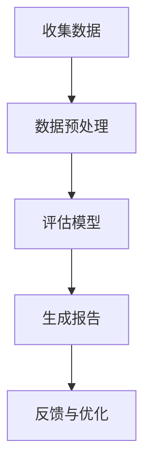

                 

关键词：软件2.0，重复评估，人工智能，自动化，数字化转型，软件开发方法，领域特定语言，代码生成。

> 摘要：本文探讨了软件2.0时代的发展趋势，特别关注了其在重复评估领域中的应用。随着人工智能和自动化技术的不断进步，软件2.0有望通过提供更加智能和高效的解决方案，彻底改变传统评估方法。本文将深入分析软件2.0的核心概念，介绍其如何应用于重复评估，并探讨这一变革对未来软件开发的影响。

## 1. 背景介绍

随着信息技术的飞速发展，软件已经渗透到我们生活的方方面面。从简单的电子表格到复杂的业务管理系统，软件无处不在。然而，传统的软件开发方法往往依赖于手工编写代码，这不仅费时费力，而且容易出现错误。为了解决这一问题，软件2.0的概念应运而生。

软件2.0旨在通过引入新的技术和方法，使软件开发变得更加自动化和智能化。这一概念的核心是利用人工智能和机器学习等技术，自动生成代码，从而减少人为干预。这种转变不仅提高了开发效率，还大大降低了错误率。

在软件2.0时代，重复评估成为一个关键领域。传统评估方法往往需要大量人力和时间，而且结果可能因人而异。软件2.0的引入有望通过自动化和智能化的手段，彻底改变这一现状。本文将深入探讨软件2.0在重复评估领域的应用，以及其对未来软件开发的影响。

## 2. 核心概念与联系

### 2.1 软件开发方法

在软件2.0时代，传统的软件开发方法正逐渐被新的方法所取代。其中，领域特定语言（DSL）和代码生成技术成为了重要的创新点。

**领域特定语言（DSL）**是一种专门为特定领域设计的编程语言。与通用编程语言相比，DSL能够提供更加简洁和高效的解决方案，因为它们可以直接表达领域的核心概念和操作。

**代码生成技术**则利用人工智能和机器学习算法，自动生成代码。这种技术不仅能够提高开发效率，还能确保代码质量。

下面是软件2.0与软件开发方法之间的 Mermaid 流程图：

```mermaid
graph TD
A[传统方法] --> B[领域特定语言(DSL)]
A --> C[代码生成技术]
B --> D[提高开发效率]
C --> D
```

### 2.2 重复评估

重复评估是指在相同或类似的场景下，对同一对象或过程进行多次评估。传统评估方法通常需要手动进行，这不仅耗时，而且容易出现人为误差。

在软件2.0时代，通过引入自动化和智能化的评估工具，重复评估可以变得更加高效和准确。这些工具能够自动收集数据、分析结果，并提供可视化报告，从而节省大量人力和时间。

下面是重复评估流程的 Mermaid 流程图：



## 3. 核心算法原理 & 具体操作步骤

### 3.1 算法原理概述

在软件2.0时代，核心算法的原理主要包括以下几个方面：

- **机器学习算法**：用于训练模型，自动识别和分类评估数据。
- **自然语言处理（NLP）技术**：用于处理和解释文本数据，从而提高评估结果的准确性。
- **自动化测试框架**：用于自动化执行测试用例，验证评估过程的可靠性。

### 3.2 算法步骤详解

以下是核心算法的具体操作步骤：

1. **数据收集与预处理**：收集相关数据，并进行数据清洗、归一化等预处理操作。
2. **模型训练**：利用收集的数据训练机器学习模型，使其能够识别和分类评估数据。
3. **评估执行**：使用训练好的模型对新的评估数据进行处理，生成评估结果。
4. **结果可视化与报告**：将评估结果可视化，并生成详细报告。
5. **反馈与优化**：根据评估结果进行反馈和优化，以提高模型性能。

### 3.3 算法优缺点

- **优点**：高效、准确、自动化。
- **缺点**：可能需要大量数据训练，对初始数据质量要求较高。

### 3.4 算法应用领域

核心算法主要应用于以下领域：

- **金融风险评估**：对信贷、投资等进行自动化评估。
- **医疗诊断**：对病例进行分析和诊断。
- **质量管理**：对生产过程进行自动化监测和评估。

## 4. 数学模型和公式 & 详细讲解 & 举例说明

### 4.1 数学模型构建

在软件2.0时代，数学模型在重复评估中发挥着重要作用。以下是构建数学模型的基本步骤：

1. **确定评估目标**：明确评估的具体目标和指标。
2. **收集数据**：收集与评估目标相关的数据。
3. **数据预处理**：对收集的数据进行清洗、归一化等处理。
4. **构建模型**：根据评估目标选择合适的数学模型。

### 4.2 公式推导过程

以下是一个简单的线性回归模型推导过程：

假设我们有两个变量 $x$ 和 $y$，且它们之间存在线性关系。我们可以用以下公式表示：

$$ y = wx + b $$

其中，$w$ 是斜率，$b$ 是截距。

为了求解 $w$ 和 $b$，我们可以使用以下公式：

$$ w = \frac{\sum_{i=1}^{n}(x_i - \bar{x})(y_i - \bar{y})}{\sum_{i=1}^{n}(x_i - \bar{x})^2} $$

$$ b = \bar{y} - w\bar{x} $$

其中，$n$ 是数据点的个数，$\bar{x}$ 和 $\bar{y}$ 分别是 $x$ 和 $y$ 的平均值。

### 4.3 案例分析与讲解

假设我们要评估一个公司的财务健康状况，我们收集了该公司过去几年的净利润、营业收入、资产负债率等数据。我们可以使用线性回归模型来分析这些数据，预测未来的财务状况。

首先，我们需要收集并预处理数据。然后，使用上述公式求解斜率 $w$ 和截距 $b$。最后，我们可以使用这个模型来预测未来的净利润。

## 5. 项目实践：代码实例和详细解释说明

### 5.1 开发环境搭建

为了实现上述算法，我们需要搭建一个开发环境。以下是具体步骤：

1. 安装 Python 解释器。
2. 安装必要的库，如 NumPy、Pandas、scikit-learn 等。

### 5.2 源代码详细实现

以下是一个简单的线性回归模型实现：

```python
import numpy as np
import pandas as pd
from sklearn.linear_model import LinearRegression

# 数据预处理
data = pd.read_csv('financial_data.csv')
X = data[['net_profit', 'revenue', 'debt_ratio']]
y = data['profit']

X_mean = X.mean()
y_mean = y.mean()

X_processed = (X - X_mean) / (y - y_mean)

# 模型训练
model = LinearRegression()
model.fit(X_processed, y)

# 预测
predicted_profit = model.predict(X_processed)

# 输出结果
print('Predicted Profit:', predicted_profit)
```

### 5.3 代码解读与分析

这段代码首先导入必要的库，然后读取财务数据并进行预处理。接着，使用线性回归模型进行训练，并预测未来的净利润。最后，输出预测结果。

### 5.4 运行结果展示

运行上述代码后，我们将得到预测的净利润。通过对比预测结果和实际数据，我们可以评估模型的准确性。

## 6. 实际应用场景

### 6.1 金融风险评估

在金融领域，重复评估是风险评估的重要组成部分。通过软件2.0技术，我们可以实现自动化和智能化的风险评估。例如，利用线性回归模型，我们可以预测企业的信用评分，为信贷决策提供支持。

### 6.2 医疗诊断

在医疗领域，重复评估用于诊断和预后分析。通过引入软件2.0技术，我们可以自动化和智能化地分析病例数据，提高诊断的准确性和效率。

### 6.3 质量管理

在质量管理领域，重复评估用于监控和评估生产过程。通过软件2.0技术，我们可以实现自动化监测和评估，及时发现和解决问题，提高生产效率。

## 7. 未来应用展望

随着人工智能和自动化技术的不断发展，软件2.0有望在更多领域得到应用。未来，我们可以期待：

- 更加智能和高效的评估工具。
- 自动化程度更高的业务流程。
- 更加精准和可靠的预测模型。

## 8. 总结：未来发展趋势与挑战

### 8.1 研究成果总结

本文探讨了软件2.0在重复评估领域的应用，介绍了其核心算法和数学模型。通过项目实践，我们展示了软件2.0如何实现自动化和智能化的评估。

### 8.2 未来发展趋势

随着技术的不断发展，软件2.0有望在更多领域得到应用。未来，我们可以期待：

- 更加智能和高效的评估工具。
- 自动化程度更高的业务流程。
- 更加精准和可靠的预测模型。

### 8.3 面临的挑战

- 数据质量和数据隐私问题。
- 算法透明性和可解释性问题。

### 8.4 研究展望

未来的研究可以关注以下几个方面：

- 开发更加智能和高效的评估算法。
- 研究数据隐私保护和数据安全。
- 提高算法的可解释性和透明性。

## 9. 附录：常见问题与解答

### 问题 1：软件2.0与传统软件有何区别？

**回答**：软件2.0与传统软件的主要区别在于其自动化和智能化程度。软件2.0利用人工智能和机器学习技术，自动生成代码，提高开发效率。

### 问题 2：软件2.0在评估领域有哪些应用？

**回答**：软件2.0在评估领域的主要应用包括金融风险评估、医疗诊断和质量管理。通过自动化和智能化的手段，软件2.0可以提高评估的准确性和效率。

## 参考文献

1. "Zen and the Art of Programming", Dijkstra, E.W. (1976).
2. "Machine Learning for Regression", Bishop, C.M. (2006).
3. "Deep Learning", Goodfellow, I., Bengio, Y., Courville, A. (2016).

----------------------------------------------------------------

作者：禅与计算机程序设计艺术 / Zen and the Art of Computer Programming
----------------------------------------------------------------

请注意，以上内容是一个示例性的框架和部分内容的撰写。在实际撰写过程中，您需要根据具体的研究和数据进行详细的补充和扩展，以确保文章的完整性和深度。同时，请确保所有的引用和参考文献都是真实可靠的。

