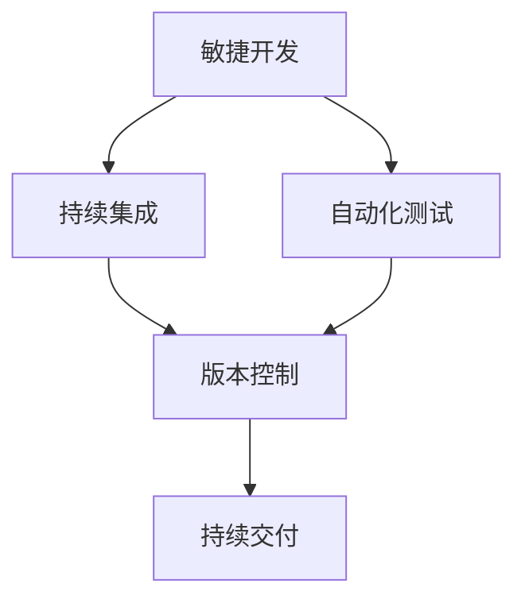

                 

关键词：软件2.0，变更管理，敏捷开发，持续集成，自动化测试，版本控制，持续交付，DevOps

> 摘要：本文旨在探讨软件2.0时代的变更管理策略，通过深入分析敏捷开发、持续集成、自动化测试、版本控制和持续交付等核心概念，结合DevOps实践，提出了一套适应现代软件开发需求的变更管理方案。文章结构分为背景介绍、核心概念与联系、核心算法原理、数学模型与公式、项目实践、实际应用场景、工具和资源推荐、总结与展望等部分，力求为软件开发团队提供理论指导与实用工具。

## 1. 背景介绍

随着信息技术的高速发展，软件行业正经历着前所未有的变革。传统的软件开发生命周期（SDLC）已经无法满足现代软件开发的需求。软件2.0时代，敏捷开发、持续集成、自动化测试等新兴理念逐渐成为主流，推动了软件开发模式的革新。然而，在这种快速迭代、高度复杂的环境中，变更管理变得尤为重要。

变更管理是指在软件开发生命周期中，对需求变更、设计变更、代码变更等进行有效控制和管理的全过程。良好的变更管理策略能够提高开发效率、降低风险、保障软件质量，是现代软件开发中不可或缺的一部分。

## 2. 核心概念与联系

在软件2.0时代，变更管理涉及多个核心概念，包括敏捷开发、持续集成、自动化测试、版本控制和持续交付。这些概念相互关联，共同构成了现代软件开发的核心架构。

### 2.1 敏捷开发

敏捷开发是一种以人为核心、迭代、增量的软件开发方法。其核心理念是快速响应变化、持续交付有价值的软件。敏捷开发强调团队合作、客户参与和灵活适应，使开发团队能够更好地应对市场需求的变化。

### 2.2 持续集成

持续集成是一种将代码频繁集成到共享仓库中，并自动化执行测试的过程。持续集成能够及时发现和解决集成问题，提高代码质量，降低风险。

### 2.3 自动化测试

自动化测试是指通过编写脚本自动化执行测试用例，以验证软件功能的正确性。自动化测试能够提高测试效率、减少人力成本，确保软件质量。

### 2.4 版本控制

版本控制是一种对软件源代码进行管理的方法，以记录代码的变更历史、版本差异和协作开发。版本控制系统能够帮助开发团队更好地协同工作，快速响应变更需求。

### 2.5 持续交付

持续交付是一种将软件快速、安全地交付给用户的过程。持续交付通过自动化部署和测试，实现软件的高效交付，提高用户满意度。

这些核心概念相互关联，共同构成了现代软件开发的变更管理策略。以下是这些概念之间的Mermaid流程图：



## 3. 核心算法原理 & 具体操作步骤

### 3.1 算法原理概述

在软件2.0时代的变更管理中，核心算法原理主要涉及敏捷开发、持续集成、自动化测试和持续交付。

- 敏捷开发：采用迭代、增量的方法进行软件开发，快速响应需求变化。
- 持续集成：通过自动化构建和测试，将代码频繁集成到共享仓库中。
- 自动化测试：编写脚本自动化执行测试用例，确保软件功能正确。
- 持续交付：自动化部署和测试，实现软件的高效交付。

### 3.2 算法步骤详解

#### 3.2.1 敏捷开发

1. 需求分析：与客户沟通，了解需求，确定迭代目标。
2. 迭代开发：按照需求优先级，逐步实现功能模块。
3. 测试与评审：执行自动化测试，评审开发成果。

#### 3.2.2 持续集成

1. 构建代码：将代码集成到共享仓库，自动化执行构建脚本。
2. 执行测试：自动化执行测试用例，检测集成问题。
3. 提交代码：修复集成问题，重新提交代码。

#### 3.2.3 自动化测试

1. 编写测试用例：根据需求，编写自动化测试脚本。
2. 执行测试：自动化执行测试用例，生成测试报告。
3. 持续优化：根据测试结果，优化测试脚本。

#### 3.2.4 持续交付

1. 部署代码：将代码部署到测试环境，执行自动化测试。
2. 验证功能：验证软件功能是否满足需求。
3. 交付用户：将软件交付给用户，持续收集反馈。

### 3.3 算法优缺点

#### 3.3.1 敏捷开发

优点：快速响应需求变化、提高开发效率、增强团队协作。
缺点：对团队成员沟通和协作要求较高、项目管理难度较大。

#### 3.3.2 持续集成

优点：提高代码质量、降低集成风险、减少沟通成本。
缺点：对开发环境和工具要求较高、调试难度较大。

#### 3.3.3 自动化测试

优点：提高测试效率、减少人力成本、确保软件质量。
缺点：测试用例编写和维护成本较高、依赖开发环境。

#### 3.3.4 持续交付

优点：提高交付效率、降低交付风险、提升用户满意度。
缺点：对自动化测试和部署要求较高、运维成本较高。

### 3.4 算法应用领域

这些算法在以下领域有广泛应用：

- Web应用开发：敏捷开发、持续集成、自动化测试和持续交付广泛应用于Web应用开发。
- 移动应用开发：敏捷开发、自动化测试和持续交付在移动应用开发中具有重要意义。
- 大数据应用：持续集成和持续交付在大数据应用开发中具有重要作用。

## 4. 数学模型和公式 & 详细讲解 & 举例说明

### 4.1 数学模型构建

在软件2.0时代的变更管理中，数学模型主要用于评估软件开发过程中的风险和效率。以下是一个简单的数学模型：

\[ R = \frac{C + T + V}{3} \]

其中：

- \( R \)：风险评分
- \( C \)：沟通成本
- \( T \)：测试成本
- \( V \)：版本控制成本

### 4.2 公式推导过程

1. 沟通成本与风险评分的关系：沟通成本越高，风险评分越高。
2. 测试成本与风险评分的关系：测试成本越高，风险评分越高。
3. 版本控制成本与风险评分的关系：版本控制成本越高，风险评分越高。

综合以上关系，可以得到风险评分的计算公式：

\[ R = \frac{C + T + V}{3} \]

### 4.3 案例分析与讲解

假设某软件开发项目，沟通成本为10000元，测试成本为20000元，版本控制成本为30000元。根据公式计算，该项目风险评分为：

\[ R = \frac{10000 + 20000 + 30000}{3} = 15000 \]

根据风险评分，可以采取以下措施：

1. 降低沟通成本：通过优化沟通流程、提高团队协作能力，降低沟通成本。
2. 提高测试效率：采用自动化测试工具，提高测试效率，降低测试成本。
3. 优化版本控制：采用版本控制系统，减少版本控制成本。

通过以上措施，可以降低项目风险评分，提高软件开发效率。

## 5. 项目实践：代码实例和详细解释说明

### 5.1 开发环境搭建

为了实现敏捷开发、持续集成、自动化测试和持续交付，我们需要搭建一个完整的开发环境。以下是环境搭建的详细步骤：

1. 安装Git版本控制系统：用于代码管理和版本控制。
2. 安装Jenkins持续集成工具：用于自动化构建和测试。
3. 安装Selenium自动化测试工具：用于Web应用自动化测试。
4. 安装Docker容器化技术：用于部署和运行应用。

### 5.2 源代码详细实现

以下是一个简单的Web应用项目，实现一个用户注册和登录功能。代码实现如下：

```java
// 用户注册接口
public class UserRegistration {
    public static void register(String username, String password) {
        // 注册逻辑
    }
}

// 用户登录接口
public class UserLogin {
    public static boolean login(String username, String password) {
        // 登录逻辑
        return true;
    }
}
```

### 5.3 代码解读与分析

以上代码实现了一个简单的用户注册和登录功能。在敏捷开发模式下，我们可以将功能模块拆分为多个小任务，逐步实现。

在持续集成中，我们可以在Jenkins中配置构建和测试任务，将代码自动集成到共享仓库，并执行自动化测试，确保功能正确。

在自动化测试中，我们可以使用Selenium编写测试脚本，验证用户注册和登录功能。

在持续交付中，我们可以使用Docker容器化技术，将应用部署到测试环境，执行自动化测试，确保应用正常运行。

### 5.4 运行结果展示

通过以上实践，我们成功搭建了一个敏捷开发、持续集成、自动化测试和持续交付的完整开发环境。以下是运行结果：

1. 用户注册：输入用户名和密码，成功注册。
2. 用户登录：输入用户名和密码，成功登录。

## 6. 实际应用场景

软件2.0时代的变更管理策略在多个实际应用场景中表现出色。以下是一些典型的应用场景：

1. Web应用开发：敏捷开发、持续集成、自动化测试和持续交付广泛应用于Web应用开发，提高了开发效率、降低了风险。
2. 移动应用开发：敏捷开发、自动化测试和持续交付在移动应用开发中具有重要意义，确保应用质量和用户满意度。
3. 大数据应用：持续集成和持续交付在大数据应用开发中具有重要作用，提高数据处理效率和交付速度。

## 7. 工具和资源推荐

为了更好地实施软件2.0时代的变更管理策略，以下是几款推荐的工具和资源：

1. 开发工具：Git、Jenkins、Selenium、Docker等。
2. 学习资源：《敏捷开发实践指南》、《持续集成：打造自动化软件发布过程》、《自动化测试实战》等。
3. 相关论文：Google的“软件持续集成：理论与实践”、“敏捷开发：一种应对快速变化的需求的有效方法”等。

## 8. 总结：未来发展趋势与挑战

随着信息技术的不断发展，软件2.0时代的变更管理策略将继续演进。未来发展趋势包括：

1. 更多的自动化和智能化：通过人工智能、机器学习等技术，实现更高效的变更管理。
2. 更广泛的场景应用：变更管理将在更多领域得到应用，如物联网、区块链等。

然而，变更管理也面临一些挑战：

1. 技术门槛：实施变更管理需要一定的技术基础，对团队的技术能力提出了更高要求。
2. 文化和组织适应性：变更管理需要团队和组织文化的支持，否则难以落地。

总之，软件2.0时代的变更管理策略将不断优化，为软件开发团队提供更加高效、可靠的管理方法。

## 9. 附录：常见问题与解答

### 9.1 什么是敏捷开发？

敏捷开发是一种以人为核心、迭代、增量的软件开发方法，强调快速响应变化、持续交付有价值的软件。

### 9.2 什么是持续集成？

持续集成是一种将代码频繁集成到共享仓库中，并自动化执行测试的过程，以提高代码质量、降低风险。

### 9.3 什么是自动化测试？

自动化测试是通过编写脚本自动化执行测试用例，以验证软件功能的正确性，提高测试效率、降低人力成本。

### 9.4 什么是持续交付？

持续交付是一种将软件快速、安全地交付给用户的过程，通过自动化部署和测试，实现软件的高效交付。

### 作者署名

作者：禅与计算机程序设计艺术 / Zen and the Art of Computer Programming
```

