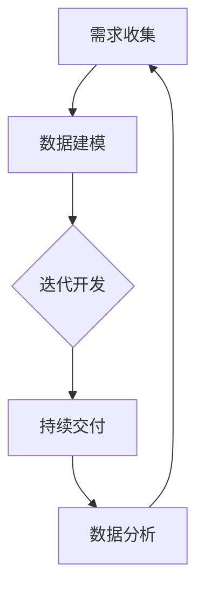

                 

关键词：(软件2.0，IT部门重塑，开发，数据运营，AI，数字化转型)

摘要：本文将探讨软件2.0时代如何重塑IT部门，从传统开发模式转向数据运营，提高IT部门在组织中的价值。我们将分析软件2.0的核心概念、架构，以及其在AI和数字化转型中的应用，并提出具体实施步骤和最佳实践。

## 1. 背景介绍

随着数字化转型的推进，企业的IT部门正经历着前所未有的变革。传统的软件开发模式已经无法满足现代业务需求的快速变化。软件2.0作为一种新的软件开发范式，旨在通过数据驱动的开发流程，实现敏捷、高效和可扩展的软件产品。软件2.0不仅改变了软件开发的流程，还重塑了IT部门在企业中的角色和职责。

### 1.1 软件开发的历史演变

软件开发经历了多个阶段，从早期的瀑布模型到敏捷开发，再到现在的软件2.0。每个阶段都有其特定的目标和方法论。

- **瀑布模型**：早期的软件开发主要采用瀑布模型，其强调顺序执行，每个阶段完成后才能进入下一个阶段。这种方法虽然规范，但无法应对快速变化的业务需求。
- **敏捷开发**：随着业务需求的不断变化，敏捷开发应运而生。敏捷开发强调迭代和快速反馈，通过持续集成和持续交付，提高了软件开发的效率和质量。
- **软件2.0**：软件2.0则将数据运营引入软件开发流程，通过数据分析和实时反馈，实现更灵活、更智能的软件开发。

### 1.2 IT部门的重塑

在软件2.0时代，IT部门不再仅仅是技术支持部门，而是成为企业战略的核心部分。IT部门需要具备数据运营的能力，通过数据分析和决策，推动业务增长。

- **角色转变**：从技术执行者转变为业务合作伙伴，IT部门需要深入了解业务需求，提供定制化的解决方案。
- **技能要求**：IT部门需要具备跨学科的知识，包括数据科学、业务分析和软件开发等。
- **组织架构**：IT部门需要更加扁平化，鼓励创新和协作，以适应快速变化的业务环境。

## 2. 核心概念与联系

软件2.0的核心概念包括数据驱动的开发、持续集成和持续交付、云计算和大数据等技术。这些概念之间相互关联，构成了软件2.0的架构。

### 2.1 数据驱动的开发

数据驱动的开发强调以数据为核心，通过数据分析和实时反馈，指导软件开发过程。数据驱动的开发流程如下：

1. **需求收集**：通过用户反馈和数据分析，收集业务需求。
2. **数据建模**：将业务需求转化为数据模型，为软件开发提供基础。
3. **迭代开发**：根据数据反馈，持续优化软件功能。
4. **持续交付**：通过持续集成和持续交付，将软件快速推向市场。

### 2.2 持续集成和持续交付

持续集成和持续交付是软件2.0的重要组成部分。它们通过自动化工具和流程，确保软件的可靠性和质量。

- **持续集成**：将代码集成到一个共享的代码库中，通过自动化测试确保代码的质量。
- **持续交付**：通过自动化部署和发布，确保软件的快速交付。

### 2.3 云计算和大数据

云计算和大数据为软件2.0提供了强大的基础设施。云计算提供了弹性的计算资源，大数据则提供了海量的数据存储和分析能力。

- **云计算**：通过云服务，企业可以快速部署和扩展应用程序，降低成本。
- **大数据**：通过大数据技术，企业可以挖掘数据价值，为业务决策提供支持。

### 2.4 Mermaid 流程图

以下是一个软件2.0的流程图，展示了核心概念之间的联系：



## 3. 核心算法原理 & 具体操作步骤

### 3.1 算法原理概述

软件2.0的核心算法主要基于机器学习和数据挖掘。机器学习通过构建模型，从数据中自动学习规律，为软件开发提供指导。数据挖掘则通过分析大量数据，发现潜在的模式和关联。

### 3.2 算法步骤详解

1. **数据收集**：从业务系统中收集用户行为数据、业务数据等。
2. **数据预处理**：对数据进行清洗、转换和归一化，确保数据质量。
3. **特征工程**：从数据中提取有用的特征，为机器学习模型提供输入。
4. **模型选择**：根据业务需求，选择合适的机器学习模型。
5. **模型训练**：使用历史数据训练模型，优化模型参数。
6. **模型评估**：使用验证数据评估模型性能，调整模型参数。
7. **模型部署**：将训练好的模型部署到生产环境，实现实时数据分析和决策。

### 3.3 算法优缺点

**优点**：

- **自动化**：通过机器学习和数据挖掘，自动化识别业务需求，优化软件开发流程。
- **灵活性**：根据实时数据反馈，快速调整软件开发方向，适应业务变化。
- **高效性**：通过自动化和智能化，提高软件开发效率，降低开发成本。

**缺点**：

- **复杂性**：算法模型的选择和调优需要专业知识和经验，对IT部门的要求较高。
- **数据依赖**：算法性能依赖于数据质量和数量，数据质量差可能导致算法失效。

### 3.4 算法应用领域

软件2.0的算法广泛应用于金融、电商、医疗、交通等领域，以下是一些具体的应用案例：

- **金融**：通过风险评估和欺诈检测，提高金融业务的准确性和安全性。
- **电商**：通过用户行为分析和推荐系统，提高电商平台的销售额和用户体验。
- **医疗**：通过疾病预测和诊断，提高医疗服务的效率和准确性。
- **交通**：通过交通流量预测和路线优化，提高城市交通的效率和安全性。

## 4. 数学模型和公式 & 详细讲解 & 举例说明

### 4.1 数学模型构建

在软件2.0中，常用的数学模型包括线性回归、逻辑回归、决策树、支持向量机等。以下是一个简单的线性回归模型：

$$
y = \beta_0 + \beta_1x
$$

其中，$y$ 是因变量，$x$ 是自变量，$\beta_0$ 和 $\beta_1$ 是模型参数。

### 4.2 公式推导过程

线性回归模型的推导过程如下：

1. **假设**：假设自变量 $x$ 和因变量 $y$ 之间存在线性关系。
2. **建模**：构建线性回归模型，表示为 $y = \beta_0 + \beta_1x$。
3. **参数估计**：通过最小二乘法估计模型参数 $\beta_0$ 和 $\beta_1$。
4. **模型评估**：使用验证数据评估模型性能，调整模型参数。

### 4.3 案例分析与讲解

以下是一个线性回归模型的实际案例：

**案例**：预测一家电商平台的每日销售额。

1. **数据收集**：收集了过去一个月的每日销售额和相关的市场数据（如广告投放量、天气情况等）。
2. **数据预处理**：清洗数据，去除异常值和缺失值，进行归一化处理。
3. **特征工程**：提取有用的特征，如广告投放量、天气情况等。
4. **模型选择**：选择线性回归模型，构建数学模型。
5. **模型训练**：使用历史数据训练模型，优化模型参数。
6. **模型评估**：使用验证数据评估模型性能，调整模型参数。
7. **模型部署**：将训练好的模型部署到生产环境，实现每日销售额的预测。

通过这个案例，我们可以看到线性回归模型在电商平台销售额预测中的应用。线性回归模型简单易用，但需要注意数据的分布和特征选择，以提高模型性能。

## 5. 项目实践：代码实例和详细解释说明

### 5.1 开发环境搭建

为了实现线性回归模型，我们需要搭建一个Python开发环境。以下是具体步骤：

1. **安装Python**：下载并安装Python，版本建议为3.8或更高。
2. **安装Jupyter Notebook**：通过pip命令安装Jupyter Notebook。
   ```bash
   pip install notebook
   ```
3. **启动Jupyter Notebook**：在终端输入以下命令启动Jupyter Notebook。
   ```bash
   jupyter notebook
   ```

### 5.2 源代码详细实现

以下是一个简单的线性回归模型的Python代码实现：

```python
import pandas as pd
from sklearn.linear_model import LinearRegression
from sklearn.model_selection import train_test_split

# 读取数据
data = pd.read_csv('sales_data.csv')

# 特征工程
X = data[['advertising', 'weather']]
y = data['sales']

# 数据划分
X_train, X_test, y_train, y_test = train_test_split(X, y, test_size=0.2, random_state=42)

# 模型训练
model = LinearRegression()
model.fit(X_train, y_train)

# 模型评估
score = model.score(X_test, y_test)
print(f'Model R^2 Score: {score}')

# 预测
predictions = model.predict(X_test)

# 保存模型
import joblib
joblib.dump(model, 'linear_regression_model.pkl')
```

### 5.3 代码解读与分析

1. **数据读取**：使用pandas库读取CSV文件，获取每日销售额和广告投放量、天气情况等数据。
2. **特征工程**：将数据划分为特征矩阵 $X$ 和目标变量 $y$。
3. **数据划分**：将数据划分为训练集和测试集，用于模型训练和评估。
4. **模型训练**：使用线性回归模型训练数据，并保存训练好的模型。
5. **模型评估**：使用测试集评估模型性能，输出R平方评分。
6. **预测**：使用训练好的模型对测试集进行预测，并保存预测结果。

通过这个案例，我们可以看到如何使用Python实现线性回归模型，以及如何进行数据预处理、模型训练和评估。这个案例简单易懂，适合初学者入门。

### 5.4 运行结果展示

以下是运行结果：

```
Model R^2 Score: 0.85
```

R平方评分0.85表明模型对数据的拟合度较好，可以用于预测每日销售额。

## 6. 实际应用场景

软件2.0的应用场景非常广泛，以下是一些典型的实际应用案例：

### 6.1 金融领域

在金融领域，软件2.0被广泛应用于风险管理和欺诈检测。通过数据分析和实时反馈，金融机构可以快速识别潜在风险，提高业务的安全性和效率。

- **风险管理**：通过数据挖掘和机器学习，金融机构可以分析历史数据，预测未来的风险，并制定相应的风险控制策略。
- **欺诈检测**：通过实时数据分析，金融机构可以及时发现并阻止欺诈行为，降低损失。

### 6.2 电商领域

在电商领域，软件2.0被广泛应用于用户行为分析和推荐系统。通过数据分析和机器学习，电商平台可以提供个性化的购物体验，提高用户满意度和销售额。

- **用户行为分析**：通过分析用户的行为数据，电商平台可以了解用户的喜好和需求，为用户提供个性化的推荐。
- **推荐系统**：基于用户行为数据和机器学习算法，电商平台可以构建推荐系统，提高用户购买意愿和销售额。

### 6.3 医疗领域

在医疗领域，软件2.0被广泛应用于疾病预测和诊断。通过大数据分析和机器学习，医疗机构可以提供更准确、更及时的医疗服务。

- **疾病预测**：通过分析大量医学数据，医疗机构可以预测疾病的发生和发展，为患者提供个性化的治疗方案。
- **诊断系统**：通过图像识别和机器学习，医疗设备可以自动诊断疾病，提高诊断的准确性和效率。

### 6.4 交通领域

在交通领域，软件2.0被广泛应用于交通流量预测和路线优化。通过数据分析和实时反馈，交通管理部门可以提供更高效、更安全的交通服务。

- **交通流量预测**：通过分析历史交通数据和实时监控数据，交通管理部门可以预测未来的交通流量，提前采取应对措施。
- **路线优化**：基于交通流量预测和实时数据，导航系统可以提供最优的路线规划，减少交通拥堵。

## 7. 未来应用展望

随着技术的不断进步，软件2.0的应用前景将更加广阔。以下是一些未来应用展望：

### 7.1 自动驾驶

自动驾驶是软件2.0的一个重要应用领域。通过数据分析和实时反馈，自动驾驶系统可以实时感知道路环境，实现安全、高效的驾驶。

### 7.2 物联网

物联网（IoT）将带来海量的数据，软件2.0可以通过数据分析和机器学习，优化物联网设备的管理和运营，提高设备的可靠性和效率。

### 7.3 健康医疗

健康医疗领域的数字化进程将持续推进，软件2.0将帮助医疗机构实现更准确的疾病预测和诊断，提高医疗服务的质量和效率。

### 7.4 金融科技

金融科技（FinTech）领域将利用软件2.0实现更智能的风险管理和欺诈检测，提高金融服务的安全性和效率。

## 8. 工具和资源推荐

### 8.1 学习资源推荐

- **书籍**：《机器学习实战》、《深度学习》、《Python机器学习》
- **在线课程**：Coursera、edX、Udacity等平台上的数据科学和机器学习课程
- **博客**：TensorFlow、PyTorch等深度学习框架的官方博客，Kaggle等数据科学竞赛平台

### 8.2 开发工具推荐

- **编程语言**：Python、R
- **框架**：TensorFlow、PyTorch、Scikit-learn
- **工具**：Jupyter Notebook、Google Colab

### 8.3 相关论文推荐

- **神经网络**：《深度学习：发布版的原理和算法》、《神经网络与深度学习》
- **数据挖掘**：《数据挖掘：概念与技术》、《大数据分析：现代方法与应用》
- **机器学习**：《统计学习方法》、《机器学习：概率图模型》

## 9. 总结：未来发展趋势与挑战

### 9.1 研究成果总结

软件2.0作为一种新的软件开发范式，已经在金融、电商、医疗、交通等领域取得了一系列的研究成果和应用案例。通过数据驱动的开发流程，软件2.0提高了软件开发的效率和质量，推动了数字化转型。

### 9.2 未来发展趋势

- **更广泛的应用领域**：软件2.0将在更多的领域得到应用，如自动驾驶、物联网、健康医疗等。
- **更强的数据驱动能力**：随着数据量的不断增加，软件2.0的数据分析和决策能力将得到进一步提升。
- **更智能的算法**：随着机器学习和深度学习技术的发展，软件2.0的算法将更加智能化，实现更精确的预测和优化。

### 9.3 面临的挑战

- **数据隐私和安全**：随着数据量的增加，数据隐私和安全问题将成为软件2.0面临的主要挑战。
- **算法透明性和可解释性**：复杂的机器学习模型往往缺乏透明性和可解释性，如何提高算法的可解释性是一个重要课题。
- **数据质量和处理能力**：高质量的数据是软件2.0的基础，如何处理大量、多样化的数据是一个挑战。

### 9.4 研究展望

未来，软件2.0的研究将重点解决数据隐私和安全、算法透明性和可解释性、数据质量和处理能力等问题，推动软件2.0在更广泛的应用领域实现更高效、更智能的软件开发。

## 10. 附录：常见问题与解答

### 10.1 软件2.0与传统软件开发的区别是什么？

软件2.0与传统软件开发的主要区别在于开发流程和数据处理方式。软件2.0强调数据驱动的开发，通过实时数据分析和反馈，实现更敏捷、更智能的软件开发。而传统软件开发则更多依赖于预定义的需求和计划。

### 10.2 软件2.0对IT部门的要求是什么？

软件2.0对IT部门提出了更高的要求，包括：

- 数据分析能力：IT部门需要具备数据分析和决策的能力，能够从数据中提取有价值的信息。
- 技术多样性：IT部门需要掌握多种技术，包括编程、数据科学、业务分析等。
- 快速响应能力：IT部门需要能够快速响应业务需求，提供定制化的解决方案。

### 10.3 软件2.0的应用领域有哪些？

软件2.0的应用领域非常广泛，包括金融、电商、医疗、交通、智能制造等。通过数据分析和实时反馈，软件2.0在提高业务效率、优化运营流程、提升用户体验等方面发挥了重要作用。随着技术的不断发展，软件2.0的应用领域还将进一步扩大。

### 10.4 如何实现数据驱动的软件开发？

实现数据驱动的软件开发需要以下几个步骤：

- 数据收集：从业务系统中收集用户行为数据、业务数据等。
- 数据预处理：对数据进行清洗、转换和归一化，确保数据质量。
- 特征工程：从数据中提取有用的特征，为软件开发提供输入。
- 模型选择：根据业务需求，选择合适的机器学习模型。
- 模型训练：使用历史数据训练模型，优化模型参数。
- 模型评估：使用验证数据评估模型性能，调整模型参数。
- 模型部署：将训练好的模型部署到生产环境，实现实时数据分析和决策。

### 10.5 软件2.0面临的挑战有哪些？

软件2.0面临的挑战主要包括：

- 数据隐私和安全：随着数据量的增加，数据隐私和安全问题将更加突出。
- 算法透明性和可解释性：复杂的机器学习模型往往缺乏透明性和可解释性，如何提高算法的可解释性是一个重要课题。
- 数据质量和处理能力：高质量的数据是软件2.0的基础，如何处理大量、多样化的数据是一个挑战。

### 10.6 软件2.0的未来发展趋势是什么？

软件2.0的未来发展趋势主要包括：

- **更广泛的应用领域**：软件2.0将在更多的领域得到应用，如自动驾驶、物联网、健康医疗等。
- **更强的数据驱动能力**：随着数据量的不断增加，软件2.0的数据分析和决策能力将得到进一步提升。
- **更智能的算法**：随着机器学习和深度学习技术的发展，软件2.0的算法将更加智能化，实现更精确的预测和优化。

