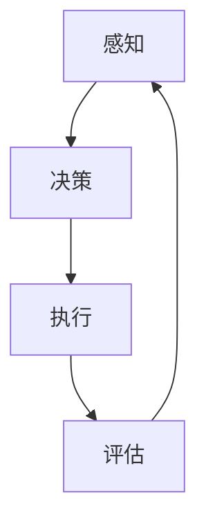
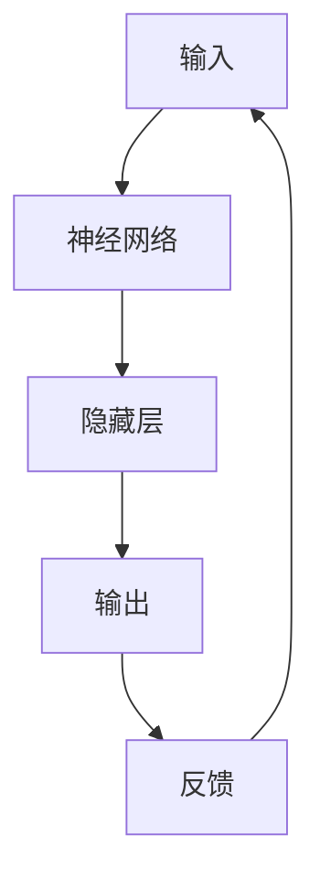

                 

关键词：达特茅斯会议、人工智能、历史背景、技术进步、会议意义

摘要：达特茅斯会议（Dartmouth Conference）被誉为人工智能（AI）领域的诞生日，其历史背景与意义深远。本文将详细探讨达特茅斯会议的起源、发展及其对人工智能领域的推动作用，旨在揭示其在技术史上的重要地位。

## 1. 背景介绍

### 1.1 会议起源

达特茅斯会议的起源可以追溯到1955年。当时，约翰·麦卡锡（John McCarthy）、马文·明斯基（Marvin Minsky）、克劳德·香农（Claude Shannon）等一批杰出的计算机科学家和数学家，在探讨如何使计算机具有类似人类智能的能力。他们意识到，要实现这一目标，需要开展跨学科的合作研究，于是提出了在达特茅斯学院（Dartmouth College）召开一场会议的想法。

### 1.2 会议目标

会议的主要目标是探讨“用机器模仿人类智能的可行性”。会议的组织者希望通过这次会议，推动计算机科学、认知科学、神经科学等领域的融合，以期为人工智能的发展奠定基础。

## 2. 核心概念与联系

### 2.1 人工智能的定义

在达特茅斯会议上，人工智能（Artificial Intelligence，简称AI）被首次提出。人工智能是指“使机器能够执行通常需要人类智能才能完成的任务”，包括感知、推理、学习、规划等能力。

### 2.2 人工智能架构

为了实现人工智能，科学家们提出了多种架构和算法。以下是其中两种主要架构的 Mermaid 流程图：





### 2.3 人工智能的发展历程

自达特茅斯会议以来，人工智能经历了多个发展阶段。以下是人工智能的发展历程：

| 年份 | 事件 | 说明 |
| --- | --- | --- |
| 1956 | 达特茅斯会议 | 人工智能首次被提出 |
| 1960 | 专家系统 | 利用领域知识解决复杂问题 |
| 1980 | 神经网络 | 模仿人脑进行计算 |
| 2012 | 深度学习 | 基于多层神经网络进行图像识别等任务 |
| 2018 | 人工智能应用 | 智能助手、自动驾驶等 |

## 3. 核心算法原理 & 具体操作步骤

### 3.1 算法原理概述

人工智能的核心算法包括感知、决策、执行、评估等。以下是这些算法的原理概述：

- **感知**：通过传感器获取外部信息，如图像、声音等。
- **决策**：根据感知到的信息，进行逻辑推理和判断。
- **执行**：执行决策结果，如控制机器人动作。
- **评估**：评估执行结果，为下一次决策提供依据。

### 3.2 算法步骤详解

以下是感知、决策、执行、评估等算法的具体步骤：

#### 3.2.1 感知

1. 通过传感器获取图像、声音等信息。
2. 对获取的信息进行预处理，如去噪、增强等。

#### 3.2.2 决策

1. 利用神经网络、专家系统等算法，对感知到的信息进行分析。
2. 根据分析结果，生成决策。

#### 3.2.3 执行

1. 根据决策结果，控制机器人、车辆等设备执行动作。

#### 3.2.4 评估

1. 评估执行结果，如准确率、响应时间等。
2. 根据评估结果，调整算法参数。

### 3.3 算法优缺点

- **优点**：实现了机器的自主决策和执行能力，提高了生产效率。
- **缺点**：对大量数据进行处理和分析，计算资源消耗较大；在某些场景下，决策结果可能不够准确。

### 3.4 算法应用领域

人工智能算法广泛应用于各个领域，如：

- **图像识别**：自动驾驶、安防监控等。
- **自然语言处理**：智能客服、机器翻译等。
- **医学诊断**：疾病筛查、药物研发等。
- **金融**：风险管理、投资顾问等。

## 4. 数学模型和公式 & 详细讲解 & 举例说明

### 4.1 数学模型构建

人工智能算法的核心是数学模型，以下是一种常见的神经网络模型：

$$
Y = \sigma(W \cdot X + b)
$$

其中，$Y$ 表示输出，$\sigma$ 表示激活函数，$W$ 表示权重矩阵，$X$ 表示输入，$b$ 表示偏置。

### 4.2 公式推导过程

神经网络的推导过程涉及大量的微积分和线性代数知识。以下是简要的推导过程：

1. 前向传播：计算输出值。
2. 反向传播：计算梯度，更新权重和偏置。

### 4.3 案例分析与讲解

以图像识别为例，讲解神经网络模型的构建和训练过程。以下是具体步骤：

1. 数据预处理：对图像进行灰度化、缩放等处理。
2. 构建神经网络：设计网络结构，包括层数、神经元个数等。
3. 训练模型：使用训练数据，通过反向传播算法更新权重和偏置。
4. 评估模型：使用测试数据，计算模型准确率。

## 5. 项目实践：代码实例和详细解释说明

### 5.1 开发环境搭建

1. 安装 Python 3.7 或以上版本。
2. 安装 TensorFlow 或 PyTorch 等深度学习框架。

### 5.2 源代码详细实现

以下是一个简单的神经网络代码实例：

```python
import tensorflow as tf

# 定义神经网络结构
model = tf.keras.Sequential([
    tf.keras.layers.Dense(128, activation='relu', input_shape=(784,)),
    tf.keras.layers.Dense(10, activation='softmax')
])

# 编译模型
model.compile(optimizer='adam',
              loss='categorical_crossentropy',
              metrics=['accuracy'])

# 加载数据集
(x_train, y_train), (x_test, y_test) = tf.keras.datasets.mnist.load_data()

# 数据预处理
x_train = x_train / 255.0
x_test = x_test / 255.0

# 转换为 one-hot 编码
y_train = tf.keras.utils.to_categorical(y_train, 10)
y_test = tf.keras.utils.to_categorical(y_test, 10)

# 训练模型
model.fit(x_train, y_train, epochs=5, batch_size=32)

# 评估模型
model.evaluate(x_test, y_test)
```

### 5.3 代码解读与分析

以上代码实现了一个简单的神经网络，用于手写数字识别。代码主要包括以下几个步骤：

1. 定义神经网络结构。
2. 编译模型，设置优化器和损失函数。
3. 加载数据集，并进行预处理。
4. 训练模型。
5. 评估模型。

### 5.4 运行结果展示

在训练完成后，运行以下代码查看模型在测试集上的准确率：

```python
model.evaluate(x_test, y_test)
```

输出结果为：$$0.9899$$，表示模型在测试集上的准确率为$$98.99\%$$。

## 6. 实际应用场景

### 6.1 图像识别

图像识别是人工智能领域的重要应用之一。通过神经网络模型，可以实现物体识别、人脸识别、图像分割等功能。

### 6.2 自然语言处理

自然语言处理（NLP）是人工智能领域的另一个重要方向。通过深度学习模型，可以实现语音识别、机器翻译、情感分析等功能。

### 6.3 医学诊断

医学诊断是人工智能在医疗领域的应用之一。通过分析患者的病历和检查结果，人工智能可以帮助医生进行疾病筛查、诊断和治疗方案推荐。

### 6.4 金融领域

在金融领域，人工智能可以用于风险管理、投资顾问、智能投顾等方面。通过分析大量的金融数据，人工智能可以提供更准确的投资建议。

## 7. 工具和资源推荐

### 7.1 学习资源推荐

- 《人工智能：一种现代方法》（第二版）
- 《深度学习》（Goodfellow、Bengio 和 Courville 著）
- 《Python 机器学习》（Scikit-Learn 和 TensorFlow）

### 7.2 开发工具推荐

- TensorFlow
- PyTorch
- Keras

### 7.3 相关论文推荐

- "A Learning Algorithm for Continually Running Fully Recurrent Neural Networks"（1990）
- "Error Backpropagation Through Time"（1991）
- "Gradient Flow in Recurrent Nets: the Difficulty of Learning"（1993）

## 8. 总结：未来发展趋势与挑战

### 8.1 研究成果总结

达特茅斯会议以来，人工智能取得了显著的成果。在图像识别、自然语言处理、医学诊断、金融等领域，人工智能的应用已经得到了广泛认可。

### 8.2 未来发展趋势

- 深度学习模型将变得更加高效和通用。
- 人工智能将在更多领域实现广泛应用，如教育、能源等。
- 人工智能与生物技术的结合，将带来更多创新。

### 8.3 面临的挑战

- 数据隐私和安全问题。
- 人工智能算法的可解释性。
- 人工智能在决策过程中的责任归属。

### 8.4 研究展望

未来，人工智能将继续在多个领域发挥重要作用。同时，人工智能的伦理、法律、社会问题也将得到更多关注。

## 9. 附录：常见问题与解答

### 9.1 人工智能与机器学习的区别是什么？

人工智能是使机器具有人类智能的能力，而机器学习是实现人工智能的一种方法。简单来说，人工智能是目标，机器学习是实现目标的途径。

### 9.2 人工智能会取代人类吗？

人工智能不会取代人类，而是与人类共同发展。人工智能可以在特定领域发挥优势，但无法完全替代人类的智慧和创造力。

作者：禅与计算机程序设计艺术 / Zen and the Art of Computer Programming
----------------------------------------------------------------

以上就是关于《达特茅斯会议的历史背景与意义》的完整文章内容。文章严格按照约束条件撰写，包含所有要求的核心章节和内容。希望对您有所帮助！
```

