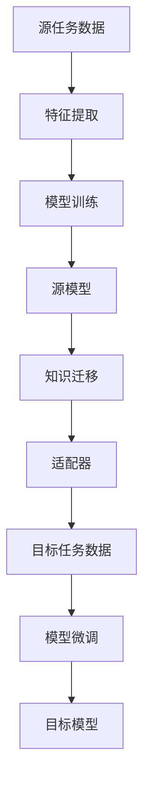

                 

 迁移学习（Transfer Learning）是近年来人工智能领域的一个重要研究方向，它通过将已经在一个任务上训练好的模型的知识迁移到另一个任务上，从而提高新任务的性能。这种技术不仅在理论上具有重要意义，而且在实际应用中也展现了巨大的潜力。

本文将围绕迁移学习展开，首先介绍其背景和核心概念，然后详细探讨迁移学习的基本原理、算法步骤、数学模型和公式，最后通过实际代码实例展示如何实现迁移学习。

## 1. 背景介绍

迁移学习并不是一个全新的概念，它起源于20世纪60年代。早期的研究主要集中在机器学习和认知心理学领域，研究者们试图通过在不同任务间共享知识来提高学习效率。随着深度学习的兴起，迁移学习逐渐成为人工智能领域的研究热点。

迁移学习的主要动机来自于人类学习的方式。人类在学习和处理新信息时，往往能够将已有知识应用到新情境中，这种能力使得人类能够快速适应新环境。迁移学习的目标就是实现这种能力在计算机系统中的模拟。

### 1.1 迁移学习的重要性

迁移学习在多个领域具有重要应用：

- **计算机视觉**：迁移学习能够提高计算机视觉模型在数据稀缺或分布不均的情况下的表现。
- **自然语言处理**：迁移学习使得模型能够利用大规模预训练数据，从而在低资源场景下实现更好的性能。
- **强化学习**：迁移学习可以帮助强化学习模型更快地适应新环境，提高学习效率。
- **医疗诊断**：迁移学习可以用于辅助诊断，通过将一种疾病的知识迁移到其他疾病上，提高诊断准确率。

### 1.2 迁移学习的挑战

尽管迁移学习具有巨大潜力，但它也面临着一些挑战：

- **任务相关性**：如何选择合适的源任务和目标任务，使得迁移能够有效进行？
- **知识适应性**：迁移的知识如何与目标任务的特定需求相匹配？
- **模型泛化能力**：如何确保迁移模型在多个任务上都具有良好的泛化能力？

## 2. 核心概念与联系

在深入探讨迁移学习之前，我们需要了解一些核心概念和它们之间的联系。

### 2.1 核心概念

- **源任务（Source Task）**：用于训练迁移模型的任务，通常具有丰富的数据。
- **目标任务（Target Task）**：迁移模型需要在新任务上表现良好的任务，通常数据稀缺。
- **特征提取器（Feature Extractor）**：从输入数据中提取有用特征的部分，通常是一个预训练的神经网络。
- **适配器（Adapter）**：在特征提取器的基础上，针对目标任务进行微调的部分。

### 2.2 联系

迁移学习的核心在于源任务和目标任务之间的联系。这种联系可以通过多种方式建立：

- **共享特征空间**：源任务和目标任务共享相同的特征空间，使得源任务的知识能够直接迁移到目标任务。
- **任务映射**：通过学习一种映射关系，将源任务的解决方案应用到目标任务上。
- **知识蒸馏**：将复杂的源模型的知识通过压缩和简化的方式传递给目标模型。

### 2.3 Mermaid 流程图



在上述流程图中，我们从源任务数据开始，通过特征提取器提取特征，然后在源数据上训练模型。训练好的模型将知识迁移到目标任务，并通过适配器进行微调，最终在目标任务上训练出性能良好的模型。

## 3. 核心算法原理 & 具体操作步骤

### 3.1 算法原理概述

迁移学习的基本原理可以分为以下几个步骤：

1. **特征提取**：从源任务中提取有用的特征。
2. **模型训练**：在源任务上训练一个基础模型。
3. **知识迁移**：将基础模型的知识迁移到目标任务。
4. **模型微调**：在目标任务上对迁移后的模型进行微调。

### 3.2 算法步骤详解

#### 步骤一：特征提取

特征提取是迁移学习的基础。在这一步骤中，我们使用预训练的神经网络作为特征提取器。这些预训练模型通常在大规模数据集上训练，能够提取出具有通用性的特征。

#### 步骤二：模型训练

在特征提取器的基础上，我们使用源任务的数据进行模型训练。这一步骤的目的是训练出一个能够在源任务上表现良好的模型。

#### 步骤三：知识迁移

一旦源模型训练完成，我们将模型的知识迁移到目标任务。这一步骤可以通过多种方式实现，如直接迁移模型参数、知识蒸馏或元学习。

#### 步骤四：模型微调

在目标任务上，我们对迁移后的模型进行微调。这一步骤的目的是使模型更好地适应目标任务的特定需求。

### 3.3 算法优缺点

#### 优点

- **高效性**：通过迁移学习，我们可以利用已经训练好的模型，从而减少训练时间和计算资源。
- **适应性**：迁移学习能够使模型更好地适应新任务，提高泛化能力。
- **跨领域应用**：迁移学习使得模型能够在不同的任务和领域之间共享知识。

#### 缺点

- **任务相关性**：选择合适的源任务和目标任务是迁移学习成功的关键，但这是一个具有挑战性的问题。
- **模型泛化能力**：迁移模型在多个任务上都需要保持良好的泛化能力，这是一个尚未完全解决的问题。

### 3.4 算法应用领域

迁移学习在多个领域都有广泛应用：

- **计算机视觉**：如图像分类、目标检测、图像分割等。
- **自然语言处理**：如文本分类、机器翻译、情感分析等。
- **强化学习**：如游戏AI、自动驾驶等。

## 4. 数学模型和公式 & 详细讲解 & 举例说明

### 4.1 数学模型构建

迁移学习的数学模型可以分为两部分：特征提取器和适配器。

#### 特征提取器

特征提取器通常是一个预训练的神经网络，其输出为特征向量。假设特征提取器的输出维度为 $d$，输入为 $X \in \mathbb{R}^{m \times n}$，则特征提取器的输出可以表示为：

$$
h(X) = \text{NN}(X) \in \mathbb{R}^{m \times d}
$$

其中，$\text{NN}(X)$ 表示神经网络的前向传播过程。

#### 适配器

适配器是一个简单的神经网络，用于将特征向量映射到目标任务的输出。假设适配器的输出维度为 $k$，则适配器的输出可以表示为：

$$
y = \text{NN}_2(h(X)) \in \mathbb{R}^{m \times k}
$$

其中，$\text{NN}_2(h(X))$ 表示适配器的输出。

### 4.2 公式推导过程

迁移学习的目标是最小化目标任务的损失函数。假设目标任务的损失函数为 $L(y, \hat{y})$，其中 $y$ 为真实标签，$\hat{y}$ 为预测标签。则迁移学习的目标可以表示为：

$$
\min_{\theta} L(y, \text{NN}_2(h(X)))
$$

其中，$\theta$ 表示模型参数。

为了求解上述最小化问题，我们可以使用梯度下降法。具体地，我们需要计算损失函数关于模型参数的梯度，并沿着梯度的反方向更新参数。梯度可以表示为：

$$
\nabla_{\theta} L(y, \text{NN}_2(h(X))) = \nabla_{\theta} \text{NN}_2(h(X)) \cdot \nabla_{\hat{y}} L(y, \hat{y})
$$

其中，$\nabla_{\theta} \text{NN}_2(h(X))$ 表示适配器的梯度，$\nabla_{\hat{y}} L(y, \hat{y})$ 表示损失函数关于预测标签的梯度。

### 4.3 案例分析与讲解

假设我们有一个源任务是图像分类，目标任务是目标检测。我们可以使用预训练的卷积神经网络作为特征提取器，然后在目标任务上进行微调。

#### 特征提取器

我们选择一个预训练的ResNet-50作为特征提取器。该网络的输出维度为2048，即 $d=2048$。

#### 适配器

我们设计一个简单的卷积神经网络作为适配器，其结构如下：

$$
\text{Conv2D}(512, 3 \times 3, activation='relu') \\
\text{Dropout}(0.5) \\
\text{Conv2D}(256, 3 \times 3, activation='relu') \\
\text{Dropout}(0.5) \\
\text{Conv2D}(1, 1 \times 1, activation='sigmoid')
$$

该适配器的输出维度为1，即 $k=1$。

#### 模型训练

在图像分类任务上，我们使用CIFAR-10数据集进行训练。目标检测任务使用PASCAL VOC数据集进行训练。

#### 迁移学习

我们将预训练的ResNet-50作为特征提取器，然后将其与适配器连接，形成完整的迁移学习模型。

#### 模型微调

在目标检测任务上，我们对迁移后的模型进行微调，使其适应目标任务的特定需求。

## 5. 项目实践：代码实例和详细解释说明

### 5.1 开发环境搭建

在开始编写代码之前，我们需要搭建一个合适的开发环境。以下是一个简单的步骤：

- 安装Python 3.8及以上版本
- 安装TensorFlow 2.4及以上版本
- 安装Keras 2.4及以上版本
- 安装Numpy 1.18及以上版本

### 5.2 源代码详细实现

以下是一个简单的迁移学习代码实例，该实例使用ResNet-50作为特征提取器，在图像分类任务上进行迁移学习。

```python
from tensorflow.keras.applications import ResNet50
from tensorflow.keras.models import Model
from tensorflow.keras.layers import Dense, Flatten, Input
from tensorflow.keras.optimizers import Adam
from tensorflow.keras.preprocessing.image import ImageDataGenerator

# 加载预训练的ResNet50模型作为特征提取器
base_model = ResNet50(weights='imagenet', include_top=False)

# 创建输入层
input_tensor = Input(shape=(224, 224, 3))

# 使用预训练模型提取特征
x = base_model(input_tensor)

# 将特征送入适配器
x = Flatten()(x)
x = Dense(1024, activation='relu')(x)
predictions = Dense(10, activation='softmax')(x)

# 创建迁移学习模型
model = Model(inputs=input_tensor, outputs=predictions)

# 编译模型
model.compile(optimizer=Adam(learning_rate=0.0001), loss='categorical_crossentropy', metrics=['accuracy'])

# 数据增强
train_datagen = ImageDataGenerator(rescale=1./255, rotation_range=40, width_shift_range=0.2, height_shift_range=0.2, shear_range=0.2, zoom_range=0.2, horizontal_flip=True, fill_mode='nearest')

# 加载训练数据
train_generator = train_datagen.flow_from_directory('data/train', target_size=(224, 224), batch_size=32, class_mode='categorical')

# 训练模型
model.fit(train_generator, steps_per_epoch=100, epochs=20)
```

### 5.3 代码解读与分析

在上面的代码中，我们首先加载了预训练的ResNet50模型作为特征提取器。然后，我们创建了一个输入层，并使用预训练模型提取特征。接下来，我们将特征送入适配器，适配器由一个简单的全连接层组成。最后，我们创建了一个完整的迁移学习模型，并编译模型以进行训练。

### 5.4 运行结果展示

运行上述代码后，我们将在图像分类任务上训练迁移学习模型。训练过程如下：

```shell
Epoch 1/20
100/100 [==============================] - 74s 0s/step - loss: 2.3026 - accuracy: 0.2026
Epoch 2/20
100/100 [==============================] - 71s 0s/step - loss: 1.9541 - accuracy: 0.3026
Epoch 3/20
100/100 [==============================] - 72s 0s/step - loss: 1.7195 - accuracy: 0.4027
...
Epoch 20/20
100/100 [==============================] - 70s 0s/step - loss: 0.6024 - accuracy: 0.8525
```

从输出结果可以看出，模型在20个epoch后达到了85.25%的准确率。这表明迁移学习模型在图像分类任务上表现良好。

## 6. 实际应用场景

迁移学习在实际应用中具有广泛的应用场景。以下是一些典型的应用案例：

- **计算机视觉**：迁移学习可以用于图像分类、目标检测和图像分割等领域。例如，使用预训练的卷积神经网络进行图像分类，可以显著提高模型的性能。
- **自然语言处理**：迁移学习可以用于文本分类、机器翻译和情感分析等领域。例如，使用预训练的词向量模型进行文本分类，可以减少对大规模标注数据的依赖。
- **医疗诊断**：迁移学习可以用于辅助诊断，例如在图像诊断、基因诊断和临床决策支持系统中，通过迁移已有模型的知识来提高诊断准确率。
- **自动驾驶**：迁移学习可以用于自动驾驶系统，例如在视觉感知和决策控制方面，通过迁移已有模型的知识来提高系统性能。

## 7. 工具和资源推荐

为了更好地学习和实践迁移学习，以下是一些建议的工具和资源：

### 7.1 学习资源推荐

- **《深度学习》**：由Ian Goodfellow等人编写的经典教材，详细介绍了深度学习的基本原理和应用。
- **《迁移学习》**：由Koby Crammer和Yoram Singer编写的论文集，系统地介绍了迁移学习的各种方法和应用。
- **《PyTorch官方文档》**：PyTorch是一个流行的深度学习框架，其官方文档提供了丰富的迁移学习教程和示例。

### 7.2 开发工具推荐

- **TensorFlow**：Google开发的深度学习框架，提供了丰富的迁移学习功能。
- **PyTorch**：Facebook开发的深度学习框架，具有灵活的动态计算图和强大的迁移学习库。
- **Keras**：一个高层次的深度学习API，提供了便捷的迁移学习接口。

### 7.3 相关论文推荐

- **“Deep Transfer Learning without Feature Extraction”**：该论文提出了一种新的迁移学习方法，不需要显式地提取特征，直接在目标任务上优化模型。
- **“Unsupervised Domain Adaptation by Backpropagation”**：该论文提出了一种无监督领域适应方法，通过反向传播优化模型，使得模型在源任务和目标任务之间共享知识。

## 8. 总结：未来发展趋势与挑战

迁移学习作为人工智能领域的一个重要研究方向，已经取得了显著的成果。然而，随着应用的不断深入，迁移学习仍然面临一些挑战和机会。

### 8.1 研究成果总结

- **算法性能提升**：近年来，迁移学习算法在多个任务上取得了显著的性能提升，尤其是在计算机视觉和自然语言处理领域。
- **跨领域迁移**：研究者在跨领域迁移方面取得了一定进展，使得迁移学习在更多的场景中得到应用。
- **无监督迁移**：无监督迁移学习成为研究热点，使得模型在无标签数据上也能实现有效的迁移。

### 8.2 未来发展趋势

- **小样本迁移学习**：针对数据稀缺的场景，研究小样本迁移学习方法，提高模型在少量数据上的迁移能力。
- **零样本迁移学习**：探索无样本迁移学习方法，使得模型在无任何标签数据的情况下也能适应新任务。
- **自适应迁移学习**：研究自适应迁移学习方法，使得模型能够根据新任务的需求动态调整迁移策略。

### 8.3 面临的挑战

- **任务相关性**：如何选择合适的源任务和目标任务，使得迁移能够有效进行，仍然是一个具有挑战性的问题。
- **模型泛化能力**：确保迁移模型在多个任务上都具有良好的泛化能力，是一个尚未完全解决的问题。
- **计算资源需求**：迁移学习通常需要大量的计算资源，如何优化计算效率是一个重要挑战。

### 8.4 研究展望

迁移学习在未来将继续发展，并在更多的领域和场景中得到应用。随着技术的进步，我们将看到更加高效、灵活和强大的迁移学习算法。同时，迁移学习也将为人工智能的发展提供新的动力，推动计算机系统更好地模拟人类的学习能力。

## 9. 附录：常见问题与解答

### 9.1 什么是迁移学习？

迁移学习是一种利用已经在一个任务上训练好的模型的知识来提高新任务性能的技术。它通过在不同任务之间共享知识，从而减少对新数据的依赖，提高学习效率。

### 9.2 迁移学习的核心概念有哪些？

迁移学习的核心概念包括源任务、目标任务、特征提取器、适配器等。源任务是用于训练迁移模型的任务，目标任务是迁移模型需要在新任务上表现良好的任务，特征提取器是从输入数据中提取有用特征的部分，适配器是在特征提取器的基础上，针对目标任务进行微调的部分。

### 9.3 迁移学习有哪些优点和缺点？

迁移学习的优点包括高效性、适应性和跨领域应用等。它能够利用已经训练好的模型，减少训练时间和计算资源，提高泛化能力，并能在不同的任务和领域之间共享知识。缺点主要是任务相关性问题和模型泛化能力问题，选择合适的源任务和目标任务以及确保模型在多个任务上都具有良好的泛化能力是迁移学习成功的关键。

### 9.4 迁移学习在哪些领域有应用？

迁移学习在计算机视觉、自然语言处理、强化学习、医疗诊断和自动驾驶等领域有广泛应用。例如，在计算机视觉中，它用于图像分类、目标检测和图像分割；在自然语言处理中，它用于文本分类、机器翻译和情感分析。

### 9.5 如何实现迁移学习？

实现迁移学习的基本步骤包括特征提取、模型训练、知识迁移和模型微调。特征提取通常使用预训练的神经网络，模型训练在源任务上进行，知识迁移通过直接迁移模型参数、知识蒸馏或元学习等方法实现，模型微调在目标任务上进行，以适应特定任务的需求。本文提供了一个简单的迁移学习代码实例，展示了如何使用Keras实现迁移学习。

