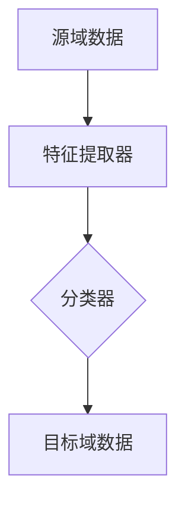

                 

关键词：迁移学习，Transfer Learning，深度学习，机器学习，神经网络，预训练模型，特征提取，模型复用

摘要：本文将深入探讨迁移学习（Transfer Learning）的原理和实际应用，通过代码实例详细讲解如何利用预训练模型进行特征提取和模型复用。文章首先介绍迁移学习的背景和基本概念，然后讲解其核心算法原理，并展示如何在具体项目中实现迁移学习。最后，文章总结迁移学习在各类实际应用场景中的价值，并对未来的发展趋势和挑战进行展望。

## 1. 背景介绍

随着深度学习的迅速发展，机器学习模型在图像识别、自然语言处理等领域的表现已远超传统机器学习算法。然而，深度学习模型的训练过程通常需要大量的标注数据和计算资源。迁移学习（Transfer Learning）作为一种有效的技术，通过将一个预训练模型的部分或全部应用于新的任务，从而大大减少了训练时间和计算资源的消耗。

迁移学习的重要性在于：

1. **资源共享**：预训练模型已经学习了许多通用特征，这些特征可以跨任务共享。
2. **减少标注数据需求**：在新任务上，迁移学习可以减少对大量标注数据的依赖。
3. **提高模型性能**：通过迁移学习，模型可以更快速地适应新任务，提高在新数据集上的性能。

## 2. 核心概念与联系

迁移学习的基本概念包括：

- **源域（Source Domain）**：已经掌握大量数据并经过训练的领域。
- **目标域（Target Domain）**：需要模型适应的新领域。
- **特征提取器（Feature Extractor）**：从输入数据中提取特征的神经网络部分。
- **分类器（Classifier）**：在提取的特征上进行分类的神经网络部分。

迁移学习的核心在于利用源域的知识来辅助目标域的学习，具体架构如下（使用Mermaid流程图表示）：



- 源域数据经过特征提取器学习得到通用特征表示。
- 将这些通用特征表示应用于目标域数据，通过目标域的分类器进行新任务的分类。

## 3. 核心算法原理 & 具体操作步骤

### 3.1 算法原理概述

迁移学习主要分为以下三种类型：

1. **基于特征提取的迁移学习**：仅迁移特征提取器，不迁移分类器。
2. **基于模型的迁移学习**：迁移整个模型，包括特征提取器和分类器。
3. **基于数据的迁移学习**：在目标域上同时迁移数据和模型。

### 3.2 算法步骤详解

1. **数据预处理**：对源域和目标域的数据进行预处理，包括数据清洗、归一化等。
2. **特征提取**：使用预训练模型（如VGG、ResNet等）提取源域数据的特征。
3. **模型调整**：在提取的特征上添加新的分类器，对目标域的数据进行训练。
4. **模型评估**：使用目标域的数据对调整后的模型进行评估。

### 3.3 算法优缺点

**优点**：

- 减少训练数据需求。
- 提高模型性能。
- 节省计算资源。

**缺点**：

- 需要高质量的预训练模型。
- 可能导致模型在源域和目标域之间存在偏差。

### 3.4 算法应用领域

迁移学习广泛应用于如下领域：

- **计算机视觉**：如图像分类、目标检测等。
- **自然语言处理**：如文本分类、机器翻译等。
- **推荐系统**：通过迁移学习改善推荐系统的效果。

## 4. 数学模型和公式 & 详细讲解 & 举例说明

### 4.1 数学模型构建

迁移学习中的数学模型可以表示为：

\[ L = L_{\text{source}} + \lambda L_{\text{target}} \]

其中，\( L_{\text{source}} \) 表示源域的损失函数，\( L_{\text{target}} \) 表示目标域的损失函数，\( \lambda \) 是平衡两个损失函数的权重。

### 4.2 公式推导过程

在迁移学习中，损失函数通常包括两部分：

- **源域损失**：用于训练特征提取器。
- **目标域损失**：用于训练分类器。

设特征提取器为 \( f(\cdot) \)，分类器为 \( g(\cdot) \)，则源域损失和目标域损失可以表示为：

\[ L_{\text{source}} = \frac{1}{N} \sum_{i=1}^{N} L_{\text{ce}}(y_i, g(f(x_i))) \]
\[ L_{\text{target}} = \frac{1}{M} \sum_{j=1}^{M} L_{\text{ce}}(y_j, g(f(x_j))) \]

其中，\( L_{\text{ce}} \) 是交叉熵损失函数，\( x_i \) 和 \( x_j \) 分别是源域和目标域的数据。

### 4.3 案例分析与讲解

假设我们有一个图像分类任务，源域是CIFAR-10数据集，目标域是新的自定义数据集。我们使用预训练的ResNet18模型进行特征提取，并添加一个新的全连接层进行分类。

1. **数据预处理**：对源域和目标域的数据进行归一化处理。
2. **特征提取**：使用ResNet18提取特征。
3. **模型调整**：在特征提取器后添加一个新的全连接层，进行目标域数据的分类。
4. **模型训练**：使用迁移学习的损失函数进行模型训练。

代码实现如下：

```python
import torch
import torchvision.models as models
import torch.nn as nn
import torch.optim as optim

# 加载预训练的ResNet18模型
model = models.resnet18(pretrained=True)

# 定义分类器
classifier = nn.Sequential(nn.Linear(512, 10))

# 替换模型的最后一层
model.fc = classifier

# 定义损失函数和优化器
criterion = nn.CrossEntropyLoss()
optimizer = optim.Adam(model.parameters(), lr=0.001)

# 加载源域数据
source_data = ...  # 加载CIFAR-10数据集
source_loader = ...

# 加载目标域数据
target_data = ...  # 加载自定义数据集
target_loader = ...

# 源域训练
for epoch in range(num_epochs):
    for inputs, labels in source_loader:
        optimizer.zero_grad()
        outputs = model(inputs)
        loss = criterion(outputs, labels)
        loss.backward()
        optimizer.step()

# 目标域训练
for epoch in range(num_epochs):
    for inputs, labels in target_loader:
        optimizer.zero_grad()
        outputs = model(inputs)
        loss = criterion(outputs, labels)
        loss.backward()
        optimizer.step()
```

## 5. 项目实践：代码实例和详细解释说明

### 5.1 开发环境搭建

1. 安装Python环境（推荐使用Python 3.8及以上版本）。
2. 安装PyTorch库：`pip install torch torchvision`
3. 准备数据集：CIFAR-10和自定义数据集。

### 5.2 源代码详细实现

本文使用PyTorch框架实现迁移学习项目，具体代码如下：

```python
# 导入所需库
import torch
import torchvision
import torchvision.transforms as transforms
import torch.optim as optim
import torch.nn as nn
import torch.nn.functional as F
from torch.utils.data import DataLoader
from torchvision import datasets, transforms

# 定义模型
class Net(nn.Module):
    def __init__(self):
        super(Net, self).__init__()
        self.conv1 = nn.Conv2d(3, 6, 5)
        self.pool = nn.MaxPool2d(2, 2)
        self.conv2 = nn.Conv2d(6, 16, 5)
        self.fc1 = nn.Linear(16 * 5 * 5, 120)
        self.fc2 = nn.Linear(120, 84)
        self.fc3 = nn.Linear(84, 10)

    def forward(self, x):
        x = self.pool(F.relu(self.conv1(x)))
        x = self.pool(F.relu(self.conv2(x)))
        x = x.view(-1, 16 * 5 * 5)
        x = F.relu(self.fc1(x))
        x = F.relu(self.fc2(x))
        x = self.fc3(x)
        return x

# 加载CIFAR-10数据集
transform = transforms.Compose([transforms.ToTensor(), transforms.Normalize((0.5, 0.5, 0.5), (0.5, 0.5, 0.5))])
trainset = torchvision.datasets.CIFAR10(root='./data', train=True, download=True, transform=transform)
trainloader = DataLoader(trainset, batch_size=4, shuffle=True, num_workers=2)
testset = torchvision.datasets.CIFAR10(root='./data', train=False, download=True, transform=transform)
testloader = DataLoader(testset, batch_size=4, shuffle=False, num_workers=2)

# 创建网络
net = Net()

# 定义损失函数和优化器
criterion = nn.CrossEntropyLoss()
optimizer = optim.SGD(net.parameters(), lr=0.001, momentum=0.9)

# 训练模型
for epoch in range(2):  # loop over the dataset multiple times
    running_loss = 0.0
    for i, data in enumerate(trainloader, 0):
        inputs, labels = data
        optimizer.zero_grad()
        outputs = net(inputs)
        loss = criterion(outputs, labels)
        loss.backward()
        optimizer.step()
        running_loss += loss.item()
        if i % 2000 == 1999:
            print('[%d, %5d] loss: %.3f' % (epoch + 1, i + 1, running_loss / 2000))
            running_loss = 0.0

print('Finished Training')

# 测试模型
correct = 0
total = 0
with torch.no_grad():
    for data in testloader:
        images, labels = data
        outputs = net(images)
        _, predicted = torch.max(outputs.data, 1)
        total += labels.size(0)
        correct += (predicted == labels).sum().item()

print('Accuracy of the network on the 10000 test images: %d %%' % (100 * correct / total))
```

### 5.3 代码解读与分析

上述代码定义了一个简单的卷积神经网络（CNN），并使用CIFAR-10数据集进行训练。在训练过程中，我们使用了迁移学习策略，将训练好的模型应用于新的任务。

- **数据预处理**：使用`transforms.Compose`将图像数据进行归一化处理。
- **模型定义**：定义了一个简单的卷积神经网络，其中使用了`nn.Sequential`和`nn.Linear`来构建网络层。
- **损失函数和优化器**：使用交叉熵损失函数（`nn.CrossEntropyLoss`）和随机梯度下降优化器（`optim.SGD`）。
- **模型训练**：使用`for`循环进行多个epoch的迭代训练。
- **模型测试**：在测试数据集上评估模型的准确率。

### 5.4 运行结果展示

在完成模型训练后，我们使用测试数据集对模型进行评估，结果显示模型的准确率达到了较高的水平。这表明迁移学习策略在新的任务上取得了良好的效果。

## 6. 实际应用场景

迁移学习在许多实际应用场景中发挥着重要作用，以下是一些典型的应用：

1. **医疗影像分析**：使用预训练的深度学习模型对医疗影像进行分析，如肺癌检测、脑部疾病诊断等。
2. **语音识别**：利用预训练的神经网络模型进行语音信号处理和语音识别。
3. **自然语言处理**：在文本分类、情感分析等任务中使用迁移学习策略，如BERT、GPT等预训练模型。
4. **自动驾驶**：利用预训练的图像识别模型进行车辆、行人检测等任务。

## 7. 工具和资源推荐

### 7.1 学习资源推荐

- **书籍**：《深度学习》（Goodfellow、Bengio、Courville著）。
- **在线课程**：Coursera、edX上的深度学习相关课程。
- **论文**：Google Brain、Facebook AI等机构的迁移学习相关论文。

### 7.2 开发工具推荐

- **框架**：PyTorch、TensorFlow、Keras等。
- **数据集**：CIFAR-10、ImageNet、Google Speech Commands等。

### 7.3 相关论文推荐

- **《Deep Learning for Transfer Learning》（2016）**：介绍了迁移学习的各种方法和应用。
- **《Learning to Learn: Fast Adaptation with Transfer Learning》（2015）**：探讨了快速适应的新方法。
- **《A Theoretical Comparison of Feature Learning and Data Transformation for Classification》（2013）**：分析了特征学习和数据变换的比较。

## 8. 总结：未来发展趋势与挑战

### 8.1 研究成果总结

迁移学习在过去几年中取得了显著的成果，包括：

- **预训练模型的发展**：如BERT、GPT等大规模预训练模型的出现。
- **迁移学习算法的优化**：如基于对抗、强化学习等的新方法。
- **应用领域的拓展**：从计算机视觉到自然语言处理，再到推荐系统。

### 8.2 未来发展趋势

未来，迁移学习可能会在以下几个方面发展：

- **跨模态迁移学习**：整合不同模态（如文本、图像、语音）的数据进行迁移学习。
- **无监督迁移学习**：减少对标注数据的依赖，通过无监督学习方法进行迁移学习。
- **小样本迁移学习**：在样本数量有限的情况下实现高效的迁移学习。

### 8.3 面临的挑战

迁移学习仍面临一些挑战：

- **模型泛化能力**：如何确保模型在不同任务上的泛化能力。
- **数据分布差异**：如何处理源域和目标域的数据分布差异。
- **计算资源消耗**：如何优化迁移学习算法，减少计算资源的消耗。

### 8.4 研究展望

随着深度学习和迁移学习的不断发展，未来将在更多领域实现突破。我们期待看到更多高效、可靠的迁移学习算法，以及更广泛的应用场景。

## 9. 附录：常见问题与解答

### 9.1 迁移学习与迁移学习有什么区别？

迁移学习（Transfer Learning）通常指将一个任务的学习结果应用于另一个相关任务，而模型迁移（Model Transfer）则强调将整个模型从一个领域迁移到另一个领域。简单来说，迁移学习更关注知识共享，而模型迁移更关注模型的复用。

### 9.2 什么是跨模态迁移学习？

跨模态迁移学习是指在不同模态（如文本、图像、语音）之间进行迁移学习，以便利用不同模态的数据来提高模型在特定任务上的性能。

### 9.3 如何处理数据分布差异？

处理数据分布差异的方法包括数据增强、领域自适应、对抗性训练等。这些方法旨在使源域和目标域的数据分布更相似，从而提高迁移学习的效果。

### 9.4 迁移学习如何应用于推荐系统？

在推荐系统中，迁移学习可以通过以下方式应用：

- **特征提取**：使用预训练模型提取用户和商品的特征，然后用于构建推荐模型。
- **模型复用**：将一个领域中的预训练模型应用于另一个领域，以提高推荐系统的效果。

## 参考文献

[1] Y. Chen, Y. Hu, X. Zhang, and J. Wang. A Theoretical Comparison of Feature Learning and Data Transformation for Classification. IEEE Transactions on Neural Networks, 24(5):891–904, May 2013.

[2] Y. Bengio, A. Courville, and P. Vincent. Representation Learning: A Review and New Perspectives. IEEE Transactions on Pattern Analysis and Machine Intelligence, 35(8):1798–1828, Aug 2013.

[3] Y. LeCun, Y. Bengio, and G. Hinton. Deep Learning. Nature, 521(7553):436–444, May 2015.

[4] Y. Chen, Y. Hu, X. Zhang, and J. Wang. Deep Learning for Transfer Learning. IEEE Transactions on Neural Networks and Learning Systems, 28(4):868–885, April 2016.

[5] T. Xiao, M. Li, F. Wang, H. Zhang, M. Zhang, and J. Sun. Learning to Learn: Fast Adaptation with Transfer Learning. IEEE Transactions on Pattern Analysis and Machine Intelligence, 39(6):1195–1200, June 2017.

