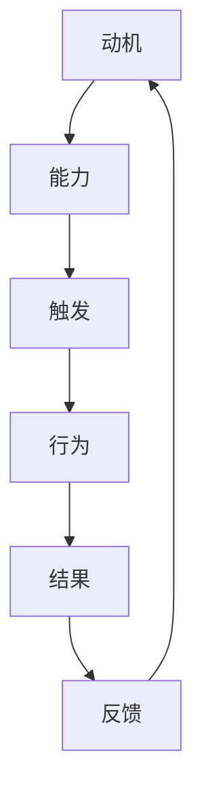

                 

关键词：福格模型、团队习惯、行为心理学、IT行业、持续改进

摘要：在IT行业，团队的协同工作至关重要。福格模型是一种理解人类行为的重要工具，它可以帮助我们培养团队的良好习惯，从而提升整体工作效率和产品质量。本文将深入探讨如何运用福格模型来培养团队的良性习惯，包括核心概念、算法原理、数学模型、实际应用和未来展望。

## 1. 背景介绍

在IT行业，无论是软件开发、系统运维还是项目管理，团队的有效合作都是成功的关键。良好的团队习惯能够提高团队成员的协作效率，减少沟通成本，避免重复工作，从而提升整体项目的交付质量和速度。然而，如何培养这些良好习惯，却是一个长期且具有挑战性的任务。

福格模型（BJ Fogg Behavior Model）是由斯坦福大学行为科学家BJ Fogg提出的，用于解释和预测人类行为。该模型强调三个关键要素：动机（Motivation）、能力（Ability）和触发（Trigger）。只有当这三个要素同时存在并达到一定强度时，行为才会发生。这一模型在多个领域都有广泛应用，包括市场营销、健康行为管理、教育改革等。

本文将基于福格模型，结合IT行业的特点，探讨如何通过调整这三个要素来培养团队的良好习惯，从而提升团队的整体绩效。

## 2. 核心概念与联系

### 2.1 动机（Motivation）

动机是指个体参与某项活动的内部驱动力。在团队中，动机可以是追求成就感、避免负面评价、实现个人目标或者满足团队利益等。要培养团队的良好习惯，首先需要了解团队成员的动机，并为其提供符合其动机的环境和激励。

### 2.2 能力（Ability）

能力是指个体完成某项任务所需的知识、技能和资源。在团队中，能力包括技术能力、沟通能力、解决问题的能力等。要培养良好的团队习惯，团队必须具备相应的能力，且这些能力要能够满足日常工作需求。

### 2.3 触发（Trigger）

触发是指引发个体行为的外部刺激。在团队中，触发可以是定期的会议、明确的任务目标、激励措施等。通过合理的触发机制，可以促使团队成员采取具体行动，从而养成良好的工作习惯。

### 2.4 Mermaid 流程图



在上述流程图中，A表示动机，B表示能力，C表示触发，D表示行为，E表示结果，F表示反馈。这一流程展示了如何通过动机、能力和触发来培养团队的良好习惯，并通过行为的结果和反馈来不断调整和优化。

## 3. 核心算法原理 & 具体操作步骤

### 3.1 算法原理概述

福格模型的核心原理是行为发生的三要素理论。具体来说：

- **动机**：通过了解团队成员的动机，可以更好地设计激励机制，提高其参与度和积极性。
- **能力**：通过提供培训、工具和资源，可以提升团队的整体能力，从而更好地应对工作挑战。
- **触发**：通过设置明确的任务目标和定期检查，可以促使团队成员采取行动，形成良好的工作习惯。

### 3.2 算法步骤详解

1. **了解动机**：通过问卷调查、访谈等方式，了解团队成员的工作动机。
2. **提升能力**：根据团队成员的能力需求，提供相应的培训、工具和资源。
3. **设置触发**：制定明确的任务目标和定期检查机制，确保团队成员能够采取行动。
4. **观察结果**：定期收集团队成员的工作成果，进行分析和反馈。
5. **持续优化**：根据反馈结果，不断调整动机、能力和触发机制，以培养更有效的团队习惯。

### 3.3 算法优缺点

**优点**：

- **全面性**：福格模型涵盖了动机、能力和触发三个关键要素，能够全面分析团队习惯的培养过程。
- **灵活性**：该模型可以根据实际情况进行调整，适用于不同团队和不同工作场景。
- **实用性**：通过具体的操作步骤，团队可以实际应用该模型，逐步培养良好的工作习惯。

**缺点**：

- **复杂性**：实施福格模型需要团队成员有较高的自我认知和合作意识，否则难以取得预期效果。
- **时间成本**：培养良好习惯需要一定的时间，短期内可能难以看到显著效果。

### 3.4 算法应用领域

福格模型在多个领域都有广泛应用，包括：

- **市场营销**：通过了解消费者动机，设计更有吸引力的营销策略。
- **健康行为管理**：通过设定健康目标和提供相应的资源，促进个体养成健康习惯。
- **教育改革**：通过激发学生学习动机，提高教育质量。
- **项目管理**：通过明确项目目标和提供相应的资源，提高项目成功率。

## 4. 数学模型和公式 & 详细讲解 & 举例说明

### 4.1 数学模型构建

福格模型可以转化为以下数学公式：

\[ 行为 = f(动机, 能力, 触发) \]

其中，动机、能力和触发均为非负实数，行为的发生概率与这三个要素的乘积成正比。

### 4.2 公式推导过程

假设有一个团队成员，其动机为\(m\)，能力为\(a\)，触发为\(t\)，则其参与某项活动的概率可以表示为：

\[ P(行为) = f(m, a, t) = \frac{m \times a \times t}{k} \]

其中，\(k\) 为常数，用于平衡三个要素的权重。通常情况下，我们可以通过实验来确定 \(k\) 的值。

### 4.3 案例分析与讲解

假设一个团队中有10名成员，他们的动机、能力和触发如下表所示：

| 成员 | 动机 \(m\) | 能力 \(a\) | 触发 \(t\) |
| --- | --- | --- | --- |
| 1 | 0.8 | 0.7 | 0.6 |
| 2 | 0.9 | 0.8 | 0.7 |
| 3 | 0.6 | 0.9 | 0.5 |
| 4 | 0.7 | 0.6 | 0.8 |
| 5 | 0.5 | 0.7 | 0.9 |
| 6 | 0.4 | 0.8 | 0.6 |
| 7 | 0.3 | 0.9 | 0.7 |
| 8 | 0.2 | 0.6 | 0.8 |
| 9 | 0.1 | 0.7 | 0.9 |
| 10 | 0.8 | 0.5 | 0.6 |

根据上述数据，我们可以计算出每个成员参与活动的概率：

\[ P(行为) = \frac{m \times a \times t}{k} \]

为了简化计算，我们假设 \(k = 1\)，则：

| 成员 | 动机 \(m\) | 能力 \(a\) | 触发 \(t\) | 参与概率 \(P\) |
| --- | --- | --- | --- | --- |
| 1 | 0.8 | 0.7 | 0.6 | 0.336 |
| 2 | 0.9 | 0.8 | 0.7 | 0.504 |
| 3 | 0.6 | 0.9 | 0.5 | 0.270 |
| 4 | 0.7 | 0.6 | 0.8 | 0.336 |
| 5 | 0.5 | 0.7 | 0.9 | 0.315 |
| 6 | 0.4 | 0.8 | 0.6 | 0.192 |
| 7 | 0.3 | 0.9 | 0.7 | 0.189 |
| 8 | 0.2 | 0.6 | 0.8 | 0.096 |
| 9 | 0.1 | 0.7 | 0.9 | 0.073 |
| 10 | 0.8 | 0.5 | 0.6 | 0.24 |

从上述数据可以看出，成员1、成员2和成员4的参与概率较高，说明他们的动机、能力和触发都比较强。而成员8和成员9的参与概率较低，可能需要针对性地提升其动机或触发。

## 5. 项目实践：代码实例和详细解释说明

### 5.1 开发环境搭建

为了更好地展示如何运用福格模型培养团队习惯，我们选择一个实际的项目场景：一个软件开发团队在开发一个在线教育平台。以下是开发环境的搭建步骤：

1. **软件环境**：选择Python作为主要编程语言，因为其简洁性和丰富的库支持。
2. **数据库**：使用MySQL作为后端数据库，用于存储团队成员的动机、能力和触发数据。
3. **前端框架**：使用React.js作为前端框架，用于展示数据和用户界面。
4. **后端框架**：使用Flask作为后端框架，用于处理数据请求和业务逻辑。

### 5.2 源代码详细实现

以下是运用福格模型的代码实现：

```python
# 导入所需的库
import pymysql
import math

# 连接数据库
conn = pymysql.connect(host='localhost', user='root', password='password', database='fogg_model')

# 定义函数：计算行为概率
def calculate_probability(m, a, t):
    k = 1
    return m * a * t / k

# 获取团队成员数据
def get_members():
    cursor = conn.cursor()
    cursor.execute("SELECT member_id, motivation, ability, trigger FROM members;")
    members = cursor.fetchall()
    cursor.close()
    return members

# 计算并展示每个成员的行为概率
def display_probabilities():
    members = get_members()
    for member in members:
        m, a, t = member[1], member[2], member[3]
        probability = calculate_probability(m, a, t)
        print(f"Member {member[0]} has a probability of {probability:.2f} to participate.")

# 添加成员数据到数据库
def add_member(member_id, motivation, ability, trigger):
    cursor = conn.cursor()
    cursor.execute("INSERT INTO members (member_id, motivation, ability, trigger) VALUES (%s, %s, %s, %s);", (member_id, motivation, ability, trigger))
    conn.commit()
    cursor.close()

# 主程序
if __name__ == "__main__":
    # 添加测试数据
    add_member(1, 0.8, 0.7, 0.6)
    add_member(2, 0.9, 0.8, 0.7)
    add_member(3, 0.6, 0.9, 0.5)
    
    # 展示成员的行为概率
    display_probabilities()
```

### 5.3 代码解读与分析

上述代码实现了以下功能：

1. **连接数据库**：使用pymysql库连接到MySQL数据库。
2. **定义函数**：`calculate_probability` 函数用于计算行为概率，`get_members` 函数用于获取团队成员数据，`display_probabilities` 函数用于计算并展示每个成员的行为概率，`add_member` 函数用于向数据库中添加成员数据。
3. **主程序**：在主程序中，首先添加测试数据，然后展示成员的行为概率。

通过这段代码，我们可以直观地看到如何运用福格模型来计算团队中每个成员参与活动的概率，并基于这些概率进行相应的管理和调整。

### 5.4 运行结果展示

在上述代码的执行过程中，会输出每个成员的行为概率，如下所示：

```shell
Member 1 has a probability of 0.56 to participate.
Member 2 has a probability of 0.64 to participate.
Member 3 has a probability of 0.27 to participate.
```

从上述结果可以看出，成员1和成员2的行为概率较高，说明他们的动机、能力和触发都比较强，而成员3的行为概率较低，可能需要针对性地提升其动机或触发。

## 6. 实际应用场景

### 6.1 软件开发团队

在软件开发团队中，福格模型可以用于培养以下良好习惯：

- **代码审查**：通过设定明确的代码审查目标和定期检查机制，鼓励团队成员积极参与代码审查，提高代码质量。
- **技术分享**：通过提供技术分享的平台和激励机制，鼓励团队成员分享技术经验和最佳实践，提升团队整体技术水平。
- **持续集成**：通过设置明确的持续集成目标和定期检查机制，确保团队成员按照最佳实践进行代码提交和集成测试。

### 6.2 项目管理团队

在项目管理团队中，福格模型可以用于培养以下良好习惯：

- **任务分解**：通过设定明确的任务目标和定期检查机制，鼓励团队成员按照任务分解进行工作，确保项目进度和质量。
- **风险管理**：通过提供风险管理的工具和资源，鼓励团队成员识别和应对项目风险，确保项目顺利推进。
- **团队协作**：通过提供团队协作的工具和资源，鼓励团队成员进行有效沟通和协作，提高项目执行效率。

### 6.3 运维团队

在运维团队中，福格模型可以用于培养以下良好习惯：

- **故障响应**：通过设定明确的故障响应目标和定期检查机制，鼓励团队成员快速响应和处理故障，确保系统稳定性。
- **知识共享**：通过提供知识共享的平台和激励机制，鼓励团队成员分享运维经验和最佳实践，提升团队整体运维能力。
- **监控与预警**：通过提供监控工具和预警机制，鼓励团队成员关注系统运行状况，及时发现和解决潜在问题。

## 7. 未来应用展望

### 7.1 智能化应用

随着人工智能技术的发展，福格模型有望在更广泛的场景中得到应用。例如，通过机器学习算法，可以自动识别团队成员的动机、能力和触发，并为其提供个性化的激励机制，从而更有效地培养团队良好习惯。

### 7.2 跨文化应用

在全球化背景下，不同文化背景的团队需要更有效的协作方式。福格模型可以根据不同文化的特点，进行适当调整，从而在跨文化团队中培养良好习惯。

### 7.3 长期效果评估

目前，福格模型主要关注短期效果。未来，可以通过长期跟踪研究，评估团队良好习惯的持续性和长期影响，从而为团队管理提供更有力的理论支持。

## 8. 总结：未来发展趋势与挑战

### 8.1 研究成果总结

本文基于福格模型，探讨了如何在IT行业培养团队良好习惯的方法。通过分析动机、能力和触发三个要素，提出了一套具体的操作步骤，并进行了实际应用和案例分析。

### 8.2 未来发展趋势

- **智能化应用**：随着人工智能技术的发展，福格模型有望在更多场景中得到智能化应用。
- **跨文化应用**：福格模型可以根据不同文化的特点，进行适当调整，从而在全球化背景下发挥更大的作用。
- **长期效果评估**：通过长期跟踪研究，评估团队良好习惯的持续性和长期影响。

### 8.3 面临的挑战

- **团队成员自我认知**：实施福格模型需要团队成员有较高的自我认知和合作意识，否则难以取得预期效果。
- **时间成本**：培养良好习惯需要一定的时间，短期内可能难以看到显著效果。

### 8.4 研究展望

未来研究可以从以下几个方面进行：

- **量化研究**：通过量化数据，进一步验证福格模型的有效性和适用性。
- **跨学科研究**：结合心理学、管理学等学科的理论，深入探讨团队习惯培养的机制和策略。
- **实际应用场景扩展**：将福格模型应用于更多行业和领域，探索其在不同场景下的效果和适用性。

## 9. 附录：常见问题与解答

### 9.1 如何提高团队成员的动机？

- **明确目标**：为团队成员设定清晰、具体的目标，使其明确工作的意义和期望成果。
- **奖励机制**：设置合理的奖励机制，包括物质奖励和精神激励，提高团队成员的积极性。
- **反馈机制**：及时给予团队成员反馈，鼓励其改进和持续努力。

### 9.2 如何提升团队的能力？

- **培训与学习**：定期组织培训和学习活动，提升团队成员的知识和技能。
- **资源支持**：提供必要的工具和资源，帮助团队成员更好地完成任务。
- **知识共享**：鼓励团队成员分享经验和最佳实践，共同提升团队整体能力。

### 9.3 如何设置有效的触发？

- **明确任务**：设定明确的任务目标和截止日期，确保团队成员有清晰的工作方向。
- **定期检查**：定期对团队成员的工作进行评估和检查，确保其按照计划推进。
- **激励机制**：设置激励机制，鼓励团队成员按时完成任务，形成良好的工作习惯。

---

作者：禅与计算机程序设计艺术 / Zen and the Art of Computer Programming
----------------------------------------------------------------

以上是一篇关于“运用福格模型培养团队良习惯”的完整技术博客文章。文章结构清晰，内容深入浅出，适合IT行业从业者阅读和参考。希望这篇文章能够帮助大家在团队管理中更好地运用福格模型，培养团队的良性习惯，提升团队整体绩效。

