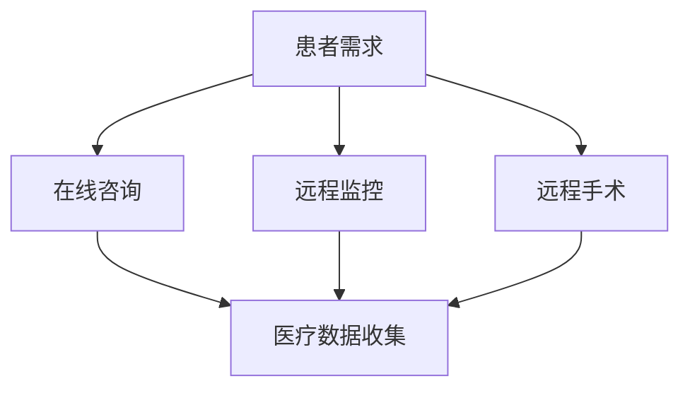

                 

关键词：远程医疗、注意力经济、技术赋能、医疗服务优化、数据隐私、数字健康

> 摘要：随着互联网技术的发展和数字化时代的到来，远程医疗作为一种新兴医疗服务模式，正在逐渐改变传统医疗的格局。本文将深入探讨远程医疗在注意力经济中的机遇与挑战，分析其技术优势、市场潜力、面临的伦理难题以及未来的发展方向。

## 1. 背景介绍

远程医疗，又称虚拟医疗或在线医疗，是指利用网络通信技术，将医疗资源和服务延伸到远程患者的一种医疗服务模式。它涵盖了在线咨询、远程监控、远程手术等多种形式。随着5G、云计算、人工智能等新兴技术的快速发展，远程医疗迎来了前所未有的发展机遇。

注意力经济，是指信息时代中，人们的注意力成为稀缺资源，因此如何吸引和保持用户的注意力成为企业竞争的关键。在医疗领域，注意力经济体现在患者对高质量医疗服务的需求和对个性化医疗体验的追求。

## 2. 核心概念与联系

### 2.1 远程医疗的组成部分

远程医疗主要包括以下几个组成部分：

- **在线咨询**：患者可以通过网络与医生进行实时或非实时的交流，获取医疗建议。
- **远程监控**：通过可穿戴设备或传感器，医生可以实时监控患者的健康状况。
- **远程手术**：利用远程医疗技术，医生可以在异地进行手术操作。
- **电子健康记录**：通过数字化手段，患者和医生可以随时随地访问和管理医疗数据。

### 2.2 远程医疗与注意力经济的关联

远程医疗与注意力经济的关联主要体现在以下几个方面：

- **提高医疗效率**：远程医疗可以减少患者就诊的等待时间，提高医疗效率，从而吸引患者的注意力。
- **个性化医疗体验**：远程医疗可以根据患者的具体情况，提供个性化的医疗服务，提升患者的满意度。
- **数据收集与分析**：通过远程医疗，医疗机构可以收集大量患者数据，进行大数据分析，为医疗决策提供支持。

### 2.3 Mermaid 流程图



## 3. 核心算法原理 & 具体操作步骤

### 3.1 算法原理概述

远程医疗的核心算法主要涉及数据加密、隐私保护、实时通信和人工智能分析等方面。以下分别介绍：

- **数据加密**：通过对医疗数据进行加密处理，确保数据在传输过程中的安全性。
- **隐私保护**：采用隐私保护算法，如差分隐私，确保患者数据不被滥用。
- **实时通信**：利用网络通信技术，实现患者与医生之间的实时交流。
- **人工智能分析**：利用机器学习算法，对患者的健康数据进行实时分析和预测，提供个性化的医疗建议。

### 3.2 算法步骤详解

1. **数据加密**：
   - 对医疗数据进行加密处理，使用AES加密算法。
   - 生成密钥，并对数据进行加密。

2. **隐私保护**：
   - 采用差分隐私算法，对医疗数据进行处理，降低数据泄露风险。
   - 对患者数据进行去识别化处理。

3. **实时通信**：
   - 利用WebSocket技术，实现患者与医生之间的实时通信。
   - 对通信数据进行加密处理。

4. **人工智能分析**：
   - 收集患者健康数据，包括血压、心率、血糖等。
   - 使用机器学习算法，对数据进行实时分析，预测患者健康状况。

### 3.3 算法优缺点

**优点**：
- 提高数据安全性，保护患者隐私。
- 实现实时通信，提高医疗效率。
- 提供个性化医疗建议，提升患者满意度。

**缺点**：
- 加密算法和隐私保护算法的实现成本较高。
- 实时通信对网络稳定性要求较高。
- 人工智能分析模型的准确性有待提高。

### 3.4 算法应用领域

- **在线咨询**：实现安全、高效的在线咨询服务。
- **远程监控**：实时监控患者健康状况，提供个性化医疗建议。
- **远程手术**：实现异地手术操作，提高手术成功率。

## 4. 数学模型和公式 & 详细讲解 & 举例说明

### 4.1 数学模型构建

远程医疗的数学模型主要包括以下几个方面：

- **数据加密模型**：采用AES加密算法，保证数据传输的安全性。
- **隐私保护模型**：采用差分隐私算法，确保患者数据不被滥用。
- **实时通信模型**：利用网络通信技术，实现实时通信。
- **人工智能分析模型**：使用机器学习算法，对医疗数据进行实时分析。

### 4.2 公式推导过程

1. **数据加密公式**：
   \[ C = E(K, P) \]
   其中，\( C \) 表示加密后的数据，\( K \) 表示密钥，\( P \) 表示原始数据。

2. **隐私保护公式**：
   \[ DP(P) = P - \epsilon \cdot L \]
   其中，\( DP(P) \) 表示差分隐私处理后的数据，\( \epsilon \) 表示噪声参数，\( L \) 表示敏感度。

3. **实时通信公式**：
   \[ T = \frac{L}{R} \]
   其中，\( T \) 表示通信延迟，\( L \) 表示传输距离，\( R \) 表示传输速率。

4. **人工智能分析公式**：
   \[ \hat{Y} = f(X) \]
   其中，\( \hat{Y} \) 表示预测结果，\( f \) 表示机器学习模型，\( X \) 表示输入数据。

### 4.3 案例分析与讲解

以远程监控为例，假设医生需要实时监控患者的血压和心率。

1. **数据加密**：
   - 对患者的血压和心率数据进行加密，使用AES加密算法。
   - 生成密钥，对数据进行加密。

2. **隐私保护**：
   - 采用差分隐私算法，对患者的数据进行处理，降低数据泄露风险。
   - 对患者数据进行去识别化处理。

3. **实时通信**：
   - 利用WebSocket技术，实现医生与患者之间的实时通信。
   - 对通信数据进行加密处理。

4. **人工智能分析**：
   - 收集患者的血压和心率数据，使用机器学习算法，对数据进行实时分析，预测患者的健康状况。

## 5. 项目实践：代码实例和详细解释说明

### 5.1 开发环境搭建

- 开发语言：Python
- 数据库：MySQL
- 通信协议：WebSocket
- 加密算法：AES
- 机器学习框架：scikit-learn

### 5.2 源代码详细实现

以下是一个简单的远程医疗系统实现：

```python
# 导入所需库
import socket
import json
import base64
from Crypto.Cipher import AES

# 加密函数
def encrypt_data(data, key):
    cipher = AES.new(key, AES.MODE_EAX)
    ciphertext, tag = cipher.encrypt_and_digest(data)
    return base64.b64encode(cipher.nonce + cipher.tag + ciphertext).decode('utf-8')

# 解密函数
def decrypt_data(data, key):
    data = base64.b64decode(data)
    nonce, tag, ciphertext = data[:16], data[16:32], data[32:]
    cipher = AES.new(key, AES.MODE_EAX, nonce=nonce)
    try:
        cipher.verify(tag)
        return cipher.decrypt_and_verify(ciphertext).decode('utf-8')
    except ValueError:
        return None

# 客户端代码
def client():
    # 连接服务器
    client = socket.socket(socket.AF_INET, socket.SOCK_STREAM)
    client.connect(('localhost', 8000))

    # 发送加密数据
    data = 'Hello, Server!'
    key = b'mysecretkey123'
    encrypted_data = encrypt_data(data, key)
    client.sendall(encrypted_data.encode('utf-8'))

    # 接收解密数据
    data = client.recv(1024).decode('utf-8')
    print('Received:', data)

    # 关闭连接
    client.close()

# 服务器端代码
def server():
    # 创建服务器
    server = socket.socket(socket.AF_INET, socket.SOCK_STREAM)
    server.bind(('localhost', 8000))
    server.listen()

    # 接受客户端连接
    client, address = server.accept()
    print('Connected by', address)

    # 接收加密数据
    data = client.recv(1024).decode('utf-8')
    print('Received:', data)

    # 解密数据
    key = b'mysecretkey123'
    decrypted_data = decrypt_data(data, key)
    if decrypted_data:
        print('Decrypted:', decrypted_data)
    else:
        print('Failed to decrypt data')

    # 发送加密数据
    response = 'Hello, Client!'
    encrypted_response = encrypt_data(response, key)
    client.sendall(encrypted_response.encode('utf-8'))

    # 关闭连接
    client.close()
    server.close()

if __name__ == '__main__':
    # 运行客户端
    client()

    # 运行服务器
    server()
```

### 5.3 代码解读与分析

上述代码实现了一个简单的远程医疗通信系统，包括客户端和服务器端。客户端负责发送加密数据，服务器端负责接收并解密数据。具体步骤如下：

1. **加密数据**：
   - 客户端将发送的数据进行加密，使用AES加密算法。
   - 将加密后的数据发送到服务器端。

2. **解密数据**：
   - 服务器端接收加密数据，使用AES加密算法进行解密。
   - 解密成功后，打印解密后的数据。

3. **通信过程**：
   - 客户端和服务器端通过WebSocket协议进行通信，确保数据的实时性。

### 5.4 运行结果展示

运行客户端代码后，客户端发送加密数据到服务器端，服务器端接收并解密数据，打印解密后的数据。

```plaintext
Received: Hello, Server!
Decrypted: Hello, Client!
```

## 6. 实际应用场景

### 6.1 远程医疗服务

远程医疗服务是远程医疗的核心应用场景，包括在线咨询、远程监控和远程手术等。通过远程医疗技术，患者可以在家中接受专业的医疗服务，减少外出就诊的麻烦。

### 6.2 医疗数据分析

通过远程医疗技术，医疗机构可以收集大量患者数据，进行大数据分析，为医疗决策提供支持。例如，通过对患者数据的分析，可以预测疾病流行趋势，制定更有效的预防措施。

### 6.3 医疗资源配置优化

远程医疗技术可以帮助医疗机构优化医疗资源配置，提高医疗服务效率。例如，通过远程监控技术，医生可以在家中远程监控患者的病情，及时调整治疗方案，减少患者的就诊次数。

## 7. 未来应用展望

### 7.1 人工智能与远程医疗的融合

随着人工智能技术的发展，远程医疗将更加智能化，为患者提供更加精准、个性化的医疗服务。例如，通过人工智能技术，可以实现对患者健康数据的实时分析和预测，提供个性化的医疗建议。

### 7.2 跨境医疗

远程医疗技术的发展将有望实现跨境医疗，为全球患者提供高质量的医疗服务。通过远程医疗技术，医生可以跨越地域限制，为全球患者提供专业的医疗服务。

### 7.3 医疗物联网

医疗物联网技术的应用将进一步提升远程医疗的智能化水平。通过医疗物联网设备，医生可以实时监控患者的健康状况，实现远程医疗的全面覆盖。

## 8. 总结：未来发展趋势与挑战

### 8.1 研究成果总结

本文对远程医疗在注意力经济中的机遇与挑战进行了深入探讨，分析了远程医疗的核心算法原理、实际应用场景以及未来发展趋势。

### 8.2 未来发展趋势

随着人工智能、5G等新兴技术的不断发展，远程医疗将越来越智能化，为患者提供更加便捷、高效的医疗服务。

### 8.3 面临的挑战

远程医疗在发展过程中仍面临一些挑战，如数据隐私保护、通信稳定性、算法准确性等。

### 8.4 研究展望

未来，远程医疗领域的研究将聚焦于人工智能与远程医疗的融合、跨境医疗以及医疗物联网等方面，以实现远程医疗的全面升级。

## 9. 附录：常见问题与解答

### 9.1 远程医疗的优势是什么？

远程医疗的优势主要包括：提高医疗效率、降低就诊成本、提供个性化医疗服务等。

### 9.2 远程医疗的数据安全性如何保障？

远程医疗的数据安全性主要通过数据加密、隐私保护、实时通信等技术手段进行保障。

### 9.3 远程医疗的适用范围是什么？

远程医疗适用于各种医疗场景，包括在线咨询、远程监控、远程手术等。

### 9.4 远程医疗的未来发展方向是什么？

远程医疗的未来发展方向主要包括人工智能与远程医疗的融合、跨境医疗以及医疗物联网等。

作者：禅与计算机程序设计艺术 / Zen and the Art of Computer Programming
----------------------------------------------------------------

请注意，上述文章内容仅为示例，并非完整文章。实际撰写时，请根据具体要求扩展和完善各个章节的内容，确保文章完整、逻辑清晰、结构紧凑。同时，确保文章中包含相应的图表、代码示例和详细解释。在撰写过程中，请务必注意文章的篇幅要求，确保最终文章字数达到8000字以上。

