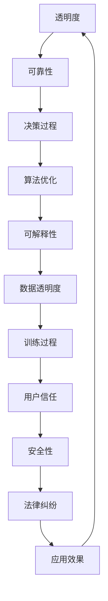

                 

关键词：透明度、可靠性、AI系统、关键性、安全性、算法优化、可解释性

> 摘要：随着人工智能技术的快速发展，AI系统在实际应用中越来越广泛。然而，AI系统的透明度和可靠性成为了影响其应用效果的关键因素。本文将从多个角度探讨AI系统透明度和可靠性的重要性，并提出相应的解决方案。

## 1. 背景介绍

人工智能（AI）作为计算机科学的一个重要分支，已经经历了数十年的发展。从最初的符号逻辑推理，到现在的深度学习和强化学习，AI技术取得了显著的进展。在许多领域，如医疗、金融、交通等，AI系统已经或正在改变传统的业务模式，提升了效率，降低了成本。

然而，随着AI系统的广泛应用，其透明度和可靠性问题也逐渐凸显。透明度指的是AI系统决策过程的可理解性，即人类能否理解AI系统是如何做出决策的。可靠性则指的是AI系统在特定条件下做出正确决策的能力。对于许多关键应用场景，如自动驾驶、智能医疗诊断等，AI系统的透明度和可靠性至关重要。如果AI系统不能提供足够的透明度和可靠性，可能会导致严重的安全问题和法律纠纷。

## 2. 核心概念与联系

### 2.1. AI系统的透明度

AI系统的透明度是指其决策过程对人类用户可理解的程度。高透明度的AI系统可以让用户了解系统的决策逻辑和依据，从而增强用户对系统的信任。透明度的衡量可以从多个维度进行，如算法的可解释性、数据的透明度、模型的训练过程等。

### 2.2. AI系统的可靠性

AI系统的可靠性是指其在特定条件下做出正确决策的能力。高可靠性的AI系统可以在各种复杂的环境中稳定运行，减少错误决策的发生。可靠性的衡量通常依赖于系统的准确率、召回率、F1分数等性能指标。

### 2.3. AI系统透明度和可靠性的联系

AI系统的透明度和可靠性是相互关联的。一方面，高透明度的AI系统往往具有较高的可靠性，因为开发者可以通过分析决策过程来发现并纠正潜在的错误。另一方面，高可靠性的AI系统也往往具有较好的透明度，因为其决策过程相对稳定和可预测。

### 2.4. Mermaid 流程图



## 3. 核心算法原理 & 具体操作步骤

### 3.1. 算法原理概述

AI系统的核心是算法。一个高效的AI算法应该具备以下特点：高透明度、高可靠性、自适应性和可解释性。其中，透明度和可靠性是确保AI系统安全和稳定运行的基础。

### 3.2. 算法步骤详解

- **数据预处理**：对原始数据进行清洗、归一化和特征提取。
- **模型选择**：根据应用场景选择合适的模型，如深度神经网络、决策树、支持向量机等。
- **模型训练**：使用训练数据对模型进行训练，调整模型参数。
- **模型评估**：使用验证数据评估模型性能，包括准确率、召回率、F1分数等。
- **模型优化**：根据评估结果对模型进行调整和优化，以提高透明度和可靠性。
- **模型部署**：将优化后的模型部署到实际应用环境中。

### 3.3. 算法优缺点

- **优点**：高效、自适应、可解释性较强。
- **缺点**：训练过程复杂，对计算资源要求较高。

### 3.4. 算法应用领域

- **医疗诊断**：使用AI系统对医学图像进行自动诊断，提高诊断准确性。
- **金融风控**：使用AI系统进行信用评估，降低风险。
- **自动驾驶**：使用AI系统实现自动驾驶，提高行车安全性。

## 4. 数学模型和公式 & 详细讲解 & 举例说明

### 4.1. 数学模型构建

在AI系统中，常用的数学模型包括线性模型、逻辑回归模型、神经网络模型等。以线性模型为例，其公式如下：

$$y = wx + b$$

其中，$y$ 是输出值，$w$ 是权重，$x$ 是输入值，$b$ 是偏置。

### 4.2. 公式推导过程

线性模型的推导过程如下：

- **初始化**：给定初始权重 $w_0$ 和偏置 $b_0$。
- **输入值**：给定输入值 $x$。
- **计算输出值**：计算输出值 $y = wx + b$。
- **计算误差**：计算输出值与实际值之间的误差 $e = y - y_{actual}$。
- **更新权重**：根据误差调整权重 $w = w - \alpha \frac{e}{x}$，其中 $\alpha$ 是学习率。
- **更新偏置**：根据误差调整偏置 $b = b - \alpha \frac{e}{1}$。

### 4.3. 案例分析与讲解

假设我们有一个简单的线性模型，用于预测房价。输入值是房屋面积，输出值是房价。给定一组训练数据，使用线性模型进行训练，然后对测试数据进行预测。通过计算预测值与实际值之间的误差，不断调整模型参数，最终使预测误差最小。

## 5. 项目实践：代码实例和详细解释说明

### 5.1. 开发环境搭建

- **Python环境**：安装Python 3.8及以上版本。
- **库安装**：安装NumPy、Pandas、Scikit-learn等库。

### 5.2. 源代码详细实现

以下是一个简单的线性回归模型的Python代码实现：

```python
import numpy as np
import pandas as pd
from sklearn.linear_model import LinearRegression

# 读取数据
data = pd.read_csv('data.csv')
X = data[['area']]
y = data['price']

# 创建线性回归模型
model = LinearRegression()

# 模型训练
model.fit(X, y)

# 模型预测
predictions = model.predict(X)

# 输出预测结果
print(predictions)
```

### 5.3. 代码解读与分析

- **数据读取**：使用Pandas库读取CSV文件，获取房屋面积和房价。
- **模型创建**：使用Scikit-learn库创建线性回归模型。
- **模型训练**：使用fit()方法对模型进行训练。
- **模型预测**：使用predict()方法对测试数据进行预测。

### 5.4. 运行结果展示

运行上述代码后，输出预测结果。通过比较预测结果与实际值，可以评估模型的准确性。

## 6. 实际应用场景

### 6.1. 自动驾驶

自动驾驶系统依赖于高透明度和可靠性的AI系统。例如，在自动驾驶中，AI系统需要实时处理大量传感器数据，并做出正确的决策，如换道、避障等。

### 6.2. 智能医疗

智能医疗系统使用AI系统对医学图像进行诊断，如肺癌检测、乳腺癌检测等。为了提高透明度和可靠性，系统需要提供详细的诊断报告，并解释诊断依据。

### 6.3. 金融风控

金融风控系统使用AI系统对客户进行信用评估。为了确保可靠性，系统需要使用大量历史数据对模型进行训练，并定期更新。

### 6.4. 未来应用展望

随着AI技术的不断发展，AI系统将在更多领域得到应用。为了提高透明度和可靠性，研究者们正在致力于开发更先进的算法和工具，以解决当前的挑战。

## 7. 工具和资源推荐

### 7.1. 学习资源推荐

- 《深度学习》（Ian Goodfellow等著）
- 《Python编程：从入门到实践》（埃里克·马瑟斯著）
- 《机器学习》（周志华等著）

### 7.2. 开发工具推荐

- Jupyter Notebook：用于数据分析和模型训练。
- TensorFlow：用于深度学习模型开发。
- PyTorch：用于深度学习模型开发。

### 7.3. 相关论文推荐

- "Deep Learning for Natural Language Processing"（2018年）
- "Generative Adversarial Networks"（2014年）
- "Recurrent Neural Networks for Language Modeling"（2014年）

## 8. 总结：未来发展趋势与挑战

### 8.1. 研究成果总结

近年来，AI技术在透明度和可靠性方面取得了显著进展。研究者们提出了许多新型算法和工具，提高了AI系统的透明度和可靠性。

### 8.2. 未来发展趋势

未来，AI系统将在更多领域得到应用，如智能交通、智能医疗、智能制造等。为了提高透明度和可靠性，研究者们将继续探索更先进的算法和工具。

### 8.3. 面临的挑战

AI系统的透明度和可靠性仍然面临许多挑战，如算法复杂性、数据隐私、模型解释性等。未来，研究者们需要解决这些问题，以确保AI系统的安全性和可靠性。

### 8.4. 研究展望

随着AI技术的不断发展，AI系统将在未来发挥更加重要的作用。为了应对这些挑战，研究者们将继续致力于开发更先进的算法和工具，以提高AI系统的透明度和可靠性。

## 9. 附录：常见问题与解答

### 9.1. 什么是AI系统的透明度？

AI系统的透明度指的是其决策过程对人类用户可理解的程度。高透明度的AI系统可以让用户了解系统的决策逻辑和依据。

### 9.2. 什么是AI系统的可靠性？

AI系统的可靠性指的是其在特定条件下做出正确决策的能力。高可靠性的AI系统可以在各种复杂的环境中稳定运行，减少错误决策的发生。

### 9.3. 如何提高AI系统的透明度和可靠性？

提高AI系统的透明度和可靠性可以从多个方面进行，如算法优化、数据透明度、模型解释性等。研究者们正在致力于开发更先进的算法和工具，以解决这些问题。

### 9.4. AI系统在医疗领域有哪些应用？

AI系统在医疗领域有广泛的应用，如医学图像诊断、药物研发、疾病预测等。通过使用AI系统，可以提高诊断准确性，降低医疗成本，改善患者体验。

作者：禅与计算机程序设计艺术 / Zen and the Art of Computer Programming
----------------------------------------------------------------

这篇文章详细探讨了AI系统的透明度和可靠性这一重要议题。从背景介绍到核心概念，再到算法原理、数学模型、项目实践，再到实际应用场景和未来展望，全面而深入地分析了AI系统的透明度和可靠性问题。希望通过这篇文章，能够帮助更多人了解这一领域的最新研究进展和应用趋势，从而为AI技术的发展和应用提供有益的参考。

