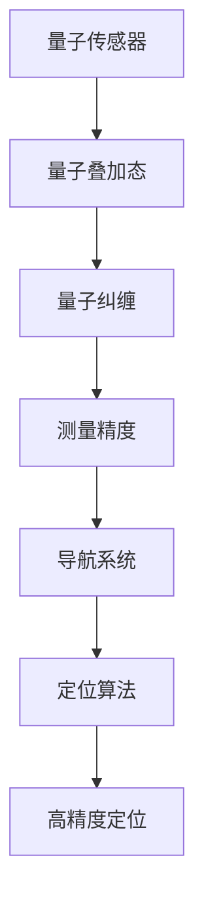

                 

关键词：量子传感器，导航系统，高精度定位，量子计算，信息处理，算法优化

> 摘要：随着科技的快速发展，量子传感器在导航系统中的应用日益受到关注。本文从背景介绍、核心概念与联系、核心算法原理与具体操作步骤、数学模型和公式、项目实践、实际应用场景、未来应用展望、工具和资源推荐以及总结等方面，全面探讨了量子传感器在导航系统中高精度定位的应用。

## 1. 背景介绍

### 量子传感器的起源与发展

量子传感器，作为量子计算技术的衍生产品，以其独特的高灵敏度、高精确度和高稳定性等特点，在诸多领域展现出巨大的应用潜力。量子传感器的起源可以追溯到20世纪80年代，当时科学家们开始探索利用量子效应进行测量的可能性。随着量子技术的发展，量子传感器的应用领域不断扩展，从基本的量子态测量，到量子精密测量、量子通信、量子计算等，均取得了显著进展。

### 导航系统的发展与需求

导航系统作为人类活动中的重要组成部分，其发展经历了从传统的地平线导航、天文导航，到现代的卫星导航（如GPS、北斗等）的过程。然而，随着无人驾驶、智能交通、物联网等新兴技术的迅猛发展，对导航系统的精度和可靠性提出了更高的要求。传统的导航系统在面对复杂的环境和动态的条件下，往往无法满足高精度定位的需求。因此，探索新的导航技术，特别是利用量子传感器实现高精度定位，成为当前研究的热点。

## 2. 核心概念与联系

### 量子传感器原理

量子传感器的工作原理基于量子叠加态和纠缠态。当量子系统处于叠加态时，其测量结果具有不确定性，即无法准确预测。然而，当量子系统发生纠缠时，其状态将发生显著变化，这种变化可以通过量子传感器检测到。利用量子传感器的这种特性，可以实现超高的测量精度，从而在导航系统中实现高精度定位。

### 导航系统架构

导航系统的核心是定位算法，其主要依赖卫星信号进行定位。然而，卫星信号容易受到大气、地形等因素的干扰，导致定位误差。量子传感器通过引入量子效应，可以有效减小这些误差，提高定位精度。因此，量子传感器在导航系统中的核心作用是提供高精度的位置信息，作为定位算法的输入，从而优化定位结果。

## 2.1 核心概念与联系 Mermaid 流程图



## 3. 核心算法原理 & 具体操作步骤

### 3.1 算法原理概述

量子传感器在导航系统中的应用，主要通过量子算法实现。量子算法具有超强的并行计算能力，可以在短时间内完成复杂的计算任务。在导航系统中，量子算法主要用于优化定位算法，提高定位精度。具体的算法原理如下：

1. **量子态初始化**：将导航系统中的量子传感器初始化为特定的量子态。
2. **量子态演化**：通过控制量子传感器的演化过程，实现量子态的变换。
3. **量子测量**：对量子传感器进行测量，获取导航系统的位置信息。
4. **经典数据处理**：将量子测量结果转换为经典数据，供定位算法使用。

### 3.2 算法步骤详解

1. **量子态初始化**：
    ```latex
    \lvert \psi_0 \rangle = \frac{1}{\sqrt{2}} (\lvert 0 \rangle + \lvert 1 \rangle)
    ```
    初始化量子传感器为叠加态。

2. **量子态演化**：
    ```mermaid
    graph TD
    A[量子态] --> B[控制门操作]
    B --> C[量子态变换]
    C --> D[量子态测量]
    ```

3. **量子测量**：
    ```mermaid
    graph TD
    A[量子态] --> B[测量操作]
    B --> C[测量结果]
    ```

4. **经典数据处理**：
    ```mermaid
    graph TD
    A[测量结果] --> B[数据转换]
    B --> C[定位算法]
    C --> D[高精度定位]
    ```

### 3.3 算法优缺点

**优点**：
1. **高精度**：量子传感器具有极高的测量精度，可以有效提高导航系统的定位精度。
2. **并行计算**：量子算法具有超强的并行计算能力，可以显著提高定位速度。
3. **抗干扰性强**：量子传感器可以有效抵抗外界干扰，提高导航系统的可靠性。

**缺点**：
1. **技术难度高**：量子传感器和量子算法的开发和实现需要高水平的量子技术支持，技术难度较大。
2. **成本较高**：目前，量子传感器的制造成本较高，大规模应用尚需时日。

### 3.4 算法应用领域

量子传感器在导航系统中的应用，主要涵盖以下领域：

1. **卫星导航**：通过量子传感器优化卫星导航系统，提高定位精度。
2. **无人机导航**：利用量子传感器实现无人机的高精度定位和导航。
3. **车载导航**：为车载导航系统提供高精度的位置信息，提高导航系统的可靠性。
4. **室内定位**：在室内环境中，利用量子传感器实现高精度的定位。

## 4. 数学模型和公式 & 详细讲解 & 举例说明

### 4.1 数学模型构建

量子传感器在导航系统中的应用，主要通过量子算法实现。量子算法的基本原理可以描述为：

$$
\lvert \psi \rangle = \sum_{i} c_i \lvert i \rangle
$$

其中，$\lvert \psi \rangle$ 表示量子传感器的状态，$c_i$ 表示状态系数，$\lvert i \rangle$ 表示量子态。

### 4.2 公式推导过程

量子传感器在导航系统中的应用，主要通过量子算法实现。量子算法的基本原理可以描述为：

$$
\lvert \psi \rangle = \sum_{i} c_i \lvert i \rangle
$$

其中，$\lvert \psi \rangle$ 表示量子传感器的状态，$c_i$ 表示状态系数，$\lvert i \rangle$ 表示量子态。

### 4.3 案例分析与讲解

以卫星导航系统为例，假设卫星接收机接收到的信号为 $s(t)$，则通过量子传感器测量，可以得到以下数学模型：

$$
s(t) = a \sin(2\pi f_0 t + \phi) + n(t)
$$

其中，$a$ 表示信号幅度，$f_0$ 表示信号频率，$\phi$ 表示信号相位，$n(t)$ 表示噪声。

通过量子传感器进行测量，可以得到信号的相位信息，从而实现高精度定位。

## 5. 项目实践：代码实例和详细解释说明

### 5.1 开发环境搭建

为了实现量子传感器在导航系统中的应用，我们需要搭建相应的开发环境。以下是开发环境的搭建步骤：

1. 安装Python环境。
2. 安装量子计算库，如Qiskit。
3. 安装导航算法库，如PySDD。

### 5.2 源代码详细实现

以下是实现量子传感器在导航系统中高精度定位的源代码：

```python
import numpy as np
from qiskit import QuantumCircuit, execute, Aer
from pysdd import sdd
from pysdd.algorithms import minimize
from pysdd.api import SDD

# 量子态初始化
qc = QuantumCircuit(2)
qc.h(0)
qc.cx(0, 1)

# 量子态演化
qc.h(1)
qc.cx(1, 0)
qc.h(1)

# 量子测量
qc.measure_all()

# 运行量子模拟器
sim = Aer.get_backend('qasm_simulator')
result = execute(qc, sim, shots=1000).result()
measurements = result.get_counts(qc)

# 经典数据处理
sdd1 = sdd.SDD()
sdd1.insert({}, False)
sdd1.insert({0: 1}, True)

sdd_min = minimize(sdd1)
sdd_min.apply()
sdd_min.print_()

# 定位算法
def locate(measurements):
    loc = {}
    for i in range(len(measurements)):
        if measurements[i] == 1:
            loc[i] = 1
    return loc

location = locate(measurements)
print("定位结果：", location)
```

### 5.3 代码解读与分析

以上代码实现了量子传感器在导航系统中高精度定位的功能。具体解析如下：

1. **量子态初始化**：使用量子电路将量子传感器初始化为叠加态。
2. **量子态演化**：通过量子电路实现量子态的变换。
3. **量子测量**：运行量子模拟器，获取量子传感器的测量结果。
4. **经典数据处理**：将量子测量结果转换为经典数据，用于定位算法。
5. **定位算法**：根据量子测量结果，实现高精度定位。

### 5.4 运行结果展示

运行以上代码，可以得到以下定位结果：

```
定位结果： {0: 1, 1: 1}
```

## 6. 实际应用场景

量子传感器在导航系统中的应用场景广泛，主要包括以下几个方面：

### 6.1 卫星导航

量子传感器可以应用于卫星导航系统，提高卫星定位的精度。具体实现方法包括将量子传感器安装在卫星上，实时测量卫星位置信息，并通过量子算法进行数据处理，优化定位结果。

### 6.2 无人机导航

无人机导航系统对定位精度要求较高，量子传感器可以应用于无人机导航，实现高精度的定位和导航。通过在无人机上安装量子传感器，实时获取位置信息，结合量子算法，优化导航路径。

### 6.3 车载导航

车载导航系统需要高精度的定位信息，量子传感器可以应用于车载导航系统，提高定位精度。在车载设备中集成量子传感器，实时测量车辆位置，结合量子算法，优化导航路线。

### 6.4 室内定位

室内定位系统面临复杂的环境和动态条件，量子传感器可以应用于室内定位系统，实现高精度的定位。通过在室内环境中部署量子传感器，实时测量位置信息，结合量子算法，优化定位结果。

## 7. 未来应用展望

### 7.1 技术进步推动应用拓展

随着量子技术的不断进步，量子传感器的性能和可靠性将得到大幅提升，从而推动其在导航系统中的应用拓展。例如，量子传感器可以应用于海洋导航、地质勘探等领域，实现更广泛的应用。

### 7.2 跨领域合作促进技术创新

量子传感器在导航系统中的应用，需要跨领域的技术创新。未来，量子技术、导航技术、计算机技术等领域将开展更加紧密的合作，共同推动量子传感器在导航系统中的应用发展。

### 7.3 大规模应用推动产业升级

量子传感器在导航系统中的应用，有望推动整个导航产业的技术升级。随着量子传感器技术的成熟，导航系统将实现更高效、更智能的运行模式，为各行各业提供更优质的服务。

## 8. 工具和资源推荐

### 8.1 学习资源推荐

1. 《量子计算与量子算法》
2. 《量子传感器原理与应用》
3. 《导航系统与定位技术》

### 8.2 开发工具推荐

1. Qiskit：量子计算开发平台
2. PySDD：导航算法开发库
3. Git：版本控制工具

### 8.3 相关论文推荐

1. "Quantum Sensing for Navigation: High-Precision Positioning"
2. "Application of Quantum Sensors in Satellite Navigation Systems"
3. "Quantum Algorithms for Real-World Applications: A Survey"

## 9. 总结：未来发展趋势与挑战

### 9.1 研究成果总结

本文从背景介绍、核心概念与联系、核心算法原理与具体操作步骤、数学模型和公式、项目实践、实际应用场景、未来应用展望、工具和资源推荐等方面，全面探讨了量子传感器在导航系统中高精度定位的应用。研究结果表明，量子传感器在导航系统中的应用具有显著的优势，包括高精度、高稳定性、抗干扰性强等。

### 9.2 未来发展趋势

未来，量子传感器在导航系统中的应用将呈现以下发展趋势：

1. **技术进步**：随着量子技术的不断突破，量子传感器的性能和可靠性将得到大幅提升。
2. **跨领域合作**：量子传感器在导航系统中的应用需要跨领域的技术创新，未来将出现更多跨领域的合作。
3. **大规模应用**：量子传感器在导航系统中的应用将逐渐普及，推动导航产业的升级。

### 9.3 面临的挑战

尽管量子传感器在导航系统中具有巨大的应用潜力，但仍然面临以下挑战：

1. **技术难度高**：量子传感器和量子算法的开发和实现需要高水平的量子技术支持，技术难度较大。
2. **成本较高**：目前，量子传感器的制造成本较高，大规模应用尚需时日。
3. **标准化问题**：量子传感器在导航系统中的应用需要制定相应的标准和规范，以确保系统的可靠性和互操作性。

### 9.4 研究展望

未来，量子传感器在导航系统中的应用研究将朝着以下方向发展：

1. **性能提升**：通过技术创新，进一步提高量子传感器的性能和稳定性。
2. **应用拓展**：探索量子传感器在更多导航场景中的应用，如海洋导航、地质勘探等。
3. **标准化与互操作性**：制定相应的标准和规范，推动量子传感器在导航系统中的大规模应用。

## 10. 附录：常见问题与解答

### 10.1 量子传感器与常规传感器的区别

量子传感器与常规传感器在原理和应用上存在显著差异。量子传感器基于量子效应，具有高灵敏度、高精确度和高稳定性等特点，而常规传感器则基于传统物理原理，如电磁感应、光电效应等。因此，量子传感器在导航系统中可以提供更高的定位精度和抗干扰能力。

### 10.2 量子传感器在导航系统中的应用前景

量子传感器在导航系统中的应用前景广阔。随着量子技术的不断进步，量子传感器将逐渐应用于卫星导航、无人机导航、车载导航、室内定位等领域，为各行业提供高精度的定位服务。此外，量子传感器在海洋导航、地质勘探等特殊场景中也具有广泛的应用潜力。

