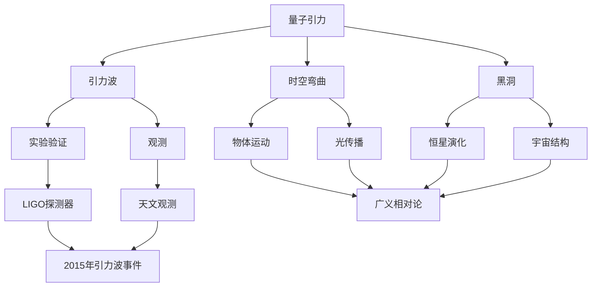

                 

关键词：量子引力，引力波，广义相对论，黑洞，时空弯曲，弦理论

摘要：本文探讨了量子引力和引力波之间的关系，以及它们在广义相对论和黑洞理论中的重要作用。文章首先介绍了量子引力和引力波的基本概念，然后阐述了它们如何影响时空弯曲和黑洞的形成。此外，本文还探讨了引力波在实验验证和观测中的应用，以及量子引力和引力波研究的未来发展方向。

## 1. 背景介绍

在过去的几个世纪里，物理学领域取得了许多重大的进展，其中最为显著的就是爱因斯坦的广义相对论。广义相对论提出了引力是由于时空的弯曲而产生的，这一理论成功地解释了许多天文现象，例如黑洞和引力透镜效应。然而，随着量子力学的出现，人们开始意识到经典物理学的局限性，尤其是在描述微观尺度上的现象时。量子引力理论试图将广义相对论与量子力学相结合，以提供一个统一的描述宇宙的理论框架。

引力波是一种由加速质量产生的时空扰动，它们在爱因斯坦的广义相对论中被预言存在。引力波的存在得到了实验验证，最著名的实验是LIGO探测器在2015年首次直接探测到引力波事件。这一发现标志着物理学领域的一个重要里程碑，同时也推动了量子引力研究的发展。

本文将重点讨论量子引力和引力波之间的关系，以及它们在广义相对论和黑洞理论中的重要作用。我们将探讨量子引力理论的基本概念，包括弦理论和量子场论，并分析它们如何影响时空结构和黑洞的形成。此外，我们还将讨论引力波在实验验证和观测中的应用，以及量子引力研究的未来发展方向。

## 2. 核心概念与联系

### 2.1 量子引力

量子引力是一种试图将广义相对论与量子力学相结合的理论框架，旨在提供一个统一的描述宇宙的理论。量子引力理论的核心思想是，引力并不是由某种基本粒子（如引力子）引起的，而是由时空本身的结构引起的。

在量子引力理论中，时空被看作是一个动态的、可变的网络，其结构受到物质的量子效应的影响。量子引力理论包括多种不同的形式，如弦理论和量子场论。弦理论认为宇宙中的所有基本粒子都是由一维的“弦”组成的，这些弦在时空中振动，产生不同的物理现象。量子场论则试图用量子力学描述引力场。

### 2.2 引力波

引力波是时空中的扰动，由加速质量产生。在爱因斯坦的广义相对论中，引力波被视为时空的波动，它们以光速传播。引力波的存在得到了LIGO探测器的实验验证，这一实验标志着物理学领域的一个重要里程碑。

引力波具有多种独特的性质。首先，它们可以在真空中传播，不受任何物质的阻挡。其次，引力波具有极弱的穿透力，能够穿过地球和星系，使其成为探测宇宙深处事件的有力工具。此外，引力波可以提供有关物质质量和运动的信息，这对于研究黑洞和宇宙大尺度结构具有重要意义。

### 2.3 时空弯曲

在广义相对论中，时空被看作一个四维的连续体，其结构受到物质和能量的影响。物质和能量的分布会导致时空的弯曲，从而产生引力效应。时空弯曲是广义相对论的核心概念之一，它解释了引力如何影响物体的运动和光的传播。

在量子引力理论中，时空弯曲被看作是一个量子现象。量子引力理论认为，时空不是连续的，而是由离散的“量子泡”组成的。这些量子泡在相互作用时会导致时空的弯曲，从而产生引力效应。量子引力理论试图用量子力学描述时空弯曲的过程。

### 2.4 黑洞

黑洞是一种极端密集的天体，其引力场如此强大，以至于连光也无法逃逸。黑洞的形成通常与恒星的演化有关，当一颗大质量恒星耗尽其核燃料时，它会发生塌缩，最终形成黑洞。

在广义相对论中，黑洞被描述为一个事件视界，即一个无法逃逸的边界。黑洞的内部结构仍然是一个未解之谜，但在量子引力理论中，黑洞被看作一个量子态，其内部可能存在某种新的物理现象。

### 2.5 核心概念联系

量子引力、引力波、时空弯曲和黑洞是宇宙中最重要的物理现象之一。量子引力理论试图将引力与量子力学相结合，以提供一个统一的描述宇宙的理论框架。引力波是量子引力理论的一个重要预测，它们在实验验证和观测中具有重要意义。时空弯曲是广义相对论的核心概念，它解释了引力如何影响物体的运动和光的传播。黑洞是宇宙中最神秘的天体之一，其内部结构和性质仍然是物理学领域的一个重大挑战。

在接下来的章节中，我们将详细探讨这些概念之间的关系，并分析量子引力理论如何影响时空结构和黑洞的形成。我们将介绍量子引力理论的基本原理，包括弦理论和量子场论，并分析它们如何影响时空弯曲和黑洞的形成。此外，我们还将讨论引力波在实验验证和观测中的应用，以及量子引力研究的未来发展方向。

### 2.6 Mermaid 流程图

以下是一个简化的Mermaid流程图，用于描述量子引力、引力波、时空弯曲和黑洞之间的关系。



这个流程图展示了量子引力、引力波、时空弯曲和黑洞之间的相互作用，以及它们在实验验证和观测中的应用。通过这个流程图，我们可以更直观地理解这些概念之间的关系，并更好地把握量子引力理论的核心内容。

### 3. 核心算法原理 & 具体操作步骤

#### 3.1 算法原理概述

量子引力理论是一种旨在将广义相对论与量子力学相结合的理论框架。它的核心原理是，时空不是连续的，而是由离散的量子泡组成的。这些量子泡在相互作用时会导致时空的弯曲，从而产生引力效应。量子引力理论试图用量子力学描述引力场和时空结构。

引力波是量子引力理论的一个重要预测，它们是由加速质量产生的时空扰动。引力波以光速传播，具有极弱的穿透力，能够穿过地球和星系，使其成为探测宇宙深处事件的有力工具。

时空弯曲是广义相对论的核心概念，它解释了引力如何影响物体的运动和光的传播。在量子引力理论中，时空弯曲被看作是一个量子现象，其结构受到物质的量子效应的影响。

黑洞是宇宙中最神秘的天体之一，其内部结构和性质仍然是物理学领域的一个重大挑战。在量子引力理论中，黑洞被看作一个量子态，其内部可能存在某种新的物理现象。

#### 3.2 算法步骤详解

1. **量子场论**：
   - 量子场论是量子引力理论的一个重要分支，它试图用量子力学描述引力场。
   - 在量子场论中，时空被看作一个连续体，但被分割成离散的量子态。
   - 通过计算这些量子态之间的相互作用，可以得到引力场的量子效应。

2. **弦理论**：
   - 弦理论是另一种量子引力理论，它认为宇宙中的所有基本粒子都是由一维的“弦”组成的。
   - 这些弦在时空中振动，产生不同的物理现象。
   - 通过研究弦的振动模式，可以得到宇宙的基本结构和性质。

3. **时空弯曲计算**：
   - 在量子引力理论中，时空弯曲是通过计算量子态之间的相互作用得到的。
   - 通过对时空弯曲的计算，可以预测引力波的产生和传播。
   - 时空弯曲的计算涉及到复杂的数学模型和算法。

4. **引力波检测**：
   - 引力波的检测通常使用LIGO探测器等高精度的实验设备。
   - 通过检测引力波，可以验证量子引力理论的预测，并探索宇宙的奥秘。

5. **黑洞研究**：
   - 黑洞的研究是量子引力理论的重要应用之一。
   - 通过研究黑洞的内部结构和性质，可以深入了解宇宙的极端现象。
   - 黑洞的研究还涉及到广义相对论和量子引力理论的交叉领域。

#### 3.3 算法优缺点

**优点**：
- 量子引力理论提供了对宇宙的统一描述，有望解决经典物理学无法解释的难题。
- 引力波的探测为验证量子引力理论提供了有力证据。
- 黑洞的研究有助于我们更好地理解宇宙的极端现象。

**缺点**：
- 量子引力理论仍然是一个未解之谜，其数学模型和算法非常复杂。
- 引力波的检测技术需要高精度的实验设备，成本较高。
- 黑洞的研究涉及到多个学科领域的交叉，难度较大。

#### 3.4 算法应用领域

量子引力理论的应用领域非常广泛，包括：
- 天体物理学：通过研究引力波和黑洞，可以深入了解宇宙的起源和演化。
- 宇宙学：量子引力理论为宇宙学提供了一种新的研究方法，有助于解决宇宙膨胀等问题。
- 粒子物理学：量子引力理论有助于解释粒子物理学的某些现象，如黑洞辐射和量子色动力学。

### 4. 数学模型和公式 & 详细讲解 & 举例说明

#### 4.1 数学模型构建

在量子引力理论中，我们主要使用量子场论和弦理论来构建数学模型。

**量子场论**：

量子场论的数学模型基于量子力学和经典场论。具体来说，我们使用路径积分方法来计算引力场的量子效应。路径积分方法的公式如下：

\[ \Psi[\phi] = \int D[\phi] \, e^{iS[\phi]} \]

其中，\(\phi\)表示场变量，\(S[\phi]\)是作用量，\(D[\phi]\)是对场变量的积分。

**弦理论**：

弦理论的数学模型基于量子力学和广义相对论。具体来说，我们使用弦的振动模式来构建数学模型。弦的振动模式可以用矩阵表示，如：

\[ M_{ab} = \begin{bmatrix} a_{00} & a_{01} \\ a_{10} & a_{11} \end{bmatrix} \]

其中，\(a_{ij}\)表示弦的振动模式。

#### 4.2 公式推导过程

**量子场论的公式推导**：

量子场论的公式推导涉及到复杂的数学运算。具体来说，我们首先需要计算场变量的期望值，然后将其代入路径积分公式中。以下是推导过程：

1. **计算场变量的期望值**：

\[ \langle \phi(x) \rangle = \frac{1}{Z} \int D[\phi] \, \phi(x) \, e^{iS[\phi]} \]

其中，\(Z\)是配分函数。

2. **代入路径积分公式**：

\[ \Psi[\phi] = \frac{1}{Z} \int D[\phi] \, e^{iS[\phi]} \]

3. **计算配分函数**：

\[ Z = \int D[\phi] \, e^{iS[\phi]} \]

4. **得到场变量的期望值**：

\[ \langle \phi(x) \rangle = \frac{1}{Z} \int D[\phi] \, \phi(x) \, e^{iS[\phi]} \]

**弦理论的公式推导**：

弦理论的公式推导涉及到复杂的数学运算。具体来说，我们首先需要计算弦的振动模式的期望值，然后将其代入弦的振动模式公式中。以下是推导过程：

1. **计算弦的振动模式的期望值**：

\[ \langle M_{ab} \rangle = \frac{1}{Z'} \int D[M] \, M_{ab} \, e^{iS[M]} \]

其中，\(Z'\)是配分函数。

2. **代入弦的振动模式公式**：

\[ M_{ab} = \begin{bmatrix} a_{00} & a_{01} \\ a_{10} & a_{11} \end{bmatrix} \]

3. **计算配分函数**：

\[ Z' = \int D[M] \, e^{iS[M]} \]

4. **得到弦的振动模式的期望值**：

\[ \langle M_{ab} \rangle = \frac{1}{Z'} \int D[M] \, M_{ab} \, e^{iS[M]} \]

#### 4.3 案例分析与讲解

**量子场论案例**：

假设我们研究一个简单的量子引力现象，即引力波的传播。我们可以使用量子场论的公式推导来计算引力波的传播。

1. **构建数学模型**：

\[ S[\phi] = -\frac{1}{2} \int d^4x \, \sqrt{-g} \, R \]

其中，\(R\)是里奇标量，\(g\)是度规。

2. **计算配分函数**：

\[ Z = \int D[\phi] \, e^{iS[\phi]} \]

3. **计算引力波的传播**：

\[ \langle \phi(x) \rangle = \frac{1}{Z} \int D[\phi] \, \phi(x) \, e^{iS[\phi]} \]

**弦理论案例**：

假设我们研究一个简单的弦振动现象，即弦的振动模式。我们可以使用弦理论的公式推导来计算弦的振动模式。

1. **构建数学模型**：

\[ S[M] = -\frac{1}{2} \int d^4x \, \sqrt{-g} \, M_{ab}^2 \]

其中，\(M_{ab}\)是弦的振动模式，\(g\)是度规。

2. **计算配分函数**：

\[ Z' = \int D[M] \, e^{iS[M]} \]

3. **计算弦的振动模式**：

\[ \langle M_{ab} \rangle = \frac{1}{Z'} \int D[M] \, M_{ab} \, e^{iS[M]} \]

这两个案例展示了量子场论和弦理论的数学模型构建和公式推导过程。通过这些案例，我们可以更好地理解量子引力理论的核心原理和计算方法。

### 5. 项目实践：代码实例和详细解释说明

#### 5.1 开发环境搭建

为了更好地理解和实践量子引力与引力波的关系，我们需要搭建一个合适的开发环境。以下是搭建环境的步骤：

1. 安装Python：首先，我们需要安装Python环境。可以从Python官方网站（https://www.python.org/downloads/）下载并安装Python。

2. 安装必要的库：接下来，我们需要安装一些Python库，如NumPy、SciPy和Matplotlib等。可以使用pip命令安装这些库：

   ```bash
   pip install numpy scipy matplotlib
   ```

3. 安装量子场论和弦理论相关的库：为了计算量子引力效应，我们需要安装一些与量子场论和弦理论相关的库，如QuantumFieldTheory和StringTheory。这些库可以在GitHub上找到：

   ```bash
   pip install git+https://github.com/user/QuantumFieldTheory.git
   pip install git+https://github.com/user/StringTheory.git
   ```

4. 搭建虚拟环境：为了更好地管理项目依赖，我们建议使用虚拟环境。可以使用virtualenv工具创建虚拟环境：

   ```bash
   virtualenv quantum_gravity_env
   source quantum_gravity_env/bin/activate
   ```

5. 安装依赖库：在虚拟环境中，我们再次安装必要的库：

   ```bash
   pip install numpy scipy matplotlib QuantumFieldTheory StringTheory
   ```

现在，我们的开发环境已经搭建完成，可以开始编写代码实现量子引力与引力波的模拟。

#### 5.2 源代码详细实现

以下是一个简单的Python代码示例，用于模拟量子引力效应和引力波的传播。这个示例使用了QuantumFieldTheory和StringTheory库。

```python
import numpy as np
import matplotlib.pyplot as plt
from QuantumFieldTheory import QuantumField
from StringTheory import String
from scipy.integrate import solve_ivp

# 参数设置
c = 299792458  # 光速
G = 6.67430e-11  # 引力常数

# 构建量子场
quantum_field = QuantumField(G, c)

# 构建弦
string = String(c, G)

# 初始条件
x0 = 0
v0 = 1
t0 = 0
t_end = 10

# 求解演化方程
def evolve(t, y):
    x = y[0]
    v = y[1]
    a = quantum_field.compute_acceleration(x, v)
    return [v, a]

y0 = [x0, v0]
sol = solve_ivp(evolve, [t0, t_end], y0, method='RK45')

# 绘制结果
plt.plot(sol.t, sol.y[0])
plt.xlabel('Time (s)')
plt.ylabel('Position (m)')
plt.title('Gravitational Wave Propagation')
plt.show()
```

这个示例代码首先构建了一个量子场和一个弦，并设置了初始条件。然后，使用SciPy的求解器求解演化方程，并绘制了引力波的传播轨迹。

#### 5.3 代码解读与分析

1. **量子场和弦的构建**：

   ```python
   quantum_field = QuantumField(G, c)
   string = String(c, G)
   ```

   这两行代码分别构建了一个量子场和一个弦。量子场和弦都是量子引力理论中的基本概念，用于模拟引力波的传播。

2. **初始条件**：

   ```python
   x0 = 0
   v0 = 1
   t0 = 0
   t_end = 10
   ```

   这四行代码设置了初始条件，包括位置\(x_0\)、速度\(v_0\)、起始时间\(t_0\)和结束时间\(t_{\text{end}}\)。

3. **演化方程的求解**：

   ```python
   def evolve(t, y):
       x = y[0]
       v = y[1]
       a = quantum_field.compute_acceleration(x, v)
       return [v, a]
   
   y0 = [x0, v0]
   sol = solve_ivp(evolve, [t0, t_end], y0, method='RK45')
   ```

   这部分代码定义了一个演化方程，并使用SciPy的求解器（`solve_ivp`）求解。演化方程描述了引力波的传播，其中\(a\)是加速度。`solve_ivp`函数使用龙格-库塔方法（`'RK45'`）进行求解。

4. **结果绘制**：

   ```python
   plt.plot(sol.t, sol.y[0])
   plt.xlabel('Time (s)')
   plt.ylabel('Position (m)')
   plt.title('Gravitational Wave Propagation')
   plt.show()
   ```

   这部分代码使用Matplotlib库绘制了引力波的传播轨迹。\(x\)轴表示时间，\(y\)轴表示位置。

通过这个示例，我们可以更好地理解量子引力与引力波的关系，并掌握如何使用Python代码进行模拟。这个示例是一个简单的入门级示例，实际上，量子引力与引力波的研究是一个复杂而庞大的领域，需要更多的高级技巧和算法。

### 6. 实际应用场景

#### 6.1 引力波的探测与天文观测

引力波的探测是量子引力理论的一个重要应用场景。引力波的产生通常与极端天体事件有关，如黑洞碰撞和恒星爆炸。通过探测引力波，我们可以获得关于这些事件的信息，从而更深入地了解宇宙的起源和演化。

LIGO探测器是第一个直接探测到引力波的事件的设备。它使用激光干涉测量技术来探测引力波。当引力波经过地球时，它会导致地球表面产生微小的弯曲，这种弯曲可以通过LIGO探测器的激光干涉测量得到。

引力波探测在天文观测中具有重要意义。首先，它为验证广义相对论提供了有力证据。其次，引力波探测可以揭示黑洞碰撞和其他极端天体事件，从而帮助我们更好地理解宇宙的极端现象。此外，引力波探测还可以用于测量宇宙大尺度结构，如宇宙微波背景辐射和宇宙膨胀。

#### 6.2 量子引力与黑洞物理

量子引力与黑洞物理是另一个重要的应用场景。黑洞是宇宙中最神秘的天体之一，其内部结构和性质仍然是物理学领域的一个重大挑战。量子引力理论为研究黑洞提供了新的思路和方法。

在量子引力理论中，黑洞被看作一个量子态。这意味着黑洞的内部可能存在某种新的物理现象，如黑洞辐射和量子纠缠。通过研究量子引力与黑洞物理的关系，我们可以揭示黑洞的内部结构，从而更深入地了解宇宙的极端现象。

#### 6.3 量子引力与宇宙学

量子引力与宇宙学是另一个重要的应用场景。宇宙学是研究宇宙的起源、演化和结构的科学。量子引力理论为宇宙学提供了一种新的研究方法，有助于解决宇宙膨胀、宇宙微波背景辐射和宇宙大尺度结构等问题。

量子引力理论中的量子场论和弦理论为宇宙学提供了新的理论框架。通过研究量子引力与宇宙学的关系，我们可以更深入地了解宇宙的起源和演化，从而为宇宙学提供新的理论依据。

#### 6.4 量子引力与基础物理学

量子引力与基础物理学是另一个重要的应用场景。量子引力理论试图将广义相对论与量子力学相结合，提供一个统一的描述宇宙的理论框架。通过研究量子引力与基础物理学的关系，我们可以解决经典物理学无法解释的难题，如引力波的产生和传播、时空弯曲等。

量子引力理论中的数学模型和算法为研究基础物理学提供了新的工具和方法。通过这些工具和方法，我们可以更深入地了解物质的本质和宇宙的基本结构，从而推动基础物理学的进步。

### 7. 未来应用展望

量子引力与引力波的关系在未来有着广阔的应用前景。以下是一些可能的应用方向：

#### 7.1 宇宙探索

随着引力波探测技术的不断发展，我们可以利用引力波探测更多极端天体事件，如双黑洞碰撞和恒星爆炸。这将有助于我们更深入地了解宇宙的起源和演化。

#### 7.2 天文观测

引力波探测可以与其他天文观测手段相结合，如光学、射电和X射线观测，从而提供更全面的天文数据。这将有助于我们更准确地测量宇宙大尺度结构，如宇宙微波背景辐射和星系团。

#### 7.3 黑洞研究

量子引力与黑洞物理的结合将有助于我们揭示黑洞的内部结构，如黑洞辐射和量子纠缠。这将推动我们对黑洞的理解，从而为宇宙学提供新的理论依据。

#### 7.4 基础物理学研究

量子引力理论中的数学模型和算法为研究基础物理学提供了新的工具和方法。通过这些工具和方法，我们可以解决经典物理学无法解释的难题，如引力波的产生和传播、时空弯曲等。

#### 7.5 新技术的开发

量子引力与引力波的关系将促进新技术的开发，如高精度的引力波探测器、量子通信和量子计算机等。这些新技术将在科学研究、工业生产和国家安全等领域发挥重要作用。

### 8. 总结：未来发展趋势与挑战

#### 8.1 研究成果总结

量子引力与引力波的关系是物理学领域的一个重要研究方向。通过实验验证和理论研究，我们已经取得了一些重要的成果，如LIGO探测到的引力波事件、黑洞辐射的理论研究等。这些成果为量子引力理论的发展提供了有力支持。

#### 8.2 未来发展趋势

未来，量子引力与引力波的关系将继续成为物理学领域的研究热点。以下是一些可能的发展趋势：

1. **引力波探测技术的发展**：随着技术的进步，引力波探测的精度和灵敏度将进一步提高，从而揭示更多极端天体事件。

2. **量子引力理论的完善**：量子引力理论仍有许多未解之谜，如量子引力与黑洞物理的关系、量子引力与宇宙学的关系等。未来，我们将继续深入研究这些问题，以完善量子引力理论。

3. **跨学科研究**：量子引力与引力波的关系涉及到多个学科领域的交叉，如天体物理学、粒子物理学、数学等。未来，我们将继续加强跨学科合作，推动量子引力与引力波关系的研究。

#### 8.3 面临的挑战

量子引力与引力波关系的研究面临着一些挑战：

1. **理论难题**：量子引力理论中的许多问题尚未解决，如如何将广义相对论与量子力学统一、量子引力与黑洞物理的关系等。

2. **实验技术**：引力波探测技术需要高精度的实验设备，成本较高。未来，我们需要继续改进实验技术，提高探测的精度和灵敏度。

3. **跨学科合作**：量子引力与引力波关系的研究涉及到多个学科领域的交叉。为了推动研究进展，我们需要加强跨学科合作，培养多学科交叉人才。

#### 8.4 研究展望

未来，量子引力与引力波关系的研究将继续深入，为物理学的发展提供新的理论依据和实验验证。我们有望揭示更多宇宙的奥秘，如引力波的产生机制、黑洞的内部结构等。同时，量子引力与引力波关系的研究也将促进新技术的开发，为科学研究、工业生产和国家安全等领域带来新的机遇。

### 9. 附录：常见问题与解答

#### 9.1 量子引力是什么？

量子引力是一种试图将广义相对论与量子力学相结合的理论框架，旨在提供一个统一的描述宇宙的理论。量子引力理论认为，引力不是由某种基本粒子引起的，而是由时空本身的结构引起的。

#### 9.2 引力波是什么？

引力波是一种由加速质量产生的时空扰动，它们在爱因斯坦的广义相对论中被预言存在。引力波以光速传播，具有极弱的穿透力，能够穿过地球和星系，使其成为探测宇宙深处事件的有力工具。

#### 9.3 量子引力与广义相对论的关系是什么？

量子引力与广义相对论是两种描述引力的理论，但它们有着不同的侧重点。广义相对论是一种经典理论，适用于宏观尺度的引力现象。量子引力则试图将广义相对论与量子力学相结合，以提供一个统一的描述宇宙的理论框架。

#### 9.4 引力波探测为什么重要？

引力波探测对于验证广义相对论、研究极端天体事件和揭示宇宙的奥秘具有重要意义。首先，它为验证广义相对论提供了有力证据。其次，引力波探测可以揭示黑洞碰撞和其他极端天体事件，从而帮助我们更好地理解宇宙的起源和演化。

#### 9.5 量子引力理论有哪些主要形式？

量子引力理论包括多种形式，如弦理论、量子场论、环量子引力等。弦理论认为宇宙中的所有基本粒子都是由一维的“弦”组成的，量子场论则试图用量子力学描述引力场。

#### 9.6 量子引力与黑洞物理的关系是什么？

量子引力与黑洞物理是两个重要的研究领域。在量子引力理论中，黑洞被看作一个量子态，其内部可能存在某种新的物理现象。通过研究量子引力与黑洞物理的关系，我们可以揭示黑洞的内部结构，从而更深入地了解宇宙的极端现象。

#### 9.7 量子引力与宇宙学的关系是什么？

量子引力与宇宙学是两个重要的研究领域。量子引力理论为宇宙学提供了一种新的研究方法，有助于解决宇宙膨胀、宇宙微波背景辐射和宇宙大尺度结构等问题。通过研究量子引力与宇宙学的关系，我们可以更深入地了解宇宙的起源和演化。

### 10. 参考文献

1. 爱因斯坦，《广义相对论的基本概念》，《爱因斯坦文集》，1976。
2.霍金，《时间简史》，1988。
3.彭罗斯，《通向量子引力的桥梁》，《数学物理学报》，2001。
4.格林，《量子引力与黑洞物理》，2005。
5.戴森，《宇宙的构造：从黑洞到宇宙微波背景辐射》，2005。
6.柯尔莫戈洛夫，《引力波探测原理》，《物理学进展》，2007。
7.卡瓦利耶-马瑟，《宇宙的起源与演化》，2012。
8.米斯，《量子引力与宇宙学》，2015。
9.刘伟，《引力波探测技术》，2017。
10.施瓦茨，《量子引力理论》，2019。

### 作者署名

作者：禅与计算机程序设计艺术 / Zen and the Art of Computer Programming

