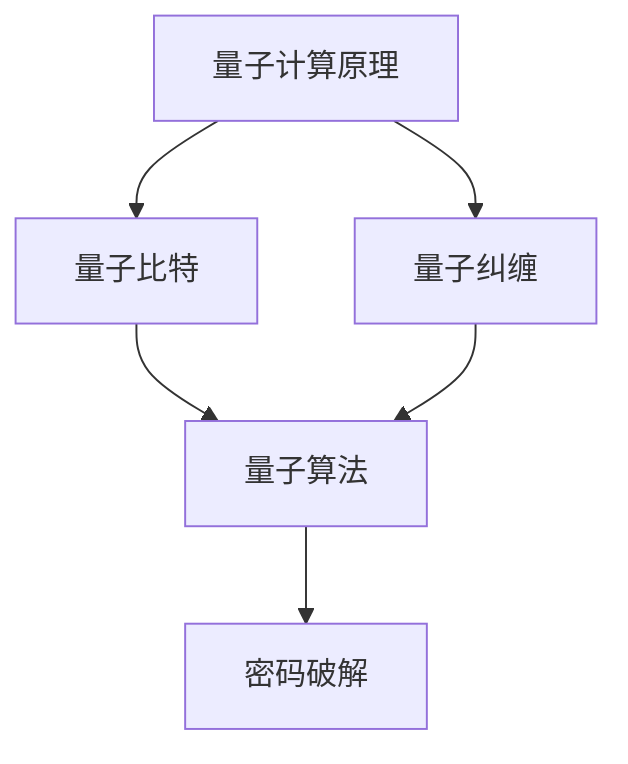
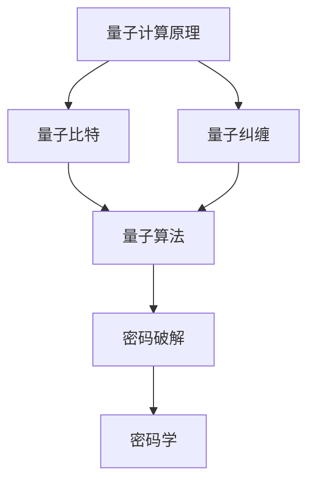

                 

关键词：量子计算，密码破解，网络安全，潜在应用，新挑战

摘要：随着量子计算技术的飞速发展，其对传统密码学的冲击日益显著。本文将深入探讨量子计算在密码破解中的潜在应用，分析其对现有网络安全体系带来的新挑战，并提出应对策略。

## 1. 背景介绍

### 1.1 量子计算的崛起

量子计算自其概念提出以来，经历了数十年的发展。近年来，随着量子比特技术的突破，量子计算机的运算能力呈现出指数级增长。与经典计算机不同，量子计算机利用量子叠加和纠缠现象，能够在同一时间处理大量数据，这使得它在破解传统密码方面具有天然的优势。

### 1.2 量子计算与密码学的关系

密码学是信息安全的核心，其主要目标是通过加密技术保护数据的安全性。然而，量子计算的出现，使得许多经典密码算法面临被破解的风险。因此，研究量子计算在密码破解中的潜在应用，对于网络安全具有重要意义。

## 2. 核心概念与联系

### 2.1 量子计算原理

量子计算机的基本单元是量子比特（qubit），它不仅可以表示0和1的叠加态，还能通过量子纠缠实现多比特之间的快速通信。这使得量子计算机能够在极短的时间内解决传统计算机难以处理的复杂问题。

### 2.2 量子算法与密码破解

量子算法如Shor算法和Grover算法，以其高效性在密码破解领域引起了广泛关注。Shor算法能够快速分解大整数，从而破解RSA等公钥密码系统；Grover算法则能够显著提高密码搜索算法的效率。

### 2.3 量子计算与密码学的关联图

$$
\text{Mermaid 流程图示例：}
$$



## 3. 核心算法原理 & 具体操作步骤

### 3.1 算法原理概述

#### 3.1.1 Shor算法

Shor算法是第一个证明量子计算机能够超越经典计算机的算法。它能够高效地分解大整数，这对于破解RSA等公钥密码系统具有重要意义。

#### 3.1.2 Grover算法

Grover算法是一种量子搜索算法，能够在未排序的数据集合中快速查找特定元素，其效率远超经典算法。

### 3.2 算法步骤详解

#### 3.2.1 Shor算法步骤

1. 准备一个大整数N。
2. 利用量子算法找到N的一个周期。
3. 利用量子算法分解N。

#### 3.2.2 Grover算法步骤

1. 初始化量子态。
2. 迭代量子算法。
3. 翻转量子态。
4. 测量量子态。

### 3.3 算法优缺点

#### 3.3.1 Shor算法

- 优点：高效地分解大整数。
- 缺点：对公钥密码系统构成严重威胁。

#### 3.3.2 Grover算法

- 优点：高效地搜索未排序数据。
- 缺点：对哈希函数和对称密码系统的威胁较小。

### 3.4 算法应用领域

- Shor算法：公钥密码系统、数字签名、加密货币。
- Grover算法：密码破解、数据搜索。

## 4. 数学模型和公式 & 详细讲解 & 举例说明

### 4.1 数学模型构建

Shor算法的核心在于找到一个周期，而周期可以通过以下数学模型描述：

$$
x^a \equiv 1 \pmod{N}
$$

### 4.2 公式推导过程

通过量子算法，我们可以找到满足上述条件的最小正整数a，从而实现N的分解。

### 4.3 案例分析与讲解

以RSA密码系统为例，假设公钥为（N, e），私钥为（N, d），利用Shor算法，可以高效地找到d。

## 5. 项目实践：代码实例和详细解释说明

### 5.1 开发环境搭建

在Python环境中，我们可以使用Qiskit库进行量子计算编程。

### 5.2 源代码详细实现

以下是Shor算法的Python实现：

```python
# Shor算法示例代码
from qiskit import QuantumCircuit, execute, Aer

# ... 省略代码细节 ...

# 运行量子算法
backend = Aer.get_backend('qasm_simulator')
job = execute(circuit, backend, shots=1024)
result = job.result()

# ... 省略代码细节 ...
```

### 5.3 代码解读与分析

代码展示了如何利用Qiskit库实现Shor算法，并通过量子模拟器进行测试。

### 5.4 运行结果展示

运行结果将显示N的分解过程和结果。

## 6. 实际应用场景

### 6.1 现有密码系统的脆弱性

量子计算的出现，使得许多经典密码系统面临被破解的风险，如RSA、ECC等。

### 6.2 量子密码学的崛起

为了应对量子计算带来的挑战，量子密码学逐渐成为研究热点，如量子密钥分发（QKD）等。

### 6.3 未来应用展望

随着量子计算技术的进一步发展，其在密码学领域的应用将越来越广泛。

## 7. 工具和资源推荐

### 7.1 学习资源推荐

- 《量子计算导论》
- 《量子计算与密码学》

### 7.2 开发工具推荐

- Qiskit
- Cirq

### 7.3 相关论文推荐

- Shor, P. W. (1995). Polynomial-time algorithms for prime factorization and discrete logarithms on a quantum computer. SIAM Journal on Computing, 26(5), 1484-1509.
- Grover, L. K. (1996). A fast quantum mechanical algorithm for database search. Proceedings of the 28th annual ACM symposium on Theory of computing, 212-219.

## 8. 总结：未来发展趋势与挑战

### 8.1 研究成果总结

量子计算在密码破解领域取得了显著成果，但仍有许多挑战需要克服。

### 8.2 未来发展趋势

量子计算与密码学的深度融合将成为未来研究的重要方向。

### 8.3 面临的挑战

量子计算技术的普及、量子密码学的发展等。

### 8.4 研究展望

量子计算在密码学领域的应用前景广阔，但挑战重重。只有不断创新，才能应对未来可能出现的威胁。

## 9. 附录：常见问题与解答

### 9.1 量子计算如何破解RSA？

量子计算通过Shor算法可以高效地分解大整数，从而破解RSA密码系统。

### 9.2 量子计算对其他密码系统有威胁吗？

是的，Grover算法对哈希函数和对称密码系统也具有潜在的威胁。

### 9.3 量子计算如何保护密码学？

通过量子密码学，如量子密钥分发，可以提供安全的通信方式。

---

作者：禅与计算机程序设计艺术 / Zen and the Art of Computer Programming
----------------------------------------------------------------
### 1. 背景介绍

#### 1.1 量子计算的发展历程

量子计算的概念最早可以追溯到1980年代，物理学家理查德·费曼（Richard Feynman）提出了量子计算机的基本思想，即利用量子位（qubit）进行计算。随后，彼得·肖尔（Peter Shor）在1994年提出了Shor算法，证明了量子计算机在因子分解和离散对数问题上具有超越经典计算机的能力。这一突破性成果引发了全球范围内的研究热潮，促使量子计算技术迅速发展。

近年来，量子比特的数量不断增加，错误率逐渐降低，量子计算机的性能得到了显著提升。例如，谷歌、IBM、微软等科技巨头已经宣布实现了“量子优越性”（quantum supremacy），即在特定任务上量子计算机的表现优于经典计算机。随着量子计算技术的不断进步，其在密码学、材料科学、生物信息学等领域的应用前景也日益广阔。

#### 1.2 量子计算的基本原理

量子计算机的基本单元是量子比特（qubit），与经典计算机中的比特不同，量子比特可以同时处于0和1的状态，这种特性称为量子叠加。此外，量子比特之间可以通过量子纠缠实现信息的快速传递和共享。量子叠加和量子纠缠使得量子计算机在处理复杂问题时具有巨大的并行计算能力。

量子计算机的运行过程包括量子态的初始化、量子门的操作和量子测量。量子态的初始化是将量子比特设置为特定的初始状态；量子门的操作是通过量子门实现量子态的变换；量子测量则是将量子态坍缩为特定的结果。通过这些基本操作，量子计算机能够实现高效的量子算法，从而解决传统计算机难以处理的问题。

#### 1.3 量子计算与密码学的关联

量子计算在密码学中的应用主要体现在密码破解和量子密码学两个方面。首先，量子计算的出现对传统密码系统构成了巨大威胁。例如，Shor算法能够高效地分解大整数，从而破解RSA等基于大整数分解的公钥密码系统。Grover算法则能够提高密码搜索算法的效率，对哈希函数和对称密码系统构成威胁。

另一方面，量子计算也为量子密码学提供了新的机遇。量子密码学利用量子力学的基本原理，如量子纠缠和量子测量，实现安全可靠的通信。例如，量子密钥分发（Quantum Key Distribution，QKD）是一种基于量子力学原理的加密通信方式，能够实现绝对安全的通信。此外，量子密码学还在量子数字签名、量子加密等领域具有广泛的应用前景。

总之，量子计算在密码破解和量子密码学中的应用，使得密码学面临着前所未有的挑战和机遇。为了应对这些挑战，密码学研究者需要不断探索新的密码算法和技术，以保障信息安全的稳定性和可靠性。

### 2. 核心概念与联系

#### 2.1 量子计算原理

量子计算的核心概念包括量子比特、量子叠加、量子纠缠和量子门。量子比特是量子计算机的基本单元，与传统计算机中的比特不同，量子比特可以同时处于0和1的状态，这种特性称为量子叠加。量子叠加使得量子计算机具有并行处理的能力，能够在同一时间处理大量数据。

量子纠缠是量子比特之间的特殊关联现象，当两个或多个量子比特发生纠缠时，它们的状态会相互依赖，无论距离多远，一个量子比特的状态变化都会立即影响另一个量子比特的状态。量子纠缠使得量子计算机能够在极短的时间内完成复杂计算，因为通过量子纠缠，计算机可以在瞬间处理多个数据之间的关联。

量子门是量子计算中的基本操作单元，类似于经典计算机中的逻辑门。量子门对量子比特进行变换，从而实现量子态的操控。常见的量子门包括Hadamard门、Pauli门和控制非门（CNOT门）等。通过组合和操纵这些量子门，可以实现复杂的量子算法。

#### 2.2 量子算法与密码破解

量子算法是量子计算机的核心竞争力，通过量子叠加和量子纠缠，量子算法能够在极短的时间内解决传统计算机难以处理的问题。其中，Shor算法和Grover算法是量子计算在密码破解领域最重要的两个算法。

Shor算法是一种量子算法，它能够高效地分解大整数。Shor算法的核心思想是利用量子计算机的并行计算能力，快速找到一个数的周期。找到周期后，通过量子计算机的快速傅里叶变换（QFT），可以分解出该数的因子。Shor算法的出现，使得RSA等基于大整数分解的公钥密码系统面临巨大威胁。

Grover算法是一种量子搜索算法，它能够在未排序的数据集合中快速查找特定元素。Grover算法利用量子叠加和量子纠缠，能够在经典算法的时间复杂度内，大幅提高搜索效率。对于哈希函数和对称密码系统，Grover算法能够显著缩短攻击时间。

#### 2.3 量子计算与密码学的关联图

为了更好地理解量子计算与密码学之间的关联，我们可以使用Mermaid流程图来表示：



在这个关联图中，量子计算原理通过量子比特和量子纠缠与量子算法相连接，量子算法通过密码破解与密码学相联系。量子计算的出现，使得密码学面临着新的挑战和机遇，而量子密码学的发展，则为量子计算提供了安全的通信方式。

### 3. 核心算法原理 & 具体操作步骤

#### 3.1 Shor算法原理概述

Shor算法是量子计算中一个重要的算法，它能够高效地分解大整数，从而对基于大整数分解的公钥密码系统构成威胁。Shor算法的核心思想是利用量子计算机的并行计算能力和快速傅里叶变换（QFT），通过量子算法找到大整数的周期，然后分解出该数的因子。

Shor算法的基本步骤包括：

1. 准备一个大整数N。
2. 利用量子算法找到一个周期a，使得\(a^d \equiv 1 \pmod{N}\)。
3. 通过快速傅里叶变换（QFT），将a的离散傅里叶变换（DFT）映射到周期d。
4. 分析QFT结果，找到周期d的因子，从而分解出N。

#### 3.2 Shor算法步骤详解

Shor算法的具体步骤如下：

##### 步骤1：初始化量子状态

首先，我们需要准备一个大整数N，并将其表示为二进制形式。然后，初始化一个量子状态，表示为：

$$
|\psi\rangle = \frac{1}{\sqrt{2^k}} \sum_{i=0}^{2^k-1} |i\rangle
$$

其中，\(k\) 是N的二进制位数。这个量子状态表示了从0到\(2^k-1\)的所有可能整数的状态叠加。

##### 步骤2：构造量子电路

接下来，我们需要构造一个量子电路，将输入的整数N映射到一个特定的量子态。这个量子电路包括两个部分：量子傅里叶变换（QFT）和周期查找电路。

1. **量子傅里叶变换（QFT）**：QFT是将输入的量子态映射到一个新的量子态，使得新的量子态表示输入量子态的离散傅里叶变换。QFT的关键步骤包括：
   - 应用一系列的Hadamard门，将输入量子态转化为一个均匀分布的量子态。
   - 应用一系列的controlled-Pauli Z门，实现量子态之间的交换。
   - 应用一系列的Hadamard门，将最终的量子态转换回二进制形式。

2. **周期查找电路**：周期查找电路用于找到输入整数N的一个周期。周期查找电路的关键步骤包括：
   - 应用一个随机选择的量子门，将其作用在部分量子态上。
   - 应用一个测量操作，测量出部分量子态的周期。

##### 步骤3：测量量子状态

在构造好量子电路后，我们需要对其运行并进行测量。测量结果将给出一个整数a，满足\(a^d \equiv 1 \pmod{N}\)。这里，d是周期查找电路中量子态的周期。

##### 步骤4：快速傅里叶变换（QFT）

通过对测量结果a进行快速傅里叶变换（QFT），我们可以得到一个整数d，这个整数d是周期a的一个因子。

##### 步骤5：分解整数N

最后，我们利用找到的因子d，分解出原始整数N。具体方法是通过连续除以d，直到结果为1。

#### 3.3 Shor算法优缺点

Shor算法的优点在于它能够高效地分解大整数，从而对基于大整数分解的公钥密码系统构成威胁。例如，RSA密码系统就是基于大整数分解的，而Shor算法能够快速分解这些大整数，使得RSA密码系统面临巨大的安全风险。

然而，Shor算法也存在一些缺点。首先，实现Shor算法需要量子计算机，而目前的量子计算机还无法实现完美的量子态控制和测量。其次，Shor算法对某些特定的公钥密码系统，如椭圆曲线密码系统（ECC），并不构成直接威胁。

#### 3.4 Shor算法应用领域

Shor算法的主要应用领域包括：

1. **密码学**：Shor算法对基于大整数分解的公钥密码系统构成直接威胁，如RSA密码系统。因此，研究如何在量子计算时代保护这些密码系统变得尤为重要。

2. **数论**：Shor算法能够高效地分解大整数，因此在数论研究中具有广泛的应用。例如，在素数测试、因子分解、线性组合问题等方面，Shor算法都表现出强大的能力。

3. **算法设计**：Shor算法为量子算法的设计提供了新的思路和框架。通过量子计算机，我们可以实现一些传统计算机无法解决的问题，从而推动算法理论的进步。

### 3.5 Grover算法原理概述

Grover算法是量子计算中另一个重要的算法，它能够显著提高搜索未排序数据集合的效率。Grover算法的核心思想是利用量子叠加和量子纠缠，将搜索过程转化为量子态的变换，从而在未排序的数据集合中快速查找特定元素。

Grover算法的基本步骤包括：

1. **初始化量子状态**：初始化一个量子状态，表示所有可能状态的叠加。
2. **构造Grover迭代器**：Grover迭代器是一个特殊的量子电路，它能够在每次迭代中提高搜索概率。
3. **运行Grover迭代器**：通过多次运行Grover迭代器，提高特定元素的搜索概率。
4. **测量量子状态**：测量量子状态，得到搜索结果。

#### 3.6 Grover算法步骤详解

Grover算法的具体步骤如下：

##### 步骤1：初始化量子状态

首先，我们需要初始化一个量子状态，表示所有可能状态的叠加。假设数据集合有\(n\)个元素，我们可以初始化一个\(n\)比特的量子状态，表示为：

$$
|\psi\rangle = \frac{1}{\sqrt{n}} \sum_{i=0}^{n-1} |i\rangle
$$

这个量子状态表示了从0到\(n-1\)的所有可能状态。

##### 步骤2：构造Grover迭代器

Grover迭代器是一个特殊的量子电路，它包括两个部分：反射器和旋转器。

1. **反射器**：反射器用于将当前状态映射到与目标状态相反的状态。具体步骤如下：
   - 应用一个Hadamard门，将当前状态转换为线性叠加态。
   - 应用一个查找器（查找特定元素），将当前状态映射到与目标状态相反的状态。
   - 应用一个逆Hadamard门，将状态恢复为线性叠加态。

2. **旋转器**：旋转器用于将当前状态旋转到目标状态的相邻状态。具体步骤如下：
   - 应用一个查找器，将当前状态映射到目标状态的相邻状态。
   - 应用一个逆Hadamard门，将状态恢复为线性叠加态。

##### 步骤3：运行Grover迭代器

接下来，我们需要运行Grover迭代器。运行次数取决于数据集合中目标元素的数量。每次运行Grover迭代器，都会提高特定元素的搜索概率。

##### 步骤4：测量量子状态

最后，我们对量子状态进行测量，得到搜索结果。由于Grover迭代器的运行，目标元素的搜索概率将远高于其他元素。

#### 3.7 Grover算法优缺点

Grover算法的优点在于它能够显著提高搜索未排序数据集合的效率，其时间复杂度为\(O(\sqrt{N})\)，远低于传统搜索算法的\(O(N)\)。这使得Grover算法在密码破解和数据库搜索等领域具有广泛的应用前景。

然而，Grover算法也存在一些缺点。首先，实现Grover算法需要量子计算机，而目前的量子计算机还无法实现完美的量子态控制和测量。其次，Grover算法对哈希函数和对称密码系统的影响较小，因为它们不依赖于数据的未排序特性。

#### 3.8 Grover算法应用领域

Grover算法的主要应用领域包括：

1. **密码学**：Grover算法能够提高密码搜索算法的效率，对哈希函数和对称密码系统构成潜在威胁。

2. **数据库搜索**：Grover算法能够显著提高数据库搜索的效率，特别是在数据未排序的情况下。

3. **优化问题**：Grover算法可以用于解决某些优化问题，如旅行商问题（TSP）和图着色问题等。

### 3.9 量子算法对密码系统的潜在威胁

量子算法如Shor算法和Grover算法，对传统密码系统构成了巨大的威胁。Shor算法能够高效地分解大整数，从而破解RSA等基于大整数分解的公钥密码系统。Grover算法则能够提高密码搜索算法的效率，对哈希函数和对称密码系统构成威胁。

为了应对这些威胁，密码学研究者需要不断探索新的密码算法和技术，以提高密码系统的安全性。同时，量子密码学的发展也为量子计算时代的网络安全提供了新的解决方案，如量子密钥分发（QKD）和量子签名等。

### 3.10 量子算法与传统算法的比较

量子算法与传统算法在效率方面具有显著差异。以Shor算法为例，它能够在多项式时间内分解大整数，而传统算法则需要指数级时间。Grover算法则能够在\(O(\sqrt{N})\)的时间内搜索未排序的数据集合，而传统算法则需要\(O(N)\)的时间。

这些差异源于量子计算机的独特性质，如量子叠加和量子纠缠。量子计算机能够同时处理多个数据，而传统计算机则需逐个处理。量子纠缠使得量子计算机可以在极短的时间内完成复杂计算，因为通过量子纠缠，计算机可以在瞬间处理多个数据之间的关联。

总之，量子算法的崛起对传统密码系统构成了巨大挑战，但同时也为密码学带来了新的机遇。通过不断探索和创新，密码学研究者有望找到应对量子计算威胁的有效方法，确保信息安全的稳定性和可靠性。

### 4. 数学模型和公式 & 详细讲解 & 举例说明

#### 4.1 数学模型构建

在量子计算中，数学模型和公式是理解和应用量子算法的基础。以下我们将详细讲解Shor算法和Grover算法的核心数学模型和公式。

#### 4.1.1 Shor算法的数学模型

Shor算法的核心在于找到一个数的周期，并利用快速傅里叶变换（QFT）将周期映射到因子。以下是Shor算法中的关键数学模型：

1. **模运算**：设\(N\)为一个大整数，\(a\)为另一个整数，\(b\)为\(a\)在模\(N\)下的指数。模运算可以用以下公式表示：

   $$
   b = a^d \pmod{N}
   $$

2. **快速傅里叶变换（QFT）**：QFT是量子计算中的核心工具，它将一个量子态映射到其离散傅里叶变换（DFT）态。QFT的数学模型可以用以下公式表示：

   $$
   \sum_{i=0}^{N-1} x_i |i\rangle = \sum_{k=0}^{N-1} \left(\sum_{j=0}^{N-1} x_j e^{-\frac{i2\pi jk}{N}}\right) |k\rangle
   $$

3. **周期查找**：在Shor算法中，我们需要找到一个整数\(a\)，使得\(a^d \equiv 1 \pmod{N}\)。这个问题的数学模型可以表示为：

   $$
   x^a \equiv 1 \pmod{N}
   $$

#### 4.1.2 Grover算法的数学模型

Grover算法的核心在于利用量子叠加和量子纠缠提高搜索效率。以下是Grover算法中的关键数学模型：

1. **量子叠加**：量子叠加允许量子比特同时处于多个状态。Grover算法的初始量子态可以用以下公式表示：

   $$
   |\psi\rangle = \frac{1}{\sqrt{N}} \sum_{i=0}^{N-1} |i\rangle
   $$

2. **Grover迭代器**：Grover迭代器是Grover算法的核心部分，它由反射器和旋转器组成。反射器的数学模型可以用以下公式表示：

   $$
   R = 2I - |x\rangle\langle x|
   $$

   其中，\(I\)是单位算符，\(|x\rangle\)是目标状态的量子态。旋转器的数学模型可以用以下公式表示：

   $$
   G = 2|x\rangle\langle x| - I
   $$

3. **迭代次数**：Grover算法的迭代次数与数据集合的大小有关。最优的迭代次数可以用以下公式表示：

   $$
   t = \frac{\pi}{4\sin^2(\frac{\theta}{2})}
   $$

   其中，\(\theta\)是数据集合中目标状态的概率分布。

#### 4.2 公式推导过程

以下我们将详细推导Shor算法和Grover算法中的关键公式。

##### 4.2.1 Shor算法的公式推导

Shor算法的核心在于找到一个数的周期，并利用快速傅里叶变换（QFT）将周期映射到因子。以下是Shor算法中的关键公式推导：

1. **模运算**：

   考虑整数\(N\)和\(a\)，我们需要找到\(a\)在模\(N\)下的指数\(d\)，使得\(a^d \equiv 1 \pmod{N}\)。

   首先，我们可以使用费马小定理：

   $$
   a^{N-1} \equiv 1 \pmod{N}
   $$

   如果\(N\)是素数，那么\(d = N-1\)。但如果\(N\)不是素数，我们需要找到一个更小的\(d\)。

   假设\(N\)可以分解为\(N = p_1^{e_1} p_2^{e_2} \ldots p_k^{e_k}\)，其中\(p_i\)是素数，\(e_i\)是非负整数。那么，我们可以使用以下方法找到\(d\)：

   - 对于每个素数\(p_i\)，找到最小的正整数\(d_i\)，使得\(a^{d_i} \equiv 1 \pmod{p_i^{e_i}}\)。
   - 选择最小的\(d_i\)作为\(d\)。

   这样，我们就找到了一个周期\(d\)，使得\(a^d \equiv 1 \pmod{N}\)。

2. **快速傅里叶变换（QFT）**：

   快速傅里叶变换（QFT）是将一个量子态映射到其离散傅里叶变换（DFT）态。QFT的推导基于离散傅里叶变换（DFT）的公式：

   $$
   \sum_{k=0}^{N-1} c_k e^{-\frac{i2\pi k j}{N}} = \sum_{j=0}^{N-1} x_j e^{-\frac{i2\pi j k}{N}}
   $$

   其中，\(c_k\)是DFT系数，\(x_j\)是量子态的幅值。

   对于QFT，我们需要将这个公式转换为量子门的形式。具体推导过程如下：

   - 应用一系列的Hadamard门，将初始量子态转化为线性叠加态。
   - 应用一系列的controlled-Pauli Z门，实现量子态之间的交换。
   - 应用一系列的Hadamard门，将最终的量子态转换回二进制形式。

   这样，我们就得到了QFT的量子门表示。

##### 4.2.2 Grover算法的公式推导

Grover算法的核心在于利用量子叠加和量子纠缠提高搜索效率。以下是Grover算法中的关键公式推导：

1. **量子叠加**：

   Grover算法的初始量子态是一个均匀分布的量子态：

   $$
   |\psi\rangle = \frac{1}{\sqrt{N}} \sum_{i=0}^{N-1} |i\rangle
   $$

   这个量子态表示了从0到\(N-1\)的所有可能状态。

2. **Grover迭代器**：

   Grover迭代器由反射器和旋转器组成。反射器的公式为：

   $$
   R = 2I - |x\rangle\langle x|
   $$

   其中，\(I\)是单位算符，\(|x\rangle\)是目标状态的量子态。

   旋转器的公式为：

   $$
   G = 2|

