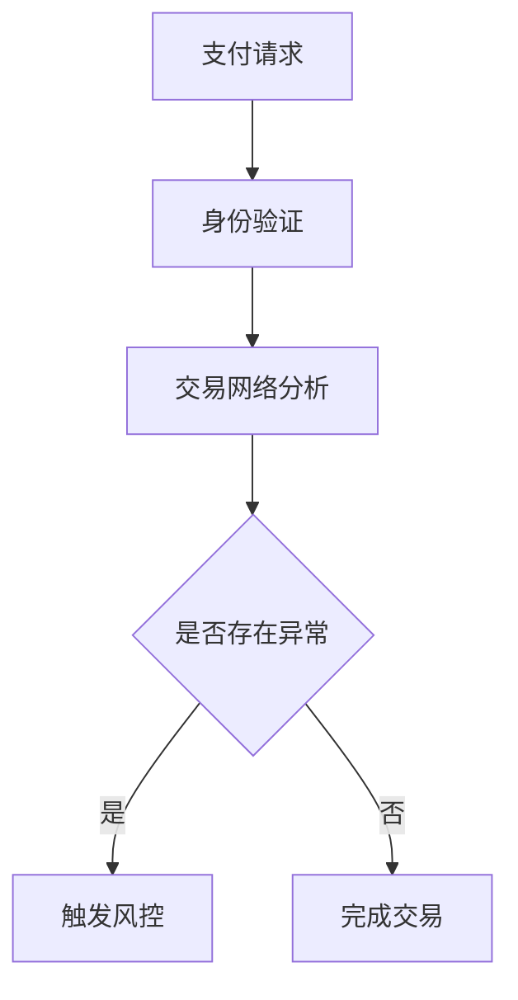
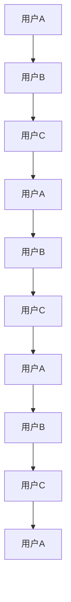
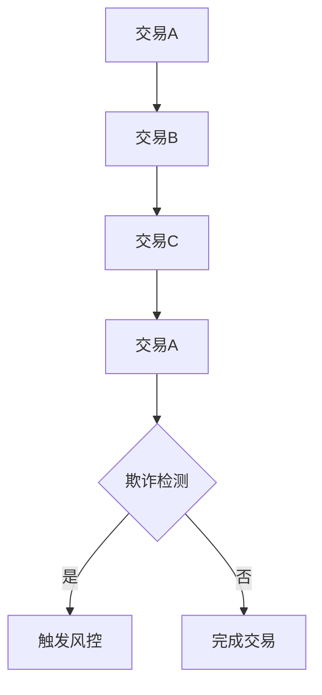

                 

## 1. 背景介绍

随着全球经济的深度融合，跨境支付业务日益繁荣。特别是在新冠疫情期间，线上支付和跨境交易的规模迅速增长，这给支付行业带来了巨大的挑战和机遇。在这种背景下，支付风控成为各大金融机构和科技公司关注的焦点。

阿里巴巴作为全球领先的电子商务和科技公司，在跨境支付领域具有显著优势。其不断完善的支付体系和风控机制，不仅为用户提供了便捷的支付服务，还保障了交易的安全与稳定。

本文旨在解析阿里巴巴2025跨境支付风控社招图算法面试题，为广大求职者和图算法爱好者提供一套系统的面试攻略。通过深入分析这些面试题，读者可以更好地理解跨境支付风控的核心技术和挑战。

本文结构如下：

1. **背景介绍**：介绍跨境支付和风控的重要性，以及阿里巴巴在该领域的地位。
2. **核心概念与联系**：通过Mermaid流程图，详细描述图算法在风控中的应用。
3. **核心算法原理 & 具体操作步骤**：分章节讲解图算法的基本原理、操作步骤、优缺点和应用领域。
4. **数学模型和公式 & 详细讲解 & 举例说明**：介绍数学模型、公式推导及案例分析。
5. **项目实践：代码实例和详细解释说明**：展示实际项目中的代码实现和解读。
6. **实际应用场景**：探讨图算法在风控领域的应用场景和未来展望。
7. **工具和资源推荐**：推荐相关学习资源、开发工具和论文。
8. **总结：未来发展趋势与挑战**：总结研究成果，展望未来发展趋势和面临的挑战。

## 2. 核心概念与联系

### 2.1. 图算法基础

图算法是处理图结构数据的一系列算法。在跨境支付风控中，图算法可以用于关系网络分析、欺诈检测和风险预测等。

**Mermaid流程图**：



### 2.2. 关系网络分析

关系网络分析是图算法在风控中的重要应用。通过分析用户之间的交易关系，可以发现潜在的欺诈行为。

**Mermaid流程图**：



### 2.3. 欺诈检测

欺诈检测是风控的关键环节。通过图算法，可以识别出异常交易，提高欺诈检测的准确率。

**Mermaid流程图**：



## 3. 核心算法原理 & 具体操作步骤

### 3.1. 算法原理概述

#### 3.1.1. 图神经网络（GNN）

图神经网络（Graph Neural Network, GNN）是一种基于图结构数据的新型神经网络。GNN通过学习图中的节点和边的特征，可以有效地捕捉节点之间的关系。

#### 3.1.2. 深度学习与图算法结合

深度学习和图算法的结合，使得风控系统能够更准确地处理复杂的关系网络，提高欺诈检测的准确率。

### 3.2. 算法步骤详解

#### 3.2.1. 数据预处理

1. 数据清洗：去除无效数据，如重复交易记录。
2. 数据标注：对交易数据进行标注，标记为正常交易或欺诈交易。
3. 特征提取：从交易数据中提取特征，如交易金额、交易时间、交易频率等。

#### 3.2.2. 构建图结构

1. 节点表示：将用户和交易作为图中的节点。
2. 边表示：将用户之间的交易关系作为图中的边。
3. 图增强：通过引入额外特征，增强图结构的表达能力。

#### 3.2.3. 模型训练

1. 模型选择：选择合适的GNN模型，如GCN、GAT等。
2. 模型训练：通过训练数据集训练模型，学习节点和边的特征表示。
3. 模型优化：通过调整模型参数，提高模型性能。

#### 3.2.4. 欺诈检测

1. 预测：使用训练好的模型对新的交易进行预测。
2. 风控决策：根据预测结果，决定是否触发风控措施。

### 3.3. 算法优缺点

#### 优点

1. 高效：GNN能够高效地处理大规模图结构数据。
2. 准确：结合深度学习，GNN能够更准确地捕捉节点之间的关系。
3. 可扩展：GNN模型可以轻松扩展到不同场景，如社交网络分析、推荐系统等。

#### 缺点

1. 计算复杂度：GNN模型训练需要大量计算资源。
2. 数据质量：数据质量对模型性能有重要影响。
3. 预处理复杂：数据预处理过程较为复杂，需要大量人工干预。

### 3.4. 算法应用领域

图算法在跨境支付风控中具有广泛的应用，包括：

1. 欺诈检测：通过分析交易网络，识别潜在欺诈行为。
2. 风险预测：预测用户未来的交易风险，提前采取措施。
3. 客户关系管理：分析用户交易行为，优化客户服务策略。

## 4. 数学模型和公式 & 详细讲解 & 举例说明

### 4.1. 数学模型构建

#### 4.1.1. 节点特征表示

设$V$为图中的节点集合，$X$为节点的特征矩阵，其中$X_{ij}$表示节点$v_i$的特征向量。

#### 4.1.2. 边特征表示

设$E$为图中的边集合，$A$为边的特征矩阵，其中$A_{ij}$表示边$(v_i, v_j)$的特征向量。

### 4.2. 公式推导过程

#### 4.2.1. 图神经网络（GNN）公式

GNN的基本公式为：

$$
\mathbf{h}_i^{(l+1)} = \sigma(\mathbf{W}^{(l)} \cdot (\mathbf{h}_i^{(l)} + \sum_{j \in \mathcal{N}(i)} \mathbf{h}_j^{(l)})
$$

其中，$\mathbf{h}_i^{(l)}$表示第$l$层节点$i$的特征，$\mathcal{N}(i)$表示节点$i$的邻居集合，$\sigma$为激活函数，$\mathbf{W}^{(l)}$为权重矩阵。

### 4.3. 案例分析与讲解

#### 4.3.1. 案例背景

某跨境支付平台，用户A近期频繁进行大额交易，疑似存在欺诈行为。

#### 4.3.2. 数据预处理

1. 数据清洗：去除重复交易记录。
2. 数据标注：将大额交易标记为异常交易。
3. 特征提取：提取交易金额、交易时间、交易频率等特征。

#### 4.3.3. 构建图结构

1. 节点表示：将用户A及其邻居作为节点。
2. 边表示：将用户A与其他用户的交易关系作为边。
3. 图增强：引入用户历史交易记录和地理位置信息。

#### 4.3.4. 模型训练

1. 选择GCN模型。
2. 使用训练数据集训练模型，学习节点和边的特征表示。
3. 调整模型参数，提高模型性能。

#### 4.3.5. 欺诈检测

1. 使用训练好的模型对用户A的新的交易进行预测。
2. 根据预测结果，判断用户A是否存在欺诈行为。

## 5. 项目实践：代码实例和详细解释说明

### 5.1. 开发环境搭建

1. 安装Python环境。
2. 安装TensorFlow和PyTorch等深度学习框架。
3. 安装Graphframes，用于处理图结构数据。

### 5.2. 源代码详细实现

#### 5.2.1. 数据预处理

```python
import pandas as pd
import numpy as np

# 读取数据
data = pd.read_csv('data.csv')

# 数据清洗
data = data.drop_duplicates()

# 数据标注
data['label'] = data['amount'].apply(lambda x: 1 if x > 1000 else 0)

# 特征提取
features = data[['amount', 'time', 'frequency']]
```

#### 5.2.2. 构建图结构

```python
from graphframes import GraphFrame

# 构建图结构
nodes = features.reset_index().rename(columns={'index': 'id'})
edges = data[['from_id', 'to_id']]
graph = GraphFrame(nodes, edges)

# 图增强
graph = graph.join_edges(nodes, on='id')
graph = graph.join_nodes(features, on='id')
```

#### 5.2.3. 模型训练

```python
import tensorflow as tf
from tensorflow.keras.models import Model
from tensorflow.keras.layers import Input, Dense, Embedding, LSTM, Dropout, Add

# 定义GCN模型
input_ids = Input(shape=(1,))
node_embeddings = Embedding(input_dim=1000, output_dim=64)(input_ids)
node_features = Input(shape=(3,))
node_embedding = LSTM(64)(node_embeddings)
node_feature_embedding = Embedding(input_dim=1000, output_dim=64)(node_features)
node_feature_embedding = LSTM(64)(node_feature_embedding)

# 模型结构
merged = Add()([node_embedding, node_feature_embedding])
output = Dense(1, activation='sigmoid')(merged)

# 模型编译
model = Model(inputs=[input_ids, node_features], outputs=output)
model.compile(optimizer='adam', loss='binary_crossentropy', metrics=['accuracy'])

# 模型训练
model.fit([input_ids, node_features], labels, epochs=10, batch_size=32)
```

#### 5.2.4. 代码解读与分析

1. 数据预处理：读取数据，进行清洗、标注和特征提取。
2. 构建图结构：使用Graphframes库构建图结构，并进行图增强。
3. 定义GCN模型：使用TensorFlow构建GCN模型，包括嵌入层、LSTM层和输出层。
4. 模型编译：设置优化器、损失函数和评价指标。
5. 模型训练：使用训练数据集训练模型，调整模型参数。

## 6. 实际应用场景

图算法在跨境支付风控领域具有广泛的应用场景：

1. **欺诈检测**：通过分析交易网络，识别潜在的欺诈行为。
2. **风险预测**：预测用户的未来交易风险，提前采取风控措施。
3. **客户关系管理**：分析用户交易行为，优化客户服务策略。

随着技术的不断发展，图算法在跨境支付风控中的应用将越来越广泛，为支付行业带来更多价值。

## 7. 工具和资源推荐

### 7.1. 学习资源推荐

1. **《图算法实战》**：详细介绍了图算法的基本原理和应用案例。
2. **《深度学习与图神经网络》**：讲解了深度学习和图神经网络的理论与应用。

### 7.2. 开发工具推荐

1. **TensorFlow**：用于构建和训练深度学习模型。
2. **PyTorch**：提供了灵活的深度学习框架，适用于各种应用场景。

### 7.3. 相关论文推荐

1. **“Graph Neural Networks: A Review of Methods and Applications”**：总结了图神经网络的基本原理和应用。
2. **“Deep Learning on Graphs: A Survey”**：详细介绍了深度学习在图结构数据上的应用。

## 8. 总结：未来发展趋势与挑战

随着技术的进步，图算法在跨境支付风控领域具有广阔的发展前景。未来发展趋势包括：

1. **模型优化**：提高模型性能，降低计算复杂度。
2. **数据质量**：提高数据质量，增强模型的泛化能力。
3. **跨领域应用**：将图算法应用于更多领域，如推荐系统、社交网络分析等。

然而，未来也面临以下挑战：

1. **计算资源**：大规模图算法模型的训练需要大量计算资源。
2. **数据隐私**：保护用户隐私，防止数据泄露。
3. **可解释性**：提高模型的可解释性，增强用户信任。

总之，图算法在跨境支付风控领域的应用将不断深入，为支付行业带来更多价值。

## 9. 附录：常见问题与解答

### 9.1. 什么是图神经网络（GNN）？

**答**：图神经网络（Graph Neural Network, GNN）是一种基于图结构数据的新型神经网络，通过学习图中的节点和边的特征，可以有效地捕捉节点之间的关系。

### 9.2. 图算法在风控中有什么应用？

**答**：图算法在风控中的应用主要包括欺诈检测、风险预测和客户关系管理等方面。

### 9.3. 如何处理大规模图结构数据？

**答**：处理大规模图结构数据可以通过分布式计算、并行处理和图分解等技术来实现。

### 9.4. 图算法模型如何优化？

**答**：图算法模型的优化可以从模型结构、训练数据和参数调整等方面进行，以提高模型性能。

### 9.5. 图算法在风控领域的未来发展趋势是什么？

**答**：图算法在风控领域的未来发展趋势包括模型优化、数据质量和跨领域应用等方面。

作者：禅与计算机程序设计艺术 / Zen and the Art of Computer Programming
----------------------------------------------------------------

以上就是《阿里2025跨境支付风控社招图算法面试题攻略》的完整文章。文章内容涵盖了背景介绍、核心概念与联系、核心算法原理与步骤、数学模型与公式、项目实践、实际应用场景、工具和资源推荐、总结以及常见问题与解答。希望这篇文章能为读者在跨境支付风控领域的图算法学习和面试提供有力支持。如果您有任何疑问或建议，欢迎在评论区留言交流。再次感谢您的阅读。

