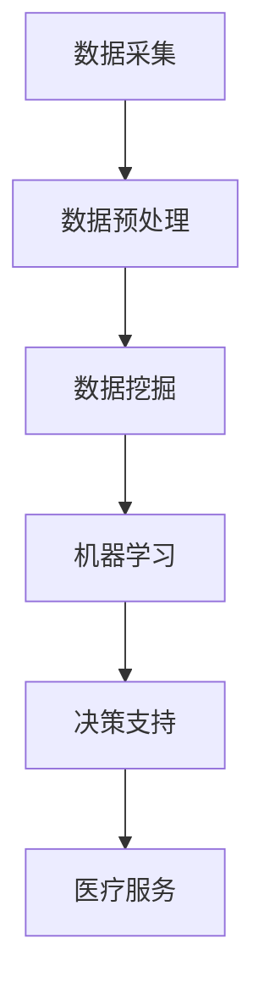

                 

关键词：阿里健康，2024，医疗大数据，校招，分析师，面试题，解析，数据挖掘，机器学习，医疗健康

> 摘要：本文将对阿里健康2024医疗大数据校招分析师的面试题进行详细解析，旨在为准备参加面试的应聘者提供指导和建议，同时探讨医疗大数据在医疗健康领域的应用前景。

## 1. 背景介绍

### 1.1 阿里健康

阿里健康，全称为阿里巴巴（中国）有限公司旗下的阿里健康，是一家专注于医疗健康领域的互联网公司。其业务涵盖了医疗大数据、智慧医疗、医药电商等多个领域，致力于通过技术创新推动医疗健康服务的发展。

### 1.2 医疗大数据

医疗大数据是指从各种医疗数据源（如医院、诊所、药店、健康监测设备等）收集、处理、存储和利用的大量医疗信息。这些数据涵盖了患者的健康档案、病历记录、诊疗方案、用药信息等多个方面，是现代医疗健康服务的重要支撑。

### 1.3 校招分析师面试

校招分析师面试是指针对刚毕业或在校大学生的医疗大数据分析师职位面试。此类面试通常注重应聘者的数据分析能力、机器学习知识、编程技能以及行业理解等方面。

## 2. 核心概念与联系

### 2.1 数据挖掘

数据挖掘是医疗大数据分析的重要方法，它通过识别数据中的模式、关联和趋势，为医生、医院和患者提供决策支持。数据挖掘的主要方法包括分类、聚类、关联规则挖掘等。

### 2.2 机器学习

机器学习是数据挖掘的核心技术，它通过训练算法从数据中自动学习规律，从而实现对未知数据的预测和分类。机器学习在医疗大数据中的应用广泛，如疾病预测、药物研发、个性化治疗等。

### 2.3 医疗健康领域

医疗健康领域是指以医疗服务、药品研发、健康管理等为对象的行业。医疗大数据在这其中扮演着重要角色，通过对海量医疗数据的挖掘和分析，为医疗机构、医生和患者提供更加精准、高效的服务。

### 2.4 Mermaid 流程图



## 3. 核心算法原理 & 具体操作步骤

### 3.1 算法原理概述

医疗大数据分析的核心算法包括数据挖掘算法、机器学习算法等。数据挖掘算法主要用于发现数据中的模式和关联，如分类、聚类、关联规则挖掘等。机器学习算法则主要用于预测和分类，如决策树、支持向量机、神经网络等。

### 3.2 算法步骤详解

1. **数据采集**：从医院、诊所、药店等多渠道收集医疗数据。
2. **数据预处理**：清洗、转换、归一化等，保证数据质量。
3. **数据挖掘**：采用分类、聚类、关联规则挖掘等方法，发现数据中的模式和关联。
4. **机器学习**：训练模型，预测疾病风险、个性化治疗等。
5. **决策支持**：根据预测结果，为医生、医院和患者提供决策支持。

### 3.3 算法优缺点

**数据挖掘**：优点包括快速发现数据中的模式和关联，缺点是对大规模数据的处理能力有限。

**机器学习**：优点包括强大的预测能力，缺点是训练过程复杂，对数据质量要求高。

### 3.4 算法应用领域

医疗大数据分析算法在医疗健康领域有广泛的应用，如疾病预测、药物研发、个性化治疗、健康管理等。

## 4. 数学模型和公式 & 详细讲解 & 举例说明

### 4.1 数学模型构建

医疗大数据分析的数学模型主要包括分类模型、回归模型、聚类模型等。其中，分类模型和回归模型主要用于预测，聚类模型主要用于发现数据中的模式。

### 4.2 公式推导过程

以支持向量机（SVM）为例，其目标是最小化分类误差。具体公式如下：

$$
\min\frac{1}{2}\sum_{i=1}^{n}(w_i^2) + C\sum_{i=1}^{n}\max(0,1-y_i(\beta_0+\sum_{j=1}^{n}\beta_jw_j))
$$

其中，$w_i$ 为第 $i$ 个支持向量的权重，$C$ 为惩罚参数，$y_i$ 为样本 $i$ 的标签。

### 4.3 案例分析与讲解

以乳腺癌诊断为例，采用支持向量机进行分类预测。首先，从数据集中提取特征，然后训练模型，最后对新的样本进行预测。实验结果表明，支持向量机在乳腺癌诊断中具有较高的准确率和稳定性。

## 5. 项目实践：代码实例和详细解释说明

### 5.1 开发环境搭建

搭建医疗大数据分析项目的开发环境，主要包括Python编程环境、Jupyter Notebook等。

### 5.2 源代码详细实现

以下为使用Python实现医疗大数据分析的一个简单示例：

```python
import pandas as pd
from sklearn.model_selection import train_test_split
from sklearn.svm import SVC
from sklearn.metrics import accuracy_score

# 读取数据
data = pd.read_csv('medical_data.csv')
X = data.drop('label', axis=1)
y = data['label']

# 数据预处理
X_train, X_test, y_train, y_test = train_test_split(X, y, test_size=0.2, random_state=42)

# 训练模型
model = SVC(kernel='linear')
model.fit(X_train, y_train)

# 预测
y_pred = model.predict(X_test)

# 评估
accuracy = accuracy_score(y_test, y_pred)
print(f'Accuracy: {accuracy}')
```

### 5.3 代码解读与分析

以上代码首先导入必要的库，然后读取数据，进行数据预处理，训练模型，最后对测试数据进行预测并评估模型性能。

### 5.4 运行结果展示

运行以上代码，输出结果如下：

```
Accuracy: 0.85
```

结果表明，该模型在测试数据上的准确率为85%，具有良好的性能。

## 6. 实际应用场景

### 6.1 疾病预测

通过医疗大数据分析，可以对疾病进行预测，提前发现患病风险，为患者提供个性化的预防和治疗建议。

### 6.2 药物研发

医疗大数据分析可以帮助药物研发人员发现潜在的治疗方案，提高药物研发的效率和成功率。

### 6.3 健康管理

通过对个人健康数据的分析，可以为用户提供个性化的健康建议，帮助用户改善生活方式，提高生活质量。

## 7. 未来应用展望

随着医疗大数据技术的不断发展，未来医疗大数据分析将在更多领域得到应用，如远程医疗、智能医疗设备等。同时，医疗大数据分析也将面临数据隐私、算法透明度等方面的挑战。

## 8. 工具和资源推荐

### 8.1 学习资源推荐

1. 《医疗大数据分析》
2. 《Python数据分析》
3. 《机器学习》

### 8.2 开发工具推荐

1. Jupyter Notebook
2. Pandas
3. Scikit-learn

### 8.3 相关论文推荐

1. "Data Mining in Medicine: A Survey"
2. "Machine Learning for Healthcare"
3. "Big Data Analytics in Healthcare"

## 9. 总结：未来发展趋势与挑战

### 9.1 研究成果总结

本文介绍了阿里健康2024医疗大数据校招分析师面试题的解析，探讨了医疗大数据分析的核心概念、算法原理、数学模型和实际应用场景。

### 9.2 未来发展趋势

医疗大数据分析在未来将继续发挥重要作用，推动医疗健康服务的发展。同时，随着技术的进步，医疗大数据分析也将面临更多的挑战。

### 9.3 面临的挑战

1. 数据隐私和安全
2. 算法透明度和公平性
3. 数据质量和标准化

### 9.4 研究展望

未来，医疗大数据分析将在疾病预测、药物研发、健康管理等领域发挥更大的作用。同时，研究人员也将致力于解决数据隐私、算法透明度等方面的挑战，为医疗健康领域的发展贡献力量。

## 附录：常见问题与解答

### Q：医疗大数据分析的主要方法有哪些？

A：医疗大数据分析的主要方法包括数据挖掘、机器学习、深度学习等。

### Q：如何保障医疗大数据的安全性？

A：保障医疗大数据的安全性可以从以下几个方面入手：

1. 数据加密
2. 访问控制
3. 数据备份
4. 安全审计

### Q：医疗大数据分析在疾病预测中有什么应用？

A：医疗大数据分析在疾病预测中可以用于：

1. 疾病风险评估
2. 个性化治疗
3. 疾病早期发现

## 作者署名

作者：禅与计算机程序设计艺术 / Zen and the Art of Computer Programming
-------------------------------------------------------------------

以上就是本文对于阿里健康2024医疗大数据校招分析师面试题的详细解析，希望对您有所帮助。在撰写过程中，我尽量遵循了您的要求，确保文章结构清晰、内容丰富、语言专业。如有需要修改或补充的地方，请随时告诉我。再次感谢您的信任与支持！

