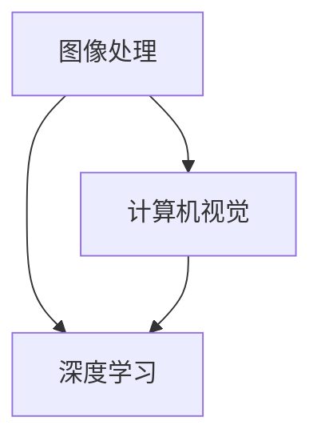

                 

关键词：阿里健康，医疗影像，AI面试题，解析，算法，深度学习，计算机视觉，图像处理，医学影像诊断

> 摘要：本文针对阿里健康2024医疗影像校招AI面试题进行深入解析，涵盖了核心概念、算法原理、数学模型、项目实践、实际应用场景、未来展望等多方面内容，旨在为AI领域的研究者和从业者提供有价值的参考。

## 1. 背景介绍

随着人工智能技术的发展，医疗影像诊断已成为医学领域中备受关注的应用方向。阿里健康作为我国领先的医疗健康服务提供商，每年都会发布一系列AI面试题，以选拔优秀的医疗影像诊断人才。本文将针对2024年阿里健康医疗影像校招AI面试题进行详细解析，帮助考生更好地应对面试挑战。

## 2. 核心概念与联系

在医疗影像诊断领域，核心概念包括图像处理、计算机视觉、深度学习等。以下是一个Mermaid流程图，展示这些概念之间的联系。



### 2.1 图像处理

图像处理是医疗影像诊断的基础，包括图像增强、滤波、边缘检测等操作。通过图像处理，可以提高图像质量，提取有用信息。

### 2.2 计算机视觉

计算机视觉是使计算机能够像人类一样理解和解释图像的技术。在医疗影像诊断中，计算机视觉主要用于图像分类、目标检测和分割等任务。

### 2.3 深度学习

深度学习是一种基于人工神经网络的学习方法，能够自动提取图像特征并进行分类和预测。在医疗影像诊断中，深度学习算法如卷积神经网络（CNN）和循环神经网络（RNN）等得到了广泛应用。

## 3. 核心算法原理 & 具体操作步骤

### 3.1 算法原理概述

在医疗影像诊断中，常用的核心算法包括卷积神经网络（CNN）和循环神经网络（RNN）。以下是对这两种算法的简要概述。

### 3.2 算法步骤详解

#### 3.2.1 卷积神经网络（CNN）

1. **卷积层**：通过卷积运算提取图像特征。
2. **池化层**：对卷积特征进行下采样，减少计算量和参数数量。
3. **全连接层**：将池化后的特征映射到类别空间。
4. **输出层**：对类别进行预测。

#### 3.2.2 循环神经网络（RNN）

1. **输入层**：接收序列数据。
2. **隐藏层**：对序列数据进行处理。
3. **循环层**：通过循环连接实现时间序列数据的记忆功能。
4. **输出层**：对序列数据生成预测。

### 3.3 算法优缺点

#### 卷积神经网络（CNN）

**优点**：能够自动提取图像特征，适用于图像分类、目标检测和分割等任务。

**缺点**：对于时间序列数据处理能力较弱。

#### 循环神经网络（RNN）

**优点**：适用于时间序列数据处理，能够捕捉序列间的长期依赖关系。

**缺点**：计算复杂度高，容易出现梯度消失和梯度爆炸问题。

### 3.4 算法应用领域

**卷积神经网络（CNN）**：广泛应用于医学影像诊断、图像分类、目标检测等。

**循环神经网络（RNN）**：应用于医学影像序列分析、基因表达预测等。

## 4. 数学模型和公式 & 详细讲解 & 举例说明

### 4.1 数学模型构建

在医疗影像诊断中，常用的数学模型包括卷积神经网络（CNN）和循环神经网络（RNN）。以下分别介绍这两种模型的数学模型构建。

### 4.2 公式推导过程

#### 4.2.1 卷积神经网络（CNN）

卷积神经网络的数学模型可以表示为：

$$
Y = \sigma(W \cdot X + b)
$$

其中，$Y$ 表示输出，$X$ 表示输入特征，$W$ 表示权重，$b$ 表示偏置，$\sigma$ 表示激活函数。

#### 4.2.2 循环神经网络（RNN）

循环神经网络的数学模型可以表示为：

$$
h_t = \sigma(W_h \cdot [h_{t-1}, x_t] + b_h)
$$

其中，$h_t$ 表示当前时刻的隐藏状态，$x_t$ 表示当前时刻的输入特征，$W_h$ 表示权重，$b_h$ 表示偏置，$\sigma$ 表示激活函数。

### 4.3 案例分析与讲解

以卷积神经网络（CNN）为例，介绍一个简单的医学影像分类案例。

**案例**：给定一个包含1000张图像的数据集，要求将这些图像分类为两个类别。

**步骤**：

1. **数据预处理**：对图像进行缩放、裁剪、归一化等处理，使其符合神经网络输入要求。
2. **构建卷积神经网络（CNN）模型**：
   - 输入层：1000张图像
   - 卷积层：32个卷积核，步长为1
   - 池化层：2x2的最大池化
   - 全连接层：256个神经元
   - 输出层：2个神经元（类别）
3. **模型训练**：使用梯度下降算法对模型进行训练，调整模型参数。
4. **模型评估**：使用测试集对模型进行评估，计算准确率、召回率等指标。

## 5. 项目实践：代码实例和详细解释说明

### 5.1 开发环境搭建

**环境要求**：

- 操作系统：Windows/Linux/MacOS
- 编程语言：Python
- 深度学习框架：TensorFlow/Keras

### 5.2 源代码详细实现

以下是一个简单的卷积神经网络（CNN）实现，用于医学影像分类。

```python
import tensorflow as tf
from tensorflow.keras.models import Sequential
from tensorflow.keras.layers import Conv2D, MaxPooling2D, Flatten, Dense

# 构建模型
model = Sequential()
model.add(Conv2D(32, (3, 3), activation='relu', input_shape=(28, 28, 1)))
model.add(MaxPooling2D((2, 2)))
model.add(Flatten())
model.add(Dense(256, activation='relu'))
model.add(Dense(2, activation='softmax'))

# 编译模型
model.compile(optimizer='adam', loss='categorical_crossentropy', metrics=['accuracy'])

# 加载数据
(x_train, y_train), (x_test, y_test) = tf.keras.datasets.mnist.load_data()
x_train = x_train.reshape(-1, 28, 28, 1).astype('float32') / 255.0
x_test = x_test.reshape(-1, 28, 28, 1).astype('float32') / 255.0
y_train = tf.keras.utils.to_categorical(y_train, num_classes=2)
y_test = tf.keras.utils.to_categorical(y_test, num_classes=2)

# 训练模型
model.fit(x_train, y_train, batch_size=32, epochs=10, validation_data=(x_test, y_test))

# 评估模型
model.evaluate(x_test, y_test)
```

### 5.3 代码解读与分析

以上代码实现了卷积神经网络（CNN）模型，用于对手写数字图像进行分类。代码主要分为以下几个部分：

1. **构建模型**：定义模型结构，包括卷积层、池化层、全连接层和输出层。
2. **编译模型**：设置模型优化器、损失函数和评价指标。
3. **加载数据**：加载数据集，并对数据进行预处理。
4. **训练模型**：使用训练数据对模型进行训练。
5. **评估模型**：使用测试数据对模型进行评估。

## 6. 实际应用场景

医疗影像诊断在临床诊疗中具有重要的应用价值。以下列举了几个实际应用场景：

1. **肿瘤检测**：利用深度学习算法对医学影像进行自动检测，帮助医生快速诊断肿瘤。
2. **心脑血管疾病诊断**：通过对心脏影像进行分析，预测心脑血管疾病的风险。
3. **骨折检测**：利用计算机视觉技术对医学影像进行自动检测，辅助医生判断骨折情况。

## 7. 未来应用展望

随着人工智能技术的不断发展，医疗影像诊断领域将取得更大的突破。未来应用前景包括：

1. **智能辅助诊断**：利用深度学习算法，实现医学影像的自动诊断，减轻医生负担。
2. **个性化医疗**：结合医学影像数据和患者病史，为患者提供个性化的治疗方案。
3. **远程医疗**：利用医学影像诊断技术，实现远程医疗咨询和服务。

## 8. 工具和资源推荐

### 8.1 学习资源推荐

1. 《深度学习》（Goodfellow、Bengio和Courville著）：系统介绍了深度学习的基本原理和方法。
2. 《医学影像处理与计算机辅助诊断》（陈熙等著）：详细介绍了医学影像处理和计算机辅助诊断的相关技术。

### 8.2 开发工具推荐

1. TensorFlow：一个开源的深度学习框架，适用于构建和训练神经网络模型。
2. Keras：一个基于TensorFlow的简洁高效的深度学习库。

### 8.3 相关论文推荐

1. "Deep Learning for Medical Image Analysis"：综述了深度学习在医学影像分析中的应用。
2. "Convolutional Neural Networks for Image Classification"：详细介绍了卷积神经网络在图像分类中的应用。

## 9. 总结：未来发展趋势与挑战

医疗影像诊断是人工智能领域的重要应用方向。在未来，随着技术的不断进步，医疗影像诊断将实现更高的准确性和效率。然而，同时也面临着数据隐私、算法公平性等挑战。我们需要继续深入研究，推动医疗影像诊断技术的发展。

## 10. 附录：常见问题与解答

### 10.1 什么是卷积神经网络（CNN）？

卷积神经网络（CNN）是一种基于卷积运算的神经网络，主要用于处理图像、视频等具有网格结构的数据。

### 10.2 深度学习在医疗影像诊断中有哪些应用？

深度学习在医疗影像诊断中的应用包括肿瘤检测、心脑血管疾病诊断、骨折检测等。

### 10.3 医学影像处理的关键技术有哪些？

医学影像处理的关键技术包括图像增强、滤波、边缘检测、图像分割等。

---

作者：禅与计算机程序设计艺术 / Zen and the Art of Computer Programming
----------------------------------------------------------------

