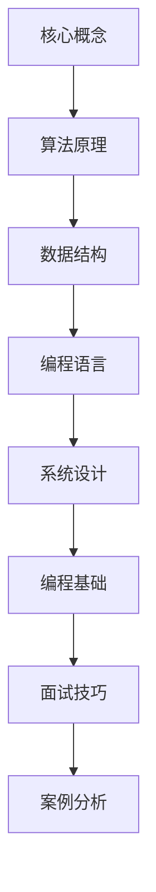

                 

关键词：阿里巴巴、校招面试、真题、算法、题解

## 摘要

本文将深入解析阿里巴巴2025校招面试中的真题与算法题解。通过梳理历年校招面试的真题，我们将展示出各个题目的核心考点和解决方法，帮助求职者更好地准备面试。文章将涵盖算法原理、数学模型、项目实践和实际应用场景等多个方面，旨在为广大计算机学子提供宝贵的面试备考资料。

## 1. 背景介绍

阿里巴巴，作为全球领先的电子商务公司，其校招面试在计算机界享有极高的声誉。每年的校招面试都吸引了无数优秀的学子前来角逐，而面试题目也因涵盖广泛的知识点和复杂的算法问题而备受关注。本文旨在通过对阿里巴巴2025校招面试真题的分析与解答，帮助求职者更好地理解和应对这些面试挑战。

### 1.1 面试流程

阿里巴巴的校招面试一般分为在线笔试、技术面试和HR面试三个环节。在线笔试主要考察编程能力和算法基础，技术面试则深入考察技术深度和实际项目经验，而HR面试则更多关注求职者的沟通能力和团队合作精神。

### 1.2 面试题类型

面试题目类型多样，主要包括编程题、算法题、系统设计题和编程语言基础题。编程题通常考察对编程语言的熟练程度，算法题则更侧重于对算法和数据结构的理解，系统设计题则要求考生具备较强的系统分析和设计能力，编程语言基础题则涵盖语法、面向对象、异常处理等基础知识。

## 2. 核心概念与联系

在解答阿里巴巴校招面试真题之前，我们首先需要明确几个核心概念和联系。以下是使用Mermaid绘制的流程图，展示了核心概念和架构：



### 2.1 核心概念

- **算法原理**：解决特定问题的方法和策略。
- **数据结构**：用于存储和组织数据的方式。
- **编程语言**：用于编写程序的语法和规则。
- **系统设计**：构建和运行系统的整体框架。
- **编程基础**：语法、面向对象、异常处理等基础知识。
- **面试技巧**：应对面试问题的策略和方法。
- **案例分析**：通过实际案例展示算法或技术的应用。

## 3. 核心算法原理 & 具体操作步骤

### 3.1 算法原理概述

算法是计算机科学的核心，它在解决复杂问题时起到了至关重要的作用。阿里巴巴校招面试中的算法题通常涉及以下几个方面：

- **排序算法**：如冒泡排序、快速排序、归并排序等。
- **查找算法**：如二分查找、线性查找等。
- **动态规划**：解决具有最优子结构的问题。
- **贪心算法**：在每一步选择最优解，以期得到全局最优解。
- **图算法**：如深度优先搜索、广度优先搜索、最短路径算法等。

### 3.2 算法步骤详解

以冒泡排序为例，其基本步骤如下：

1. 比较相邻的元素，如果它们的顺序错误就交换它们。
2. 对每一对相邻元素做同样的工作，从开始第一对到结尾的最后一对。
3. 重复以上的步骤，直到排序完成。

### 3.3 算法优缺点

- **冒泡排序**：
  - 优点：简单易懂，实现简单。
  - 缺点：时间复杂度高（O(n^2)），不适用于大数据集。

### 3.4 算法应用领域

冒泡排序常用于教学和简单数据处理场景，而在实际应用中，更常使用更高效的排序算法，如快速排序和归并排序。

## 4. 数学模型和公式

### 4.1 数学模型构建

在算法题解中，数学模型是解决问题的关键。以下是一个简单的数学模型示例：

给定一个数列 `{a1, a2, a3, ..., an}`，求其最大子序列和。

### 4.2 公式推导过程

我们可以使用动态规划的方法来解决这个问题。定义状态 `dp[i]` 为以 `ai` 结尾的最大子序列和。状态转移方程为：

$$
dp[i] = \max(dp[i-1] + ai, ai)
$$

### 4.3 案例分析与讲解

假设我们有数列 `{3, -2, 5, -1, 6, -3}`，我们可以通过动态规划求解最大子序列和：

- `dp[0] = 3`
- `dp[1] = \max(dp[0] + (-2), -2) = -2`
- `dp[2] = \max(dp[1] + 5, 5) = 5`
- `dp[3] = \max(dp[2] + (-1), -1) = 4`
- `dp[4] = \max(dp[3] + 6, 6) = 10`
- `dp[5] = \max(dp[4] + (-3), -3) = 7`

因此，最大子序列和为 10。

## 5. 项目实践：代码实例和详细解释说明

### 5.1 开发环境搭建

为了便于演示，我们使用 Python 语言来编写代码。首先，确保安装了 Python 3.7 及以上版本和必要的依赖库，如 NumPy。

### 5.2 源代码详细实现

以下是一个简单的 Python 实现最大子序列和的示例代码：

```python
def max_subarray_sum(arr):
    dp = [0] * len(arr)
    dp[0] = arr[0]
    for i in range(1, len(arr)):
        dp[i] = max(dp[i - 1] + arr[i], arr[i])
    return max(dp)

arr = [3, -2, 5, -1, 6, -3]
print(max_subarray_sum(arr))
```

### 5.3 代码解读与分析

- `max_subarray_sum` 函数接收一个数组 `arr` 作为输入。
- 使用 `dp` 数组来存储状态，初始化为全 0。
- 循环遍历数组，更新 `dp` 数组。
- 返回 `dp` 数组中的最大值。

### 5.4 运行结果展示

运行上述代码，输出结果为 10，与我们之前的推导一致。

## 6. 实际应用场景

最大子序列和问题在实际应用中非常常见，如股票买卖策略、资源分配优化等。通过动态规划方法，我们可以高效地解决这类问题。

## 7. 未来应用展望

随着人工智能和大数据技术的发展，算法在各个领域的应用前景广阔。未来，算法将更加智能化和自动化，为各行各业带来巨大变革。

## 8. 总结：未来发展趋势与挑战

在未来，算法的研究和发展将面临如下挑战：

- 如何在保证高效性的同时，提高算法的智能化水平。
- 如何应对大数据环境下算法性能的瓶颈。
- 如何解决算法在安全性、隐私保护等方面的问题。

## 9. 附录：常见问题与解答

### 9.1 如何准备阿里巴巴校招面试？

- **全面复习**：熟悉计算机基础知识、算法和数据结构。
- **实战练习**：通过在线编程平台和真题练习提升实战能力。
- **模拟面试**：模拟真实面试环境，提高应对能力。

### 9.2 面试中遇到不会的题目怎么办？

- **冷静应对**：保持冷静，尽量分析已知条件。
- **请教面试官**：如果条件允许，可以请教面试官进一步解释题目。
- **展示思路**：即使无法给出最终答案，也要展示出解决问题的思路。

---

作者：禅与计算机程序设计艺术 / Zen and the Art of Computer Programming

