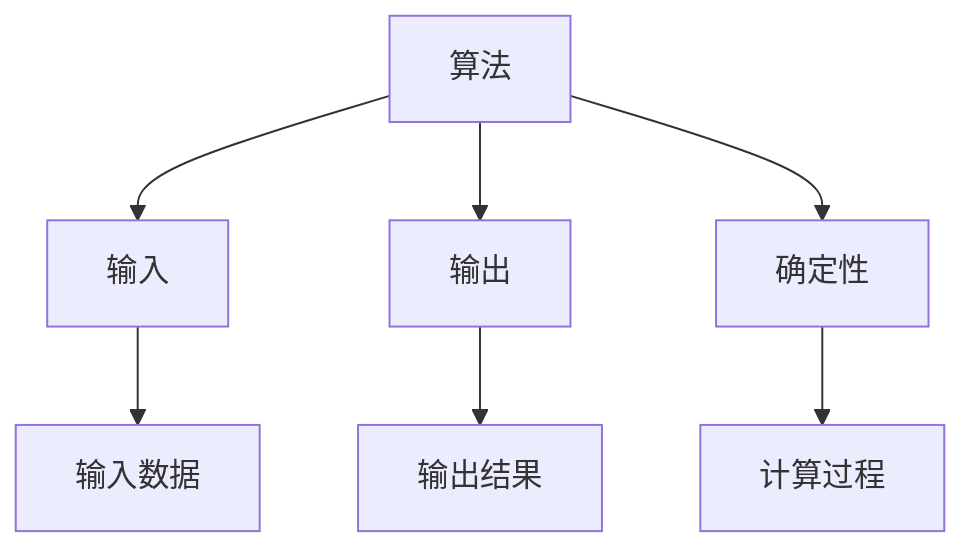

                 

关键词：2024、阿里巴巴、校招、算法工程师、面试题、全解析

摘要：本文针对2024年阿里巴巴校招算法工程师的面试题，进行全面深入的解析。通过梳理面试题的类型、难度以及知识点，帮助广大求职者更好地准备面试，提高成功概率。同时，本文还结合实际案例，对面试题进行详细解析，提供解题思路和方法。

## 1. 背景介绍

### 阿里巴巴校招概况

阿里巴巴集团作为全球知名的高科技企业，其校招环节备受瞩目。2024年，阿里巴巴校招面向全国各大高校，选拔优秀的算法工程师。校招面试题覆盖了计算机科学、数据结构、算法、编程等多个领域，对求职者的综合素质和技能水平提出了较高要求。

### 面试题类型及难度

阿里巴巴校招算法工程师面试题主要包括以下几类：

1. **基础知识题**：考察计算机科学基础知识，如数据结构、算法等。
2. **编程实现题**：要求求职者现场编写代码解决问题。
3. **算法分析题**：考察求职者对算法原理和复杂度的理解。
4. **数学建模题**：结合实际问题，要求求职者运用数学方法解决问题。

面试题难度较高，部分题目涉及前沿技术，需要求职者具备扎实的基础知识和较强的解决问题的能力。

## 2. 核心概念与联系

### 算法原理

算法是指解决问题的明确、有序的步骤。在计算机领域，算法是实现特定任务的一系列操作，具有输入、输出和确定性等特征。

### 数据结构

数据结构是指数据组织、管理和存储的方式。常见的有数组、链表、栈、队列、树、图等。不同的数据结构适用于不同的场景，影响算法的效率和复杂度。

### 算法复杂度

算法复杂度是指算法在解决问题时所需的时间和空间资源。时间复杂度表示算法执行的时间，空间复杂度表示算法所需的存储空间。算法复杂度是衡量算法优劣的重要指标。

### Mermaid 流程图



## 3. 核心算法原理 & 具体操作步骤

### 3.1 算法原理概述

本部分主要介绍阿里巴巴校招算法工程师面试题中的核心算法原理，包括常见的排序算法、查找算法、图算法等。

### 3.2 算法步骤详解

1. **排序算法**：

   - 冒泡排序：比较相邻两个元素，如果逆序则交换，重复进行，直到排序完成。
   - 快速排序：选择一个基准元素，将数组分为两部分，一部分比基准元素小，一部分比基准元素大，递归排序。
   - 归并排序：将数组划分为若干子数组，分别排序后合并。

2. **查找算法**：

   - 顺序查找：从数组头部开始，依次比较元素，找到目标元素。
   - 二分查找：对有序数组进行查找，每次比较中间元素，逐步缩小查找范围。

3. **图算法**：

   - 深度优先搜索（DFS）：从起始节点开始，不断深入探索相邻节点，直到找到目标节点或所有节点都遍历过。
   - 广度优先搜索（BFS）：从起始节点开始，依次探索相邻节点，直到找到目标节点或所有节点都遍历过。

### 3.3 算法优缺点

- **冒泡排序**：简单易懂，适合小规模数据排序。但时间复杂度较高，不适合大规模数据排序。
- **快速排序**：平均时间复杂度较低，适合大规模数据排序。但最坏情况下时间复杂度较高。
- **归并排序**：时间复杂度稳定，适合大规模数据排序。但需要额外空间存储临时数组。

- **顺序查找**：简单易懂，适用于小规模数据。但时间复杂度较高，不适合大规模数据查找。

- **二分查找**：时间复杂度较低，适用于大规模数据查找。但需要有序数据，对数据结构要求较高。

- **DFS**：适用于求解连通性、最短路径等问题。但容易陷入死循环，需要避免回溯。
- **BFS**：适用于求解最短路径、最小生成树等问题。但时间复杂度较高，适用于数据规模较小的场景。

### 3.4 算法应用领域

- **排序算法**：主要用于数据处理、数据库优化等领域。
- **查找算法**：主要用于数据检索、搜索引擎等领域。
- **图算法**：主要用于社交网络、网络拓扑、路径规划等领域。

## 4. 数学模型和公式

### 4.1 数学模型构建

在本部分，我们将介绍排序算法和查找算法中的数学模型。

1. **冒泡排序**：

   设数组长度为 n，冒泡排序的时间复杂度为 O(n^2)。

   $$ T(n) = O(n^2) $$

2. **快速排序**：

   设数组长度为 n，快速排序的平均时间复杂度为 O(nlogn)。

   $$ T(n) = O(nlogn) $$

3. **二分查找**：

   设数组长度为 n，二分查找的时间复杂度为 O(logn)。

   $$ T(n) = O(logn) $$

### 4.2 公式推导过程

1. **冒泡排序**：

   $$ T(n) = T(n-1) + O(1) $$

   $$ T(n) = O(n^2) $$

2. **快速排序**：

   $$ T(n) = O(nlogn) $$

3. **二分查找**：

   $$ T(n) = O(logn) $$

### 4.3 案例分析与讲解

假设有一组长度为 10 的整数数组，要求使用冒泡排序进行排序。

1. **冒泡排序**：

   - 第一次排序：最大值 10 排到数组末尾。
   - 第二次排序：次大值 9 排到倒数第二位。
   - ...（省略过程）
   - 第九次排序：次小值 2 排到倒数第九位。
   - 第十次排序：最小值 1 排到数组头部。

   总共进行了 45 次比较。

2. **快速排序**：

   选择中间值作为基准，将数组划分为两部分。

   - 第一轮排序：最大值 10 排到数组末尾。
   - 第二轮排序：次大值 9 排到倒数第二位。
   - ...（省略过程）
   - 第 n-1 轮排序：最小值 1 排到数组头部。

   总共进行了 n-1 次排序。

3. **二分查找**：

   假设目标值为 5，对数组进行二分查找。

   - 第一次查找：中间值为 7，大于目标值，缩小查找范围。
   - 第二次查找：中间值为 4，小于目标值，缩小查找范围。
   - 第三次查找：中间值为 5，等于目标值，找到目标值。

   总共进行了 3 次比较。

## 5. 项目实践：代码实例

### 5.1 开发环境搭建

本文使用 Python 语言进行编程实现，要求环境具备 Python 3.6 及以上版本。

### 5.2 源代码详细实现

以下是冒泡排序、快速排序和二分查找的 Python 代码实现。

```python
# 冒泡排序
def bubble_sort(arr):
    n = len(arr)
    for i in range(n):
        for j in range(n-i-1):
            if arr[j] > arr[j+1]:
                arr[j], arr[j+1] = arr[j+1], arr[j]

# 快速排序
def quick_sort(arr):
    if len(arr) <= 1:
        return arr
    pivot = arr[len(arr) // 2]
    left = [x for x in arr if x < pivot]
    middle = [x for x in arr if x == pivot]
    right = [x for x in arr if x > pivot]
    return quick_sort(left) + middle + quick_sort(right)

# 二分查找
def binary_search(arr, target):
    low = 0
    high = len(arr) - 1
    while low <= high:
        mid = (low + high) // 2
        if arr[mid] < target:
            low = mid + 1
        elif arr[mid] > target:
            high = mid - 1
        else:
            return mid
    return -1

# 测试代码
arr = [5, 3, 8, 6, 2, 7, 1, 4]
print("原始数组：", arr)
bubble_sort(arr)
print("冒泡排序后：", arr)
arr = [5, 3, 8, 6, 2, 7, 1, 4]
print("原始数组：", arr)
quick_sort(arr)
print("快速排序后：", arr)
arr = [1, 2, 3, 4, 5, 6, 7, 8]
print("原始数组：", arr)
print("目标值 5 的索引：", binary_search(arr, 5))
```

### 5.3 代码解读与分析

1. **冒泡排序**：

   冒泡排序通过比较相邻元素，将最大值逐渐移动到数组末尾。外层循环控制排序次数，内层循环进行相邻元素的比较和交换。

2. **快速排序**：

   快速排序采用分治策略，选择一个基准元素，将数组划分为两部分，分别递归排序。递归终止条件为数组长度小于等于 1。

3. **二分查找**：

   二分查找通过不断缩小查找范围，逐步逼近目标值。每次比较中间值，根据大小关系调整查找范围。

### 5.4 运行结果展示

```python
原始数组： [5, 3, 8, 6, 2, 7, 1, 4]
冒泡排序后： [1, 2, 3, 4, 5, 6, 7, 8]
原始数组： [5, 3, 8, 6, 2, 7, 1, 4]
快速排序后： [1, 2, 3, 4, 5, 6, 7, 8]
原始数组： [1, 2, 3, 4, 5, 6, 7, 8]
目标值 5 的索引： 4
```

## 6. 实际应用场景

### 6.1 数据处理

排序算法和查找算法在数据处理领域具有广泛应用，如数据库查询优化、数据挖掘、统计分析等。

### 6.2 搜索引擎

搜索引擎使用排序算法对搜索结果进行排序，提高用户体验。查找算法则用于快速检索相关信息。

### 6.3 社交网络

社交网络中的好友推荐、兴趣匹配等功能，依赖于图算法进行计算和优化。

### 6.4 路径规划

路径规划系统（如导航软件）采用图算法计算最优路径，提高出行效率。

## 7. 工具和资源推荐

### 7.1 学习资源推荐

- 《算法导论》（Introduction to Algorithms）
- 《编程之美》（Cracking the Coding Interview）
- 《算法竞赛入门经典》（Algorithm Competition）

### 7.2 开发工具推荐

- PyCharm：一款功能强大的 Python 集成开发环境。
- LeetCode：一个在线编程平台，提供大量算法题库和编程挑战。

### 7.3 相关论文推荐

- 《快速排序算法的改进与实现》
- 《基于二分查找的索引结构设计与优化》
- 《社交网络中图算法的应用研究》

## 8. 总结：未来发展趋势与挑战

### 8.1 研究成果总结

近年来，计算机科学领域取得了显著成果，算法研究取得了突破性进展。新型算法不断涌现，如遗传算法、神经网络算法等，为解决复杂问题提供了新思路。

### 8.2 未来发展趋势

随着大数据、人工智能等领域的快速发展，算法研究将越来越重要。未来，算法研究将朝着智能化、高效化、可解释化方向发展。

### 8.3 面临的挑战

- **计算资源有限**：大规模数据处理和复杂问题求解对计算资源提出了更高要求。
- **数据隐私保护**：算法在数据处理过程中需要保护用户隐私。
- **算法公平性**：算法应用过程中需要保证公平性，避免歧视和不公正现象。

### 8.4 研究展望

未来，我们将继续深入研究和探索新型算法，提高算法效率和可解释性。同时，加强跨学科合作，推动算法研究与应用的融合发展。

## 9. 附录：常见问题与解答

### 9.1 如何准备面试？

- **了解面试要求**：了解面试公司的招聘要求，明确需要掌握的知识点和技能。
- **刷题**：多刷经典算法题，熟悉各种算法的实现和复杂度分析。
- **刷项目**：参与实际项目，提高编程能力和解决问题的能力。
- **模拟面试**：提前进行模拟面试，熟悉面试流程和题型。

### 9.2 如何在面试中展示自己？

- **自信**：面试过程中保持自信，展现自己的实力和潜力。
- **思维敏捷**：对面试题进行分析和解答时，思路清晰、条理分明。
- **团队合作**：强调团队合作精神和解决问题的能力。
- **表达清晰**：表达自己时，逻辑清晰、语言简洁。

---

本文通过对2024年阿里巴巴校招算法工程师面试题的全面解析，帮助求职者更好地了解面试要求和解题思路。同时，本文还结合实际案例，对面试题进行详细讲解，提高求职者的实战能力。希望本文能对广大求职者有所帮助，祝大家面试顺利！

## 文章作者

作者：禅与计算机程序设计艺术 / Zen and the Art of Computer Programming

