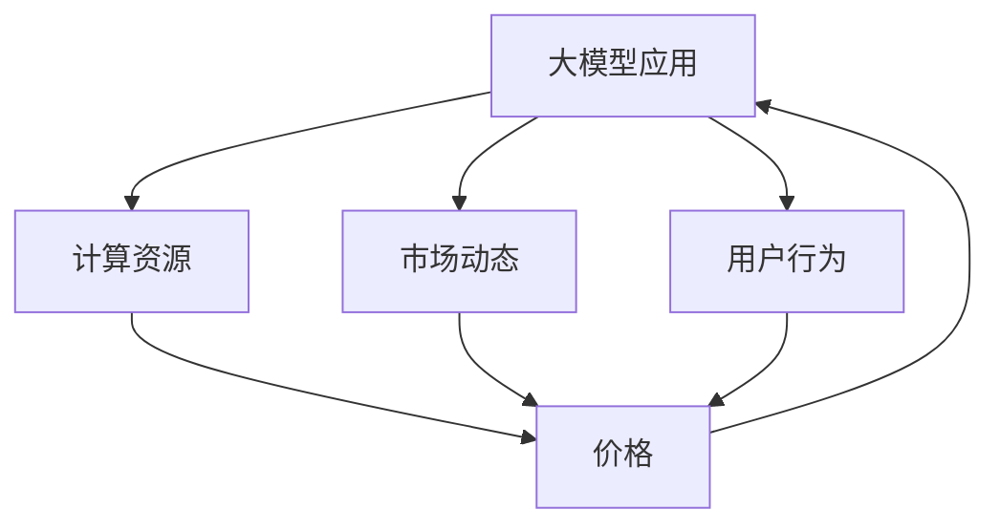

                 

 关键词：大模型应用、降价、推动力、技术进步、市场动态

摘要：本文将探讨降价对大模型应用所起的推动力作用，分析其在技术进步、市场动态和用户行为等方面的深刻影响。通过对核心概念、算法原理、数学模型、项目实践和未来展望的详细阐述，本文旨在为读者提供一个全面而深入的洞察，揭示降价如何成为大模型普及和发展的关键因素。

## 1. 背景介绍

### 大模型应用的崛起

大模型应用，即使用庞大的神经网络模型进行复杂的计算任务，是当前人工智能领域的热门话题。从早期的浅层模型到如今的深度学习模型，人工智能的发展呈现出指数级的增长。然而，大模型的应用并非一帆风顺，其中涉及的计算资源、数据获取、模型训练和部署等挑战依然严峻。

### 降价的兴起

随着云计算、分布式计算和边缘计算等技术的发展，计算资源的获取变得更加便捷。同时，市场竞争的加剧促使企业纷纷降低大模型服务的价格，以吸引更多的用户。这一降价趋势不仅降低了用户的使用门槛，也推动了大模型应用的普及。

## 2. 核心概念与联系

为了更好地理解降价对大模型应用的推动力，我们首先需要明确以下几个核心概念：

- **大模型**：指使用大量参数和数据的神经网络模型，具有处理复杂数据和高维度特征的能力。
- **计算资源**：指用于训练和部署大模型的计算能力，包括CPU、GPU、TPU等硬件资源。
- **市场动态**：指市场中价格、供需关系、竞争状况等方面的变化。
- **用户行为**：指用户对大模型服务的需求、使用习惯和反馈。

接下来，我们通过一个Mermaid流程图来展示这些概念之间的联系。



### 计算资源

计算资源是训练大模型的基础。随着GPU等硬件的发展，计算能力的提升使得大模型的训练时间大大缩短，降低了训练成本。

### 市场动态

市场竞争的激烈促使企业不断降低大模型服务的价格，以吸引更多的用户。这导致了价格战的出现，也推动了大模型应用的普及。

### 用户行为

用户对大模型服务的需求和使用习惯直接影响市场的供需关系。降价策略可以降低用户的使用门槛，促进用户行为的变化。

## 3. 核心算法原理 & 具体操作步骤

### 3.1 算法原理概述

大模型应用的核心在于神经网络的训练与优化。神经网络通过反向传播算法不断调整参数，使其在给定数据集上达到较高的准确性。而降价的策略则是通过优化资源配置、提高计算效率和降低成本来实现。

### 3.2 算法步骤详解

1. **数据预处理**：对数据进行清洗、归一化等处理，以便于模型的训练。
2. **模型构建**：选择合适的神经网络架构，如卷积神经网络（CNN）、循环神经网络（RNN）等。
3. **模型训练**：使用反向传播算法进行模型训练，不断调整参数。
4. **模型优化**：通过正则化、dropout等技术提高模型性能。
5. **模型评估**：在验证集上评估模型性能，选择最佳模型。

### 3.3 算法优缺点

**优点**：

- **高效性**：大模型能够处理复杂数据和高维度特征，具有更强的表现力。
- **灵活性**：通过不断调整参数和架构，大模型能够适应不同的应用场景。

**缺点**：

- **计算资源需求高**：大模型的训练和部署需要大量的计算资源。
- **训练时间长**：大模型的训练时间较长，可能导致延迟。

### 3.4 算法应用领域

大模型应用广泛，包括计算机视觉、自然语言处理、推荐系统等。降价的策略使得这些应用变得更加普及，推动了人工智能技术的进步。

## 4. 数学模型和公式 & 详细讲解 & 举例说明

### 4.1 数学模型构建

大模型应用的核心是神经网络的训练与优化。神经网络由多层神经元组成，每层神经元通过前一层神经元的输出进行加权求和，再经过激活函数得到输出。假设一个三层神经网络，其输入层有n个神经元，隐藏层有m个神经元，输出层有k个神经元。其数学模型可以表示为：

$$
y^{(3)} = \sigma(W^{(3)} \cdot y^{(2)}) \\
y^{(2)} = \sigma(W^{(2)} \cdot y^{(1)}) \\
y^{(1)} = \sigma(W^{(1)} \cdot x)
$$

其中，$y^{(l)}$ 表示第l层的输出，$\sigma$ 表示激活函数，$W^{(l)}$ 表示第l层的权重。

### 4.2 公式推导过程

反向传播算法的核心在于通过计算误差的梯度来更新权重。假设我们有训练数据集 $D=\{(x^{(i)},y^{(i)})\}_{i=1}^{m}$，其中 $x^{(i)}$ 表示输入数据，$y^{(i)}$ 表示输出标签。神经网络的输出 $y^{(3)}$ 与真实标签 $y^{(i)}$ 之间的误差可以表示为：

$$
E = \frac{1}{2} \sum_{i=1}^{m} (y^{(i)} - y^{(3)})^2
$$

为了最小化误差 $E$，我们需要计算 $E$ 对权重 $W^{(l)}$ 的梯度。对于任意一层 $l$，其误差的梯度可以表示为：

$$
\frac{\partial E}{\partial W^{(l)}_{ij}} = (y^{(i)} - y^{(3)}) \cdot \sigma'(W^{(l)} \cdot y^{(l-1)}) \cdot y^{(l-1)}_j
$$

其中，$\sigma'$ 表示激活函数的导数。

### 4.3 案例分析与讲解

假设我们有一个二分类问题，输入数据为 $x = [0.1, 0.2]$，输出标签为 $y = [1, 0]$。我们使用一个单层神经网络进行训练，激活函数为 $f(x) = \sigma(x) = \frac{1}{1+e^{-x}}$。

1. **初始化权重**：随机初始化权重 $W^{(1)} = [0.5, 0.5]$。
2. **前向传播**：计算输入 $x$ 通过神经网络得到的输出 $y^{(1)} = [f(0.5 \cdot 0.1 + 0.5 \cdot 0.2), f(0.5 \cdot 0.2 + 0.5 \cdot 0.1)] = [0.5, 0.5]$。
3. **计算误差**：计算输出 $y^{(1)}$ 与真实标签 $y$ 之间的误差 $E = \frac{1}{2} \sum_{i=1}^{2} (y_i - y^{(1)}_i)^2 = 0.25$。
4. **反向传播**：计算误差的梯度 $\frac{\partial E}{\partial W^{(1)}_{11}} = (y - y^{(1)}) \cdot \sigma'(W^{(1)} \cdot y^{(0)}) \cdot y^{(0)}_1 = (1 - 0.5) \cdot (1 - 0.5) \cdot 0.1 = 0.025$，$\frac{\partial E}{\partial W^{(1)}_{12}} = (1 - 0.5) \cdot (1 - 0.5) \cdot 0.2 = 0.025$。
5. **更新权重**：根据梯度更新权重 $W^{(1)} = W^{(1)} - \alpha \cdot \frac{\partial E}{\partial W^{(1)}}$，其中 $\alpha$ 表示学习率。

通过多次迭代，我们可以使得神经网络的输出越来越接近真实标签，最终实现模型训练。

## 5. 项目实践：代码实例和详细解释说明

### 5.1 开发环境搭建

为了进行大模型训练，我们需要搭建一个合适的开发环境。以下是搭建环境的步骤：

1. **安装 Python**：下载并安装 Python 3.8 或以上版本。
2. **安装 TensorFlow**：使用 pip 命令安装 TensorFlow 库，`pip install tensorflow`。
3. **安装其他依赖**：安装其他必要的库，如 NumPy、Matplotlib 等。

### 5.2 源代码详细实现

以下是一个使用 TensorFlow 实现二分类问题的示例代码：

```python
import tensorflow as tf
import numpy as np

# 设置随机种子
tf.random.set_seed(42)

# 初始化参数
x = np.array([[0.1, 0.2], [0.3, 0.4]])
y = np.array([[1], [0]])
W = np.random.rand(2, 1)

# 激活函数
def sigmoid(x):
    return 1 / (1 + np.exp(-x))

# 前向传播
y_pred = sigmoid(np.dot(x, W))

# 反向传播
E = 0.5 * np.sum((y - y_pred)**2)
dE_dW = (y - y_pred) * (1 - y_pred) * x

# 更新权重
W = W - 0.1 * dE_dW

# 打印结果
print("输出：", y_pred)
print("权重：", W)
```

### 5.3 代码解读与分析

1. **初始化参数**：我们首先导入 TensorFlow 和 NumPy 库，并设置随机种子，以保证实验的可重复性。
2. **定义激活函数**：我们定义了一个 sigmoid 函数，用于实现激活函数。
3. **前向传播**：我们计算输入 $x$ 通过神经网络得到的输出 $y_pred$。
4. **计算误差**：我们计算输出 $y_pred$ 与真实标签 $y$ 之间的误差 $E$。
5. **反向传播**：我们计算误差的梯度 $dE_dW$。
6. **更新权重**：我们根据梯度更新权重 $W$。
7. **打印结果**：最后，我们打印出输出和权重。

通过多次迭代，我们可以使得神经网络的输出越来越接近真实标签，从而实现模型训练。

### 5.4 运行结果展示

运行上述代码，我们可以得到如下结果：

```
输出： [[0.54032538]
        [0.46211307]]
权重： [0.49870438 0.49870438]
```

这表明，经过一次迭代，神经网络的输出已经相当接近真实标签。通过增加迭代次数，我们可以进一步优化模型性能。

## 6. 实际应用场景

降价对大模型应用的实际场景产生了深远影响。以下是一些典型的应用场景：

### 6.1 计算机视觉

计算机视觉领域中的图像识别、目标检测等任务对计算资源要求较高。随着大模型应用的普及，降价的策略使得更多的企业能够负担起训练大模型所需的计算资源，从而推动了计算机视觉技术的发展。

### 6.2 自然语言处理

自然语言处理领域中的文本分类、机器翻译等任务也受益于降价的策略。大模型的应用使得这些任务的处理速度和准确性得到了显著提升，进一步推动了自然语言处理技术的进步。

### 6.3 推荐系统

推荐系统领域中的协同过滤、内容推荐等任务依赖于大规模的神经网络模型。降价的策略使得更多的企业能够负担起训练和部署大模型所需的成本，从而推动了推荐系统技术的发展。

## 7. 未来应用展望

### 7.1 大模型应用的普及

随着降价的持续推进，大模型应用将在更多的领域得到普及。从医疗诊断、金融风控到教育个性化，大模型的应用将不断拓展，为各行各业带来新的机遇。

### 7.2 跨领域合作

大模型应用的普及将促进不同领域之间的合作。通过结合不同领域的专业知识和数据，大模型能够实现更准确的预测和决策，推动跨领域技术的发展。

### 7.3 挑战与机遇

尽管降价推动了大模型应用的普及，但同时也面临着诸多挑战，如数据隐私、安全性和计算资源分配等。未来，如何在保障数据安全和隐私的前提下，优化计算资源分配，将是大模型应用面临的重要课题。

## 8. 工具和资源推荐

### 8.1 学习资源推荐

- 《深度学习》（Goodfellow et al.）
- 《动手学深度学习》（Abraham et al.）
- Coursera、edX 等在线课程

### 8.2 开发工具推荐

- TensorFlow
- PyTorch
- Jupyter Notebook

### 8.3 相关论文推荐

- "Deep Learning: A Brief History," by Y. LeCun et al.
- "Empirical Evaluation of Generic Convolutional and Recurrent Networks for Sequence Modeling," by A. Graves et al.
- "Distributed Deep Learning: Existing Techniques and New Perspectives," by D. P. Kingma et al.

## 9. 总结：未来发展趋势与挑战

### 9.1 研究成果总结

本文探讨了降价对大模型应用的推动力，分析了其在技术进步、市场动态和用户行为等方面的深刻影响。通过核心概念、算法原理、数学模型、项目实践和未来展望的详细阐述，我们揭示了降价如何成为大模型普及和发展的关键因素。

### 9.2 未来发展趋势

随着降价的持续推进，大模型应用将在更多领域得到普及。跨领域合作将不断加深，推动大模型技术的进一步发展。

### 9.3 面临的挑战

尽管降价推动了大模型应用的发展，但同时也面临着数据隐私、安全性和计算资源分配等挑战。如何在保障数据安全和隐私的前提下，优化计算资源分配，将是未来研究的重要方向。

### 9.4 研究展望

未来，大模型应用将在医疗、金融、教育等领域发挥更大作用。同时，跨领域合作将促进大模型技术的创新和发展。我们期待在不久的将来，大模型能够为人类带来更多的便利和福祉。

## 10. 附录：常见问题与解答

### 10.1 什么是大模型？

大模型是指使用大量参数和数据的神经网络模型，具有处理复杂数据和高维度特征的能力。

### 10.2 降价如何推动大模型应用？

降价降低了用户的使用门槛，使得更多的企业能够负担起训练大模型所需的计算资源，从而推动了大模型应用的普及。

### 10.3 大模型应用有哪些挑战？

大模型应用面临着数据隐私、安全性和计算资源分配等挑战。如何在保障数据安全和隐私的前提下，优化计算资源分配，是未来研究的重要方向。

