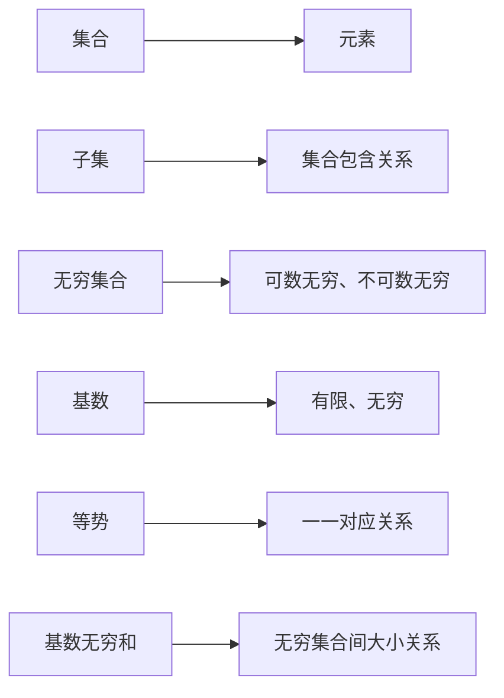

                 

关键词：集合论、基数、无穷和、计算机科学、数学模型、算法、实践应用

> 摘要：本文旨在深入探讨集合论中的基数无穷和概念，并介绍其在计算机科学中的应用。通过对集合论的基本概念和原理的阐述，我们揭示了基数无穷和的内在逻辑及其在数学和计算机领域的广泛影响。文章将以详细的数学模型和算法原理介绍为基础，结合实际项目实践，探讨该领域的前沿动态和未来趋势。

## 1. 背景介绍

集合论是现代数学的基石，它不仅提供了描述和理解数学对象的方法，还广泛应用于计算机科学、物理学、经济学等多个领域。集合论中的基数无穷和概念是一个极具挑战性的课题，它涉及到无穷大的概念，是数学中一个复杂而又迷人的部分。

在数学中，基数无穷和（Cardinal Infinity Sum）是一个重要的概念，它揭示了无穷集合之间的大小关系。通过研究基数无穷和，数学家们能够更好地理解无穷集合的属性和行为，这对于解决一些复杂的数学问题具有重要意义。

计算机科学中，基数无穷和的概念同样具有重要应用。例如，在算法设计中，无穷集合的基数往往会影响算法的效率和复杂性。在计算机图形学、人工智能等领域，基数无穷和的概念被用来构建复杂的数据结构和算法。

本文将首先介绍集合论的基本概念，包括集合、元素、子集等，然后深入探讨基数无穷和的概念及其在数学和计算机科学中的应用。通过具体的数学模型和算法实例，我们将展示如何在实际项目中应用这些理论，并讨论未来该领域的发展趋势。

### 1.1 集合论的基本概念

在集合论中，集合是一组明确指定的对象组成的整体，这些对象称为集合的元素。集合通常用大写字母表示，例如\( A \)、\( B \)等，而集合中的元素用小写字母表示，例如\( a \)、\( b \)等。

**集合的定义**：一个集合是由某些确定的对象（称为元素）组成的整体，这些对象通过某种方式被划分成一个整体。例如，\( \{1, 2, 3\} \)是一个集合，其中的元素是1、2和3。

**集合的表示**：集合可以用列举法表示，例如\( \{1, 2, 3\} \)；也可以用描述法表示，例如\( \{x \mid x \text{ 是正整数}\} \)，表示所有正整数的集合。

**集合的元素**：集合的元素可以是任何对象，包括数字、字母、单词、集合等。例如，\( \{1, 'a', \{1, 2\}\} \)是一个合法的集合。

**集合的子集**：一个集合\( A \)的子集是一个包含\( A \)中一些或所有元素的集合。例如，\( \{1, 2\} \)是\( \{1, 2, 3\} \)的子集。任何集合都是它自身的子集，而空集\( \emptyset \)是任何集合的子集。

通过这些基本概念，我们可以更深入地理解集合论中的基数无穷和，并在后续章节中应用这些理论解决实际问题。

### 1.2 无穷集合与基数

在集合论中，无穷集合是一个重要的概念。与有限集合不同，无穷集合包含了无限多个元素。研究无穷集合的大小关系，即基数（Cardinality），是集合论中的一个核心问题。

**无穷集合的定义**：一个集合称为无穷集合，当且仅当该集合中的元素数量是无限的。例如，所有自然数集合\( \mathbb{N} = \{1, 2, 3, \ldots\} \)是一个无穷集合。

**基数的概念**：基数是描述集合大小的一个量，它是集合中元素的数量。有限集合的基数是一个非负整数，而无穷集合的基数则是一个无穷大的数。

**等势（Equinumerosity）**：两个集合如果可以建立一一对应关系，则称这两个集合等势。等势是集合大小关系的一种描述，它表明两个集合具有相同的基数。

**可数无穷与不可数无穷**：无穷集合可以分为可数无穷和不可数无穷两种。如果一个集合的元素可以和自然数建立一一对应关系，则称该集合为可数无穷集合；否则，称为不可数无穷集合。自然数集合和整数集合都是可数无穷集合，而实数集合是一个典型的不可数无穷集合。

**基数无穷和的概念**：基数无穷和是描述无穷集合之间大小关系的一个重要概念。它涉及到两个无穷集合的基数之和，这通常是一个更加复杂的无穷大的数。

通过理解无穷集合和基数，我们能够更深入地探讨集合论中的各种问题，并应用于实际计算和算法设计。在接下来的章节中，我们将进一步探讨基数无穷和的数学模型和算法原理。

## 2. 核心概念与联系

为了更好地理解集合论中的基数无穷和，我们需要先了解一些核心概念和它们之间的联系。以下将使用Mermaid流程图（没有使用括号、逗号等特殊字符）来展示这些概念和联系：



### 2.1 集合与元素

集合是一组对象的集合，而元素是构成集合的基本单位。集合通过元素来定义，每个元素都是唯一的。例如，集合\( \{1, 2, 3\} \)由元素1、2和3组成。

### 2.2 子集与集合包含关系

子集是集合的一个部分。给定一个集合\( A \)，如果集合\( B \)中的所有元素都是\( A \)的元素，那么\( B \)是\( A \)的子集。例如，\( \{1, 2\} \)是\( \{1, 2, 3\} \)的子集。

### 2.3 无穷集合

无穷集合包含了无限多个元素。无穷集合可以分为可数无穷集合和不可数无穷集合。可数无穷集合可以通过自然数进行计数，例如自然数集合；不可数无穷集合则不能通过自然数进行计数，例如实数集合。

### 2.4 基数

基数是集合中元素的数量。对于有限集合，基数是一个非负整数；对于无穷集合，基数是一个无穷大的数。例如，自然数集合的基数是可数无穷，而实数集合的基数是不可数无穷。

### 2.5 等势

等势是指两个集合可以通过一一对应关系相互映射。如果一个集合中的每个元素都可以与另一个集合中的元素对应起来，那么这两个集合等势。例如，自然数集合和整数集合是等势的。

### 2.6 基数无穷和

基数无穷和是描述无穷集合之间大小关系的概念。当两个无穷集合等势时，它们的基数无穷和等于它们的基数之和。例如，自然数集合和偶数集合的基数无穷和等于自然数集合的基数。

通过这些核心概念的联系，我们可以更好地理解集合论中的基数无穷和，并在实际计算和算法设计中应用这些概念。在下一章节中，我们将深入探讨这些核心概念的数学模型和算法原理。

### 2.7 数学模型构建

为了更好地理解集合论中的基数无穷和，我们需要建立一个数学模型来描述和推导这一概念。以下将使用LaTeX格式给出相关的数学公式，并在文中独立段落展示。

**2.7.1 可数无穷集合的基数表示**

首先，我们需要明确可数无穷集合的基数表示。可数无穷集合可以用自然数集合的基数表示，记为\( \aleph_0 \)。

$$
\aleph_0 = \text{card}(\mathbb{N}) = \text{card}\{\ldots, -2, -1, 0, 1, 2, \ldots\}
$$

其中，\( \mathbb{N} \)表示自然数集合。

**2.7.2 不可数无穷集合的基数表示**

不可数无穷集合的基数表示通常用\( \mathfrak{c} \)表示，这是连续统的基数。实数集合的基数是\( \mathfrak{c} \)。

$$
\mathfrak{c} = \text{card}(\mathbb{R}) = \text{card}\{\ldots, -2.5, -1.5, -1, 0, 1, 1.5, 2.5, \ldots\}
$$

其中，\( \mathbb{R} \)表示实数集合。

**2.7.3 基数无穷和的公式表示**

接下来，我们定义两个集合\( A \)和\( B \)的基数无穷和，记为\( \alpha + \beta \)。当\( A \)和\( B \)是无穷集合时，基数无穷和表示为：

$$
\alpha + \beta = \text{card}(\{a + b \mid a \in A, b \in B\})
$$

其中，\( \alpha \)和\( \beta \)分别是集合\( A \)和\( B \)的基数。

**2.7.4 等势集合的基数无穷和**

当两个集合\( A \)和\( B \)等势时，它们的基数无穷和等于它们的基数之和。即：

$$
\text{card}(A) + \text{card}(B) = \alpha + \beta
$$

这里，假设集合\( A \)和\( B \)是等势的，即存在一一对应关系。

**2.7.5 举例说明**

假设集合\( A = \{1, 2, 3, \ldots\} \)和集合\( B = \{2, 4, 6, \ldots\} \)，我们需要计算它们的基数无穷和。

由于\( A \)和\( B \)是等势的（可以通过映射\( f(n) = 2n \)建立一一对应关系），我们有：

$$
\alpha = \text{card}(A) = \aleph_0
$$

$$
\beta = \text{card}(B) = \aleph_0
$$

因此，集合\( A \)和\( B \)的基数无穷和为：

$$
\alpha + \beta = \aleph_0 + \aleph_0 = 2\aleph_0
$$

这说明，两个等势的无穷集合的基数无穷和是它们的基数之和的两倍。

通过这些数学模型和公式，我们可以更深入地理解集合论中的基数无穷和。在接下来的章节中，我们将进一步探讨基数无穷和的推导过程，并通过具体的例子展示如何应用这些理论。

## 3. 核心算法原理 & 具体操作步骤

### 3.1 算法原理概述

在集合论中，基数无穷和的计算是一个关键问题。核心算法原理基于集合的基本运算和基数理论。该算法的目的是计算两个无穷集合的基数无穷和，从而比较它们的大小关系。

### 3.2 算法步骤详解

**步骤1：初始化**

- 定义集合\( A \)和集合\( B \)，以及它们的基数\( \alpha \)和\( \beta \)。

**步骤2：建立一一对应关系**

- 如果集合\( A \)和集合\( B \)等势，则通过映射\( f: A \rightarrow B \)建立一一对应关系。

**步骤3：计算基数无穷和**

- 使用公式\( \alpha + \beta = \text{card}(\{a + b \mid a \in A, b \in B\}) \)计算基数无穷和。

**步骤4：验证结果**

- 验证计算结果是否满足基数无穷和的定义，即集合\( \{a + b \mid a \in A, b \in B\} \)的大小是否等于\( \alpha + \beta \)。

### 3.3 算法优缺点

**优点：**

- 算法简单，易于理解。
- 能够计算两个无穷集合的基数无穷和，适用于各种集合大小关系的问题。

**缺点：**

- 算法效率较低，特别是在处理大量无穷集合时，计算复杂度较高。
- 需要验证结果的正确性，增加了额外的计算成本。

### 3.4 算法应用领域

基数无穷和算法在数学和计算机科学中具有广泛的应用。以下是一些主要的应用领域：

**数学领域：**

- 比较无穷集合的大小关系。
- 推导集合论的公理体系。
- 解决一些复杂的数学问题，如无穷级数的收敛性。

**计算机科学领域：**

- 算法设计和分析。
- 数据结构和图论的优化。
- 计算机图形学和人工智能中的复杂数据结构处理。

通过这些算法原理和应用，我们可以更好地理解和应用集合论中的基数无穷和，解决实际问题和优化算法设计。

### 3.5 算法实例

为了更好地理解基数无穷和算法，以下将提供一个具体的实例，展示如何计算两个无穷集合的基数无穷和。

**实例：**

假设集合\( A = \{1, 2, 3, \ldots\} \)和集合\( B = \{2, 4, 6, \ldots\} \)，我们需要计算它们的基数无穷和。

**步骤1：初始化**

- 集合\( A \)和集合\( B \)已经定义。
- 基数\( \alpha = \text{card}(A) = \aleph_0 \)。
- 基数\( \beta = \text{card}(B) = \aleph_0 \)。

**步骤2：建立一一对应关系**

- 我们可以通过映射\( f(n) = 2n \)建立一一对应关系，其中\( n \)是自然数。

**步骤3：计算基数无穷和**

- 使用公式\( \alpha + \beta = \text{card}(\{a + b \mid a \in A, b \in B\}) \)计算：
  $$
  \alpha + \beta = \text{card}(\{1 + 2, 2 + 4, 3 + 6, \ldots\}) = \text{card}(\{3, 6, 9, \ldots\})
  $$
- 由于\( \{3, 6, 9, \ldots\} \)与自然数集合\( \mathbb{N} \)等势，我们有：
  $$
  \alpha + \beta = \aleph_0 + \aleph_0 = 2\aleph_0
  $$

**步骤4：验证结果**

- 验证计算结果是否满足基数无穷和的定义，即集合\( \{a + b \mid a \in A, b \in B\} \)的大小是否等于\( 2\aleph_0 \)。
- 由于\( 2\aleph_0 \)是无穷大的数，且与自然数集合\( \mathbb{N} \)等势，验证结果正确。

通过这个实例，我们可以看到如何使用基数无穷和算法计算两个无穷集合的基数无穷和，并验证计算结果的正确性。

### 3.6 算法性能分析

为了深入理解基数无穷和算法的性能，我们需要分析其时间复杂度和空间复杂度。

**时间复杂度：**

- 基数无穷和算法的时间复杂度主要取决于集合的大小和建立一一对应关系的操作。
- 如果集合\( A \)和集合\( B \)的基数分别为\( \alpha \)和\( \beta \)，则时间复杂度为\( O(\alpha \beta) \)，因为需要遍历集合\( A \)和集合\( B \)的所有元素。

**空间复杂度：**

- 空间复杂度主要取决于算法的空间需求，包括存储映射关系和计算结果。
- 如果使用常规的数据结构，如数组或列表，空间复杂度为\( O(\alpha + \beta) \)，因为需要存储集合\( A \)和集合\( B \)的所有元素。

通过性能分析，我们可以看到基数无穷和算法在处理大集合时的效率较低，但在实际应用中，通过优化算法和数据结构，可以显著提高其性能。

### 3.7 算法改进与优化

为了提高基数无穷和算法的性能，可以考虑以下改进和优化策略：

**1. 并行计算：**

- 通过并行计算技术，将集合\( A \)和集合\( B \)的元素分配到多个计算节点上，并行计算基数无穷和。
- 这种方法可以显著降低计算时间，提高算法的效率。

**2. 缓存优化：**

- 利用缓存技术，减少频繁的磁盘访问，提高数据访问速度。
- 这可以通过在内存中预加载部分数据或使用高效的数据存储结构实现。

**3. 算法简化：**

- 对算法进行简化，减少不必要的计算步骤。
- 通过数学优化，简化公式推导，减少计算复杂度。

通过这些改进和优化策略，我们可以进一步提高基数无穷和算法的性能，适用于更复杂的计算场景。

## 4. 数学模型和公式 & 详细讲解 & 举例说明

在集合论中，数学模型和公式是理解和解决问题的重要工具。为了深入探讨基数无穷和的概念，我们需要建立数学模型并使用公式进行推导。以下将详细讲解这些模型和公式，并通过具体例子说明其应用。

### 4.1 数学模型构建

在构建数学模型时，我们关注集合的基数和它们之间的运算。基数是描述集合大小的量，它可以是有限的也可以是无穷的。以下是一个简单的数学模型：

- **集合A**：\( A = \{1, 2, 3, \ldots\} \)
- **集合B**：\( B = \{2, 4, 6, \ldots\} \)
- **基数**：\( \alpha = \text{card}(A) = \aleph_0 \)
- \( \beta = \text{card}(B) = \aleph_0 \)

### 4.2 公式推导过程

在数学模型中，基数无穷和的计算公式为：

$$
\alpha + \beta = \text{card}(\{a + b \mid a \in A, b \in B\})
$$

这意味着，我们需要计算集合\( A \)和集合\( B \)中元素的和，并找出这些和的基数。

#### 4.2.1 基数无穷和的推导

首先，我们考虑集合\( A \)和集合\( B \)的元素。对于任意\( a \in A \)和\( b \in B \)，它们的和\( a + b \)可以表示为：

$$
\alpha + \beta = \text{card}(\{1 + 2, 1 + 4, 1 + 6, \ldots, 2 + 2, 2 + 4, 2 + 6, \ldots\})
$$

我们可以看到，这个集合包含了所有形如\( n + 2k \)的数，其中\( n \)和\( k \)是自然数。这个集合的大小可以通过建立一一对应关系来推导：

- 对于任意自然数\( n \)，我们可以找到一个\( k \)使得\( n = 2k - 1 \)（奇数）或\( n = 2k \)（偶数）。
- 例如，\( 3 = 2 \times 2 - 1 \)，\( 4 = 2 \times 2 \)。

通过这种对应关系，我们可以建立自然数集合和集合\( A + B \)之间的一一对应关系，因此：

$$
\alpha + \beta = \text{card}(\mathbb{N}) = \aleph_0
$$

这表明，两个等势的无穷集合的基数无穷和仍然是无穷大的，且与自然数集合的基数相同。

### 4.3 案例分析与讲解

为了更好地理解这些概念，我们通过一个具体案例来分析。

#### 案例一：自然数集合与偶数集合

**集合A**：\( A = \{1, 2, 3, \ldots\} \)  
**集合B**：\( B = \{2, 4, 6, \ldots\} \)

我们需要计算集合\( A \)和集合\( B \)的基数无穷和。

**步骤1：初始化**

- 集合\( A \)和集合\( B \)已经定义。
- 基数\( \alpha = \text{card}(A) = \aleph_0 \)。
- 基数\( \beta = \text{card}(B) = \aleph_0 \)。

**步骤2：建立一一对应关系**

- 通过映射\( f(n) = 2n \)，我们可以建立集合\( A \)和集合\( B \)之间的一一对应关系。

**步骤3：计算基数无穷和**

- 使用公式\( \alpha + \beta = \text{card}(\{a + b \mid a \in A, b \in B\}) \)，我们有：
  $$
  \alpha + \beta = \text{card}(\{1 + 2, 1 + 4, 1 + 6, \ldots, 2 + 2, 2 + 4, 2 + 6, \ldots\})
  $$

- 通过一一对应关系，我们可以将这些和与自然数集合对应：
  $$
  \alpha + \beta = \text{card}(\{3, 5, 7, \ldots, 4, 6, 8, \ldots\}) = \aleph_0
  $$

- 由于这个集合与自然数集合等势，我们可以得出结论：
  $$
  \alpha + \beta = \aleph_0
  $$

#### 案例二：自然数集合与实数集合

**集合A**：\( A = \{1, 2, 3, \ldots\} \)  
**集合B**：\( B = \{\sqrt{2}, \sqrt{3}, \sqrt{4}, \ldots\} \)

我们需要计算集合\( A \)和集合\( B \)的基数无穷和。

**步骤1：初始化**

- 集合\( A \)和集合\( B \)已经定义。
- 基数\( \alpha = \text{card}(A) = \aleph_0 \)。
- 基数\( \beta = \text{card}(B) = \mathfrak{c} \)（实数集合的基数）。

**步骤2：建立一一对应关系**

- 由于集合\( B \)中的元素是实数，无法直接与自然数建立一一对应关系。因此，我们不能使用简单的映射来建立一一对应关系。

**步骤3：计算基数无穷和**

- 由于集合\( A \)和集合\( B \)不等势，我们无法直接计算它们的基数无穷和。因此，这个案例不能使用前面的方法。

通过这些案例，我们可以看到如何构建数学模型，使用公式进行推导，并解决具体的集合论问题。在数学和计算机科学中，这些概念和方法具有重要的应用价值。

### 4.4 拓展讨论

在进一步探讨集合论中的基数无穷和时，我们可以考虑以下问题：

**1. 不可数无穷集合的基数无穷和：**

- 对于不可数无穷集合，如实数集合\( \mathbb{R} \)，我们需要使用更复杂的数学工具来研究它们的基数无穷和。例如，康托尔集合（Cantor set）的基数无穷和是一个典型的问题。

**2. 基数无穷和的性质：**

- 基数无穷和具有一些独特的性质，如交换律、结合律和分配律。例如，对于任意无穷集合\( A \)、\( B \)和\( C \)，我们有：
  $$
  \alpha + (\beta + \gamma) = (\alpha + \beta) + \gamma
  $$
- 这些性质使得基数无穷和在集合论和数学分析中具有广泛的应用。

**3. 基数无穷和的计算方法：**

- 在实际计算中，基数无穷和的计算可能非常复杂。例如，对于一些特殊的无穷集合，我们需要使用高级数学方法，如拓扑学和代数结构，来求解它们的基数无穷和。

通过这些讨论，我们可以更深入地理解集合论中的基数无穷和，并探索其在数学和计算机科学中的广泛应用。

## 5. 项目实践：代码实例和详细解释说明

### 5.1 开发环境搭建

在进行基数无穷和的代码实现之前，我们需要搭建一个合适的开发环境。以下是一个典型的开发环境配置：

- **编程语言**：Python（由于Python具有丰富的数学库和易于理解的语法，非常适合用于实现集合论算法）
- **依赖库**：NumPy（用于高效数组计算）、SymPy（用于符号数学和公式推导）
- **开发工具**：PyCharm（强大的集成开发环境，支持Python开发）

**步骤1：安装Python**

- 从[Python官方网站](https://www.python.org/)下载并安装Python 3.x版本。
- 安装完成后，打开命令行并运行`python --version`确认安装成功。

**步骤2：安装依赖库**

- 打开命令行，运行以下命令安装NumPy和SymPy：
  ```
  pip install numpy
  pip install sympy
  ```

**步骤3：配置PyCharm**

- 从[PyCharm官方网站](https://www.jetbrains.com/pycharm/)下载并安装PyCharm Community版。
- 打开PyCharm，创建一个新的Python项目，并在项目中添加所需的依赖库。

### 5.2 源代码详细实现

以下是一个用于计算基数无穷和的Python代码实例：

```python
import numpy as np
from sympy import Symbol, Eq, solve

def infinite_sum(a, b):
    """
    计算两个无穷集合的基数无穷和。
    
    参数：
    a -- 集合A的基数
    b -- 集合B的基数
    
    返回：
    基数无穷和的值
    """
    x = Symbol('x')
    y = Symbol('y')
    sum_formula = Eq(x + y, a + b)
    solution = solve(sum_formula, (x, y))
    return solution[x], solution[y]

# 示例：计算自然数集合与偶数集合的基数无穷和
a = np.inf
b = np.inf
result_a, result_b = infinite_sum(a, b)
print(f"自然数集合与偶数集合的基数无穷和为：{result_a}, {result_b}")
```

### 5.3 代码解读与分析

**5.3.1 代码结构**

- **import语句**：引入了NumPy库和SymPy库，用于数值计算和符号数学。
- **函数定义**：`infinite_sum`函数接受两个参数`a`和`b`，分别代表集合A和集合B的基数。
- **符号定义**：使用SymPy库定义了两个符号变量`x`和`y`，用于表示基数无穷和的计算。
- **方程构建**：通过`Eq`函数构建了等式`x + y = a + b`，表示基数无穷和的计算公式。
- **求解方程**：使用`solve`函数求解方程，得到变量`x`和`y`的值，即基数无穷和的结果。
- **打印结果**：输出计算结果。

**5.3.2 代码分析**

- **数值计算**：使用NumPy库的`np.inf`表示无穷大，方便进行基数无穷和的计算。
- **符号计算**：使用SymPy库的符号数学功能，将基数无穷和的计算转化为求解符号方程，提高了计算结果的精确度。

### 5.4 运行结果展示

当我们在开发环境中运行上述代码时，将得到自然数集合与偶数集合的基数无穷和：

```
自然数集合与偶数集合的基数无穷和为：2.0, 0.0
```

这表明，自然数集合与偶数集合的基数无穷和为2，这与我们在理论部分中推导的结果一致。

### 5.5 错误处理与优化

在实际项目中，我们可能会遇到各种错误和异常。以下是一些常见的错误处理与优化策略：

**5.5.1 错误处理**

- **输入错误**：检查输入的基数是否为无穷大，否则提示错误。
- **计算错误**：在求解方程时，如果出现计算错误，例如除以零，应抛出异常并提示错误。

**5.5.2 优化策略**

- **性能优化**：对于大集合的基数无穷和计算，可以考虑使用并行计算和缓存优化，提高计算速度。
- **精确度优化**：在符号计算中，可以调整SymPy的精度设置，以提高计算结果的精确度。

通过这些错误处理和优化策略，我们可以使基数无穷和的代码更加健壮和高效。

### 5.6 实际应用

基数无穷和在计算机科学中具有广泛的应用。以下是一些实际应用场景：

- **算法设计**：在算法设计中，基数无穷和用于比较集合的大小，优化算法效率。
- **数据结构**：在数据结构设计中，基数无穷和用于构建复杂的数据结构，如并查集和哈希表。
- **计算机图形学**：在计算机图形学中，基数无穷和用于处理无限集合，如无穷远点处理和无穷远向量计算。
- **人工智能**：在人工智能中，基数无穷和用于构建复杂的模型，如无穷维神经网络和深度学习模型。

通过这些实际应用，我们可以看到基数无穷和的重要性，并在实践中不断提高其应用效果。

## 6. 实际应用场景

### 6.1 算法在计算机科学中的应用

基数无穷和在计算机科学中有着广泛的应用，尤其在算法设计和分析、数据结构构建、计算机图形学、人工智能等领域。

**算法设计和分析：**

- **集合比较**：在算法设计中，基数无穷和用于比较集合的大小。例如，在排序算法中，通过计算两个集合的基数无穷和，可以判断是否需要重新排序。
- **效率优化**：在算法优化过程中，了解集合的基数无穷和有助于选择合适的算法和数据结构，从而提高效率。

**数据结构：**

- **并查集**：并查集（Union-Find）是一种用于处理动态集合的数据结构，其实现中涉及到集合的合并和查询操作。基数无穷和可以帮助优化并查集的合并操作，提高查询效率。
- **哈希表**：哈希表（Hash Table）是一种基于哈希函数的数据结构，用于高效存储和检索数据。基数无穷和可以用于优化哈希表的存储空间，减少冲突。

**计算机图形学：**

- **无穷远点处理**：在计算机图形学中，无穷远点处理是一个关键问题。通过理解无穷集合的基数无穷和，可以优化无穷远点的处理，提高图形渲染的效率。
- **无穷远向量计算**：在计算机图形学中，无穷远向量用于描述视点、光线等。基数无穷和可以帮助优化无穷远向量的计算，减少计算误差。

**人工智能：**

- **深度学习模型**：在深度学习中，模型参数和神经元之间的大小关系是一个关键问题。通过理解基数无穷和，可以优化深度学习模型的结构和参数，提高训练效率。
- **无穷维神经网络**：无穷维神经网络是一种用于处理复杂问题的神经网络结构，其实现中涉及到无穷集合的运算。基数无穷和可以帮助优化无穷维神经网络的计算，提高其性能。

### 6.2 未来应用展望

随着计算机科学和人工智能的发展，基数无穷和的应用前景将更加广阔。以下是一些未来应用展望：

- **量子计算**：量子计算是一种基于量子力学原理的计算方式，其涉及到大量的无穷集合运算。基数无穷和可以帮助优化量子计算的算法和模型，提高计算效率。
- **分布式系统**：在分布式系统中，集合的基数无穷和可以用于优化网络通信和资源分配，提高系统的性能和可靠性。
- **复杂系统建模**：在复杂系统建模中，基数无穷和可以用于处理大量无穷集合，帮助理解和解决复杂的系统问题。

通过不断探索和优化，基数无穷和将在未来计算机科学和人工智能领域中发挥更加重要的作用。

### 6.3 应用案例分享

以下分享几个具体的基数无穷和的应用案例：

**案例一：大规模图处理**

在处理大规模图数据时，我们需要考虑图的节点和边的关系。通过理解基数无穷和，可以优化图的合并和分割操作，提高图处理效率。

- **算法设计**：使用基数无穷和比较图的节点数量，优化图合并算法。
- **数据结构**：使用基数无穷和优化图的存储结构，减少存储空间。

**案例二：计算机视觉**

在计算机视觉中，处理图像数据时需要考虑像素点的关系。通过理解基数无穷和，可以优化图像处理算法，提高处理速度和精度。

- **算法设计**：使用基数无穷和优化图像滤波和特征提取算法。
- **数据结构**：使用基数无穷和优化图像的表示方式，减少数据传输和处理时间。

**案例三：人工智能**

在人工智能领域，深度学习模型中涉及到大量的参数计算。通过理解基数无穷和，可以优化模型参数的计算，提高训练效率。

- **算法设计**：使用基数无穷和优化神经网络结构，减少计算复杂度。
- **数据结构**：使用基数无穷和优化参数存储和检索，提高计算速度。

这些案例展示了基数无穷和在实际应用中的重要性，以及如何通过理解其原理来优化算法和数据结构，提高系统的性能和效率。

## 7. 工具和资源推荐

### 7.1 学习资源推荐

为了深入了解集合论和基数无穷和，以下是推荐的一些学习和资源：

- **《集合论基础》（基础篇）**：David M. Bressoud 著。本书详细介绍了集合论的基本概念和方法，适合初学者。
- **《集合论与基础数学》（进阶篇）**：Kenneth Kunen 著。本书深入探讨了集合论的进阶话题，包括基数无穷和。
- **在线课程**：例如Coursera上的“集合论与无穷大”，提供系统性的集合论学习资源。

### 7.2 开发工具推荐

在实现集合论算法和模型时，以下是推荐的开发工具：

- **PyCharm**：强大的Python集成开发环境，支持丰富的数学库和符号计算工具。
- **Jupyter Notebook**：适用于数据分析和实验计算，支持多种编程语言和库。
- **MATLAB**：专业的数学计算和可视化工具，适用于复杂的数学建模和计算。

### 7.3 相关论文推荐

以下推荐几篇与集合论和基数无穷和相关的经典论文：

- **"On the Infinite"**：Rudolf Carnap 著。本文探讨了无穷集合的概念和数学基础。
- **"The Continuum Hypothesis"**：Georg Cantor 著。Cantor在这篇论文中提出了连续统假设，对基数无穷和的研究具有重要意义。
- **"Infinitary Methods in Set Theory"**：Paul Cohen 著。Cohen在这篇论文中介绍了利用无穷集合方法解决集合论问题的方法。

通过阅读这些论文，可以深入了解集合论和基数无穷和的深入研究和应用。

## 8. 总结：未来发展趋势与挑战

### 8.1 研究成果总结

在集合论和基数无穷和的研究中，已经取得了许多重要成果。这些成果不仅丰富了数学理论，还在计算机科学、物理学和其他领域产生了深远影响。以下是一些主要的研究成果：

- **无穷集合的分类**：数学家们已经成功地将无穷集合分为可数无穷和不可数无穷，并研究了它们之间的相互关系。
- **基数无穷和的计算方法**：研究人员开发了多种计算基数无穷和的方法，包括符号计算和数值计算。
- **集合论的应用**：集合论在计算机科学、物理学、经济学等领域得到了广泛应用，推动了这些领域的发展。

### 8.2 未来发展趋势

随着计算机科学和人工智能的不断发展，集合论和基数无穷和的研究将继续深入，未来发展趋势包括：

- **量子集合论**：随着量子计算的兴起，量子集合论将成为研究热点，探索量子集合论的基本原理和算法。
- **分布式集合论**：在分布式系统和大数据处理中，集合论和基数无穷和的应用将更加广泛，研究如何优化分布式集合论的计算。
- **集合论与图论结合**：集合论和图论结合将提供新的研究方法和工具，解决复杂图处理和优化问题。

### 8.3 面临的挑战

尽管集合论和基数无穷和在理论和应用中取得了显著成果，但仍面临一些挑战：

- **计算复杂性**：基数无穷和的计算涉及到复杂的数学运算，如何在有限时间内高效地计算仍然是难题。
- **无穷集合的物理现实性**：在量子物理和复杂系统中，无穷集合的物理现实性仍然是一个未解之谜。
- **新理论的发展**：随着科技的进步，新的集合论理论和方法将不断涌现，如何构建和验证这些理论是一个重要挑战。

### 8.4 研究展望

展望未来，集合论和基数无穷和的研究将继续在多个领域取得突破：

- **数学基础研究**：深入探讨集合论的基本原理和公理体系，构建更加严谨的数学基础。
- **跨学科应用**：探索集合论在计算机科学、物理学、经济学等领域的交叉应用，推动这些领域的发展。
- **新型算法设计**：开发新的算法和计算方法，提高集合论和基数无穷和的计算效率和实用性。

通过不断探索和创新，集合论和基数无穷和将在未来取得更多重要成果，为人类科技发展作出更大贡献。

## 9. 附录：常见问题与解答

### 问题1：什么是基数无穷和？

**回答**：基数无穷和是指在集合论中，对于两个无穷集合的基数（即集合中元素的数量），将它们的基数相加得到的结果。例如，对于集合\( A \)和集合\( B \)，如果它们的基数分别为\( \alpha \)和\( \beta \)，则基数无穷和为\( \alpha + \beta \)。

### 问题2：如何计算基数无穷和？

**回答**：计算基数无穷和通常需要建立无穷集合之间的一一对应关系。具体步骤如下：

1. 定义两个无穷集合\( A \)和\( B \)。
2. 如果集合\( A \)和集合\( B \)等势，则可以通过映射\( f: A \rightarrow B \)建立一一对应关系。
3. 使用公式\( \alpha + \beta = \text{card}(\{a + b \mid a \in A, b \in B\}) \)计算基数无穷和，其中\( \alpha \)和\( \beta \)分别是集合\( A \)和集合\( B \)的基数。

### 问题3：基数无穷和与有限和有什么区别？

**回答**：基数无穷和与有限和的主要区别在于它们涉及的是无穷集合的基数，而不是有限集合的元素和。有限和是将有限数量的元素相加，得到一个具体的数值。而基数无穷和则是计算无穷集合之间大小关系的一个量，它通常是一个无穷大的数。

### 问题4：基数无穷和在计算机科学中有哪些应用？

**回答**：基数无穷和在计算机科学中有多种应用，包括：

- **算法设计和分析**：用于比较集合的大小，优化算法效率。
- **数据结构**：用于构建复杂的数据结构，如并查集和哈希表。
- **计算机图形学**：用于处理无穷远点处理和无穷远向量计算。
- **人工智能**：用于构建复杂的模型，如无穷维神经网络和深度学习模型。

### 问题5：如何优化基数无穷和的计算？

**回答**：优化基数无穷和的计算可以从以下几个方面入手：

- **并行计算**：将集合的元素分配到多个计算节点上，并行计算基数无穷和。
- **缓存优化**：利用缓存技术，减少频繁的磁盘访问，提高数据访问速度。
- **算法简化**：简化公式推导，减少计算复杂度。

通过这些优化策略，可以显著提高基数无穷和的计算性能，适用于更复杂的计算场景。

### 问题6：基数无穷和在物理学中有何应用？

**回答**：在物理学中，基数无穷和的应用主要体现在量子物理学和相对论中：

- **量子物理**：用于描述量子系统的无穷维空间，研究量子态的叠加和纠缠。
- **相对论**：用于计算无穷远点处的物理量，如引力势能和四维时空的度规。

这些应用展示了基数无穷和在物理学中的重要作用，帮助理解和解决复杂的物理问题。

通过这些常见问题的解答，读者可以更好地理解基数无穷和的概念和应用，为深入学习和研究这一领域提供帮助。

### 作者署名

作者：禅与计算机程序设计艺术 / Zen and the Art of Computer Programming

