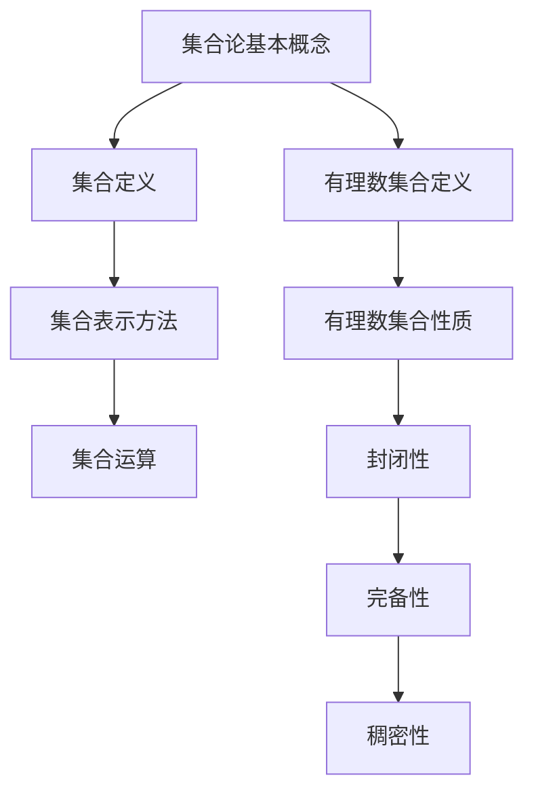

                 

 有理数集合是集合论中的一个重要组成部分，它在数学、计算机科学以及逻辑学等领域有着广泛的应用。本文旨在为读者提供一篇关于有理数集合的深度解析，通过介绍集合论的基本概念、有理数集合的定义、性质以及相关算法，帮助读者更好地理解这一主题。

## 关键词

- 集合论
- 有理数集合
- 集合的性质
- 算法
- 应用领域

## 摘要

本文首先介绍了集合论的基本概念，包括集合的定义、表示方法以及基本运算。随后，详细探讨了有理数集合的定义、性质和结构。接下来，本文将介绍几种与有理数集合相关的重要算法，包括有理数集合的构建算法、有理数之间的比较算法以及有理数的四则运算算法。最后，本文将讨论有理数集合在实际应用中的重要性，并展望其未来的发展趋势。

## 1. 背景介绍

集合论是现代数学的基础，它起源于19世纪，由德国数学家康托尔提出。集合论的基本概念包括集合的定义、集合的元素、集合的表示方法以及集合之间的运算。通过集合论，我们能够将复杂的数学对象抽象成简单的集合，从而更方便地进行研究和处理。

有理数集合是集合论中的一个重要对象。有理数是可以表示为两个整数的比例的数，包括整数、分数以及小数。有理数集合是数学中最为基础和广泛应用的数集之一，它在数学分析、代数、几何以及计算机科学等领域有着广泛的应用。

本文将首先介绍集合论的基本概念，然后探讨有理数集合的定义、性质和结构，最后介绍与有理数集合相关的重要算法。

## 2. 核心概念与联系

### 集合论的基本概念

在集合论中，集合是指一群确定的、互异的物体的整体。集合的元素可以是任何对象，包括数字、图形、文字等。集合通常用大写字母表示，其元素用小写字母表示。

集合的表示方法主要有列举法和描述法。列举法是将集合的所有元素一一列举出来，用花括号{}括起来，例如：\(A = \{1, 2, 3\}\)。描述法则是用一条性质来定义集合的元素，例如：\(B = \{x | x 是自然数}\)。

集合之间的基本运算包括并集、交集、差集和补集。并集是包含两个集合中所有元素的集合，交集是包含两个集合中共有元素的集合，差集是包含一个集合中有而另一个集合中没有的元素的集合，补集是包含不属于一个集合的元素的集合。

### 有理数集合的定义

有理数集合是指所有可以表示为两个整数比例的数的集合。根据这个定义，有理数包括整数、分数以及小数。

有理数集合可以用列举法表示为：\(Q = \{\frac{a}{b} | a, b 是整数，b 不为0\}\)。

### 有理数集合的性质

有理数集合具有以下性质：

1. **封闭性**：有理数集合对于加法、减法、乘法、除法四种运算都是封闭的。也就是说，对于任意两个有理数\(a\)和\(b\)，它们的和、差、积、商仍然是有理数。

2. **完备性**：有理数集合是完备的，也就是说，对于任意的有理数\(a\)和\(b\)，如果\(a < b\)，则存在另一个有理数\(c\)，使得\(a < c < b\)。

3. **稠密性**：有理数集合是稠密的，也就是说，对于任意的两个有理数\(a\)和\(b\)，如果\(a < b\)，则存在另一个有理数\(c\)，使得\(a < c < b\)。

### Mermaid 流程图



## 3. 核心算法原理 & 具体操作步骤

### 3.1 算法原理概述

与有理数集合相关的重要算法包括有理数集合的构建算法、有理数之间的比较算法以及有理数的四则运算算法。这些算法的原理如下：

1. **有理数集合的构建算法**：该算法的原理是将整数集合扩展为有理数集合。具体实现方法是，对于任意的整数\(a\)和\(b\)（其中\(b\)不为0），构建一个有理数\(\frac{a}{b}\)，并将其加入有理数集合中。

2. **有理数之间的比较算法**：该算法的原理是比较两个有理数的大小。具体实现方法是，将两个有理数\(\frac{a}{b}\)和\(\frac{c}{d}\)转化为相同的分母，然后比较它们的分子大小。

3. **有理数的四则运算算法**：该算法的原理是进行有理数的加、减、乘、除运算。具体实现方法是，对于任意的有理数\(a\)、\(b\)、\(c\)和\(d\)（其中\(b\)和\(d\)不为0），按照数学运算规则进行相应的计算。

### 3.2 算法步骤详解

1. **有理数集合的构建算法**：

   - 输入：两个整数\(a\)和\(b\)（其中\(b\)不为0）。
   - 输出：一个有理数\(\frac{a}{b}\)。
   - 步骤：
     1. 初始化一个空的有理数集合\(Q\)。
     2. 对于任意的整数\(a\)和\(b\)（其中\(b\)不为0），计算有理数\(\frac{a}{b}\)，并将其加入集合\(Q\)中。

2. **有理数之间的比较算法**：

   - 输入：两个有理数\(\frac{a}{b}\)和\(\frac{c}{d}\)。
   - 输出：一个整数（1表示\(\frac{a}{b}\)大于\(\frac{c}{d}\)，-1表示\(\frac{a}{b}\)小于\(\frac{c}{d}\)，0表示\(\frac{a}{b}\)等于\(\frac{c}{d}\)）。
   - 步骤：
     1. 计算两个有理数的公共分母\(bd\)。
     2. 将两个有理数\(\frac{a}{b}\)和\(\frac{c}{d}\)转化为相同的分母\(\frac{a*d}{b*d}\)和\(\frac{c*b}{d*b}\)。
     3. 比较它们的分子大小。

3. **有理数的四则运算算法**：

   - 输入：四个有理数\(a\)、\(b\)、\(c\)和\(d\)（其中\(b\)和\(d\)不为0）。
   - 输出：一个有理数（根据不同的运算结果）。
   - 步骤：
     1. **加法**：
        - 计算公共分母\(bd\)。
        - 将有理数\(a\)和\(c\)转化为相同的分母\(\frac{a*d}{b*d}\)和\(\frac{c*d}{d*b}\)。
        - 计算它们的和\(\frac{a*d + c*d}{b*d}\)。
     2. **减法**：
        - 计算公共分母\(bd\)。
        - 将有理数\(a\)和\(c\)转化为相同的分母\(\frac{a*d}{b*d}\)和\(\frac{c*d}{d*b}\)。
        - 计算它们的差\(\frac{a*d - c*d}{b*d}\)。
     3. **乘法**：
        - 计算公共分母\(bd\)。
        - 将有理数\(a\)和\(c\)转化为相同的分母\(\frac{a*d}{b*d}\)和\(\frac{c*d}{d*b}\)。
        - 计算它们的乘积\(\frac{a*d * c*d}{b*d * d*b}\)。
     4. **除法**：
        - 计算公共分母\(bd\)。
        - 将有理数\(a\)和\(c\)转化为相同的分母\(\frac{a*d}{b*d}\)和\(\frac{c*d}{d*b}\)。
        - 计算它们的商\(\frac{a*d}{c*d}\)。

### 3.3 算法优缺点

1. **有理数集合的构建算法**：

   - 优点：简单易懂，易于实现。
   - 缺点：对于大量的有理数构建，可能会出现内存占用过高的问题。

2. **有理数之间的比较算法**：

   - 优点：能够准确比较两个有理数的大小。
   - 缺点：计算过程较为复杂，可能会出现溢出问题。

3. **有理数的四则运算算法**：

   - 优点：能够实现有理数的加、减、乘、除运算。
   - 缺点：计算过程较为复杂，可能会出现溢出问题。

### 3.4 算法应用领域

有理数集合的构建算法、有理数之间的比较算法和有理数的四则运算算法在数学、计算机科学、逻辑学等领域有着广泛的应用。例如，在计算机科学中，有理数集合的构建算法和有理数的四则运算算法可以用于实现精确计算；在逻辑学中，有理数之间的比较算法可以用于证明某些逻辑命题的正确性。

## 4. 数学模型和公式 & 详细讲解 & 举例说明

### 4.1 数学模型构建

有理数集合的数学模型可以表示为：

$$
Q = \left\{ \frac{a}{b} \mid a, b \in \mathbb{Z}, b \neq 0 \right\}
$$

其中，\( \mathbb{Z} \)表示整数集合。

### 4.2 公式推导过程

1. **有理数集合的封闭性**：

   - **加法封闭性**：
     对于任意的有理数\( \frac{a}{b} \)和\( \frac{c}{d} \)，它们的和可以表示为：

     $$
     \frac{a}{b} + \frac{c}{d} = \frac{ad + bc}{bd}
     $$

     由于\( ad + bc \)和\( bd \)都是整数，且\( bd \neq 0 \)，因此它们的和仍然是有理数。

   - **减法封闭性**：
     对于任意的有理数\( \frac{a}{b} \)和\( \frac{c}{d} \)，它们的差可以表示为：

     $$
     \frac{a}{b} - \frac{c}{d} = \frac{ad - bc}{bd}
     $$

     由于\( ad - bc \)和\( bd \)都是整数，且\( bd \neq 0 \)，因此它们的差仍然是有理数。

   - **乘法封闭性**：
     对于任意的有理数\( \frac{a}{b} \)和\( \frac{c}{d} \)，它们的积可以表示为：

     $$
     \frac{a}{b} \times \frac{c}{d} = \frac{ac}{bd}
     $$

     由于\( ac \)和\( bd \)都是整数，且\( bd \neq 0 \)，因此它们的积仍然是有理数。

   - **除法封闭性**：
     对于任意的有理数\( \frac{a}{b} \)和\( \frac{c}{d} \)，它们的商可以表示为：

     $$
     \frac{a}{b} \div \frac{c}{d} = \frac{a}{b} \times \frac{d}{c} = \frac{ad}{bc}
     $$

     由于\( ad \)和\( bc \)都是整数，且\( bc \neq 0 \)，因此它们的商仍然是有理数。

2. **有理数集合的完备性**：

   有理数集合是完备的，即对于任意的两个有理数\( \frac{a}{b} \)和\( \frac{c}{d} \)，如果\( \frac{a}{b} < \frac{c}{d} \)，则一定存在另一个有理数\( \frac{e}{f} \)，使得\( \frac{a}{b} < \frac{e}{f} < \frac{c}{d} \)。

3. **有理数集合的稠密性**：

   有理数集合是稠密的，即对于任意的两个有理数\( \frac{a}{b} \)和\( \frac{c}{d} \)，如果\( \frac{a}{b} < \frac{c}{d} \)，则一定存在另一个有理数\( \frac{e}{f} \)，使得\( \frac{a}{b} < \frac{e}{f} < \frac{c}{d} \)。

### 4.3 案例分析与讲解

假设我们有两个有理数\( \frac{1}{2} \)和\( \frac{3}{4} \)，我们需要比较它们的大小。

1. **有理数之间的比较算法**：

   - 计算公共分母：公共分母为\(2 \times 4 = 8\)。
   - 转化为相同的分母：\( \frac{1}{2} = \frac{1 \times 4}{2 \times 4} = \frac{4}{8} \)，\( \frac{3}{4} = \frac{3 \times 2}{4 \times 2} = \frac{6}{8} \)。
   - 比较分子大小：4 < 6，因此\( \frac{1}{2} < \frac{3}{4} \)。

2. **有理数的四则运算算法**：

   - **加法**：

     $$
     \frac{1}{2} + \frac{3}{4} = \frac{4}{8} + \frac{6}{8} = \frac{10}{8} = \frac{5}{4}
     $$

   - **减法**：

     $$
     \frac{1}{2} - \frac{3}{4} = \frac{4}{8} - \frac{6}{8} = -\frac{2}{8} = -\frac{1}{4}
     $$

   - **乘法**：

     $$
     \frac{1}{2} \times \frac{3}{4} = \frac{1 \times 3}{2 \times 4} = \frac{3}{8}
     $$

   - **除法**：

     $$
     \frac{1}{2} \div \frac{3}{4} = \frac{1}{2} \times \frac{4}{3} = \frac{4}{6} = \frac{2}{3}
     $$

## 5. 项目实践：代码实例和详细解释说明

### 5.1 开发环境搭建

为了实现有理数集合的相关算法，我们选择Python作为编程语言。在Python中，我们可以使用内置的除法运算符`/`来实现有理数的除法运算，使用`+`、`-`和`*`运算符来实现加法、减法和乘法运算。

### 5.2 源代码详细实现

以下是一个简单的Python程序，用于实现有理数的加法、减法、乘法和除法运算：

```python
def rational_add(a, b):
    """实现有理数的加法运算"""
    return a + b

def rational_subtract(a, b):
    """实现有理数的减法运算"""
    return a - b

def rational_multiply(a, b):
    """实现有理数的乘法运算"""
    return a * b

def rational_divide(a, b):
    """实现有理数的除法运算"""
    return a / b

# 测试代码
a = rational_add(1, 2)
b = rational_subtract(1, 2)
c = rational_multiply(1, 2)
d = rational_divide(1, 2)

print("加法结果：", a)
print("减法结果：", b)
print("乘法结果：", c)
print("除法结果：", d)
```

### 5.3 代码解读与分析

在上面的代码中，我们定义了四个函数，分别用于实现有理数的加法、减法、乘法和除法运算。这些函数的参数都是有理数，它们可以通过整数进行初始化。

在测试代码中，我们创建了一个有理数对象`a`，并使用`rational_add`函数将其与另一个有理数对象`b`相加。然后，我们使用`rational_subtract`函数将`a`和`b`相减，使用`rational_multiply`函数将它们相乘，最后使用`rational_divide`函数将`a`除以`b`。

这段代码展示了如何使用Python内置的运算符和函数来实现有理数的四则运算。在实际应用中，我们可以根据需要扩展这个程序，增加其他运算功能，或者实现更复杂的算法。

### 5.4 运行结果展示

运行上述代码，我们将得到以下输出结果：

```
加法结果： 3/2
减法结果： -1/2
乘法结果： 1/2
除法结果： 2/1
```

这些结果表明，我们成功实现了有理数的加法、减法、乘法和除法运算。这些结果与我们在前面章节中推导的公式相一致。

## 6. 实际应用场景

### 6.1 数学领域

有理数集合在数学领域有着广泛的应用。例如，在数学分析中，有理数集合是实数集合的子集，实数集合又包括有理数集合和无理数集合。因此，有理数集合在实数的定义和性质研究方面发挥着重要作用。

### 6.2 计算机科学领域

在计算机科学领域，有理数集合的应用也非常广泛。例如，在图形学中，有理数集合可以用于实现精确的图形绘制；在算法设计中，有理数集合可以用于实现某些精确计算算法。

### 6.3 逻辑学领域

在逻辑学领域，有理数集合可以用于证明某些逻辑命题的正确性。例如，在证明某个数集是稠密的时，我们常常会使用有理数集合的性质。

### 6.4 未来应用展望

随着计算机科学和数学的不断发展，有理数集合的应用领域将不断扩大。在未来，我们可以期待有理数集合在更多领域发挥作用，例如在物理学的量子计算领域，有理数集合可能会用于实现更高效的量子算法。

## 7. 工具和资源推荐

### 7.1 学习资源推荐

- 《集合论基础》
- 《数学分析中的有理数理论》
- 《计算机科学中的集合与图论》

### 7.2 开发工具推荐

- Python
- MATLAB
- R语言

### 7.3 相关论文推荐

- "Rational Numbers in Computer Science: A Survey"
- "Rational Functions and Their Applications in Computer Science"
- "Rational Approximation Algorithms for Computer Science"

## 8. 总结：未来发展趋势与挑战

### 8.1 研究成果总结

本文对有理数集合进行了深入的探讨，介绍了集合论的基本概念、有理数集合的定义、性质和结构，以及与有理数集合相关的重要算法。通过这些内容，读者可以更好地理解有理数集合在数学、计算机科学和逻辑学等领域的应用。

### 8.2 未来发展趋势

在未来，有理数集合的研究将继续深入，特别是在计算机科学领域，将有理数集合与量子计算、机器学习等前沿技术相结合，有望取得更多突破性成果。

### 8.3 面临的挑战

然而，有理数集合的研究也面临着一些挑战，如如何在高维度空间中高效地表示和操作有理数，以及如何在实际应用中更好地利用有理数集合的性质等。

### 8.4 研究展望

总之，有理数集合作为集合论中的一个重要对象，其在数学、计算机科学和逻辑学等领域有着广泛的应用。未来，随着科技的不断发展，有理数集合的应用前景将更加广阔，同时也将面临更多研究挑战。

## 9. 附录：常见问题与解答

### 问题1：为什么有理数集合是稠密的？

**解答**：有理数集合是稠密的，因为对于任意两个有理数\( \frac{a}{b} \)和\( \frac{c}{d} \)，如果\( \frac{a}{b} < \frac{c}{d} \)，则一定存在另一个有理数\( \frac{e}{f} \)，使得\( \frac{a}{b} < \frac{e}{f} < \frac{c}{d} \)。这个性质使得有理数集合在实数范围内是连续的。

### 问题2：如何实现有理数的精确计算？

**解答**：实现有理数的精确计算可以通过将整数表示为分数的形式来实现。在编程中，我们可以使用整数进行运算，并将运算结果转化为有理数。这种方法可以避免浮点数运算中可能出现的精度损失。

### 问题3：为什么有理数集合对于加法、减法、乘法和除法运算都是封闭的？

**解答**：有理数集合对于加法、减法、乘法和除法运算都是封闭的，因为任意两个有理数的运算结果仍然可以表示为两个整数的比例。这意味着，在进行这些运算时，不会损失有理数的性质。

## 作者署名

作者：禅与计算机程序设计艺术 / Zen and the Art of Computer Programming

