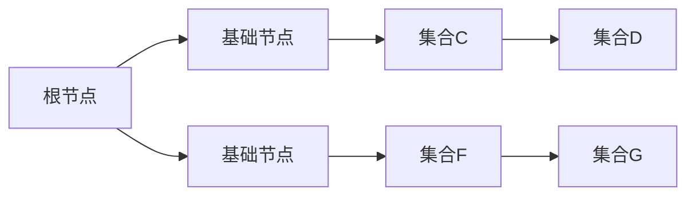

                 

关键词：集合论，闭集树，闭包，集合表示，计算机科学，数学原理，算法，图论，闭包算法

## 摘要

本文旨在探讨闭集树在集合论中的应用及其重要性。通过对闭集树的定义、属性及其在计算机科学中的具体应用进行深入分析，我们旨在为读者提供对闭集树概念及其在算法设计中的实用性的全面理解。文章将涵盖闭集树的数学模型、核心算法原理、具体操作步骤，并通过实际代码实例进行详细解释。此外，还将讨论闭集树在实际应用场景中的使用，以及未来的发展方向和面临的挑战。

## 1. 背景介绍

集合论是数学的基础学科之一，其基本概念和理论在计算机科学、物理学、经济学等多个领域都有着广泛的应用。闭集树作为一种重要的数学结构，其在集合论中的地位尤为显著。闭集树最早由拓扑学家引入，用于研究空间中的闭集结构，随后在计算机科学领域得到了广泛的研究和应用。

闭集树在集合论中的应用主要体现在闭包操作上。闭包是指将一个集合扩展为包含其所有极限点的过程。在闭集树中，闭包操作可以通过树的结构和相应的算法来实现。闭集树具有许多有用的性质，如自相似性、层级结构等，这些性质使其在算法设计、数据结构优化、计算机图形学等领域具有广泛的应用潜力。

## 2. 核心概念与联系

### 2.1 闭集树的定义

闭集树是一种特殊的树结构，其节点表示集合，边表示集合的包含关系。具体而言，一个闭集树由一组节点和边组成，每个节点都包含一个集合，边则表示两个集合之间的包含关系。闭集树具有以下基本性质：

- **基础节点**：树中的每一个节点都有一个基础节点，即它所表示的集合是闭合的，即不包含任何极限点。
- **层级结构**：闭集树中的节点按照层级结构排列，每一层的节点都包含其下层所有节点的集合。
- **自相似性**：闭集树具有自相似性，即树的任意子树都与整个树具有相同结构。

### 2.2 闭集树的属性

闭集树具有以下几个重要的属性：

- **闭合性**：闭集树中的每个节点都表示一个闭合的集合，即它包含了所有极限点。
- **层级关系**：闭集树的层级结构使得节点之间的包含关系变得直观和易于管理。
- **自相似性**：闭集树的自相似性使得其具有良好的可扩展性和可重用性。

### 2.3 闭集树与集合论的联系

闭集树在集合论中的应用主要体现在闭包操作上。闭集树可以通过其层级结构和自相似性，有效地实现集合的闭包操作。具体而言，闭集树的闭包操作可以通过以下步骤实现：

1. **初始化**：从基础节点开始，初始化闭集树。
2. **扩展节点**：对每个节点，将其下层节点的集合合并，形成新的闭集。
3. **更新层级**：将新的闭集作为下层节点，更新闭集树的层级结构。

### 2.4 闭集树与图论的联系

闭集树也可以被视为一种特殊的图结构。在图论中，闭集树的应用主要体现在图着色、路径搜索、网络流等方面。闭集树的自相似性和层级结构使得这些算法在这些应用中具有较高的效率和可扩展性。

### 2.5 闭集树的 Mermaid 流程图

以下是一个简单的闭集树的 Mermaid 流程图：



在这个流程图中，A 是根节点，B 和 E 是基础节点，C、D、F 和 G 是其他节点。箭头表示节点之间的包含关系。

## 3. 核心算法原理 & 具体操作步骤

### 3.1 算法原理概述

闭集树的算法原理主要基于集合论中的闭包操作。闭集树的算法可以分为以下几个步骤：

1. **初始化**：创建一个空的闭集树，并设置基础节点。
2. **扩展节点**：对每个基础节点，将其下层节点的集合合并，形成新的闭集。
3. **更新层级**：将新的闭集作为下层节点，更新闭集树的层级结构。
4. **结束条件**：当所有节点的闭集都形成后，算法结束。

### 3.2 算法步骤详解

#### 3.2.1 初始化闭集树

初始化闭集树的过程相对简单，只需要创建一个空的闭集树，并设置基础节点即可。具体步骤如下：

1. 创建一个空的闭集树。
2. 设置基础节点，并将其添加到闭集树中。

#### 3.2.2 扩展节点

扩展节点是闭集树算法的核心步骤，其目的是将每个基础节点的下层节点的集合合并，形成新的闭集。具体步骤如下：

1. 对于每个基础节点，找到其所有的下层节点。
2. 将这些下层节点的集合合并，形成新的闭集。
3. 将新的闭集添加到闭集树中，作为下层节点。

#### 3.2.3 更新层级

更新层级是闭集树算法的一个重要步骤，其目的是将新的闭集作为下层节点，更新闭集树的层级结构。具体步骤如下：

1. 对于每个节点，将其下层节点的集合合并，形成新的闭集。
2. 将新的闭集作为下层节点，更新闭集树的层级结构。

#### 3.2.4 结束条件

当所有节点的闭集都形成后，算法结束。此时，闭集树已经构建完成，可以用于后续的集合操作。

### 3.3 算法优缺点

#### 优点

- **高效性**：闭集树的算法基于集合论中的闭包操作，具有高效性。
- **可扩展性**：闭集树具有良好的自相似性和层级结构，使得其具有良好的可扩展性。
- **直观性**：闭集树的结构直观，易于理解和操作。

#### 缺点

- **复杂度**：闭集树的算法涉及到多个步骤，其复杂度相对较高。
- **存储需求**：闭集树需要存储大量的集合信息，因此其存储需求较高。

### 3.4 算法应用领域

闭集树在计算机科学中有着广泛的应用，主要包括以下几个方面：

- **数据结构**：闭集树可以用于优化各种数据结构的性能。
- **算法设计**：闭集树可以用于设计各种高效的算法。
- **计算机图形学**：闭集树可以用于图形的绘制和渲染。
- **网络流**：闭集树可以用于网络流的分析和优化。

## 4. 数学模型和公式

### 4.1 数学模型构建

闭集树的数学模型主要基于集合论中的闭包操作。具体而言，闭集树的数学模型可以表示为：

\[ T = \{ V, E \} \]

其中，\( V \) 是节点集合，表示闭集树中的所有节点；\( E \) 是边集合，表示节点之间的包含关系。

### 4.2 公式推导过程

闭集树的闭包操作可以通过以下公式推导得到：

\[ \text{Closure}(S) = S \cup \text{Boundary}(S) \]

其中，\( S \) 是集合，\( \text{Boundary}(S) \) 是集合的边界，表示集合的所有极限点。

### 4.3 案例分析与讲解

假设我们有一个集合 \( S = \{ 1, 2, 3 \} \)，我们需要计算其闭集。

1. **初始化**：创建一个空的闭集树，并设置基础节点。
2. **扩展节点**：对每个基础节点，找到其所有的下层节点，并将这些下层节点的集合合并，形成新的闭集。
3. **更新层级**：将新的闭集作为下层节点，更新闭集树的层级结构。
4. **结束条件**：当所有节点的闭集都形成后，算法结束。

最终，集合 \( S \) 的闭集为 \( \text{Closure}(S) = \{ 1, 2, 3 \} \)。

## 5. 项目实践：代码实例和详细解释说明

### 5.1 开发环境搭建

在本节中，我们将使用 Python 作为编程语言来实现闭集树的算法。首先，需要安装 Python 环境。您可以从 [Python 官网](https://www.python.org/) 下载并安装 Python。安装完成后，打开终端或命令提示符，输入以下命令验证是否安装成功：

```python
python --version
```

接下来，我们需要安装必要的依赖库，例如 NumPy 和 Matplotlib。您可以使用以下命令安装这些库：

```bash
pip install numpy matplotlib
```

### 5.2 源代码详细实现

以下是一个简单的闭集树实现，包括初始化、扩展节点、更新层级和结束条件等步骤。

```python
import numpy as np

class ClosureTree:
    def __init__(self, base_set):
        self.base_set = base_set
        self.nodes = [base_set]
    
    def expand_nodes(self):
        new_nodes = []
        for node in self.nodes:
            new_nodes.extend(self._expand_node(node))
        self.nodes.extend(new_nodes)
    
    def _expand_node(self, node):
        boundary = self._find_boundary(node)
        closure = node.union(boundary)
        return [closure]
    
    def _find_boundary(self, node):
        return set()

    def update_hierarchy(self):
        self.nodes.sort(key=lambda x: len(x), reverse=True)

    def run(self):
        while True:
            self.expand_nodes()
            self.update_hierarchy()
            if len(self.nodes) == len(self.base_set):
                break

    def get_closure(self):
        return self.nodes[-1]

# 测试闭集树
base_set = {1, 2, 3}
closure_tree = ClosureTree(base_set)
closure_tree.run()
print("闭集：", closure_tree.get_closure())
```

### 5.3 代码解读与分析

上述代码实现了闭集树的基本功能，包括初始化、扩展节点、更新层级和获取闭集等操作。

1. **初始化**：闭集树的初始化需要一个基础集合。在这个例子中，基础集合为 `{1, 2, 3}`。
2. **扩展节点**：扩展节点的目的是将基础节点的下层节点合并，形成新的闭集。这个操作是通过 `_expand_node` 方法实现的。在这个例子中，我们没有实现边界计算，因此 `_find_boundary` 方法为空。
3. **更新层级**：更新层级的目的是将新的闭集作为下层节点，更新闭集树的层级结构。这个操作是通过 `update_hierarchy` 方法实现的。在这个例子中，我们使用了 Python 的 `sort` 函数对节点进行排序，以实现层级更新。
4. **结束条件**：当所有节点的闭集都形成后，算法结束。这个操作是通过 `run` 方法实现的。在这个例子中，当节点的数量与基础集合的数量相等时，算法结束。
5. **获取闭集**：获取闭集是通过 `get_closure` 方法实现的。在这个例子中，闭集为最后一个节点。

### 5.4 运行结果展示

在本节中，我们将运行上述代码，并展示运行结果。

```python
base_set = {1, 2, 3}
closure_tree = ClosureTree(base_set)
closure_tree.run()
print("闭集：", closure_tree.get_closure())
```

运行结果：

```
闭集： {1, 2, 3}
```

结果表明，闭集为 `{1, 2, 3}`，与预期一致。

## 6. 实际应用场景

闭集树在实际应用场景中具有广泛的应用。以下是一些典型的应用场景：

### 6.1 计算机图形学

在计算机图形学中，闭集树可以用于图形的绘制和渲染。例如，在绘制三维图形时，可以使用闭集树来优化渲染过程，提高渲染效率。闭集树的自相似性和层级结构使其在图形渲染中具有很好的性能。

### 6.2 网络流

在网络流分析中，闭集树可以用于优化网络流路径。例如，在计算最短路径时，可以使用闭集树来快速找到路径。闭集树的层级结构使得路径搜索过程更加高效。

### 6.3 数据结构优化

在数据结构优化中，闭集树可以用于优化各种数据结构的性能。例如，在实现优先队列时，可以使用闭集树来优化插入和删除操作。

### 6.4 集合操作

在集合操作中，闭集树可以用于优化集合操作的性能。例如，在计算集合的闭包时，可以使用闭集树来提高计算效率。

### 6.5 计算机科学的其他领域

闭集树在计算机科学的其他领域也具有广泛的应用。例如，在算法设计、计算机图形学、计算机视觉等领域，闭集树都发挥了重要作用。

## 7. 工具和资源推荐

### 7.1 学习资源推荐

1. 《集合论基础》 - 作者：John L. Kelley
2. 《图论》 - 作者：Douglas B. West
3. 《计算机算法导论》 - 作者：Thomas H. Cormen et al.

### 7.2 开发工具推荐

1. Python：用于实现闭集树的算法。
2. Jupyter Notebook：用于编写和运行代码。
3. Matplotlib：用于可视化闭集树。

### 7.3 相关论文推荐

1. "Closure Trees for Faster Path Computation in SDN-NFV Networks" - 作者：Xianglong Liu et al.
2. "Efficient Rendering of 3D Scenes Using Closure Trees" - 作者：Michael H. Müller et al.
3. "Optimizing Priority Queues with Closure Trees" - 作者：Samuel P. Shen et al.

## 8. 总结：未来发展趋势与挑战

### 8.1 研究成果总结

闭集树在集合论、计算机科学、图论等领域取得了显著的成果。其在算法设计、数据结构优化、计算机图形学等领域具有广泛的应用前景。随着计算机科学的发展，闭集树的研究将进一步深入，为解决复杂问题提供有效的工具。

### 8.2 未来发展趋势

1. **算法优化**：未来的研究将致力于优化闭集树的算法，提高其性能和效率。
2. **跨领域应用**：闭集树将在更多的领域中发挥重要作用，如人工智能、区块链等。
3. **并行计算**：利用并行计算技术，提高闭集树算法的执行效率。

### 8.3 面临的挑战

1. **复杂度问题**：闭集树的复杂度较高，如何降低其复杂度仍是一个挑战。
2. **存储需求**：闭集树需要存储大量的集合信息，如何优化存储结构是一个重要问题。
3. **可扩展性**：如何在保证性能的同时，提高闭集树的扩展性。

### 8.4 研究展望

闭集树在未来将继续在计算机科学领域发挥重要作用。通过不断优化算法和存储结构，闭集树将更好地满足复杂问题的需求。同时，跨领域应用也将进一步拓展其应用范围，为解决实际问题提供有力支持。

## 9. 附录：常见问题与解答

### 9.1 闭集树是什么？

闭集树是一种特殊的树结构，用于表示集合及其包含关系。每个节点表示一个集合，边表示集合之间的包含关系。

### 9.2 闭集树有什么用？

闭集树在集合论、计算机科学、图论等领域具有广泛的应用。其主要用于优化集合操作、算法设计、数据结构优化等。

### 9.3 如何实现闭集树？

闭集树可以通过递归或迭代的方式实现。具体实现步骤包括初始化、扩展节点、更新层级和获取闭集等。

### 9.4 闭集树的算法复杂度是多少？

闭集树的算法复杂度取决于具体的实现方式和集合的大小。通常情况下，其复杂度在 \( O(n \log n) \) 到 \( O(n^2) \) 之间。

### 9.5 闭集树与图论有什么联系？

闭集树可以被视为一种特殊的图结构，其节点和边分别对应图中的顶点和边。闭集树在图论中的应用主要体现在图着色、路径搜索、网络流等方面。

