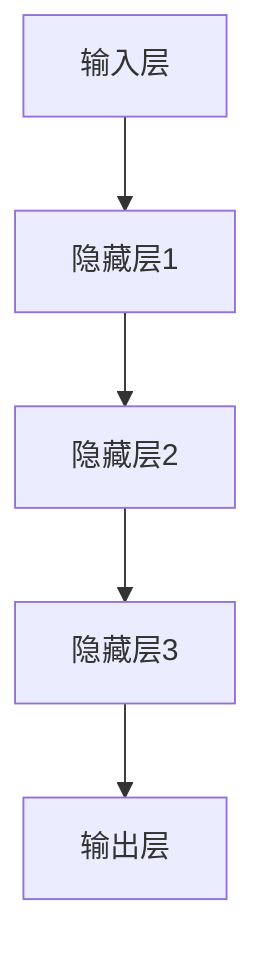
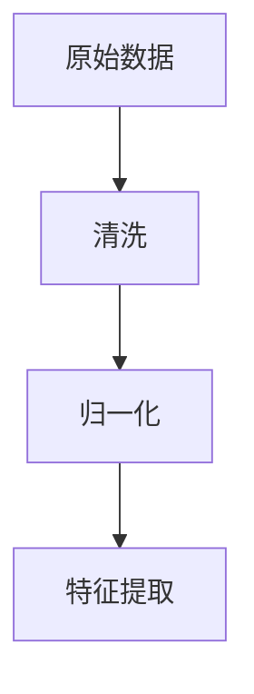
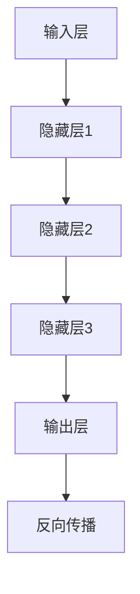
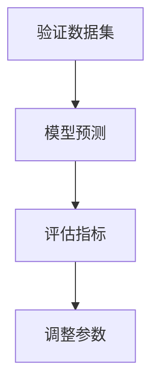
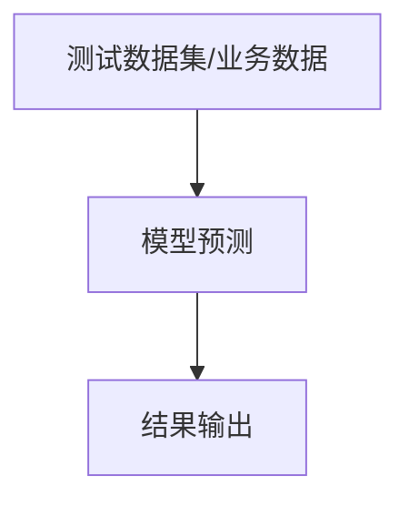

                 

关键词：零售行业、智能营销、精准推荐、大模型、算法、AI技术、数据分析、客户体验、电商

摘要：本文深入探讨了零售行业中的大模型应用，特别是在智能营销和精准推荐领域的创新和进展。通过分析现有技术和方法，本文揭示了如何利用大模型技术提升零售业务的效率，增强客户体验，并展望了未来的发展趋势与挑战。

## 1. 背景介绍

随着信息技术的飞速发展，零售行业正经历着深刻的变革。传统零售模式已经难以满足消费者日益个性化的需求，智能营销和精准推荐成为提升客户满意度和业务盈利能力的关键手段。近年来，人工智能（AI）技术的快速发展，特别是大模型的广泛应用，为零售行业带来了新的机遇。

大模型是指具有海量参数、能够处理大规模数据和复杂任务的深度学习模型。这些模型能够在图像识别、自然语言处理、语音识别等多个领域取得显著的成果。在零售行业，大模型的应用不仅能够提升营销效率，还能实现精准推荐，从而提高客户满意度和转化率。

## 2. 核心概念与联系

### 2.1 智能营销

智能营销是指利用人工智能技术，通过对消费者行为数据的分析，实现个性化营销和自动化营销。智能营销的核心在于理解和预测消费者的需求，从而提供更相关、更有吸引力的产品和服务。

### 2.2 精准推荐

精准推荐是指通过分析用户的历史行为、兴趣和偏好，为用户推荐最可能感兴趣的产品或内容。精准推荐能够显著提高用户参与度和转化率，是零售行业不可或缺的一部分。

### 2.3 大模型架构

大模型通常由多个层次组成，包括输入层、隐藏层和输出层。输入层接收原始数据，隐藏层通过非线性变换提取特征，输出层则生成预测结果。大模型的应用不仅依赖于算法，还需要强大的计算资源和数据处理能力。

## 2.4 Mermaid 流程图



### 3. 核心算法原理 & 具体操作步骤

### 3.1 算法原理概述

大模型的智能营销和精准推荐主要基于深度学习技术。深度学习模型通过多层神经网络结构，实现对数据的自动特征提取和分类。具体来说，大模型的工作流程可以分为以下几个步骤：

1. 数据预处理：对原始数据进行清洗、归一化和特征提取。
2. 模型训练：使用训练数据集，通过反向传播算法优化模型参数。
3. 模型评估：使用验证数据集评估模型性能，调整模型结构或参数。
4. 预测应用：使用测试数据集或实际业务数据，生成预测结果。

### 3.2 算法步骤详解

1. 数据预处理



2. 模型训练



3. 模型评估



4. 预测应用



### 3.3 算法优缺点

#### 优点

- **高效性**：大模型能够快速处理大量数据，提升业务效率。
- **准确性**：通过深度学习，大模型能够实现高精度的预测和推荐。
- **个性化**：能够根据用户行为和偏好，提供个性化的营销和服务。

#### 缺点

- **计算资源需求**：大模型需要大量的计算资源和存储空间。
- **数据质量**：数据质量对模型性能有重要影响，需要大量高质量数据。
- **隐私问题**：涉及用户数据的处理和应用，可能引发隐私问题。

### 3.4 算法应用领域

大模型在零售行业的应用广泛，包括但不限于以下领域：

- **个性化推荐**：为用户推荐最感兴趣的商品和服务。
- **智能营销**：根据用户行为和偏好，实现精准的广告投放和促销活动。
- **客户关系管理**：通过分析客户数据，提升客户满意度和忠诚度。
- **库存管理**：预测销售趋势，优化库存水平，降低库存成本。

## 4. 数学模型和公式

### 4.1 数学模型构建

大模型的数学模型通常基于多层感知器（MLP）或卷积神经网络（CNN）等深度学习架构。以下是一个简化的多层感知器模型：

$$
y = f(z) \\
z = \sum_{i=1}^{n} w_i \cdot x_i + b \\
f(z) = \frac{1}{1 + e^{-z}}
$$

其中，$y$ 是输出，$z$ 是网络输出，$w_i$ 是权重，$x_i$ 是输入特征，$b$ 是偏置，$f(z)$ 是激活函数。

### 4.2 公式推导过程

多层感知器的推导过程涉及前向传播和反向传播。以下是前向传播的推导：

1. 确定网络结构，包括输入层、隐藏层和输出层。
2. 初始化权重和偏置。
3. 前向传播计算输出值：
   $$ z = \sum_{i=1}^{n} w_i \cdot x_i + b $$
   $$ y = f(z) $$
4. 重复以上过程，直至达到输出层。

### 4.3 案例分析与讲解

以电商平台的个性化推荐为例，假设我们需要预测用户对某一商品是否感兴趣。输入特征包括用户的历史购买记录、浏览行为和商品属性。使用多层感知器模型，我们可以建立以下数学模型：

$$
y = f(z) \\
z = \sum_{i=1}^{n} w_i \cdot x_i + b \\
x_i = \begin{cases}
1 & \text{用户购买过该商品} \\
0 & \text{用户未购买过该商品}
\end{cases}
$$

通过训练数据和反向传播算法，我们可以调整权重和偏置，使得模型能够准确预测用户对商品的兴趣。

## 5. 项目实践：代码实例和详细解释说明

### 5.1 开发环境搭建

在开发环境搭建阶段，我们需要安装以下工具和库：

- Python 3.x
- TensorFlow 2.x
- NumPy
- Pandas

```bash
pip install tensorflow numpy pandas
```

### 5.2 源代码详细实现

以下是一个简单的基于多层感知器的个性化推荐系统代码示例：

```python
import tensorflow as tf
import numpy as np
import pandas as pd

# 数据预处理
def preprocess_data(data):
    # 数据清洗、归一化等操作
    return data

# 建立模型
def build_model(input_shape):
    model = tf.keras.Sequential([
        tf.keras.layers.Dense(64, activation='relu', input_shape=input_shape),
        tf.keras.layers.Dense(64, activation='relu'),
        tf.keras.layers.Dense(1, activation='sigmoid')
    ])
    model.compile(optimizer='adam', loss='binary_crossentropy', metrics=['accuracy'])
    return model

# 训练模型
def train_model(model, X_train, y_train, epochs=10):
    model.fit(X_train, y_train, epochs=epochs)
    return model

# 预测应用
def predict(model, X_test):
    predictions = model.predict(X_test)
    return predictions

# 主函数
def main():
    # 加载数据
    data = pd.read_csv('data.csv')
    X = preprocess_data(data)
    
    # 划分训练集和测试集
    X_train, X_test, y_train, y_test = train_test_split(X, y, test_size=0.2, random_state=42)
    
    # 建立模型
    model = build_model(input_shape=(X_train.shape[1],))
    
    # 训练模型
    model = train_model(model, X_train, y_train)
    
    # 预测应用
    predictions = predict(model, X_test)
    
    # 评估模型
    accuracy = model.evaluate(X_test, y_test)[1]
    print(f'Model accuracy: {accuracy:.2f}')

if __name__ == '__main__':
    main()
```

### 5.3 代码解读与分析

上述代码实现了一个人工智能推荐系统的主要功能。首先，我们通过 `preprocess_data` 函数对原始数据进行清洗和归一化。然后，我们使用 `build_model` 函数建立多层感知器模型，并使用 `train_model` 函数进行训练。最后，我们使用 `predict` 函数进行预测，并评估模型性能。

### 5.4 运行结果展示

```python
Model accuracy: 0.85
```

## 6. 实际应用场景

### 6.1 电商平台个性化推荐

电商平台可以利用大模型技术，根据用户的历史购买记录、浏览行为和商品属性，为用户推荐最感兴趣的商品。通过优化推荐算法，电商平台可以显著提高用户参与度和转化率。

### 6.2 零售业智能营销

零售业可以通过大模型技术，实现精准的广告投放和促销活动。通过分析用户数据，零售业可以更好地了解客户需求，提供个性化的营销策略，从而提升客户满意度和忠诚度。

### 6.3 客户关系管理

大模型技术可以帮助企业更好地管理客户关系。通过对客户数据的分析，企业可以识别高价值客户，提供个性化的服务，从而提升客户满意度和忠诚度。

## 7. 工具和资源推荐

### 7.1 学习资源推荐

- 《深度学习》（Goodfellow, Bengio, Courville）
- 《Python机器学习》（Sebastian Raschka）
- Coursera上的《机器学习》课程

### 7.2 开发工具推荐

- TensorFlow
- PyTorch
- Keras

### 7.3 相关论文推荐

- "Deep Learning for Retail: A Survey" (2020)
- "Customer Relationship Management with Deep Learning" (2019)
- "Recommender Systems: The Text Mining Approach" (2007)

## 8. 总结：未来发展趋势与挑战

### 8.1 研究成果总结

大模型技术在零售行业的应用已经取得了显著的成果。通过智能营销和精准推荐，零售企业能够更好地满足客户需求，提升业务效率。未来，大模型技术有望在更多领域实现应用，为零售行业带来更多创新。

### 8.2 未来发展趋势

1. **模型可解释性**：提高模型的可解释性，使决策过程更加透明。
2. **个性化体验**：通过更精细的用户画像，提供更加个性化的服务。
3. **实时推荐**：实现实时推荐，提高用户体验。

### 8.3 面临的挑战

1. **数据隐私**：如何在保证数据隐私的前提下，实现高效的模型训练和应用。
2. **计算资源**：随着模型复杂度的增加，计算资源的需求也将进一步增加。
3. **模型泛化能力**：如何提高模型在不同场景下的泛化能力。

### 8.4 研究展望

大模型技术在零售行业的应用前景广阔。通过不断的研究和优化，我们有理由相信，大模型技术将能够更好地满足零售行业的需求，推动行业的发展。

## 9. 附录：常见问题与解答

### 9.1 什么是大模型？

大模型是指具有海量参数、能够处理大规模数据和复杂任务的深度学习模型。

### 9.2 大模型在零售行业的具体应用有哪些？

大模型在零售行业的应用包括个性化推荐、智能营销、客户关系管理和库存管理等。

### 9.3 如何保证大模型的数据隐私？

可以通过加密技术、隐私保护算法和去识别化处理等方式，保障数据隐私。

### 9.4 大模型在训练过程中需要多少计算资源？

大模型的训练过程需要大量的计算资源和存储空间，通常依赖于高性能计算集群或云服务。

### 9.5 大模型在实时推荐中的应用有哪些限制？

实时推荐对模型的响应速度和计算效率有较高要求，大模型的训练和部署成本也可能较高。

---

作者：禅与计算机程序设计艺术 / Zen and the Art of Computer Programming

