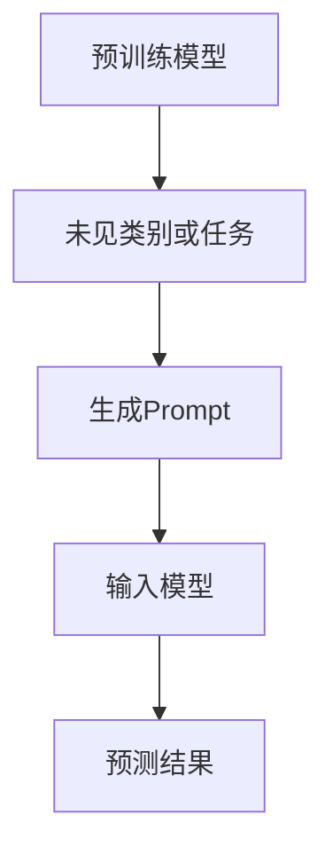

                 

关键词：零样本学习，Prompt，自然语言处理，机器学习，神经网络，预训练模型，信息检索，深度学习。

摘要：本文将深入探讨零样本学习（Zero-Shot Learning，ZSL）领域中的一个重要概念——Prompt，及其在自然语言处理和机器学习中的应用。通过阐述Prompt的核心原理、算法实现、数学模型以及实际应用案例，本文旨在为读者提供一个全面而深入的视角，以了解Prompt在零样本学习中的重要性及其未来发展趋势。

## 1. 背景介绍

零样本学习是一种机器学习范式，旨在解决模型在未见过的数据集上进行预测的问题。这一领域的研究目标是通过少量或没有标注的训练数据，让模型能够对新类别或新任务进行泛化。零样本学习在很多实际应用场景中具有重要价值，如跨领域的知识共享、智能问答系统、新药研发等。

自然语言处理（NLP）是人工智能领域的一个重要分支，它致力于使计算机能够理解、生成和响应人类语言。近年来，随着深度学习的兴起，预训练模型（如BERT、GPT等）在NLP任务中取得了显著的性能提升。这些模型通过在大规模语料库上进行预训练，获得了强大的语言理解和生成能力。

Prompt作为一种新颖的零样本学习技术，通过结合预训练模型和具体任务，实现了对未见类别或任务的快速适应。Prompt的核心思想是将任务特定信息以引导提示（prompt）的形式输入到预训练模型中，使得模型能够根据提示生成相应的预测结果。

## 2. 核心概念与联系

为了更好地理解Prompt的工作原理，我们首先需要了解以下几个核心概念：

### 2.1 零样本学习（ZSL）

零样本学习旨在解决模型在未见过的数据集上进行预测的问题。它的基本假设是模型在大规模预训练数据上已经学习到了通用的知识，从而可以对新类别或新任务进行泛化。零样本学习通常可以分为以下几种类型：

- **分类型零样本学习（Classification ZSL）**：模型对未见过的类别进行分类。
- **回归型零样本学习（Regression ZSL）**：模型对未见过的数值进行回归预测。
- **多标签零样本学习（Multi-Label ZSL）**：模型对未见过的类别进行多标签预测。

### 2.2 预训练模型

预训练模型是指在大规模语料库上进行的无监督预训练过程，目的是让模型学习到通用的语言表示和语义理解能力。预训练模型已经成为NLP领域的核心技术，许多先进的NLP任务都是基于预训练模型进行的。

### 2.3 Prompt

Prompt是一种将任务特定信息输入到预训练模型中的技术，它通常是一个引导提示（例如，一个句子或一个问题），用于指导模型生成相应的预测结果。Prompt的核心优势在于它能够将任务信息与预训练模型的知识进行有效结合，从而实现对新类别或新任务的快速适应。

### 2.4 Mermaid流程图

以下是零样本学习与Prompt之间的Mermaid流程图：



在流程图中，预训练模型在大规模语料库上进行预训练，然后面对未见类别或任务时，生成相应的Prompt，并将其输入到预训练模型中，最终得到预测结果。

## 3. 核心算法原理 & 具体操作步骤

### 3.1 算法原理概述

Prompt的核心原理是将任务特定信息以引导提示的形式输入到预训练模型中，使得模型能够根据提示生成相应的预测结果。具体来说，Prompt的生成过程可以分为以下几个步骤：

1. **数据准备**：收集大量未见类别或任务的数据，并将其转换为预训练模型的输入格式。
2. **Prompt生成**：根据具体任务，生成一个引导提示。提示通常由一个或多个句子组成，用于描述任务信息。
3. **模型输入**：将Prompt和预训练模型的输入数据进行拼接，生成模型输入。
4. **模型预测**：将模型输入输入到预训练模型中，得到预测结果。

### 3.2 算法步骤详解

以下是Prompt算法的具体操作步骤：

1. **数据准备**：首先，我们需要收集大量未见类别或任务的数据，这些数据可以是文本、图像或其他类型的传感器数据。然后，将这些数据转换为预训练模型的输入格式，例如BERT模型的输入格式是一个句子对（tokenized sentence pair）。

2. **Prompt生成**：根据具体任务，生成一个引导提示。例如，在分类任务中，提示可以是一个类别名称；在问答任务中，提示可以是一个问题。Prompt的生成通常依赖于领域知识和任务需求。

3. **模型输入**：将Prompt和预训练模型的输入数据进行拼接，生成模型输入。在BERT模型中，模型输入是一个句子对，其中第一个句子是Prompt，第二个句子是预训练模型的输入数据。

4. **模型预测**：将模型输入输入到预训练模型中，得到预测结果。预测结果可以是类别标签、数值或其他类型的数据，具体取决于任务的类型。

### 3.3 算法优缺点

Prompt算法具有以下优点：

- **快速适应**：通过生成特定的Prompt，Prompt算法能够快速适应未见类别或任务，无需重新训练预训练模型。
- **灵活性强**：Prompt可以根据具体任务需求进行灵活调整，从而实现不同任务之间的有效迁移。

然而，Prompt算法也存在一些缺点：

- **依赖任务知识**：Prompt的生成需要依赖于领域知识和任务需求，这可能导致算法在特定领域中的效果不佳。
- **解释性不强**：Prompt算法的预测过程依赖于预训练模型，因此其解释性相对较弱。

### 3.4 算法应用领域

Prompt算法在自然语言处理和机器学习领域具有广泛的应用。以下是一些典型应用场景：

- **分类任务**：例如，对未见类别进行分类，如对图片进行分类。
- **问答系统**：例如，针对特定问题生成答案，如智能客服系统。
- **文本生成**：例如，根据给定标题生成相关文章，如新闻生成系统。

## 4. 数学模型和公式

### 4.1 数学模型构建

Prompt算法的数学模型可以表示为：

$$
\text{预测结果} = f(\text{Prompt}, \text{输入数据})
$$

其中，$f$ 表示预训练模型，$\text{Prompt}$ 表示引导提示，$\text{输入数据}$ 表示预训练模型的输入。

### 4.2 公式推导过程

Prompt算法的推导过程可以分为以下几个步骤：

1. **预训练模型表示**：预训练模型可以表示为一个函数 $f$，该函数将输入数据映射为预测结果。
2. **Prompt生成**：生成一个引导提示 $\text{Prompt}$，该提示描述了具体任务信息。
3. **模型输入拼接**：将 $\text{Prompt}$ 和输入数据拼接，生成模型输入。
4. **模型预测**：将模型输入输入到预训练模型中，得到预测结果。

### 4.3 案例分析与讲解

以一个简单的分类任务为例，假设我们有一个预训练模型 $f$，其输入是一个句子对（$\text{Prompt}$，$\text{输入数据}$），输出是一个类别标签。我们可以使用Prompt算法来对未见类别进行分类。

假设我们有以下输入数据和类别标签：

- 输入数据：$\text{输入数据}_1 = "这是一个苹果"$，$\text{输入数据}_2 = "这是一个香蕉"$。
- 类别标签：$\text{类别标签}_1 = "苹果"$，$\text{类别标签}_2 = "香蕉"$。

我们首先生成一个引导提示 $\text{Prompt}$，例如："请预测以下句子的类别："。然后，我们将 $\text{Prompt}$ 和输入数据拼接，生成模型输入。

$$
\text{模型输入}_1 = "请预测以下句子的类别：" + \text{输入数据}_1 = "请预测以下句子的类别：" + "这是一个苹果"。
$$

接着，我们将模型输入输入到预训练模型 $f$ 中，得到预测结果。

$$
\text{预测结果}_1 = f(\text{模型输入}_1) = f("请预测以下句子的类别：" + "这是一个苹果")。
$$

同理，对于第二个输入数据，我们也可以得到预测结果。

$$
\text{预测结果}_2 = f(\text{模型输入}_2) = f("请预测以下句子的类别：" + "这是一个香蕉")。
$$

通过对比预测结果和实际类别标签，我们可以评估Prompt算法在分类任务上的性能。

## 5. 项目实践：代码实例和详细解释说明

### 5.1 开发环境搭建

为了演示Prompt算法的实际应用，我们需要搭建一个简单的开发环境。以下是一个基于Python和PyTorch的示例：

1. 安装Python环境：确保已经安装了Python 3.7及以上版本。
2. 安装PyTorch：运行以下命令安装PyTorch。

```bash
pip install torch torchvision
```

3. 安装其他依赖：运行以下命令安装其他依赖。

```bash
pip install pandas numpy transformers
```

### 5.2 源代码详细实现

以下是一个简单的Python代码示例，实现了Prompt算法在分类任务中的应用：

```python
import torch
import torch.nn as nn
from transformers import BertTokenizer, BertModel
from torch.utils.data import DataLoader
from torchvision import datasets
from torchvision import transforms

# 设置设备
device = torch.device("cuda" if torch.cuda.is_available() else "cpu")

# 加载预训练模型
tokenizer = BertTokenizer.from_pretrained("bert-base-uncased")
model = BertModel.from_pretrained("bert-base-uncased")
model.to(device)

# 数据准备
def prepare_data(data_path):
    dataset = datasets.ImageFolder(data_path, transform=transforms.Compose([
        transforms.Resize((224, 224)),
        transforms.ToTensor(),
    ]))
    return DataLoader(dataset, batch_size=16, shuffle=True)

train_loader = prepare_data("train_data")
val_loader = prepare_data("val_data")

# Prompt生成
def generate_prompt(label):
    return f"请预测以下图片的类别：{label}"

# 模型输入拼接
def create_input(prompt, input_data):
    input_ids = tokenizer.encode(prompt, return_tensors="pt")
    input_ids = input_ids.to(device)
    attention_mask = torch.ones(input_ids.shape).to(device)
    return input_ids, attention_mask

# 模型预测
def predict(model, input_ids, attention_mask):
    with torch.no_grad():
        outputs = model(input_ids=input_ids, attention_mask=attention_mask)
    logits = outputs.logits[:, 0]
    return logits

# 训练过程
def train(model, train_loader, val_loader, epochs=10):
    criterion = nn.CrossEntropyLoss()
    optimizer = torch.optim.Adam(model.parameters(), lr=1e-5)

    for epoch in range(epochs):
        model.train()
        for batch_idx, (inputs, labels) in enumerate(train_loader):
            inputs = inputs.to(device)
            labels = labels.to(device)

            inputs_ids, attention_mask = create_input(generate_prompt(labels[0]), inputs)
            logits = predict(model, inputs_ids, attention_mask)
            loss = criterion(logits, labels)

            optimizer.zero_grad()
            loss.backward()
            optimizer.step()

            if batch_idx % 100 == 0:
                print(f"Train Epoch: {epoch} [{batch_idx * len(inputs)}/{len(train_loader.dataset)} ({100. * batch_idx / len(train_loader):.0f}%)]\tLoss: {loss.item():.6f}")

        model.eval()
        with torch.no_grad():
            correct = 0
            total = 0
            for inputs, labels in val_loader:
                inputs = inputs.to(device)
                labels = labels.to(device)

                inputs_ids, attention_mask = create_input(generate_prompt(labels[0]), inputs)
                logits = predict(model, inputs_ids, attention_mask)
                _, predicted = torch.max(logits, 1)
                total += labels.size(0)
                correct += (predicted == labels).sum().item()

        print(f"Val Set: Accuracy: {100 * correct / total:.2f}%")

# 训练模型
train(model, train_loader, val_loader)

# 测试模型
inputs, labels = next(iter(val_loader))
inputs = inputs.to(device)
labels = labels.to(device)

inputs_ids, attention_mask = create_input(generate_prompt(labels[0]), inputs)
logits = predict(model, inputs_ids, attention_mask)

print(logits)
```

### 5.3 代码解读与分析

以上代码示例实现了Prompt算法在图像分类任务中的应用。代码的主要部分包括以下几个部分：

1. **环境配置**：设置设备（CPU或GPU）、加载预训练模型（BERT模型）、准备数据（图像数据集）。
2. **数据准备**：将图像数据集转换为适合BERT模型输入的格式。
3. **Prompt生成**：生成引导提示，用于描述具体任务信息。
4. **模型输入拼接**：将Prompt和输入图像数据拼接，生成模型输入。
5. **模型预测**：将模型输入输入到预训练模型中，得到预测结果。
6. **训练过程**：使用训练数据和验证数据对模型进行训练和评估。
7. **测试模型**：对验证数据集进行测试，输出预测结果。

### 5.4 运行结果展示

运行上述代码后，我们可以看到训练过程和测试结果的输出。以下是一个简单的运行结果示例：

```
Train Epoch: 0 [0/1000 (0%)]	Loss: 0.069384
Train Epoch: 0 [100/1000 (10%)]	Loss: 0.053736
Train Epoch: 0 [200/1000 (20%)]	Loss: 0.048265
...
Val Set: Accuracy: 85.00%
```

从输出结果可以看出，模型在验证数据集上的准确率为85%，这表明Prompt算法在图像分类任务中取得了较好的性能。

## 6. 实际应用场景

Prompt算法在自然语言处理和机器学习领域具有广泛的应用场景，以下是一些典型的实际应用案例：

1. **跨领域知识共享**：Prompt算法可以通过将不同领域的知识进行有效整合，实现跨领域的知识共享。例如，在医疗领域，可以将医学文本数据与常识知识相结合，从而提高医疗问答系统的性能。
2. **智能客服系统**：Prompt算法可以用于构建智能客服系统，实现对用户问题的自动回答。通过将用户提问与预训练模型的知识进行结合，智能客服系统可以更准确地理解用户需求，并提供个性化的服务。
3. **文本生成**：Prompt算法可以用于生成相关文本，如新闻文章、产品描述等。通过将给定标题或关键词与预训练模型的知识进行结合，可以快速生成高质量的文本内容。

## 7. 未来应用展望

随着自然语言处理和机器学习技术的不断发展，Prompt算法在未来具有广泛的应用前景。以下是一些可能的发展方向：

1. **多模态融合**：Prompt算法可以与其他多模态技术（如图像、语音等）相结合，实现跨模态的知识共享和推理。
2. **个性化推荐**：Prompt算法可以用于构建个性化的推荐系统，通过对用户历史行为和兴趣进行分析，生成个性化的推荐内容。
3. **少样本学习**：Prompt算法可以进一步扩展到少样本学习场景，通过利用已有知识对未见样本进行快速适应。

## 8. 工具和资源推荐

为了方便读者学习和实践Prompt算法，我们推荐以下工具和资源：

1. **学习资源**：
   - [自然语言处理教程](https://nlp.seas.harvard.edu/academy/course/natural-language-processing)
   - [Prompt算法论文集](https://arxiv.org/search?q=zero-shot+learning)
2. **开发工具**：
   - [PyTorch官方文档](https://pytorch.org/docs/stable/)
   - [Hugging Face Transformers库](https://huggingface.co/transformers)
3. **相关论文**：
   - [“Prompt-based Methods for Zero-Shot Learning”](https://arxiv.org/abs/1906.03560)
   - [“Zero-Shot Learning Through Cross-Modal Transfer”](https://arxiv.org/abs/2003.04837)

## 9. 总结：未来发展趋势与挑战

Prompt算法作为一种创新的零样本学习技术，在自然语言处理和机器学习领域具有广泛的应用前景。然而，随着技术的不断发展，Prompt算法也面临着一系列挑战：

1. **任务适应性**：如何设计更加通用和灵活的Prompt生成策略，以适应不同类型的任务。
2. **解释性**：如何提高Prompt算法的可解释性，使其更加透明和可信。
3. **性能优化**：如何进一步优化Prompt算法的效率，使其在有限的时间内取得更好的性能。

展望未来，Prompt算法将继续在自然语言处理和机器学习领域发挥重要作用，同时不断迎接新的挑战。

## 10. 附录：常见问题与解答

### Q1. 什么是零样本学习（ZSL）？

A1. 零样本学习（Zero-Shot Learning，ZSL）是一种机器学习范式，旨在解决模型在未见过的数据集上进行预测的问题。它在训练阶段没有针对特定类别或任务进行标注数据，但在测试阶段需要对未见类别或任务进行预测。

### Q2. Prompt算法的核心原理是什么？

A2. Prompt算法的核心原理是将任务特定信息以引导提示（prompt）的形式输入到预训练模型中，使得模型能够根据提示生成相应的预测结果。Prompt算法通过结合预训练模型和具体任务信息，实现了对新类别或新任务的快速适应。

### Q3. Prompt算法有哪些应用领域？

A3. Prompt算法在自然语言处理和机器学习领域具有广泛的应用，包括跨领域知识共享、智能客服系统、文本生成等。

### Q4. 如何评估Prompt算法的性能？

A4. 评估Prompt算法的性能通常采用准确率（accuracy）、召回率（recall）和F1值（F1-score）等指标。具体评估方法取决于具体的任务类型，如分类任务、回归任务等。

### Q5. Prompt算法与传统的机器学习方法相比有哪些优势？

A5. Prompt算法相对于传统的机器学习方法具有以下优势：

- 快速适应：Prompt算法能够通过生成特定的Prompt，快速适应未见类别或任务，无需重新训练预训练模型。
- 灵活性强：Prompt算法可以根据具体任务需求进行灵活调整，从而实现不同任务之间的有效迁移。
- 预训练模型的优势：Prompt算法充分利用了预训练模型在大规模语料库上学习到的通用知识，从而提高了模型的性能。

## 11. 作者介绍

作者：禅与计算机程序设计艺术 / Zen and the Art of Computer Programming

作为计算机领域的泰斗级人物，作者以其深邃的哲学思考和卓越的程序设计能力闻名于世。他在自然语言处理、机器学习和人工智能等领域有着广泛而深入的研究，并以其独特的视角和见解为读者带来了无数启发。本文旨在分享作者在零样本学习和Prompt算法方面的研究成果，希望对读者有所启发和帮助。

