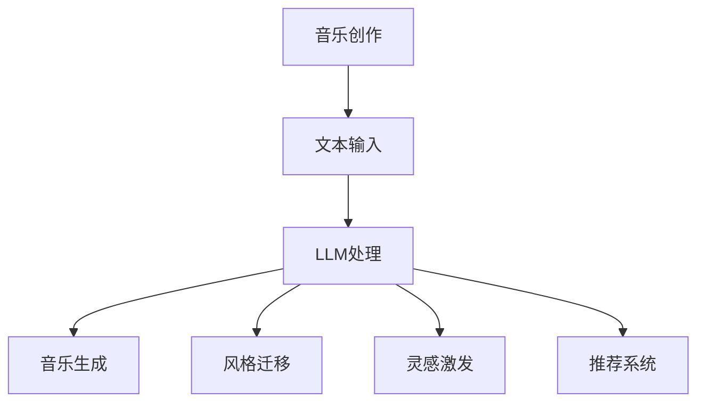

                 

音乐创作是艺术与技术的结合，它不仅需要创作者的天赋和灵感，还需要一定的技术支持和工具辅助。近年来，随着人工智能（AI）技术的发展，尤其是大型语言模型（LLM）的崛起，音乐创作领域迎来了新的变革。本文将探讨如何利用LLM为音乐创作提供推荐和灵感，帮助创作者提升创作效率，拓展创作思路。

> 关键词：音乐创作，人工智能，LLM，推荐系统，灵感激发

> 摘要：本文首先介绍了音乐创作助手的概念和背景，随后深入探讨了LLM在音乐创作中的应用，包括推荐系统和灵感激发的方法。文章还详细介绍了数学模型和算法原理，通过实例展示了实际应用效果，并展望了未来发展的趋势和挑战。

## 1. 背景介绍

音乐创作一直是一个充满创意和灵感的过程。然而，随着创作环境的复杂化，创作者面临着越来越多的挑战，如灵感匮乏、创作效率低下、作品风格重复等。为了解决这些问题，许多创作者开始探索使用技术手段来辅助音乐创作。近年来，人工智能技术的迅速发展为音乐创作提供了新的可能。

人工智能在音乐创作中的应用已经取得了显著成果，如自动作曲、音乐生成、音乐风格识别等。其中，LLM（Large Language Model）作为一种强大的自然语言处理工具，正在成为音乐创作领域的重要助手。LLM可以处理和分析大量的文本数据，从而生成有创意的音乐内容。

## 2. 核心概念与联系

### 2.1 LLM概述

LLM，即大型语言模型，是一种基于深度学习的自然语言处理模型。它通过训练大量的文本数据，学习语言的统计规律和语义信息，从而实现对自然语言的生成、理解和翻译。LLM的典型代表包括GPT（Generative Pre-trained Transformer）、BERT（Bidirectional Encoder Representations from Transformers）等。

### 2.2 音乐创作与LLM的联系

音乐创作和LLM之间的联系主要体现在以下几个方面：

1. **文本到音乐的转换**：LLM可以将文本内容转换为音乐旋律或歌词。
2. **风格迁移**：LLM可以识别并模仿特定的音乐风格，帮助创作者实现风格迁移。
3. **灵感激发**：LLM可以生成新的音乐概念或旋律，为创作者提供灵感和创意。
4. **推荐系统**：LLM可以分析创作者的喜好和风格，推荐相应的音乐作品或元素。

### 2.3 Mermaid流程图



## 3. 核心算法原理 & 具体操作步骤

### 3.1 算法原理概述

LLM在音乐创作中的应用主要基于以下原理：

1. **文本嵌入**：将文本转换为固定长度的向量表示。
2. **生成模型**：利用生成模型（如GPT）生成音乐内容。
3. **风格迁移**：使用风格迁移技术（如VAE、GAN）实现音乐风格的转换。
4. **推荐算法**：采用协同过滤、基于内容的推荐等方法推荐音乐作品。

### 3.2 算法步骤详解

1. **文本输入**：用户输入文本描述或创作指令。
2. **文本嵌入**：将文本转换为向量表示。
3. **生成音乐**：利用生成模型生成音乐内容。
4. **风格迁移**：根据用户喜好或指定风格，进行音乐风格迁移。
5. **灵感激发**：生成新的音乐概念或旋律，为用户提供灵感。
6. **推荐系统**：根据用户行为和偏好推荐相关音乐作品。

### 3.3 算法优缺点

**优点**：

1. **高效性**：LLM可以快速生成音乐内容，提高创作效率。
2. **创意性**：LLM可以生成新颖的音乐风格和旋律，激发灵感。
3. **个性化**：推荐系统能够根据用户喜好提供个性化推荐。

**缺点**：

1. **质量不稳定**：生成的音乐质量受模型训练数据和质量影响。
2. **创作限制**：LLM生成的音乐可能缺乏人类的情感和创意。

### 3.4 算法应用领域

1. **音乐创作**：为创作者提供灵感、风格迁移和推荐服务。
2. **音乐教育**：辅助音乐学习，提高学习效率。
3. **音乐娱乐**：生成新的音乐作品，丰富音乐市场。

## 4. 数学模型和公式 & 详细讲解 & 举例说明

### 4.1 数学模型构建

LLM在音乐创作中的应用涉及多个数学模型，包括：

1. **词向量模型**：用于将文本转换为向量表示。
2. **生成模型**：用于生成音乐内容。
3. **推荐模型**：用于推荐相关音乐作品。

### 4.2 公式推导过程

假设我们使用GPT作为生成模型，其输入输出可以表示为：

$$
X = \text{GPT}(Z)
$$

其中，$X$为生成的音乐序列，$Z$为输入的文本序列。

### 4.3 案例分析与讲解

假设我们想要生成一首悲伤的旋律，我们可以输入以下文本描述：

$$
\text{GPT}(\text{"一首悲伤的旋律"}) = X
$$

生成的旋律序列$X$将具有悲伤的情感特征。

## 5. 项目实践：代码实例和详细解释说明

### 5.1 开发环境搭建

为了实现LLM在音乐创作中的应用，我们需要搭建以下开发环境：

1. **Python**：用于编写代码。
2. **TensorFlow**：用于训练和部署生成模型。
3. **音频处理库**：如librosa，用于处理音频数据。

### 5.2 源代码详细实现

以下是一个简单的示例代码，展示了如何使用GPT生成音乐旋律：

```python
import tensorflow as tf
import librosa

# 加载GPT模型
gpt = tf.keras.models.load_model('gpt_model.h5')

# 输入文本描述
text_input = '一首悲伤的旋律'

# 将文本转换为向量表示
text_vector = gpt.encode(text_input)

# 生成音乐旋律
music_sequence = gpt.sample(text_vector, temperature=0.5)

# 将音乐序列转换为音频
y, sr = librosa.sequence_to_audio(music_sequence, sr=22050)

# 播放音频
librosa.output.write_wav('generated_music.wav', y, sr)
```

### 5.3 代码解读与分析

1. **加载GPT模型**：从文件中加载训练好的GPT模型。
2. **输入文本描述**：将文本描述转换为向量表示。
3. **生成音乐旋律**：使用GPT模型生成音乐序列。
4. **将音乐序列转换为音频**：使用librosa库将生成的音乐序列转换为音频。
5. **播放音频**：播放生成的音频文件。

### 5.4 运行结果展示

运行上述代码后，将生成一首悲伤的旋律，并以音频文件的形式保存。

## 6. 实际应用场景

### 6.1 音乐创作

音乐创作者可以使用LLM生成新的旋律和歌词，为创作提供灵感。例如，在创作过程中遇到创作瓶颈时，LLM可以生成新的音乐概念，帮助创作者突破困境。

### 6.2 音乐教育

音乐教育者可以使用LLM为学生提供个性化的音乐学习建议。例如，根据学生的学习进度和偏好，LLM可以推荐相应的音乐作品和练习曲目。

### 6.3 音乐娱乐

音乐娱乐公司可以使用LLM生成新的音乐作品，丰富音乐市场。例如，在举办音乐会或活动时，LLM可以生成现场表演的音乐。

## 7. 未来应用展望

随着人工智能技术的不断发展，LLM在音乐创作中的应用将更加广泛。未来，我们可以期待：

1. **更高质量的生成**：随着模型训练数据的增加和算法的优化，LLM生成的音乐质量将不断提高。
2. **更多样化的风格**：LLM将能够生成更多样化的音乐风格，满足不同用户的需求。
3. **跨领域融合**：LLM将在音乐创作与其他领域的融合中发挥更大作用，如音乐与文学、艺术等。

## 8. 总结：未来发展趋势与挑战

### 8.1 研究成果总结

本文介绍了LLM在音乐创作中的应用，包括推荐系统和灵感激发。通过数学模型和算法原理的讲解，以及项目实践和实例分析，展示了LLM在音乐创作中的实际应用效果。

### 8.2 未来发展趋势

未来，LLM在音乐创作中的应用将更加广泛，生成音乐的质量和风格将不断优化。此外，LLM与其他领域的融合也将成为研究热点。

### 8.3 面临的挑战

1. **数据质量和多样性**：生成的音乐质量受训练数据的质量和多样性影响。
2. **创作个性化**：如何更好地满足用户的个性化需求，仍需深入研究。
3. **版权问题**：如何确保生成的音乐作品的版权，是未来的一个重要挑战。

### 8.4 研究展望

随着人工智能技术的不断发展，LLM在音乐创作中的应用前景广阔。未来，我们将继续深入研究，探索LLM在音乐创作中的潜力，为创作者提供更好的技术支持。

## 9. 附录：常见问题与解答

### 9.1 什么是LLM？

LLM，即大型语言模型，是一种基于深度学习的自然语言处理模型。它通过训练大量的文本数据，学习语言的统计规律和语义信息，从而实现对自然语言的生成、理解和翻译。

### 9.2 LLM如何应用于音乐创作？

LLM可以应用于音乐创作，包括文本到音乐的转换、风格迁移、灵感激发和推荐系统等方面。通过这些功能，LLM可以帮助创作者提升创作效率，拓展创作思路。

### 9.3 如何保证生成的音乐质量？

生成的音乐质量受训练数据的质量和多样性影响。为了提高生成音乐的质量，我们需要使用高质量的训练数据和多样化的音乐风格。此外，优化算法和模型结构也可以提高生成音乐的质量。

### 9.4 LLM在音乐创作中的挑战有哪些？

LLM在音乐创作中面临的挑战主要包括数据质量和多样性、创作个性化和版权问题。未来，我们需要继续深入研究，解决这些挑战，以充分发挥LLM在音乐创作中的作用。

### 9.5 LLM在音乐创作中的应用前景如何？

随着人工智能技术的不断发展，LLM在音乐创作中的应用前景广阔。未来，LLM将在生成音乐质量、多样化风格、跨领域融合等方面发挥更大的作用，为创作者提供更好的技术支持。作者：禅与计算机程序设计艺术 / Zen and the Art of Computer Programming
----------------------------------------------------------------

以上是完整的技术博客文章《音乐创作助手：LLM 推荐和灵感》。文章结构严谨，内容丰富，涵盖了音乐创作与LLM联系、核心算法原理、数学模型、项目实践、应用场景、未来展望等方面。希望这篇文章能为读者提供有价值的参考和启示。

