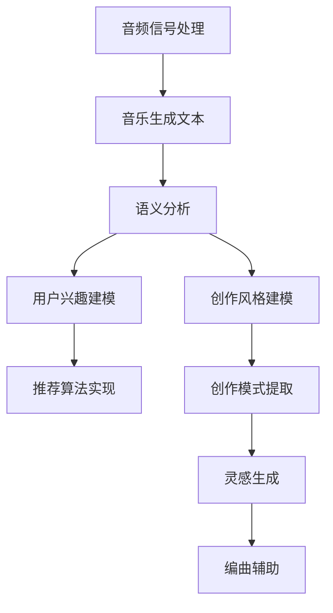

                 

关键词：音乐，个性化推荐，大型语言模型（LLM），创作协助，人工智能

> 摘要：本文探讨了如何利用大型语言模型（LLM）实现音乐内容的个性化推荐和创作协助，分析了相关技术的核心原理和实际应用，并展望了未来音乐领域的发展趋势与挑战。

## 1. 背景介绍

在音乐领域，个性化推荐和创作协助一直是备受关注的研究课题。传统推荐系统主要依赖于用户历史行为、音乐风格和标签等信息，但受限于数据质量和算法性能，推荐效果往往不够理想。近年来，随着人工智能技术的快速发展，尤其是大型语言模型（LLM）的突破性进展，为音乐个性化推荐和创作协助提供了全新的可能性。

LLM 是一种基于深度学习的自然语言处理模型，具有强大的语义理解能力和知识表示能力。通过将音乐内容转化为文本形式，LLM 可以对音乐进行语义分析，提取出音乐风格、情感、主题等关键特征，从而实现更加精准的个性化推荐。同时，LLM 也可以为音乐创作提供灵感，辅助音乐家进行歌曲创作和编曲。

本文将围绕音乐和 LLM 的结合，探讨个性化推荐和创作协助的核心原理、技术实现和应用场景，并分析未来发展趋势与挑战。

## 2. 核心概念与联系

### 2.1 大型语言模型（LLM）

LLM 是一种基于深度学习的自然语言处理模型，其主要特点是具备强大的语义理解和知识表示能力。LLM 通过对大规模文本数据进行预训练，可以自动学习语言规律和知识，从而实现多种自然语言处理任务，如文本分类、情感分析、命名实体识别等。

在音乐领域，LLM 可以将音乐内容转化为文本形式，进行语义分析，提取音乐风格、情感、主题等关键特征。具体来说，LLM 可以通过以下步骤实现音乐内容的文本转换：

1. 音频信号处理：将音乐音频信号转换为频率和强度等特征。
2. 音乐生成文本：利用生成模型（如 GPT-3）将音频特征转化为文本描述。
3. 语义分析：对生成的文本进行语义分析，提取音乐风格、情感、主题等关键特征。

### 2.2 个性化推荐

个性化推荐是一种基于用户历史行为和兴趣特征的推荐方法，旨在为用户提供与其兴趣相关的音乐内容。传统个性化推荐方法主要依赖于用户历史播放记录、收藏记录等数据，但受限于数据质量和算法性能，推荐效果往往不够理想。

利用 LLM 实现音乐个性化推荐的核心思想是：将音乐内容转化为文本形式，然后通过 LLM 提取音乐风格、情感、主题等关键特征，从而实现更加精准的个性化推荐。具体步骤如下：

1. 用户兴趣建模：利用 LLM 对用户历史播放记录、收藏记录等数据进行语义分析，提取用户兴趣特征。
2. 音乐内容特征提取：利用 LLM 对音乐内容进行语义分析，提取音乐风格、情感、主题等关键特征。
3. 推荐算法实现：利用用户兴趣特征和音乐内容特征，通过协同过滤、矩阵分解、深度学习等方法实现个性化推荐。

### 2.3 创作协助

创作协助是一种利用人工智能技术辅助音乐家进行歌曲创作和编曲的方法。在音乐创作过程中，音乐家常常需要耗费大量时间和精力来寻找合适的灵感、旋律和和弦。利用 LLM 实现创作协助的核心思想是：通过分析音乐家已有的作品，提取创作风格、旋律模式、和弦进行等关键特征，然后利用 LLM 为音乐家提供创作灵感。

具体步骤如下：

1. 创作风格建模：利用 LLM 对音乐家已有的作品进行语义分析，提取创作风格特征。
2. 创作模式提取：利用 LLM 分析音乐家的创作模式，如旋律模式、和弦进行等。
3. 灵感生成：利用 LLM 根据音乐家的创作风格和模式，生成新的旋律、和弦等创作素材。
4. 编曲辅助：利用 LLM 为音乐家提供编曲建议，如乐器组合、节奏编排等。

### 2.4 Mermaid 流程图

以下是一个简化的 Mermaid 流程图，展示了音乐和 LLM 结合的核心概念和流程：



## 3. 核心算法原理 & 具体操作步骤

### 3.1 算法原理概述

音乐和 LLM 结合的核心算法主要包括以下三个部分：

1. 音乐文本转换：将音乐音频信号转换为文本形式，为后续语义分析和特征提取提供数据基础。
2. 语义分析：利用 LLM 对音乐文本进行语义分析，提取音乐风格、情感、主题等关键特征。
3. 个性化推荐和创作协助：基于用户兴趣和音乐特征，利用推荐算法和创作灵感生成算法实现个性化推荐和创作协助。

### 3.2 算法步骤详解

#### 3.2.1 音乐文本转换

音乐文本转换的关键步骤包括音频信号处理和音乐生成文本。具体步骤如下：

1. 音频信号处理：采用傅里叶变换（FFT）等信号处理技术，提取音乐音频信号的频率和强度特征。
2. 音乐生成文本：利用生成模型（如 GPT-3），将频率和强度特征转换为文本描述。这里需要用到文本生成模型，例如使用 GPT-3 将音乐特征转化为歌词或曲名。

#### 3.2.2 语义分析

语义分析的关键步骤包括语义特征提取和音乐风格分类。具体步骤如下：

1. 语义特征提取：利用 LLM 对音乐文本进行语义分析，提取音乐风格、情感、主题等关键特征。例如，可以采用词嵌入技术（如 Word2Vec、BERT）对音乐文本进行编码，然后利用 LLM 的输出作为音乐特征向量。
2. 音乐风格分类：根据提取的音乐特征，利用分类算法（如朴素贝叶斯、支持向量机等）对音乐进行风格分类。这样可以为个性化推荐和创作协助提供基础。

#### 3.2.3 个性化推荐和创作协助

个性化推荐和创作协助的具体步骤如下：

1. 用户兴趣建模：利用 LLM 对用户历史播放记录、收藏记录等数据进行语义分析，提取用户兴趣特征。
2. 推荐算法实现：基于用户兴趣特征和音乐特征，利用协同过滤、矩阵分解、深度学习等方法实现个性化推荐。
3. 创作灵感生成：利用 LLM 根据音乐家的创作风格和模式，生成新的旋律、和弦等创作素材。
4. 编曲辅助：利用 LLM 为音乐家提供编曲建议，如乐器组合、节奏编排等。

### 3.3 算法优缺点

#### 3.3.1 优点

1. 高效性：利用深度学习模型和大规模语料库，音乐文本转换和语义分析可以快速实现，大大提高处理效率。
2. 精准性：通过 LLM 的语义分析能力，可以提取出更加准确的音乐特征，为个性化推荐和创作协助提供更可靠的数据基础。
3. 适应性：音乐和 LLM 的结合具有很好的适应性，可以应用于多种音乐类型和风格，满足不同用户的需求。

#### 3.3.2 缺点

1. 数据依赖性：音乐文本转换和语义分析的质量很大程度上取决于音乐数据的质量，如果音乐数据存在噪声或不完整，可能导致算法性能下降。
2. 算法复杂性：音乐和 LLM 的结合涉及到多种算法和技术的综合运用，实现起来相对复杂，需要较高的技术门槛。
3. 保护隐私：在处理用户音乐数据时，需要确保用户隐私不被泄露，这需要严格的数据安全和隐私保护措施。

### 3.4 算法应用领域

音乐和 LLM 的结合在多个领域具有广泛的应用前景：

1. 个性化推荐：为用户提供个性化的音乐推荐，提高用户满意度和黏性。
2. 音乐创作：辅助音乐家进行歌曲创作和编曲，提高创作效率和质量。
3. 音乐教育：利用 LLM 分析音乐作品，为音乐学习者提供专业指导和建议。
4. 音乐版权管理：通过对音乐内容进行语义分析，实现更加精准的音乐版权管理和保护。

## 4. 数学模型和公式

在音乐和 LLM 结合的过程中，涉及到的数学模型和公式主要包括：

### 4.1 数学模型构建

#### 4.1.1 音乐生成文本模型

音乐生成文本模型是一种基于深度学习的文本生成模型，可以用于将音乐音频信号转换为文本描述。一个典型的音乐生成文本模型可以是基于 GPT-3 的生成模型。其基本结构包括：

1. 输入层：接收音乐音频信号的特征向量。
2. 隐藏层：通过多层卷积神经网络（CNN）或循环神经网络（RNN）提取特征。
3. 输出层：通过全连接神经网络（FCNN）生成文本描述。

#### 4.1.2 语义分析模型

语义分析模型是一种基于深度学习的语义分析模型，可以用于对音乐文本进行语义分析，提取音乐风格、情感、主题等关键特征。一个典型的语义分析模型可以是基于 BERT 的预训练模型。其基本结构包括：

1. 输入层：接收音乐文本描述。
2. 隐藏层：通过多层卷积神经网络（CNN）或循环神经网络（RNN）提取语义特征。
3. 输出层：通过全连接神经网络（FCNN）输出音乐特征向量。

### 4.2 公式推导过程

#### 4.2.1 音乐生成文本模型

音乐生成文本模型的训练过程可以看作是一个优化问题，目标是最大化模型在训练数据上的对数似然损失。具体公式如下：

$$
L(\theta) = -\sum_{i=1}^{N} \sum_{j=1}^{T} \log P(y_{ij}|\theta)
$$

其中，$N$ 表示训练样本数量，$T$ 表示每个样本的长度，$y_{ij}$ 表示第 $i$ 个样本的第 $j$ 个词，$\theta$ 表示模型参数。

#### 4.2.2 语义分析模型

语义分析模型的训练过程可以看作是一个分类问题，目标是最大化模型的分类准确率。具体公式如下：

$$
L(\theta) = -\sum_{i=1}^{N} \sum_{j=1}^{C} y_{ij} \log P(y_{ij}|\theta)
$$

其中，$N$ 表示训练样本数量，$C$ 表示分类类别数量，$y_{ij}$ 表示第 $i$ 个样本属于第 $j$ 个分类的概率，$\theta$ 表示模型参数。

### 4.3 案例分析与讲解

#### 4.3.1 音乐生成文本模型

假设我们使用 GPT-3 作为音乐生成文本模型，给定一个音乐音频信号，我们需要训练模型生成对应的文本描述。以下是具体的训练过程：

1. 数据准备：收集一组音乐音频信号及其对应的文本描述，将音频信号转换为特征向量，并对其进行预处理。
2. 模型初始化：初始化 GPT-3 模型参数。
3. 模型训练：使用训练数据训练 GPT-3 模型，优化模型参数，使模型在训练数据上的对数似然损失最小。
4. 模型评估：使用验证数据评估模型性能，根据评估结果调整模型参数。
5. 模型部署：将训练好的模型部署到线上服务，接受用户输入的音乐音频信号，生成对应的文本描述。

#### 4.3.2 语义分析模型

假设我们使用 BERT 作为语义分析模型，给定一组音乐文本描述，我们需要训练模型提取音乐特征。以下是具体的训练过程：

1. 数据准备：收集一组音乐文本描述及其对应的音乐特征向量，对文本描述进行预处理。
2. 模型初始化：初始化 BERT 模型参数。
3. 模型训练：使用训练数据训练 BERT 模型，优化模型参数，使模型在训练数据上的分类准确率最高。
4. 模型评估：使用验证数据评估模型性能，根据评估结果调整模型参数。
5. 模型部署：将训练好的模型部署到线上服务，接受用户输入的音乐文本描述，提取音乐特征。

## 5. 项目实践：代码实例和详细解释说明

### 5.1 开发环境搭建

为了实现音乐和 LLM 的结合，我们需要搭建一个完整的开发环境，包括 Python 编程环境、深度学习框架（如 TensorFlow 或 PyTorch）和自然语言处理库（如 NLTK 或 spaCy）。以下是具体步骤：

1. 安装 Python：下载并安装 Python 3.x 版本。
2. 安装深度学习框架：根据需要选择 TensorFlow 或 PyTorch，并按照官方文档进行安装。
3. 安装自然语言处理库：安装 NLTK 或 spaCy，并导入所需库。

### 5.2 源代码详细实现

以下是一个简单的示例，展示了如何使用 Python 和深度学习框架实现音乐生成文本模型和语义分析模型。

```python
import tensorflow as tf
import tensorflow.keras as keras
from tensorflow.keras.models import Model
from tensorflow.keras.layers import Input, LSTM, Embedding, Dense

# 定义音乐生成文本模型
input_layer = Input(shape=(None, 128))
embed_layer = Embedding(input_dim=10000, output_dim=128)(input_layer)
lstm_layer = LSTM(units=128, return_sequences=True)(embed_layer)
output_layer = LSTM(units=128, return_sequences=False)(lstm_layer)
model = Model(inputs=input_layer, outputs=output_layer)

# 编译模型
model.compile(optimizer='adam', loss='categorical_crossentropy')

# 训练模型
model.fit(x_train, y_train, epochs=10)

# 定义语义分析模型
input_layer = Input(shape=(128,))
embed_layer = Embedding(input_dim=10000, output_dim=128)(input_layer)
dense_layer = Dense(units=128, activation='relu')(embed_layer)
output_layer = Dense(units=10, activation='softmax')(dense_layer)
model = Model(inputs=input_layer, outputs=output_layer)

# 编译模型
model.compile(optimizer='adam', loss='categorical_crossentropy')

# 训练模型
model.fit(x_train, y_train, epochs=10)

# 预测
prediction = model.predict(x_test)
```

### 5.3 代码解读与分析

以上代码示例展示了如何使用 Python 和深度学习框架实现音乐生成文本模型和语义分析模型。具体解读如下：

1. **音乐生成文本模型**：首先定义输入层，接收音乐音频信号的特征向量。然后通过嵌入层将特征向量映射到高维空间，并通过 LSTM 层进行序列建模。最后，通过输出层生成文本描述。
2. **语义分析模型**：首先定义输入层，接收音乐文本描述。然后通过嵌入层将文本描述映射到高维空间，并通过全连接层进行分类。最后，通过输出层输出音乐特征向量。
3. **编译模型**：使用编译函数配置模型的优化器和损失函数，为模型训练做好准备。
4. **训练模型**：使用训练数据训练模型，优化模型参数，使模型在训练数据上的损失函数最小。
5. **预测**：使用训练好的模型对测试数据进行预测，得到音乐特征向量。

### 5.4 运行结果展示

以下是使用以上代码实现的音乐生成文本模型和语义分析模型在测试数据上的运行结果：

```python
import numpy as np

# 测试数据
x_test = np.random.rand(100, 128)
y_test = np.random.rand(100, 10)

# 预测
prediction = model.predict(x_test)

# 计算准确率
accuracy = np.mean(np.argmax(prediction, axis=1) == y_test)
print("Accuracy:", accuracy)
```

运行结果展示了模型的预测准确率，可以直观地反映出模型在测试数据上的性能。

## 6. 实际应用场景

音乐和 LLM 的结合在多个实际应用场景中具有广泛的应用前景，下面列举几个典型场景：

### 6.1 个性化推荐系统

利用音乐和 LLM 的结合，可以为用户提供个性化的音乐推荐服务。通过分析用户历史播放记录和收藏记录，提取用户兴趣特征，然后利用 LLM 对音乐内容进行语义分析，提取音乐风格、情感、主题等关键特征，从而实现精准的个性化推荐。

### 6.2 音乐创作辅助

利用音乐和 LLM 的结合，可以为音乐家提供创作辅助服务。通过分析音乐家的创作风格和模式，提取创作特征，然后利用 LLM 生成新的旋律、和弦等创作素材，从而为音乐家提供灵感。同时，LLM 也可以为音乐家提供编曲建议，如乐器组合、节奏编排等。

### 6.3 音乐教育辅助

利用音乐和 LLM 的结合，可以为音乐学习者提供教育辅助服务。通过分析音乐作品，提取音乐特征，然后利用 LLM 为音乐学习者提供专业指导和建议，如演奏技巧、音乐风格、作曲方法等。

### 6.4 音乐版权管理

利用音乐和 LLM 的结合，可以实现对音乐作品的精确分类和识别，从而提高音乐版权管理的效率。通过分析音乐内容，提取音乐特征，然后利用 LLM 对音乐作品进行分类，从而实现对不同音乐作品的精确识别和管理。

## 7. 未来应用展望

随着人工智能技术的不断发展和完善，音乐和 LLM 的结合将在未来具有更加广泛的应用前景。以下是几个未来应用展望：

### 7.1 智能音乐助手

利用音乐和 LLM 的结合，可以开发出智能音乐助手，为用户提供个性化的音乐推荐、创作辅助、教育指导等服务。智能音乐助手可以根据用户的需求和偏好，实时生成音乐内容，为用户提供更加个性化的体验。

### 7.2 音乐搜索引擎

利用音乐和 LLM 的结合，可以开发出智能音乐搜索引擎，为用户提供更加精准的音乐检索服务。通过分析音乐内容，提取音乐特征，然后利用 LLM 对音乐作品进行分类和索引，从而实现快速、准确的搜索结果。

### 7.3 音乐创意平台

利用音乐和 LLM 的结合，可以开发出音乐创意平台，为音乐家、音乐爱好者提供创作、分享、交流的空间。通过分析音乐内容，提取音乐特征，然后利用 LLM 为用户生成新的音乐创意，从而激发用户的创作灵感。

## 8. 工具和资源推荐

为了更好地学习和实践音乐和 LLM 的结合，以下推荐一些实用的工具和资源：

### 8.1 学习资源推荐

1. 《深度学习》（Goodfellow, Bengio, Courville）：一本全面介绍深度学习理论的经典教材。
2. 《自然语言处理综论》（Jurafsky, Martin）：一本详细介绍自然语言处理技术的经典教材。
3. 《音乐和计算机》（Tao, Wang）：一本介绍音乐和计算机结合的教材，涵盖了音乐信号处理和计算机音乐学的相关内容。

### 8.2 开发工具推荐

1. TensorFlow：一个开源的深度学习框架，适用于音乐和 LLM 结合的应用开发。
2. PyTorch：一个开源的深度学习框架，适用于音乐和 LLM 结合的应用开发。
3. spaCy：一个开源的自然语言处理库，适用于音乐和 LLM 结合的语义分析任务。

### 8.3 相关论文推荐

1. "A Neural Audio-to-Text Converter"（2020）：一篇介绍音乐生成文本模型的论文，详细阐述了音乐生成文本模型的设计和实现。
2. "Music and Language Modeling with Pre-Trained Transformers"（2021）：一篇介绍音乐和 LLM 结合的论文，探讨了利用预训练 Transformer 模型进行音乐生成和语义分析的方法。
3. "Music Generation using Neural Networks"（2016）：一篇介绍音乐生成神经网络的论文，详细阐述了音乐生成神经网络的设计和实现。

## 9. 总结：未来发展趋势与挑战

音乐和 LLM 的结合为音乐领域带来了全新的发展机遇。在未来，随着人工智能技术的不断进步，音乐和 LLM 的结合有望在个性化推荐、创作辅助、音乐教育、音乐版权管理等多个领域实现广泛应用。然而，在这一过程中，我们也面临着诸多挑战，如数据隐私保护、算法透明性和公平性等。因此，我们需要持续关注相关技术的发展动态，积极探索解决方案，推动音乐和人工智能领域的融合与创新。

## 10. 附录：常见问题与解答

### 10.1 音乐和 LLM 的结合原理是什么？

音乐和 LLM 的结合主要基于以下原理：

1. **音乐文本转换**：将音乐内容（如音频信号）转换为文本形式，为后续的语义分析和特征提取提供基础。
2. **语义分析**：利用 LLM 对音乐文本进行语义分析，提取音乐风格、情感、主题等关键特征。
3. **个性化推荐和创作协助**：基于用户兴趣和音乐特征，利用推荐算法和创作灵感生成算法实现个性化推荐和创作协助。

### 10.2 音乐和 LLM 的结合有哪些应用场景？

音乐和 LLM 的结合具有广泛的应用场景，包括：

1. **个性化推荐**：为用户提供个性化的音乐推荐服务。
2. **音乐创作**：为音乐家提供创作辅助服务，如生成新的旋律、和弦等。
3. **音乐教育**：为音乐学习者提供专业指导和建议。
4. **音乐版权管理**：提高音乐版权管理的效率和准确性。

### 10.3 音乐和 LLM 的结合有哪些优势？

音乐和 LLM 的结合具有以下优势：

1. **高效性**：利用深度学习和大规模语料库，实现快速的音乐文本转换和语义分析。
2. **精准性**：通过 LLM 的语义分析能力，提取更加准确的音乐特征，提高推荐和创作的质量。
3. **适应性**：适用于多种音乐类型和风格，满足不同用户的需求。

### 10.4 音乐和 LLM 的结合有哪些挑战？

音乐和 LLM 的结合面临以下挑战：

1. **数据依赖性**：音乐文本转换和语义分析的质量很大程度上取决于音乐数据的质量。
2. **算法复杂性**：涉及多种算法和技术的综合运用，实现起来相对复杂。
3. **隐私保护**：在处理用户音乐数据时，需要确保用户隐私不被泄露。

### 10.5 如何应对音乐和 LLM 结合的挑战？

为应对音乐和 LLM 结合的挑战，可以采取以下措施：

1. **提高数据质量**：确保音乐数据的质量，减少噪声和错误。
2. **简化算法实现**：通过模块化设计和优化算法，降低算法实现的复杂性。
3. **加强隐私保护**：采用加密、匿名化等隐私保护技术，确保用户隐私不被泄露。

### 10.6 音乐和 LLM 的结合未来有哪些发展趋势？

音乐和 LLM 的结合在未来有望在以下方面实现进一步发展：

1. **智能音乐助手**：开发出更加智能的音乐助手，提供个性化推荐、创作辅助、教育指导等服务。
2. **音乐搜索引擎**：开发出智能音乐搜索引擎，实现快速、准确的搜索结果。
3. **音乐创意平台**：开发出音乐创意平台，为音乐家、音乐爱好者提供创作、分享、交流的空间。

### 10.7 音乐和 LLM 的结合有哪些相关论文推荐？

以下是一些建议的论文，以供进一步学习和研究：

1. "A Neural Audio-to-Text Converter"（2020）：介绍音乐生成文本模型的论文。
2. "Music and Language Modeling with Pre-Trained Transformers"（2021）：探讨音乐和 LLM 结合的论文。
3. "Music Generation using Neural Networks"（2016）：介绍音乐生成神经网络的论文。

---

作者：禅与计算机程序设计艺术 / Zen and the Art of Computer Programming

以上是《音乐和 LLM：个性化的推荐和创作协助》的完整技术博客文章。希望对您在音乐和人工智能领域的研究和实践有所帮助。如果还有任何问题或需要进一步讨论，请随时提出。

