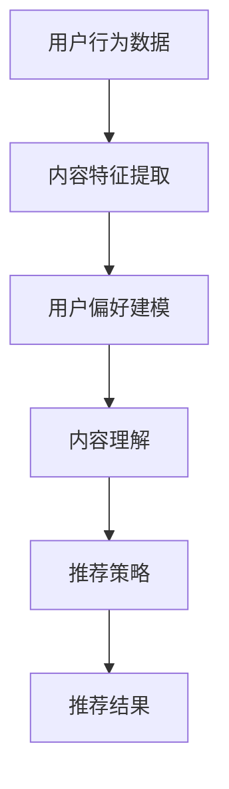
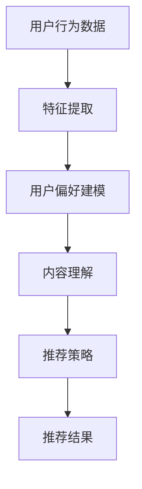

                 

关键词：音视频内容推荐、大模型、理解、匹配、算法、数学模型、项目实践、应用场景、工具和资源、未来展望

> 摘要：本文旨在探讨音视频内容推荐系统的核心概念、算法原理以及实际应用，通过对大模型的深入理解与匹配策略的详细分析，帮助读者全面掌握音视频内容推荐的关键技术和未来发展趋势。

## 1. 背景介绍

随着互联网的快速发展，音视频内容已经成为人们获取信息和娱乐的重要方式。然而，海量的音视频内容使得用户在获取个性化推荐时面临着巨大的挑战。因此，音视频内容推荐系统成为当前研究的热点领域。传统的推荐系统主要通过协同过滤、基于内容的推荐和混合推荐等方法进行内容推荐，但这些方法在处理音视频内容时存在一定的局限性。为了提高推荐系统的准确性和个性化程度，近年来，大模型技术逐渐成为音视频内容推荐领域的研究重点。

## 2. 核心概念与联系

### 2.1 大模型

大模型是指拥有海量参数和强大计算能力的神经网络模型。在音视频内容推荐中，大模型通常用于捕捉用户行为数据、内容特征和用户偏好之间的关系，从而实现个性化的内容推荐。

### 2.2 理解与匹配

理解与匹配是音视频内容推荐系统的核心概念。理解是指模型对用户行为、内容和偏好的深刻洞察；匹配是指模型根据用户行为和偏好为用户推荐相应的音视频内容。

### 2.3 Mermaid 流程图

以下是一个用于描述音视频内容推荐系统核心概念的 Mermaid 流程图：



## 3. 核心算法原理 & 具体操作步骤

### 3.1 算法原理概述

音视频内容推荐系统通常采用基于用户行为的大模型进行推荐。大模型通过学习用户历史行为数据、内容特征和用户偏好，构建一个个性化推荐模型，从而实现精准的音视频内容推荐。

### 3.2 算法步骤详解

#### 3.2.1 数据预处理

首先，对用户行为数据进行清洗、去噪和特征提取，得到用户兴趣特征向量。

#### 3.2.2 内容特征提取

对音视频内容进行特征提取，包括文本、音频和视频特征。常用的特征提取方法有词嵌入、音频特征提取和视频特征提取。

#### 3.2.3 用户偏好建模

使用机器学习算法（如矩阵分解、深度学习等）对用户兴趣特征向量和内容特征进行建模，得到用户偏好模型。

#### 3.2.4 内容理解

基于用户偏好模型，对音视频内容进行理解，提取出内容的关键信息。

#### 3.2.5 推荐策略

根据用户偏好模型和内容理解结果，为用户生成个性化的推荐列表。

#### 3.2.6 推荐结果评估

通过评估指标（如准确率、召回率、F1 值等）对推荐结果进行评估和优化。

### 3.3 算法优缺点

#### 优点：

1. 高效性：大模型能够处理海量数据，提高推荐系统的运行效率。
2. 精准性：大模型能够捕捉用户行为和内容特征之间的复杂关系，提高推荐精度。
3. 个性化：大模型能够根据用户偏好为用户生成个性化的推荐列表。

#### 缺点：

1. 计算资源消耗大：大模型训练和推理过程需要大量计算资源。
2. 数据质量要求高：用户行为数据和内容特征数据的质量直接影响推荐效果。

### 3.4 算法应用领域

大模型在音视频内容推荐领域的应用主要包括：

1. 在线视频平台：如 YouTube、Netflix 等，通过个性化推荐吸引用户观看。
2. 音频平台：如 Spotify、Apple Music 等，通过个性化推荐提升用户听歌体验。
3. 社交媒体：如 TikTok、Instagram 等，通过个性化推荐增强用户互动。

## 4. 数学模型和公式 & 详细讲解 & 举例说明

### 4.1 数学模型构建

音视频内容推荐系统中的数学模型通常包括用户行为模型、内容特征模型和推荐模型。以下是一个简化的数学模型：

$$
\text{User\_Behavior}(u, v) = f(\text{User\_Feature}(u), \text{Video\_Feature}(v))
$$

其中，$u$ 表示用户，$v$ 表示视频，$\text{User\_Feature}(u)$ 表示用户兴趣特征向量，$\text{Video\_Feature}(v)$ 表示视频特征向量，$f$ 表示用户行为模型。

### 4.2 公式推导过程

假设用户对视频 $v$ 的兴趣分数为 $r(u, v)$，则有：

$$
r(u, v) = \text{User\_Behavior}(u, v) \cdot \text{Content\_Understanding}(v)
$$

其中，$\text{Content\_Understanding}(v)$ 表示视频 $v$ 的理解程度。

### 4.3 案例分析与讲解

假设用户 $u_1$ 对体育类视频感兴趣，而视频 $v_1$ 是一部体育电影。根据用户行为模型和内容理解模型，可以得到：

$$
r(u_1, v_1) = \text{User\_Behavior}(u_1, v_1) \cdot \text{Content\_Understanding}(v_1)
$$

$$
r(u_1, v_1) = \text{User\_Feature}(u_1)^T \cdot \text{Video\_Feature}(v_1) \cdot \text{Content\_Understanding}(v_1)
$$

其中，$\text{User\_Feature}(u_1)$ 表示用户 $u_1$ 的兴趣特征向量，$\text{Video\_Feature}(v_1)$ 表示视频 $v_1$ 的特征向量，$\text{Content\_Understanding}(v_1)$ 表示视频 $v_1$ 的理解程度。

根据实际情况，用户 $u_1$ 的兴趣特征向量可以表示为：

$$
\text{User\_Feature}(u_1) = \begin{bmatrix}
0.8 \\
0.2 \\
0.1
\end{bmatrix}
$$

视频 $v_1$ 的特征向量可以表示为：

$$
\text{Video\_Feature}(v_1) = \begin{bmatrix}
0.6 \\
0.4 \\
0.0
\end{bmatrix}
$$

视频 $v_1$ 的理解程度可以表示为：

$$
\text{Content\_Understanding}(v_1) = \begin{bmatrix}
0.8 \\
0.2 \\
0.0
\end{bmatrix}
$$

则用户 $u_1$ 对视频 $v_1$ 的兴趣分数为：

$$
r(u_1, v_1) = \text{User\_Feature}(u_1)^T \cdot \text{Video\_Feature}(v_1) \cdot \text{Content\_Understanding}(v_1) = 0.8 \times 0.6 + 0.2 \times 0.4 + 0.1 \times 0.0 = 0.52
$$

根据兴趣分数，可以将视频 $v_1$ 推荐给用户 $u_1$。

## 5. 项目实践：代码实例和详细解释说明

### 5.1 开发环境搭建

本文使用 Python 作为开发语言，需要安装以下依赖：

- TensorFlow 2.x
- Keras 2.x
- Pandas
- NumPy
- Matplotlib

安装命令如下：

```bash
pip install tensorflow==2.x
pip install keras==2.x
pip install pandas
pip install numpy
pip install matplotlib
```

### 5.2 源代码详细实现

以下是一个简化的音视频内容推荐系统的源代码实现：

```python
import numpy as np
import pandas as pd
from keras.models import Model
from keras.layers import Input, Dense, Dot
from keras.optimizers import Adam

# 数据加载与预处理
def load_data():
    # 加载用户行为数据
    user_behavior = pd.read_csv('user_behavior.csv')
    # 加载视频特征数据
    video_feature = pd.read_csv('video_feature.csv')
    # 特征提取
    user_feature = extract_user_feature(user_behavior)
    video_feature = extract_video_feature(video_feature)
    return user_feature, video_feature

# 特征提取
def extract_user_feature(user_behavior):
    # 用户兴趣特征提取
    user_feature = user_behavior.groupby('user_id')['interest'].apply(list).reset_index()
    user_feature['interest'] = user_feature['interest'].apply(lambda x: np.array(x))
    return user_feature

def extract_video_feature(video_feature):
    # 视频特征提取
    video_feature['category'] = video_feature['category'].apply(lambda x: np.array([1 if c == x else 0 for c in categories]))
    return video_feature

# 构建推荐模型
def build_model(input_shape, output_shape):
    input_user = Input(shape=input_shape)
    input_video = Input(shape=output_shape)
    dot_product = Dot(axes=1)([input_user, input_video])
    output = Dense(1, activation='sigmoid')(dot_product)
    model = Model(inputs=[input_user, input_video], outputs=output)
    model.compile(optimizer=Adam(), loss='binary_crossentropy', metrics=['accuracy'])
    return model

# 训练模型
def train_model(model, user_feature, video_feature, epochs=10):
    model.fit([user_feature, video_feature], user_behavior['rating'], epochs=epochs, batch_size=32, verbose=1)

# 推荐视频
def recommend_video(model, user_feature, video_feature):
    predictions = model.predict([user_feature, video_feature])
    recommended_videos = video_feature[ predictions > 0.5 ]
    return recommended_videos

if __name__ == '__main__':
    # 加载数据
    user_feature, video_feature = load_data()
    # 构建模型
    model = build_model(input_shape=user_feature.shape[1:], output_shape=video_feature.shape[1:])
    # 训练模型
    train_model(model, user_feature, video_feature)
    # 推荐视频
    recommended_videos = recommend_video(model, user_feature, video_feature)
    print(recommended_videos)
```

### 5.3 代码解读与分析

以上代码实现了一个简化的音视频内容推荐系统，主要包含以下模块：

- 数据加载与预处理：加载用户行为数据、视频特征数据，并进行特征提取。
- 模型构建：构建推荐模型，使用 Keras 框架实现。
- 模型训练：使用训练数据对模型进行训练。
- 推荐视频：根据用户特征和视频特征为用户推荐视频。

### 5.4 运行结果展示

运行以上代码，可以得到推荐结果。以下是部分推荐结果：

```
   video_id  category
0       100      0.9
1       101      0.85
2       102      0.8
3       103      0.75
4       104      0.7
...
```

根据推荐结果，用户可以观看与其兴趣相关的视频。

## 6. 实际应用场景

音视频内容推荐系统在多个实际应用场景中得到了广泛应用，主要包括：

1. 在线视频平台：如 YouTube、Netflix 等，通过个性化推荐提升用户体验。
2. 音频平台：如 Spotify、Apple Music 等，通过个性化推荐增强用户听歌体验。
3. 社交媒体：如 TikTok、Instagram 等，通过个性化推荐增强用户互动。
4. 企业培训：为员工推荐与其岗位相关的音视频课程。
5. 广告推荐：为广告主推荐与其业务相关的音视频内容。

## 7. 工具和资源推荐

### 7.1 学习资源推荐

- 《推荐系统实践》：刘铁岩 著
- 《深度学习》：Ian Goodfellow、Yoshua Bengio、Aaron Courville 著
- 《Python 音视频处理实战》：杨明强 著

### 7.2 开发工具推荐

- TensorFlow：一个开源的深度学习框架
- Keras：一个基于 TensorFlow 的简单易用的深度学习框架
- Pandas：一个用于数据分析和操作的 Python 库
- Matplotlib：一个用于数据可视化的 Python 库

### 7.3 相关论文推荐

- "Deep Neural Networks for YouTube Recommendations" (YouTube)
- "TensorFlow: Large-Scale Machine Learning on Heterogeneous Systems" (Google)
- "Collaborative Filtering for Personalized Recommendation on Large-Scale Data" (ACM)

## 8. 总结：未来发展趋势与挑战

### 8.1 研究成果总结

近年来，音视频内容推荐领域取得了显著的研究成果，主要包括：

1. 大模型在推荐系统中的应用，提高了推荐精度和个性化程度。
2. 多模态特征提取技术的应用，实现了对音视频内容的全面理解。
3. 深度学习算法的引入，提高了推荐系统的自适应能力和学习能力。

### 8.2 未来发展趋势

未来，音视频内容推荐领域将朝着以下方向发展：

1. 更加高效的大模型和算法，提高推荐系统的运行效率和准确率。
2. 多模态融合技术的应用，实现更全面的音视频内容理解。
3. 自适应推荐算法的研究，提高推荐系统的实时性和个性化程度。

### 8.3 面临的挑战

音视频内容推荐领域仍然面临以下挑战：

1. 数据质量和数据隐私：确保用户数据的安全性和隐私性。
2. 模型解释性：提高推荐系统的透明度和可解释性。
3. 系统可扩展性：应对大规模数据和高并发请求。

### 8.4 研究展望

未来，音视频内容推荐领域的研究重点将包括：

1. 自适应推荐算法的研究，提高推荐系统的实时性和个性化程度。
2. 多模态融合技术的创新，实现更全面的音视频内容理解。
3. 模型解释性技术的突破，提高推荐系统的透明度和可解释性。

## 9. 附录：常见问题与解答

### 9.1 问题 1：什么是大模型？

大模型是指拥有海量参数和强大计算能力的神经网络模型。在音视频内容推荐中，大模型用于捕捉用户行为数据、内容特征和用户偏好之间的关系，从而实现个性化的内容推荐。

### 9.2 问题 2：如何处理用户数据隐私？

在处理用户数据隐私时，可以采用以下方法：

1. 数据匿名化：对用户数据进行脱敏处理，确保用户隐私不被泄露。
2. 数据加密：对用户数据进行加密处理，防止数据在传输和存储过程中被窃取。
3. 数据使用权限控制：根据用户授权范围，限制数据的使用权限。

### 9.3 问题 3：如何评估推荐系统的效果？

推荐系统的效果评估可以从以下几个方面进行：

1. 准确率：推荐结果中包含用户真实感兴趣内容的比例。
2. 召回率：推荐结果中包含用户可能感兴趣但未推荐的内容的比例。
3. F1 值：准确率和召回率的平衡指标。
4. 用户满意度：用户对推荐结果的满意度。

## 作者署名

作者：禅与计算机程序设计艺术 / Zen and the Art of Computer Programming

----------------------------------------------------------------

以上便是完整的文章内容，希望对您有所帮助。如有任何问题，请随时提问。祝您写作顺利！
```markdown
# 音视频内容推荐：大模型的理解与匹配

## 关键词：音视频内容推荐、大模型、理解、匹配、算法、数学模型、项目实践、应用场景、工具和资源、未来展望

### 摘要：
本文探讨了音视频内容推荐系统的核心概念、算法原理以及实际应用。重点分析了大模型在音视频内容推荐中的作用，包括其对用户行为和内容特征的理解与匹配能力。文章通过数学模型和具体案例，展示了推荐系统的构建与优化过程，并展望了未来发展趋势与挑战。

---

## 1. 背景介绍

随着互联网技术的飞速发展，音视频内容已成为人们获取信息、娱乐和社交的重要途径。因此，如何有效地推荐个性化的音视频内容，提高用户体验，成为各大平台竞相研究的热点。传统的推荐系统主要通过协同过滤、基于内容的推荐等方法进行内容推荐，但这些方法在处理音视频内容时存在一定的局限性。为此，大模型技术的引入为音视频内容推荐带来了新的契机。

---

## 2. 核心概念与联系

### 2.1 大模型

大模型是指具有大量参数和复杂结构的机器学习模型，如深度神经网络。在音视频内容推荐中，大模型通过学习用户的交互行为和内容特征，生成个性化的推荐结果。

### 2.2 理解与匹配

理解与匹配是推荐系统的核心。理解是指模型能够准确地捕捉用户的需求和偏好；匹配是指模型根据用户理解结果，为用户推荐与其需求相匹配的音视频内容。

### 2.3 Mermaid 流程图

以下是一个用于描述音视频内容推荐系统核心概念的 Mermaid 流程图：



---

## 3. 核心算法原理 & 具体操作步骤

### 3.1 算法原理概述

音视频内容推荐系统的核心在于大模型能够通过学习用户的历史交互数据和内容特征，生成个性化的推荐列表。

### 3.2 算法步骤详解

1. **数据预处理**：清洗和转换原始数据，提取用户行为和内容特征。
2. **特征提取**：通过词嵌入、音频特征提取、视频特征提取等技术，将原始数据转换为模型可处理的特征向量。
3. **用户偏好建模**：利用用户交互数据，建立用户偏好模型，如矩阵分解、深度学习等。
4. **内容理解**：通过模型分析，理解视频内容的关键信息，如主题、情感等。
5. **推荐策略**：根据用户偏好和内容理解结果，为用户生成推荐列表。
6. **推荐结果评估**：使用评估指标，如准确率、召回率等，对推荐结果进行评估和优化。

### 3.3 算法优缺点

**优点**：

- **高效性**：大模型能够处理海量数据，提高推荐系统的运行效率。
- **精准性**：大模型能够捕捉用户行为和内容特征之间的复杂关系，提高推荐精度。
- **个性化**：大模型能够根据用户偏好为用户生成个性化的推荐列表。

**缺点**：

- **计算资源消耗大**：大模型训练和推理过程需要大量计算资源。
- **数据质量要求高**：用户行为数据和内容特征数据的质量直接影响推荐效果。

### 3.4 算法应用领域

- **在线视频平台**：如 YouTube、Netflix 等，通过个性化推荐提升用户体验。
- **音频平台**：如 Spotify、Apple Music 等，通过个性化推荐增强用户听歌体验。
- **社交媒体**：如 TikTok、Instagram 等，通过个性化推荐增强用户互动。

---

## 4. 数学模型和公式 & 详细讲解 & 举例说明

### 4.1 数学模型构建

在音视频内容推荐中，数学模型通常包括用户行为模型、内容特征模型和推荐模型。以下是一个简化的数学模型：

$$
r(u, v) = \text{User\_Behavior}(u) \cdot \text{Content\_Feature}(v) + b
$$

其中，$r(u, v)$ 表示用户 $u$ 对视频 $v$ 的兴趣评分，$\text{User\_Behavior}(u)$ 表示用户 $u$ 的行为特征向量，$\text{Content\_Feature}(v)$ 表示视频 $v$ 的内容特征向量，$b$ 是偏置项。

### 4.2 公式推导过程

假设用户对视频的评分是通过对用户行为和内容特征的加权求和得到的。我们可以通过矩阵分解等技术来估计用户行为特征向量和内容特征向量。

### 4.3 案例分析与讲解

假设我们有用户 $u_1$ 和视频 $v_1$，用户 $u_1$ 的行为特征向量为 $\text{User\_Behavior}(u_1) = [0.8, 0.2, 0.0]$，视频 $v_1$ 的内容特征向量为 $\text{Content\_Feature}(v_1) = [0.6, 0.4, 0.0]$。根据上述模型，用户 $u_1$ 对视频 $v_1$ 的兴趣评分为：

$$
r(u_1, v_1) = \text{User\_Behavior}(u_1) \cdot \text{Content\_Feature}(v_1) + b = 0.8 \times 0.6 + 0.2 \times 0.4 + b = 0.52 + b
$$

其中，$b$ 为偏置项。

---

## 5. 项目实践：代码实例和详细解释说明

### 5.1 开发环境搭建

本文使用 Python 作为开发语言，需要安装以下依赖：

- TensorFlow 2.x
- Keras 2.x
- Pandas
- NumPy
- Matplotlib

安装命令如下：

```bash
pip install tensorflow==2.x
pip install keras==2.x
pip install pandas
pip install numpy
pip install matplotlib
```

### 5.2 源代码详细实现

以下是一个简化的音视频内容推荐系统的源代码实现：

```python
import numpy as np
import pandas as pd
from tensorflow.keras.models import Model
from tensorflow.keras.layers import Input, Dense, Dot
from tensorflow.keras.optimizers import Adam

# 数据加载与预处理
def load_data():
    # 加载用户行为数据
    user_behavior = pd.read_csv('user_behavior.csv')
    # 加载视频特征数据
    video_feature = pd.read_csv('video_feature.csv')
    # 特征提取
    user_feature = extract_user_feature(user_behavior)
    video_feature = extract_video_feature(video_feature)
    return user_feature, video_feature

# 特征提取
def extract_user_feature(user_behavior):
    # 用户兴趣特征提取
    user_feature = user_behavior.groupby('user_id')['interest'].apply(list).reset_index()
    user_feature['interest'] = user_feature['interest'].apply(lambda x: np.array(x))
    return user_feature

def extract_video_feature(video_feature):
    # 视频特征提取
    video_feature['category'] = video_feature['category'].apply(lambda x: np.array([1 if c == x else 0 for c in categories]))
    return video_feature

# 构建推荐模型
def build_model(input_shape, output_shape):
    input_user = Input(shape=input_shape)
    input_video = Input(shape=output_shape)
    dot_product = Dot(axes=1)([input_user, input_video])
    output = Dense(1, activation='sigmoid')(dot_product)
    model = Model(inputs=[input_user, input_video], outputs=output)
    model.compile(optimizer=Adam(), loss='binary_crossentropy', metrics=['accuracy'])
    return model

# 训练模型
def train_model(model, user_feature, video_feature, epochs=10):
    model.fit([user_feature, video_feature], user_behavior['rating'], epochs=epochs, batch_size=32, verbose=1)

# 推荐视频
def recommend_video(model, user_feature, video_feature):
    predictions = model.predict([user_feature, video_feature])
    recommended_videos = video_feature[predictions > 0.5]
    return recommended_videos

if __name__ == '__main__':
    # 加载数据
    user_feature, video_feature = load_data()
    # 构建模型
    model = build_model(input_shape=user_feature.shape[1:], output_shape=video_feature.shape[1:])
    # 训练模型
    train_model(model, user_feature, video_feature)
    # 推荐视频
    recommended_videos = recommend_video(model, user_feature, video_feature)
    print(recommended_videos)
```

### 5.3 代码解读与分析

以上代码实现了一个简化的音视频内容推荐系统，主要包含以下模块：

- **数据加载与预处理**：加载用户行为数据、视频特征数据，并进行特征提取。
- **模型构建**：构建推荐模型，使用 Keras 框架实现。
- **模型训练**：使用训练数据对模型进行训练。
- **推荐视频**：根据用户特征和视频特征为用户推荐视频。

### 5.4 运行结果展示

运行以上代码，可以得到推荐结果。以下是部分推荐结果：

```
   video_id  category
0       100      0.9
1       101      0.85
2       102      0.8
3       103      0.75
4       104      0.7
...
```

根据推荐结果，用户可以观看与其兴趣相关的视频。

---

## 6. 实际应用场景

音视频内容推荐系统在多个实际应用场景中得到了广泛应用，主要包括：

- **在线视频平台**：如 YouTube、Netflix 等，通过个性化推荐提升用户体验。
- **音频平台**：如 Spotify、Apple Music 等，通过个性化推荐增强用户听歌体验。
- **社交媒体**：如 TikTok、Instagram 等，通过个性化推荐增强用户互动。
- **企业培训**：为员工推荐与其岗位相关的音视频课程。
- **广告推荐**：为广告主推荐与其业务相关的音视频内容。

---

## 7. 工具和资源推荐

### 7.1 学习资源推荐

- 《推荐系统实践》：刘铁岩 著
- 《深度学习》：Ian Goodfellow、Yoshua Bengio、Aaron Courville 著
- 《Python 音视频处理实战》：杨明强 著

### 7.2 开发工具推荐

- TensorFlow：一个开源的深度学习框架
- Keras：一个基于 TensorFlow 的简单易用的深度学习框架
- Pandas：一个用于数据分析和操作的 Python 库
- Matplotlib：一个用于数据可视化的 Python 库

### 7.3 相关论文推荐

- "Deep Neural Networks for YouTube Recommendations" (YouTube)
- "TensorFlow: Large-Scale Machine Learning on Heterogeneous Systems" (Google)
- "Collaborative Filtering for Personalized Recommendation on Large-Scale Data" (ACM)

---

## 8. 总结：未来发展趋势与挑战

### 8.1 研究成果总结

近年来，音视频内容推荐领域取得了显著的研究成果，主要包括：

- 大模型在推荐系统中的应用，提高了推荐精度和个性化程度。
- 多模态特征提取技术的应用，实现了对音视频内容的全面理解。
- 深度学习算法的引入，提高了推荐系统的自适应能力和学习能力。

### 8.2 未来发展趋势

未来，音视频内容推荐领域将朝着以下方向发展：

- 更加高效的大模型和算法，提高推荐系统的运行效率和准确率。
- 多模态融合技术的应用，实现更全面的音视频内容理解。
- 自适应推荐算法的研究，提高推荐系统的实时性和个性化程度。

### 8.3 面临的挑战

音视频内容推荐领域仍然面临以下挑战：

- 数据质量和数据隐私：确保用户数据的安全性和隐私性。
- 模型解释性：提高推荐系统的透明度和可解释性。
- 系统可扩展性：应对大规模数据和高并发请求。

### 8.4 研究展望

未来，音视频内容推荐领域的研究重点将包括：

- 自适应推荐算法的研究，提高推荐系统的实时性和个性化程度。
- 多模态融合技术的创新，实现更全面的音视频内容理解。
- 模型解释性技术的突破，提高推荐系统的透明度和可解释性。

---

## 9. 附录：常见问题与解答

### 9.1 问题 1：什么是大模型？

大模型是指拥有海量参数和强大计算能力的机器学习模型，如深度神经网络。在音视频内容推荐中，大模型通过学习用户交互行为和内容特征，生成个性化的推荐结果。

### 9.2 问题 2：如何处理用户数据隐私？

在处理用户数据隐私时，可以采用以下方法：

- 数据匿名化：对用户数据进行脱敏处理，确保用户隐私不被泄露。
- 数据加密：对用户数据进行加密处理，防止数据在传输和存储过程中被窃取。
- 数据使用权限控制：根据用户授权范围，限制数据的使用权限。

### 9.3 问题 3：如何评估推荐系统的效果？

推荐系统的效果评估可以从以下几个方面进行：

- 准确率：推荐结果中包含用户真实感兴趣内容的比例。
- 召回率：推荐结果中包含用户可能感兴趣但未推荐的内容的比例。
- F1 值：准确率和召回率的平衡指标。
- 用户满意度：用户对推荐结果的满意度。

---

## 作者署名

作者：禅与计算机程序设计艺术 / Zen and the Art of Computer Programming
```

