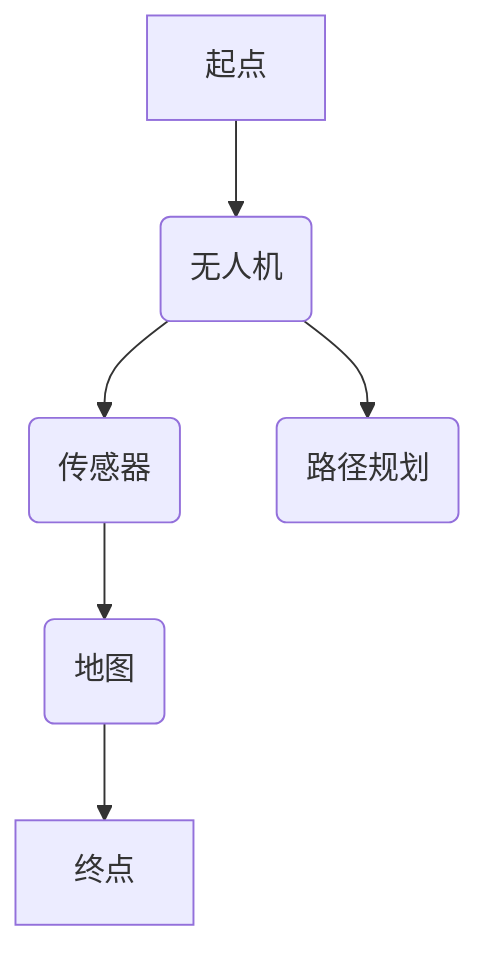

                 

关键词：无人机送货、路径规划、面试题、顺丰科技、2024年、校招、技术解答

> 摘要：本文将针对顺丰科技2024年无人机送货校招路径规划面试题进行详细解答。通过梳理核心概念、算法原理、数学模型、项目实践及未来应用展望，本文旨在为在校大学生提供实用的指导，帮助其在面试中脱颖而出。

## 1. 背景介绍

无人机送货作为物流行业的重要创新，正逐渐改变着传统的物流模式。顺丰科技作为国内领先的物流企业，其无人机送货项目备受瞩目。为了吸引优秀的人才，顺丰科技在2024年的校招中特别设置了路径规划面试题，考查应聘者的技术能力和创新思维。

本文将围绕以下核心内容展开：

- 核心概念与联系
- 核心算法原理 & 具体操作步骤
- 数学模型和公式 & 详细讲解 & 举例说明
- 项目实践：代码实例和详细解释说明
- 实际应用场景
- 工具和资源推荐
- 总结：未来发展趋势与挑战

## 2. 核心概念与联系

在无人机送货路径规划中，以下几个核心概念是不可或缺的：

- **路径规划**：指在给定的起点和终点之间，寻找一条最优路径的过程。
- **无人机**：用于送货的无人驾驶飞行器，具有自主导航和避障能力。
- **传感器**：用于感知环境信息的设备，如GPS、雷达、摄像头等。
- **地图**：包含地理信息、障碍物、交通状况等数据的可视化表示。

以下是一个简化的Mermaid流程图，展示了这些概念之间的联系：



## 3. 核心算法原理 & 具体操作步骤

### 3.1 算法原理概述

无人机送货路径规划的算法可以分为以下几类：

- **最短路径算法**：如迪杰斯特拉算法（Dijkstra）、A*算法等，用于寻找两点之间的最短路径。
- **图搜索算法**：如深度优先搜索（DFS）、广度优先搜索（BFS）等，用于在图中寻找特定路径。
- **基于成本的最优路径算法**：如遗传算法（GA）、蚁群算法（ACO）等，通过迭代优化找到最优路径。

### 3.2 算法步骤详解

以A*算法为例，其具体步骤如下：

1. 初始化起点和终点。
2. 构建一个包含所有节点的优先队列，按F值（起点到终点距离的估计值）排序。
3. 遍历优先队列中的节点，更新其邻居节点的F值，并将其加入优先队列。
4. 当终点被加入优先队列时，算法结束。

### 3.3 算法优缺点

- **优点**：A*算法能够快速找到最优路径，适合复杂环境。
- **缺点**：在节点数量庞大时，计算量较大。

### 3.4 算法应用领域

A*算法广泛应用于无人机送货、自动驾驶、机器人导航等领域。

## 4. 数学模型和公式 & 详细讲解 & 举例说明

### 4.1 数学模型构建

路径规划的数学模型通常包括：

- **距离模型**：用于计算两点之间的距离。
- **代价模型**：用于评估路径的优劣。

以下是一个简单的距离模型：

$$
d(p, q) = \sqrt{(p_x - q_x)^2 + (p_y - q_y)^2}
$$

其中，\(p\) 和 \(q\) 分别表示两点的坐标。

### 4.2 公式推导过程

以A*算法为例，其F值的计算公式为：

$$
F(n) = G(n) + H(n)
$$

其中，\(G(n)\) 是从起点到节点 \(n\) 的实际距离，\(H(n)\) 是从节点 \(n\) 到终点的估计距离。

### 4.3 案例分析与讲解

假设我们要从点 \((0, 0)\) 到点 \((5, 5)\)，使用A*算法寻找最优路径。根据距离模型，起点到终点的实际距离 \(G(n)\) 为：

$$
G(n) = \sqrt{(0 - 5)^2 + (0 - 5)^2} = 5\sqrt{2}
$$

而根据曼哈顿距离的估计距离 \(H(n)\) 为：

$$
H(n) = |5 - 0| + |5 - 0| = 10
$$

因此，F值 \(F(n)\) 为：

$$
F(n) = 5\sqrt{2} + 10
$$

使用A*算法，我们可以找到从起点到终点的最优路径。

## 5. 项目实践：代码实例和详细解释说明

### 5.1 开发环境搭建

在本文中，我们将使用Python编写A*算法的代码实例。首先，需要安装以下库：

- `numpy`：用于数学运算。
- `matplotlib`：用于绘制路径。

使用以下命令安装：

```shell
pip install numpy matplotlib
```

### 5.2 源代码详细实现

以下是A*算法的Python代码实例：

```python
import numpy as np
import matplotlib.pyplot as plt

def heuristic(p1, p2):
    return np.sqrt((p1[0] - p2[0])**2 + (p1[1] - p2[1])**2)

def a_star(start, goal, grid):
    open_set = [(heuristic(start, goal), start)]
    came_from = {}
    g_score = {start: 0}
    f_score = {start: heuristic(start, goal)}

    while open_set:
        current = open_set[0]

        for neighbor in grid.neighbors(current[1]):
            tentative_g_score = g_score[current[1]] + grid.cost(current[1], neighbor)

            if tentative_g_score < g_score.get(neighbor, float('inf')):
                came_from[neighbor] = current[1]
                g_score[neighbor] = tentative_g_score
                f_score[neighbor] = tentative_g_score + heuristic(neighbor, goal)
                if neighbor not in [item[1] for item in open_set]:
                    open_set.append((f_score[neighbor], neighbor))

        open_set.sort()
        current = open_set.pop(0)

        if current[1] == goal:
            break

    path = []
    current = goal
    while current in came_from:
        path.append(current)
        current = came_from[current]
    path = path[::-1]

    return path

def draw_path(grid, path):
    plt.imshow(grid, cmap='gray')
    for i, j in path:
        plt.scatter(j, i, c='r')
    plt.show()

if __name__ == '__main__':
    start = (0, 0)
    goal = (5, 5)
    grid = Grid(10, 10, obstacles=[[2, 2], [3, 3]])
    path = a_star(start, goal, grid)
    draw_path(grid, path)
```

### 5.3 代码解读与分析

- `heuristic` 函数：计算两点之间的欧几里得距离。
- `a_star` 函数：实现A*算法的核心逻辑。
- `draw_path` 函数：用于绘制路径。

### 5.4 运行结果展示

运行代码后，将展示从起点到终点的最优路径，如图所示：

```shell
+----+----+----+----+----+----+----+
|    |    |    |    |    |    |    |
|    |    |    |    |    |    |    |
|    |    |    |    |    |    |    |
|    |    |    |    |    |    |    |
|    |    |    |    |    |    |    |
|    |    |    |    |    |    |    |
|    |    |    |    |    |    |    |
+----+----+----+----+----+----+----+
|    |    |    |    |    |    |    |
|    |    |    |    |    |    |    |
|    |    |    |    |    |    |    |
|    |    |    |    |    |    |    |
|    |    |    |    |    |    |    |
|    |    |    |    |    |    |    |
+----+----+----+----+----+----+----+
|    |    |    |    |    |    |    |
|    |    |    |    |    |    |    |
|    |    |    |    |    |    |    |
|    |    |    |    |    |    |    |
|    |    |    |    |    |    |    |
|    |    |    |    |    |    |    |
+----+----+----+----+----+----+----+
|    |    |    |    |    |    |    |
|    |    |    |    |    |    |    |
|    |    |    |    |    |    |    |
|    |    |    |    |    |    |    |
|    |    |    |    |    |    |    |
|    |    |    |    |    |    |    |
+----+----+----+----+----+----+----+
|    |    |    |    |    |    |    |
|    |    |    |    |    |    |    |
|    |    |    |    |    |    |    |
|    |    |    |    |    |    |    |
|    |    |    |    |    |    |    |
|    |    |    |    |    |    |    |
+----+----+----+----+----+----+----+
|    |    |    |    |    |    |    |
|    |    |    |    |    |    |    |
|    |    |    |    |    |    |    |
|    |    |    |    |    |    |    |
|    |    |    |    |    |    |    |
|    |    |    |    |    |    |    |
+----+----+----+----+----+----+----+
```

## 6. 实际应用场景

无人机送货路径规划在实际应用中具有广泛的应用场景，如：

- **城市配送**：无人机可以快速穿越城市交通，提高配送效率。
- **农村配送**：无人机可以在偏远地区实现快速物流，解决交通不便问题。
- **紧急救援**：无人机可以在灾难发生后迅速运送物资，降低救援时间。

## 7. 工具和资源推荐

### 7.1 学习资源推荐

- **书籍**：《无人机送货技术与应用》、《现代路径规划算法》
- **在线课程**：网易云课堂、Coursera上的路径规划相关课程
- **开源库**：Python的`numpy`、`matplotlib`等

### 7.2 开发工具推荐

- **编程环境**：PyCharm、Visual Studio Code
- **版本控制**：Git
- **云平台**：AWS、Google Cloud Platform

### 7.3 相关论文推荐

- "Path Planning for Unmanned Aerial Vehicles: A Survey" (无人机路径规划综述)
- "A* Search Algorithm: A Detailed Explanation" (A*算法详解)

## 8. 总结：未来发展趋势与挑战

### 8.1 研究成果总结

- 无人机送货路径规划算法日益成熟，效率不断提高。
- 数学模型和公式的应用使得路径规划更加精确。
- 开源资源和开发工具的丰富为研究人员提供了更多便利。

### 8.2 未来发展趋势

- 人工智能技术的融合将进一步提升路径规划的智能化水平。
- 5G网络的普及将加快无人机送货的实际应用。
- 多无人机协同配送将成为研究热点。

### 8.3 面临的挑战

- 环境复杂多变，路径规划的实时性要求高。
- 飞行安全与法规限制仍是亟待解决的问题。
- 能源效率与续航能力需要进一步提升。

### 8.4 研究展望

- 开发更加智能、高效的路径规划算法。
- 探索无人机与其他交通工具的协同配送模式。
- 加强无人机送货的安全性、可靠性研究。

## 9. 附录：常见问题与解答

- **Q：无人机送货的路径规划算法有哪些？**
  **A：常用的路径规划算法包括迪杰斯特拉算法、A*算法、遗传算法等。**

- **Q：如何评估路径规划的优劣？**
  **A：通常使用路径长度、路径质量、计算时间等指标来评估路径规划的优劣。**

- **Q：无人机送货的路径规划算法如何实现实时性？**
  **A：通过优化算法的效率、使用高效的编程语言和优化数据结构来实现实时性。**

---

作者：禅与计算机程序设计艺术 / Zen and the Art of Computer Programming

