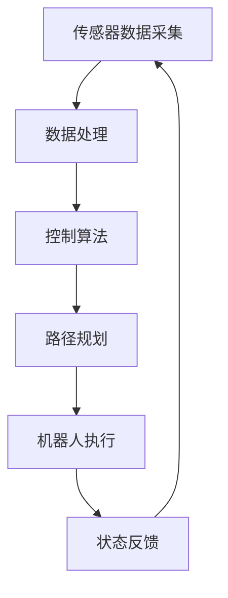

                 

在信息技术迅速发展的今天，智能仓储机器人控制系统已经成为物流行业不可或缺的重要组成部分。顺丰科技作为国内领先的快递物流企业，其对于智能仓储机器人控制系统的研发和应用一直处于行业领先地位。对于想要加入这一领域的求职者来说，掌握相关的技能和知识是必不可少的。本文将为您详细解析顺丰科技2025智能仓储机器人控制系统的社招面试攻略，帮助您在面试中脱颖而出。

## 关键词

- 顺丰科技
- 智能仓储
- 机器人控制系统
- 社招面试
- 技术栈
- 算法
- 数学模型

## 摘要

本文旨在为有意加入顺丰科技智能仓储机器人控制系统的求职者提供一份详细的面试攻略。文章将围绕技术栈、核心算法、数学模型、项目实践、实际应用场景、未来展望、学习资源和开发工具等方面进行深入剖析，帮助求职者全面了解该岗位的要求，提升面试竞争力。

## 1. 背景介绍

智能仓储机器人控制系统是利用先进的传感器技术、控制算法和机器学习技术，实现对仓库内各种机器人（如搬运机器人、分拣机器人等）的智能调度和协同工作。这些系统能够大幅提升仓库运营效率，降低人工成本，是现代物流体系中的关键组成部分。

### 1.1 顺丰科技简介

顺丰科技是顺丰速运旗下的科技创新企业，专注于物流科技的研发和应用。自成立以来，顺丰科技在人工智能、大数据、物联网等领域取得了多项突破，为物流行业的智能化升级提供了强大的技术支持。

### 1.2 2025智能仓储机器人控制系统

顺丰科技2025智能仓储机器人控制系统是公司面向未来物流市场的一款旗舰产品。该系统采用了最新的技术，包括深度学习、强化学习、图像识别等，能够实现对机器人的高度智能调度和协同工作。

## 2. 核心概念与联系

### 2.1 技术栈

智能仓储机器人控制系统的开发涉及多个技术领域，包括：

- **传感器技术**：用于感知机器人周围环境，包括激光雷达、摄像头、超声波传感器等。
- **控制算法**：用于实现机器人的运动规划和路径优化。
- **机器学习**：用于数据分析和预测，优化系统性能。
- **网络通信**：用于实现机器人之间的数据传输和协同工作。

### 2.2 Mermaid 流程图

### 2.3 核心概念联系

传感器数据采集、数据处理、控制算法、路径规划和机器人执行是智能仓储机器人控制系统的核心组成部分，它们相互关联，共同实现系统的智能调度和协同工作。

## 3. 核心算法原理 & 具体操作步骤

### 3.1 算法原理概述

智能仓储机器人控制系统的核心算法包括：

- **路径规划算法**：用于确定机器人在仓库中的移动路径。
- **状态估计算法**：用于预测机器人的状态。
- **决策算法**：用于根据当前状态做出最佳行动决策。

### 3.2 算法步骤详解

1. **传感器数据采集**：通过传感器获取机器人周围的环境信息。
2. **数据处理**：对传感器数据进行预处理，提取关键信息。
3. **状态估计**：利用历史数据和当前数据，估计机器人的状态。
4. **路径规划**：根据目标位置和当前状态，规划机器人的移动路径。
5. **决策**：根据路径规划和当前状态，确定机器人的行动。
6. **机器人执行**：执行决策，实现机器人的移动和操作。
7. **状态反馈**：将执行结果反馈给系统，用于更新状态估计。

### 3.3 算法优缺点

- **优点**：算法能够实现高度智能化的机器人调度和协同工作，提高仓库运营效率。
- **缺点**：算法复杂度较高，对计算资源要求较高。

### 3.4 算法应用领域

算法广泛应用于智能仓储、物流配送、自动化工厂等领域，具有广泛的应用前景。

## 4. 数学模型和公式 & 详细讲解 & 举例说明

### 4.1 数学模型构建

智能仓储机器人控制系统的数学模型主要包括：

- **状态空间模型**：描述机器人的状态和行为。
- **动态规划模型**：用于优化机器人的路径规划。
- **优化模型**：用于优化系统的整体性能。

### 4.2 公式推导过程

状态空间模型可以表示为：

$$
\begin{cases}
x_{k+1} = f(x_k, u_k) \\
y_k = h(x_k)
\end{cases}
$$

其中，$x_k$表示机器人的状态，$u_k$表示控制输入，$y_k$表示观测值，$f$和$h$分别为状态转移函数和观测函数。

### 4.3 案例分析与讲解

假设机器人需要从位置$(0,0)$移动到位置$(10,10)$，我们可以利用动态规划模型来求解最优路径。

1. **状态空间定义**：设机器人的状态为$(x, y)$，其中$x$和$y$分别表示机器人在$x$轴和$y$轴的位置。
2. **状态转移方程**：机器人的状态转移方程为$x_{k+1} = x_k + v_x$和$y_{k+1} = y_k + v_y$，其中$v_x$和$v_y$分别为机器人在$x$轴和$y$轴的速度。
3. **目标函数**：目标函数为到达目标位置所需的时间最小。
4. **动态规划求解**：利用动态规划求解最优路径。

## 5. 项目实践：代码实例和详细解释说明

### 5.1 开发环境搭建

1. **硬件环境**：需要一台具备一定计算能力的计算机，以及相应的传感器设备。
2. **软件环境**：需要安装ROS（Robot Operating System）和相应的库。

### 5.2 源代码详细实现

源代码主要包括以下几个部分：

1. **传感器数据采集**：利用ROS节点订阅传感器数据。
2. **数据处理**：对传感器数据进行预处理和特征提取。
3. **状态估计**：利用卡尔曼滤波器进行状态估计。
4. **路径规划**：利用A*算法进行路径规划。
5. **决策**：根据路径规划和当前状态，确定机器人的行动。
6. **机器人执行**：控制机器人执行决策。

### 5.3 代码解读与分析

代码主要利用ROS实现，具体实现细节如下：

1. **传感器数据采集**：使用`rospy`库订阅传感器数据，并解析数据。
2. **数据处理**：使用`numpy`库对传感器数据进行预处理。
3. **状态估计**：使用`kalman_filter`库实现卡尔曼滤波器。
4. **路径规划**：使用`a_star`库实现A*算法。
5. **决策**：根据路径规划和当前状态，生成机器人的行动命令。
6. **机器人执行**：使用`rospy`库发送机器人的行动命令。

### 5.4 运行结果展示

运行代码后，可以观察到机器人在仓库中自动完成指定任务的运行过程，包括传感器数据采集、数据处理、状态估计、路径规划、决策和机器人执行等环节。

## 6. 实际应用场景

### 6.1 智能仓储

智能仓储机器人控制系统广泛应用于大型仓库，能够实现货物的快速分拣和搬运，提高仓库运营效率。

### 6.2 物流配送

智能仓储机器人控制系统可以应用于物流配送环节，实现无人配送，提高配送效率。

### 6.3 自动化工厂

智能仓储机器人控制系统可以应用于自动化工厂，实现生产线的自动化运营。

## 7. 未来应用展望

随着人工智能技术的不断发展，智能仓储机器人控制系统将在更多领域得到应用，包括智慧城市、智能家居等。

## 8. 工具和资源推荐

### 8.1 学习资源推荐

- 《机器人学导论》
- 《智能控制理论及应用》
- 《深度学习》

### 8.2 开发工具推荐

- ROS（Robot Operating System）
- TensorFlow
- PyTorch

### 8.3 相关论文推荐

- “Path Planning for Mobile Robots: A Survey”
- “A Review on Autonomous Mobile Robot Navigation and Path Planning Algorithms”
- “Deep Reinforcement Learning for Path Planning of Autonomous Mobile Robots”

## 9. 总结：未来发展趋势与挑战

### 9.1 研究成果总结

智能仓储机器人控制系统在路径规划、状态估计、决策等方面取得了显著成果，为物流行业的智能化升级提供了有力支持。

### 9.2 未来发展趋势

随着人工智能技术的不断发展，智能仓储机器人控制系统将在更多领域得到应用，包括智慧城市、智能家居等。

### 9.3 面临的挑战

智能仓储机器人控制系统面临的主要挑战包括算法复杂度、计算资源要求、系统稳定性等。

### 9.4 研究展望

未来研究应重点关注算法优化、硬件性能提升、系统稳定性等方面，为智能仓储机器人控制系统的广泛应用提供技术支持。

## 附录：常见问题与解答

### 问题1：智能仓储机器人控制系统的核心技术是什么？

答：智能仓储机器人控制系统的核心技术包括传感器技术、控制算法、机器学习和网络通信等。

### 问题2：如何优化智能仓储机器人控制系统的性能？

答：可以通过以下方式优化性能：

- **算法优化**：研究更高效的算法，如深度学习算法。
- **硬件升级**：提高计算能力和传感器性能。
- **系统稳定性**：通过系统仿真和测试，提高系统稳定性。

### 问题3：智能仓储机器人控制系统的应用领域有哪些？

答：智能仓储机器人控制系统的应用领域包括智能仓储、物流配送、自动化工厂等。

作者：禅与计算机程序设计艺术 / Zen and the Art of Computer Programming
----------------------------------------------------------------
通过以上内容，我们详细介绍了顺丰科技2025智能仓储机器人控制系统的社招面试攻略，从背景介绍、核心概念、算法原理、数学模型、项目实践、实际应用场景、未来展望、工具和资源推荐以及总结和常见问题解答等多个方面进行了全面剖析。希望这篇文章能够帮助您在面试中取得好成绩，成功加入顺丰科技这个优秀的团队。如果您有任何疑问或建议，欢迎在评论区留言，我们一起探讨和学习。祝您面试顺利！

