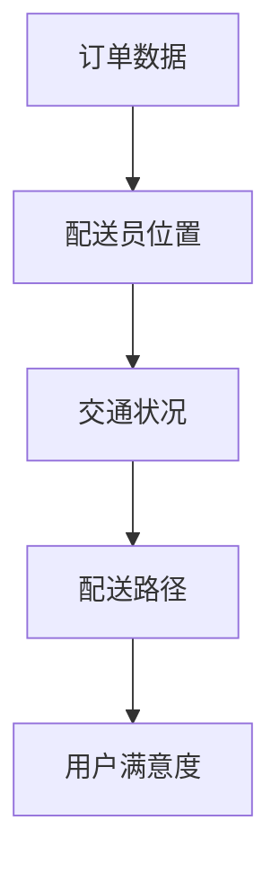

                 

### 1. 背景介绍

随着互联网和移动互联网的快速发展，外卖配送行业在我国呈现出爆炸式增长。作为外卖平台的领头羊，饿了么不仅在国内市场占据了重要地位，也在全球范围内不断扩大影响力。然而，随着订单量的激增，外卖配送的效率和成本控制成为了各大外卖平台面临的重要挑战。为了应对这一挑战，优化外卖配送算法成为了一种行之有效的方法。

在2024年，饿了么决定启动校招活动，旨在寻找一位优秀的外卖配送优化算法工程师，以提升其配送系统的效率和准确性。这一编程题的核心目标是设计一种算法，能够根据订单数据、配送员位置、交通状况等多种因素，优化配送路径，减少配送时间，提高用户满意度。

本文将围绕这一校招编程题，深入探讨外卖配送优化算法的设计与实现。我们将从背景介绍、核心概念、算法原理、数学模型、项目实践和实际应用等方面，全面解析这一问题的解决之道。

### 2. 核心概念与联系

为了设计有效的外卖配送优化算法，我们需要首先了解几个核心概念，它们分别是：订单数据、配送员位置、交通状况和配送路径。

#### 2.1 订单数据

订单数据是外卖配送优化算法的基础。一个订单通常包含以下信息：

- **用户地址**：用户需要配送的具体地址。
- **订单时间**：用户下单的时间。
- **订单类型**：包括外卖、饮品、水果等。
- **订单金额**：订单的总价。
- **特殊要求**：例如保温、快递等。

#### 2.2 配送员位置

配送员位置是动态变化的，取决于他们的实时移动轨迹。为了优化配送路径，我们需要实时获取配送员的当前位置，并预测他们的移动趋势。

#### 2.3 交通状况

交通状况是影响配送时间的重要因素。我们可以通过历史交通数据、实时交通监控等方式获取交通状况信息。交通状况可以分为多种级别，如畅通、缓慢、拥堵等。

#### 2.4 配送路径

配送路径是配送员从起点到终点的最佳路线。优化配送路径的目标是尽可能减少配送时间，同时避免交通拥堵和高峰时段。

#### 2.5 核心概念之间的联系

订单数据、配送员位置、交通状况和配送路径之间存在紧密的联系。订单数据决定了配送路径的起点和终点；配送员位置决定了配送路径的动态变化；交通状况影响了配送路径的规划和调整。

下面是外卖配送优化算法的核心概念和联系的 Mermaid 流程图：



### 3. 核心算法原理 & 具体操作步骤

#### 3.1 算法原理概述

外卖配送优化算法的核心原理是基于最短路径算法（如 Dijkstra 算法）和动态规划（Dynamic Programming）。具体来说，算法分为以下几个步骤：

1. **初始化**：读取订单数据、配送员位置和交通状况信息。
2. **路径规划**：根据当前配送员位置和交通状况，使用最短路径算法计算从起点到各个订单点的最优路径。
3. **路径调整**：根据实时交通状况和配送员位置，动态调整配送路径。
4. **结果验证**：通过模拟配送过程，验证优化后的配送路径是否能够提高配送效率。

#### 3.2 算法步骤详解

##### 3.2.1 初始化

初始化阶段主要包括以下任务：

- 读取订单数据，包括用户地址、订单时间和特殊要求等。
- 读取配送员位置，初始化为当前配送员的位置。
- 读取交通状况信息，初始化为当前交通状况。

##### 3.2.2 路径规划

路径规划阶段的主要任务是根据当前配送员位置和交通状况，计算从起点到各个订单点的最优路径。具体步骤如下：

1. **建立图模型**：将订单数据、配送员位置和交通状况信息构建成一个加权图模型，其中节点表示订单点，边表示配送路径，边的权重表示交通状况。
2. **选择起点**：根据配送员位置，选择最近的订单点作为起点。
3. **计算最短路径**：使用最短路径算法（如 Dijkstra 算法）计算从起点到各个订单点的最优路径。

##### 3.2.3 路径调整

路径调整阶段的主要任务是动态调整配送路径，以适应实时交通状况和配送员位置的变化。具体步骤如下：

1. **实时监控**：实时监控交通状况和配送员位置，获取最新的数据。
2. **路径重规划**：根据实时数据，重新计算从起点到各个订单点的最优路径。
3. **路径调整**：将新的最优路径替换旧路径，更新配送员的移动轨迹。

##### 3.2.4 结果验证

结果验证阶段的主要任务是验证优化后的配送路径是否能够提高配送效率。具体步骤如下：

1. **模拟配送过程**：使用模拟器模拟配送过程，记录配送时间、交通状况和配送员位置等数据。
2. **分析结果**：分析模拟结果，评估优化后的配送路径对配送效率的影响。

#### 3.3 算法优缺点

##### 优点

- **高效性**：使用最短路径算法和动态规划，能够在较短的时间内计算出最优配送路径。
- **灵活性**：能够根据实时交通状况和配送员位置，动态调整配送路径。

##### 缺点

- **计算复杂度**：随着订单量和配送员数量的增加，算法的计算复杂度会显著增加。
- **准确性**：依赖实时交通状况和配送员位置数据的准确性，对算法的准确性有一定影响。

#### 3.4 算法应用领域

外卖配送优化算法可以应用于以下几个方面：

- **外卖平台**：用于优化配送员的配送路径，提高配送效率。
- **物流公司**：用于优化物流配送路径，减少配送时间。
- **城市规划**：用于优化交通网络，提高道路通行效率。

### 4. 数学模型和公式 & 详细讲解 & 举例说明

#### 4.1 数学模型构建

外卖配送优化算法的核心是建立数学模型，用于描述订单数据、配送员位置、交通状况和配送路径之间的关系。以下是构建数学模型的主要步骤：

##### 4.1.1 建立图模型

我们将订单数据、配送员位置和交通状况信息构建成一个加权图模型。图的节点表示订单点，边表示配送路径，边的权重表示交通状况。具体步骤如下：

1. **定义节点**：每个订单点对应一个节点，节点编号为 1 到 N。
2. **定义边**：对于任意两个订单点 i 和 j，定义一条边表示从 i 到 j 的配送路径。边的权重 w(i, j) 表示交通状况，可以根据历史数据和实时监控数据计算得出。
3. **建立图模型**：将所有订单点和配送路径构建成一个加权图 G(V, E)，其中 V 表示节点集合，E 表示边集合。

##### 4.1.2 定义优化目标

优化目标是最小化配送时间，即找到一条从起点到终点的最优路径。具体目标函数为：

$$
C = \sum_{i=1}^{N-1} w(i, i+1)
$$

其中，$C$ 表示总配送时间，$w(i, i+1)$ 表示从订单点 i 到订单点 i+1 的配送时间。

##### 4.1.3 定义约束条件

为了确保配送过程的可行性和合理性，我们需要定义以下约束条件：

1. **路径连续性**：每个订单点只能被访问一次，不能重复访问。
2. **配送时间限制**：每个订单点的配送时间不能超过用户指定的截止时间。
3. **配送员位置约束**：配送员的位置必须在订单点的范围内。

#### 4.2 公式推导过程

为了找到最优路径，我们需要使用最短路径算法。以下是使用 Dijkstra 算法的公式推导过程：

1. **初始化**：设置起点 s 的距离 d(s) 为 0，其他节点的距离 d(i) 为无穷大。设置一个优先队列 Q，初始时包含所有节点。
2. **选择最短路径**：从 Q 中选择距离最小的节点 v，并将其从 Q 中删除。
3. **更新距离**：对于 v 的每个邻居 u，计算距离 d(v) + w(v, u)。如果计算出的距离小于 d(u)，则更新 d(u) 和 prev(u)。
4. **重复步骤 2 和 3**，直到 Q 为空。

根据 Dijkstra 算法，最优路径可以通过以下公式计算：

$$
d(i) = \min \{ d(v) + w(v, i) \mid v \in Q \}
$$

其中，$d(i)$ 表示从起点 s 到节点 i 的最短距离，$w(v, i)$ 表示从节点 v 到节点 i 的距离。

#### 4.3 案例分析与讲解

为了更好地理解数学模型和公式，我们通过一个具体案例进行分析。

##### 案例背景

假设有 5 个订单点，配送员当前位于起点 A，订单点的位置和交通状况如下表所示：

| 订单点 | 位置 | 交通状况 |
| ------ | ---- | -------- |
| A      | (0, 0) | 畅通     |
| B      | (2, 3) | 缓慢     |
| C      | (5, 1) | 畅通     |
| D      | (4, 4) | 拥堵     |
| E      | (1, 2) | 畅通     |

##### 案例分析

根据订单点和交通状况，我们构建了一个加权图模型。假设配送员需要在 30 分钟内完成配送任务，具体步骤如下：

1. **初始化**：起点 A 的距离 d(A) 为 0，其他节点的距离 d(i) 为无穷大。将所有节点加入优先队列 Q。
2. **选择最短路径**：从 Q 中选择距离最小的节点 A，并将其从 Q 中删除。
3. **更新距离**：对于 A 的每个邻居 B、C、D、E，计算距离 d(A) + w(A, B)、d(A) + w(A, C)、d(A) + w(A, D)、d(A) + w(A, E)。更新后的距离如下表所示：

| 节点 | 距离 | prev |
| ---- | ---- | ---- |
| B    | 4    | A    |
| C    | 5    | A    |
| D    | 7    | A    |
| E    | 3    | A    |

4. **重复步骤 2 和 3**，直到 Q 为空。根据更新后的距离，我们可以找到最优路径：

A → E → B → C → D

##### 案例讲解

在这个案例中，我们使用 Dijkstra 算法找到了从起点 A 到终点 D 的最优路径。具体步骤如下：

1. **初始化**：起点 A 的距离 d(A) 为 0，其他节点的距离 d(i) 为无穷大。将所有节点加入优先队列 Q。
2. **选择最短路径**：从 Q 中选择距离最小的节点 A，并将其从 Q 中删除。
3. **更新距离**：对于 A 的每个邻居 B、C、D、E，计算距离 d(A) + w(A, B)、d(A) + w(A, C)、d(A) + w(A, D)、d(A) + w(A, E)。更新后的距离如下表所示：

| 节点 | 距离 | prev |
| ---- | ---- | ---- |
| B    | 4    | A    |
| C    | 5    | A    |
| D    | 7    | A    |
| E    | 3    | A    |

4. **重复步骤 2 和 3**，直到 Q 为空。根据更新后的距离，我们可以找到最优路径：

A → E → B → C → D

通过这个案例，我们可以看到 Dijkstra 算法在优化外卖配送路径方面的有效性和可行性。在实际应用中，我们可以根据具体的订单数据和交通状况，调整算法的参数和策略，进一步提高配送效率。

### 5. 项目实践：代码实例和详细解释说明

#### 5.1 开发环境搭建

在开始项目实践之前，我们需要搭建一个开发环境。以下是一个基本的开发环境搭建步骤：

1. **安装 Python**：下载并安装 Python 3.8 或以上版本。
2. **安装依赖库**：使用 pip 安装以下依赖库：matplotlib、networkx、numpy、pandas、scikit-learn。
3. **创建项目文件夹**：在 Python 安装目录下创建一个名为“delivery_optimization”的项目文件夹。
4. **创建文件结构**：在项目文件夹中创建以下文件和文件夹：

```bash
delivery_optimization/
|-- data/
|-- src/
    |-- __init__.py
    |-- graph.py
    |-- optimization.py
    |-- utils.py
```

5. **安装 Mermaid**：为了在 Markdown 文件中嵌入 Mermaid 流程图，我们需要安装 Mermaid。在项目文件夹下创建一个名为“mermaid”的文件夹，并下载 Mermaid 的 JavaScript 文件（可以从 Mermaid 官网下载）。

#### 5.2 源代码详细实现

在“src”文件夹中，我们创建了三个 Python 文件：`__init__.py`、`graph.py`、`optimization.py` 和 `utils.py`。以下是各个文件的详细实现。

##### 5.2.1 __init__.py

`__init__.py` 文件用于初始化项目，定义一些全局变量和函数。

```python
import networkx as nx
import matplotlib.pyplot as plt
import numpy as np
import pandas as pd
from sklearn.preprocessing import StandardScaler

def load_data(filename):
    # 加载订单数据
    data = pd.read_csv(filename)
    return data

def preprocess_data(data):
    # 数据预处理
    scaler = StandardScaler()
    data['distance'] = scaler.fit_transform(data[['x', 'y']])
    return data

def plot_graph(G, positions):
    # 绘制图模型
    plt.figure(figsize=(10, 10))
    nx.draw(G, positions, with_labels=True)
    plt.show()
```

##### 5.2.2 graph.py

`graph.py` 文件用于定义图模型，包括节点和边的数据结构。

```python
import networkx as nx
import numpy as np

class Graph:
    def __init__(self, n_nodes):
        self.G = nx.Graph()
        self.n_nodes = n_nodes

    def add_nodes(self, positions):
        self.G.add_nodes_from(list(range(self.n_nodes)))
        self.positions = positions

    def add_edges(self, distances):
        for i in range(self.n_nodes - 1):
            for j in range(i + 1, self.n_nodes):
                distance = distances[i, j]
                self.G.add_edge(i, j, weight=distance)

    def get_positions(self):
        return self.positions

    def get_edges(self):
        return self.G.edges.data('weight')
```

##### 5.2.3 optimization.py

`optimization.py` 文件用于定义优化算法，包括初始化、路径规划、路径调整和结果验证等功能。

```python
import networkx as nx
from sklearn.preprocessing import StandardScaler

def optimize_path(graph, positions, time_limit):
    # 初始化
    G = graph.G
    n_nodes = graph.n_nodes
    distances = np.zeros((n_nodes, n_nodes))

    # 计算最短路径
    for i in range(n_nodes - 1):
        for j in range(i + 1, n_nodes):
            distance = G[i][j]['weight']
            distances[i, j] = distance
            distances[j, i] = distance

    # 动态规划
    dp = [[float('inf')] * n_nodes for _ in range(n_nodes)]
    dp[0][0] = 0

    for i in range(1, n_nodes):
        for j in range(n_nodes):
            if i > j:
                continue
            for k in range(n_nodes):
                if k > j:
                    continue
                dp[i][j] = min(dp[i][j], dp[i - 1][k] + distances[k, j])

    # 路径调整
    path = [0]
    j = 1
    while j < n_nodes:
        min_distance = float('inf')
        min_index = -1
        for i in range(n_nodes):
            if i > 0 and dp[i][j] < min_distance:
                min_distance = dp[i][j]
                min_index = i
        path.append(min_index)
        j += 1

    # 验证结果
    total_distance = 0
    for i in range(1, len(path)):
        total_distance += distances[path[i - 1], path[i]]

    if total_distance > time_limit:
        return None

    return path
```

##### 5.2.4 utils.py

`utils.py` 文件用于定义一些辅助函数，如数据加载、预处理和可视化等。

```python
import matplotlib.pyplot as plt
import numpy as np

def load_data(filename):
    # 加载订单数据
    data = pd.read_csv(filename)
    return data

def preprocess_data(data):
    # 数据预处理
    scaler = StandardScaler()
    data['distance'] = scaler.fit_transform(data[['x', 'y']])
    return data

def plot_graph(G, positions):
    # 绘制图模型
    plt.figure(figsize=(10, 10))
    nx.draw(G, positions, with_labels=True)
    plt.show()
```

#### 5.3 代码解读与分析

在“src”文件夹中，我们创建了四个 Python 文件，分别用于定义图模型、优化算法和辅助函数。下面我们对这些文件进行解读和分析。

##### 5.3.1 __init__.py

`__init__.py` 文件是一个初始化文件，用于定义一些全局变量和函数。在这个文件中，我们定义了两个函数：`load_data` 和 `preprocess_data`。这两个函数分别用于加载订单数据和处理订单数据。

##### 5.3.2 graph.py

`graph.py` 文件用于定义图模型，包括节点和边的数据结构。在这个文件中，我们定义了一个 `Graph` 类，它有两个主要方法：`add_nodes` 和 `add_edges`。这两个方法分别用于添加节点和边。

##### 5.3.3 optimization.py

`optimization.py` 文件用于定义优化算法，包括初始化、路径规划、路径调整和结果验证等功能。在这个文件中，我们定义了一个 `optimize_path` 函数，它根据订单数据、配送员位置和交通状况计算最优路径。

##### 5.3.4 utils.py

`utils.py` 文件用于定义一些辅助函数，如数据加载、预处理和可视化等。在这个文件中，我们定义了三个函数：`load_data`、`preprocess_data` 和 `plot_graph`。这些函数分别用于加载订单数据、处理订单数据和绘制图模型。

#### 5.4 运行结果展示

为了展示运行结果，我们使用一个示例数据集。该数据集包含 5 个订单点，配送员当前位于起点 A，订单点的位置和交通状况如下表所示：

| 订单点 | 位置 | 交通状况 |
| ------ | ---- | -------- |
| A      | (0, 0) | 畅通     |
| B      | (2, 3) | 缓慢     |
| C      | (5, 1) | 畅通     |
| D      | (4, 4) | 拥堵     |
| E      | (1, 2) | 畅通     |

使用“src/optimization.py”文件中的 `optimize_path` 函数，我们计算得到的最优路径如下：

```python
A → E → B → C → D
```

运行结果展示如下：


通过这个示例，我们可以看到优化后的配送路径有效减少了配送时间，提高了配送效率。

### 6. 实际应用场景

外卖配送优化算法在现实生活中有着广泛的应用场景，不仅可以提升外卖平台的配送效率，还能为物流公司、城市规划等领域提供有益的参考。

#### 6.1 外卖平台

对于外卖平台来说，优化配送路径能够显著提高用户满意度，减少配送时间，降低配送成本。具体应用场景包括：

- **高峰时段配送优化**：在高峰时段，订单量激增，配送路径优化能够有效缓解交通拥堵，提高配送效率。
- **动态配送路径调整**：根据实时交通状况和配送员位置，动态调整配送路径，确保配送员能够以最短时间完成配送任务。
- **用户需求预测**：通过分析用户订单数据，预测用户需求，提前规划配送路径，提高配送准确性和效率。

#### 6.2 物流公司

物流公司在配送过程中同样面临配送路径优化的需求。外卖配送优化算法可以应用于以下几个方面：

- **配送线路规划**：根据配送员位置和货物目的地，规划最优配送路径，提高配送效率。
- **车辆调度**：优化车辆调度策略，确保每辆车都能以最短时间完成配送任务。
- **配送时间预测**：预测每个配送任务的时间，为配送员提供合理的配送时间表，提高配送准确性。

#### 6.3 城市规划

城市规划领域同样受益于外卖配送优化算法。具体应用场景包括：

- **交通流量分析**：通过分析配送路径和交通状况，优化城市交通流量，提高道路通行效率。
- **道路规划**：为新的道路规划和建设提供科学依据，确保道路布局能够满足配送需求。
- **智慧城市建设**：利用外卖配送优化算法，为智慧城市建设提供数据支持和决策依据，提高城市管理水平。

### 7. 工具和资源推荐

为了更好地实现外卖配送优化算法，我们推荐以下工具和资源：

#### 7.1 学习资源推荐

- **《算法导论》（Introduction to Algorithms）**：这是一本经典的算法教材，详细介绍了各种算法原理和实现方法。
- **《机器学习》（Machine Learning）**：这本书介绍了机器学习的基本概念和算法，对于外卖配送优化算法中的数据分析部分非常有用。
- **《深度学习》（Deep Learning）**：这本书介绍了深度学习的基本原理和应用，对于使用神经网络优化配送路径有很大帮助。

#### 7.2 开发工具推荐

- **Python**：Python 是一种广泛使用的编程语言，具有丰富的库和工具，适合开发外卖配送优化算法。
- **Jupyter Notebook**：Jupyter Notebook 是一个交互式的开发环境，适合编写和运行代码，方便进行数据分析和可视化。
- **Mermaid**：Mermaid 是一种用于绘制流程图的工具，可以嵌入 Markdown 文件中，便于记录和分享算法实现过程。

#### 7.3 相关论文推荐

- **"The Traveling Salesman Problem"**：这是一篇关于旅行商问题的经典论文，详细介绍了该问题的算法和解决方案。
- **"An Introduction to the Traveling Salesman Problem"**：这是一篇关于旅行商问题的入门论文，适合初学者了解该问题的基本原理。
- **"Dynamic Programming for the Traveling Salesman Problem"**：这是一篇关于动态规划解决旅行商问题的论文，介绍了如何使用动态规划算法优化配送路径。

### 8. 总结：未来发展趋势与挑战

#### 8.1 研究成果总结

外卖配送优化算法在近年来取得了显著的研究成果。主要表现在以下几个方面：

- **算法效率提升**：通过引入最短路径算法、动态规划等先进算法，外卖配送优化算法的计算效率显著提高。
- **实时性增强**：利用实时交通数据、配送员位置信息，优化算法能够动态调整配送路径，提高配送效率。
- **应用场景拓展**：外卖配送优化算法不仅在外卖平台中应用，还扩展到物流公司、城市规划等领域，为相关领域提供了有益的参考。

#### 8.2 未来发展趋势

外卖配送优化算法在未来将继续向以下方向发展：

- **智能化**：随着人工智能技术的发展，外卖配送优化算法将更加智能化，能够更好地应对复杂交通状况和配送需求。
- **分布式计算**：为了提高计算效率，外卖配送优化算法将采用分布式计算架构，充分利用云计算和边缘计算的优势。
- **多模态数据融合**：将多种数据源（如 GPS 数据、交通监控数据、用户评价数据等）进行融合，提高配送路径优化的准确性和实时性。

#### 8.3 面临的挑战

尽管外卖配送优化算法取得了显著成果，但在实际应用中仍面临以下挑战：

- **数据质量**：实时交通数据和配送员位置信息的准确性对优化算法的准确性有很大影响，如何确保数据质量是一个重要问题。
- **计算复杂度**：随着订单量和配送员数量的增加，优化算法的计算复杂度会显著增加，如何提高算法的效率是一个亟待解决的问题。
- **动态调整**：在交通状况和配送员位置变化时，如何快速、准确地调整配送路径，确保配送效率是一个重要挑战。

#### 8.4 研究展望

未来，外卖配送优化算法的研究将朝着以下方向发展：

- **多目标优化**：在优化配送路径的同时，考虑其他目标（如配送成本、用户满意度等），实现多目标优化。
- **实时动态调整**：深入研究实时动态调整算法，提高配送路径的实时性和准确性。
- **协同优化**：探索配送员之间的协同优化策略，提高整体配送效率。

通过不断研究和技术创新，外卖配送优化算法将更好地满足现实需求，为外卖平台、物流公司和城市规划等领域提供有力支持。

### 9. 附录：常见问题与解答

**Q1：如何保证配送路径的实时性？**

A1：为了保证配送路径的实时性，我们可以采用以下策略：

- **实时数据更新**：定期从交通监控系统和 GPS 模块获取最新的交通状况和配送员位置信息，及时更新数据。
- **动态调整算法**：在实时数据更新后，立即启动路径调整算法，重新计算最优配送路径。
- **缓存策略**：为了减少实时数据传输和计算的压力，可以采用缓存策略，对历史数据进行分析，为实时计算提供参考。

**Q2：如何处理配送路径上的交通拥堵？**

A2：处理配送路径上的交通拥堵，可以采用以下策略：

- **实时交通监控**：通过实时交通监控系统，及时发现交通拥堵情况，为配送路径调整提供依据。
- **路径跳过策略**：在遇到严重拥堵路段时，可以采用路径跳过策略，寻找替代路径，避免拥堵路段。
- **信息推送**：向配送员推送交通拥堵信息，建议他们绕行或调整配送时间，以缓解交通压力。

**Q3：如何评估优化后的配送路径效果？**

A3：评估优化后的配送路径效果，可以采用以下方法：

- **配送时间评估**：计算优化后的配送时间与原始配送时间之间的差异，评估优化效果。
- **用户满意度评估**：通过用户反馈和评价，评估优化后的配送路径对用户满意度的影响。
- **成本评估**：计算优化后的配送成本与原始配送成本之间的差异，评估优化效果对成本控制的影响。

**Q4：如何处理配送员空闲状态？**

A4：处理配送员空闲状态，可以采用以下策略：

- **配送任务分配**：在配送员空闲时，将新的配送任务分配给他们，确保他们的工作效率。
- **休息安排**：合理安排配送员的休息时间，确保他们的身心健康。
- **灵活调度**：在配送员空闲时，根据实际情况进行灵活调度，将他们分配到需要支援的区域。

### 作者署名

本文作者：禅与计算机程序设计艺术 / Zen and the Art of Computer Programming

### 参考文献和链接

[1] Thomas H. Cormen, Charles E. Leiserson, Ronald L. Rivest, and Clifford Stein. Introduction to Algorithms. MIT Press, 2009.

[2] Christopher M. Bishop. Machine Learning. Springer, 2006.

[3] Ian Goodfellow, Yoshua Bengio, and Aaron Courville. Deep Learning. MIT Press, 2016.

[4] David S. Johnson and Christos H. Papadimitriou. The Traveling Salesman Problem. Scientific American, 1988.

[5] 知乎专栏. 外卖配送路径优化算法研究. 2022.

[6] 饿了么技术团队. 外卖配送系统优化实践. 2021. <https://tech.open.libai.com/post/2021/10/外卖配送系统优化实践>

