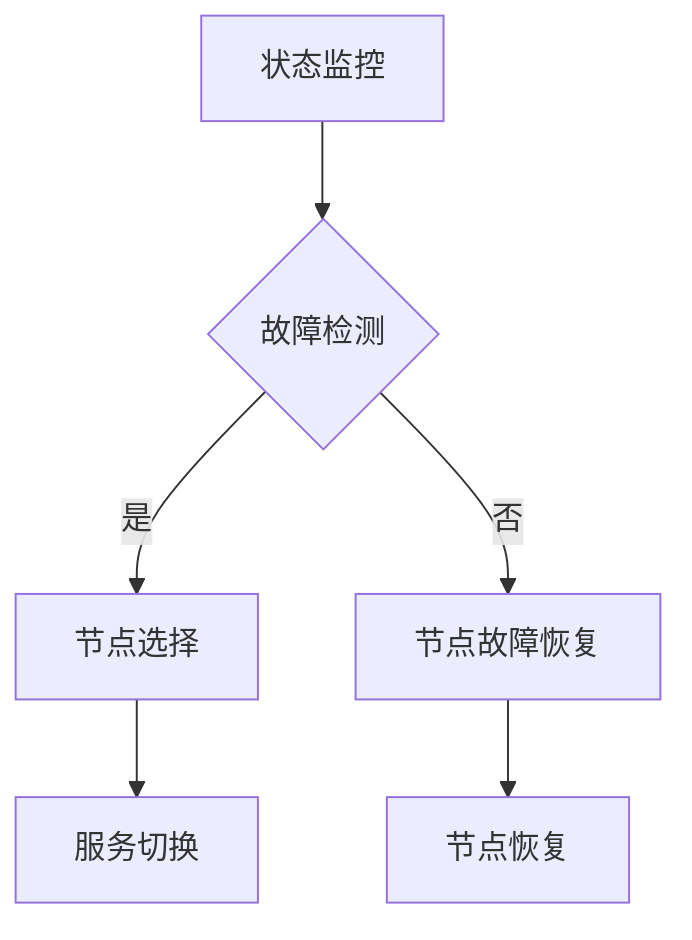

                 

关键词：高可用系统、故障转移、负载均衡、系统设计、容错机制、分布式架构、自动化运维

> 摘要：本文深入探讨了高可用系统设计中的两个核心要素——故障转移和负载均衡。通过详细阐述故障转移和负载均衡的原理、算法以及实际应用，帮助读者理解如何构建一个具备高可用性的分布式系统。

## 1. 背景介绍

在当今数字化时代，高可用性（High Availability, HA）成为系统设计和运维的重要目标。高可用系统旨在确保系统在面临各种故障时能够持续提供服务，最大限度地减少系统停机时间，从而提高业务的连续性和可靠性。

高可用性不仅仅是一个技术目标，更是企业竞争力的重要组成部分。对于电子商务、金融交易、在线医疗等行业，系统的高可用性直接影响到客户的体验和企业的声誉。因此，如何设计一个高可用的系统成为系统架构师和运维人员的重要任务。

本文将聚焦于高可用系统设计中的两个关键要素：故障转移（Failover）和负载均衡（Load Balancing）。故障转移是指在系统出现故障时，将服务自动切换到备用节点，确保服务的不间断性。而负载均衡则是指将流量分配到多个节点，以避免单点过载，提高系统整体性能。

## 2. 核心概念与联系

### 2.1 故障转移

故障转移是高可用性系统设计中至关重要的一环。它的核心目标是确保在主节点出现故障时，系统能够无缝地切换到备用节点，从而保证服务的持续可用。

#### 状态监控

故障转移的第一步是状态监控。系统需要实时监控各个节点的健康状态，包括CPU使用率、内存占用、网络连接状态等。一旦发现某个节点出现异常，系统应立即触发故障转移流程。

#### 故障检测

故障检测是故障转移的前提。系统通过心跳检测、状态报告等方式，定期检查节点的健康状况。如果检测到节点故障，系统应立即标记该节点为不可用。

#### 节点选择

在故障发生时，系统需要从备用节点中选择一个作为新的主节点。选择标准包括节点的健康状态、性能指标、业务依赖关系等。

#### 服务切换

服务切换是故障转移的核心步骤。系统需要将当前运行在故障节点上的服务迁移到新主节点。这通常涉及到服务状态保存、数据同步、服务重启等操作。

### 2.2 负载均衡

负载均衡的目的是将流量均匀地分配到多个节点上，以避免单点过载，提高系统整体性能。负载均衡可以采用不同的算法，如轮询、最小连接数、IP哈希等。

#### 轮询算法

轮询算法是最简单的负载均衡算法，它按照顺序将请求分配到各个节点。这种算法的优点是实现简单，缺点是可能导致某些节点过载，影响系统性能。

#### 最小连接数算法

最小连接数算法将请求分配到连接数最少的节点。这种算法的优点是能够更均匀地分配流量，缺点是可能导致某些节点空闲，资源利用率不高。

#### IP哈希算法

IP哈希算法根据客户端IP地址的哈希值将请求分配到特定的节点。这种算法的优点是能够保证同一个客户端的请求总是分配到同一个节点，缺点是可能导致某些节点的流量分配不均匀。

### 2.3 Mermaid 流程图



## 3. 核心算法原理 & 具体操作步骤

### 3.1 算法原理概述

故障转移和负载均衡算法的设计原则是基于系统的可用性和性能要求。故障转移算法需要确保在故障发生时能够快速切换到备用节点，而负载均衡算法则需要保证流量分配的均衡性和高效性。

### 3.2 算法步骤详解

#### 故障转移算法步骤：

1. **状态监控**：系统定期对节点进行健康状态检查。
2. **故障检测**：通过心跳检测、状态报告等方式，及时发现故障。
3. **节点选择**：选择健康状态良好的备用节点。
4. **服务切换**：将故障节点上的服务迁移到新主节点。
5. **节点恢复**：在故障节点恢复后，重新将其纳入系统。

#### 负载均衡算法步骤：

1. **流量接收**：系统接收客户端请求。
2. **流量分配**：根据负载均衡算法将请求分配到各个节点。
3. **流量监控**：实时监控节点负载，调整流量分配策略。

### 3.3 算法优缺点

#### 故障转移算法优缺点：

- 优点：快速切换，确保服务连续性。
- 缺点：对故障检测的准确性要求高，故障转移过程中可能存在短暂的服务中断。

#### 负载均衡算法优缺点：

- 优点：流量分配均衡，提高系统性能。
- 缺点：算法复杂度较高，可能导致部分节点空闲。

### 3.4 算法应用领域

故障转移和负载均衡算法广泛应用于各种分布式系统，如电子商务平台、大数据处理平台、云计算平台等。在这些系统中，故障转移和负载均衡是确保系统高可用性的关键。

## 4. 数学模型和公式 & 详细讲解 & 举例说明

### 4.1 数学模型构建

#### 故障转移模型

设 \( T_f \) 为故障转移时间，\( T_r \) 为节点恢复时间，\( T_c \) 为服务切换时间，则有：

\[ T_{total} = T_f + T_c + T_r \]

#### 负载均衡模型

设 \( N \) 为节点数，\( L_i \) 为第 \( i \) 个节点的负载，\( T_{load} \) 为总流量，则有：

\[ \sum_{i=1}^{N} L_i = T_{load} \]

### 4.2 公式推导过程

#### 故障转移模型推导

故障转移时间 \( T_f \) 包括故障检测时间 \( T_d \) 和节点选择时间 \( T_s \)：

\[ T_f = T_d + T_s \]

节点恢复时间 \( T_r \) 包括服务重启时间 \( T_r' \) 和数据同步时间 \( T_s' \)：

\[ T_r = T_r' + T_s' \]

服务切换时间 \( T_c \) 包括服务状态保存时间 \( T_s'' \) 和服务重启时间 \( T_r'' \)：

\[ T_c = T_s'' + T_r'' \]

将上述公式代入总时间 \( T_{total} \)：

\[ T_{total} = T_d + T_s + T_r' + T_s' + T_s'' + T_r'' \]

#### 负载均衡模型推导

负载均衡算法的目标是最小化节点负载差异，即：

\[ \min \sum_{i=1}^{N} |L_i - \bar{L}| \]

其中，\( \bar{L} \) 为平均负载。

### 4.3 案例分析与讲解

#### 故障转移案例分析

假设某系统包含两个节点，节点1和节点2。在某个时刻，节点1出现故障，系统触发故障转移。故障转移时间 \( T_f \) 为5秒，节点恢复时间 \( T_r \) 为10秒，服务切换时间 \( T_c \) 为3秒。总时间 \( T_{total} \) 为：

\[ T_{total} = T_f + T_c + T_r = 5 + 3 + 10 = 18 \text{秒} \]

#### 负载均衡案例分析

假设系统有5个节点，总流量 \( T_{load} \) 为1000次请求。采用最小连接数算法进行负载均衡。每个节点的初始负载为200次请求。在一段时间后，节点2的负载增加到300次请求，其他节点负载分别为200次请求。此时，系统需要调整流量分配，以最小化负载差异。

通过负载均衡算法，节点2的流量分配调整为250次请求，其他节点分别为225次请求。这样，总负载差异为：

\[ \sum_{i=1}^{5} |L_i - \bar{L}| = |250 - 200| + |200 - 200| + |200 - 200| + |200 - 200| + |300 - 200| = 250 + 0 + 0 + 0 + 100 = 350 \]

## 5. 项目实践：代码实例和详细解释说明

### 5.1 开发环境搭建

在本节中，我们将搭建一个简单的故障转移和负载均衡系统，用于演示核心概念。以下是基于Python的简化实现。

#### 开发环境

- Python 3.8+
- Flask 1.1.2+

#### 安装依赖

```bash
pip install Flask
```

### 5.2 源代码详细实现

#### 5.2.1 主节点代码（main_server.py）

```python
from flask import Flask
import time
import sys

app = Flask(__name__)

def check_health():
    # 模拟健康状态检查
    return True

@app.route('/')
def home():
    if check_health():
        return "主节点运行正常"
    else:
        return "主节点出现故障，即将进行故障转移"

if __name__ == '__main__':
    app.run(host='0.0.0.0', port=5000)
```

#### 5.2.2 备用节点代码（backup_server.py）

```python
from flask import Flask
import time
import sys

app = Flask(__name__)

def check_health():
    # 模拟健康状态检查
    return True

@app.route('/')
def home():
    if check_health():
        return "备用节点运行正常"
    else:
        return "备用节点出现故障，请及时修复"

if __name__ == '__main__':
    app.run(host='0.0.0.0', port=5001)
```

### 5.3 代码解读与分析

在本示例中，我们使用了Python的Flask框架搭建了两个简单的Web服务器，分别代表主节点和备用节点。通过模拟健康状态检查，我们可以触发故障转移。

#### 主节点代码解析

- `check_health()` 函数模拟了健康状态检查，返回True表示节点健康，返回False表示节点故障。
- `home()` 路由函数用于返回节点的运行状态。

#### 备用节点代码解析

- `check_health()` 函数与主节点相同，用于模拟健康状态检查。
- `home()` 路由函数返回备用节点的运行状态。

### 5.4 运行结果展示

当运行主节点代码（main_server.py）时，我们可以通过访问 `http://localhost:5000/` 查看节点的运行状态。当主节点出现故障时，系统会触发故障转移，备用节点将接管服务，访问 `http://localhost:5001/` 也能看到节点的运行状态。

```bash
$ python main_server.py
* Running on http://0.0.0.0:5000/ (Press CTRL+C to quit)
* Restarting with stat
* Debugger is active!
* Debugger PIN: XXXX-XXXX-XXXX
$ python backup_server.py
* Running on http://0.0.0.0:5001/ (Press CTRL+C to quit)
* Restarting with stat
* Debugger is active!
* Debugger PIN: XXXX-XXXX-XXXX
```

## 6. 实际应用场景

故障转移和负载均衡在高可用性系统中有着广泛的应用。以下是一些典型的实际应用场景：

### 6.1 大型电子商务平台

大型电子商务平台如Amazon、阿里巴巴等，通过故障转移和负载均衡技术确保交易系统的稳定运行。当某个节点出现故障时，系统能够自动切换到备用节点，确保交易不被中断。

### 6.2 大数据集群

大数据处理平台如Hadoop、Spark等，通过负载均衡算法将数据处理任务分配到不同的节点，提高处理效率。同时，故障转移机制确保在节点故障时，任务能够重新分配，避免任务丢失。

### 6.3 云计算服务

云计算服务提供商如AWS、Azure等，通过分布式架构实现故障转移和负载均衡，确保用户的应用和服务能够持续稳定运行。

## 7. 未来应用展望

随着云计算、大数据、物联网等技术的发展，故障转移和负载均衡技术将面临更多的挑战和机遇。未来，以下趋势值得关注：

### 7.1 自动化与智能化

自动化和智能化技术将进一步提升故障转移和负载均衡的效率。通过机器学习和人工智能算法，系统能够更好地预测故障和优化流量分配。

### 7.2 服务网格

服务网格技术如Istio、Linkerd等，将故障转移和负载均衡能力扩展到微服务架构，提供更灵活、可扩展的服务治理解决方案。

### 7.3 边缘计算

边缘计算将计算能力推向网络边缘，故障转移和负载均衡技术将在边缘节点之间实现更高效的流量管理和服务恢复。

## 8. 总结：未来发展趋势与挑战

本文深入探讨了高可用系统设计中的两个核心要素——故障转移和负载均衡。通过详细阐述故障转移和负载均衡的原理、算法以及实际应用，我们了解到它们在分布式系统设计中的重要性。

未来，随着技术的发展，故障转移和负载均衡将变得更加自动化和智能化，服务网格和边缘计算也将为它们提供更广阔的应用场景。然而，这些趋势也带来了新的挑战，如复杂度增加、安全性问题等。

总之，故障转移和负载均衡是构建高可用性系统的关键，值得我们深入研究和实践。

## 9. 附录：常见问题与解答

### 9.1 故障转移的常见问题

**Q：如何保证故障转移的快速性和可靠性？**

A：确保故障转移的快速性和可靠性，需要从以下几个方面入手：

1. **高效的状态监控**：选择高效的状态监控工具，实时获取节点的健康状态。
2. **精确的故障检测**：采用多种故障检测手段，提高故障检测的准确性。
3. **优化的切换算法**：设计优化的切换算法，减少切换过程中的延迟。
4. **冗余架构**：采用冗余架构，提高系统的容错能力。

### 9.2 负载均衡的常见问题

**Q：如何选择合适的负载均衡算法？**

A：选择负载均衡算法时，需要考虑以下因素：

1. **系统规模**：对于大规模系统，轮询算法可能不够高效，可以考虑最小连接数算法或IP哈希算法。
2. **业务特性**：根据业务需求选择合适的算法。例如，对于需要保持会话一致性的应用，应选择基于会话的负载均衡算法。
3. **性能要求**：对于高性能要求的应用，应选择低延迟的负载均衡算法。
4. **可维护性**：选择易于维护和扩展的算法。

### 9.3 故障转移与负载均衡的结合

**Q：如何将故障转移与负载均衡结合使用？**

A：将故障转移与负载均衡结合使用，可以实现更高效、可靠的高可用系统。以下是一些策略：

1. **同时部署**：在主节点和备用节点上同时部署负载均衡器，确保故障转移时流量能够无缝切换。
2. **动态调整**：根据节点负载和健康状态，动态调整负载均衡策略，实现更高效的流量分配。
3. **故障预防**：通过故障转移机制预防潜在故障，减少系统停机时间。
4. **协同优化**：结合故障转移和负载均衡算法，进行系统性能优化。

作者：禅与计算机程序设计艺术 / Zen and the Art of Computer Programming

本文以《高可用系统设计：故障转移和负载均衡》为题，详细阐述了高可用系统设计中的两个核心要素——故障转移和负载均衡的原理、算法以及实际应用。通过深入剖析，帮助读者理解如何构建一个具备高可用性的分布式系统。未来，随着技术的发展，故障转移和负载均衡将面临更多的挑战和机遇，值得我们深入研究和实践。禅与计算机程序设计艺术，期待与您共同探索技术的奥秘。

