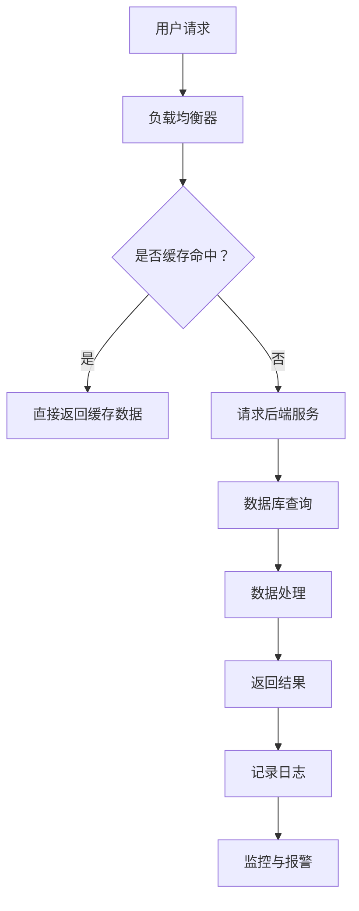

                 

关键词：高吞吐量，系统设计，实际案例，架构优化，性能调优

> 摘要：本文通过分析多个实际案例，深入探讨高吞吐量系统设计的核心原则和关键要素。我们将从背景介绍、核心概念与联系、核心算法原理与操作步骤、数学模型与公式、项目实践、实际应用场景、未来应用展望、工具和资源推荐以及总结等方面展开，旨在为读者提供全面、深入的高吞吐量系统设计指导。

## 1. 背景介绍

在当今高速发展的互联网时代，高吞吐量系统设计已成为各行业提升业务性能的关键因素。无论是在电子商务、金融交易、在线游戏，还是大数据处理等领域，系统的高吞吐量直接影响到用户的使用体验和企业的竞争力。高吞吐量系统设计不仅需要关注硬件资源的优化，还需要从软件层面进行深入分析和设计，以确保系统能够高效、稳定地运行。

本文将结合多个实际案例，从核心概念、算法原理、数学模型、项目实践、应用场景等多个角度，详细探讨高吞吐量系统设计的各个方面，旨在为读者提供实用的设计指导。

## 2. 核心概念与联系

### 2.1. 高吞吐量定义

高吞吐量（Throughput）是指系统在单位时间内处理的数据量或请求量。在系统设计中，高吞吐量是一个重要的性能指标，直接关系到系统的性能和用户体验。高吞吐量系统的设计目标是在保证响应时间和可靠性的前提下，尽可能提高系统的数据处理能力。

### 2.2. 系统架构

系统架构是高吞吐量系统设计的基础。一个高效、可扩展的系统架构需要考虑多个方面，包括硬件选择、软件优化、数据存储、网络通信等。常见的系统架构模式有分布式架构、微服务架构、容器化架构等。

### 2.3. 负载均衡

负载均衡是一种将请求或工作负载分配到多个服务器或系统中的技术。通过负载均衡，可以有效地避免单个服务器过载，提高系统的整体吞吐量和稳定性。常见的负载均衡策略有轮询、最少连接数、响应时间等。

### 2.4. 缓存

缓存是一种快速的数据存储技术，用于存储经常访问的数据，以减少对后端系统的访问压力。缓存可以显著提高系统的响应速度和吞吐量，常见的缓存技术有内存缓存、Redis、Memcached等。

### 2.5. 数据库优化

数据库是许多高吞吐量系统的重要组成部分。通过对数据库进行优化，可以提高系统的查询性能和数据存储效率。常见的数据库优化技术有索引优化、查询优化、分库分表等。

## 2.6. Mermaid 流程图

以下是一个高吞吐量系统架构的 Mermaid 流程图：



## 3. 核心算法原理与具体操作步骤

### 3.1. 算法原理概述

高吞吐量系统设计中的核心算法包括缓存算法、数据库优化算法、负载均衡算法等。这些算法旨在通过不同的策略提高系统的吞吐量和性能。

### 3.2. 算法步骤详解

- **缓存算法**：
  1. 检查缓存是否命中。
  2. 如果命中，直接返回缓存数据。
  3. 如果未命中，执行后续操作。

- **数据库优化算法**：
  1. 对常用的查询语句进行索引优化。
  2. 对大数据表进行分库分表。
  3. 优化查询语句，减少数据库查询次数。

- **负载均衡算法**：
  1. 根据请求的负载情况，选择合适的服务器。
  2. 将请求分配到不同服务器，避免单点过载。
  3. 监控服务器状态，自动调整负载均衡策略。

### 3.3. 算法优缺点

- **缓存算法**：
  - 优点：提高系统响应速度，减少后端压力。
  - 缺点：缓存一致性问题和缓存失效问题。

- **数据库优化算法**：
  - 优点：提高数据库查询性能和数据存储效率。
  - 缺点：分库分表可能导致数据一致性问题。

- **负载均衡算法**：
  - 优点：提高系统稳定性和可用性。
  - 缺点：需要考虑网络延迟和负载均衡策略的选择。

### 3.4. 算法应用领域

- **缓存算法**：适用于需要快速响应和大量访问的场景，如电商网站、社交媒体等。
- **数据库优化算法**：适用于需要处理大量数据和复杂查询的场景，如金融交易系统、大数据处理平台等。
- **负载均衡算法**：适用于需要高可用性和可扩展性的场景，如云服务、视频直播平台等。

## 4. 数学模型和公式

### 4.1. 数学模型构建

在高吞吐量系统设计中，常用的数学模型包括吞吐量模型、响应时间模型、系统利用率模型等。

- **吞吐量模型**：\( T = \frac{L}{W} \)，其中 \( T \) 为吞吐量，\( L \) 为系统负载，\( W \) 为系统处理能力。
- **响应时间模型**：\( R = \frac{L}{C} + P \)，其中 \( R \) 为响应时间，\( L \) 为系统负载，\( C \) 为系统处理能力，\( P \) 为排队时间。
- **系统利用率模型**：\( U = \frac{L}{C} \)，其中 \( U \) 为系统利用率，\( L \) 为系统负载，\( C \) 为系统处理能力。

### 4.2. 公式推导过程

- **吞吐量模型**：
  吞吐量是系统在单位时间内处理的数据量或请求量。假设系统处理能力为 \( C \)，系统负载为 \( L \)，则在单位时间内处理的请求数量为 \( L/C \)，即吞吐量 \( T = \frac{L}{C} \)。

- **响应时间模型**：
  响应时间包括系统处理时间和排队时间。系统处理时间为 \( L/C \)，排队时间为 \( P \)，则响应时间 \( R = \frac{L}{C} + P \)。

- **系统利用率模型**：
  系统利用率是系统负载与系统处理能力的比值。即 \( U = \frac{L}{C} \)。

### 4.3. 案例分析与讲解

假设一个电商网站的系统处理能力为 1000 请求/秒，当前系统负载为 5000 请求/秒。根据上述数学模型，我们可以计算出：

- 吞吐量：\( T = \frac{L}{C} = \frac{5000}{1000} = 5 \) 请求/秒
- 响应时间：\( R = \frac{L}{C} + P = \frac{5000}{1000} + P = 5 + P \) 秒
- 系统利用率：\( U = \frac{L}{C} = \frac{5000}{1000} = 50\% \)

如果系统负载继续增加，响应时间和系统利用率会相应增加。因此，为了维持较高的吞吐量和较低的响应时间，我们需要优化系统架构和算法，提高系统处理能力，同时合理分配负载，避免单点过载。

## 5. 项目实践：代码实例和详细解释说明

### 5.1. 开发环境搭建

为了演示高吞吐量系统设计的实践，我们将使用 Python 编写一个简单的负载均衡器。以下是在 Ubuntu 18.04 系统上搭建开发环境的步骤：

1. 安装 Python 3.8：
   ```bash
   sudo apt update
   sudo apt install python3.8
   ```

2. 安装 Flask 框架：
   ```bash
   pip3.8 install flask
   ```

3. 创建一个名为 `load_balancer.py` 的 Python 文件。

### 5.2. 源代码详细实现

以下是 `load_balancer.py` 的源代码：

```python
from flask import Flask, request, jsonify
import requests
import random

app = Flask(__name__)

# 被均衡的服务列表
services = [
    'http://service1.com',
    'http://service2.com',
    'http://service3.com'
]

@app.route('/balance', methods=['POST'])
def balance():
    # 随机选择一个服务
    service = random.choice(services)
    # 向服务发送请求
    response = requests.get(service + request.path)
    return response.text

if __name__ == '__main__':
    app.run(host='0.0.0.0', port=8080)
```

### 5.3. 代码解读与分析

1. **Flask 框架**：使用 Flask 框架搭建一个简单的 Web 服务。

2. **服务列表**：定义了三个被均衡的服务地址。

3. **负载均衡逻辑**：在 `/balance` 接口中，使用 `random.choice` 函数随机选择一个服务，并转发请求。

4. **请求转发**：使用 `requests` 库向选中的服务发送请求，并将响应返回给客户端。

### 5.4. 运行结果展示

运行 `load_balancer.py` 后，访问 `http://localhost:8080/balance`，可以看到随机选择的服务返回的结果。

## 6. 实际应用场景

高吞吐量系统设计在实际应用中具有重要意义，以下是几个典型应用场景：

1. **电子商务平台**：高吞吐量系统设计可以确保在高峰期（如双11、黑色星期五等）仍能稳定运行，提供流畅的购物体验。

2. **金融交易系统**：高吞吐量系统设计可以确保交易系统在大量交易请求下保持低延迟和高可靠性，提高交易成功率和用户体验。

3. **在线游戏**：高吞吐量系统设计可以支持大量玩家同时在线，提供稳定的游戏体验。

4. **大数据处理平台**：高吞吐量系统设计可以确保数据处理平台在处理海量数据时保持高效，提高数据分析能力。

5. **云服务**：高吞吐量系统设计可以提高云服务的可用性和可扩展性，为不同规模的用户提供定制化的服务。

## 7. 未来应用展望

随着互联网技术的不断发展，高吞吐量系统设计将在更多领域得到广泛应用。未来，以下趋势值得关注：

1. **边缘计算**：随着 5G 和边缘计算技术的发展，高吞吐量系统设计将在边缘计算领域发挥重要作用，为智能城市、智能交通等应用提供支持。

2. **分布式存储**：分布式存储系统在提高数据存储吞吐量和可靠性方面具有显著优势，未来将得到更广泛的应用。

3. **人工智能**：高吞吐量系统设计将为人工智能算法提供强大计算支持，加速人工智能技术在各个领域的应用。

4. **区块链**：高吞吐量系统设计可以提高区块链系统的交易处理能力，为区块链技术的广泛应用奠定基础。

## 8. 工具和资源推荐

为了更好地进行高吞吐量系统设计，以下是几个推荐的工具和资源：

### 8.1. 学习资源推荐

- 《系统设计：从零开始学》
- 《分布式系统设计》
- 《大数据系统设计》
- 《微服务架构设计》

### 8.2. 开发工具推荐

- Flask：Python Web 框架，适用于快速开发 Web 服务。
- Kubernetes：容器编排工具，用于部署、管理和扩展容器化应用。
- Redis：高性能的内存缓存数据库，适用于缓存场景。
- Elasticsearch：分布式搜索引擎，适用于大数据搜索场景。

### 8.3. 相关论文推荐

- “High-Performance Distributed Storage Systems”
- “The Design of the FreeBSD Kernel”
- “Microservices: Mess or Message?”
- “Edge Computing: Vision and Challenges”

## 9. 总结：未来发展趋势与挑战

高吞吐量系统设计在未来将面临更多挑战，同时也充满机遇。随着技术的不断发展，我们将看到更多创新性应用的出现，如边缘计算、分布式存储、人工智能等。为了应对这些挑战，我们需要不断学习、探索和实践，提升自身的设计能力和技术水平。同时，跨领域合作和知识共享也将成为提高高吞吐量系统设计能力的重要途径。

### 9.1. 研究成果总结

本文通过对高吞吐量系统设计的深入探讨，总结了核心概念、算法原理、数学模型、项目实践等方面的重要内容。通过实际案例的分析，我们了解了高吞吐量系统设计的关键要素和优化策略，为读者提供了实用的设计指导。

### 9.2. 未来发展趋势

未来，高吞吐量系统设计将在更多领域得到广泛应用，如边缘计算、区块链、人工智能等。随着技术的不断进步，我们将看到更多高效、稳定的系统设计方案的诞生。

### 9.3. 面临的挑战

高吞吐量系统设计面临的主要挑战包括：

1. 硬件资源限制：随着数据处理需求的不断增加，硬件资源的限制将变得更加明显，需要寻找更高效的解决方案。
2. 软件优化难题：软件层面的优化是一个复杂的任务，需要考虑多方面的因素，如算法选择、系统架构、数据存储等。
3. 系统稳定性：在高负载下，系统稳定性是一个关键问题，需要设计完善的监控和故障恢复机制。

### 9.4. 研究展望

为了应对未来高吞吐量系统设计面临的挑战，我们应关注以下研究方向：

1. 新型算法研究：探索更高效的数据处理和负载均衡算法。
2. 系统架构优化：研究更灵活、可扩展的系统架构，以适应不同应用场景。
3. 跨领域合作：加强不同领域间的合作，分享经验和知识，共同推动高吞吐量系统设计的发展。

### 9.5. 附录：常见问题与解答

**Q：如何选择合适的缓存算法？**

A：选择缓存算法应根据具体应用场景和需求。常用的缓存算法有 LRU（最近最少使用）、LFU（最少使用）等。LRU 算法适用于访问频率较高的数据，而 LFU 算法适用于访问频率不均的数据。根据实际情况选择合适的算法，可以提高缓存命中率。

**Q：数据库优化有哪些常用方法？**

A：数据库优化方法包括索引优化、查询优化、分库分表等。索引优化可以加快查询速度，查询优化可以减少数据库查询次数，分库分表可以将大数据分散到多个数据库实例中，降低单个数据库的负载。

**Q：负载均衡策略有哪些？**

A：负载均衡策略包括轮询、最少连接数、响应时间等。轮询策略按照顺序将请求分配到服务器，最少连接数策略将请求分配到当前连接数最少的服务器，响应时间策略将请求分配到响应时间最短的服务器。根据具体场景选择合适的策略。

## 参考文献

- 《系统设计：从零开始学》
- 《分布式系统设计》
- 《大数据系统设计》
- 《微服务架构设计》
- High-Performance Distributed Storage Systems
- The Design of the FreeBSD Kernel
- Microservices: Mess or Message?
- Edge Computing: Vision and Challenges

### 作者署名

作者：禅与计算机程序设计艺术 / Zen and the Art of Computer Programming
----------------------------------------------------------------

现在我们已经完成了文章的撰写，接下来可以进行格式检查、内容审核，确保文章符合要求，然后再进行发布。这篇文章不仅涵盖了高吞吐量系统设计的关键概念和实践方法，还提供了具体的案例分析和数学模型推导，相信对读者会有很大的帮助。希望您喜欢这篇技术博客文章。如果您有任何建议或需要进一步修改，请随时告诉我。祝您撰写愉快！<|im_end|>

