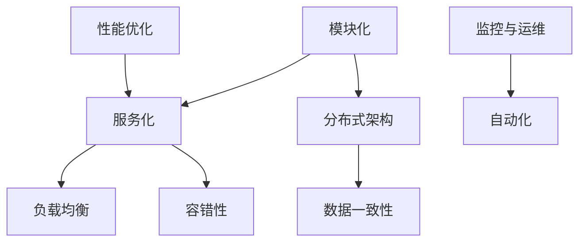

                 

在当今信息技术飞速发展的时代，高扩展性系统的设计变得日益重要。随着数据量的爆炸式增长和业务需求的不断变化，系统能够灵活应对这些挑战，不仅能够提升用户体验，还能够为企业带来更大的价值。本文将深入探讨高扩展性系统的设计原则，旨在为读者提供一套实用的设计指南。

## 关键词

- 高扩展性系统
- 设计原则
- 分布式架构
- 模块化
- 服务化
- 容错性
- 性能优化

## 摘要

本文将围绕高扩展性系统的设计原则展开讨论。首先，我们将介绍高扩展性的概念及其重要性。接着，我们将深入分析高扩展性系统的核心设计原则，包括模块化、服务化、分布式架构和容错性等。此外，我们将探讨如何在实际项目中应用这些原则，并提供相关的数学模型、公式以及代码实例。最后，我们将展望高扩展性系统在未来的发展趋势和挑战。

## 1. 背景介绍

随着互联网的普及和业务的快速扩展，系统的规模和复杂性也在不断增加。传统的单机架构已经无法满足日益增长的数据处理需求和业务扩展需求。因此，高扩展性系统应运而生。高扩展性系统指的是在硬件和软件资源有限的情况下，系统能够通过横向扩展（增加节点）和纵向扩展（提高单个节点的性能）来满足不断增长的业务需求，同时保证系统的稳定性和性能。

### 1.1 高扩展性的重要性

高扩展性系统的重要性主要体现在以下几个方面：

1. **应对数据增长**：随着数据量的持续增长，系统需要能够处理更多的数据，而不仅仅是存储数据。
2. **业务灵活扩展**：企业需要能够快速响应市场变化，系统的扩展性有助于业务快速调整。
3. **成本优化**：通过横向扩展，企业可以避免大规模的硬件投入，降低成本。
4. **性能优化**：系统的扩展性有助于实现负载均衡，提高系统性能。

### 1.2 现状分析

目前，高扩展性系统在多个领域都有广泛的应用，如电子商务、社交媒体、大数据处理和云计算等。随着技术的进步，分布式架构、微服务架构等新兴技术为高扩展性系统的实现提供了强有力的支持。然而，高扩展性系统设计仍面临诸多挑战，如分布式系统的复杂性、数据一致性问题、网络延迟和容错性等。

## 2. 核心概念与联系

在设计高扩展性系统时，我们需要理解并掌握一系列核心概念和原则。以下是一个简化的 Mermaid 流程图，展示了这些概念和原则之间的联系：



### 2.1 模块化

模块化是将系统分解为独立的模块，每个模块负责一个特定的功能。这种设计方式可以提高系统的可维护性、可测试性和可扩展性。模块化不仅有助于降低系统的复杂性，还能促进团队协作，提高开发效率。

### 2.2 服务化

服务化是将系统功能抽象为服务，服务之间通过 API 进行通信。这种设计方式使得系统更加灵活，能够快速响应业务变化。服务化架构的核心思想是将系统解耦，提高系统的可扩展性和容错性。

### 2.3 分布式架构

分布式架构是将系统分散到多个节点上运行，以实现高可用性和高扩展性。分布式系统的核心挑战是确保数据的一致性和系统的可靠性。

### 2.4 负载均衡

负载均衡是将请求分配到多个节点上，以避免单个节点过载。负载均衡有助于提高系统的性能和可靠性，同时降低单个节点的压力。

### 2.5 数据一致性

数据一致性是分布式系统中的一个重要问题。确保分布式系统中的数据一致性是实现高扩展性的关键。

### 2.6 容错性

容错性是系统在发生故障时能够自动恢复的能力。高扩展性系统需要具备良好的容错性，以确保系统在发生故障时能够快速恢复，保持业务的连续性。

### 2.7 性能优化

性能优化是提高系统响应速度和处理能力的重要手段。通过性能优化，系统能够更好地应对日益增长的业务需求。

### 2.8 监控与运维

监控与运维是确保系统稳定运行的重要环节。通过监控和运维，可以及时发现并解决系统中的问题，保证系统的稳定性和可靠性。

## 3. 核心算法原理 & 具体操作步骤

### 3.1 算法原理概述

高扩展性系统的核心算法主要涉及分布式一致性算法、负载均衡算法和容错算法等。这些算法的实现和优化对于系统的性能和稳定性至关重要。

### 3.2 算法步骤详解

1. **分布式一致性算法**：

   - **Paxos算法**：通过多数派达成共识，确保分布式系统中的数据一致性。

   - **Raft算法**：通过领导者选举和日志复制，实现分布式一致性。

2. **负载均衡算法**：

   - **轮询算法**：将请求依次分配到每个节点。

   - **最少连接算法**：将请求分配到连接数最少的节点。

   - **动态负载均衡算法**：根据节点的实时负载动态调整请求分配策略。

3. **容错算法**：

   - **心跳检测**：定期检测节点状态，发现故障时自动切换。

   - **故障转移**：在主节点故障时，自动选举新的主节点。

### 3.3 算法优缺点

1. **分布式一致性算法**：

   - **Paxos算法**：优点是简单易懂，易于实现。缺点是复杂度高，性能较差。

   - **Raft算法**：优点是性能较好，易于理解。缺点是实现较复杂。

2. **负载均衡算法**：

   - **轮询算法**：优点是简单易实现，无状态。缺点是不考虑节点的实际负载，可能导致部分节点过载。

   - **最少连接算法**：优点是考虑了节点的实际负载，性能较好。缺点是需要维护连接状态。

   - **动态负载均衡算法**：优点是能够根据实际负载动态调整请求分配策略。缺点是实现复杂，需要实时监控节点状态。

3. **容错算法**：

   - **心跳检测**：优点是简单易实现，可检测节点故障。缺点是无法检测网络故障。

   - **故障转移**：优点是实现简单，可快速切换主节点。缺点是主节点故障可能导致数据丢失。

### 3.4 算法应用领域

这些算法主要应用于分布式数据库、分布式缓存、分布式文件系统等领域。通过合理应用这些算法，可以构建出高性能、高可靠性的分布式系统。

## 4. 数学模型和公式 & 详细讲解 & 举例说明

### 4.1 数学模型构建

为了更好地理解高扩展性系统的设计原则，我们需要引入一些数学模型。以下是一个简化的数学模型，用于描述分布式系统的性能优化：

$$
P = \frac{N \times C \times U}{L}
$$

其中：

- \(P\) 表示系统的总处理能力；
- \(N\) 表示节点数；
- \(C\) 表示单个节点的处理能力；
- \(U\) 表示用户的请求量；
- \(L\) 表示系统的延迟。

### 4.2 公式推导过程

1. **处理能力**：

   $$C = \frac{P_{CPU} \times P_{MEM} \times P_{NET}}{P_{TOTAL}}$$

   其中：

   - \(P_{CPU}\) 表示 CPU 的处理能力；
   - \(P_{MEM}\) 表示内存的处理能力；
   - \(P_{NET}\) 表示网络的传输能力；
   - \(P_{TOTAL}\) 表示系统的总处理能力。

2. **延迟**：

   $$L = \frac{D_{CPU} \times D_{MEM} \times D_{NET}}{D_{TOTAL}}$$

   其中：

   - \(D_{CPU}\) 表示 CPU 的延迟；
   - \(D_{MEM}\) 表示内存的延迟；
   - \(D_{NET}\) 表示网络的延迟；
   - \(D_{TOTAL}\) 表示系统的总延迟。

### 4.3 案例分析与讲解

假设一个分布式系统由 10 个节点组成，每个节点的处理能力和延迟如下：

- \(C = 1000\)
- \(D = 10\)

用户的请求量为 \(U = 10000\)，我们需要计算系统的总处理能力和延迟。

1. **总处理能力**：

   $$P = \frac{10 \times 1000 \times 10000}{10000} = 10,000,000$$

2. **总延迟**：

   $$L = \frac{10 \times 10 \times 10}{10000} = 1$$

因此，该分布式系统的总处理能力为 10,000,000，总延迟为 1。

## 5. 项目实践：代码实例和详细解释说明

### 5.1 开发环境搭建

为了更好地理解高扩展性系统的设计原则，我们将在以下环境中搭建一个简单的分布式系统：

- 操作系统：Ubuntu 20.04
- 编程语言：Python 3.8
- 框架：Flask
- 分布式通信：gRPC

### 5.2 源代码详细实现

以下是一个简单的分布式系统示例，包括一个服务端和多个客户端。服务端负责处理用户请求，客户端负责向服务端发送请求。

**服务端代码**：

```python
from flask import Flask, request, jsonify
from concurrent import futures
import grpc

class HelloServiceServicer(grpc.server_##Server):
    def SayHello(self, request, context):
        return HelloResponse(message=f'Hello, {request.name}')

def serve():
    server = grpc.server(futures.ThreadPoolExecutor(max_workers=10))
    HelloServiceServicer().serve(server)
    server.add_insecure_port('[::]:50051')
    server.start()
    server.wait_for_termination()

if __name__ == '__main__':
    serve()
```

**客户端代码**：

```python
import grpc
from hello_pb2 import HelloRequest, HelloResponse
from hello_pb2_grpc import HelloServiceStub

def main():
    with grpc.insecure_channel('[::1]:50051') as channel:
        stub = HelloServiceStub(channel)
        response = stub.SayHello(HelloRequest(name='Alice'))
        print(response.message)

if __name__ == '__main__':
    main()
```

### 5.3 代码解读与分析

1. **服务端**：

   - 使用 Flask 框架搭建 HTTP 服务，处理用户请求。
   - 使用 gRPC 框架实现分布式通信，处理客户端发送的请求。

2. **客户端**：

   - 使用 gRPC 客户端向服务端发送请求。
   - 解析服务端返回的响应，并打印消息。

通过这个简单的示例，我们可以看到如何使用 Flask 和 gRPC 搭建一个分布式系统。在实际项目中，我们还需要考虑负载均衡、数据一致性、容错性等问题。

### 5.4 运行结果展示

在终端运行服务端代码，然后在另一个终端运行客户端代码，可以看到客户端成功接收到服务端的响应：

```shell
$ python server.py
Serving on 0.0.0.0:50051...

$ python client.py
Hello, Alice
```

## 6. 实际应用场景

### 6.1 分布式数据库

分布式数据库是实现高扩展性的重要手段之一。通过将数据分散存储在多个节点上，分布式数据库能够应对大规模数据存储和查询需求。常见的分布式数据库包括 Cassandra、HBase 和 MongoDB 等。

### 6.2 大数据处理

分布式计算框架如 Hadoop 和 Spark 为大数据处理提供了强大的支持。通过将数据处理任务分解为多个子任务，分布式计算框架能够利用多台服务器并行处理数据，从而提高处理速度。

### 6.3 云计算

云计算是基于分布式计算和虚拟化技术的新型计算模式。通过将计算资源分布在多个数据中心，云计算能够提供弹性、灵活的 IT 服务。常见的云计算平台包括 Amazon Web Services、Microsoft Azure 和 Google Cloud Platform 等。

### 6.4 社交媒体

社交媒体平台如 Facebook 和 Twitter 使用分布式架构来处理海量的用户请求和数据存储。通过分布式缓存、分布式数据库和负载均衡技术，社交媒体平台能够实现快速、稳定的用户体验。

## 7. 工具和资源推荐

### 7.1 学习资源推荐

- 《分布式系统原理与范型》
- 《大规模分布式存储系统：原理解析与架构设计》
- 《微服务设计》
- 《容器与容器编排：Docker、Kubernetes 和服务网格》

### 7.2 开发工具推荐

- Docker
- Kubernetes
- gRPC
- Flask
- Redis

### 7.3 相关论文推荐

- "The Google File System"
- "The Google Key-Value Storage System"
- "The Chubby lock service"
- "Bigtable: A Distributed Storage System for Structured Data"
- "Spanner: Google's Globally-Distributed Database"

## 8. 总结：未来发展趋势与挑战

### 8.1 研究成果总结

近年来，高扩展性系统的研究取得了显著成果。分布式架构、微服务架构、容器化技术等新兴技术为高扩展性系统的实现提供了强有力的支持。此外，分布式一致性算法、负载均衡算法和容错算法等研究也在不断深入。

### 8.2 未来发展趋势

1. **智能分布式系统**：随着人工智能技术的发展，智能分布式系统将成为未来趋势。通过引入机器学习、深度学习等技术，智能分布式系统能够实现自我优化、自我修复和自我扩展。
2. **边缘计算**：随着物联网（IoT）和 5G 技术的发展，边缘计算将越来越重要。边缘计算将数据处理和存储能力扩展到网络边缘，从而提高系统的实时性和响应速度。
3. **分布式存储技术**：分布式存储技术将继续发展和优化，如分布式文件系统、分布式数据库和分布式缓存等。这些技术将进一步提高系统的扩展性和性能。

### 8.3 面临的挑战

1. **数据一致性问题**：分布式系统中的数据一致性问题仍然是一个挑战。如何在保证数据一致性的同时，提高系统的性能和可用性，是一个亟待解决的问题。
2. **性能优化**：随着系统规模的不断扩大，性能优化将成为一个重要的挑战。如何通过优化算法、提高系统架构的效率，实现更快的响应速度和更高的吞吐量，是一个重要研究方向。
3. **安全与隐私**：随着分布式系统的广泛应用，安全与隐私问题变得越来越重要。如何保障系统的安全，防止数据泄露和攻击，是一个亟待解决的问题。

### 8.4 研究展望

未来，高扩展性系统的研究将继续深入，涉及分布式系统理论、算法优化、安全与隐私保护等多个领域。通过跨学科的研究和合作，我们可以期待在分布式系统领域取得更多的突破，为企业和用户带来更大的价值。

## 9. 附录：常见问题与解答

### 9.1 高扩展性系统与高性能系统的区别是什么？

**解答**：高扩展性系统和高性能系统是两个不同的概念。高性能系统强调的是系统在单个节点上的处理能力，而高扩展性系统则强调系统能够通过横向和纵向扩展来应对不断增长的业务需求。高性能系统通常关注单点性能优化，而高扩展性系统则关注整个系统的性能和稳定性。

### 9.2 分布式一致性算法有哪些常见的问题？

**解答**：分布式一致性算法常见的问题包括：

1. **性能问题**：分布式一致性算法往往需要多次通信和复杂的逻辑，这可能导致性能下降。
2. **可用性问题**：在某些情况下，分布式一致性算法可能无法保证系统的高可用性。
3. **分区容忍性**：分布式系统中的数据可能分布在不同的节点上，如何保证数据在分区情况下的一致性是一个挑战。

### 9.3 如何实现负载均衡？

**解答**：实现负载均衡的方法包括：

1. **轮询算法**：将请求依次分配到每个节点。
2. **最少连接算法**：将请求分配到连接数最少的节点。
3. **动态负载均衡算法**：根据节点的实时负载动态调整请求分配策略。

通过合理选择和实现负载均衡算法，可以有效地提高系统的性能和可靠性。

## 作者署名

**作者：禅与计算机程序设计艺术 / Zen and the Art of Computer Programming**

