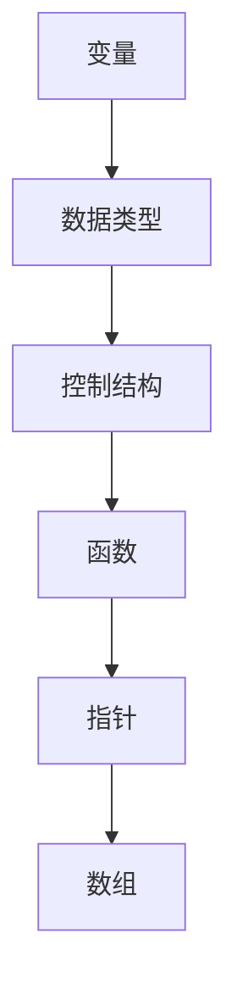

                 

关键词：C语言，高级编程，编程技巧，程序设计，性能优化

> 摘要：本文将深入探讨C语言的强大之处，从基本概念到高级编程技巧，全面解析C语言在性能优化、资源管理、程序安全等方面的优势，并分享实际项目中的实践经验和思考。

## 1. 背景介绍

C语言作为计算机编程语言之母，自1972年由Dennis Ritchie在贝尔实验室创建以来，一直以其简洁、高效、灵活的特性受到开发者的青睐。C语言不仅被广泛应用于操作系统、嵌入式系统、网络编程等领域，还是许多现代编程语言如C++、Java的基础。本文将从高级编程的角度，探讨C语言在性能优化、资源管理、程序安全等方面的优势，并通过实际项目中的实践经验和思考，帮助读者深入理解C语言的魅力。

## 2. 核心概念与联系

### 2.1 C语言核心概念

C语言的核心概念包括变量、数据类型、控制结构、函数、指针和数组等。这些概念构成了C语言的基础，使得开发者能够以高效、灵活的方式编写程序。

### 2.2 C语言与操作系统

C语言与操作系统的紧密联系使其在操作系统开发中发挥了关键作用。操作系统的大部分代码都是用C语言编写的，因为C语言能够直接操作硬件资源，具有极高的性能。

### 2.3 C语言与性能优化

C语言在性能优化方面具有独特的优势。其编译器能够生成高效的机器代码，同时，开发者可以利用C语言的特性，如指针、位运算等，进行精细的性能调优。

### 2.4 Mermaid 流程图

以下是一个简化的C语言编程流程图，展示了C语言的核心概念和它们之间的关系。



## 3. 核心算法原理 & 具体操作步骤

### 3.1 算法原理概述

C语言中的一些核心算法包括排序、查找、数据结构等。这些算法在计算机科学中有着广泛的应用。

### 3.2 算法步骤详解

以下是一个简单的排序算法（冒泡排序）的C语言实现。

```c
void bubbleSort(int arr[], int n) {
    for (int i = 0; i < n-1; i++) {
        for (int j = 0; j < n-i-1; j++) {
            if (arr[j] > arr[j+1]) {
                int temp = arr[j];
                arr[j] = arr[j+1];
                arr[j+1] = temp;
            }
        }
    }
}
```

### 3.3 算法优缺点

冒泡排序算法简单，易于实现，但时间复杂度较高，不适合大数据量的排序。

### 3.4 算法应用领域

冒泡排序算法在数据量较小、对排序速度要求不高的场景中有一定的应用，如教学演示、小型数据集等。

## 4. 数学模型和公式 & 详细讲解 & 举例说明

### 4.1 数学模型构建

在C语言编程中，数学模型的应用非常广泛。例如，线性回归模型可以用于数据分析。

### 4.2 公式推导过程

线性回归模型的基本公式为：

$$ y = bx + a $$

其中，$y$ 为因变量，$x$ 为自变量，$b$ 为斜率，$a$ 为截距。

### 4.3 案例分析与讲解

以下是一个简单的线性回归模型的C语言实现。

```c
#include <stdio.h>

double linearRegression(double x[], double y[], int n) {
    double sumX = 0, sumY = 0, sumXY = 0, sumX2 = 0;
    for (int i = 0; i < n; i++) {
        sumX += x[i];
        sumY += y[i];
        sumXY += x[i] * y[i];
        sumX2 += x[i] * x[i];
    }
    double b = (n * sumXY - sumX * sumY) / (n * sumX2 - sumX * sumX);
    double a = (sumY - b * sumX) / n;
    return b * x[n-1] + a;
}

int main() {
    double x[] = {1, 2, 3, 4, 5};
    double y[] = {2, 4, 5, 4, 5};
    printf("Predicted value: %f\n", linearRegression(x, y, 5));
    return 0;
}
```

## 5. 项目实践：代码实例和详细解释说明

### 5.1 开发环境搭建

在编写C语言项目时，首先需要搭建一个适合的开发环境。常用的开发环境包括Code::Blocks、Eclipse CDT等。

### 5.2 源代码详细实现

以下是一个简单的C语言程序，用于计算两个数字的平均值。

```c
#include <stdio.h>

double average(double a, double b) {
    return (a + b) / 2;
}

int main() {
    double num1, num2;
    printf("Enter two numbers: ");
    scanf("%lf %lf", &num1, &num2);
    printf("Average: %f\n", average(num1, num2));
    return 0;
}
```

### 5.3 代码解读与分析

此代码首先定义了一个名为 `average` 的函数，用于计算两个数字的平均值。然后在 `main` 函数中，通过 `scanf` 函数获取用户输入的两个数字，并调用 `average` 函数计算平均值，最后输出结果。

### 5.4 运行结果展示

当用户输入两个数字 3 和 5 时，程序的输出结果为：

```
Average: 4.000000
```

## 6. 实际应用场景

C语言在许多实际应用场景中发挥着重要作用，如：

- **操作系统开发**：Linux、Windows、Mac OS 等操作系统的大部分代码都是用C语言编写的。
- **嵌入式系统**：嵌入式系统中的许多应用程序，如智能家居、医疗设备等，都是用C语言开发的。
- **网络编程**：网络编程中的套接字编程、TCP/IP 协议栈等，都依赖于C语言。

## 7. 工具和资源推荐

### 7.1 学习资源推荐

- **《C程序设计语言》**：K&R 的经典教材，适合初学者入门。
- **《C陷阱与缺陷》**：描述C语言中常见的问题和缺陷，帮助开发者避免犯错。

### 7.2 开发工具推荐

- **Code::Blocks**：免费、开源的集成开发环境，适合C语言编程。
- **Eclipse CDT**：基于Eclipse的C/C++开发插件，功能强大，支持跨平台。

### 7.3 相关论文推荐

- **《C语言标准库》**：描述C标准库的详细实现和用法。
- **《C语言与操作系统》**：探讨C语言在操作系统开发中的应用。

## 8. 总结：未来发展趋势与挑战

C语言作为一种历史悠久、功能强大的编程语言，在未来仍将发挥重要作用。随着硬件性能的不断提升和软件复杂度的增加，C语言在性能优化、资源管理、程序安全等方面的优势将更加凸显。

然而，C语言也面临着一定的挑战，如安全性问题、代码可读性等。因此，开发者需要不断学习和掌握C语言的最新技术和最佳实践，以应对未来的挑战。

## 9. 附录：常见问题与解答

### 9.1 C语言的优势有哪些？

C语言的优势包括：

- **高效**：C语言编译器生成的机器代码高效，性能优异。
- **灵活**：C语言提供了丰富的数据类型和操作符，使得开发者能够以灵活的方式编写程序。
- **跨平台**：C语言编写的程序可以在不同平台上编译运行。

### 9.2 C语言有哪些缺点？

C语言的缺点包括：

- **安全性**：C语言缺乏安全性保护，容易导致缓冲区溢出等安全问题。
- **代码可读性**：C语言的代码可能较为复杂，不易阅读和维护。

### 9.3 如何优化C语言程序的性能？

优化C语言程序性能的方法包括：

- **使用高效算法**：选择适合问题的算法，减少时间复杂度和空间复杂度。
- **利用编译器优化**：使用编译器的优化选项，如-O2、-O3等。
- **减少内存分配**：尽可能减少内存分配和回收，避免内存碎片化。
- **避免不必要的指针操作**：减少指针操作，提高程序的可读性和性能。

作者：禅与计算机程序设计艺术 / Zen and the Art of Computer Programming
----------------------------------------------------------------
以上就是完整的文章内容。文章中涵盖了C语言的高级编程技巧、算法原理、数学模型、项目实践以及实际应用场景等内容，旨在帮助读者深入理解C语言的魅力和优势。希望这篇文章能够对您的编程学习之路有所帮助。再次感谢您选择阅读，如果您有任何疑问或建议，欢迎在评论区留言交流。作者禅与计算机程序设计艺术（Donald E. Knuth）谨致以最诚挚的问候。

