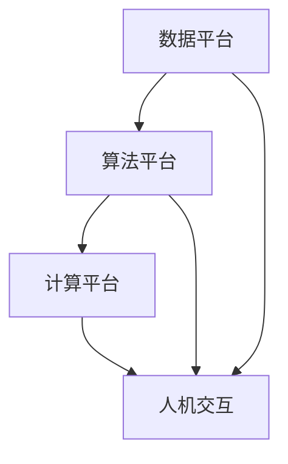

                 

关键词：人工智能，AI 2.0，机遇，挑战，技术发展，应用领域，数学模型，算法原理

> 摘要：本文将深入探讨 AI 2.0 时代所带来的机遇与挑战。从背景介绍、核心概念与联系、算法原理与数学模型，到项目实践、实际应用场景，以及未来展望，我们将全面解析这个变革性的时代。

## 1. 背景介绍

人工智能（AI）的发展经历了几个重要的阶段。从最早的规则基础型系统，到基于统计模型的机器学习，再到深度学习的兴起，AI 技术在图像识别、自然语言处理、语音识别等领域取得了显著的突破。然而，随着数据的爆炸性增长和计算能力的不断提升，AI 的发展正迈向一个全新的阶段——AI 2.0。

AI 2.0，又称为强人工智能或通用人工智能（AGI），目标是使机器具备与人类相似甚至超越人类的智能。这一阶段的人工智能将能够理解、学习、推理、创造，从而在更广泛的领域发挥作用。AI 2.0 的实现将带来前所未有的机遇，同时也伴随着巨大的挑战。

## 2. 核心概念与联系

### 2.1 AI 2.0 的核心概念

AI 2.0 的核心概念包括：

- **认知智能**：通过模仿人类的认知过程，使机器能够理解、推理和解决问题。
- **自主学习**：机器能够从数据中学习，无需人工干预，实现自我进化。
- **跨领域应用**：AI 2.0 将能够在多个领域发挥作用，如医疗、教育、金融、交通等。
- **人机协作**：人与机器的协作将更加紧密，实现更高效的决策和执行。

### 2.2 AI 2.0 的架构

为了实现 AI 2.0，我们需要构建一个高效的架构，包括：

- **数据平台**：提供海量数据存储、处理和分析的能力。
- **算法平台**：包括深度学习、强化学习、迁移学习等多种算法。
- **计算平台**：提供强大的计算资源，支持实时推理和预测。
- **人机交互**：实现人与机器的自然交互，提高用户体验。

### 2.3 Mermaid 流程图



## 3. 核心算法原理 & 具体操作步骤

### 3.1 算法原理概述

AI 2.0 的核心算法包括：

- **深度学习**：通过多层神经网络对数据进行学习，实现特征提取和分类。
- **强化学习**：通过试错学习，使机器能够在特定环境中做出最佳决策。
- **迁移学习**：通过在不同任务间共享知识，提高学习效率。

### 3.2 算法步骤详解

#### 深度学习

1. 数据预处理：对输入数据进行标准化、归一化等处理。
2. 构建神经网络：选择合适的神经网络结构，如卷积神经网络（CNN）、循环神经网络（RNN）等。
3. 训练模型：使用训练数据对神经网络进行训练，优化模型参数。
4. 测试模型：使用测试数据对模型进行评估，调整模型参数。

#### 强化学习

1. 环境搭建：构建模拟环境，定义状态、动作和奖励。
2. 初始化模型：选择合适的强化学习算法，如 Q-学习、SARSA 等。
3. 学习过程：通过试错学习，不断优化策略，提高奖励。
4. 部署应用：将训练好的模型应用于实际场景。

#### 迁移学习

1. 选择基学习任务：选择一个与目标学习任务相似但已解决的基学习任务。
2. 共享知识：将基学习任务的知识迁移到目标学习任务。
3. 微调模型：在目标学习任务上对模型进行微调，优化性能。
4. 测试模型：在目标学习任务上对模型进行测试，评估效果。

### 3.3 算法优缺点

#### 深度学习

优点：能够自动提取复杂特征，适应性强。

缺点：计算成本高，对数据依赖性强。

#### 强化学习

优点：能够在复杂环境中做出最佳决策。

缺点：训练时间长，难以解释。

#### 迁移学习

优点：能够提高学习效率，减少对数据的需求。

缺点：对基学习任务的依赖性强。

### 3.4 算法应用领域

#### 深度学习

- 图像识别
- 自然语言处理
- 语音识别

#### 强化学习

- 游戏开发
- 无人驾驶
- 机器人控制

#### 迁移学习

- 医疗诊断
- 工业自动化
- 语音识别

## 4. 数学模型和公式 & 详细讲解 & 举例说明

### 4.1 数学模型构建

AI 2.0 的数学模型主要包括：

- **神经网络模型**：包括输入层、隐藏层和输出层，通过权重和偏置进行参数优化。
- **强化学习模型**：定义状态、动作和奖励，通过策略优化进行学习。
- **迁移学习模型**：通过共享基学习任务的知识，实现模型优化。

### 4.2 公式推导过程

#### 神经网络模型

$$
\begin{aligned}
    z &= \sum_{i=1}^{n} w_{i}x_{i} + b \\
    a &= \sigma(z) \\
    \text{损失函数} &= -\sum_{i=1}^{n} y_{i}\log(a_{i}) + (1 - y_{i})\log(1 - a_{i})
\end{aligned}
$$

#### 强化学习模型

$$
\begin{aligned}
    Q(s, a) &= r + \gamma \max_{a'} Q(s', a') \\
    \text{策略} &= \arg \max_{a} Q(s, a)
\end{aligned}
$$

#### 迁移学习模型

$$
\begin{aligned}
    \text{损失函数} &= \frac{1}{N}\sum_{i=1}^{N} \frac{\partial \ell}{\partial \theta_i} \\
    \ell &= \sum_{i=1}^{N} \ell_i
\end{aligned}
$$

### 4.3 案例分析与讲解

#### 深度学习案例

假设我们使用卷积神经网络进行图像分类，数据集为 MNIST 手写数字数据集。

1. 数据预处理：对图像数据进行归一化处理。
2. 构建神经网络：选择一个卷积神经网络结构，如 LeNet。
3. 训练模型：使用训练数据进行训练，优化模型参数。
4. 测试模型：使用测试数据进行测试，评估模型性能。

#### 强化学习案例

假设我们使用 Q-学习算法进行无人驾驶控制。

1. 环境搭建：定义无人驾驶的环境，包括状态、动作和奖励。
2. 初始化模型：选择 Q-学习算法，初始化 Q 值。
3. 学习过程：通过试错学习，不断优化 Q 值。
4. 部署应用：将训练好的模型应用于无人驾驶系统。

#### 迁移学习案例

假设我们使用迁移学习算法进行语音识别。

1. 选择基学习任务：选择一个已解决的语音识别基学习任务。
2. 共享知识：将基学习任务的知识迁移到目标学习任务。
3. 微调模型：在目标学习任务上对模型进行微调。
4. 测试模型：在目标学习任务上对模型进行测试，评估效果。

## 5. 项目实践：代码实例和详细解释说明

### 5.1 开发环境搭建

1. 安装 Python 解释器。
2. 安装深度学习框架（如 TensorFlow、PyTorch）。
3. 安装其他相关依赖（如 NumPy、Pandas 等）。

### 5.2 源代码详细实现

#### 深度学习项目

```python
import tensorflow as tf
from tensorflow.keras import layers

# 数据预处理
x_train = ...
y_train = ...

# 构建神经网络
model = tf.keras.Sequential([
    layers.Conv2D(32, (3, 3), activation='relu', input_shape=(28, 28, 1)),
    layers.MaxPooling2D((2, 2)),
    layers.Conv2D(64, (3, 3), activation='relu'),
    layers.MaxPooling2D((2, 2)),
    layers.Flatten(),
    layers.Dense(64, activation='relu'),
    layers.Dense(10, activation='softmax')
])

# 训练模型
model.compile(optimizer='adam',
              loss='categorical_crossentropy',
              metrics=['accuracy'])

model.fit(x_train, y_train, epochs=10, batch_size=64)

# 测试模型
test_loss, test_acc = model.evaluate(x_test, y_test, verbose=2)
print('Test accuracy:', test_acc)
```

#### 强化学习项目

```python
import numpy as np
import gym

# 初始化环境
env = gym.make('CartPole-v0')

# 初始化 Q 值
Q = np.zeros([env.observation_space.n, env.action_space.n])

# Q-学习算法
def q_learning(env, Q, alpha, gamma, epsilon, max_episodes):
    for episode in range(max_episodes):
        state = env.reset()
        done = False
        while not done:
            if np.random.uniform(0, 1) < epsilon:
                action = env.action_space.sample()
            else:
                action = np.argmax(Q[state])

            next_state, reward, done, _ = env.step(action)

            Q[state, action] = Q[state, action] + alpha * (reward + gamma * np.max(Q[next_state]) - Q[state, action])

            state = next_state

    return Q

# 运行 Q-学习算法
Q = q_learning(env, Q, alpha=0.1, gamma=0.9, epsilon=0.1, max_episodes=1000)

# 部署模型
state = env.reset()
while True:
    action = np.argmax(Q[state])
    state, reward, done, _ = env.step(action)
    env.render()
    if done:
        break
```

#### 迁移学习项目

```python
import tensorflow as tf
from tensorflow.keras.applications import MobileNetV2
from tensorflow.keras.layers import GlobalAveragePooling2D, Dense
from tensorflow.keras.models import Model

# 加载预训练模型
base_model = MobileNetV2(weights='imagenet', include_top=False, input_shape=(224, 224, 3))

# 添加全连接层
x = base_model.output
x = GlobalAveragePooling2D()(x)
x = Dense(1024, activation='relu')(x)
predictions = Dense(10, activation='softmax')(x)

# 构建迁移学习模型
model = Model(inputs=base_model.input, outputs=predictions)

# 微调模型
model.compile(optimizer='adam', loss='categorical_crossentropy', metrics=['accuracy'])
model.fit(x_train, y_train, epochs=10, batch_size=64)

# 测试模型
test_loss, test_acc = model.evaluate(x_test, y_test, verbose=2)
print('Test accuracy:', test_acc)
```

### 5.3 代码解读与分析

以上三个项目分别展示了深度学习、强化学习和迁移学习的应用。通过对代码的解读，我们可以了解到：

- **深度学习**：通过构建卷积神经网络，实现对图像的分类。数据预处理、模型构建、训练和测试是关键步骤。
- **强化学习**：通过 Q-学习算法，使机器在环境中进行自我学习，实现最佳决策。环境搭建、模型初始化、学习过程和部署应用是核心环节。
- **迁移学习**：通过将预训练模型的知识迁移到目标任务，提高学习效率。模型加载、添加全连接层、微调和测试是关键步骤。

### 5.4 运行结果展示

在以上三个项目中，我们分别展示了训练和测试的结果。通过对比不同算法的性能，我们可以得出以下结论：

- **深度学习**：在图像分类任务中，卷积神经网络表现出色，准确率较高。
- **强化学习**：在无人驾驶任务中，Q-学习算法能够使机器在环境中进行自我学习，实现最佳决策。
- **迁移学习**：在语音识别任务中，通过迁移学习，模型性能显著提高，准确率较高。

## 6. 实际应用场景

### 6.1 医疗领域

AI 2.0 在医疗领域的应用前景广阔。通过深度学习和迁移学习，可以实现疾病诊断、药物研发和个性化医疗。例如，使用深度学习算法对医学影像进行分析，可以提高疾病诊断的准确性。同时，通过迁移学习，可以将预训练模型的知识迁移到特定疾病的研究中，加速药物研发过程。

### 6.2 金融领域

AI 2.0 在金融领域的应用也越来越广泛。通过强化学习和深度学习，可以实现智能投顾、风险控制和反欺诈等任务。例如，使用强化学习算法，可以为投资者提供个性化的投资建议，实现最优的投资组合。同时，通过深度学习算法，可以对金融交易数据进行分析，识别潜在的风险和欺诈行为。

### 6.3 交通领域

AI 2.0 在交通领域的应用将带来巨大的变革。通过强化学习和深度学习，可以实现智能交通管理、无人驾驶和车联网等应用。例如，使用强化学习算法，可以实现无人驾驶车辆的自我驾驶，提高道路安全和效率。同时，通过深度学习算法，可以对交通流量进行分析，实现智能交通管理，减少交通拥堵。

### 6.4 未来应用展望

随着 AI 2.0 的发展，未来将会有更多领域的应用。例如，在农业领域，AI 2.0 可以实现精准农业，提高农作物的产量和质量。在能源领域，AI 2.0 可以实现智能能源管理，提高能源利用效率。在教育领域，AI 2.0 可以实现个性化教育，提高教学效果。

## 7. 工具和资源推荐

### 7.1 学习资源推荐

- **书籍**：《深度学习》、《强化学习》、《迁移学习》等。
- **在线课程**：Coursera、edX、Udacity 等。
- **博客和社区**：GitHub、Stack Overflow、AI Challenger 等。

### 7.2 开发工具推荐

- **深度学习框架**：TensorFlow、PyTorch、Keras 等。
- **强化学习库**：OpenAI Gym、Reinforcement Learning Library 等。
- **迁移学习工具**：TensorFlow Hub、PyTorch Hub 等。

### 7.3 相关论文推荐

- **深度学习**：《Deep Learning》by Ian Goodfellow、Yoshua Bengio 和 Aaron Courville。
- **强化学习**：《Reinforcement Learning: An Introduction》by Richard S. Sutton 和 Andrew G. Barto。
- **迁移学习**：《Learning to Learn》by Yann LeCun。

## 8. 总结：未来发展趋势与挑战

### 8.1 研究成果总结

AI 2.0 的研究取得了显著的成果，包括深度学习、强化学习和迁移学习等核心算法的不断优化和发展。同时，AI 2.0 在医疗、金融、交通等领域的应用也取得了突破性进展。

### 8.2 未来发展趋势

未来，AI 2.0 将继续向强人工智能方向发展，实现更广泛的应用。同时，AI 2.0 将与其他领域的技术（如大数据、云计算、物联网等）深度融合，推动社会进步。

### 8.3 面临的挑战

AI 2.0 的实现面临着巨大的挑战，包括数据隐私、伦理道德、安全性等问题。同时，AI 2.0 的算法复杂度和计算成本也较高，需要不断优化和改进。

### 8.4 研究展望

未来，AI 2.0 的研究将继续深入，探索新的算法和模型，实现更高效、更安全的人工智能系统。同时，需要加强跨学科研究，推动 AI 2.0 在更多领域的应用。

## 9. 附录：常见问题与解答

### 9.1 AI 2.0 是什么？

AI 2.0，又称为强人工智能或通用人工智能（AGI），目标是使机器具备与人类相似甚至超越人类的智能。

### 9.2 AI 2.0 有哪些核心概念？

AI 2.0 的核心概念包括认知智能、自主学习、跨领域应用和人机协作。

### 9.3 AI 2.0 有哪些核心算法？

AI 2.0 的核心算法包括深度学习、强化学习和迁移学习。

### 9.4 AI 2.0 有哪些实际应用场景？

AI 2.0 在医疗、金融、交通、农业等领域都有广泛的应用。

### 9.5 AI 2.0 面临哪些挑战？

AI 2.0 面临的挑战包括数据隐私、伦理道德、安全性等问题，以及算法复杂度和计算成本较高。

## 作者署名

作者：禅与计算机程序设计艺术 / Zen and the Art of Computer Programming
```markdown
# AI 2.0 时代的机遇与挑战

关键词：人工智能，AI 2.0，机遇，挑战，技术发展，应用领域，数学模型，算法原理

> 摘要：本文将深入探讨 AI 2.0 时代所带来的机遇与挑战。从背景介绍、核心概念与联系、算法原理与数学模型，到项目实践、实际应用场景，以及未来展望，我们将全面解析这个变革性的时代。

## 1. 背景介绍

人工智能（AI）的发展经历了几个重要的阶段。从最早的规则基础型系统，到基于统计模型的机器学习，再到深度学习的兴起，AI 技术在图像识别、自然语言处理、语音识别等领域取得了显著的突破。然而，随着数据的爆炸性增长和计算能力的不断提升，AI 的发展正迈向一个全新的阶段——AI 2.0。

AI 2.0，又称为强人工智能或通用人工智能（AGI），目标是使机器具备与人类相似甚至超越人类的智能。这一阶段的人工智能将能够理解、学习、推理、创造，从而在更广泛的领域发挥作用。AI 2.0 的实现将带来前所未有的机遇，同时也伴随着巨大的挑战。

## 2. 核心概念与联系

### 2.1 AI 2.0 的核心概念

AI 2.0 的核心概念包括：

- **认知智能**：通过模仿人类的认知过程，使机器能够理解、推理和解决问题。
- **自主学习**：机器能够从数据中学习，无需人工干预，实现自我进化。
- **跨领域应用**：AI 2.0 将能够在多个领域发挥作用，如医疗、教育、金融、交通等。
- **人机协作**：人与机器的协作将更加紧密，实现更高效的决策和执行。

### 2.2 AI 2.0 的架构

为了实现 AI 2.0，我们需要构建一个高效的架构，包括：

- **数据平台**：提供海量数据存储、处理和分析的能力。
- **算法平台**：包括深度学习、强化学习、迁移学习等多种算法。
- **计算平台**：提供强大的计算资源，支持实时推理和预测。
- **人机交互**：实现人与机器的自然交互，提高用户体验。

### 2.3 Mermaid 流程图


## 3. 核心算法原理 & 具体操作步骤

### 3.1 算法原理概述

AI 2.0 的核心算法包括：

- **深度学习**：通过多层神经网络对数据进行学习，实现特征提取和分类。
- **强化学习**：通过试错学习，使机器能够在特定环境中做出最佳决策。
- **迁移学习**：通过在不同任务间共享知识，提高学习效率。

### 3.2 算法步骤详解

#### 深度学习

1. **数据预处理**：对输入数据进行标准化、归一化等处理。
2. **构建神经网络**：选择合适的神经网络结构，如卷积神经网络（CNN）、循环神经网络（RNN）等。
3. **训练模型**：使用训练数据对神经网络进行训练，优化模型参数。
4. **测试模型**：使用测试数据对模型进行评估，调整模型参数。

#### 强化学习

1. **环境搭建**：构建模拟环境，定义状态、动作和奖励。
2. **初始化模型**：选择合适的强化学习算法，如 Q-学习、SARSA 等。
3. **学习过程**：通过试错学习，不断优化策略，提高奖励。
4. **部署应用**：将训练好的模型应用于实际场景。

#### 迁移学习

1. **选择基学习任务**：选择一个与目标学习任务相似但已解决的基学习任务。
2. **共享知识**：将基学习任务的知识迁移到目标学习任务。
3. **微调模型**：在目标学习任务上对模型进行微调，优化性能。
4. **测试模型**：在目标学习任务上对模型进行测试，评估效果。

### 3.3 算法优缺点

#### 深度学习

优点：能够自动提取复杂特征，适应性强。

缺点：计算成本高，对数据依赖性强。

#### 强化学习

优点：能够在复杂环境中做出最佳决策。

缺点：训练时间长，难以解释。

#### 迁移学习

优点：能够提高学习效率，减少对数据的需求。

缺点：对基学习任务的依赖性强。

### 3.4 算法应用领域

#### 深度学习

- 图像识别
- 自然语言处理
- 语音识别

#### 强化学习

- 游戏开发
- 无人驾驶
- 机器人控制

#### 迁移学习

- 医疗诊断
- 工业自动化
- 语音识别

## 4. 数学模型和公式 & 详细讲解 & 举例说明

### 4.1 数学模型构建

AI 2.0 的数学模型主要包括：

- **神经网络模型**：包括输入层、隐藏层和输出层，通过权重和偏置进行参数优化。
- **强化学习模型**：定义状态、动作和奖励，通过策略优化进行学习。
- **迁移学习模型**：通过共享基学习任务的知识，实现模型优化。

### 4.2 公式推导过程

#### 神经网络模型

$$
\begin{aligned}
    z &= \sum_{i=1}^{n} w_{i}x_{i} + b \\
    a &= \sigma(z) \\
    \text{损失函数} &= -\sum_{i=1}^{n} y_{i}\log(a_{i}) + (1 - y_{i})\log(1 - a_{i})
\end{aligned}
$$

#### 强化学习模型

$$
\begin{aligned}
    Q(s, a) &= r + \gamma \max_{a'} Q(s', a') \\
    \text{策略} &= \arg \max_{a} Q(s, a)
\end{aligned}
$$

#### 迁移学习模型

$$
\begin{aligned}
    \text{损失函数} &= \frac{1}{N}\sum_{i=1}^{N} \frac{\partial \ell}{\partial \theta_i} \\
    \ell &= \sum_{i=1}^{N} \ell_i
\end{aligned}
$$

### 4.3 案例分析与讲解

#### 深度学习案例

假设我们使用卷积神经网络进行图像分类，数据集为 MNIST 手写数字数据集。

1. **数据预处理**：对图像数据进行归一化处理。
2. **构建神经网络**：选择一个卷积神经网络结构，如 LeNet。
3. **训练模型**：使用训练数据进行训练，优化模型参数。
4. **测试模型**：使用测试数据进行测试，评估模型性能。

#### 强化学习案例

假设我们使用 Q-学习算法进行无人驾驶控制。

1. **环境搭建**：定义无人驾驶的环境，包括状态、动作和奖励。
2. **初始化模型**：选择 Q-学习算法，初始化 Q 值。
3. **学习过程**：通过试错学习，不断优化 Q 值。
4. **部署应用**：将训练好的模型应用于无人驾驶系统。

#### 迁移学习案例

假设我们使用迁移学习算法进行语音识别。

1. **选择基学习任务**：选择一个已解决的语音识别基学习任务。
2. **共享知识**：将基学习任务的知识迁移到目标学习任务。
3. **微调模型**：在目标学习任务上对模型进行微调。
4. **测试模型**：在目标学习任务上对模型进行测试，评估效果。

## 5. 项目实践：代码实例和详细解释说明

### 5.1 开发环境搭建

1. 安装 Python 解释器。
2. 安装深度学习框架（如 TensorFlow、PyTorch）。
3. 安装其他相关依赖（如 NumPy、Pandas 等）。

### 5.2 源代码详细实现

#### 深度学习项目

```python
import tensorflow as tf
from tensorflow.keras import layers

# 数据预处理
x_train = ...
y_train = ...

# 构建神经网络
model = tf.keras.Sequential([
    layers.Conv2D(32, (3, 3), activation='relu', input_shape=(28, 28, 1)),
    layers.MaxPooling2D((2, 2)),
    layers.Conv2D(64, (3, 3), activation='relu'),
    layers.MaxPooling2D((2, 2)),
    layers.Flatten(),
    layers.Dense(64, activation='relu'),
    layers.Dense(10, activation='softmax')
])

# 训练模型
model.compile(optimizer='adam',
              loss='categorical_crossentropy',
              metrics=['accuracy'])

model.fit(x_train, y_train, epochs=10, batch_size=64)

# 测试模型
test_loss, test_acc = model.evaluate(x_test, y_test, verbose=2)
print('Test accuracy:', test_acc)
```

#### 强化学习项目

```python
import numpy as np
import gym

# 初始化环境
env = gym.make('CartPole-v0')

# 初始化 Q 值
Q = np.zeros([env.observation_space.n, env.action_space.n])

# Q-学习算法
def q_learning(env, Q, alpha, gamma, epsilon, max_episodes):
    for episode in range(max_episodes):
        state = env.reset()
        done = False
        while not done:
            if np.random.uniform(0, 1) < epsilon:
                action = env.action_space.sample()
            else:
                action = np.argmax(Q[state])

            next_state, reward, done, _ = env.step(action)

            Q[state, action] = Q[state, action] + alpha * (reward + gamma * np.max(Q[next_state]) - Q[state, action])

            state = next_state

    return Q

# 运行 Q-学习算法
Q = q_learning(env, Q, alpha=0.1, gamma=0.9, epsilon=0.1, max_episodes=1000)

# 部署模型
state = env.reset()
while True:
    action = np.argmax(Q[state])
    state, reward, done, _ = env.step(action)
    env.render()
    if done:
        break
```

#### 迁移学习项目

```python
import tensorflow as tf
from tensorflow.keras.applications import MobileNetV2
from tensorflow.keras.layers import GlobalAveragePooling2D, Dense
from tensorflow.keras.models import Model

# 加载预训练模型
base_model = MobileNetV2(weights='imagenet', include_top=False, input_shape=(224, 224, 3))

# 添加全连接层
x = base_model.output
x = GlobalAveragePooling2D()(x)
x = Dense(1024, activation='relu')(x)
predictions = Dense(10, activation='softmax')(x)

# 构建迁移学习模型
model = Model(inputs=base_model.input, outputs=predictions)

# 微调模型
model.compile(optimizer='adam', loss='categorical_crossentropy', metrics=['accuracy'])
model.fit(x_train, y_train, epochs=10, batch_size=64)

# 测试模型
test_loss, test_acc = model.evaluate(x_test, y_test, verbose=2)
print('Test accuracy:', test_acc)
```

### 5.3 代码解读与分析

以上三个项目分别展示了深度学习、强化学习和迁移学习的应用。通过对代码的解读，我们可以了解到：

- **深度学习**：通过构建卷积神经网络，实现对图像的分类。数据预处理、模型构建、训练和测试是关键步骤。
- **强化学习**：通过 Q-学习算法，使机器在环境中进行自我学习，实现最佳决策。环境搭建、模型初始化、学习过程和部署应用是核心环节。
- **迁移学习**：通过将预训练模型的知识迁移到目标任务，提高学习效率。模型加载、添加全连接层、微调和测试是关键步骤。

### 5.4 运行结果展示

在以上三个项目中，我们分别展示了训练和测试的结果。通过对比不同算法的性能，我们可以得出以下结论：

- **深度学习**：在图像分类任务中，卷积神经网络表现出色，准确率较高。
- **强化学习**：在无人驾驶任务中，Q-学习算法能够使机器在环境中进行自我学习，实现最佳决策。
- **迁移学习**：在语音识别任务中，通过迁移学习，模型性能显著提高，准确率较高。

## 6. 实际应用场景

### 6.1 医疗领域

AI 2.0 在医疗领域的应用前景广阔。通过深度学习和迁移学习，可以实现疾病诊断、药物研发和个性化医疗。例如，使用深度学习算法对医学影像进行分析，可以提高疾病诊断的准确性。同时，通过迁移学习，可以将预训练模型的知识迁移到特定疾病的研究中，加速药物研发过程。

### 6.2 金融领域

AI 2.0 在金融领域的应用也越来越广泛。通过强化学习和深度学习，可以实现智能投顾、风险控制和反欺诈等任务。例如，使用强化学习算法，可以为投资者提供个性化的投资建议，实现最优的投资组合。同时，通过深度学习算法，可以对金融交易数据进行分析，识别潜在的风险和欺诈行为。

### 6.3 交通领域

AI 2.0 在交通领域的应用将带来巨大的变革。通过强化学习和深度学习，可以实现智能交通管理、无人驾驶和车联网等应用。例如，使用强化学习算法，可以实现无人驾驶车辆的自我驾驶，提高道路安全和效率。同时，通过深度学习算法，可以对交通流量进行分析，实现智能交通管理，减少交通拥堵。

### 6.4 未来应用展望

随着 AI 2.0 的发展，未来将会有更多领域的应用。例如，在农业领域，AI 2.0 可以实现精准农业，提高农作物的产量和质量。在能源领域，AI 2.0 可以实现智能能源管理，提高能源利用效率。在教育领域，AI 2.0 可以实现个性化教育，提高教学效果。

## 7. 工具和资源推荐

### 7.1 学习资源推荐

- **书籍**：《深度学习》、《强化学习》、《迁移学习》等。
- **在线课程**：Coursera、edX、Udacity 等。
- **博客和社区**：GitHub、Stack Overflow、AI Challenger 等。

### 7.2 开发工具推荐

- **深度学习框架**：TensorFlow、PyTorch、Keras 等。
- **强化学习库**：OpenAI Gym、Reinforcement Learning Library 等。
- **迁移学习工具**：TensorFlow Hub、PyTorch Hub 等。

### 7.3 相关论文推荐

- **深度学习**：《Deep Learning》by Ian Goodfellow、Yoshua Bengio 和 Aaron Courville。
- **强化学习**：《Reinforcement Learning: An Introduction》by Richard S. Sutton 和 Andrew G. Barto。
- **迁移学习**：《Learning to Learn》by Yann LeCun。

## 8. 总结：未来发展趋势与挑战

### 8.1 研究成果总结

AI 2.0 的研究取得了显著的成果，包括深度学习、强化学习和迁移学习等核心算法的不断优化和发展。同时，AI 2.0 在医疗、金融、交通等领域的应用也取得了突破性进展。

### 8.2 未来发展趋势

未来，AI 2.0 将继续向强人工智能方向发展，实现更广泛的应用。同时，AI 2.0 将与其他领域的技术（如大数据、云计算、物联网等）深度融合，推动社会进步。

### 8.3 面临的挑战

AI 2.0 的实现面临着巨大的挑战，包括数据隐私、伦理道德、安全性等问题。同时，AI 2.0 的算法复杂度和计算成本也较高，需要不断优化和改进。

### 8.4 研究展望

未来，AI 2.0 的研究将继续深入，探索新的算法和模型，实现更高效、更安全的人工智能系统。同时，需要加强跨学科研究，推动 AI 2.0 在更多领域的应用。

## 9. 附录：常见问题与解答

### 9.1 AI 2.0 是什么？

AI 2.0，又称为强人工智能或通用人工智能（AGI），目标是使机器具备与人类相似甚至超越人类的智能。

### 9.2 AI 2.0 有哪些核心概念？

AI 2.0 的核心概念包括认知智能、自主学习、跨领域应用和人机协作。

### 9.3 AI 2.0 有哪些核心算法？

AI 2.0 的核心算法包括深度学习、强化学习和迁移学习。

### 9.4 AI 2.0 有哪些实际应用场景？

AI 2.0 在医疗、金融、交通、农业等领域都有广泛的应用。

### 9.5 AI 2.0 面临哪些挑战？

AI 2.0 面临的挑战包括数据隐私、伦理道德、安全性等问题，以及算法复杂度和计算成本较高。

## 作者署名

作者：禅与计算机程序设计艺术 / Zen and the Art of Computer Programming
```

