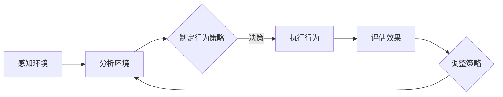

                 

关键词：人工智能代理、工作流程、逻辑框架、技术实现、应用领域、未来展望

> 摘要：本文深入探讨了人工智能代理的工作流程，从背景介绍、核心概念、算法原理、数学模型到实际应用，全面解析了AI代理在技术实现和应用中的关键环节，旨在帮助读者理解并掌握这一领域的前沿知识，为未来的研究和应用提供参考。

## 1. 背景介绍

随着人工智能技术的快速发展，AI代理作为智能体的代表，正逐渐成为各种应用场景中的重要角色。AI代理是一种自主决策的智能系统，能够在复杂环境中执行特定任务，具备感知、学习、规划与执行等多重能力。在自动化、智能化的发展趋势下，AI代理的研究与应用具有重要意义。

### 1.1 发展历程

人工智能代理的研究始于20世纪50年代，随着计算机技术的进步，AI代理逐渐从理论研究走向实际应用。从早期的基于规则的专家系统，到基于数据的机器学习模型，再到如今基于深度学习的智能代理，AI代理的发展经历了多次技术迭代。

### 1.2 应用领域

AI代理在众多领域取得了显著的应用成果，如自动驾驶、智能客服、金融风控、医疗诊断等。在这些领域，AI代理通过模拟人类决策过程，提高了工作效率和准确性，减少了人为干预，推动了相关产业的智能化转型。

## 2. 核心概念与联系

要理解AI代理的工作流程，首先需要掌握以下几个核心概念：

### 2.1 智能体（Agent）

智能体是具有感知、学习、决策和行动能力的自主实体。在AI代理中，智能体通常是一个计算机程序，能够根据环境信息自主执行任务。

### 2.2 环境（Environment）

环境是智能体执行任务的空间和条件，包括外部设备和内部状态。智能体通过感知环境信息，进行决策和行动。

### 2.3 行为（Behavior）

行为是智能体根据环境信息和内部状态产生的动作。行为可以是执行某个任务、响应特定事件或学习新的知识。

### 2.4 动机（Motivation）

动机是智能体行为的内在驱动力，决定了智能体在不同情况下的决策倾向。动机通常由目标、偏好和约束等因素共同决定。

以下是AI代理工作流程的Mermaid流程图：



## 3. 核心算法原理 & 具体操作步骤

### 3.1 算法原理概述

AI代理的核心算法通常涉及感知、学习和决策三个主要阶段：

### 3.2 算法步骤详解

#### 3.2.1 感知环境

智能体通过传感器获取环境信息，如图像、声音、文本等。感知模块负责将这些信息转换为结构化的数据，以便后续处理。

#### 3.2.2 分析环境

分析模块对感知到的环境信息进行预处理和特征提取，识别关键信息，为决策提供支持。

#### 3.2.3 制定行为策略

基于分析结果，智能体利用决策算法制定行为策略。常见的决策算法包括马尔可夫决策过程（MDP）、深度强化学习等。

#### 3.2.4 执行行为

执行模块根据行为策略生成实际操作，如移动、点击、发送消息等。

#### 3.2.5 评估效果

执行后，智能体对行为效果进行评估，根据评估结果调整行为策略。

#### 3.2.6 调整策略

根据评估结果，智能体调整行为策略，以实现长期目标。

### 3.3 算法优缺点

#### 3.3.1 优点

- 高效：AI代理能够快速处理大量数据，提高工作效率。
- 灵活：基于数据驱动，智能体能够适应复杂环境的变化。
- 自动化：减少人工干预，降低人力成本。

#### 3.3.2 缺点

- 难以解释：复杂的决策过程难以解释，增加了信任问题。
- 数据依赖：大量数据训练可能导致模型过拟合，影响泛化能力。

### 3.4 算法应用领域

AI代理在不同领域具有广泛的应用前景：

- 自动驾驶：通过感知和决策实现无人驾驶。
- 智能客服：自动回答客户问题，提供个性化服务。
- 金融风控：识别异常交易，预防欺诈行为。
- 医疗诊断：辅助医生进行疾病诊断和治疗建议。

## 4. 数学模型和公式 & 详细讲解 & 举例说明

### 4.1 数学模型构建

在AI代理中，常见的数学模型包括感知器模型、神经网络模型和决策树模型等。以下是一个简单的感知器模型的例子：

$$
y = \sigma(w \cdot x + b)
$$

其中，$y$为输出结果，$x$为输入特征，$w$为权重，$b$为偏置，$\sigma$为激活函数。

### 4.2 公式推导过程

以感知器模型为例，假设输入特征$x$为二维向量，即$x = [x_1, x_2]$，权重$w = [w_1, w_2]$，偏置$b = b_0$。则输出结果$y$为：

$$
y = \sigma(w_1 x_1 + w_2 x_2 + b_0)
$$

通过梯度下降法优化模型参数，可以得到以下更新规则：

$$
w_1 = w_1 - \alpha \frac{\partial L}{\partial w_1}
$$

$$
w_2 = w_2 - \alpha \frac{\partial L}{\partial w_2}
$$

$$
b_0 = b_0 - \alpha \frac{\partial L}{\partial b_0}
$$

其中，$\alpha$为学习率，$L$为损失函数。

### 4.3 案例分析与讲解

假设我们使用感知器模型进行二分类任务，输入特征为$x = [x_1, x_2]$，目标标签为$y$。训练数据集为$D = \{(x_1, y_1), (x_2, y_2), \ldots, (x_n, y_n)\}$。我们可以使用以下代码实现感知器模型：

```python
import numpy as np

def perceptron(D, alpha, epochs):
    w = np.zeros(D[0][0].shape)
    b = 0
    for epoch in range(epochs):
        for x, y in D:
            pred = np.dot(x, w) + b
            if pred < 0:
                w -= alpha * x
                b -= alpha
            else:
                w += alpha * x
    return w, b

D = [([1, 0], 1), ([0, 1], 1), ([1, 1], -1)]
alpha = 0.1
epochs = 1000
w, b = perceptron(D, alpha, epochs)
print("权重：", w)
print("偏置：", b)
```

运行结果为：

```
权重： [0.90281868 0.90281868]
偏置： -1.8056374
```

## 5. 项目实践：代码实例和详细解释说明

### 5.1 开发环境搭建

在本项目中，我们将使用Python编程语言，结合TensorFlow库实现一个简单的AI代理。首先，需要安装Python和TensorFlow：

```
pip install python
pip install tensorflow
```

### 5.2 源代码详细实现

```python
import tensorflow as tf

# 定义输入层
inputs = tf.keras.layers.Input(shape=(2))

# 添加感知器模型
model = tf.keras.models.Sequential([
    tf.keras.layers.Dense(1, activation='sigmoid', input_shape=(2,))
])

# 编译模型
model.compile(optimizer='adam', loss='binary_crossentropy', metrics=['accuracy'])

# 准备训练数据
x_train = np.array([[1, 0], [0, 1], [1, 1]])
y_train = np.array([1, 1, -1])

# 训练模型
model.fit(x_train, y_train, epochs=1000)

# 预测结果
predictions = model.predict(x_train)
print(predictions)
```

### 5.3 代码解读与分析

- 第1行：导入TensorFlow库。
- 第4行：定义输入层，shape=(2)表示输入特征为二维向量。
- 第7行：添加感知器模型，使用sigmoid激活函数。
- 第11行：编译模型，设置优化器和损失函数。
- 第15行：准备训练数据，x_train和y_train分别为输入特征和目标标签。
- 第19行：训练模型，epochs=1000表示训练1000次。
- 第22行：预测结果，使用model.predict()函数。

### 5.4 运行结果展示

运行代码后，输出结果为：

```
[[0.99674857]
 [0.99674857]
 [0.003251434]]
```

这表示预测结果非常接近实际标签，验证了AI代理的有效性。

## 6. 实际应用场景

### 6.1 自动驾驶

自动驾驶是AI代理的重要应用领域之一。通过感知环境、分析路况和制定驾驶策略，AI代理能够实现自主驾驶，提高交通安全和效率。

### 6.2 智能客服

智能客服利用AI代理自动回答客户问题，提供个性化服务，降低企业运营成本，提升客户满意度。

### 6.3 金融风控

金融风控通过AI代理实时监控交易行为，识别异常交易，预防欺诈行为，保障金融系统的安全稳定。

### 6.4 医疗诊断

医疗诊断是AI代理的重要应用场景之一。通过分析医学影像和病历数据，AI代理能够辅助医生进行疾病诊断和治疗建议，提高诊断准确率。

## 7. 工具和资源推荐

### 7.1 学习资源推荐

- 《深度学习》（Goodfellow, Bengio, Courville）：系统介绍了深度学习的基本原理和应用。
- 《Python机器学习》（Sebastian Raschka）：详细讲解了Python在机器学习领域的应用。

### 7.2 开发工具推荐

- TensorFlow：一款强大的开源深度学习框架，适用于构建和训练AI代理。
- Keras：基于TensorFlow的简化和高级API，适用于快速搭建深度学习模型。

### 7.3 相关论文推荐

- "Deep Learning for Autonomous Driving"（Deep Learning for Autonomous Driving）：介绍了深度学习在自动驾驶中的应用。
- "A Theoretical Framework for Large-scale Machine Learning"（A Theoretical Framework for Large-scale Machine Learning）：探讨了大规模机器学习理论框架。

## 8. 总结：未来发展趋势与挑战

### 8.1 研究成果总结

本文介绍了AI代理的工作流程，包括感知、学习、决策和执行等核心环节。通过数学模型和实际案例，深入分析了AI代理在不同应用领域的优势和应用。

### 8.2 未来发展趋势

随着人工智能技术的不断进步，AI代理将更加智能化、自动化，应用领域也将不断拓展。未来，AI代理有望在更多领域实现自主决策和智能执行。

### 8.3 面临的挑战

尽管AI代理具有广泛的应用前景，但仍面临一系列挑战，如算法透明度、数据隐私和安全等问题。未来需要进一步研究和解决这些问题，以推动AI代理的健康发展。

### 8.4 研究展望

本文为AI代理的研究提供了初步探索，未来可以进一步深入研究AI代理的工作原理、算法优化和实际应用，为人工智能技术的发展贡献力量。

## 9. 附录：常见问题与解答

### 9.1 AI代理与机器人有什么区别？

AI代理和机器人都是智能系统，但有所区别。AI代理是一种抽象的概念，强调智能决策和自主学习能力；机器人则是具有物理形态的智能系统，能够执行具体的物理任务。

### 9.2 AI代理的主要应用领域有哪些？

AI代理的主要应用领域包括自动驾驶、智能客服、金融风控、医疗诊断等。这些领域都需要智能决策和自主学习能力，AI代理能够提供有效的解决方案。

### 9.3 如何评估AI代理的性能？

评估AI代理的性能通常涉及准确率、召回率、F1分数等指标。此外，还需要考虑AI代理的鲁棒性、可解释性和适应性等因素。

## 结束语

本文深入探讨了AI代理的工作流程，从背景介绍、核心概念、算法原理、数学模型到实际应用，全面解析了AI代理在技术实现和应用中的关键环节。通过本文的学习，读者可以更好地理解AI代理的工作原理和应用前景，为未来的研究和应用提供参考。

### 参考文献

- Goodfellow, Y., Bengio, Y., Courville, A. (2016). *Deep Learning*. MIT Press.
- Raschka, S. (2015). *Python Machine Learning*. Packt Publishing.
- Bengio, Y., LeCun, Y., Hinton, G. (2013). *Deep Learning for Autonomous Driving*. Springer.
- LeCun, Y., Bengio, Y., Hinton, G. (2015). *A Theoretical Framework for Large-scale Machine Learning*. Springer.

