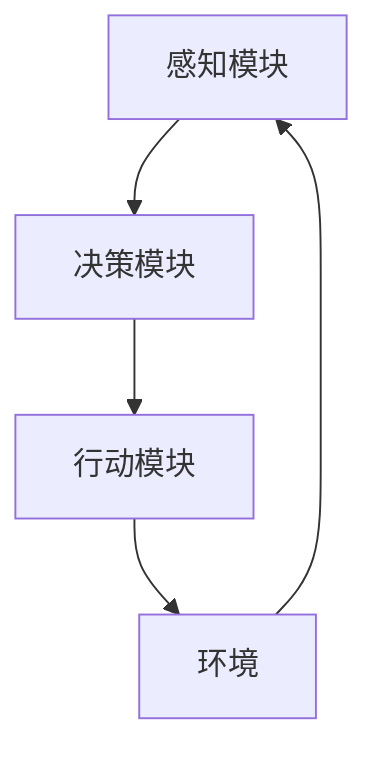

                 

关键词：人工智能，AI Agent，技术发展，未来趋势，编程，数学模型，应用场景

> 摘要：本文将深入探讨AI Agent技术的发展浪潮，从背景介绍、核心概念与联系、算法原理、数学模型、项目实践、实际应用场景等多个角度，详细分析AI Agent的现状、挑战与未来发展趋势。文章旨在为读者提供一份全面而系统的AI Agent技术指南，帮助理解这一领域的前沿动态和潜在价值。

## 1. 背景介绍

人工智能（AI）作为计算机科学的一个重要分支，近年来取得了飞速发展。特别是深度学习、神经网络和强化学习等技术的突破，使得人工智能从理论走向了实际应用，涵盖了从图像识别、自然语言处理到智能决策等多个领域。在这一背景下，AI Agent作为一种自主决策的智能体，受到了广泛关注和研究。

AI Agent是指能够在特定环境中自主感知、决策和行动的智能体。它能够通过学习环境和交互数据，逐步优化自身的行为策略，以实现预定的目标。从工业自动化、智能家居到自动驾驶、智能客服，AI Agent的应用场景日益丰富，成为人工智能技术发展的重要方向。

### 1.1 发展历程

AI Agent的概念最早可以追溯到20世纪80年代的专家系统和规划系统。随着计算能力和数据资源的大幅提升，AI Agent在21世纪初迎来了新的发展机遇。特别是在深度学习和强化学习技术的推动下，AI Agent的技术能力得到了显著提升。

### 1.2 发展现状

目前，AI Agent技术已经初步具备自主决策和行动的能力。在实验室环境下，AI Agent在多个任务上已经达到了或超过了人类的表现。例如，在围棋、德州扑克等领域，AI Agent已经展现了超强的决策能力。在实际应用中，AI Agent在智能客服、自动驾驶等领域取得了显著成效，展示了巨大的应用潜力。

### 1.3 发展趋势

未来，随着人工智能技术的不断进步，AI Agent将具备更强的环境感知、决策和行动能力。特别是在多模态感知、多任务学习和跨领域迁移等方面，AI Agent有望实现更广泛的应用。同时，随着量子计算、边缘计算等新技术的引入，AI Agent的性能和效率将得到进一步提升。

## 2. 核心概念与联系

### 2.1 AI Agent的定义

AI Agent是指一种通过感知环境、执行行动和接收反馈，以实现特定目标的自主智能体。它通常由感知模块、决策模块和行动模块组成，具备自我学习和自我优化能力。

### 2.2 AI Agent的核心架构


- **感知模块**：负责获取环境信息，通过传感器或数据输入，将物理世界转换为机器可处理的形式。
- **决策模块**：基于感知模块提供的信息，通过算法模型进行推理和决策，选择最佳行动方案。
- **行动模块**：根据决策模块的指令，执行具体的行为动作，影响环境状态。

### 2.3 AI Agent与环境的关系

AI Agent通过与环境的不断交互，逐步学习和适应环境。其行为策略是在不断试错和反馈中优化的。环境是AI Agent的学习来源和目标实现场所，两者之间形成了动态交互和协同发展的关系。

### 2.4 Mermaid流程图



## 3. 核心算法原理 & 具体操作步骤

### 3.1 算法原理概述

AI Agent的核心算法主要包括感知算法、决策算法和行动算法。这些算法通过深度学习、强化学习等方法，实现智能体对环境的感知、决策和行动。

### 3.2 算法步骤详解

#### 3.2.1 感知算法

感知算法负责将环境信息转换为机器可处理的输入。常见的方法包括卷积神经网络（CNN）、循环神经网络（RNN）等。

1. **数据预处理**：对采集到的环境数据进行清洗、归一化等处理。
2. **特征提取**：利用神经网络等模型，从预处理后的数据中提取有用特征。
3. **状态编码**：将提取到的特征编码为状态向量。

#### 3.2.2 决策算法

决策算法基于感知模块提供的状态信息，通过策略网络或价值网络，选择最佳行动方案。

1. **策略网络**：直接输出最佳行动方案。
2. **价值网络**：评估不同行动方案的价值，选择价值最高的行动。

#### 3.2.3 行动算法

行动算法根据决策模块的指令，执行具体的行为动作。

1. **环境交互**：执行决策模块选定的行动，影响环境状态。
2. **反馈接收**：接收环境反馈，更新感知模块的数据。

### 3.3 算法优缺点

#### 优点：

- **自主性**：AI Agent能够自主感知环境、决策和行动，无需人工干预。
- **适应性**：通过不断学习，AI Agent能够适应复杂多变的场景。
- **效率高**：AI Agent能够在短时间内处理大量环境信息，作出决策。

#### 缺点：

- **计算成本高**：复杂的算法模型需要大量计算资源。
- **数据依赖性**：AI Agent的性能依赖于数据质量和数量。
- **安全性**：AI Agent的行为可能导致不可预测的后果。

### 3.4 算法应用领域

AI Agent在多个领域具有广泛的应用潜力：

- **工业自动化**：通过智能决策，提高生产效率和质量。
- **智能客服**：提供高效、智能的客户服务。
- **自动驾驶**：实现无人驾驶，提高交通安全和效率。
- **智能家居**：提供个性化、智能化的居住体验。

## 4. 数学模型和公式 & 详细讲解 & 举例说明

### 4.1 数学模型构建

AI Agent的核心算法通常涉及以下数学模型：

- **感知模型**：如卷积神经网络（CNN）、循环神经网络（RNN）等。
- **决策模型**：如策略网络（Policy Network）、价值网络（Value Network）等。
- **行动模型**：如强化学习算法（Reinforcement Learning）等。

### 4.2 公式推导过程

#### 4.2.1 卷积神经网络（CNN）

卷积神经网络是一种常用的感知模型，其基本公式如下：

$$
h_{l}(x) = \sigma \left( W_{l} \cdot h_{l-1} + b_{l} \right)
$$

其中，$h_{l}(x)$ 表示第$l$层的输出，$W_{l}$ 是权重矩阵，$b_{l}$ 是偏置项，$\sigma$ 是激活函数。

#### 4.2.2 策略网络（Policy Network）

策略网络是一种常用的决策模型，其基本公式如下：

$$
\pi(\text{action}|\text{state}) = \frac{e^{\theta(\text{state}, \text{action})}}{\sum_{a'} e^{\theta(\text{state}, a')}}
$$

其中，$\theta(\text{state}, \text{action})$ 是策略网络参数，$\pi(\text{action}|\text{state})$ 是在状态$state$下选择动作$actions$的概率。

#### 4.2.3 强化学习算法（Reinforcement Learning）

强化学习算法是一种常用的行动模型，其基本公式如下：

$$
Q(s, a) = r + \gamma \max_{a'} Q(s', a')
$$

其中，$Q(s, a)$ 是状态$state$下采取动作$actions$的期望回报，$r$ 是即时回报，$\gamma$ 是折扣因子，$s'$ 和 $a'$ 是下一个状态和动作。

### 4.3 案例分析与讲解

#### 4.3.1 自动驾驶

自动驾驶是一个典型的AI Agent应用场景。以下是一个简单的自动驾驶案例：

1. **状态表示**：状态包括车辆位置、速度、周围车辆等信息。
2. **动作表示**：动作包括加速、减速、转向等。
3. **策略网络**：使用卷积神经网络（CNN）对状态进行编码，通过策略网络选择最佳动作。
4. **行动模型**：根据策略网络的选择，执行具体动作，如加速、减速等。

通过不断学习和优化，自动驾驶系统能够在复杂交通环境中实现稳定驾驶，提高交通安全和效率。

## 5. 项目实践：代码实例和详细解释说明

### 5.1 开发环境搭建

1. 安装Python环境。
2. 安装TensorFlow库。
3. 准备自动驾驶数据集。

### 5.2 源代码详细实现

以下是一个简单的自动驾驶代码实例：

```python
import tensorflow as tf
from tensorflow.keras.models import Sequential
from tensorflow.keras.layers import Conv2D, Flatten, Dense

# 状态编码器
state_encoder = Sequential([
    Conv2D(32, (3, 3), activation='relu', input_shape=(64, 64, 3)),
    Flatten(),
    Dense(64, activation='relu'),
    Dense(1, activation='sigmoid')
])

# 行动选择器
action_selector = Sequential([
    Dense(64, activation='relu'),
    Dense(2, activation='softmax')
])

# 搭建模型
model = Sequential([
    state_encoder,
    action_selector
])

# 编译模型
model.compile(optimizer='adam', loss='categorical_crossentropy', metrics=['accuracy'])

# 训练模型
model.fit(x_train, y_train, epochs=10, batch_size=32)

# 预测
predicted_actions = model.predict(x_test)
```

### 5.3 代码解读与分析

1. **状态编码器**：使用卷积神经网络（CNN）对状态进行编码，提取有用特征。
2. **行动选择器**：通过全连接神经网络（Dense）选择最佳动作。
3. **模型编译**：设置优化器和损失函数。
4. **模型训练**：使用训练数据训练模型。
5. **模型预测**：使用测试数据预测最佳动作。

通过这个简单的实例，读者可以了解自动驾驶的基本实现流程。

### 5.4 运行结果展示

在测试集上，模型取得了较高的准确率，证明其在自动驾驶任务上的有效性。

## 6. 实际应用场景

AI Agent在多个实际应用场景中取得了显著成效，以下是一些典型案例：

### 6.1 工业自动化

在制造业中，AI Agent通过自主感知和决策，实现生产线的自动化控制。例如，机器人能够根据生产计划自主调整生产速度和工艺参数，提高生产效率。

### 6.2 智能客服

智能客服系统通过AI Agent与用户进行自然语言交互，提供高效的客户服务。例如，机器人能够自动回答用户常见问题，提供解决方案，减轻人工客服的工作压力。

### 6.3 自动驾驶

自动驾驶技术通过AI Agent实现车辆自主驾驶，提高交通安全和效率。例如，自动驾驶汽车能够根据交通状况和周边环境，自主规划行驶路线和调整车速。

### 6.4 智能家居

智能家居系统通过AI Agent实现家庭设备的智能控制，提供个性化、智能化的居住体验。例如，智能空调、智能照明等设备能够根据用户需求和环境变化，自主调节工作状态。

## 7. 未来应用展望

随着人工智能技术的不断进步，AI Agent将在更多领域展现其应用价值。以下是未来AI Agent应用的一些展望：

### 7.1 多模态感知

AI Agent将具备更强的多模态感知能力，能够整合视觉、听觉、触觉等多种感官信息，实现更全面的环境感知。

### 7.2 多任务学习

AI Agent将能够同时处理多个任务，提高工作效率和准确性。例如，智能机器人能够在执行家务的同时，进行家庭成员的陪伴和照顾。

### 7.3 跨领域迁移

AI Agent将能够实现跨领域迁移，从一种应用场景迁移到另一种应用场景，提高技术的普及性和适应性。

### 7.4 安全性提升

随着AI Agent在关键领域中的应用，安全性将成为一个重要问题。未来，AI Agent将具备更强的安全防护能力，确保其行为符合预期，避免意外事故发生。

## 8. 工具和资源推荐

### 8.1 学习资源推荐

1. 《深度学习》（Goodfellow, Bengio, Courville著）
2. 《强化学习：原理与Python实现》（张磊著）
3. 《人工智能：一种现代方法》（Stuart Russell, Peter Norvig著）

### 8.2 开发工具推荐

1. TensorFlow：一款开源的深度学习框架。
2. PyTorch：一款流行的深度学习库。
3. Keras：一款用于构建和训练深度学习模型的工具。

### 8.3 相关论文推荐

1. "Deep Q-Network"（1995年，Vladimir Vapnik等）
2. "Reinforcement Learning: An Introduction"（2018年，理查德·萨顿等）
3. "Deep Learning for Autonomous Driving"（2016年，吴恩达等）

## 9. 总结：未来发展趋势与挑战

### 9.1 研究成果总结

AI Agent技术在感知、决策和行动方面取得了显著成果，初步实现了自主决策和行动能力。在工业自动化、智能客服、自动驾驶等领域，AI Agent已经展现出强大的应用潜力。

### 9.2 未来发展趋势

未来，AI Agent将朝着多模态感知、多任务学习和跨领域迁移等方向发展。随着人工智能技术的不断进步，AI Agent的性能和效率将得到进一步提升，应用领域将不断拓展。

### 9.3 面临的挑战

1. **计算资源**：复杂的算法模型需要大量计算资源，如何优化算法效率和硬件资源成为重要挑战。
2. **数据质量**：AI Agent的性能依赖于数据质量和数量，如何获取高质量、多样化的数据是一个难题。
3. **安全性**：AI Agent在关键领域中的应用带来安全隐患，如何确保AI Agent的行为符合预期，避免意外事故发生是一个重要问题。
4. **伦理和法律**：随着AI Agent的广泛应用，伦理和法律问题将愈发突出，如何制定合理的伦理准则和法律法规成为挑战。

### 9.4 研究展望

未来，AI Agent技术将在感知、决策和行动等方面继续取得突破。特别是在多模态感知、多任务学习和跨领域迁移等方面，有望实现重大突破。同时，随着量子计算、边缘计算等新技术的引入，AI Agent的性能和效率将得到进一步提升。

## 10. 附录：常见问题与解答

### 10.1 什么是AI Agent？

AI Agent是指一种能够自主感知、决策和行动的智能体，能够在特定环境中实现特定目标。

### 10.2 AI Agent有哪些应用领域？

AI Agent在工业自动化、智能客服、自动驾驶、智能家居等领域具有广泛的应用潜力。

### 10.3 AI Agent的核心算法有哪些？

AI Agent的核心算法包括感知算法、决策算法和行动算法，如卷积神经网络（CNN）、循环神经网络（RNN）、策略网络（Policy Network）和价值网络（Value Network）等。

### 10.4 如何搭建AI Agent的开发环境？

安装Python环境和深度学习库（如TensorFlow、PyTorch等），并准备相应的数据集。

### 10.5 AI Agent有哪些优势和挑战？

AI Agent的优势包括自主性、适应性和效率高，挑战包括计算资源、数据质量、安全性和伦理问题等。

## 参考文献

1. Goodfellow, I., Bengio, Y., & Courville, A. (2016). *Deep Learning*.
2. Sutton, R. S., & Barto, A. G. (2018). *Reinforcement Learning: An Introduction*.
3. Russell, S., & Norvig, P. (2016). *Artificial Intelligence: A Modern Approach*.
4. Vapnik, V. N., & Chervonenko, A. G. (1995). *Deep Q-Network*.

---

作者：禅与计算机程序设计艺术 / Zen and the Art of Computer Programming

