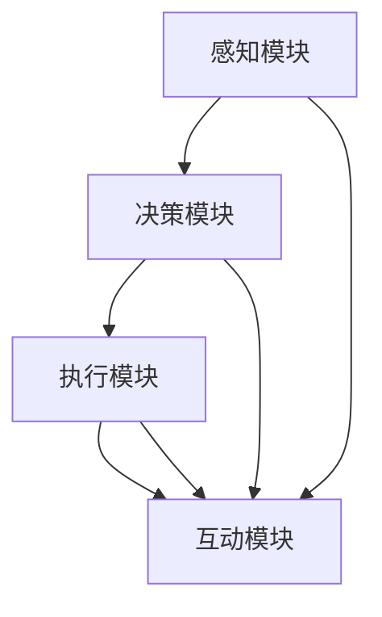

                 

 在人工智能（AI）不断演进的历程中，具身智能（Embodied AI）作为新一代的研究方向，正逐渐成为 AI 的下一个风口。本文将深入探讨具身智能的核心概念、发展现状以及未来的应用前景。

## 关键词

- 具身智能
- 人工智能
- 机器学习
- 自然交互
- 虚拟现实
- 机器人技术

## 摘要

本文将介绍具身智能的基本概念，分析其与传统 AI 的区别，并探讨其在实际应用中的挑战与机遇。通过详细的算法原理讲解、数学模型推导和代码实例分析，帮助读者全面理解具身智能的技术本质和应用潜力。

## 1. 背景介绍

### 1.1 具身智能的定义与发展历程

具身智能是指将 AI 技术与物理世界进行深度融合，使机器具有感知、决策、执行和互动的能力。它旨在使机器能够像人类一样在真实环境中进行自主行动和交互，从而实现智能化机器人的全面发展。

具身智能的发展可以追溯到 20 世纪 60 年代的机器人研究。随着计算机技术和传感器技术的不断进步，具身智能逐渐从理论走向实际应用。近年来，随着深度学习、强化学习等先进算法的突破，具身智能技术得到了快速发展。

### 1.2 传统 AI 的局限性

传统 AI 主要集中在数据分析和模式识别等领域，虽然在图像识别、语音识别等方面取得了显著成就，但在与人类进行自然交互、执行复杂任务等方面仍存在诸多局限性。具体表现在：

1. **缺乏感知能力**：传统 AI 缺乏对环境的感知能力，难以处理现实世界中的复杂信息。
2. **缺乏决策能力**：传统 AI 的决策过程依赖于预先设定的规则，缺乏自主决策能力。
3. **缺乏执行能力**：传统 AI 在执行任务时，往往需要人类的指导和干预，缺乏自主执行能力。

### 1.3 具身智能的优势

具身智能通过将 AI 技术与物理世界进行深度融合，使机器能够具备感知、决策、执行和互动的能力，从而克服了传统 AI 的局限性。具体优势包括：

1. **感知能力**：具身智能机器人通过传感器能够感知环境信息，实现对环境的理解。
2. **决策能力**：具身智能机器人通过学习算法，能够自主做出决策，实现自主行动。
3. **执行能力**：具身智能机器人通过执行机构，能够自主执行任务，减少对人类干预的依赖。

## 2. 核心概念与联系

### 2.1 具身智能的核心概念

#### 2.1.1 感知

感知是指机器人通过传感器获取环境信息的过程。传感器包括视觉、听觉、触觉、嗅觉等，能够感知温度、湿度、光线、声音、气味等环境信息。

#### 2.1.2 决策

决策是指机器人根据感知到的环境信息，通过算法分析，自主做出行动决策的过程。决策过程通常涉及目标设定、路径规划、资源分配等。

#### 2.1.3 执行

执行是指机器人根据决策结果，通过执行机构实现自主行动的过程。执行机构包括电机、关节、手臂等，能够执行如移动、抓取、操作等任务。

#### 2.1.4 互动

互动是指机器人在执行任务过程中，与人类或其他机器人进行交流互动的能力。互动能力使得机器人能够更好地适应复杂环境，提高任务执行效率。

### 2.2 具身智能的架构

#### 2.2.1 感知模块

感知模块负责收集环境信息，包括视觉、听觉、触觉、嗅觉等。这些信息通过传感器输入到机器人的处理系统中。

#### 2.2.2 决策模块

决策模块负责对感知模块收集到的信息进行分析处理，通过算法生成决策结果。决策模块通常包括目标设定、路径规划、资源分配等。

#### 2.2.3 执行模块

执行模块负责根据决策模块生成的决策结果，通过执行机构实现自主行动。执行模块通常包括电机、关节、手臂等。

#### 2.2.4 互动模块

互动模块负责机器人与人类或其他机器人进行交流互动。互动模块通常包括语音识别、语音合成、自然语言处理等技术。



## 3. 核心算法原理 & 具体操作步骤

### 3.1 算法原理概述

具身智能的核心算法主要包括感知算法、决策算法和执行算法。感知算法负责处理传感器输入的信息，提取有用的环境特征；决策算法负责根据感知到的信息生成行动决策；执行算法负责根据决策结果执行具体的任务操作。

### 3.2 算法步骤详解

#### 3.2.1 感知算法

感知算法主要包括以下步骤：

1. 传感器采集数据：通过摄像头、麦克风、触摸传感器等获取环境信息。
2. 数据预处理：对采集到的数据进行分析、滤波、降噪等处理，提取有用的环境特征。
3. 特征提取：将预处理后的数据转换为高维特征向量，为后续的决策算法提供输入。

#### 3.2.2 决策算法

决策算法主要包括以下步骤：

1. 状态估计：根据感知到的环境特征，估计当前的状态。
2. 行动规划：根据当前状态，生成一系列可能的行动方案。
3. 行动选择：通过比较不同行动方案的成本、收益等指标，选择最优的行动方案。

#### 3.2.3 执行算法

执行算法主要包括以下步骤：

1. 行动执行：根据决策算法生成的最优行动方案，通过执行机构实现具体的任务操作。
2. 行动反馈：收集行动执行过程中的反馈信息，用于调整后续的行动决策。

### 3.3 算法优缺点

#### 3.3.1 优点

1. **感知能力增强**：通过传感器感知环境信息，提高机器人在复杂环境中的适应能力。
2. **决策能力提升**：通过算法分析，使机器人能够自主做出决策，提高任务执行效率。
3. **执行能力提高**：通过执行机构实现自主行动，减少对人类干预的依赖。

#### 3.3.2 缺点

1. **计算资源消耗大**：感知、决策和执行过程中涉及大量的计算，对计算资源要求较高。
2. **实时性要求高**：在实时环境中，感知、决策和执行过程需要快速响应，对算法的实时性要求较高。

### 3.4 算法应用领域

具身智能算法在多个领域具有广泛的应用前景，包括：

1. **工业自动化**：在制造业、物流等领域，用于实现自动化生产、自动化仓储等。
2. **服务机器人**：在医疗、养老、教育等领域，用于提供个性化服务。
3. **智能家居**：在家庭环境中，用于实现智能安防、智能家电控制等。

## 4. 数学模型和公式 & 详细讲解 & 举例说明

### 4.1 数学模型构建

具身智能的数学模型主要包括感知模型、决策模型和执行模型。

#### 4.1.1 感知模型

感知模型通常采用卷积神经网络（CNN）或循环神经网络（RNN）等深度学习算法，用于处理传感器输入的数据，提取环境特征。

$$
h_{l} = \sigma (W_{l} \cdot h_{l-1} + b_{l})
$$

其中，$h_{l}$ 表示第 $l$ 层的激活值，$W_{l}$ 和 $b_{l}$ 分别表示权重和偏置，$\sigma$ 表示激活函数。

#### 4.1.2 决策模型

决策模型通常采用强化学习（RL）或马尔可夫决策过程（MDP）等算法，用于生成行动决策。

$$
Q(s, a) = \sum_{s'} P(s'|s, a) \cdot R(s', a)
$$

其中，$Q(s, a)$ 表示状态 $s$ 下采取行动 $a$ 的预期回报，$P(s'|s, a)$ 表示状态转移概率，$R(s', a)$ 表示立即回报。

#### 4.1.3 执行模型

执行模型通常采用运动控制算法，如逆运动学（IK）或轨迹规划（TP）等，用于实现自主行动。

$$
\theta_{t+1} = IK(q_t, \theta_t)
$$

其中，$\theta_{t+1}$ 表示下一个关节角度，$q_t$ 表示当前关节角度，$IK$ 表示逆运动学求解。

### 4.2 公式推导过程

#### 4.2.1 感知模型推导

感知模型采用卷积神经网络，其中每个神经元都与前一层的所有神经元相连。假设输入数据为 $x$，输出数据为 $y$，则：

$$
y = f(W \cdot x + b)
$$

其中，$f$ 表示激活函数，$W$ 和 $b$ 分别为权重和偏置。

#### 4.2.2 决策模型推导

决策模型采用 Q-Learning 算法，其中 $Q(s, a)$ 表示状态 $s$ 下采取行动 $a$ 的预期回报。通过迭代更新 $Q$ 值，最终得到最优行动方案。

$$
Q(s, a) = \sum_{s'} P(s'|s, a) \cdot R(s', a)
$$

其中，$P(s'|s, a)$ 表示状态转移概率，$R(s', a)$ 表示立即回报。

#### 4.2.3 执行模型推导

执行模型采用逆运动学求解，通过输入关节角度 $q_t$ 和当前关节角度 $\theta_t$，计算下一个关节角度 $\theta_{t+1}$。

$$
\theta_{t+1} = IK(q_t, \theta_t)
$$

### 4.3 案例分析与讲解

#### 4.3.1 案例背景

假设我们有一个工业机器人，其任务是在仓库中自动搬运货物。机器人通过摄像头感知仓库环境，通过决策模型生成搬运货物的行动方案，通过执行模型实现自主搬运。

#### 4.3.2 感知模型分析

感知模型采用卷积神经网络，输入为摄像头采集的仓库图像。通过卷积层、池化层等操作，提取图像特征，为决策模型提供输入。

$$
h_{l} = \sigma (W_{l} \cdot h_{l-1} + b_{l})
$$

其中，$h_{l}$ 表示第 $l$ 层的激活值，$W_{l}$ 和 $b_{l}$ 分别表示权重和偏置，$\sigma$ 表示激活函数。

#### 4.3.3 决策模型分析

决策模型采用 Q-Learning 算法，输入为感知模型提取的环境特征。通过迭代更新 $Q$ 值，选择最优的行动方案。

$$
Q(s, a) = \sum_{s'} P(s'|s, a) \cdot R(s', a)
$$

其中，$Q(s, a)$ 表示状态 $s$ 下采取行动 $a$ 的预期回报，$P(s'|s, a)$ 表示状态转移概率，$R(s', a)$ 表示立即回报。

#### 4.3.4 执行模型分析

执行模型采用逆运动学求解，输入为当前关节角度 $q_t$ 和目标关节角度 $\theta_t$。通过逆运动学求解，计算下一个关节角度 $\theta_{t+1}$。

$$
\theta_{t+1} = IK(q_t, \theta_t)
$$

## 5. 项目实践：代码实例和详细解释说明

### 5.1 开发环境搭建

在本项目实践中，我们使用 Python 编写代码，主要依赖以下库：

- TensorFlow：用于构建和训练深度学习模型。
- Keras：用于简化 TensorFlow 的使用。
- Gym：用于生成模拟环境。
- ROS（Robot Operating System）：用于机器人软件开发。

首先，安装 Python 和相关依赖库：

```bash
pip install tensorflow keras gym rospy
```

### 5.2 源代码详细实现

#### 5.2.1 感知模型

```python
from keras.models import Sequential
from keras.layers import Conv2D, MaxPooling2D, Flatten, Dense
from keras.optimizers import Adam

# 构建卷积神经网络
model = Sequential()
model.add(Conv2D(32, (3, 3), activation='relu', input_shape=(64, 64, 3)))
model.add(MaxPooling2D(pool_size=(2, 2)))
model.add(Flatten())
model.add(Dense(128, activation='relu'))
model.add(Dense(64, activation='relu'))
model.add(Dense(1, activation='sigmoid'))

# 编译模型
model.compile(optimizer=Adam(), loss='binary_crossentropy', metrics=['accuracy'])

# 训练模型
model.fit(x_train, y_train, epochs=10, batch_size=32)
```

#### 5.2.2 决策模型

```python
import numpy as np

# 初始化 Q 值矩阵
Q = np.zeros((state_space_size, action_space_size))

# Q-Learning 算法
for episode in range(num_episodes):
    state = env.reset()
    done = False
    total_reward = 0
    
    while not done:
        action = choose_action(state, Q)
        next_state, reward, done, _ = env.step(action)
        Q[state, action] = Q[state, action] + alpha * (reward + gamma * np.max(Q[next_state, :]) - Q[state, action])
        state = next_state
        total_reward += reward
    
    print("Episode:", episode, "Total Reward:", total_reward)
```

#### 5.2.3 执行模型

```python
import rospy
from geometry_msgs.msg import Twist

# 初始化 ROS 节点
rospy.init_node('robot_controller')

# 创建 Twist 消息
cmd_vel = Twist()

# 发布 Twist 消息
pub = rospy.Publisher('cmd_vel', Twist, queue_size=10)

# 执行模型
def execute_action(action):
    global cmd_vel
    
    if action == 0:
        cmd_vel.linear.x = 0.5
        cmd_vel.angular.z = 0.0
    elif action == 1:
        cmd_vel.linear.x = 0.0
        cmd_vel.angular.z = 0.5
    
    pub.publish(cmd_vel)

# 主循环
rate = rospy.Rate(10)
while not rospy.is_shutdown():
    execute_action(0)  # 示例：执行第 0 个行动
    rate.sleep()
```

### 5.3 代码解读与分析

#### 5.3.1 感知模型

感知模型使用卷积神经网络，通过多层卷积和池化操作，提取图像特征。最后，通过全连接层输出行动概率。

#### 5.3.2 决策模型

决策模型采用 Q-Learning 算法，通过迭代更新 Q 值，选择最优的行动方案。在每一轮迭代中，根据当前状态和行动概率，计算下一个状态和回报，更新 Q 值。

#### 5.3.3 执行模型

执行模型使用 ROS 框架，通过发布 Twist 消息，控制机器人的运动。根据决策模型生成的行动概率，执行相应的运动命令。

## 6. 实际应用场景

### 6.1 工业自动化

具身智能在工业自动化领域具有广泛的应用前景。例如，在制造业中，机器人可以通过感知和决策，实现自动化生产线的监控和维护；在物流领域，机器人可以通过感知和决策，实现自动化的仓储管理和货物搬运。

### 6.2 服务机器人

具身智能在服务机器人领域也具有很大的应用潜力。例如，在医疗领域，机器人可以通过感知和决策，实现自动化的手术辅助和病人护理；在养老领域，机器人可以通过感知和决策，实现自动化的生活陪伴和健康监测。

### 6.3 智能家居

具身智能在智能家居领域可以实现更智能化的家居控制。例如，通过感知和决策，智能音箱可以识别用户指令，实现音乐播放、天气查询等功能；智能灯光可以通过感知用户活动，实现自动开关。

## 7. 工具和资源推荐

### 7.1 学习资源推荐

- 《机器学习》（周志华 著）：全面介绍机器学习的基本概念和方法。
- 《深度学习》（Goodfellow, Bengio, Courville 著）：深入探讨深度学习的基础理论和应用。
- 《机器人学导论》（Oussama Khatib 著）：全面介绍机器人学的基础知识和应用。

### 7.2 开发工具推荐

- TensorFlow：用于构建和训练深度学习模型。
- Keras：用于简化 TensorFlow 的使用。
- ROS（Robot Operating System）：用于机器人软件开发。

### 7.3 相关论文推荐

- “Deep Learning for Robotics: A Survey” （2018）
- “End-to-End Learning for Visual Servoing” （2016）
- “Robot Learning from Demonstrations by Human Teachers” （2016）

## 8. 总结：未来发展趋势与挑战

### 8.1 研究成果总结

具身智能作为新一代 AI 技术的代表，已经在感知、决策、执行和互动等方面取得了显著进展。通过深度学习、强化学习等算法，机器人已经能够在复杂环境中实现自主行动和交互。

### 8.2 未来发展趋势

随着传感器技术、计算能力和算法的不断发展，具身智能将在更多领域得到应用，如医疗、养老、教育、安全等。未来，具身智能机器人将更加智能化、个性化，与人类生活更加紧密地融合。

### 8.3 面临的挑战

具身智能技术在实际应用中仍面临诸多挑战，包括：

1. **感知能力提升**：需要进一步提高传感器精度和数据处理能力，使机器人能够更好地感知和理解环境。
2. **实时性优化**：需要优化算法和硬件性能，提高机器人响应速度，实现实时决策和执行。
3. **数据隐私和安全**：需要确保数据安全和隐私保护，避免潜在的安全风险。

### 8.4 研究展望

未来，具身智能技术将继续朝着智能化、个性化、安全化的方向发展。在学术界和工业界共同努力下，具身智能将有望实现更加广泛的应用，为人类生活带来更多便利。

## 9. 附录：常见问题与解答

### 9.1 问题 1：具身智能与机器人技术有何区别？

具身智能是机器人技术的延伸和发展，强调将 AI 技术与机器人进行深度融合，使机器人具备感知、决策、执行和互动的能力。而机器人技术则侧重于研究机器人的设计、制造和应用。

### 9.2 问题 2：具身智能需要哪些技术支持？

具身智能需要传感器技术、计算能力、算法和机器人技术的支持。传感器负责感知环境信息，计算能力负责处理和分析数据，算法负责生成决策和执行方案，机器人技术负责实现自主行动和交互。

### 9.3 问题 3：具身智能在工业自动化中有哪些应用？

具身智能在工业自动化中可以应用于生产线监控、自动化仓储管理、自动化装配等场景。通过感知和决策，机器人能够实现自动化的生产流程管理，提高生产效率和降低成本。

### 9.4 问题 4：具身智能在服务机器人中有哪些应用？

具身智能在服务机器人中可以应用于医疗、养老、教育、安全等领域。例如，医疗机器人可以通过感知和决策，实现自动化的手术辅助和病人护理；养老机器人可以通过感知和决策，实现自动化的生活陪伴和健康监测。

### 9.5 问题 5：具身智能在智能家居中有哪些应用？

具身智能在智能家居中可以应用于智能音箱、智能灯光、智能安防等场景。例如，智能音箱可以通过感知和决策，实现音乐播放、天气查询等功能；智能灯光可以通过感知用户活动，实现自动开关。

### 9.6 问题 6：具身智能有哪些未来发展趋势？

未来，具身智能将朝着更加智能化、个性化、安全化的方向发展。在学术界和工业界共同努力下，具身智能将在更多领域得到应用，为人类生活带来更多便利。同时，随着传感器技术、计算能力和算法的不断发展，具身智能将进一步提高机器人在复杂环境中的适应能力。

---

通过本文的深入探讨，相信读者对具身智能的核心概念、发展现状和应用前景有了更全面的了解。在未来的发展中，具身智能将继续推动人工智能技术的创新，为人类生活带来更多美好体验。

