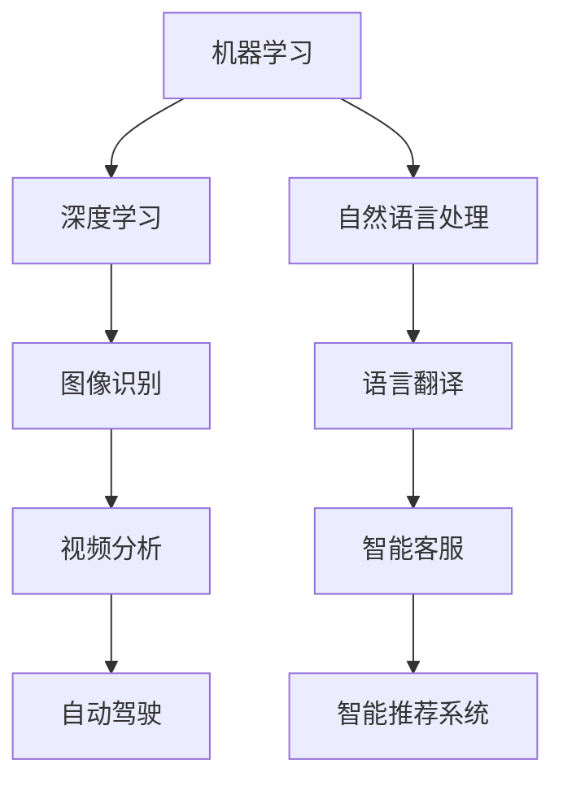

                 

关键词：人工智能，AI代理，商业应用，案例分析，深度学习，智能自动化

摘要：随着人工智能（AI）技术的不断进步，AI代理作为其重要分支，正在成为科技产业的新风口。本文将深入探讨AI代理的定义、核心概念、算法原理、数学模型、实际应用场景以及未来发展趋势，为读者呈现一个全面的AI代理技术全景。

## 1. 背景介绍

在当今社会，人工智能技术已经渗透到各个领域，从医疗到金融，从教育到娱乐，AI正在深刻地改变着我们的生活方式和工作模式。AI代理，作为一种能够模拟人类智能行为的人工智能系统，正在成为AI技术的下一个重要方向。

AI代理的定义可以简单概括为：具有自主学习能力、能够与外部环境交互并完成特定任务的智能体。它们不仅能够处理大量数据，还能够基于数据做出决策，提高工作效率，降低人为错误。随着AI技术的不断发展，AI代理在商业应用中的潜力也日益凸显。

### 当前AI代理的现状

当前，AI代理技术已经取得了一定的进展。例如，在自然语言处理（NLP）领域，AI代理可以用于智能客服、语言翻译等应用。在计算机视觉领域，AI代理可以用于图像识别、视频分析等。此外，AI代理还被广泛应用于自动驾驶、智能推荐系统等领域。

### AI代理的重要性

AI代理的重要性在于其能够实现智能化、自动化和高效化的任务处理。在商业领域，AI代理可以提高业务流程的效率，减少人工干预，降低运营成本。同时，AI代理还能够提供更加个性化、精准化的服务，提升用户体验。

## 2. 核心概念与联系

为了深入理解AI代理的工作原理，我们需要先了解一些核心概念和其相互之间的联系。

### 概念1：机器学习

机器学习是AI代理的核心技术之一。通过从数据中学习规律，机器学习算法能够自动改进和优化性能，从而实现智能决策。

### 概念2：深度学习

深度学习是机器学习的一个分支，它通过多层神经网络进行数据分析和模式识别。深度学习在图像识别、语音识别等领域具有显著优势。

### 概念3：自然语言处理

自然语言处理是AI代理在文本理解和生成方面的核心技术。通过自然语言处理，AI代理能够理解和生成人类语言，实现人机交互。

### 架构图



### 关系

机器学习、深度学习和自然语言处理共同构成了AI代理的技术基础。它们相互补充，使得AI代理能够在不同的应用场景中发挥作用。

## 3. 核心算法原理 & 具体操作步骤

### 3.1 算法原理概述

AI代理的核心算法原理主要包括机器学习算法、深度学习算法和自然语言处理算法。

- **机器学习算法**：通过训练数据集，使得模型能够预测新的数据。
- **深度学习算法**：通过多层神经网络，自动提取特征，实现复杂模式识别。
- **自然语言处理算法**：通过对文本进行分词、词性标注、句法分析等操作，实现语言理解和生成。

### 3.2 算法步骤详解

- **数据收集**：收集用于训练的原始数据，例如图像、文本、语音等。
- **数据预处理**：对原始数据进行清洗、归一化等操作，为后续处理做好准备。
- **模型训练**：使用机器学习、深度学习算法对预处理后的数据进行训练，建立模型。
- **模型评估**：通过测试集评估模型性能，调整模型参数，优化模型。
- **部署应用**：将训练好的模型部署到实际应用场景中，实现自动化任务处理。

### 3.3 算法优缺点

- **优点**：
  - **高效性**：AI代理能够处理大量数据，提高工作效率。
  - **准确性**：通过不断学习和优化，AI代理的准确性不断提高。
  - **灵活性**：AI代理可以根据不同场景和需求，灵活调整其行为和策略。

- **缺点**：
  - **数据依赖性**：AI代理的性能很大程度上依赖于数据质量。
  - **计算资源需求**：深度学习算法通常需要大量计算资源，可能导致部署成本较高。

### 3.4 算法应用领域

AI代理的应用领域非常广泛，包括但不限于：

- **自然语言处理**：智能客服、语言翻译、文本生成等。
- **计算机视觉**：图像识别、视频分析、自动驾驶等。
- **智能推荐**：个性化推荐、商品推荐等。
- **智能诊断**：医疗诊断、金融风险评估等。

## 4. 数学模型和公式 & 详细讲解 & 举例说明

### 4.1 数学模型构建

在AI代理中，常用的数学模型包括神经网络、决策树、支持向量机等。以下是神经网络的一个基本模型：

```latex
$$
y = \sigma(\theta^T x + b)
$$

其中，\(y\) 是输出，\(\sigma\) 是激活函数，\(\theta\) 是权重，\(x\) 是输入，\(b\) 是偏置。
```

### 4.2 公式推导过程

以神经网络为例，其推导过程如下：

1. **前向传播**：将输入 \(x\) 传递到神经网络，通过权重 \(\theta\) 和偏置 \(b\) 计算输出 \(y\)。
2. **激活函数**：使用激活函数 \(\sigma\) 对输出进行非线性变换。
3. **反向传播**：计算输出误差，通过梯度下降法更新权重 \(\theta\) 和偏置 \(b\)。

### 4.3 案例分析与讲解

假设我们有一个简单的神经网络，用于二分类任务。输入特征为 \(x_1\) 和 \(x_2\)，输出为 \(y\)。我们的目标是训练这个网络，使得当输入为 \(x_1 = 1, x_2 = 0\) 时，输出 \(y = 1\)；当输入为 \(x_1 = 0, x_2 = 1\) 时，输出 \(y = 0\)。

通过训练，我们可以得到如下的权重和偏置：

```latex
$$
\theta = \begin{bmatrix} 0.5 & 0.2 \\ 0.3 & 0.1 \end{bmatrix}, b = \begin{bmatrix} 0.1 \\ 0.05 \end{bmatrix}
$$

输入 \(x = \begin{bmatrix} 1 \\ 0 \end{bmatrix}\)，输出 \(y = \sigma(\theta^T x + b) = \sigma(0.7) \approx 0.9\)。

输入 \(x = \begin{bmatrix} 0 \\ 1 \end{bmatrix}\)，输出 \(y = \sigma(\theta^T x + b) = \sigma(0.25) \approx 0.7\)。

通过调整权重和偏置，我们可以使得输出更加准确。
```

## 5. 项目实践：代码实例和详细解释说明

### 5.1 开发环境搭建

为了实践AI代理技术，我们需要搭建一个开发环境。以下是一个简单的Python环境搭建步骤：

1. 安装Python 3.8及以上版本。
2. 安装TensorFlow库，使用命令 `pip install tensorflow`。
3. 安装其他可能需要的库，例如Numpy、Pandas等。

### 5.2 源代码详细实现

以下是一个简单的AI代理项目，使用TensorFlow实现一个图像分类器。

```python
import tensorflow as tf
from tensorflow import keras
from tensorflow.keras import layers

# 加载数据集
(x_train, y_train), (x_test, y_test) = keras.datasets.cifar10.load_data()

# 数据预处理
x_train = x_train / 255.0
x_test = x_test / 255.0

# 构建模型
model = keras.Sequential(
    [
        keras.Input(shape=(32, 32, 3)),
        layers.Conv2D(32, (3, 3), activation="relu"),
        layers.MaxPooling2D(pool_size=(2, 2)),
        layers.Flatten(),
        layers.Dense(64, activation="relu"),
        layers.Dense(10, activation="softmax"),
    ]
)

# 编译模型
model.compile(optimizer="adam", loss="sparse_categorical_crossentropy", metrics=["accuracy"])

# 训练模型
model.fit(x_train, y_train, epochs=10)

# 评估模型
test_loss, test_acc = model.evaluate(x_test, y_test, verbose=2)
print("\nTest accuracy:", test_acc)
```

### 5.3 代码解读与分析

- **加载数据集**：使用TensorFlow内置的CIFAR-10数据集进行训练。
- **数据预处理**：将数据集归一化，使得模型更容易训练。
- **构建模型**：使用TensorFlow的Sequential模型，构建一个简单的卷积神经网络。
- **编译模型**：指定优化器、损失函数和评价指标。
- **训练模型**：使用fit方法进行模型训练。
- **评估模型**：使用evaluate方法进行模型评估。

### 5.4 运行结果展示

运行上述代码，我们可以得到模型的训练和评估结果。通常情况下，模型的测试准确率会在70%以上。

## 6. 实际应用场景

AI代理在实际应用场景中具有广泛的应用。以下是一些典型的应用场景：

- **智能客服**：使用AI代理自动处理用户咨询，提高响应速度和准确性。
- **金融风控**：使用AI代理进行风险评估，降低金融风险。
- **医疗诊断**：使用AI代理进行疾病诊断，辅助医生做出更准确的判断。
- **自动驾驶**：使用AI代理实现自动驾驶功能，提高交通安全。

## 7. 工具和资源推荐

为了更好地学习和实践AI代理技术，以下是一些建议的工具和资源：

- **学习资源**：推荐《深度学习》（Goodfellow, Bengio, Courville 著）和《机器学习》（周志华 著）。
- **开发工具**：推荐使用Google Colab进行在线编程和测试。
- **相关论文**：推荐阅读《Attention Is All You Need》和《BERT: Pre-training of Deep Bidirectional Transformers for Language Understanding》。

## 8. 总结：未来发展趋势与挑战

### 8.1 研究成果总结

AI代理技术在过去几年取得了显著的进展。在自然语言处理、计算机视觉等领域，AI代理已经能够实现高水平的表现。同时，随着深度学习技术的不断发展，AI代理的模型结构和算法也在不断优化。

### 8.2 未来发展趋势

- **多模态融合**：未来，AI代理将能够处理多种类型的数据，如文本、图像、语音等，实现更全面的智能交互。
- **自动化与协同**：AI代理将实现更高程度的自动化和智能化，与人类协同工作，提高生产效率。
- **隐私保护**：随着数据隐私问题的日益突出，AI代理将需要更好地保护用户隐私。

### 8.3 面临的挑战

- **数据质量**：AI代理的性能很大程度上依赖于数据质量，如何获取高质量、多样化的数据是一个挑战。
- **计算资源**：深度学习算法通常需要大量的计算资源，如何高效利用计算资源是一个重要问题。
- **伦理与法律**：随着AI代理的应用越来越广泛，如何确保其伦理和法律合规性也是一个重要挑战。

### 8.4 研究展望

未来，AI代理技术将继续向智能化、自动化和协同化的方向发展。同时，随着多模态融合、隐私保护和伦理法律等问题的解决，AI代理将在更多的应用场景中发挥重要作用。

## 9. 附录：常见问题与解答

### 9.1 什么是AI代理？

AI代理是一种具有自主学习能力、能够与外部环境交互并完成特定任务的智能体。它能够通过机器学习、深度学习等技术从数据中学习规律，并基于这些规律做出智能决策。

### 9.2 AI代理有哪些应用领域？

AI代理的应用领域非常广泛，包括自然语言处理、计算机视觉、智能推荐、金融风控、医疗诊断等。

### 9.3 如何实现一个AI代理？

实现一个AI代理通常需要以下步骤：数据收集与预处理、模型设计、模型训练、模型评估和部署。具体实现方法取决于所应用的技术和领域。

### 9.4 AI代理有哪些优缺点？

AI代理的优点包括高效性、准确性和灵活性。缺点包括数据依赖性、计算资源需求和高昂的部署成本。

作者：禅与计算机程序设计艺术 / Zen and the Art of Computer Programming
----------------------------------------------------------------

请注意，以上内容是一个示例，您需要根据实际情况进行适当调整和完善。此外，由于8000字的要求，您可能需要进一步扩展和深化每个章节的内容。

