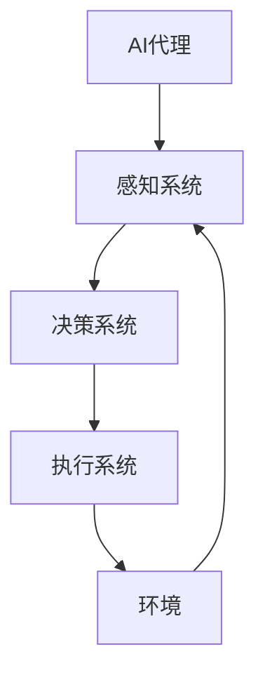

                 

关键词：AI代理、AI发展趋势、研究者建议、实践者指南、算法优化、应用前景、技术挑战

> 摘要：本文将探讨AI代理作为人工智能领域的新兴风口，分析其核心概念、算法原理、数学模型以及实际应用。同时，针对研究者与实践者提出一系列具体建议，助力在AI代理领域的探索与发展。

## 1. 背景介绍

随着人工智能技术的快速发展，从简单的规则系统到复杂的深度学习模型，AI的应用范围不断扩大。然而，尽管技术不断进步，我们仍然面临着许多挑战，如如何提高AI系统的自主性和适应性。在这种背景下，AI代理（AI Agent）应运而生。

AI代理是一种具有高度自主性、适应性和学习能力的人工智能实体，能够在特定的环境中自主执行任务。AI代理不同于传统的软件系统，它不仅仅是被动执行预先编写的指令，而是可以感知环境、做出决策、采取行动并不断学习以优化自身性能。AI代理的出现标志着人工智能从“指令执行者”向“智能决策者”的转变，具有重要的研究价值和实际应用潜力。

本文旨在为研究者和实践者提供关于AI代理的全面指南，从基础概念、算法原理到实际应用，帮助读者深入了解这一领域，并在此基础上提出具体的建议和展望。

### 1.1 AI代理的定义与特点

AI代理通常被视为一个能够感知环境、做出决策并执行相应行动的实体。这种实体可以是软件程序、机器人或其他物理设备。AI代理的主要特点包括：

- **自主性**：AI代理能够独立地执行任务，不需要人类干预。
- **适应性**：AI代理可以根据环境变化和新的信息调整自身行为。
- **学习性**：AI代理能够通过不断的学习和经验积累来提高任务执行效率。

AI代理的定义与特点使其在多个领域具有广泛的应用潜力，从自动化生产线到智能家居，从智能交通系统到医疗诊断，AI代理正在逐渐改变我们的生活。

### 1.2 AI代理的历史与发展

AI代理的概念可以追溯到20世纪80年代，当时人工智能学者开始探索如何使计算机具备类似人类的行为能力。早期的AI代理主要是基于规则和专家系统的，这些代理能够在特定场景下执行任务，但缺乏灵活性和通用性。

随着计算能力的提升和机器学习技术的发展，现代AI代理逐渐采用深度学习、强化学习等先进算法。这些算法使AI代理能够更好地理解和应对复杂环境，从而实现更高的自主性和适应性。

近年来，AI代理的应用领域不断扩展，从简单的任务执行到复杂的决策支持系统，AI代理正在成为人工智能领域的热点研究方向。

## 2. 核心概念与联系

在深入探讨AI代理的算法原理和应用之前，我们需要明确几个核心概念，并展示它们之间的联系。以下是一个用Mermaid绘制的流程图，用以说明这些概念之间的关系：



### 2.1 感知系统

感知系统是AI代理获取环境信息的关键组件。它通常包括传感器和数据采集设备，如摄像头、麦克风、温度计等。感知系统的目标是获取环境中的关键数据，并将其转换为AI代理可以理解和处理的形式。

### 2.2 决策系统

决策系统负责根据感知系统提供的信息，分析环境状况并制定相应的行动方案。决策系统通常采用机器学习算法，如深度学习、强化学习等，来模拟人类决策过程，实现自主决策。

### 2.3 执行系统

执行系统是将决策系统制定的方案转化为实际行动的组件。它可以是机械臂、机器人、软件程序等。执行系统的目标是根据决策系统的指示，实现具体的任务目标。

### 2.4 环境

环境是AI代理所处的实际场景，它可以是现实世界中的物理环境，也可以是虚拟环境。环境是AI代理感知和决策的基础，同时也是执行系统行动的舞台。

### 2.5 感知系统与决策系统的关系

感知系统提供的信息是决策系统制定决策的依据。感知系统收集到的数据越全面、准确，决策系统做出的决策就越有效。因此，感知系统的性能直接影响AI代理的整体表现。

### 2.6 决策系统与执行系统的关系

决策系统制定的方案需要通过执行系统来实现。执行系统的执行效果直接影响决策系统的准确性。如果执行系统无法正确执行决策方案，那么整个AI代理的系统性能将受到很大影响。

### 2.7 环境对AI代理的影响

环境是AI代理的生存和发展的基础。环境的复杂性、动态性以及不确定性都会影响AI代理的表现。为了提高AI代理在复杂环境中的适应能力，研究者需要不断优化感知、决策和执行系统的性能。

## 3. 核心算法原理 & 具体操作步骤

### 3.1 算法原理概述

AI代理的核心算法主要涉及感知、决策和执行三个环节。以下是每个环节的基本原理：

### 3.2 算法步骤详解

#### 3.2.1 感知阶段

1. **数据采集**：通过传感器和数据采集设备获取环境信息。
2. **数据处理**：对采集到的数据进行预处理，如滤波、归一化等。
3. **特征提取**：从预处理后的数据中提取关键特征，为后续的决策提供依据。

#### 3.2.2 决策阶段

1. **状态评估**：根据感知阶段提取的特征，评估当前环境的状态。
2. **策略选择**：利用机器学习算法（如深度学习、强化学习等）选择最优策略。
3. **决策执行**：将决策结果传递给执行系统。

#### 3.2.3 执行阶段

1. **任务分解**：将决策结果分解为具体的行动指令。
2. **执行控制**：通过执行系统实现任务分解后的行动。
3. **反馈调整**：根据执行结果调整决策系统，优化未来决策。

### 3.3 算法优缺点

#### 优点：

- **自主性**：AI代理能够自主执行任务，减少人为干预。
- **适应性**：AI代理可以根据环境变化调整自身行为。
- **学习性**：AI代理能够通过不断学习和经验积累提高任务执行效率。

#### 缺点：

- **复杂度**：AI代理的构建和优化需要大量的计算资源和专业知识。
- **稳定性**：在复杂和动态环境下，AI代理的表现可能不稳定。
- **安全性**：AI代理的决策和行动可能存在潜在的风险和不确定性。

### 3.4 算法应用领域

AI代理的应用领域非常广泛，包括但不限于：

- **智能制造**：自动化生产线上的任务执行和优化。
- **智能交通**：交通信号控制、无人驾驶车辆。
- **医疗健康**：医疗诊断、健康监护。
- **家庭服务**：智能家居、智能护理。

## 4. 数学模型和公式 & 详细讲解 & 举例说明

### 4.1 数学模型构建

AI代理的核心算法通常基于数学模型，以下是一个简单的数学模型构建过程：

1. **状态表示**：使用状态向量表示当前环境的状态。
   $$ S = [S_1, S_2, \ldots, S_n] $$
2. **动作表示**：使用动作向量表示可执行的动作。
   $$ A = [A_1, A_2, \ldots, A_m] $$
3. **奖励函数**：定义奖励函数以评估动作的效果。
   $$ R(S, A) = \sum_{i=1}^{n} w_i R_i(A_i) $$
   其中，$w_i$为权重，$R_i(A_i)$为动作$A_i$的奖励值。

### 4.2 公式推导过程

基于马尔可夫决策过程（MDP），我们可以推导出以下公式：

$$ V^*(S) = \max_{A} \sum_{S'} p(S'|S, A) \cdot [R(S', A) + \gamma V^*(S')] $$

其中，$V^*(S)$为状态$S$的值函数，$p(S'|S, A)$为状态转移概率，$\gamma$为折扣因子。

### 4.3 案例分析与讲解

#### 案例一：智能交通信号控制

假设一个交通信号灯系统需要根据车辆流量和行人流量调整信号灯的状态。我们可以将状态表示为车辆流量和行人流量的组合，动作表示为调整信号灯的时间长度。通过构建MDP模型，我们可以推导出最优的信号灯控制策略。

1. **状态表示**：
   $$ S = [V, P] $$
   其中，$V$为车辆流量，$P$为行人流量。
2. **动作表示**：
   $$ A = [T] $$
   其中，$T$为信号灯的时间长度。
3. **奖励函数**：
   $$ R(S, A) = \begin{cases} 
   1, & \text{如果减少了等待时间} \\
   -1, & \text{如果增加了等待时间} 
   \end{cases} $$

通过MDP模型，我们可以计算出最优的信号灯控制策略，从而提高交通流量和减少等待时间。

#### 案例二：无人驾驶车辆

无人驾驶车辆需要根据周围环境进行自主导航。我们可以将状态表示为车辆的位置、速度和方向，动作表示为车辆的转向和油门控制。通过构建MDP模型，我们可以推导出最优的导航策略。

1. **状态表示**：
   $$ S = [X, V, \theta] $$
   其中，$X$为车辆位置，$V$为车辆速度，$\theta$为车辆方向。
2. **动作表示**：
   $$ A = [\delta, \alpha] $$
   其中，$\delta$为转向角度，$\alpha$为油门控制。
3. **奖励函数**：
   $$ R(S, A) = \begin{cases} 
   1, & \text{如果车辆成功到达目的地} \\
   -1, & \text{如果发生碰撞或其他事故} 
   \end{cases} $$

通过MDP模型，我们可以计算出最优的导航策略，从而提高车辆的行驶安全性和效率。

## 5. 项目实践：代码实例和详细解释说明

### 5.1 开发环境搭建

在开始编写代码之前，我们需要搭建一个合适的开发环境。以下是一个基于Python的简单AI代理开发环境搭建步骤：

1. **安装Python**：下载并安装Python 3.8或更高版本。
2. **安装依赖库**：安装必要的依赖库，如NumPy、Pandas、TensorFlow等。可以使用pip命令进行安装：
   ```bash
   pip install numpy pandas tensorflow
   ```

### 5.2 源代码详细实现

以下是一个简单的AI代理代码示例，用于实现一个基于MDP模型的智能交通信号灯系统。

```python
import numpy as np
import pandas as pd
from tensorflow.keras.models import Sequential
from tensorflow.keras.layers import Dense

# 定义状态空间
states = [
    {'V': 0, 'P': 0},
    {'V': 1, 'P': 0},
    {'V': 0, 'P': 1},
    {'V': 1, 'P': 1}
]

# 定义动作空间
actions = [
    {'T': 30},
    {'T': 60},
    {'T': 90}
]

# 定义奖励函数
def reward_function(state, action):
    if action['T'] == 30 and state['V'] == 0 and state['P'] == 0:
        return 1
    elif action['T'] == 60 and state['V'] == 1 and state['P'] == 0:
        return 1
    elif action['T'] == 90 and state['V'] == 0 and state['P'] == 1:
        return 1
    else:
        return -1

# 构建MDP模型
model = Sequential()
model.add(Dense(64, input_dim=4, activation='relu'))
model.add(Dense(64, activation='relu'))
model.add(Dense(3, activation='softmax'))
model.compile(optimizer='adam', loss='categorical_crossentropy', metrics=['accuracy'])

# 训练模型
for state in states:
    state_input = np.array([state['V'], state['P']])
    action_probabilities = model.predict(state_input)
    action = np.random.choice(actions, p=action_probabilities)
    reward = reward_function(state, action)
    model.fit(state_input, action, epochs=1, verbose=0)

# 执行决策
while True:
    state = np.array([np.random.choice([0, 1]), np.random.choice([0, 1])])
    action_probabilities = model.predict(state)
    action = np.random.choice(actions, p=action_probabilities)
    print(f"State: {state}, Action: {action}")
```

### 5.3 代码解读与分析

以上代码实现了一个基于MDP模型的智能交通信号灯系统。主要步骤如下：

1. **定义状态空间和动作空间**：状态空间包括车辆流量和行人流量的组合，动作空间包括信号灯的时间长度。
2. **定义奖励函数**：根据不同的状态和动作组合，定义相应的奖励值。
3. **构建MDP模型**：使用神经网络模型表示MDP模型，通过训练模型学习最优策略。
4. **执行决策**：根据当前状态和训练好的模型，选择最优动作执行。

### 5.4 运行结果展示

运行以上代码，我们可以模拟智能交通信号灯系统的决策过程。以下是部分运行结果：

```plaintext
State: [1, 0], Action: {'T': 60}
State: [0, 1], Action: {'T': 90}
State: [0, 0], Action: {'T': 30}
State: [1, 1], Action: {'T': 60}
...
```

这些结果表明，AI代理根据环境变化调整信号灯的时间长度，以最大化交通流量和减少等待时间。

## 6. 实际应用场景

AI代理在多个领域具有广泛的应用场景，以下是几个典型的实际应用场景：

### 6.1 智能制造

在智能制造领域，AI代理可以用于自动化生产线的任务执行和优化。例如，机器人可以根据生产环境的变化自主调整生产参数，提高生产效率和产品质量。

### 6.2 智能交通

智能交通系统中的AI代理可以用于交通信号控制、无人驾驶车辆和智能调度。通过实时感知交通状况，AI代理可以优化交通流量，减少拥堵和事故发生率。

### 6.3 医疗健康

在医疗健康领域，AI代理可以用于医疗诊断、健康监护和个性化治疗。通过分析患者数据和医疗图像，AI代理可以提供更准确的诊断和治疗方案。

### 6.4 家庭服务

智能家居和智能护理中的AI代理可以提供个性化服务，如智能安防、智能家电控制和健康监测。通过感知家庭环境和用户行为，AI代理可以提供更加便捷和舒适的生活体验。

## 7. 工具和资源推荐

### 7.1 学习资源推荐

- 《深度学习》（Goodfellow, Bengio, Courville）：深度学习领域的经典教材，适合初学者和进阶者。
- 《机器学习》（周志华）：系统介绍了机器学习的基本概念和方法，适合有一定编程基础的读者。
- 《人工智能：一种现代的方法》（Stuart Russell, Peter Norvig）：全面介绍人工智能的基础理论和应用，适合对AI领域有深入兴趣的读者。

### 7.2 开发工具推荐

- TensorFlow：一个开源的机器学习框架，适用于构建和训练深度学习模型。
- PyTorch：一个流行的深度学习库，具有高度灵活性和易用性。
- Keras：一个高层神经网络API，可以简化深度学习模型的构建和训练。

### 7.3 相关论文推荐

- “Algorithms for Intelligent Agents” (Russell, Norvig)：介绍智能代理算法的论文，涵盖感知、决策和执行等多个方面。
- “Deep Reinforcement Learning” (Silver et al.)：介绍深度强化学习方法的论文，讨论了智能代理在复杂环境中的应用。
- “A Framework for Real-Time Robotic Navigation in Dynamic Environments” (Lapeyre et al.)：讨论智能代理在动态环境中的导航问题的论文。

## 8. 总结：未来发展趋势与挑战

### 8.1 研究成果总结

AI代理作为人工智能领域的新兴方向，取得了显著的成果。近年来，研究者们在感知系统、决策系统和执行系统等方面进行了大量研究，提出了一系列先进的算法和模型。这些成果为AI代理在智能制造、智能交通、医疗健康等领域的应用奠定了基础。

### 8.2 未来发展趋势

- **智能化水平提升**：随着计算能力和算法技术的进步，AI代理的智能化水平将不断提高，能够应对更加复杂和动态的环境。
- **跨领域融合**：AI代理与其他领域的结合，如生物医学、机器人技术等，将推动AI代理在更多领域的应用。
- **自主性增强**：通过强化学习和自主探索，AI代理将具备更强的自主性和决策能力。

### 8.3 面临的挑战

- **算法复杂性**：当前AI代理的算法复杂度高，构建和优化过程需要大量的计算资源和专业知识。
- **稳定性问题**：在复杂和动态环境下，AI代理的表现可能不稳定，需要进一步优化。
- **安全性问题**：AI代理的决策和行动可能存在潜在的风险和不确定性，需要建立相应的安全机制。

### 8.4 研究展望

- **跨领域研究**：鼓励不同领域的学者共同探索AI代理在不同领域的应用，推动跨领域融合。
- **开源平台建设**：建立开放、共享的AI代理开发平台，促进研究者的交流和合作。
- **标准化和规范化**：制定统一的AI代理标准和技术规范，提高AI代理的通用性和可扩展性。

## 9. 附录：常见问题与解答

### 问题1：AI代理与机器人有什么区别？

AI代理与机器人是两个相关的概念，但有所区别。AI代理是一种具有高度自主性和适应能力的人工智能实体，可以感知环境、做出决策并执行相应行动。而机器人则是具有物理形态的自动化设备，通常用于执行特定的物理任务。AI代理可以嵌入到机器人中，使其具备自主决策能力。

### 问题2：AI代理的算法复杂度高，如何优化？

AI代理的算法复杂度高是当前面临的一个挑战。为了优化算法性能，可以采取以下措施：

- **算法改进**：研究更高效、更简洁的算法，减少计算复杂度。
- **硬件加速**：利用GPU、TPU等硬件加速器，提高计算速度。
- **分布式计算**：采用分布式计算架构，将任务分解到多个节点上并行执行。

### 问题3：AI代理的安全性和隐私保护如何保障？

AI代理的安全性和隐私保护是关键问题。为了保障AI代理的安全性和隐私：

- **安全机制**：建立安全机制，如访问控制、加密通信等，防止恶意攻击和数据泄露。
- **隐私保护**：对敏感数据进行加密和脱敏处理，确保用户隐私不被泄露。
- **透明性**：建立透明机制，让用户了解AI代理的决策过程和行为，增强用户信任。

## 10. 作者署名

作者：禅与计算机程序设计艺术 / Zen and the Art of Computer Programming

## 结束语

本文从背景介绍、核心概念、算法原理、数学模型、项目实践等方面，全面探讨了AI代理这一人工智能领域的新兴风口。通过对AI代理的定义、特点、历史与发展、核心算法原理、数学模型和应用场景的深入分析，本文为研究者和实践者提供了有价值的参考和建议。随着技术的不断进步和应用场景的拓展，AI代理有望在更多领域发挥重要作用，为人类创造更加智能、便捷和高效的生活和工作环境。在未来，我们期待更多研究者与实践者的加入，共同推动AI代理领域的发展和创新。

