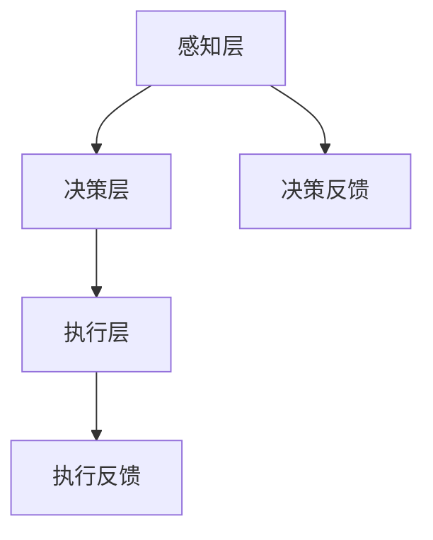

                 

关键词：AI Agent，自主决策，伦理界限，技术发展，AI伦理

摘要：随着人工智能技术的飞速发展，AI Agent作为一种具有自主决策能力的智能体，正逐渐成为研究与应用的热点。本文将深入探讨AI Agent的核心概念、算法原理、数学模型、项目实践以及未来发展趋势，并围绕自主决策与人类伦理界限这一关键话题进行深入分析。

## 1. 背景介绍

人工智能（AI）技术的发展历经数十年，从最初的规则推理、知识表示，到后来的机器学习、深度学习，每一阶段的技术进步都为AI Agent的诞生奠定了基础。AI Agent是一种具有自主决策能力的智能体，能够在复杂的动态环境中自主选择行动，以实现特定目标。

近年来，随着计算能力的提升、数据量的爆炸式增长以及算法的优化，AI Agent的应用领域不断扩展，从自动驾驶、智能客服，到金融投资、医疗诊断，AI Agent正在逐步改变我们的生活方式。然而，随着AI Agent的普及，如何确保其自主决策的伦理性和安全性成为了一个亟待解决的问题。

## 2. 核心概念与联系

### 2.1 AI Agent定义

AI Agent是指通过人工智能技术实现自主决策能力的实体，能够在给定环境中自主感知、规划、执行和评估行动，以实现特定目标。AI Agent通常由感知模块、决策模块和执行模块组成。

### 2.2 AI Agent架构

AI Agent的架构通常分为三层：

1. **感知层**：负责从环境中获取信息，如传感器、摄像头、GPS等。
2. **决策层**：根据感知层提供的信息，利用算法进行决策，如强化学习、规划算法等。
3. **执行层**：根据决策层的指令执行具体的行动，如电机控制、机器人运动等。

### 2.3 AI Agent与人类伦理界限

AI Agent的自主决策能力带来了巨大的便利，但同时也引发了伦理争议。如何确保AI Agent的决策符合人类伦理标准，避免对人类造成伤害，成为了一个重要课题。

### 2.4 Mermaid 流程图

以下是一个简单的Mermaid流程图，展示了AI Agent的架构：



## 3. 核心算法原理 & 具体操作步骤

### 3.1 算法原理概述

AI Agent的核心算法主要包括：

1. **强化学习**：通过与环境交互，不断优化策略，实现自主决策。
2. **规划算法**：基于目标，生成最优行动序列。
3. **混合智能**：结合多种算法，实现更高效的决策。

### 3.2 算法步骤详解

#### 3.2.1 强化学习

1. **初始化**：设定初始状态`S0`，初始化策略`π`。
2. **环境互动**：根据当前策略，选择行动`A`，与环境交互。
3. **状态转移**：根据环境反馈，更新状态`S`。
4. **奖励评估**：计算奖励`R`，根据奖励调整策略。
5. **迭代优化**：重复步骤2-4，不断优化策略。

#### 3.2.2 规划算法

1. **目标设定**：明确任务目标。
2. **环境建模**：建立环境模型，包括状态空间、行动空间等。
3. **生成行动序列**：根据目标，生成多个可能的行动序列。
4. **评估行动序列**：计算每个行动序列的期望收益。
5. **选择最优行动序列**：根据评估结果，选择最优行动序列。

#### 3.2.3 混合智能

1. **算法选择**：根据任务特点，选择合适的算法。
2. **算法融合**：将多个算法的结果进行融合，形成统一的决策。
3. **动态调整**：根据环境变化，动态调整算法权重。

### 3.3 算法优缺点

- **强化学习**：灵活性强，适合动态环境，但收敛速度较慢。
- **规划算法**：计算效率高，但需要精确的环境模型。
- **混合智能**：结合了多种算法的优势，但实现复杂。

### 3.4 算法应用领域

- **自动驾驶**：利用强化学习进行路径规划。
- **智能家居**：利用规划算法实现自动控制。
- **金融投资**：利用混合智能进行风险控制。

## 4. 数学模型和公式 & 详细讲解 & 举例说明

### 4.1 数学模型构建

AI Agent的数学模型主要包括：

1. **马尔可夫决策过程（MDP）**：描述AI Agent与环境的交互。
2. **策略迭代**：优化AI Agent的策略。
3. **价值迭代**：计算状态值和行动值。

### 4.2 公式推导过程

1. **状态转移概率**：
   $$ P(S'|S,A) = P(S'|A|S)P(A|S) $$

2. **期望奖励**：
   $$ R(S,A) = \sum_{S'} P(S'|S,A)R(S') $$

3. **策略迭代**：
   $$ π'(A|S) = \arg\max_{A} \sum_{S'} P(S'|S,A)R(S') + \gamma \sum_{S'} P(S'|S,A)V(S') $$

4. **价值迭代**：
   $$ V'(S) = \sum_{A} π'(A|S)R(S,A) + \gamma \sum_{S'} P(S'|S,A)V'(S') $$

### 4.3 案例分析与讲解

#### 4.3.1 自动驾驶

自动驾驶中的AI Agent需要根据道路状况、车辆速度、行人行为等数据进行决策。以下是一个简单的自动驾驶场景：

- **状态空间**：包括当前车辆位置、速度、方向等。
- **行动空间**：包括加速、减速、保持速度等。

利用MDP模型，我们可以计算出每个状态下的最优行动策略。例如，在当前车辆前方有行人通过时，AI Agent会选择减速或停车。

#### 4.3.2 智能家居

智能家居中的AI Agent需要根据用户习惯、环境变化等数据进行决策。以下是一个简单的智能家居场景：

- **状态空间**：包括室内温度、湿度、光照等。
- **行动空间**：包括开灯、关灯、调节空调等。

利用规划算法，我们可以生成最优的行动序列，以实现室内环境的舒适控制。

## 5. 项目实践：代码实例和详细解释说明

### 5.1 开发环境搭建

首先，我们需要搭建一个适合AI Agent开发的实验环境。以下是一个简单的Python开发环境搭建步骤：

1. 安装Python 3.8及以上版本。
2. 安装必要的库，如numpy、pandas、tensorflow等。

### 5.2 源代码详细实现

以下是一个简单的AI Agent实现示例，用于在模拟环境中进行强化学习：

```python
import numpy as np
import gym

# 初始化环境
env = gym.make('CartPole-v0')

# 初始化策略参数
action_size = env.action_space.n
state_size = env.observation_space.shape[0]
learning_rate = 0.1
gamma = 0.99

# 初始化Q值表
Q = np.zeros((state_size, action_size))

# 强化学习循环
for episode in range(1000):
    state = env.reset()
    done = False
    total_reward = 0

    while not done:
        # 选择行动
        action = np.argmax(Q[state, :])

        # 执行行动
        next_state, reward, done, _ = env.step(action)

        # 更新Q值
        Q[state, action] = Q[state, action] + learning_rate * (reward + gamma * np.max(Q[next_state, :]) - Q[state, action])

        state = next_state
        total_reward += reward

    print(f"Episode {episode}: Total Reward = {total_reward}")

# 关闭环境
env.close()
```

### 5.3 代码解读与分析

上述代码实现了一个简单的基于Q学习的AI Agent，用于解决CartPole问题。关键步骤包括：

1. **环境初始化**：创建一个CartPole环境。
2. **策略初始化**：初始化Q值表，用于存储状态-行动值。
3. **强化学习循环**：循环执行以下步骤：
   - 选择行动
   - 执行行动
   - 更新Q值
   - 更新状态

通过不断迭代，AI Agent能够逐渐学会在CartPole环境中稳定地保持平衡。

### 5.4 运行结果展示

运行上述代码，AI Agent将在1000个回合中进行训练，并在每个回合中输出总奖励。通过多次训练，AI Agent将学会在CartPole环境中稳定地保持平衡，达到预期目标。

## 6. 实际应用场景

### 6.1 自动驾驶

自动驾驶是AI Agent的一个重要应用领域。通过感知环境、规划路径、执行决策，AI Agent能够实现车辆的自动驾驶。未来，自动驾驶技术有望改变人们的出行方式，提高交通安全和效率。

### 6.2 智能客服

智能客服是AI Agent在服务领域的应用。通过自然语言处理和对话管理技术，AI Agent能够与用户进行智能对话，提供高效的客户服务。智能客服的应用场景包括在线客服、电话客服等，能够大幅降低人力成本，提高服务效率。

### 6.3 医疗诊断

AI Agent在医疗领域的应用日益广泛。通过图像识别、自然语言处理等技术，AI Agent能够辅助医生进行疾病诊断、治疗方案推荐等。例如，AI Agent可以通过分析影像数据，帮助医生快速准确地诊断肺癌，提高诊疗效率。

## 7. 工具和资源推荐

### 7.1 学习资源推荐

- 《深度学习》（Goodfellow, Bengio, Courville）：经典深度学习教材。
- 《强化学习》（ Sutton, Barto）：系统介绍强化学习理论。
- 《Python编程：从入门到实践》（Eric Matthes）：Python编程入门教材。

### 7.2 开发工具推荐

- TensorFlow：开源深度学习框架，适合进行AI Agent开发。
- Keras：基于TensorFlow的高层次API，方便快速搭建模型。
- OpenAI Gym：开源环境库，提供多种标准环境，适合进行AI Agent实验。

### 7.3 相关论文推荐

- “Deep Learning for Autonomous Navigation”（2016）：介绍深度学习在自动驾驶中的应用。
- “Reinforcement Learning: An Introduction”（2018）：系统介绍强化学习理论。
- “A Theoretical Framework for Meta-Learning”（2017）：介绍元学习理论。

## 8. 总结：未来发展趋势与挑战

### 8.1 研究成果总结

近年来，AI Agent技术取得了显著进展，应用领域不断扩展。通过强化学习、规划算法、混合智能等技术，AI Agent在动态环境中实现了自主决策。同时，深度学习、自然语言处理等技术的进步，为AI Agent的发展提供了强大的支持。

### 8.2 未来发展趋势

1. **算法优化**：提高算法的效率和鲁棒性，适应更复杂的应用场景。
2. **跨领域融合**：结合多学科知识，实现AI Agent在不同领域的应用。
3. **伦理与法规**：制定相关伦理和法规，确保AI Agent的决策符合人类伦理标准。

### 8.3 面临的挑战

1. **数据隐私**：如何保护用户隐私，防止数据泄露。
2. **决策透明性**：如何提高AI Agent决策的透明性，便于人类理解。
3. **计算资源**：如何降低AI Agent的硬件和计算资源需求。

### 8.4 研究展望

随着技术的不断进步，AI Agent将在更多领域发挥作用，推动人工智能技术的普及。同时，伦理和法律问题将成为研究的重要方向，确保AI Agent的发展符合人类价值观和利益。

## 9. 附录：常见问题与解答

### 9.1 AI Agent是什么？

AI Agent是指通过人工智能技术实现自主决策能力的实体，能够在给定环境中自主选择行动，以实现特定目标。

### 9.2 AI Agent有哪些应用领域？

AI Agent的应用领域广泛，包括自动驾驶、智能客服、医疗诊断、智能家居等。

### 9.3 如何确保AI Agent的决策伦理？

确保AI Agent的决策伦理需要从算法设计、数据采集、模型训练等多个方面进行综合考虑，制定相应的伦理准则和法规。

### 9.4 AI Agent与人类伦理界限如何界定？

AI Agent的自主决策能力带来了伦理争议，如何界定AI Agent与人类伦理界限需要从具体应用场景、技术发展、法律法规等多个方面进行综合考虑。

---

作者：禅与计算机程序设计艺术 / Zen and the Art of Computer Programming
----------------------------------------------------------------

以上就是本文的完整内容，涵盖了AI Agent的核心概念、算法原理、数学模型、项目实践以及未来发展趋势。希望通过本文，能够帮助读者深入了解AI Agent技术，并关注其在伦理和安全方面的挑战。在未来，随着技术的不断进步，AI Agent将为我们的生活带来更多便利和创新。

