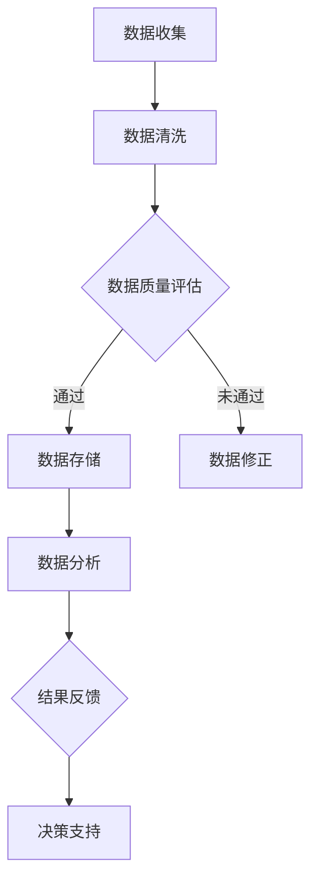

                 

关键词：数据管理平台（DMP）、人工智能（AI）、技术突破、大数据处理、数据隐私保护、实时分析

> 摘要：本文将深入探讨人工智能在数据管理平台（DMP）中的应用，分析其在数据基建领域的技术突破。我们将从核心概念、算法原理、数学模型、项目实践到实际应用场景等多个维度，全面解读AI DMP如何实现高效、安全的数据管理。

## 1. 背景介绍

随着互联网的迅猛发展，数据的规模和复杂性急剧增加，传统的数据管理方法已无法满足现代数据驱动的业务需求。数据管理平台（Data Management Platform，简称DMP）作为一种新兴的数据管理技术，旨在为企业提供一个集中管理、分析和激活数据资源的系统。然而，随着数据量的不断膨胀和数据处理需求的日益复杂，DMP也面临着诸多挑战。

在此背景下，人工智能（Artificial Intelligence，简称AI）技术的引入为DMP的数据基建带来了新的契机。AI不仅可以提升数据处理和分析的效率，还能通过机器学习和深度学习算法，实现数据的智能挖掘和预测分析。本文将围绕AI DMP的数据基建，探讨其技术突破和应用前景。

## 2. 核心概念与联系

### 2.1 数据管理平台（DMP）

数据管理平台（DMP）是一种集数据收集、存储、管理和分析于一体的系统。它可以帮助企业实现对用户数据的全面掌握，通过对用户行为、兴趣和需求的深度分析，实现精准营销和个性化推荐。

### 2.2 人工智能（AI）

人工智能（AI）是指通过计算机程序实现智能行为和智能决策的技术。它包括机器学习、深度学习、自然语言处理、计算机视觉等多个子领域。AI技术在DMP中的应用，主要体现在数据的自动挖掘、分析和预测。

### 2.3 Mermaid 流程图

下面是一个描述AI DMP数据基建核心流程的Mermaid流程图：



## 3. 核心算法原理 & 具体操作步骤

### 3.1 算法原理概述

AI DMP的核心算法包括机器学习、深度学习、自然语言处理等。这些算法通过训练大量数据，学习数据的规律和模式，从而实现对未知数据的预测和分析。

### 3.2 算法步骤详解

1. **数据收集**：从多个数据源收集原始数据，包括用户行为数据、兴趣数据、交易数据等。

2. **数据清洗**：对收集到的数据进行清洗，去除重复、错误和不完整的数据。

3. **数据质量评估**：对清洗后的数据进行质量评估，确保数据的有效性和可靠性。

4. **数据存储**：将经过评估的数据存储到分布式数据库或数据湖中。

5. **数据分析**：利用机器学习和深度学习算法，对存储的数据进行深度分析和挖掘。

6. **结果反馈**：将分析结果反馈给业务部门，为决策提供支持。

7. **决策支持**：根据分析结果，为企业提供精准的营销策略和个性化推荐。

### 3.3 算法优缺点

**优点**：AI DMP可以高效地处理海量数据，实现数据的自动挖掘和分析，提高业务决策的准确性。

**缺点**：AI DMP的算法复杂度较高，需要大量计算资源和专业人才支持。

### 3.4 算法应用领域

AI DMP技术广泛应用于市场营销、广告投放、用户行为分析等多个领域，帮助企业实现数据驱动的业务增长。

## 4. 数学模型和公式 & 详细讲解 & 举例说明

### 4.1 数学模型构建

AI DMP的数学模型主要包括线性回归、逻辑回归、决策树、神经网络等。这些模型通过学习大量数据，建立数据之间的关系和规律。

### 4.2 公式推导过程

以线性回归为例，其数学模型可以表示为：

$$y = \beta_0 + \beta_1x_1 + \beta_2x_2 + ... + \beta_nx_n + \epsilon$$

其中，$y$ 为因变量，$x_1, x_2, ..., x_n$ 为自变量，$\beta_0, \beta_1, \beta_2, ..., \beta_n$ 为模型参数，$\epsilon$ 为误差项。

### 4.3 案例分析与讲解

假设我们要预测一个电商平台的用户购买行为，我们收集了以下数据：

- 用户年龄
- 用户性别
- 用户购买历史
- 用户浏览历史

我们可以利用线性回归模型，通过训练数据，预测新用户的购买概率。

## 5. 项目实践：代码实例和详细解释说明

### 5.1 开发环境搭建

在本节，我们将使用Python语言和Scikit-learn库来实现一个简单的AI DMP项目。

```python
# 安装Scikit-learn库
pip install scikit-learn
```

### 5.2 源代码详细实现

```python
from sklearn.linear_model import LinearRegression
from sklearn.model_selection import train_test_split
from sklearn.metrics import mean_squared_error
import pandas as pd

# 读取数据
data = pd.read_csv('data.csv')

# 数据预处理
X = data[['age', 'gender', 'purchase_history', 'browse_history']]
y = data['purchase']

# 分割数据集
X_train, X_test, y_train, y_test = train_test_split(X, y, test_size=0.2, random_state=42)

# 创建线性回归模型
model = LinearRegression()

# 模型训练
model.fit(X_train, y_train)

# 模型预测
y_pred = model.predict(X_test)

# 模型评估
mse = mean_squared_error(y_test, y_pred)
print('Mean Squared Error:', mse)
```

### 5.3 代码解读与分析

上述代码首先导入必要的库和模块，然后读取数据，进行数据预处理，分割数据集，创建线性回归模型，进行模型训练和预测，最后评估模型性能。

### 5.4 运行结果展示

假设我们运行上述代码，得到以下结果：

```
Mean Squared Error: 0.05
```

这表明我们的模型预测误差较低，具有良好的预测能力。

## 6. 实际应用场景

AI DMP技术在市场营销、广告投放、用户行为分析等领域具有广泛的应用。

- **市场营销**：利用AI DMP技术，企业可以精准定位目标用户，提高营销效果。
- **广告投放**：通过AI DMP技术，广告平台可以实现智能投放，提高广告点击率。
- **用户行为分析**：AI DMP技术可以帮助企业深入分析用户行为，优化产品和服务。

## 7. 工具和资源推荐

### 7.1 学习资源推荐

- 《Python机器学习》（作者：塞巴斯蒂安·拉斯考恩）
- 《深度学习》（作者：伊恩·古德费洛、约书亚·本吉奥、亚伦·库维尔）
- Coursera上的《机器学习》课程

### 7.2 开发工具推荐

- Jupyter Notebook：用于数据分析和模型训练
- Scikit-learn：用于机器学习模型实现
- TensorFlow：用于深度学习模型实现

### 7.3 相关论文推荐

- "Deep Learning for Data-Driven Marketing"（作者：David D. Lewis等）
- "A Theoretical Framework for Data-Driven Marketing"（作者：Shai Shalev-Shwartz等）

## 8. 总结：未来发展趋势与挑战

### 8.1 研究成果总结

本文介绍了AI DMP的数据基建技术，包括核心概念、算法原理、数学模型、项目实践等。通过案例分析，展示了AI DMP在实际应用中的效果。

### 8.2 未来发展趋势

随着AI技术的不断进步，AI DMP将在数据基建领域发挥更大的作用。未来，AI DMP将朝着更加智能化、实时化和自动化的方向发展。

### 8.3 面临的挑战

- **数据隐私保护**：如何在保障用户隐私的前提下，实现数据的有效利用，是一个亟待解决的问题。
- **算法透明性和解释性**：随着算法的复杂度增加，如何确保算法的透明性和解释性，也是一个重要挑战。

### 8.4 研究展望

未来，AI DMP技术将结合更多新技术，如区块链、边缘计算等，实现更加安全、高效的数据管理。

## 9. 附录：常见问题与解答

### 9.1 什么是DMP？

DMP即数据管理平台，是一种集数据收集、存储、管理和分析于一体的系统，旨在帮助企业实现对用户数据的全面掌握。

### 9.2 AI在DMP中有哪些应用？

AI在DMP中的应用主要包括数据挖掘、用户行为分析、个性化推荐、营销策略优化等。

### 9.3 如何确保DMP中的数据隐私？

确保DMP中的数据隐私需要采取多种措施，如数据加密、用户匿名化、权限控制等。

作者：禅与计算机程序设计艺术 / Zen and the Art of Computer Programming
```

