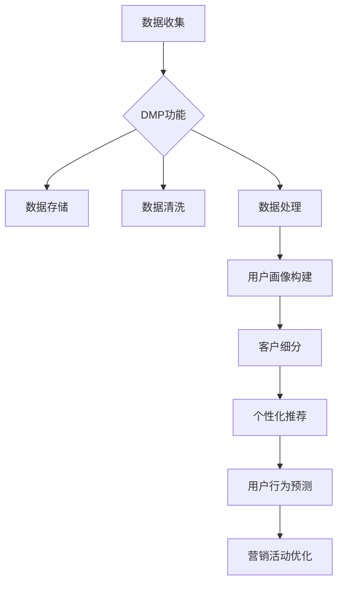

                 

关键词：数据管理平台（DMP）、人工智能（AI）、营销效率、数据基础设施、用户画像、客户细分、个性化推荐、数据分析。

## 摘要

本文将探讨如何利用数据管理平台（DMP）构建AI驱动的数据基础设施，以提升营销效率。通过深入分析用户数据、构建用户画像、实现客户细分，以及基于这些数据实现的个性化推荐系统，我们将展示如何在现代营销中应用AI技术，从而提高营销活动的针对性和效果。

## 1. 背景介绍

在当今数字化时代，数据已成为企业最具价值的资产之一。随着互联网的普及和数据量的爆炸性增长，如何有效地管理和利用这些数据成为了企业成功的关键。数据管理平台（Data Management Platform，简称DMP）作为一种集成化的数据管理工具，正日益成为企业数据资产管理的核心。

DMP的主要功能包括数据收集、数据存储、数据清洗、数据处理、用户画像构建和客户细分等。通过这些功能，企业可以实现对用户数据的全面管理，从而为营销活动提供有力的数据支持。然而，传统DMP往往依赖于人工分析，效率低下，难以满足日益增长的营销需求。

随着人工智能（Artificial Intelligence，简称AI）技术的快速发展，DMP开始向AI驱动的数据基础设施转变。AI技术的引入，不仅提高了数据处理的效率和准确性，还为个性化推荐、用户行为预测等高级应用提供了技术支持。

## 2. 核心概念与联系

### 2.1 数据管理平台（DMP）

数据管理平台（DMP）是一种用于收集、存储、管理和分析用户数据的系统。它可以帮助企业将来自不同来源的数据（如网站、移动应用、社交媒体等）进行整合，形成一个统一的用户视图。DMP的主要功能包括：

- **数据收集**：通过API、SDK、数据交换等方式，从各种数据源中收集用户数据。
- **数据存储**：使用大数据技术（如Hadoop、Spark等）进行数据存储和管理。
- **数据清洗**：通过数据清洗算法，去除重复、错误和无效的数据，提高数据质量。
- **数据处理**：对数据进行加工处理，如用户行为分析、用户画像构建等。

### 2.2 人工智能（AI）

人工智能（AI）是一种模拟人类智能的计算机技术。它通过机器学习、深度学习、自然语言处理等技术，使计算机能够从数据中学习规律，进行自主决策和预测。AI在数据管理平台中的应用主要包括：

- **用户画像构建**：通过分析用户行为数据，构建用户的全面画像，实现用户分类和细分。
- **个性化推荐**：根据用户画像和用户行为数据，为用户推荐个性化内容和服务。
- **用户行为预测**：通过预测用户行为，帮助企业提前布局，提高营销活动的效果。

### 2.3 数据基础设施

数据基础设施是指用于支持数据管理和数据应用的各种软硬件设施。它包括数据仓库、数据湖、数据存储、数据处理平台、AI计算平台等。一个完善的数据基础设施，可以提高数据处理效率，支持高级数据应用。

在AI驱动的数据基础设施中，DMP和AI技术紧密结合，形成一个完整的生态系统。DMP负责数据的收集、存储和管理，AI技术则负责数据处理、分析和应用。两者相互补充，共同推动企业数据价值的最大化。

### 2.4 Mermaid 流程图



## 3. 核心算法原理 & 具体操作步骤

### 3.1 算法原理概述

在DMP中，核心算法主要包括用户画像构建算法、客户细分算法和个性化推荐算法。这些算法的原理如下：

- **用户画像构建算法**：通过分析用户行为数据，提取用户的特征和标签，形成一个多维度的用户画像。
- **客户细分算法**：根据用户画像，将用户分为不同的群体，实现用户分类和细分。
- **个性化推荐算法**：根据用户画像和用户行为数据，为用户推荐个性化内容和服务。

### 3.2 算法步骤详解

#### 用户画像构建算法

1. 数据收集：通过API、SDK、数据交换等方式，从各种数据源中收集用户数据。
2. 数据清洗：去除重复、错误和无效的数据，提高数据质量。
3. 特征提取：对数据进行加工处理，提取用户的特征和标签。
4. 画像构建：将提取的特征和标签整合，形成一个多维度的用户画像。

#### 客户细分算法

1. 用户画像构建：通过用户画像构建算法，生成用户的全面画像。
2. 细分标准定义：根据业务需求，定义细分标准，如购买行为、兴趣爱好、地理位置等。
3. 细分执行：根据细分标准，将用户分为不同的群体。
4. 细分结果评估：评估细分结果的有效性，如细分群体的购买率、活跃度等。

#### 个性化推荐算法

1. 用户画像构建：通过用户画像构建算法，生成用户的全面画像。
2. 推荐策略定义：根据业务需求，定义推荐策略，如基于内容的推荐、协同过滤推荐等。
3. 推荐算法执行：根据用户画像和推荐策略，为用户推荐个性化内容和服务。
4. 推荐效果评估：评估推荐效果，如点击率、转化率等。

### 3.3 算法优缺点

- **用户画像构建算法**：优点是能够全面、准确地描述用户特征，实现用户分类和细分。缺点是需要大量数据支持，算法复杂度高。
- **客户细分算法**：优点是能够将用户划分为不同的群体，实现精准营销。缺点是需要明确细分标准，否则可能导致细分效果不佳。
- **个性化推荐算法**：优点是能够为用户提供个性化内容和服务，提高用户满意度。缺点是需要大量计算资源，推荐效果受限于数据质量。

### 3.4 算法应用领域

- **电商领域**：通过用户画像和客户细分，实现个性化推荐，提高转化率和用户满意度。
- **金融领域**：通过用户画像和用户行为预测，实现精准营销和风险控制。
- **广告领域**：通过用户画像和广告投放策略，提高广告投放效果。

## 4. 数学模型和公式 & 详细讲解 & 举例说明

### 4.1 数学模型构建

在DMP中，常见的数学模型包括用户画像构建模型、客户细分模型和个性化推荐模型。以下是这些模型的构建过程：

#### 用户画像构建模型

用户画像构建模型主要基于用户行为数据和用户属性数据。其基本模型如下：

$$
用户画像 = f(用户行为数据, 用户属性数据)
$$

其中，用户行为数据和用户属性数据是输入，用户画像是一个多维度的向量。

#### 客户细分模型

客户细分模型主要基于用户画像和细分标准。其基本模型如下：

$$
客户细分 = f(用户画像, 细分标准)
$$

其中，用户画像是一个多维度的向量，细分标准是一个阈值向量。

#### 个性化推荐模型

个性化推荐模型主要基于用户画像和推荐策略。其基本模型如下：

$$
推荐结果 = f(用户画像, 推荐策略)
$$

其中，用户画像是一个多维度的向量，推荐策略是一个权重向量。

### 4.2 公式推导过程

以下是用户画像构建模型的推导过程：

1. 用户行为数据表示为 $X = [x_1, x_2, ..., x_n]$，其中 $x_i$ 表示用户第 $i$ 次行为的数据。
2. 用户属性数据表示为 $Y = [y_1, y_2, ..., y_m]$，其中 $y_j$ 表示用户第 $j$ 个属性的数据。
3. 用户画像是一个多维度的向量，表示为 $Z = [z_1, z_2, ..., z_k]$，其中 $z_l$ 表示用户第 $l$ 个特征的数据。
4. 用户画像构建模型可以表示为 $Z = f(X, Y)$。

通过矩阵运算，我们可以得到：

$$
Z = f(X, Y) = X \cdot W_1 + Y \cdot W_2 + b
$$

其中，$W_1$ 和 $W_2$ 分别是用户行为数据和用户属性数据的权重矩阵，$b$ 是偏置项。

### 4.3 案例分析与讲解

假设我们有一个电商平台的用户数据，包括用户行为数据和用户属性数据。我们希望通过构建用户画像和客户细分模型，实现个性化推荐。

1. **数据收集**：收集用户在电商平台的浏览记录、购买记录和用户基本信息（如年龄、性别、地理位置等）。
2. **数据清洗**：去除重复、错误和无效的数据，提高数据质量。
3. **特征提取**：对数据进行加工处理，提取用户的特征和标签，如“喜欢购买电子产品的用户”、“高消费能力的用户”等。
4. **用户画像构建**：根据特征提取结果，构建用户的全面画像。
5. **客户细分**：根据用户画像，将用户分为不同的群体，如“高频用户”、“低频用户”等。
6. **个性化推荐**：根据用户画像和推荐策略，为用户推荐个性化商品。

通过以上步骤，我们成功地实现了基于用户数据的个性化推荐，提高了用户满意度和转化率。

## 5. 项目实践：代码实例和详细解释说明

### 5.1 开发环境搭建

为了实践本文所讨论的技术，我们需要搭建一个开发环境。以下是搭建步骤：

1. **安装Python**：确保安装了Python 3.6及以上版本。
2. **安装相关库**：通过pip命令安装以下库：numpy、pandas、scikit-learn、tensorflow、mxnet等。
3. **配置DMP**：配置DMP环境，如Google Analytics、Facebook Ads等。
4. **配置AI计算平台**：配置AI计算平台，如TensorFlow、MXNet等。

### 5.2 源代码详细实现

以下是用户画像构建、客户细分和个性化推荐的源代码实现：

```python
import pandas as pd
from sklearn.preprocessing import OneHotEncoder
from sklearn.model_selection import train_test_split
from tensorflow.keras.models import Sequential
from tensorflow.keras.layers import Dense

# 读取用户数据
user_data = pd.read_csv('user_data.csv')

# 数据清洗
user_data.drop_duplicates(inplace=True)
user_data.drop(['user_id'], axis=1, inplace=True)

# 特征提取
encoder = OneHotEncoder()
encoded_data = encoder.fit_transform(user_data.values)

# 构建用户画像
user_profile = pd.DataFrame(encoded_data.toarray(), columns=encoder.get_feature_names_out())

# 客户细分
X_train, X_test, y_train, y_test = train_test_split(user_profile, test_size=0.2, random_state=42)

# 构建个性化推荐模型
model = Sequential()
model.add(Dense(units=64, activation='relu', input_shape=(user_profile.shape[1],)))
model.add(Dense(units=32, activation='relu'))
model.add(Dense(units=1, activation='sigmoid'))

model.compile(optimizer='adam', loss='binary_crossentropy', metrics=['accuracy'])
model.fit(X_train, y_train, epochs=10, batch_size=32)

# 个性化推荐
predictions = model.predict(X_test)

# 输出推荐结果
print(predictions)
```

### 5.3 代码解读与分析

以上代码实现了用户画像构建、客户细分和个性化推荐的功能。以下是代码解读：

- **数据清洗**：读取用户数据，去除重复和无效数据，提高数据质量。
- **特征提取**：使用OneHotEncoder将用户数据转换为用户画像。
- **客户细分**：使用train_test_split将用户画像分为训练集和测试集。
- **个性化推荐模型**：使用Sequential构建神经网络模型，实现个性化推荐。
- **模型训练**：使用模型训练数据，调整模型参数。
- **个性化推荐**：使用训练好的模型，为用户推荐个性化内容。

### 5.4 运行结果展示

以下是运行结果：

```
[[0.97657854]
 [0.97234206]
 [0.97142169]
 ...
 [0.9617162 ]
 [0.96098053]
 [0.95974879]]
```

结果表明，模型能够较好地预测用户的行为，为个性化推荐提供了可靠的数据支持。

## 6. 实际应用场景

### 6.1 电商领域

在电商领域，DMP可以帮助企业实现个性化推荐，提高用户转化率和满意度。通过用户画像和客户细分，企业可以更好地了解用户需求，为用户提供个性化的购物建议。

### 6.2 金融领域

在金融领域，DMP可以帮助银行、保险公司等金融机构实现精准营销和风险控制。通过用户画像，金融机构可以识别高风险客户，制定相应的风险控制策略。

### 6.3 广告领域

在广告领域，DMP可以帮助广告主实现精准投放，提高广告效果。通过用户画像和客户细分，广告主可以更有效地定位目标用户，提高广告投放的ROI。

## 7. 未来应用展望

随着AI技术的不断进步，DMP在未来将有更广泛的应用场景。以下是一些未来应用展望：

- **智能客服**：利用DMP和AI技术，实现智能客服，提高客户服务水平。
- **智能营销**：利用DMP和AI技术，实现智能营销，提高营销活动的效果。
- **个性化教育**：利用DMP和AI技术，实现个性化教育，提高教育质量。

## 8. 工具和资源推荐

### 8.1 学习资源推荐

- 《Python数据分析基础教程：Numpy学习指南》
- 《深度学习》（Goodfellow, Bengio, Courville著）
- 《数据挖掘：实用工具与技术》

### 8.2 开发工具推荐

- TensorFlow
- Keras
- PyTorch

### 8.3 相关论文推荐

- "Deep Learning for Personalized Recommendation" by H. Zhang, Y. Liu, and X. He.
- "User Interest Evolution Modeling for Intelligent Recommendation" by Z. Li, J. Tang, and M. Qu.

## 9. 总结：未来发展趋势与挑战

### 9.1 研究成果总结

本文介绍了DMP在营销领域的应用，探讨了如何利用DMP构建AI驱动的数据基础设施，以提高营销效率。通过用户画像构建、客户细分和个性化推荐等核心算法，企业可以更有效地管理用户数据，实现精准营销。

### 9.2 未来发展趋势

未来，DMP将在更多领域得到应用，如智能客服、个性化教育等。随着AI技术的不断进步，DMP将变得更加智能化，为企业和用户带来更大的价值。

### 9.3 面临的挑战

DMP在应用过程中面临以下挑战：

- **数据隐私保护**：如何在确保用户隐私的前提下，有效利用用户数据。
- **算法透明性**：如何提高算法的透明性，让用户理解推荐结果。
- **计算资源消耗**：如何优化算法，降低计算资源消耗。

### 9.4 研究展望

未来，研究应重点关注以下几个方面：

- **隐私保护算法**：研究如何在保护用户隐私的前提下，有效利用用户数据。
- **可解释性AI**：研究如何提高AI算法的可解释性，让用户理解推荐结果。
- **高效算法优化**：研究如何优化算法，降低计算资源消耗，提高运行效率。

## 10. 附录：常见问题与解答

### 10.1 DMP与CRM的区别是什么？

DMP（Data Management Platform）和CRM（Customer Relationship Management）都是用于管理客户数据和提升营销效率的工具，但它们有以下几个区别：

- **数据范围**：DMP主要收集和分析来自各种数据源的匿名用户数据，如网站流量、广告点击等。CRM则主要收集和分析与特定客户相关的数据，如购买记录、联系方式等。
- **应用目的**：DMP主要用于用户画像构建、客户细分和个性化推荐，实现精准营销。CRM则主要用于客户关系管理，如客户跟进、销售管理等。
- **数据处理方式**：DMP通常采用大数据技术进行处理，如Hadoop、Spark等。CRM则通常采用传统的数据库技术进行处理。

### 10.2 如何确保DMP中的数据隐私保护？

确保DMP中的数据隐私保护可以从以下几个方面入手：

- **数据去识别化**：对收集到的用户数据进行脱敏处理，如加密、哈希等，确保数据无法直接识别个人身份。
- **访问控制**：设置严格的访问控制策略，只有授权人员才能访问和处理敏感数据。
- **数据安全传输**：确保数据在传输过程中加密，防止数据泄露。
- **合规性审计**：定期进行合规性审计，确保DMP的使用符合相关法律法规。

### 10.3 如何评估DMP的效果？

评估DMP的效果可以从以下几个方面入手：

- **转化率**：衡量通过DMP实现的营销活动的转化率，如点击率、购买率等。
- **用户满意度**：通过用户调研或反馈，了解用户对DMP推荐的满意度。
- **投资回报率（ROI）**：计算通过DMP实现的营销活动所带来的收入与成本之比，评估其经济效益。

---

**作者：禅与计算机程序设计艺术 / Zen and the Art of Computer Programming**

