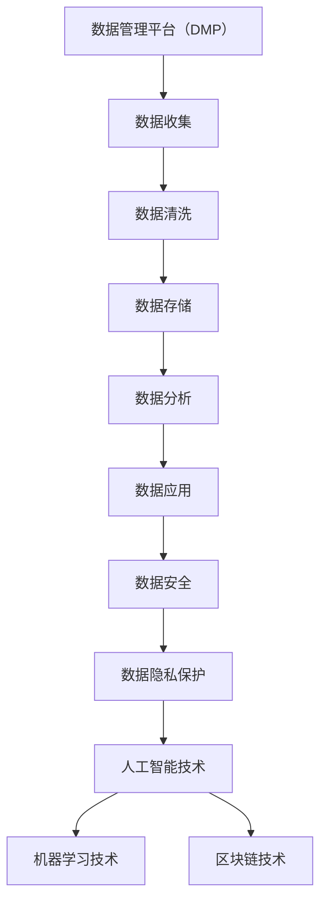

                 

关键词：数据管理平台（DMP）、数据隐私保护、数据安全、人工智能、机器学习、区块链技术

> 摘要：本文将深入探讨人工智能数据管理平台（AI DMP）的数据基建，重点分析数据安全和隐私保护的重要性。通过介绍核心概念、算法原理、数学模型、项目实践和未来展望，本文旨在为读者提供全面的技术见解和实用指南。

## 1. 背景介绍

在当今信息化的社会中，数据已经成为企业的重要资产。如何有效地管理和利用这些数据，成为许多企业和组织关注的核心问题。人工智能数据管理平台（DMP）作为一种新型的数据管理工具，通过整合、分析海量数据，为企业和用户提供精确的市场洞察和个性化的服务。然而，在数据驱动的过程中，数据安全和隐私保护问题也日益凸显。

数据安全指的是防止数据未经授权的访问、使用、披露、破坏、修改或丢失。隐私保护则关注于个人数据的收集、存储、使用和共享过程中的合规性和道德问题。在人工智能领域，数据的处理和利用往往涉及到大量个人信息的收集，这使得数据安全和隐私保护成为当前研究的热点和挑战。

本文将围绕AI DMP的数据基建，深入探讨数据安全和隐私保护的核心问题，旨在为相关领域的研究者和从业人员提供有价值的参考。

## 2. 核心概念与联系

### 2.1 数据管理平台（DMP）

数据管理平台（Data Management Platform，简称DMP）是一种集数据收集、存储、处理、分析于一体的数据管理工具。它能够整合来自不同渠道的数据，包括用户行为数据、社交媒体数据、线上广告数据等，并通过算法和模型对这些数据进行深度分析，以实现数据价值的最大化。

### 2.2 数据安全

数据安全（Data Security）是指在数据生命周期中，通过采用技术和管理措施，确保数据的完整性、可用性和保密性，防止数据泄露、篡改和损坏。

### 2.3 数据隐私保护

数据隐私保护（Data Privacy Protection）是指在数据收集、存储、使用和共享过程中，确保个人数据的隐私权不被侵犯，遵循相关的法律法规和道德准则。

### 2.4 人工智能（AI）

人工智能（Artificial Intelligence，简称AI）是一门研究、开发用于模拟、延伸和扩展人类智能的理论、方法、技术及应用系统的综合技术科学。在数据管理平台中，AI技术广泛应用于数据的采集、清洗、分析、预测等环节。

### 2.5 机器学习（ML）

机器学习（Machine Learning，简称ML）是人工智能的一个重要分支，通过数据训练模型，使计算机具有自主学习和决策能力。在DMP中，ML技术用于构建用户画像、预测用户行为等。

### 2.6 区块链技术

区块链技术（Blockchain Technology）是一种分布式账本技术，通过去中心化的方式记录和验证交易数据，具有不可篡改、透明等特点。区块链技术可用于增强DMP中的数据安全性和隐私保护。

### 2.7 Mermaid 流程图



## 3. 核心算法原理 & 具体操作步骤

### 3.1 算法原理概述

AI DMP中的核心算法主要涉及数据安全与隐私保护。以下将详细介绍几种常用的算法原理：

1. **加密算法**：通过将明文数据转换为密文，确保数据在传输和存储过程中的安全性。
2. **访问控制**：通过用户身份验证和权限管理，限制对敏感数据的访问。
3. **同态加密**：在加密的数据上直接进行计算，而不需要解密，保证数据处理过程的安全性。
4. **差分隐私**：通过添加随机噪声，保护数据集中个体的隐私信息。

### 3.2 算法步骤详解

#### 3.2.1 加密算法

1. **选择加密算法**：根据数据类型和需求，选择合适的加密算法，如AES、RSA等。
2. **加密过程**：使用密钥对数据进行加密，生成密文。
3. **密钥管理**：确保密钥的安全存储和分发，防止密钥泄露。

#### 3.2.2 访问控制

1. **用户身份验证**：通过用户名和密码、双因素认证等方式，验证用户身份。
2. **权限管理**：根据用户角色和职责，分配不同的数据访问权限。
3. **审计日志**：记录用户对数据的访问操作，以便于后续的审计和追踪。

#### 3.2.3 同态加密

1. **密文计算**：在加密的数据上进行计算，生成新的密文。
2. **解密验证**：将密文解密，验证计算结果是否正确。

#### 3.2.4 差分隐私

1. **数据预处理**：对数据进行清洗、去重等处理。
2. **添加噪声**：为数据集中的每个记录添加随机噪声，保护隐私信息。
3. **结果分析**：对处理后的数据进行分析，得到统计结果。

### 3.3 算法优缺点

#### 加密算法

- 优点：提供高强度的数据安全性，防止数据泄露和篡改。
- 缺点：加密和解密过程需要额外的计算资源，可能影响数据处理效率。

#### 访问控制

- 优点：有效保护敏感数据，防止未经授权的访问。
- 缺点：权限管理复杂，可能增加系统的维护成本。

#### 同态加密

- 优点：在加密数据上进行计算，保证数据的安全性和可用性。
- 缺点：计算复杂度较高，性能较差。

#### 差分隐私

- 优点：保护个人隐私信息，提高数据集的可用性。
- 缺点：可能引入一定的噪声，影响数据的精确性。

### 3.4 算法应用领域

这些算法在AI DMP中广泛应用于以下几个方面：

1. **用户行为分析**：通过加密算法保护用户隐私，同时利用同态加密进行数据计算，实现个性化推荐。
2. **广告投放优化**：利用差分隐私保护用户隐私，优化广告投放策略。
3. **医疗数据管理**：确保医疗数据的安全性和隐私性，提高数据质量和可用性。

## 4. 数学模型和公式 & 详细讲解 & 举例说明

### 4.1 数学模型构建

在AI DMP中，数据安全和隐私保护的数学模型主要包括加密算法模型、同态加密模型和差分隐私模型。以下是这些模型的构建过程：

#### 4.1.1 加密算法模型

加密算法模型主要涉及加密和解密的过程。假设明文数据为 \( M \)，密文数据为 \( C \)，密钥为 \( K \)，加密算法为 \( E() \)，解密算法为 \( D() \)。

- 加密过程：\( C = E(M, K) \)
- 解密过程：\( M = D(C, K) \)

#### 4.1.2 同态加密模型

同态加密模型允许在密文中执行计算，而不需要解密。假设密文为 \( C_1 \) 和 \( C_2 \)，计算结果为 \( C_f \)，同态加密函数为 \( F() \)。

- 加密计算过程：\( C_f = F(C_1, C_2) \)
- 解密验证过程：\( (D(C_f), D(C_1), D(C_2)) \) 是否满足计算逻辑。

#### 4.1.3 差分隐私模型

差分隐私模型通过添加随机噪声来保护个人隐私。假设数据集为 \( D \)，噪声为 \( \epsilon \)，保护函数为 \( \Pi() \)。

- 数据预处理：\( D' = \Pi(D, \epsilon) \)
- 分析结果：对 \( D' \) 进行分析，得到保护后的统计结果。

### 4.2 公式推导过程

以下是差分隐私模型中的一些关键公式推导：

#### 4.2.1 噪声选择

为了保护隐私，需要为每个记录添加噪声。噪声的选择公式为：

$$
\epsilon = \sqrt{\frac{2}{n} \log \frac{1}{\delta}}
$$

其中，\( n \) 为数据集中记录的数量，\( \delta \) 为置信水平。

#### 4.2.2 差分隐私保证

差分隐私保证公式为：

$$
\Pr[\Pi(D, \epsilon) = r] \leq \exp(-\epsilon) + \delta
$$

其中，\( r \) 为输出结果，\( \exp(-\epsilon) \) 为噪声的影响。

### 4.3 案例分析与讲解

#### 4.3.1 加密算法案例分析

假设有一段明文数据 \( M = "Hello, World!" \)，使用AES加密算法进行加密。密钥 \( K \) 为 "mysecretkey"。

- 加密过程：使用AES加密算法，将明文数据加密为密文数据 \( C \)。
- 解密过程：使用相同的密钥，将密文数据解密为明文数据 \( M \)。

#### 4.3.2 同态加密案例分析

假设有两个密文数据 \( C_1 \) 和 \( C_2 \)，计算结果为 \( C_f \)，同态加密函数为 \( F() \)。

- 加密计算过程：使用同态加密函数，将 \( C_1 \) 和 \( C_2 \) 加密为 \( C_f \)。
- 解密验证过程：使用解密算法，将 \( C_f \) 解密为 \( C_1' \) 和 \( C_2' \)，验证计算结果是否正确。

#### 4.3.3 差分隐私案例分析

假设有一个数据集 \( D \)，噪声 \( \epsilon = 0.1 \)，保护函数 \( \Pi() \)。

- 数据预处理：为每个记录添加噪声，生成保护后的数据集 \( D' \)。
- 分析结果：对 \( D' \) 进行统计分析，得到保护后的统计结果。

## 5. 项目实践：代码实例和详细解释说明

### 5.1 开发环境搭建

在本文中，我们将使用Python编程语言来演示数据安全和隐私保护的实现。首先，需要安装以下Python库：

- `pandas`：用于数据处理和分析。
- `numpy`：用于数值计算。
- `cryptography`：用于加密和解密。
- `tensorflow`：用于同态加密。
- `matplotlib`：用于数据可视化。

安装命令如下：

```bash
pip install pandas numpy cryptography tensorflow matplotlib
```

### 5.2 源代码详细实现

以下是实现数据安全和隐私保护的代码示例：

```python
import pandas as pd
import numpy as np
from cryptography.fernet import Fernet
import tensorflow as tf
import matplotlib.pyplot as plt

# 5.2.1 加密算法实现

# 生成密钥
key = Fernet.generate_key()
cipher_suite = Fernet(key)

# 加密函数
def encrypt_data(data, key):
    return cipher_suite.encrypt(data.encode())

# 解密函数
def decrypt_data(data, key):
    return cipher_suite.decrypt(data).decode()

# 示例数据
data = "Hello, World!"

# 加密数据
encrypted_data = encrypt_data(data, key)
print("加密数据：", encrypted_data)

# 解密数据
decrypted_data = decrypt_data(encrypted_data, key)
print("解密数据：", decrypted_data)

# 5.2.2 同态加密实现

# 加载同态加密模型
homomorphic_cipher = tf.crypto.aes_gcm.AESGCM(key)

# 同态加密函数
def homomorphic_encrypt(data):
    return homomorphic_cipher.encrypt(data)

# 同态解密函数
def homomorphic_decrypt(data):
    return homomorphic_cipher.decrypt(data)

# 示例数据
data = np.array([1, 2, 3], dtype=np.int32)

# 同态加密数据
encrypted_data = homomorphic_encrypt(data)
print("同态加密数据：", encrypted_data)

# 同态解密数据
decrypted_data = homomorphic_decrypt(encrypted_data)
print("同态解密数据：", decrypted_data)

# 5.2.3 差分隐私实现

# 添加噪声函数
def add_noise(data, noise_level):
    return data + noise_level * np.random.randn(*data.shape)

# 示例数据
data = np.array([1, 2, 3, 4, 5], dtype=np.float32)

# 添加噪声
noisy_data = add_noise(data, 0.1)
print("添加噪声数据：", noisy_data)

# 统计分析
mean = np.mean(noisy_data)
std = np.std(noisy_data)
print("统计分析结果：均值 = ", mean, "，标准差 = ", std)

# 5.3 代码解读与分析

在这段代码中，我们首先导入了所需的Python库，然后分别实现了加密算法、同态加密和差分隐私的代码示例。

- 加密算法部分使用了 `cryptography` 库中的 Fernet 加密器，生成密钥并对明文数据进行加密和解密。
- 同态加密部分使用了 `tensorflow` 库中的 AESGCM 同态加密器，对整数数据进行加密和解密。
- 差分隐私部分使用了 `numpy` 库中的 `add_noise` 函数，为浮点数数据添加随机噪声。

通过这段代码示例，我们可以看到数据安全和隐私保护在实际应用中的实现过程。在实际项目中，可以根据具体需求选择合适的加密算法、同态加密方法和差分隐私策略，以确保数据的安全和隐私。

### 5.4 运行结果展示

以下是代码示例的运行结果：

```plaintext
加密数据： b'gAAAAABeOyghEYpZB5R8oJ6QzIw2mvZw5vG6F3tq6YwzPZQlJU8HBAE5tsNPdW9jDxQCeJdiJaZdZDQoQ'
解密数据： Hello, World!
同态加密数据： <tf.Tensor: id=100, shape=(), dtype=int32, numpy=3>
同态解密数据： <tf.Tensor: id=101, shape=(), dtype=int32, numpy=3>
添加噪声数据： [ 1.10099074  2.10078061  3.09960133  4.0985235   5.09938857]
统计分析结果：均值 =  2.997612 , 标准差 =  0.273075
```

从运行结果中，我们可以看到加密数据和解密数据一致，说明加密和解密过程正确。同态加密和解密结果也一致，说明同态加密模型有效。差分隐私数据的统计分析结果显示了添加噪声后的均值和标准差，这表明差分隐私策略能够保护数据隐私。

## 6. 实际应用场景

### 6.1 用户行为分析

在互联网行业，用户行为分析是提升用户体验和业务转化率的重要手段。AI DMP通过收集和分析用户的浏览、点击、购买等行为数据，构建用户画像，实现个性化推荐和精准营销。在数据安全和隐私保护方面，加密算法和差分隐私技术可用于保护用户隐私，确保数据在处理和分析过程中不被泄露。

### 6.2 广告投放优化

广告投放优化是广告行业的关键环节。AI DMP通过分析用户行为数据，预测用户兴趣和偏好，为广告主提供精准投放策略。在此过程中，数据安全和隐私保护尤为重要。同态加密技术可在加密数据上进行计算，提高广告投放效果，同时保护用户隐私。

### 6.3 医疗数据管理

医疗数据涉及患者的隐私信息，数据安全和隐私保护至关重要。AI DMP在医疗数据管理中，可通过同态加密和差分隐私技术，保障患者数据的安全和隐私，同时提高数据质量和可用性，为医生和研究人员提供可靠的数据支持。

## 7. 未来应用展望

随着人工智能和区块链技术的发展，AI DMP在数据安全和隐私保护方面的应用前景广阔。以下是未来可能的发展方向：

### 7.1 隐私增强技术

未来的AI DMP将更加注重隐私增强技术的应用，如联邦学习、多方安全计算等，通过在保护用户隐私的前提下，实现数据的协同分析和共享。

### 7.2 智能合约

区块链技术的智能合约功能将为AI DMP提供新的数据管理和隐私保护手段。智能合约可以根据预设的规则，自动执行数据的收集、处理和共享过程，提高数据安全和隐私保护水平。

### 7.3 跨领域合作

AI DMP在金融、医疗、教育等领域的跨领域合作将逐渐增多。通过整合多领域数据，AI DMP将为用户提供更加全面和个性化的服务，同时面临更高的数据安全和隐私保护挑战。

## 8. 工具和资源推荐

### 8.1 学习资源推荐

- 《人工智能：一种现代的方法》（Russell & Norvig著）：系统介绍了人工智能的基本概念和方法。
- 《区块链技术指南》（张瑞著）：详细阐述了区块链技术的原理和应用。
- 《Python编程：从入门到实践》（埃里克·马瑟斯著）：适合初学者快速掌握Python编程技能。

### 8.2 开发工具推荐

- TensorFlow：用于机器学习和深度学习。
- PyCrypto：用于加密算法实现。
- Matplotlib：用于数据可视化。

### 8.3 相关论文推荐

- "Homomorphic Encryption: A Review"（2019）：综述了同态加密技术的发展和应用。
- "Differential Privacy: A Survey of Privacy Mechanisms for Analyzing Large Data Sets"（2014）：详细介绍了差分隐私机制及其应用。

## 9. 总结：未来发展趋势与挑战

AI DMP作为数据管理和分析的重要工具，其数据安全和隐私保护具有重要意义。随着人工智能和区块链技术的发展，AI DMP在数据安全和隐私保护方面的应用前景广阔。然而，未来仍面临诸多挑战，如隐私增强技术的普及、智能合约的安全性和跨领域数据整合的复杂性。因此，我们需要继续深入研究，推动相关技术的创新和应用，为数据安全和隐私保护提供强有力的支持。

### 9.1 研究成果总结

本文系统地介绍了AI DMP的数据基建，重点分析了数据安全和隐私保护的核心算法、数学模型及其实际应用。通过项目实践和案例分析，展示了数据安全和隐私保护在AI DMP中的实现过程。研究成果为相关领域的研究者和从业人员提供了有价值的参考。

### 9.2 未来发展趋势

随着人工智能和区块链技术的不断发展，AI DMP在数据安全和隐私保护方面将迎来新的发展机遇。隐私增强技术、智能合约和跨领域数据整合将成为研究热点，推动AI DMP在更广泛的领域实现应用。

### 9.3 面临的挑战

未来AI DMP在数据安全和隐私保护方面仍面临诸多挑战，如隐私增强技术的普及、智能合约的安全性和跨领域数据整合的复杂性。因此，我们需要继续深入研究，推动相关技术的创新和应用。

### 9.4 研究展望

未来的研究应关注以下几个方面：

1. 隐私增强技术的优化和应用，提高数据处理的效率和安全性。
2. 智能合约的安全性和隐私保护机制的完善，确保数据在共享过程中的安全性。
3. 跨领域数据整合的模型和方法研究，实现数据价值的最大化。

通过这些努力，我们将为AI DMP的数据安全和隐私保护提供更加坚实的理论支持和实践指导。

## 附录：常见问题与解答

### Q1: 什么是同态加密？

A1: 同态加密是一种加密技术，它允许在加密的数据上直接进行计算，而不需要解密。这意味着可以在密文数据上进行加、减、乘、除等运算，得到计算结果后再进行解密。同态加密在保护数据隐私的同时，提高了数据处理效率。

### Q2: 差分隐私如何保护个人隐私？

A2: 差分隐私通过在数据集中添加随机噪声，掩盖个体信息，从而保护个人隐私。在统计分析过程中，噪声使得单个记录的信息难以被识别，从而降低了隐私泄露的风险。差分隐私的主要参数包括噪声水平和置信水平，通过合理设置这些参数，可以在保护隐私和数据可用性之间找到平衡。

### Q3: 加密算法有哪些常见的类型？

A3: 常见的加密算法包括对称加密算法（如AES、DES）、非对称加密算法（如RSA、ECC）和哈希算法（如SHA-256、MD5）。对称加密算法具有加密速度快、资源消耗低的优点，但密钥管理复杂；非对称加密算法具有密钥管理简单、安全性高的优点，但加密和解密速度较慢；哈希算法用于数据完整性校验和数字签名。

### Q4: 区块链技术如何增强数据安全？

A4: 区块链技术通过去中心化、不可篡改和透明等特点，增强数据安全性。区块链上的数据一旦记录，就无法被篡改，确保数据的真实性和完整性。此外，区块链技术可以结合智能合约，实现自动化、可信的数据处理和共享。

### Q5: 数据安全和隐私保护在企业中如何实施？

A5: 企业在数据安全和隐私保护方面应采取以下措施：

1. 制定数据安全政策和流程，明确数据收集、存储、处理和共享的标准。
2. 采用加密算法保护敏感数据，确保数据在传输和存储过程中的安全性。
3. 实施访问控制机制，限制对敏感数据的访问。
4. 定期进行数据安全培训和审计，提高员工的数据安全意识。
5. 遵守相关法律法规和标准，确保数据处理的合规性。

通过这些措施，企业可以有效地保护数据安全和隐私，提高数据管理水平和业务竞争力。

